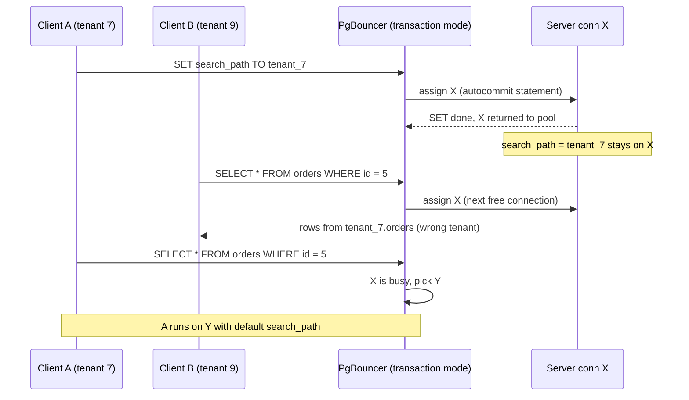
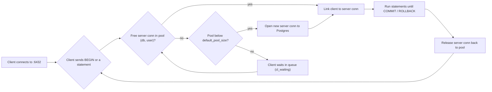

## Bối cảnh & vấn đề

Một team chạy API Node.js trên Kubernetes với 10 pod, mỗi pod dùng `pg.Pool` với `max: 20`. Tổng cộng tối đa 200 connection tới một Postgres có `max_connections = 300`. Mọi thứ ổn suốt nhiều tháng. Rồi đợt khuyến mãi tới, HPA (Horizontal Pod Autoscaler) scale lên 60 pod. Chỉ vài phút sau, log tràn ngập:

```text
error: sorry, too many clients already
    at Parser.parseErrorMessage (node_modules/pg-protocol/dist/parser.js:287:98)
FATAL:  remaining connection slots are reserved for roles with the SUPERUSER attribute
```

Điều đáng chú ý là kể cả những lúc **chưa** chạm trần, latency p99 đã tăng gấp ba. Scale thêm pod để "chịu tải tốt hơn" lại làm database chậm đi. Đây là một trong những incident kinh điển nhất với Postgres, và nó bắt nguồn từ một quyết định kiến trúc có từ những năm 1990: **mỗi connection là một OS process**.

Với nhiều database khác (MySQL dùng thread per connection, SQL Server dùng thread pool nội bộ), vài nghìn connection là chuyện bình thường. Với Postgres, vài nghìn connection **active** là công thức cho tranh chấp CPU, bộ nhớ và lock. Vì vậy trong hệ sinh thái Postgres, **connection pooler** (PgBouncer, RDS Proxy, pgcat, Supavisor) gần như là thành phần bắt buộc ở production, còn pool trong app (như `pg.Pool`) chỉ là lớp đầu tiên.

Bài này giải thích: vì sao connection đắt, pool trong app và pooler ngoài khác nhau thế nào, ba mode của PgBouncer và **những gì vỡ** ở transaction mode (đây là chỗ interviewer xoáy nhiều nhất), cách debug lỗi `prepared statement "s_12" does not exist`, và cách tính pool size bằng con số thay vì cảm tính.

## Khái niệm

### Process-per-connection và postmaster

Khi Postgres khởi động, process cha tên là **postmaster** lắng nghe trên port 5432. Mỗi khi một client kết nối, postmaster **fork** ra một process con gọi là **backend** để phục vụ riêng client đó suốt vòng đời connection. Backend thực hiện handshake, xác thực, rồi xử lý mọi câu SQL của client; khi client ngắt kết nối, process kết thúc.

Thiết kế này có lý do: process cô lập bộ nhớ, nên một backend bị crash (ví dụ do extension lỗi) không làm hỏng vùng nhớ riêng của backend khác, và postmaster có thể reset cluster một cách có kiểm soát. Cái giá là mỗi connection tốn **một process thật**: vài MB RAM riêng (catalog cache, plan cache, bộ đệm local) ngay cả khi idle, cộng thêm `work_mem` cho mỗi node sort/hash khi query chạy. Việc thiết lập connection mới cũng đắt: fork, TLS handshake, xác thực SCRAM, nạp catalog, thường mất vài ms tới vài chục ms.

Bạn có thể thấy từng backend trong `pg_stat_activity`:

```sql
SELECT pid, usename, application_name, state, backend_type
FROM pg_stat_activity
WHERE backend_type = 'client backend'
LIMIT 3;
```

```text
  pid  | usename | application_name | state  |  backend_type
-------+---------+------------------+--------+----------------
 41210 | api     | orders-api       | idle   | client backend
 41211 | api     | orders-api       | active | client backend
 41290 | api     | orders-api       | idle   | client backend
```

Mỗi `pid` ở đây là một process thật trên OS (`ps aux | grep postgres` sẽ thấy chúng).

**Interview angle:** interviewer muốn nghe bạn nối "process-per-connection" với hệ quả cụ thể (RAM, context switch, chi phí snapshot) thay vì chỉ nói "connection đắt".

### Vì sao hàng nghìn connection làm Postgres chậm

Có ba cơ chế chính. Thứ nhất là **context switch và CPU scheduling**: máy 16 core chỉ chạy được 16 process cùng lúc; nếu 800 backend đều đang active, OS phải liên tục chuyển qua lại giữa chúng, cache CPU bị xoá liên tục và thời gian thực làm việc giảm. Thêm connection không tạo thêm core, nó chỉ làm hàng đợi dài hơn.

Thứ hai là **chi phí lấy snapshot**. Mỗi câu query cần một snapshot MVCC (xem [MVCC & VACUUM](/tracks/sql-postgres/learn/mvcc-vacuum)): danh sách transaction đang chạy để biết row version nào nhìn thấy được. Để tạo snapshot, backend phải duyệt cấu trúc dùng chung chứa trạng thái của mọi backend. Càng nhiều backend thì việc này càng tốn và càng tranh chấp. PostgreSQL 14 đã cải thiện đáng kể khả năng scale của snapshot khi có nhiều connection idle (verify), nhưng nhiều connection **active** vẫn là vấn đề.

Thứ ba là **lock contention** trên các cấu trúc chia sẻ: lock manager, buffer mapping, WAL insertion. Khi hàng trăm backend cùng tranh một lightweight lock (LWLock), bạn sẽ thấy wait event như `LWLock:LockManager` hay `LWLock:WALInsert` trong `pg_stat_activity`, và throughput tổng **giảm** dù connection tăng. Đường cong throughput theo số connection thường tăng tới khoảng vài lần số core rồi đi ngang, sau đó đi xuống.

**Interview angle:** câu trả lời mạnh nói rõ "throughput đạt đỉnh ở số connection active cỡ vài lần số core; vượt qua đó chỉ tăng latency".

### Pool trong app (node-postgres Pool)

**Connection pool** là một tập connection được mở sẵn và tái sử dụng: thay vì mở connection mới cho mỗi request (tốn vài chục ms), code mượn một connection có sẵn, dùng xong trả lại. Trong Node.js, `pg.Pool` làm việc này bên trong một process. Ba tham số quan trọng nhất:

- `max` (mặc định 10): số connection tối đa mà pool này mở.
- `idleTimeoutMillis` (mặc định 10000): connection idle quá lâu sẽ bị đóng để trả tài nguyên cho DB.
- `connectionTimeoutMillis` (mặc định 0, tức **chờ vô hạn**): thời gian tối đa chờ để mượn được connection. Để 0 là nguy hiểm: khi pool cạn, request treo mãi thay vì fail nhanh.

```ts
import { Pool } from "pg";

export const pool = new Pool({
  connectionString: process.env.DATABASE_URL,
  max: 10,                        // per pod, not per cluster
  idleTimeoutMillis: 30_000,
  connectionTimeoutMillis: 2_000, // fail fast instead of hanging
  statement_timeout: 5_000,       // server-side guard per statement
});
```

Vấn đề của pool trong app là nó **chỉ biết về chính process của nó**. 60 pod × `max: 20` = 1.200 connection, và không pod nào biết pod kia đang giữ bao nhiêu. Pool trong app giải quyết chi phí mở connection, nhưng không giới hạn được **tổng** số connection tới DB.

**Interview angle:** interviewer hay hỏi "pool size là per pod hay per cluster?"; câu trả lời đúng là per process, nên tổng phải nhân với số pod (và số process mỗi pod nếu chạy cluster mode).

### Pooler ngoài: PgBouncer

**PgBouncer** là một process nhẹ (single-threaded, event-driven) đứng giữa app và Postgres, nói đúng giao thức của Postgres. App kết nối tới PgBouncer như thể đó là database; PgBouncer giữ một số nhỏ **server connection** thật tới Postgres và chia chúng cho rất nhiều **client connection**. Một client connection tới PgBouncer rất rẻ (vài KB), nên PgBouncer có thể nhận hàng nghìn client trong khi chỉ mở 20–50 server connection.

Khái niệm then chốt: PgBouncer quản lý pool theo cặp **(database, user)**. `default_pool_size` (mặc định 20) là số server connection tối đa cho **mỗi cặp**, `max_client_conn` (mặc định 100) là số client connection tối đa mà PgBouncer nhận. Nếu bạn có 3 database user khác nhau, bạn có 3 pool, mỗi pool tối đa `default_pool_size` connection.

```ini
; pgbouncer.ini
[databases]
orders = host=10.0.1.20 port=5432 dbname=orders

[pgbouncer]
listen_port = 6432
pool_mode = transaction
max_client_conn = 2000
default_pool_size = 40
reserve_pool_size = 5
reserve_pool_timeout = 3
server_idle_timeout = 60
max_prepared_statements = 200
```

**Interview angle:** nêu được "pool theo cặp database/user" cho thấy bạn đã vận hành PgBouncer thật, không chỉ đọc qua.

### Ba pooling mode: session, transaction, statement

**Session mode** (mặc định của PgBouncer): client được gán một server connection từ lúc kết nối tới lúc ngắt. Mọi tính năng Postgres hoạt động bình thường, nhưng lợi ích scale gần như không có: 1.000 client vẫn cần 1.000 server connection nếu tất cả cùng kết nối. Session mode chủ yếu giúp giảm chi phí mở connection (client ngắn hạn, ví dụ script PHP).

**Transaction mode**: client chỉ mượn server connection **trong một transaction**. Khi `COMMIT`/`ROLLBACK` xong (hoặc câu autocommit xong), server connection về pool và client khác có thể dùng. Vì phần lớn thời gian một client ở trạng thái idle giữa các transaction, vài chục server connection có thể phục vụ hàng nghìn client. Đây là mode phổ biến nhất ở production.

**Statement mode**: server connection được trả lại sau **mỗi câu lệnh**, nên transaction nhiều câu bị cấm. Mode này chỉ hợp với workload autocommit thuần (ví dụ PL/Proxy), hiếm khi dùng cho app thông thường.

**Interview angle:** câu hỏi quen thuộc là "vì sao transaction mode scale tốt hơn session mode?"; trả lời bằng tỉ lệ thời gian client thật sự nằm trong transaction.

### Session state và những gì vỡ trong transaction mode

**Session state** là mọi thứ Postgres gắn vào **connection** chứ không gắn vào transaction: giá trị `SET` (như `search_path`, `statement_timeout`, custom GUC như `app.tenant_id`), prepared statement tạo bằng `PREPARE`, session-level advisory lock, `LISTEN`, cursor `WITH HOLD`, temp table không có `ON COMMIT DROP`. Trong transaction mode, client A có thể chạy transaction 1 trên server connection X và transaction 2 trên server connection Y. State mà A để lại trên X sẽ **dính ở X**, và client B mượn X sau đó sẽ thừa hưởng nó.

Theo bảng tính năng chính thức của PgBouncer, transaction mode **không hỗ trợ**: `SET`/`RESET` ở mức session, `LISTEN`, SQL-level `PREPARE`/`DEALLOCATE`, `WITH HOLD` cursor, session-level advisory lock, temp table `PRESERVE/DELETE ROWS`. Temp table `ON COMMIT DROP` và **protocol-level prepared statement** (khi bật `max_prepared_statements`) thì được hỗ trợ.

Cách sửa cho `SET` là dùng **`SET LOCAL`** hoặc `set_config(name, value, true)`: giá trị chỉ sống tới hết transaction hiện tại, nên không thể rò sang client khác.

```sql
BEGIN;
SET LOCAL search_path TO tenant_42, public;
SELECT set_config('app.tenant_id', '42', true);  -- true = local to this transaction
SELECT * FROM orders WHERE id = 1001;
COMMIT;  -- both settings disappear here
```

**Interview angle:** red flag lớn nhất là nghĩ PgBouncer transaction mode "trong suốt" với app; interviewer muốn nghe ít nhất 3 tính năng bị phá và cách thay thế.

### Advisory lock: transaction-level vs session-level

**Advisory lock** là lock theo một số `bigint` do app tự định nghĩa, không gắn với row hay table nào (chi tiết ở [locking](/tracks/sql-postgres/learn/locking-concurrency)). Có hai loại: `pg_advisory_lock(key)` giữ ở mức **session** tới khi gọi `pg_advisory_unlock` hoặc connection đóng; `pg_advisory_xact_lock(key)` giữ tới hết **transaction** và tự nhả khi commit/rollback.

Sau PgBouncer transaction mode, session-level lock là cái bẫy: bạn lấy lock trên server connection X, transaction kết thúc, X về pool nhưng **lock vẫn còn trên X**. Lệnh unlock sau đó có thể chạy trên Y và báo `WARNING: you don't own a lock of type ExclusiveLock`, còn lock thật trên X bị kẹt cho tới khi X bị đóng. Dùng `pg_advisory_xact_lock` giải quyết triệt để vì lock và transaction có cùng vòng đời.

```sql
BEGIN;
SELECT pg_advisory_xact_lock(hashtext('tenant:42:recalc'));
-- do the exclusive work for tenant 42
COMMIT;  -- lock released automatically
```

**Interview angle:** interviewer thường hỏi tiếp về va chạm `hashtext()` (32-bit): nên dùng phiên bản hai tham số `pg_advisory_xact_lock(namespace int, id int)` hoặc tự thiết kế key 64-bit.

### Prepared statements: SQL-level vs protocol-level

Có hai loại prepared statement. **SQL-level** là lệnh `PREPARE s1 AS SELECT ...` rồi `EXECUTE s1(...)`. **Protocol-level** là khi driver gửi message `Parse` có tên trong extended query protocol; node-postgres làm việc này khi bạn truyền `name` trong query config. Cả hai đều lưu plan trên **server connection**, không phải trên client.

Trước PgBouncer 1.21, cả hai loại đều vỡ trong transaction mode: statement được `Parse` trên X, lần sau `Execute` chạy trên Y, và Y chưa bao giờ thấy statement đó. Từ **PgBouncer 1.21** có `max_prepared_statements`: khi đặt giá trị khác 0, PgBouncer theo dõi các protocol-level named prepared statement của client, và tự `Parse` lại trên server connection nào chưa có (với tên nội bộ riêng). Bản 1.21 mặc định là 0 (tắt), các bản mới hơn mặc định 200 (verify). SQL-level `PREPARE` thì vẫn không được hỗ trợ.

Lưu ý: query có tham số nhưng **không đặt tên** (`pool.query('... $1', [id])`) dùng unnamed statement, được Parse/Bind/Execute trong cùng một lượt nên chạy ổn trong transaction mode kể cả khi không bật tính năng này.

**Interview angle:** nói rõ "protocol-level thì PgBouncer 1.21+ xử lý được qua `max_prepared_statements`, SQL-level `PREPARE` thì không" là dấu hiệu kinh nghiệm thật.

### Các pooler khác: RDS Proxy, pgcat, pooler serverless

**RDS Proxy** là pooler managed của AWS cho RDS/Aurora. Nó multiplex connection ở mức transaction tương tự PgBouncer, nhưng khi phát hiện session state (ví dụ `SET` hoặc prepared statement trong một số trường hợp), nó **pin** client vào một connection riêng tới hết phiên, và lợi ích pooling biến mất cho client đó. Metric `DatabaseConnectionsCurrentlySessionPinned` cho biết bao nhiêu client đang bị pin. **pgcat** và **Supavisor** là pooler thế hệ mới (đa luồng, hỗ trợ sharding/load balancing). Ý tưởng cốt lõi giống nhau: nhiều client, ít server connection, và session state là kẻ thù.

**Interview angle:** biết "pinning" của RDS Proxy cho thấy bạn hiểu rằng pooler nào cũng phải đối mặt cùng một vấn đề session state.

## Cơ chế hoạt động

Hãy theo dõi hai request của hai tenant khác nhau đi qua PgBouncer ở transaction mode, trong trường hợp app dùng `SET` (sai) thay vì `SET LOCAL`.



Diễn giải từng bước. Client A gửi `SET search_path` như một câu autocommit. PgBouncer mượn server connection X, chạy câu đó, và vì transaction (ngầm) đã kết thúc nên trả X về pool ngay. Nhưng `SET` là **session state**, nên X vẫn mang `search_path = tenant_7`. Tiếp theo client B của tenant 9 gửi một `SELECT`; PgBouncer đưa cho B connection rảnh đầu tiên, chính là X. B đọc bảng `orders` của tenant 7: một **cross-tenant data leak**, lỗi bảo mật nghiêm trọng nhất có thể có trong hệ thống multi-tenant. Trong khi đó câu query tiếp theo của A lại rơi vào Y, nơi không hề có `SET` của A.

PgBouncer có `server_reset_query` (mặc định `DISCARD ALL`) để dọn state khi server connection trả về pool, nhưng mặc định nó **chỉ chạy ở session mode**. Trong transaction mode, reset sau mỗi transaction sẽ quá đắt và phá mất ý nghĩa pooling, nên đừng dựa vào nó. Cách đúng là không bao giờ để state sống lâu hơn transaction: `SET LOCAL`, `set_config(..., true)`, `pg_advisory_xact_lock`, hoặc tốt nhất là schema-qualify tên bảng (`tenant_9.orders`).

Cũng cơ chế đó giải thích lỗi prepared statement. Luồng tổng quát khi một transaction đi qua PgBouncer như sau:



Mỗi lần client bắt đầu transaction, PgBouncer tìm server connection rảnh trong pool của cặp (database, user). Nếu không có và pool chưa đạt `default_pool_size`, nó mở connection mới tới Postgres; nếu đã đạt trần, client phải **xếp hàng** (hiện ở cột `cl_waiting` của `SHOW POOLS`). Khi transaction kết thúc, connection được trả lại. Nhờ vậy số connection thật tới Postgres bị chặn trên cứng bởi `default_pool_size` × số pool, bất kể có bao nhiêu pod phía trước. Hàng đợi ở PgBouncer rẻ hơn nhiều so với để hàng nghìn backend tranh CPU bên trong Postgres.

Hệ quả quan trọng: thời gian một client **giữ** server connection bằng đúng thời gian transaction mở. Nếu code mở transaction rồi `await` một HTTP call 800 ms tới payment gateway, server connection bị chiếm 800 ms dù DB không làm gì cả. Pooling chỉ hiệu quả khi transaction ngắn.

## Ví dụ thực tế

### Debug `prepared statement "s_12" does not exist` và search_path sai tenant

Service Node sau khi chuyển sang PgBouncer transaction mode có đoạn code:

```ts
// BEFORE: broken behind PgBouncer transaction mode
async function getOrder(tenantId: number, id: number) {
  const client = await pool.connect();
  try {
    await client.query(`SET search_path TO tenant_${tenantId}, public`);
    const r = await client.query({ name: "s_12", text: "SELECT * FROM orders WHERE id = $1", values: [id] });
    return r.rows[0];
  } finally {
    client.release();
  }
}
```

Log production:

```text
error: prepared statement "s_12" does not exist
    code: '26000'
[audit] tenant=9 request=GET /orders/5 returned row with tenant_id=7
```

Phân tích: `pool.connect()` giữ **một client connection tới PgBouncer**, nhưng hai câu query là hai transaction autocommit riêng, nên PgBouncer có thể đưa chúng vào hai server connection khác nhau. Lần đầu tên `s_12` được Parse trên X; node-postgres ghi nhớ "connection này đã prepare s_12" nên lần sau chỉ gửi Bind/Execute, nhưng lần sau lại chạy trên Y, nơi `s_12` chưa tồn tại (SQLSTATE `26000`, `invalid_sql_statement_name`). `SET search_path` thì dính trên server connection và rò sang tenant khác như sơ đồ trên.

Bản sửa: bọc trong transaction, dùng `set_config(..., true)` và bật `max_prepared_statements` ở PgBouncer (hoặc bỏ `name`):

```ts
// AFTER
async function getOrder(tenantId: number, id: number) {
  const client = await pool.connect();
  try {
    await client.query("BEGIN");
    await client.query("SELECT set_config('search_path', $1, true)", [`tenant_${tenantId}, public`]);
    const r = await client.query({ name: "get_order", text: "SELECT * FROM orders WHERE id = $1", values: [id] });
    await client.query("COMMIT");
    return r.rows[0];
  } catch (e) {
    await client.query("ROLLBACK");
    throw e;
  } finally {
    client.release();
  }
}
```

Một integration test bắt được lớp bug này: chạy PgBouncer với `default_pool_size = 1` hoặc `2` trong CI, bắn song song request của hai tenant, và assert mọi row trả về có đúng `tenant_id`. Pool nhỏ ép server connection bị dùng chung liên tục nên state rò lộ ra ngay.

Với RLS (Row Level Security), cùng nguyên tắc: policy `USING (tenant_id = current_setting('app.tenant_id')::bigint)` chỉ an toàn nếu `app.tenant_id` được set **local trong transaction**. Nếu set ở mức session sau PgBouncer, RLS vẫn "hoạt động" nhưng lọc theo tenant sai.

### Tính pool size cho incident 10 → 60 pod

Số liệu: Postgres 16 vCPU, `max_connections = 300`, `superuser_reserved_connections = 3`, cộng khoảng 20 connection cho replication, monitoring, migration và admin. Trần dùng được cho app khoảng 277.

Trước: 10 pod × 20 = 200 ≤ 277, ổn. Sau: 60 pod × 20 = 1.200 > 277, nên backend thứ 278 trở đi bị từ chối bằng `FATAL: sorry, too many clients already`. Nhưng ngay cả ở 250 connection, nếu phần lớn đều active trên 16 core, CPU run queue dài ra và latency tăng, đó là lý do p99 xấu đi trước cả khi có lỗi.

Bước 1, đo nhu cầu thật bằng **Little's Law**: số connection bận trung bình = throughput × thời gian transaction trung bình. Nếu peak là 4.000 transaction/giây và mỗi transaction trung bình 6 ms, thì trung bình chỉ cần 4.000 × 0,006 = **24** connection bận cùng lúc. Kiểm tra bằng SQL:

```sql
SELECT state, count(*)
FROM pg_stat_activity
WHERE backend_type = 'client backend'
GROUP BY state
ORDER BY count(*) DESC;
```

```text
        state        | count
---------------------+-------
 idle                |   231
 active              |    27
 idle in transaction |    12
```

231 connection idle đang chiếm process và RAM mà không làm gì. 12 `idle in transaction` là dấu hiệu code giữ transaction mở trong lúc làm việc khác (gọi API ngoài), và chúng cần được tìm và sửa.

Bước 2, đặt PgBouncer transaction mode ở giữa. Pool tới DB: rule of thumb khởi điểm là **số core × 2–4** cho connection active, tức 32–64 với 16 vCPU; chọn `default_pool_size = 40`, `reserve_pool_size = 5` rồi load test để chỉnh. Phía app: 60 pod × `max: 10` = 600 client connection tới PgBouncer, nhỏ hơn `max_client_conn = 2000`, còn dư cho HPA scale lên 150 pod.

Bước 3, đếm đúng số PgBouncer instance. Nếu chạy PgBouncer như Deployment 3 replica, mỗi replica có pool riêng: 3 × 40 = 120 server connection, vẫn ≤ 277. Nếu chạy PgBouncer dạng sidecar trong mỗi pod thì 60 sidecar × 40 = 2.400, và bạn quay lại đúng vấn đề ban đầu. Công thức tổng quát:

```text
(số instance pooler) × (số cặp db/user) × default_pool_size  ≤  max_connections − reserved
(số pod) × (pool.max mỗi process) × (số process mỗi pod)       ≤  max_client_conn của pooler
```

Kết quả sau khi áp dụng: connection tới Postgres giữ ổn định quanh 120, CPU giảm vì bớt context switch, và khi pool PgBouncer bận thì client xếp hàng vài ms ở PgBouncer thay vì làm nghẽn cả database.

## Trade-offs & lựa chọn thay thế

| Tiêu chí | Pool trong app (`pg.Pool`) | PgBouncer session mode | PgBouncer transaction mode | RDS Proxy |
| --- | --- | --- | --- | --- |
| Giới hạn **tổng** connection tới DB | Không (chỉ per process) | Có, nhưng 1 client = 1 server conn | Có, rất hiệu quả | Có |
| Session state (`SET`, `LISTEN`, temp table) | Hoạt động | Hoạt động | **Vỡ**, phải dùng bản local | Hoạt động nhưng gây **pinning** |
| Protocol-level prepared statement | Hoạt động | Hoạt động | Cần `max_prepared_statements` (1.21+) | Tuỳ, có thể pin (verify) |
| Vận hành | Không cần gì thêm | Thêm một hop | Thêm một hop, cần app hợp tác | Managed, tính tiền theo vCPU DB |
| Hợp với serverless | Kém | Kém | Tốt | Tốt (thiết kế cho Lambda) |

Khi nào chọn cái nào. Với một service nhỏ, vài pod, tổng connection dưới vài chục phần trăm `max_connections`, chỉ cần `pg.Pool` được cấu hình cẩn thận; thêm pooler lúc đó là thêm một điểm lỗi. Khi số pod co giãn theo tải, có nhiều service chung một DB, hoặc có serverless, hãy đặt **PgBouncer transaction mode** hoặc RDS Proxy, và giữ pool trong app **nhỏ** (5–10) vì pooler đã lo phần ghép kênh. Các job cần session state thật sự (migration dùng session advisory lock, worker `LISTEN/NOTIFY`, báo cáo dùng temp table) nên kết nối **thẳng** tới Postgres hoặc qua một pool PgBouncer riêng ở session mode.

Tăng `max_connections` không phải lựa chọn thay thế. Nó làm tăng RAM dự trữ (một số cấu trúc shared memory có kích thước theo `max_connections`), cần restart, và không giải quyết tranh chấp CPU; bạn chỉ dời thời điểm sập sang lần scale tiếp theo.

## Edge cases & failure modes

- **Connection storm từ serverless**: mỗi Lambda instance có pool riêng; khi traffic tăng đột biến, hàng trăm instance cold-start cùng mở connection, và chi phí fork + auth làm CPU DB tăng vọt trước cả khi có query. Hãy đặt pool mỗi instance `max: 1`, đi qua RDS Proxy/PgBouncer, và giới hạn concurrency của function.
- **Transaction giữ connection trong lúc gọi API ngoài**: trong Node, `await fetch()` bên trong `BEGIN ... COMMIT` giữ server connection suốt thời gian chờ. Với pool 40, chỉ cần 40 request chờ payment gateway chậm là toàn bộ service đứng. Đặt `idle_in_transaction_session_timeout` và kéo network call ra ngoài transaction.
- **Pool cạn mà không có timeout**: `connectionTimeoutMillis: 0` làm request chờ vô hạn; upstream timeout trước, client retry, tải càng tăng (retry storm). Luôn fail nhanh và trả 503.
- **Failover và DNS**: khi primary failover, server connection trong PgBouncer trỏ vào máy cũ; PgBouncer cần reconnect (hoặc `RECONNECT`/`server_lifetime`), và app sẽ thấy một đợt lỗi ngắn. Code phải retry các transaction idempotent.
- **PgBouncer là single-threaded**: một process chỉ dùng một core; ở vài chục nghìn transaction/giây nó có thể thành nút cổ chai. Chạy nhiều instance (`so_reuseport`) và nhớ nhân pool size theo số instance.
- **Đa cặp db/user làm nổ pool**: 10 microservice mỗi cái một DB user, `default_pool_size = 40`, thành 400 server connection tiềm năng. Dùng `max_db_connections`/`max_user_connections` để chặn trần.
- **Lỗi reserved slots**: khi còn đúng số slot dành cho superuser, user thường nhận `remaining connection slots are reserved...`. Đó là cảnh báo rằng bạn đã hết chỗ, đừng dùng superuser cho app để "lách".

## Pitfalls

- ❌ Tăng `max_connections` lên 5.000 khi gặp "too many clients" → ✅ đặt pooler transaction mode, giảm pool per pod, vì vấn đề là số backend active chứ không phải con số cấu hình.
- ❌ `SET search_path` / `SET app.tenant_id` ở mức session sau PgBouncer → ✅ `SET LOCAL` hoặc `set_config(..., true)` trong transaction, vì session state dính lại trên server connection và rò sang tenant khác.
- ❌ `pg_advisory_lock` cho cron sau pooler → ✅ `pg_advisory_xact_lock`, vì lock session-level ở lại trên connection mà client khác sẽ mượn.
- ❌ Dùng `PREPARE`/`EXECUTE` SQL-level hoặc named statement khi chưa bật `max_prepared_statements` → ✅ bật tính năng đó (PgBouncer 1.21+) hoặc dùng unnamed statement.
- ❌ Tính pool size cho một pod rồi quên nhân với số pod, số process và số instance pooler → ✅ viết công thức tổng ra và đặt alert trên `numbackends`.
- ❌ Để `connectionTimeoutMillis` mặc định 0 → ✅ 1–3 giây để fail nhanh và thấy vấn đề trên metric.
- ❌ Chạy `LISTEN` qua PgBouncer transaction mode → ✅ connection trực tiếp riêng cho listener.
- ❌ "Pool càng to càng nhanh" → ✅ bắt đầu từ cores × 2–4, đo bằng load test; vượt quá điểm bão hoà chỉ làm tăng latency.

## Tóm tắt

- Postgres fork **một process cho mỗi connection**; nhiều connection active gây context switch, chi phí snapshot và tranh chấp LWLock, nên throughput đạt đỉnh ở khoảng vài lần số core.
- `pg.Pool` giảm chi phí mở connection nhưng chỉ giới hạn **per process**; tổng = pods × max × process.
- PgBouncer **transaction mode** cho vài chục server connection phục vụ hàng nghìn client, với điều kiện transaction ngắn.
- Transaction mode phá **session state**: `SET`, `LISTEN`, SQL `PREPARE`, session advisory lock, `WITH HOLD` cursor, temp table giữ qua transaction. Thay bằng `SET LOCAL`, `set_config(..., true)`, `pg_advisory_xact_lock`.
- Protocol-level prepared statement cần `max_prepared_statements` (PgBouncer 1.21+); lỗi `prepared statement "s_12" does not exist` là triệu chứng kinh điển.
- Sizing: Little's Law (TPS × thời gian transaction), cores × 2–4 làm điểm khởi đầu, và `instances × pools × default_pool_size ≤ max_connections − reserved`.
- Luôn đặt `connectionTimeoutMillis`, `statement_timeout`, `idle_in_transaction_session_timeout`; không giữ transaction qua network call.
