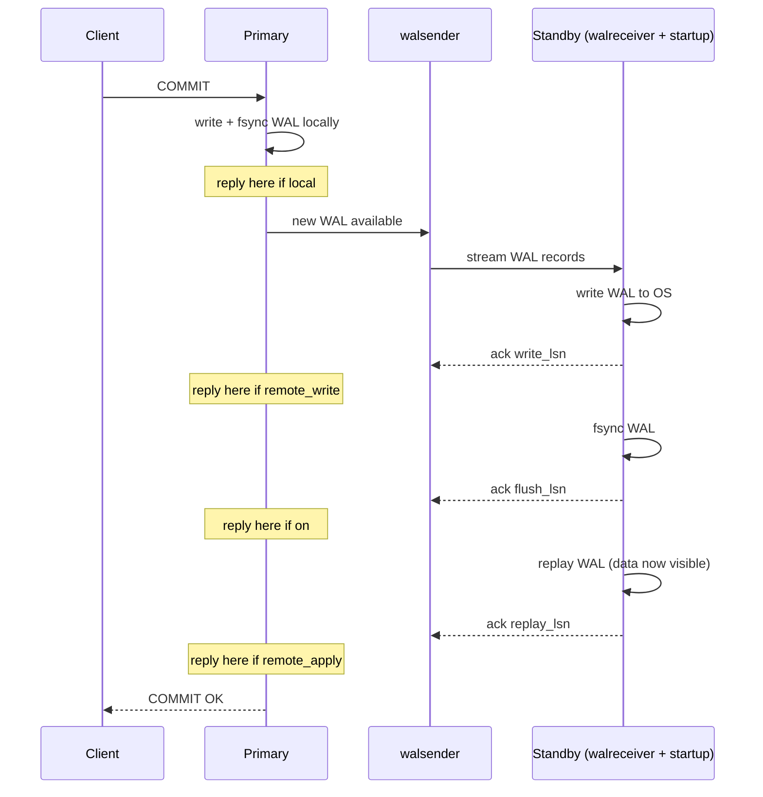
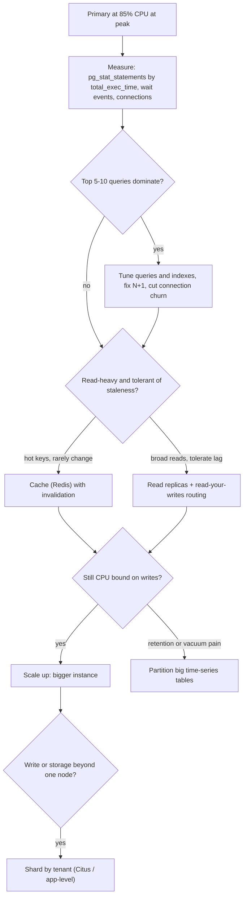

## Bối cảnh & vấn đề

Ba câu chuyện có thật (đã đổi số liệu) cho thấy vì sao chủ đề này quan trọng. Chuyện thứ nhất: team chuyển mọi request `GET` sang read replica để giảm tải cho primary. Ngay tuần đầu, support nhận ticket "tôi vừa đổi địa chỉ, reload trang vẫn thấy địa chỉ cũ". Không có bug trong code: replica chạy **async** và trễ khoảng 300 ms, đúng bằng thời gian user bấm reload.

Chuyện thứ hai: connector Debezium dùng để đẩy thay đổi sang Kafka bị tắt trong một đợt bảo trì cuối tuần và không ai bật lại. Sáng thứ Hai, disk của primary đầy 100%, Postgres dừng nhận ghi. Nguyên nhân là **replication slot** của Debezium vẫn bắt primary giữ lại toàn bộ WAL từ tối thứ Sáu.

Chuyện thứ ba: bảng `events` nhận 30 triệu row mỗi ngày. Job dọn dữ liệu cũ chạy `DELETE FROM events WHERE created_at < now() - interval '13 months'` mỗi đêm, mất 4 tiếng, tạo hàng chục triệu dead tuple, làm replica trễ 20 phút và autovacuum chạy không kịp.

Cả ba đều là vấn đề của việc **scale Postgres ra khỏi một node đơn giản**: sao chép dữ liệu sang máy khác (replication), chia bảng lớn thành các phần nhỏ (partitioning), và quyết định khi nào cần tới những thứ đắt hơn như sharding. Bài này đi từ cơ chế WAL tới quyết định kiến trúc, để bạn trả lời được cả câu "physical hay logical replication?" lẫn câu mở "primary ở 85% CPU, bạn làm gì?".

## Khái niệm

### WAL và streaming replication (physical)

**WAL** (Write-Ahead Log) là nhật ký mà Postgres ghi mọi thay đổi vào trước khi sửa data file (xem [storage & WAL](/tracks/sql-postgres/learn/storage-wal)). Vì WAL mô tả đầy đủ mọi thay đổi ở mức byte của page, một máy khác chỉ cần **replay** cùng chuỗi WAL là có bản sao y hệt. Đó là **physical replication**.

Trong **streaming replication**, replica (còn gọi là standby) mở một connection tới primary; primary chạy một process `walsender` đẩy WAL qua connection đó ngay khi WAL được tạo, và replica chạy `walreceiver` để nhận, cùng process startup để replay. Replica ở chế độ **hot standby** cho phép chạy query chỉ đọc trong khi đang replay. Vì bản sao ở mức byte, replica phải cùng **major version**, cùng kiến trúc CPU, và chứa **toàn bộ cluster** (mọi database, mọi table); bạn không chọn được "chỉ replicate bảng orders".

Vị trí trong WAL được đo bằng **LSN** (Log Sequence Number), một con số tăng dần dạng `0/3A2B1C8`. So sánh LSN giữa primary và replica cho biết replica trễ bao nhiêu byte WAL.

**Interview angle:** interviewer muốn nghe "physical = byte-level, cả cluster, cùng major version, dùng cho HA và read replica".

### Sync vs async và các mức synchronous_commit

Mặc định replication là **async**: primary trả `COMMIT` thành công cho client ngay khi WAL được flush xuống disk **của chính nó**, không chờ replica. Nếu primary chết ngay sau đó, vài transaction cuối có thể chưa tới replica và **mất** khi failover. Đổi lại, write latency không phụ thuộc mạng.

Để dùng **synchronous replication**, bạn khai báo `synchronous_standby_names` (ví dụ `'ANY 1 (replica_a, replica_b)'`), rồi tham số `synchronous_commit` quyết định primary chờ tới mức nào trước khi báo commit xong:

- `off`: không chờ cả WAL flush local. Crash có thể mất vài trăm ms commit cuối, nhưng không làm hỏng dữ liệu.
- `local`: chờ flush WAL local, không chờ standby.
- `remote_write`: chờ standby **nhận** và ghi WAL vào OS (chưa fsync). Standby crash OS vẫn có thể mất.
- `on` (mặc định): chờ standby **flush** WAL xuống disk. Không mất dữ liệu khi primary chết, nhưng dữ liệu **chưa chắc đã nhìn thấy được** trên standby vì chưa replay.
- `remote_apply`: chờ standby **replay** xong, nên query trên standby thấy ngay dữ liệu vừa commit. Đắt nhất.

Tham số này đặt được theo từng transaction (`SET LOCAL synchronous_commit = remote_apply`), nên bạn có thể dùng mức đắt chỉ cho vài thao tác quan trọng.

**Interview angle:** câu bẫy là "`synchronous_commit = on` có đảm bảo read-your-writes trên replica không?"; câu trả lời là không, chỉ `remote_apply` mới đảm bảo.

### Replication slot và rủi ro đầy disk

Primary không biết replica đã nhận tới đâu nếu replica ngắt kết nối; nó có thể xoá WAL cũ mà replica còn cần, khiến replica phải dựng lại từ đầu. **Replication slot** giải quyết việc này: slot ghi nhớ LSN mà consumer đã xác nhận, và primary **không xoá** WAL nào sau LSN đó.

Mặt trái: nếu consumer biến mất (replica bị xoá, Debezium tắt), slot vẫn còn và WAL tích luỹ **vô hạn** cho tới khi đầy disk. Guardrail là `max_slot_wal_keep_size` (PG 13+): vượt ngưỡng thì slot bị đánh dấu `lost` thay vì làm đầy disk, cộng với alert trên `pg_replication_slots`.

```sql
SELECT slot_name, slot_type, active, wal_status,
       pg_size_pretty(pg_wal_lsn_diff(pg_current_wal_lsn(), restart_lsn)) AS retained
FROM pg_replication_slots;
```

```text
   slot_name    | slot_type | active | wal_status | retained
----------------+-----------+--------+------------+----------
 replica_a      | physical  | t      | reserved   | 18 MB
 debezium_cdc   | logical   | f      | extended   | 412 GB
```

Slot `debezium_cdc` không active và giữ 412 GB WAL: đây chính là incident thứ hai ở đầu bài.

**Interview angle:** trả lời câu Debezium bằng cơ chế (slot giữ `restart_lsn`) cộng guardrail (`max_slot_wal_keep_size`, alert, drop slot có chủ đích).

### Logical replication và CDC

**Logical replication** (PG 10+) không gửi byte của page mà giải mã WAL thành **thay đổi theo row** (INSERT/UPDATE/DELETE của bảng X) qua cơ chế **logical decoding**. Nó yêu cầu `wal_level = logical`. Bên nguồn tạo **publication** (tập bảng cần publish), bên đích tạo **subscription** trỏ tới publication đó.

```sql
-- on the source (PG 14)
CREATE PUBLICATION orders_pub FOR TABLE orders, order_items;
-- on the target (PG 17)
CREATE SUBSCRIPTION orders_sub
  CONNECTION 'host=old-primary dbname=shop user=repl'
  PUBLICATION orders_pub;
```

Vì làm việc ở mức row, logical replication cho phép: chọn từng bảng, nguồn và đích **khác major version** (đây là cách upgrade major version gần zero-downtime), bảng đích **ghi được** và có index riêng, và cho phép tool ngoài như **Debezium** đọc thay đổi để đẩy sang Kafka (**CDC**, Change Data Capture).

Giới hạn cần thuộc: **DDL không được replicate** (đổi schema phải chạy trên cả hai phía, thường là đích trước); **sequence không được replicate** trong các bản hiện hành, nên khi cutover phải tự `setval` bên đích (verify theo version); bảng cần **replica identity** (thường là PK) để replicate UPDATE/DELETE; large object không được replicate. Initial sync của bảng lớn có thể mất nhiều giờ.

**Interview angle:** "physical cho HA/read replica, logical cho chọn bảng, khác version, CDC" là câu trả lời chuẩn; nêu thêm hai giới hạn DDL và sequence.

### Replica lag và read-your-writes

**Replica lag** là khoảng cách giữa trạng thái primary và trạng thái replica đã replay. Trên primary, `pg_stat_replication` cho ba mốc lag: `write_lag`, `flush_lag`, `replay_lag`. Mốc liên quan tới dữ liệu user nhìn thấy là `replay_lag`.

**Read-your-writes** là đảm bảo "tôi vừa ghi thì tôi phải đọc được cái tôi vừa ghi". Với replica async, đảm bảo này bị vỡ. Có bốn chiến lược, từ rẻ tới đắt:

1. **Trả dữ liệu mới trong response của write**: client không cần đọc lại, lỗi biến mất ở phần lớn UI.
2. **Đọc từ primary sau khi ghi trong N giây**: sau write, đặt cookie/session flag `read_primary_until = now + 5s`; router gửi read của user đó về primary. Đơn giản, hiệu quả, nhưng N phải lớn hơn lag thường gặp.
3. **So LSN**: sau commit, lấy `pg_current_wal_lsn()` trên primary, lưu vào session; trước khi đọc replica, kiểm tra `pg_last_wal_replay_lsn() >= lsn`, nếu chưa thì đọc primary (hoặc chờ vài ms). Chính xác, không đoán mò.
4. **`synchronous_commit = remote_apply`** cho transaction đó: commit chỉ trả về khi replica đồng bộ đã replay. Đắt nhất, tăng write latency, và nếu replica đồng bộ chết thì commit **treo**.

"Sticky session" (gắn user vào một replica cố định) chỉ cho **monotonic reads** (không thấy dữ liệu lùi về quá khứ), **không** giải quyết read-your-writes vì replica đó vẫn có thể trễ.

**Interview angle:** interviewer đánh giá cao câu trả lời có nhiều tầng và nói rõ chi phí của từng tầng, đặc biệt `remote_apply` làm write treo khi replica chết.

### Hot standby conflict

Replica phải replay WAL đúng như primary đã làm. Giả sử trên replica có query analytics chạy 10 phút đang đọc các row version cũ; cùng lúc, primary VACUUM dọn chính những row version đó và gửi WAL record "xoá chúng". Replica rơi vào **conflict**: nếu replay ngay thì query đang chạy mất dữ liệu nó cần, nếu chờ query thì replay dừng và lag tăng.

`max_standby_streaming_delay` (mặc định 30s) quyết định replica chờ tối đa bao lâu; hết thời gian, nó huỷ query:

```text
ERROR:  canceling statement due to conflict with recovery
DETAIL:  User query might have needed to see row versions that must be removed.
```

Tăng delay lên vài phút giúp query sống, nhưng replay bị chặn trong suốt thời gian đó, nên **lag tăng tới vài phút**. Lựa chọn khác là `hot_standby_feedback = on`: replica báo `xmin` của các query đang chạy về primary, primary sẽ **không dọn** những tuple đó. Conflict hết, nhưng primary giữ dead tuple lâu hơn, gây **bloat trên primary** ([MVCC & VACUUM](/tracks/sql-postgres/learn/mvcc-vacuum)). Số lần huỷ query theo loại conflict có trong `pg_stat_database_conflicts`.

**Interview angle:** câu hỏi này đo xem bạn có thấy đây là tam giác đánh đổi (huỷ query / lag / bloat) và đề xuất tách replica analytics riêng hay không.

### Failover

**Failover** là promote một replica thành primary khi primary chết. Phần khó không phải lệnh promote mà là: phát hiện chết chính xác, đảm bảo chỉ có **một** primary (tránh **split brain**, hai node cùng nhận ghi), và chuyển traffic. **Patroni** giải quyết bằng một leader lock trong DCS (etcd/Consul/Kubernetes): chỉ node giữ lock mới là primary, node mất lock tự demote. Primary cũ quay lại thường cần `pg_rewind` để bỏ phần WAL chưa kịp replicate. Trên AWS, **RDS Multi-AZ** giữ một standby đồng bộ ở AZ khác và failover bằng cách đổi DNS, thường trong 1–2 phút (verify); app phải reconnect và retry.

**Interview angle:** nhắc split brain và việc async replication có thể mất vài transaction cuối khi failover (RPO > 0).

### Declarative partitioning

**Partitioning** chia một bảng logic thành nhiều bảng vật lý (partition) theo **partition key**. Postgres (PG 10+) hỗ trợ ba kiểu: `RANGE` (theo khoảng, ví dụ tháng), `LIST` (theo giá trị rời rạc, ví dụ region), `HASH` (chia đều theo hash, ví dụ `tenant_id` thành 16 phần). Bảng cha không chứa dữ liệu; INSERT được route vào partition phù hợp.

Lợi ích lớn nhất là **partition pruning**: khi `WHERE` có điều kiện trên partition key, planner loại bỏ partition không khớp, cả lúc plan và lúc execute (với tham số của prepared statement, PG 11+). Lợi ích thứ hai là **retention rẻ**: xoá dữ liệu cũ bằng cách gỡ cả partition thay vì `DELETE` hàng triệu row. Mỗi partition có index và vacuum riêng, nhỏ hơn và dễ bảo trì hơn.

Ràng buộc quan trọng: mọi **PRIMARY KEY/UNIQUE phải chứa toàn bộ cột partition key**, vì Postgres không có global index, mỗi unique index chỉ kiểm tra trong một partition. Index tạo trên bảng cha được tạo trên từng partition (partitioned index). Query **không có** partition key phải quét mọi partition, và hàng nghìn partition làm planning chậm và tốn bộ nhớ.

**Interview angle:** câu "partitioning có làm query nhanh hơn không?" có đáp án "chỉ khi query lọc theo partition key; mục đích chính thường là retention và bảo trì".

### Sharding và consistent hashing

**Sharding** chia dữ liệu ra **nhiều node**, mỗi node giữ một phần (khác replication, nơi mỗi node giữ bản sao đầy đủ). Sharding scale được **ghi và storage**, thứ replica không làm được, nhưng trả giá bằng query/transaction xuyên shard, rebalancing và vận hành phức tạp. Trong thế giới Postgres, **Citus** là extension phổ biến: bạn chọn distribution column (thường là `tenant_id`), các bảng cùng key được **co-locate** nên join trong một tenant vẫn chạy trên một node.

Cách map key vào shard quyết định chi phí khi thêm node. `hash(key) % N` là cách ngây thơ: đổi N từ 3 lên 4 làm khoảng 3/4 số key đổi chỗ. **Consistent hashing** đặt node và key lên một vòng hash, key thuộc node đầu tiên theo chiều kim đồng hồ, nên thêm một node chỉ di chuyển khoảng 1/N dữ liệu; **virtual node** (mỗi node có nhiều vị trí trên vòng) giúp phân bố đều hơn. Nhiều hệ thống (Citus, Redis Cluster với 16.384 hash slot) dùng biến thể đơn giản hơn: chia trước thành nhiều **shard logic cố định** và di chuyển nguyên shard giữa các node.

**Interview angle:** interviewer hỏi "khi nào cần sharding?" để xem bạn có coi nó là bước cuối, sau khi đã hết các lựa chọn rẻ hơn.

## Cơ chế hoạt động

### Một commit đi qua synchronous replication

Sơ đồ dưới cho thấy các mức `synchronous_commit` tương ứng với điểm nào trong đường đi của WAL.



Đọc sơ đồ từ trên xuống: primary luôn ghi và fsync WAL local trước. Sau đó walsender stream WAL sang standby, và standby gửi phản hồi ở ba mốc: đã ghi vào OS, đã fsync, đã replay. Mỗi mức `synchronous_commit` là một điểm dừng khác nhau trên hành trình này; điểm dừng càng muộn thì commit càng an toàn và càng chậm. Với async (không có `synchronous_standby_names`), client nhận `COMMIT OK` ngay sau bước fsync local, và mọi bước còn lại diễn ra "sau đó", đó chính là nguồn gốc của replica lag. Ba mốc ack này cũng là ba cột `write_lsn`, `flush_lsn`, `replay_lsn` trong `pg_stat_replication`.

### Thang quyết định khi primary ở 85% CPU

Câu hỏi mở về scaling cần một thứ tự lập luận. Nguyên tắc: **đo trước**, rồi chọn biện pháp rẻ nhất giải quyết đúng nút cổ chai.



Bước đo quan trọng nhất là `pg_stat_statements`: sắp xếp theo `total_exec_time` (không phải `mean_exec_time`) vì một query 2 ms chạy 50.000 lần/phút nặng hơn một query 3 giây chạy 10 lần. Thực tế 5–10 query thường chiếm phần lớn tải, và sửa chúng (index đúng, bỏ N+1, bỏ `SELECT *` không cần) rẻ và hiệu quả nhất. Cache và read replica chỉ giúp với **read**; replica còn kéo theo bài toán read-your-writes. Scale up (vertical) thường rẻ hơn công sức kỹ sư cho sharding, và các máy cloud lớn đi rất xa. Partitioning nằm ở nhánh riêng: nó giải quyết retention, vacuum và index quá lớn, **không** phải thuốc giảm CPU chung. Sharding là bước cuối, khi ghi hoặc storage vượt một node.

```sql
SELECT left(query, 60) AS query, calls,
       round(total_exec_time) AS total_ms,
       round(mean_exec_time, 2) AS mean_ms
FROM pg_stat_statements
ORDER BY total_exec_time DESC
LIMIT 3;
```

```text
                            query                            |  calls  | total_ms | mean_ms
-------------------------------------------------------------+---------+----------+---------
 SELECT * FROM order_items WHERE order_id = $1                | 9812345 |  4120331 |    0.42
 SELECT count(*) FROM events WHERE tenant_id = $1 AND created |   88210 |  2977012 |   33.75
 UPDATE carts SET updated_at = now() WHERE id = $1            | 3120044 |   811230 |    0.26
```

Dòng đầu là N+1 kinh điển (gọi một lần cho mỗi order), dòng hai là count trên bảng lớn nên được thay bằng bảng tổng hợp. Hai sửa đổi này thường hạ CPU nhiều hơn một replica mới.

## Ví dụ thực tế

### Read-your-writes bằng LSN với node-postgres

Ý tưởng: sau khi ghi, lưu LSN của commit vào session (cookie, Redis). Khi đọc, hỏi replica "đã replay tới LSN đó chưa?"; nếu rồi thì đọc replica, nếu chưa thì đọc primary.

```ts
import { Pool } from "pg";

const primary = new Pool({ connectionString: process.env.PRIMARY_URL, max: 10 });
const replica = new Pool({ connectionString: process.env.REPLICA_URL, max: 10 });

export async function updateAddress(userId: number, address: string): Promise<string> {
  const client = await primary.connect();
  try {
    await client.query("UPDATE users SET address = $2 WHERE id = $1", [userId, address]); // autocommit
    // taken AFTER the commit, so it is at or past the commit record
    const r = await client.query("SELECT pg_current_wal_lsn()::text AS lsn");
    return r.rows[0].lsn; // store in the user's session, e.g. "0/5A3F2C8"
  } finally {
    client.release();
  }
}

export async function readUser(userId: number, minLsn?: string) {
  if (minLsn) {
    const { rows } = await replica.query(
      "SELECT pg_last_wal_replay_lsn() >= $1::pg_lsn AS caught_up",
      [minLsn],
    );
    if (!rows[0].caught_up) {
      console.log(`replica behind ${minLsn}, reading primary`);
      return (await primary.query("SELECT id, address FROM users WHERE id = $1", [userId])).rows[0];
    }
  }
  console.log("reading replica");
  return (await replica.query("SELECT id, address FROM users WHERE id = $1", [userId])).rows[0];
}

const lsn = await updateAddress(42, "12 Nguyen Hue, Q1");
console.log(await readUser(42, lsn));
await new Promise((r) => setTimeout(r, 500));
console.log(await readUser(42, lsn));
```

```text
replica behind 0/5A3F2C8, reading primary
{ id: 42, address: '12 Nguyen Hue, Q1' }
reading replica
{ id: 42, address: '12 Nguyen Hue, Q1' }
```

Có hai chi tiết cần hiểu. Thứ nhất, LSN phải được lấy **sau** khi commit xong (ở đây UPDATE chạy autocommit, nên câu `SELECT` thứ hai chạy sau commit). Nếu lấy `pg_current_wal_lsn()` ngay trong transaction đang ghi, giá trị có thể nằm **trước** commit record, và replica "đã tới LSN đó" vẫn chưa thấy dữ liệu. Thứ hai, câu kiểm tra thêm một round-trip; nhiều team chỉ áp dụng nó trong vài giây sau write (khi session còn giữ LSN), sau đó xoá LSN và đọc replica như thường.

Để giám sát lag và làm ngưỡng rút read về primary:

```sql
SELECT application_name, state, sync_state,
       pg_size_pretty(pg_wal_lsn_diff(pg_current_wal_lsn(), replay_lsn)) AS replay_bytes,
       replay_lag
FROM pg_stat_replication;
```

```text
 application_name |   state   | sync_state | replay_bytes |   replay_lag
------------------+-----------+------------+--------------+-----------------
 replica_api      | streaming | async      | 312 kB       | 00:00:00.184
 replica_analytics| streaming | async      | 2.1 GB       | 00:04:12.51
```

Router (hoặc health check của load balancer) loại replica khỏi pool API khi `replay_lag` vượt ngưỡng, ví dụ 5 giây. Ở ví dụ trên, `replica_analytics` trễ 4 phút là chấp nhận được với báo cáo nhưng không được phép nhận traffic API. Lưu ý: trên replica, `now() - pg_last_xact_replay_timestamp()` tăng dần khi primary **không có ghi**, nên dễ báo động giả; đo theo byte hoặc `replay_lag` từ primary đáng tin hơn.

### Thiết kế bảng events: 30M row/ngày, giữ 13 tháng

Ước lượng trước khi thiết kế: 30M row/ngày ≈ 350 row/giây trung bình (peak có thể gấp 5–10 lần). 13 tháng ≈ 395 ngày, tức khoảng **11,9 tỷ row**. Nếu mỗi row khoảng 200 byte thì heap tăng khoảng 6 GB/ngày, tổng cỡ 2,4 TB chưa tính index. Một bảng liền khối cỡ đó rất khó vacuum, index khổng lồ và retention bằng `DELETE` là thảm hoạ như câu chuyện thứ ba.

Thiết kế: partition theo **ngày** bằng `RANGE (created_at)`, khoảng 400 partition. Partition theo ngày khớp đơn vị retention, mỗi partition cỡ 6 GB, và query "24 giờ qua" chỉ chạm 1–2 partition. Nếu nhiều query không lọc theo thời gian, partition theo **tuần** (khoảng 57 partition) giảm chi phí planning.

```sql
CREATE TABLE events (
  id          bigint GENERATED ALWAYS AS IDENTITY,
  tenant_id   bigint      NOT NULL,
  created_at  timestamptz NOT NULL,
  event_type  text        NOT NULL,
  payload     jsonb,
  PRIMARY KEY (created_at, id)          -- must include the partition key
) PARTITION BY RANGE (created_at);

CREATE TABLE events_2026_09_29 PARTITION OF events
  FOR VALUES FROM ('2026-09-29') TO ('2026-09-30');
CREATE TABLE events_2026_09_30 PARTITION OF events
  FOR VALUES FROM ('2026-09-30') TO ('2026-10-01');

-- lookups per tenant in a time window
CREATE INDEX events_tenant_time_idx ON events (tenant_id, created_at);
-- cheap range index for append-only time data
CREATE INDEX events_created_brin ON events USING brin (created_at);
```

Kiểm tra pruning:

```sql
EXPLAIN (COSTS OFF)
SELECT count(*) FROM events
WHERE tenant_id = 7 AND created_at >= '2026-09-30 00:00' AND created_at < '2026-09-30 12:00';
```

```text
                                         QUERY PLAN
---------------------------------------------------------------------------------------------
 Aggregate
   ->  Index Only Scan using events_2026_09_30_tenant_id_created_at_idx on events_2026_09_30 events
         Index Cond: ((tenant_id = 7) AND (created_at >= '2026-09-30 00:00:00+00') AND (created_at < '2026-09-30 12:00:00+00'))
```

Chỉ `events_2026_09_30` xuất hiện: các partition khác đã bị prune. Nếu bỏ điều kiện `created_at`, plan sẽ có một `Append` qua cả 400 partition.

Tạo partition trước: một job hằng ngày (hoặc extension `pg_partman`) tạo trước partition cho 7 ngày tới. Nếu INSERT tới mà không có partition phù hợp, câu lệnh lỗi `no partition of relation "events" found for row`. Một `DEFAULT` partition bắt được các row đó nhưng làm các bước ATTACH/DETACH sau này phức tạp hơn, nên đa số thiết kế time-series chỉ dùng partition tạo trước cộng alert.

Retention, đây là điểm Notion hay ghi sai: Postgres **không có** `DROP PARTITION` (đó là cú pháp MySQL). Cách làm là gỡ partition khỏi bảng cha rồi drop như một bảng thường:

```sql
-- PG 14+: cannot run inside a transaction block
ALTER TABLE events DETACH PARTITION events_2025_08_29 CONCURRENTLY;
DROP TABLE events_2025_08_29;
```

Về lock: `DETACH PARTITION` thường (không `CONCURRENTLY`) và `DROP TABLE` trên một partition **đang gắn** đều lấy `ACCESS EXCLUSIVE` trên bảng cha trong thời gian ngắn, nên vẫn có thể **xếp hàng sau một query dài** và kéo theo mọi query khác phía sau ([lock queue](/tracks/sql-postgres/learn/zero-downtime-migrations)). `DETACH ... CONCURRENTLY` chỉ lấy `SHARE UPDATE EXCLUSIVE` trên bảng cha nhưng phải **chờ** các transaction đang dùng bảng kết thúc, không chạy được trong transaction block, và không dùng được khi bảng có DEFAULT partition. Nếu bị ngắt giữa chừng, partition ở trạng thái "detach pending" và cần `ALTER TABLE events DETACH PARTITION events_2025_08_29 FINALIZE`. Sau khi detach, `DROP TABLE` chỉ lock bảng đã tách. Vì vậy "retention bằng partition không lock gì" là sai; đúng là "lock ngắn, không bloat, không DELETE". Luôn chạy kèm `lock_timeout` và retry.

Còn lại của thiết kế: PK `(created_at, id)` nghĩa là Postgres **không enforce** `id` unique toàn cục. Identity dùng chung một sequence nên trên thực tế không trùng, nhưng nếu cần tra theo `id` mà không biết thời gian, hãy dùng id **time-ordered** (UUIDv7, snowflake) để suy ra partition từ id. Ghi bằng batch hoặc `COPY`, tránh UPDATE trên events. Dữ liệu cũ hơn vài tháng nếu chỉ phục vụ analytics có thể export sang object storage (Parquet) trước khi drop, và nếu workload chủ yếu là aggregate thì TimescaleDB hay ClickHouse đáng cân nhắc.

## Trade-offs & lựa chọn thay thế

| Lựa chọn | Giải quyết | Không giải quyết | Chi phí chính |
| --- | --- | --- | --- |
| Query/index tuning | CPU, I/O của query nóng | Giới hạn phần cứng thật | Công sức phân tích, rủi ro thấp |
| Cache (Redis) | Read nóng, lặp lại | Write, read đa dạng | Invalidation, staleness |
| Physical read replica | Scale read, HA, failover | Write, read-your-writes | Replica lag, conflict, tiền máy |
| Logical replication | Chọn bảng, khác version, CDC | HA cả cluster | DDL/sequence thủ công, slot |
| `synchronous_commit` sync | RPO = 0, read-your-writes (`remote_apply`) | Throughput | Write latency, write treo khi standby chết |
| Partitioning | Retention, vacuum, index nhỏ, pruning | CPU chung, query thiếu key | Ràng buộc PK/unique, nhiều partition làm plan chậm |
| Scale up | Hầu hết mọi thứ, tới một giới hạn | Giới hạn của một máy | Tiền, downtime ngắn khi đổi instance |
| Sharding (Citus) | Write và storage vượt một node | Query xuyên tenant | Độ phức tạp vận hành, cross-shard transaction |

Chọn **physical replication** khi mục tiêu là HA/failover và scale read cho toàn bộ cluster; đây là mặc định trên mọi managed Postgres. Chọn **logical replication** khi cần một phần dữ liệu, khác major version (upgrade), hoặc đẩy thay đổi ra hệ thống khác (CDC); chấp nhận việc quản lý DDL và sequence thủ công. Với replica cho analytics, **tách riêng** một replica chấp nhận lag (delay cao, không phục vụ API), hoặc tốt hơn là đẩy dữ liệu sang warehouse qua CDC; replica phục vụ OLTP giữ delay thấp và có thể bật `hot_standby_feedback` nếu query của nó ngắn.

Chọn **partitioning** khi bảng lớn theo thời gian cần retention, hoặc khi query gần như luôn lọc theo một key. Đừng partition bảng 20 GB "cho nhanh": B-tree index trên bảng đó đã đủ tốt. Chọn **sharding** chỉ khi có bằng chứng: write IOPS hoặc WAL rate chạm trần của instance lớn nhất, dataset vượt khả năng lưu/backup/restore trong RTO, hoặc một tenant lớn cần cô lập. Metric thuyết phục: CPU/IO bão hoà sau khi đã tuning, WAL generation vượt khả năng replay của replica, thời gian restore backup vượt RTO.

## Edge cases & failure modes

- **Slot không có consumer**: WAL tích luỹ tới đầy disk và primary ngừng nhận ghi. Đặt `max_slot_wal_keep_size`, alert khi `retained` vượt ngưỡng hoặc `active = f` quá lâu, và có runbook drop slot.
- **Sync standby chết**: với `synchronous_standby_names` chỉ một standby, mọi commit **treo**. Dùng `ANY 1 (a, b)` với ít nhất hai standby, hoặc chấp nhận async.
- **Failover với async**: vài transaction cuối chưa sang replica sẽ mất (RPO > 0). App nên idempotent và có reconciliation cho thao tác tiền.
- **Split brain**: primary cũ bị cô lập mạng nhưng vẫn nhận ghi. Cần fencing (Patroni leader lock, STONITH) và `pg_rewind` khi đưa node cũ trở lại.
- **Logical replication và DDL**: thêm cột trên nguồn trước khi thêm ở đích làm subscription lỗi và dừng; slot tiếp tục giữ WAL. Luôn đổi schema ở đích trước.
- **Sequence sau cutover logical**: bên đích sequence vẫn ở giá trị ban đầu; INSERT đầu tiên sau cutover lỗi duplicate key nếu quên `setval`.
- **Replica chậm hơn primary về phần cứng**: replay WAL là đơn luồng cho phần lớn thao tác, nên primary ghi dồn dập (backfill, `CREATE INDEX`) có thể làm replica trễ nhiều phút. Throttle các job ghi nặng theo lag.
- **Quá nhiều partition**: hàng nghìn partition làm planning chậm, tăng bộ nhớ mỗi backend (relcache) và lock nhiều object mỗi query; triệu chứng là planning time lớn hơn execution time trong `EXPLAIN ANALYZE`.
- **Query không có partition key**: quét mọi partition, thường chậm hơn bảng không partition.
- **Tạo index trên bảng partitioned**: `CREATE INDEX CONCURRENTLY` không chạy trực tiếp trên bảng cha; phải `CREATE INDEX ... ON ONLY events`, rồi CIC trên từng partition và `ALTER INDEX ... ATTACH PARTITION`.

## Pitfalls

- ❌ Dùng `DROP PARTITION` hoặc tin rằng retention "không lock" → ✅ `DETACH PARTITION ... CONCURRENTLY` rồi `DROP TABLE`, kèm `lock_timeout`, vì plain detach/drop lấy `ACCESS EXCLUSIVE` trên bảng cha.
- ❌ `DELETE` hàng triệu row cho retention → ✅ gỡ nguyên partition, vì DELETE tạo dead tuple, WAL và replica lag.
- ❌ Nghĩ `synchronous_commit = on` đảm bảo đọc được trên replica → ✅ chỉ `remote_apply` đảm bảo dữ liệu đã được replay và nhìn thấy.
- ❌ "Sleep 100 ms rồi đọc replica" hoặc sticky session để chữa read-your-writes → ✅ đọc primary sau write hoặc so LSN, vì lag không có trần.
- ❌ Bật `hot_standby_feedback` cho replica analytics chạy query 1 giờ → ✅ tách replica analytics/warehouse, vì feedback chặn VACUUM trên primary và gây bloat.
- ❌ Tạo logical slot cho Debezium mà không có alert → ✅ `max_slot_wal_keep_size` + alert trên `pg_replication_slots`.
- ❌ Partition bảng không có partition key trong đa số query → ✅ chọn key theo access pattern thật, đo bằng `EXPLAIN`.
- ❌ Nhảy thẳng tới sharding khi CPU cao → ✅ `pg_stat_statements` trước, tuning, cache, replica, scale up, rồi mới shard.

## Tóm tắt

- Physical streaming replication replay WAL ở mức byte: cả cluster, cùng major version, dùng cho HA và read replica; mặc định **async** nên có replica lag.
- `synchronous_commit`: `off` / `local` / `remote_write` / `on` / `remote_apply`; chỉ `remote_apply` cho read-your-writes, và sync standby chết thì commit treo.
- Replication slot giữ WAL cho consumer; consumer chết thì đầy disk. Guardrail: `max_slot_wal_keep_size` + alert.
- Logical replication (publication/subscription) cho chọn bảng, khác version, CDC; không replicate DDL và sequence.
- Read-your-writes: trả dữ liệu trong response, đọc primary N giây sau write, so `pg_last_wal_replay_lsn()`, hoặc `remote_apply`.
- Hot standby conflict là tam giác huỷ query / lag (`max_standby_streaming_delay`) / bloat (`hot_standby_feedback`); tách replica analytics.
- Partitioning giúp pruning và retention; PK/unique phải chứa partition key; retention = `DETACH ... CONCURRENTLY` + `DROP TABLE`, vẫn có lock ngắn.
- Scale ladder: đo bằng `pg_stat_statements` → tuning → cache → replica → scale up → (partition cho retention) → sharding.
