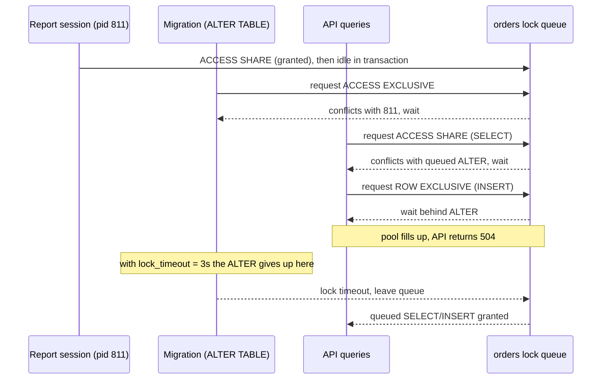
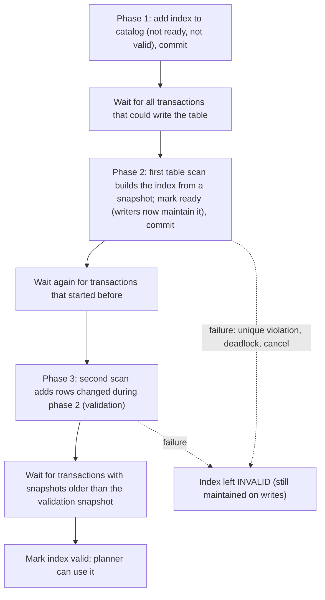

## Bối cảnh & vấn đề

Thứ Ba, 14:05, pipeline deploy chạy migration `2026_09_01_add_gift_note.sql` chỉ có một dòng:

```sql
ALTER TABLE orders ADD COLUMN gift_note text;
```

Đây là loại thay đổi "an toàn nhất có thể": cột nullable, không default, Postgres chỉ sửa catalog chứ không đụng tới dữ liệu. Vậy mà trong 3 phút sau đó, API đặt hàng trả 504, pool connection của mọi pod cạn sạch, và dashboard đỏ rực. Khi xem `pg_stat_activity`, on-call thấy:

```text
 pid  |        state        |  xact_age  | wait_event_type |                 query
------+---------------------+------------+-----------------+---------------------------------------
  811 | idle in transaction | 00:12:03   | Client          | SELECT * FROM orders WHERE created_at…
 9021 | active              | 00:03:01   | Lock            | ALTER TABLE orders ADD COLUMN gift_note text
 9030 | active              | 00:02:59   | Lock            | SELECT id, status FROM orders WHERE id = $1
 9031 | active              | 00:02:59   | Lock            | INSERT INTO orders (...) VALUES (...)
 ... 240 more rows waiting on Lock
```

Pid 811 là một phiên từ công cụ báo cáo, mở transaction từ 12 phút trước rồi bỏ đó. Nó không chặn ai cả cho tới khi ALTER xuất hiện. Sau đó, **mọi** câu SELECT và INSERT mới trên `orders` đều bị chặn. Bài này giải thích vì sao, và xây dựng bộ công cụ để thay đổi schema của bảng hàng trăm triệu row trong khi traffic vẫn chạy: lock level, lock queue, `lock_timeout`, ALTER nào instant và ALTER nào rewrite, `CREATE INDEX CONCURRENTLY`, constraint `NOT VALID`, backfill theo batch và quy trình expand → migrate → contract.

Nguyên tắc nền tảng: **zero-downtime migration không phải một câu SQL thông minh, mà là một chuỗi bước nhỏ, mỗi bước chỉ giữ lock mạnh trong vài mili giây, và app ở mọi version đang chạy đều tương thích với schema ở mọi bước**.

## Khái niệm

### Lock level của DDL

Mỗi câu lệnh lấy một **table-level lock** với một mức (mode) nhất định; hai lock xung đột thì lock sau phải chờ (bảng xung đột đầy đủ ở [locking](/tracks/sql-postgres/learn/locking-concurrency)). Với migration, bốn mức quan trọng nhất:

- `ACCESS SHARE`: lấy bởi mọi `SELECT`. Chỉ xung đột với `ACCESS EXCLUSIVE`.
- `ROW EXCLUSIVE`: lấy bởi `INSERT/UPDATE/DELETE`.
- `SHARE UPDATE EXCLUSIVE`: lấy bởi `CREATE INDEX CONCURRENTLY`, `VALIDATE CONSTRAINT`, `VACUUM`, `ANALYZE`. **Không** chặn đọc hay ghi, chỉ chặn một thao tác cùng loại khác trên cùng bảng.
- `SHARE`: lấy bởi `CREATE INDEX` thường. Cho đọc nhưng **chặn mọi ghi** suốt thời gian build index.
- `ACCESS EXCLUSIVE`: lấy bởi phần lớn `ALTER TABLE` (ADD/DROP COLUMN, SET NOT NULL, ALTER TYPE, RENAME), `DROP TABLE`, `TRUNCATE`. Chặn **tất cả**, kể cả SELECT.

Điểm dễ hiểu sai: một ALTER "instant" vẫn cần `ACCESS EXCLUSIVE`, chỉ là giữ nó trong vài mili giây. Thời gian giữ lock ngắn không có nghĩa thời gian **chờ** lock ngắn.

**Interview angle:** red flag là câu "thêm cột nullable thì không lấy lock"; câu đúng là "lấy `ACCESS EXCLUSIVE` rất ngắn, nguy hiểm nằm ở việc chờ".

### Lock queue

Khi một request lock không được cấp ngay, nó vào **hàng đợi** của bảng đó. Hàng đợi này gần như FIFO: một request mới không chỉ phải kiểm tra xung đột với lock **đang được giữ**, mà còn với lock **đang chờ** phía trước nó. Postgres làm vậy để tránh starvation: nếu SELECT cứ được "chen hàng" vì chúng tương thích với nhau, một ALTER có thể chờ mãi mãi.

Hệ quả trong câu chuyện trên: pid 811 giữ `ACCESS SHARE`. ALTER cần `ACCESS EXCLUSIVE` nên chờ. Mỗi SELECT mới cần `ACCESS SHARE`, không xung đột với 811, nhưng **xung đột với ALTER đang chờ** phía trước, nên cũng phải chờ. Một phiên idle không liên quan cộng một DDL "vô hại" bằng một outage toàn bảng.

**Interview angle:** interviewer muốn bạn giải thích được vì sao SELECT bị chặn dù không ai đang giữ lock xung đột với SELECT.

### lock_timeout, statement_timeout và retry

`lock_timeout` giới hạn thời gian một câu lệnh **chờ để lấy lock**; quá thời gian, câu lệnh lỗi `canceling statement due to lock timeout` và rời hàng đợi, giải phóng mọi query phía sau. `statement_timeout` giới hạn tổng thời gian chạy của câu lệnh. `idle_in_transaction_session_timeout` tự đóng phiên kiểu pid 811.

Cách dùng cho migration: đặt `lock_timeout` nhỏ (1–5 giây) cho mỗi bước DDL và **retry có backoff**. Thất bại nhanh rồi thử lại lúc bảng rảnh tốt hơn nhiều so với thành công sau 3 phút outage.

```sql
SET lock_timeout = '3s';
SET statement_timeout = '15s';
ALTER TABLE orders ADD COLUMN gift_note text;
```

```text
ERROR:  canceling statement due to lock timeout
```

Lỗi này là tin tốt: traffic chỉ bị chặn tối đa 3 giây, và runner sẽ thử lại.

**Interview angle:** câu follow-up quen thuộc là "viết migration runner retry DDL an toàn"; xem ví dụ TypeScript ở phần sau.

### ADD COLUMN: instant hay rewrite

**Table rewrite** là khi Postgres phải ghi lại toàn bộ bảng (và rebuild mọi index) dưới `ACCESS EXCLUSIVE`, tức bảng bị khoá suốt thời gian tỉ lệ với kích thước bảng. Metadata-only (instant) là khi chỉ catalog thay đổi.

Instant:

- `ADD COLUMN` nullable, không default: row cũ không có giá trị, đọc ra là NULL.
- `ADD COLUMN ... DEFAULT <giá trị non-volatile>` từ **PG 11**: giá trị được lưu một lần trong catalog (`pg_attribute.attmissingval`) và trả về cho row cũ khi đọc. Kể cả `NOT NULL DEFAULT 0` cũng instant. `now()` là STABLE nên cũng instant, và mọi row cũ nhận **cùng một** timestamp lúc chạy ALTER.
- Nới `varchar(50)` → `varchar(100)` hoặc `varchar` → `text`: binary-compatible, không rewrite.

Rewrite:

- Default **volatile** như `gen_random_uuid()`, `clock_timestamp()`, `random()`: mỗi row cần giá trị riêng.
- Đổi kiểu không binary-compatible: `int` → `bigint`, `text` → `int`, `numeric` thu hẹp. Hầu hết `ALTER COLUMN TYPE` rewrite bảng và rebuild index.

`ALTER TABLE ... ADD COLUMN x int NOT NULL` **không có default** trên bảng có dữ liệu sẽ **lỗi** (`column "x" of relation "orders" contains null values`), không phải lock lâu.

**Interview angle:** red flag là "thêm cột có default luôn rewrite bảng"; đúng cho PG 10 trở về trước, sai từ PG 11 với default non-volatile.

### CREATE INDEX CONCURRENTLY

`CREATE INDEX` thường lấy `SHARE` lock: đọc được, nhưng mọi INSERT/UPDATE/DELETE bị chặn suốt thời gian build, có thể là nhiều phút với bảng lớn. **`CREATE INDEX CONCURRENTLY`** (CIC) chỉ lấy `SHARE UPDATE EXCLUSIVE`, không chặn ghi, bằng cách build index qua nhiều pha và chờ các transaction cũ kết thúc giữa các pha (chi tiết ở phần Cơ chế). Tương tự có `REINDEX CONCURRENTLY` (PG 12+) và `DROP INDEX CONCURRENTLY`.

Caveats cần thuộc lòng: CIC **không chạy được trong transaction block** (`ERROR: CREATE INDEX CONCURRENTLY cannot run inside a transaction block`), trong khi nhiều migration tool mặc định bọc mỗi file trong `BEGIN/COMMIT`. CIC chậm hơn (hai lần quét bảng) và phải **chờ mọi transaction có snapshot cũ**, kể cả transaction trên bảng khác, nên một transaction dài bất kỳ làm CIC treo. Nếu CIC thất bại (unique violation, deadlock, bị cancel), nó để lại một index **INVALID**.

**Interview angle:** interviewer thường hỏi "CIC thất bại thì database ở trạng thái nào?"; đáp án là có index INVALID vẫn tốn chi phí ghi.

### INVALID index

Index INVALID là index có trong catalog với `pg_index.indisvalid = false`. Planner **không dùng** nó để đọc vì có thể thiếu entry, nhưng nếu nó đã qua pha "ready" thì mọi INSERT/UPDATE vẫn phải **cập nhật** nó, tức bạn trả chi phí ghi mà không có lợi ích đọc. Với unique index, nó có thể vẫn kiểm tra uniqueness cho row mới, nên INSERT có thể lỗi vì một index "không tồn tại" theo nghĩa planner.

```sql
SELECT indexrelid::regclass AS index, indrelid::regclass AS table
FROM pg_index
WHERE NOT indisvalid;
```

```text
          index          | table
-------------------------+--------
 orders_external_ref_key | orders
```

Cái bẫy đi kèm: `CREATE INDEX CONCURRENTLY IF NOT EXISTS orders_external_ref_key ...` sẽ thấy tên đã tồn tại và **bỏ qua**, dù index đó INVALID. Migration "idempotent" chạy lại báo thành công, còn bạn không có index nào dùng được.

**Interview angle:** nhắc `IF NOT EXISTS` bỏ qua index invalid là điểm cộng lớn vì ít ứng viên biết.

### Constraint NOT VALID + VALIDATE

Thêm CHECK hoặc FOREIGN KEY bình thường phải quét toàn bảng để chứng minh mọi row hợp lệ, trong khi giữ lock mạnh. `NOT VALID` tách việc này làm hai: `ADD CONSTRAINT ... NOT VALID` chỉ ghi catalog (lock ngắn) và áp dụng constraint cho **row mới hoặc row được sửa**; sau đó `VALIDATE CONSTRAINT` quét row cũ nhưng chỉ lấy `SHARE UPDATE EXCLUSIVE`, nên đọc/ghi vẫn chạy bình thường.

Với FOREIGN KEY: `ADD CONSTRAINT ... FOREIGN KEY ... NOT VALID` lấy `SHARE ROW EXCLUSIVE` ngắn trên cả hai bảng, `VALIDATE` lấy `SHARE UPDATE EXCLUSIVE` trên bảng con và `ROW SHARE` trên bảng cha. Đừng quên index trên cột FK của bảng con, nếu không mỗi DELETE ở bảng cha sẽ quét bảng con.

**NOT NULL** là trường hợp đặc biệt. `ALTER COLUMN ... SET NOT NULL` quét cả bảng dưới `ACCESS EXCLUSIVE`. Từ **PG 12**, nếu bảng đã có một CHECK `(col IS NOT NULL)` hợp lệ (đã VALIDATE), Postgres dùng nó làm bằng chứng và **bỏ qua scan**. Từ PG 18 có thể thêm trực tiếp NOT NULL constraint dạng `NOT VALID` rồi validate (verify).

**Interview angle:** trình bày đủ bốn bước CHECK NOT VALID → VALIDATE → SET NOT NULL → DROP CHECK là đáp án mong đợi cho bảng 300M row.

### Backfill theo batch

**Backfill** là điền giá trị cho cột mới trên các row cũ. Một câu `UPDATE orders SET currency_code = legacy_currency` trên 200M row là một transaction khổng lồ: giữ snapshot cũ suốt nhiều giờ (VACUUM toàn DB không dọn được, xem [MVCC](/tracks/sql-postgres/learn/mvcc-vacuum)), khoá hàng triệu row (chặn checkout đang sửa cùng row), tạo 200M dead tuple và hàng trăm GB WAL (replica trễ, disk đầy), và nếu fail ở 90% thì rollback toàn bộ.

Cách đúng: chia theo **khoảng PK** (keyset), mỗi batch vài nghìn row trong một transaction ngắn tự commit, điều kiện `WHERE new_col IS NULL` để chạy lại được (**idempotent**) và resume từ checkpoint, nghỉ giữa các batch và **throttle theo replica lag**. Lưu ý Postgres không có `UPDATE ... LIMIT` (cú pháp MySQL), nên giới hạn batch bằng khoảng id hoặc subquery.

**Interview angle:** interviewer muốn nghe đủ các lý do một UPDATE lớn là nguy hiểm (xmin, lock, WAL/lag, rollback), không chỉ "nó chậm".

### Expand → migrate → contract

Rolling deploy nghĩa là trong vài phút, version cũ và version mới của app **cùng chạy**. Mọi thay đổi schema phá vỡ (rename, đổi kiểu, drop) vì thế phải chia thành ba giai đoạn: **expand** (thêm cấu trúc mới, không phá cái cũ), **migrate** (dual write, backfill, chuyển read), **contract** (gỡ cấu trúc cũ khi không còn ai dùng). Mỗi giai đoạn là một deploy riêng, rollback được.

**Interview angle:** câu hỏi rename column đo xem bạn có nghĩ tới việc nhiều version app cùng chạy và các consumer ngoài app (ETL, BI, indexer).

## Cơ chế hoạt động

### Lock queue biến ALTER ngắn thành outage



Sơ đồ cho thấy từng bước. Report session giữ `ACCESS SHARE` và không làm gì. ALTER xin `ACCESS EXCLUSIVE`, xung đột nên xếp hàng. Các SELECT/INSERT của API đến sau, tuy tương thích với report session, lại xung đột với **request đang chờ** của ALTER nên phải xếp sau nó. Không có `lock_timeout`, tình trạng kéo dài tới khi report session kết thúc (ở đây là khi ai đó kill nó sau 3 phút). Có `lock_timeout = 3s`, ALTER tự rút lui sau 3 giây, hàng đợi được giải phóng, và runner thử lại sau vài giây. Traffic chỉ thấy một đợt latency 3 giây thay vì outage.

Trước mỗi migration, nên kiểm tra transaction dài:

```sql
SELECT pid, state, now() - xact_start AS xact_age, left(query, 50) AS query
FROM pg_stat_activity
WHERE xact_start < now() - interval '1 minute'
ORDER BY xact_start;
```

### Các pha của CREATE INDEX CONCURRENTLY



Vì sao nhiều pha như vậy? CIC không chặn ghi, nên trong lúc nó quét bảng, row mới vẫn được insert. Pha 1 đăng ký index trong catalog và chờ để chắc chắn mọi transaction ghi từ nay đều **biết** index tồn tại. Pha 2 build index từ một snapshot, rồi đánh dấu "ready" để mọi ghi mới tự thêm entry vào index. Pha 3 quét lại để bổ sung các row thay đổi trong lúc pha 2 chạy, rồi chờ mọi transaction có snapshot cũ hơn kết thúc (để không ai còn "nhìn" dữ liệu mà index chưa phản ánh). Chỉ khi đó index mới được đánh dấu valid. Mỗi pha commit riêng, đây là lý do CIC không thể nằm trong một transaction block. Và vì các bước chờ bao gồm transaction trên **mọi** bảng có snapshot cũ, một transaction dài bất kỳ có thể làm CIC treo nhiều giờ.

### Expand → migrate → contract cho rename column

```mermaid
flowchart LR
    E1["Expand: ADD COLUMN postal_code (nullable)"] --> V2["Deploy v2: write zip AND postal_code, read zip"]
    V2 --> B["Backfill postal_code in batches"]
    B --> C1["Verify: count/checksum zip vs postal_code"]
    C1 --> V3["Deploy v3: read postal_code, still write both"]
    V3 --> V4["Deploy v4: write only postal_code"]
    V4 --> K["Check ETL, BI, search indexer no longer use zip"]
    K --> C2["Contract: DROP COLUMN zip"]
```



Đọc sơ đồ theo thứ tự. Expand thêm cột mới, instant, không phá version cũ. v2 **ghi cả hai** cột nên mọi row mới hay row được sửa đều có `postal_code`; trong lúc v1 vẫn còn chạy (rolling deploy), một **trigger** trong DB có thể giữ hai cột đồng bộ để không phụ thuộc code. Backfill điền các row cũ. Sau khi đối chiếu, v3 chuyển **read** sang cột mới nhưng vẫn ghi cả hai, để rollback về v2 vẫn an toàn. v4 ngừng ghi cột cũ. Chỉ khi chắc chắn không còn consumer nào (ETL, dashboard BI, Elasticsearch indexer, báo cáo SQL thủ công) đọc `zip`, mới drop. Mỗi mũi tên là một deploy riêng, có thể cách nhau vài ngày.

## Ví dụ thực tế

### Migration runner với lock_timeout và retry

```ts
import { Client } from "pg";

const sleep = (ms: number) => new Promise((r) => setTimeout(r, ms));

// Runs one DDL statement per attempt, outside any wrapping transaction.
export async function runDdlWithRetry(client: Client, sql: string, attempts = 10) {
  for (let i = 1; i <= attempts; i++) {
    try {
      await client.query("SET lock_timeout = '3s'");
      await client.query("SET statement_timeout = '0'"); // CIC / VALIDATE may take long
      await client.query(sql);
      console.log(`ok (attempt ${i}): ${sql}`);
      return;
    } catch (e: any) {
      if (e.code !== "55P03") throw e; // 55P03 = lock_not_available
      const wait = Math.min(30_000, 500 * 2 ** i) + Math.random() * 500;
      console.log(`lock timeout (attempt ${i}), retry in ${Math.round(wait)} ms`);
      await sleep(wait);
    }
  }
  throw new Error(`gave up after ${attempts} attempts: ${sql}`);
}
```

```text
lock timeout (attempt 1), retry in 1312 ms
lock timeout (attempt 2), retry in 2266 ms
ok (attempt 3): ALTER TABLE orders ADD COLUMN gift_note text
```

Runner này dùng một connection riêng (không qua PgBouncer transaction mode, vì `SET` là session state, xem [connection pooling](/tracks/sql-postgres/learn/connection-pooling)), chạy **mỗi DDL một lần gọi**, và chỉ retry lỗi `55P03`. Với CIC, bước retry phải kèm kiểm tra index INVALID còn sót (xem ví dụ cuối).

### NOT NULL cho bảng 300M row

```sql
SET lock_timeout = '3s';

-- 1. (after backfilling NULLs in batches)
ALTER TABLE orders ADD CONSTRAINT orders_currency_nn
  CHECK (currency IS NOT NULL) NOT VALID;          -- ms, ACCESS EXCLUSIVE briefly

-- 2. full scan, but only SHARE UPDATE EXCLUSIVE: reads and writes continue
ALTER TABLE orders VALIDATE CONSTRAINT orders_currency_nn;

-- 3. PG 12+: uses the valid CHECK as proof, skips the scan
ALTER TABLE orders ALTER COLUMN currency SET NOT NULL;

-- 4. the CHECK is now redundant
ALTER TABLE orders DROP CONSTRAINT orders_currency_nn;
```

```text
ALTER TABLE      -- Time: 4.112 ms
ALTER TABLE      -- Time: 186342.905 ms (03:06.343), traffic unaffected
ALTER TABLE      -- Time: 3.870 ms
ALTER TABLE      -- Time: 2.955 ms
```

Bước 2 mất 3 phút nhưng không chặn ai; các bước còn lại giữ `ACCESS EXCLUSIVE` vài mili giây. Nếu bước 2 báo `check constraint "orders_currency_nn" is violated by some row`, backfill chưa xong: sửa dữ liệu rồi validate lại. Foreign key làm y hệt: `ADD CONSTRAINT orders_customer_fk FOREIGN KEY (customer_id) REFERENCES customers(id) NOT VALID;` rồi `VALIDATE CONSTRAINT orders_customer_fk;`.

### Backfill 200M row bằng keyset batch

```ts
import { Pool } from "pg";

const primary = new Pool({ connectionString: process.env.PRIMARY_URL, max: 2 });
const BATCH = 5_000;
const MAX_LAG_BYTES = 64 * 1024 * 1024; // pause if any replica is > 64 MB behind

async function replicaLagBytes(): Promise<number> {
  const r = await primary.query(
    `SELECT coalesce(max(pg_wal_lsn_diff(pg_current_wal_lsn(), replay_lsn)), 0)::bigint AS lag
     FROM pg_stat_replication`,
  );
  return Number(r.rows[0].lag);
}

export async function backfill(startAfterId = 0) {
  const { rows: [{ max }] } = await primary.query("SELECT max(id) FROM orders");
  let lastId = startAfterId; // resume point, persisted in a job table in real code
  while (lastId < Number(max)) {
    const upper = lastId + BATCH;
    const r = await primary.query(
      `UPDATE orders SET currency_code = legacy_currency
       WHERE id > $1 AND id <= $2 AND currency_code IS NULL`,
      [lastId, upper],
    ); // autocommit: one short transaction per batch
    lastId = upper;
    console.log(`batch up to id ${upper}: ${r.rowCount} rows`);
    while ((await replicaLagBytes()) > MAX_LAG_BYTES) {
      console.log("replica lag high, pausing 5s");
      await new Promise((res) => setTimeout(res, 5_000));
    }
    await new Promise((res) => setTimeout(res, 50)); // throttle
  }
}
```

```text
batch up to id 5000: 4987 rows
batch up to id 10000: 5000 rows
batch up to id 15000: 4991 rows
replica lag high, pausing 5s
batch up to id 20000: 0 rows
```

Những chi tiết làm nó an toàn: khoảng id cố định dùng index PK nên mỗi batch nhanh và đều; `currency_code IS NULL` làm batch chạy lại vô hại (batch cuối trả 0 row vì đã được điền trong lần chạy trước); mỗi batch commit riêng nên lock trên row chỉ giữ vài chục ms và dead tuple được autovacuum dọn dần; throttle theo lag giữ replica đọc được. Trong code thật, lưu `lastId` vào bảng job sau mỗi batch để resume, log tốc độ (row/giây, ETA), và **bật dual write trước khi backfill** để row mới không cần backfill. Nếu id có khoảng trống lớn, dùng `WHERE id > $1 ORDER BY id LIMIT 5000` trong subquery để lấy batch thật sự đầy.

### Phục hồi CIC thất bại vì unique violation

```sql
CREATE UNIQUE INDEX CONCURRENTLY orders_external_ref_key ON orders (external_ref);
```

```text
ERROR:  could not create unique index "orders_external_ref_key"
DETAIL:  Key (external_ref)=(PAY-88213) is duplicated.
```

Trạng thái lúc này: index `orders_external_ref_key` tồn tại, `indisvalid = false`, vẫn được cập nhật khi ghi. Quy trình phục hồi:

```sql
-- 1. confirm the leftover
SELECT indexrelid::regclass, indisvalid, indisready
FROM pg_index WHERE indexrelid = 'orders_external_ref_key'::regclass;
--  orders_external_ref_key | f | t

-- 2. find the duplicates and fix them (business decision: merge, rename, delete)
SELECT external_ref, count(*) FROM orders
GROUP BY external_ref HAVING count(*) > 1;

-- 3. drop the invalid index without blocking writes
DROP INDEX CONCURRENTLY orders_external_ref_key;

-- 4. retry the build
CREATE UNIQUE INDEX CONCURRENTLY orders_external_ref_key ON orders (external_ref);
```

Nếu nguyên nhân thất bại không phải dữ liệu (ví dụ bị cancel vì timeout), `REINDEX INDEX CONCURRENTLY orders_external_ref_key` (PG 12+) cũng dựng lại được. Migration nên kiểm tra `indisvalid` thay vì tin `IF NOT EXISTS`.

### Migration tooling

Hầu hết tool (node-pg-migrate, Knex, Flyway, Liquibase, Prisma Migrate) chạy migration theo thứ tự version và mặc định bọc mỗi file trong transaction. Quy tắc: **một DDL rủi ro cho mỗi migration**, tắt transaction cho bước CIC hoặc `DETACH ... CONCURRENTLY` (ví dụ `pgm.noTransaction()` trong node-pg-migrate, `executeInTransaction=false` trong Flyway (verify)), và **không bao giờ** gộp backfill dài với DDL trong một transaction: lock của DDL sẽ bị giữ suốt thời gian backfill. Backfill nên là job riêng, chạy nền, quan sát được, không nằm trong pipeline deploy.

## Trade-offs & lựa chọn thay thế

| Cách làm | Lock mạnh nhất | Thời gian khoá | Khi nào dùng |
| --- | --- | --- | --- |
| `ALTER` trực tiếp trong maintenance window | `ACCESS EXCLUSIVE` | Toàn bộ thời gian rewrite | Bảng nhỏ, hệ thống nội bộ chấp nhận downtime |
| `ADD COLUMN` nullable / default hằng | `ACCESS EXCLUSIVE` | Vài ms (cộng thời gian chờ) | Luôn, kèm `lock_timeout` |
| `CREATE INDEX` thường | `SHARE` (chặn ghi) | Cả thời gian build | Bảng nhỏ hoặc bảng mới chưa có traffic |
| `CREATE INDEX CONCURRENTLY` | `SHARE UPDATE EXCLUSIVE` | Không chặn đọc/ghi | Mọi bảng production |
| Constraint `NOT VALID` + `VALIDATE` | Ngắn, rồi `SHARE UPDATE EXCLUSIVE` | Không chặn trong lúc scan | CHECK, FK, NOT NULL trên bảng lớn |
| Expand/contract (cột mới + dual write) | Chỉ các bước instant | Không | Rename, đổi kiểu, tách cột |
| Tool online schema change / logical replication sang bảng mới | Ngắn khi cutover | Không | Tái cấu trúc lớn, đổi kiểu PK |

Chọn cách đơn giản nhất mà vẫn an toàn với kích thước bảng và SLA. Bảng vài nghìn row trong service nội bộ không cần expand/contract. Bảng `orders` hàng trăm triệu row với rolling deploy thì mọi thay đổi phá vỡ phải qua expand/contract, còn các bước "instant" vẫn luôn cần `lock_timeout`. Đổi `int` PK sắp tràn sang `bigint` là trường hợp đặc biệt: thêm cột `bigint`, trigger đồng bộ, backfill, `CREATE UNIQUE INDEX CONCURRENTLY`, rồi trong một transaction ngắn đổi PK sang index mới (`ADD CONSTRAINT ... PRIMARY KEY USING INDEX`) và đổi tên cột; phải xử lý cả FK trỏ tới cột đó.

## Edge cases & failure modes

- **Transaction dài bất kỳ**: làm ALTER xếp hàng (gây outage nếu không có `lock_timeout`) và làm CIC chờ vô hạn. Kiểm tra `pg_stat_activity` trước khi migrate, đặt `idle_in_transaction_session_timeout` cho role của app và tool báo cáo.
- **Migration chạy từ nhiều pod cùng lúc**: mỗi pod khởi động đều chạy migrate. Dùng advisory lock (session-level, trên connection trực tiếp) hoặc chạy migration như một job riêng trước deploy.
- **CIC bị cancel do deploy timeout**: pipeline kill process sau 10 phút, để lại index INVALID. Chạy CIC trong job riêng không có timeout ngắn, và dọn index invalid khi retry.
- **Backfill làm replica trễ**: WAL sinh ra nhanh hơn replica replay. Throttle theo lag, như ví dụ.
- **Backfill và autovacuum**: batch nhanh tạo dead tuple nhanh hơn autovacuum dọn, bảng phình to. Giảm tốc, hoặc chạy `VACUUM` (không FULL) sau mỗi vài triệu row.
- **Trigger dual-write gây vòng lặp**: trigger đồng bộ hai chiều `zip ↔ postal_code` phải kiểm tra giá trị đã bằng nhau để tránh ghi lặp, và bị bỏ trước bước contract.
- **Rollback app sau khi contract**: đã drop cột cũ thì không rollback app về version đọc cột cũ được. Contract chỉ sau khi version mới ổn định đủ lâu.
- **Consumer ngoài app**: ETL, BI, CDC connector (Debezium schema), search indexer đọc cột cũ và vỡ âm thầm sau khi drop. Kiểm kê consumer trước contract.

## Pitfalls

- ❌ Chạy DDL không có `lock_timeout` → ✅ `SET lock_timeout = '3s'` + retry với backoff, vì lock queue biến một ALTER instant thành outage.
- ❌ "Thêm cột với default luôn rewrite bảng" → ✅ từ PG 11 default non-volatile là instant; chỉ default volatile (`gen_random_uuid()`) mới rewrite.
- ❌ `ALTER COLUMN ... SET NOT NULL` trực tiếp trên bảng lớn → ✅ CHECK `NOT VALID` → `VALIDATE` → `SET NOT NULL` (PG 12+ bỏ qua scan) → drop CHECK.
- ❌ `CREATE INDEX` thường trên bảng production → ✅ `CREATE INDEX CONCURRENTLY` ngoài transaction block, vì `SHARE` lock chặn mọi ghi.
- ❌ Tin `CREATE INDEX CONCURRENTLY IF NOT EXISTS` là idempotent → ✅ kiểm tra `pg_index.indisvalid`, drop index invalid rồi tạo lại.
- ❌ Một `UPDATE` cho 200M row, hoặc `UPDATE ... LIMIT` (cú pháp MySQL) → ✅ keyset batch theo PK, commit mỗi batch, throttle theo lag.
- ❌ `RENAME COLUMN` trong khi version cũ còn chạy → ✅ expand → dual write → backfill → đổi read → ngừng ghi cũ → contract.
- ❌ Gộp backfill và DDL trong một migration có transaction → ✅ DDL ngắn trong migration, backfill là job riêng.

## Tóm tắt

- DDL "instant" vẫn lấy `ACCESS EXCLUSIVE`; nguy hiểm là **lock queue**: request đang chờ chặn mọi query đến sau.
- Luôn `lock_timeout` (1–5s) + retry; kiểm tra transaction dài; đặt `idle_in_transaction_session_timeout`.
- Instant: cột nullable, default non-volatile (PG 11+), nới `varchar`. Rewrite: default volatile, hầu hết đổi kiểu (`int` → `bigint`).
- `CREATE INDEX CONCURRENTLY`: không chặn ghi, không chạy trong transaction, chờ snapshot cũ, thất bại để lại index INVALID (`pg_index.indisvalid = false`).
- Constraint lớn: `NOT VALID` → `VALIDATE` (`SHARE UPDATE EXCLUSIVE`); NOT NULL qua CHECK hợp lệ (PG 12+).
- Backfill: keyset batch theo PK, commit mỗi batch, idempotent, resume được, throttle theo replica lag.
- Thay đổi phá vỡ dùng expand → migrate → contract, mỗi bước một deploy rollback được, kiểm kê consumer trước khi drop.
- Tooling: một DDL rủi ro mỗi migration, tắt transaction cho bước CONCURRENTLY, không trộn backfill với DDL.
