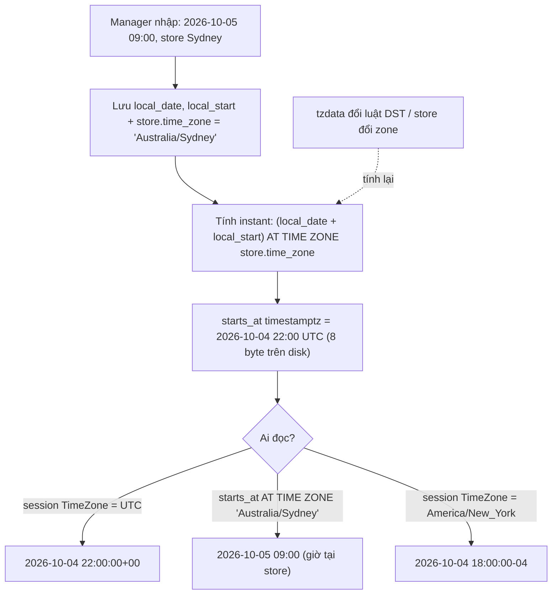
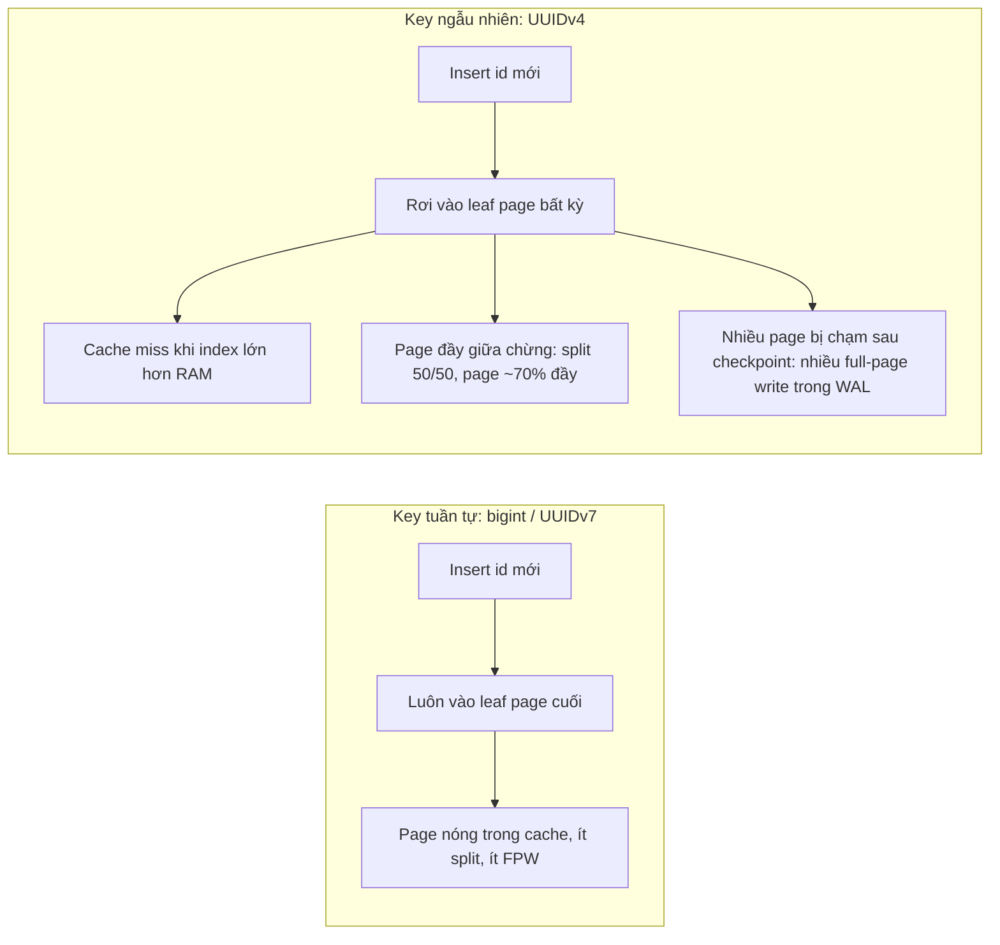

## Bối cảnh & vấn đề

Schema là quyết định **khó đổi nhất** trong một hệ thống. Code có thể refactor trong một sprint, còn đổi kiểu primary key của bảng 500 triệu dòng, hay sửa lại toàn bộ dữ liệu giờ giấc đã lưu sai, thì mất nhiều tháng và thường cần một [zero-downtime migration](/tracks/sql-postgres/learn/zero-downtime-migrations) nhiều bước. Vì vậy interviewer thích hỏi data modeling: câu trả lời cho thấy bạn có nghĩ tới chuyện hệ thống sống được 5 năm hay không.

Ba câu chuyện thật, rất hay gặp:

- **ID tràn `int`.** Bảng `events` dùng `id serial` (tức `int`, tối đa 2,147,483,647). Sau vài năm, mỗi ngày ghi vài triệu dòng, một buổi sáng mọi insert đều lỗi `ERROR: integer out of range` hoặc `nextval: reached maximum value of sequence`. Đổi cột sang `bigint` bằng `ALTER COLUMN ... TYPE bigint` phải **rewrite cả bảng** dưới lock `ACCESS EXCLUSIVE`. Basecamp từng có sự cố kéo dài gần một ngày vì đúng lỗi này năm 2018 (verify).
- **Giờ ca làm bị lệch một tiếng.** Một app quản lý ca (shift) cho chuỗi cửa hàng ở Sydney, Sài Gòn và New York lưu `starts_at` bằng `timestamp` "giờ server". Đến tuần Sydney đổi giờ mùa hè (DST), mọi ca tương lai ở Sydney hiện sai một tiếng, và báo cáo giờ công của ca đêm hôm đó bị tính 8 tiếng thay vì 7.
- **Rò dữ liệu giữa các tenant.** Một SaaS dùng chung bảng `orders` cho mọi khách hàng, phân biệt bằng `tenant_id`. Một endpoint mới quên `WHERE tenant_id = $1`, và khách A thấy đơn hàng của khách B. Không có constraint hay policy nào trong DB chặn lại.

Lesson này đi qua các quyết định nền tảng đó theo thứ tự: chọn **primary key**, chọn **kiểu thời gian**, **normalization** và khi nào phá vỡ nó, **soft delete**, rồi ghép tất cả vào một **schema multi-tenant** có index đúng theo access pattern. Kiến thức về B-tree ở [B-tree index](/tracks/sql-postgres/learn/btree-indexes) được dùng lại nhiều ở đây, nhưng những gì cần sẽ được nhắc lại ngắn gọn.

## Khái niệm

### Surrogate key, sequence và identity column

**Surrogate key** là khoá không mang ý nghĩa nghiệp vụ (một con số hoặc UUID do hệ thống sinh), trái với **natural key** như email hay mã số thuế. Gần như mọi hệ thống OLTP dùng surrogate key vì natural key có thể thay đổi (người dùng đổi email) và thường dài. Natural key vẫn nên được bảo vệ bằng một `UNIQUE` constraint riêng.

Trong Postgres, số tăng dần đến từ một **sequence**: một object riêng, có hàm `nextval()` trả số tiếp theo. `serial` là cách viết tắt cũ: nó tạo cột `int`, tạo một sequence tên `<table>_<col>_seq`, và gắn `DEFAULT nextval(...)`. Vì sequence là một object tách rời, nó có **quyền riêng**: cấp `INSERT` trên bảng cho một role chưa đủ, role đó còn cần `USAGE` trên sequence. Khi copy bảng bằng `CREATE TABLE ... (LIKE ...)`, bảng mới dùng chung sequence của bảng cũ, và đây là nguồn bug rất khó thấy.

**Identity column** (`GENERATED ALWAYS AS IDENTITY`, có từ PG 10) là cú pháp **chuẩn SQL** cho cùng ý tưởng. Sequence vẫn tồn tại bên dưới nhưng gắn chặt vào cột: quyền `INSERT` trên bảng là đủ, và `ALTER TABLE ... ALTER COLUMN id RESTART` quản lý nó như một thuộc tính của cột. Biến thể `ALWAYS` từ chối giá trị do app tự truyền vào (trừ khi viết `OVERRIDING SYSTEM VALUE`), còn `BY DEFAULT` cho phép. Với bảng mới, hãy dùng `bigint GENERATED ALWAYS AS IDENTITY`.

```sql
CREATE TABLE t_serial (id serial PRIMARY KEY, v text);
CREATE TABLE t_ident  (id bigint GENERATED ALWAYS AS IDENTITY PRIMARY KEY, v text);
GRANT INSERT ON t_serial, t_ident TO app_user;
-- Chạy bằng app_user:
INSERT INTO t_serial (v) VALUES ('x');  -- ERROR:  permission denied for sequence t_serial_id_seq
INSERT INTO t_ident  (v) VALUES ('x');  -- INSERT 0 1
INSERT INTO t_ident (id, v) VALUES (5, 'x');
-- ERROR:  cannot insert a non-DEFAULT value into column "id"
-- DETAIL:  Column "id" is an identity column defined as GENERATED ALWAYS.
-- HINT:  Use OVERRIDING SYSTEM VALUE to override.
```

Một tính chất quan trọng: **sequence không transactional**. `nextval()` đã cấp số thì không trả lại khi transaction rollback, để hai transaction song song không phải chờ nhau. Hệ quả là ID luôn có **gap**. Đừng bao giờ dùng identity cho thứ cần liên tục như số hoá đơn theo luật kế toán.

**Interview angle:** interviewer muốn nghe "identity vì chuẩn SQL, quyền gọn, sequence thuộc về cột", rồi hỏi tiếp "vậy số hoá đơn không gap theo từng tenant thì làm sao?" (xem Edge cases).

### int vs bigint

`int` là 4 byte, tối đa khoảng 2,1 tỷ. `bigint` là 8 byte, tối đa khoảng 9,2 × 10^18: sinh một triệu ID mỗi giây thì cũng mất gần 300.000 năm mới hết. Chênh lệch là 4 byte mỗi dòng và mỗi index entry. Với bảng 100 triệu dòng, con số đó khoảng 400 MB cho heap và tương tự cho index, rất nhỏ so với cái giá phải rewrite bảng khi tràn. Quy tắc thực dụng: **mọi primary key và foreign key trỏ vào nó đều dùng `bigint`**, trừ bảng tra cứu nhỏ cố định (danh sách quốc gia, trạng thái). Chú ý FK phải cùng kiểu với PK mà nó tham chiếu: đổi PK sang `bigint` mà quên cột `orders.customer_id` thì cột FK sẽ tràn trước.

**Interview angle:** "Bảng của bạn sắp chạm 2^31, còn hai tuần, bạn làm gì?" Câu trả lời tốt: thêm cột `bigint` mới, backfill theo batch, đổi constraint, swap trong một transaction ngắn, không dùng một câu `ALTER TYPE` trên bảng lớn.

### UUIDv4, UUIDv7 và snowflake

**UUID** là số 128 bit (16 byte), sinh được ở bất cứ đâu (app, mobile client, nhiều region) mà không cần hỏi DB, và không lộ số lượng bản ghi như `/orders/1042`. **UUIDv4** gồm 122 bit ngẫu nhiên. Chính sự ngẫu nhiên đó là vấn đề với B-tree: mỗi insert rơi vào một leaf page bất kỳ trong index. Khi index lớn hơn RAM, gần như mỗi insert phải đọc một page từ disk (cache miss), page đầy thì bị **split** làm đôi nên các page chỉ đầy khoảng 70%, và sau mỗi checkpoint, lần sửa đầu tiên của mỗi page phải ghi nguyên page 8 KB vào WAL (**full-page write**). Insert tuần tự thì ngược lại: luôn ghi vào page cuối cùng, page đó luôn nóng trong cache.

**UUIDv7** (RFC 9562) đặt 48 bit **Unix timestamp tính theo millisecond** ở đầu, phần còn lại là ngẫu nhiên. ID sinh sau gần như luôn lớn hơn ID sinh trước, nên insert lại dồn về cuối index như `bigint`, trong khi vẫn giữ được ưu điểm "sinh ở đâu cũng được". PostgreSQL 18 có sẵn hàm `uuidv7()` (và `uuidv4()` là tên mới của `gen_random_uuid()`) (verify); từ PG 17 có `uuid_extract_timestamp()` để đọc ngược thời điểm tạo (verify). Với bản cũ hơn, sinh UUIDv7 trong app (ví dụ package `uuid` bản 10+ có `v7()`) rồi truyền vào.

**Snowflake ID** (kiểu Twitter) là số 64 bit: khoảng 41 bit timestamp, 10 bit worker id, 12 bit sequence trong mỗi millisecond. Nó vừa time-ordered vừa chỉ tốn 8 byte, nhưng bạn phải cấp và quản lý worker id cho từng instance, và phải xử lý đồng hồ bị lùi (clock skew).

```sql
SELECT uuidv7() AS v7, uuidv4() AS v4, uuid_extract_timestamp(uuidv7()) AS created;
--                   v7                  |                  v4                  |          created
-- 01a0edb0-db2f-78cb-b43e-7dbc627b50a0 | 5140f6b1-8c47-4fb3-9ea9-926ef42d6040 | 2026-09-29 15:06:01.709+00
```

Output trên cho thấy một điều hay bị quên: **UUIDv7 lộ thời điểm tạo**. Ai có ID của một đơn hàng hay một user là biết nó được tạo lúc nào. Thường thì vô hại, nhưng với ID của tài khoản người dùng (lộ ngày đăng ký) hay token thì nên cân nhắc.

**Interview angle:** câu hỏi "bigint, UUIDv4, UUIDv7 hay snowflake?" không có đáp án duy nhất. Điểm cộng là nói được cơ chế (random insert làm hỏng locality của B-tree) và có số liệu đo, như bảng benchmark trong phần Ví dụ.

### timestamp vs timestamptz

Đây là gotcha nổi tiếng nhất của Postgres. **`timestamptz` (timestamp with time zone) không lưu time zone.** Khi ghi, Postgres chuyển giá trị về UTC và lưu một số 8 byte (số microsecond kể từ 2000-01-01 UTC). Khi đọc, nó hiển thị theo tham số `TimeZone` của session. Vì vậy `timestamptz` đại diện cho một **instant**: một thời điểm tuyệt đối trên dòng thời gian, như "lúc khách bấm thanh toán".

**`timestamp` (without time zone)** là "giờ trên đồng hồ treo tường": `2026-10-05 09:00` không kèm ngữ cảnh. Nó không biết đó là 9 giờ ở Sydney hay ở Sài Gòn. Postgres không chuyển đổi gì cả, lưu sao trả vậy. Dùng nó cho một instant là sai, vì cùng giá trị đó có nghĩa khác nhau tuỳ người đọc.

```sql
SET TimeZone = 'Asia/Ho_Chi_Minh';
SELECT timestamptz '2026-03-01 09:00:00+07' AS a;   -- 2026-03-01 09:00:00+07
SET TimeZone = 'America/New_York';
SELECT timestamptz '2026-03-01 09:00:00+07' AS a;   -- 2026-02-28 21:00:00-05
```

Cùng một giá trị lưu trên disk, hai session thấy hai chuỗi hiển thị khác nhau, nhưng đó là **cùng một instant**. Cũng vì thế mà `date` và `time` có chỗ đứng riêng: `date` cho "ngày sinh", "ngày hiệu lực của hợp đồng" (không phải instant), còn `time` cho "cửa hàng mở cửa lúc 08:00".

Toán tử **`AT TIME ZONE`** đổi qua lại giữa hai kiểu, và chiều của nó hay gây nhầm:

- `timestamp AT TIME ZONE 'Australia/Sydney'` → `timestamptz`: "đây là giờ đồng hồ ở Sydney, cho tôi instant tương ứng".
- `timestamptz AT TIME ZONE 'Australia/Sydney'` → `timestamp`: "instant này, người ở Sydney nhìn đồng hồ thấy mấy giờ?".

**Interview angle:** trả lời "`timestamptz` lưu time zone" là red flag ngay lập tức. Câu đúng là "lưu UTC instant, hiển thị theo session TimeZone".

### Local time + IANA zone cho lịch tương lai

Với sự kiện **đã xảy ra** (`created_at`, giờ chấm công thực tế), `timestamptz` là đủ: instant đã cố định. Với sự kiện **trong tương lai theo giờ địa phương**, như "ca sáng thứ Hai bắt đầu 09:00 tại cửa hàng Sydney", thứ nghiệp vụ thật sự cam kết là **giờ đồng hồ tại nơi đó**, không phải một instant UTC. Nếu chính phủ đổi luật DST (điều này xảy ra vài lần mỗi năm ở đâu đó trên thế giới, và tz database được cập nhật theo), instant UTC tính trước sẽ sai, còn "09:00 Sydney" vẫn đúng.

Vì vậy mô hình chuẩn cho lịch là lưu **`local_date` + `local_start` (hoặc `timestamp`) + tên zone IANA** như `'Australia/Sydney'`, thường gắn ở cấp store. Đừng lưu offset cố định như `+10:00`: offset thay đổi theo mùa, còn tên zone mang theo toàn bộ lịch sử và luật DST. Để query nhanh ("ca nào đang diễn ra"), bạn tính thêm cột instant `starts_at`/`ends_at timestamptz` từ giờ địa phương, và tính lại chúng khi zone của store đổi hoặc khi cập nhật tzdata.

DST sinh ra hai loại giờ đặc biệt. **Giờ không tồn tại**: sáng 2026-10-04 ở Sydney, đồng hồ nhảy từ 02:00 lên 03:00, nên 02:30 không có thật. **Giờ lặp lại**: sáng 2026-04-05, đồng hồ lùi từ 03:00 về 02:00, nên 02:30 xảy ra hai lần. Theo docs, Postgres hiểu giờ không tồn tại bằng offset **trước** lúc chuyển giờ, và giờ lặp lại bằng **giờ chuẩn** (standard time); phần Ví dụ có output cụ thể.

**Interview angle:** "store đổi time zone thì ca đã xếp trong tương lai ra sao?" Câu trả lời tốt: giờ địa phương giữ nguyên (09:00 vẫn là 09:00), tính lại instant, và thông báo cho nhân viên vì giờ UTC của họ đổi.

### Normalization, nói bằng lời thường

**Normalization** là tách dữ liệu sao cho **mỗi sự thật được lưu đúng một chỗ**, để một lần cập nhật không thể để lại hai phiên bản mâu thuẫn nhau. Ba dạng chuẩn đầu tiên đủ cho gần hết công việc thực tế:

- **1NF**: mỗi ô chỉ chứa một giá trị nguyên tử, không có "danh sách trong một cột" kiểu `product_ids = 'P1,P2'` và không có cột lặp `phone1, phone2, phone3`.
- **2NF**: nếu khoá gồm nhiều cột, mọi cột khác phải phụ thuộc vào **toàn bộ** khoá. Trong bảng `(order_id, product_id, product_name)`, `product_name` chỉ phụ thuộc `product_id`, nên nó thuộc về bảng `products`.
- **3NF**: không có phụ thuộc bắc cầu. Nếu `orders` có `customer_id` và `customer_phone`, thì phone phụ thuộc vào customer chứ không phải vào order, nên nó thuộc về bảng `customers`.

Một điểm hay bị hiểu sai: **giá tại thời điểm mua không phải là dữ liệu trùng lặp**. `order_items.unit_price_cents` là một sự thật khác với `products.price_cents` hiện tại: một cái là "khách đã trả bao nhiêu", một cái là "giá đang niêm yết". Nếu bạn "chuẩn hoá" bằng cách bỏ giá khỏi `order_items` rồi JOIN sang `products`, thì mỗi lần tăng giá sẽ làm thay đổi tổng tiền của các hoá đơn cũ.

**Interview angle:** interviewer hỏi normalization để xem bạn có biết **khi nào nên phá** nó (xem Trade-offs), chứ không phải để bạn đọc thuộc định nghĩa BCNF.

### Constraints là tài liệu sống

Mỗi constraint là một quy tắc nghiệp vụ mà DB **cam kết** giữ, cho mọi code path: app chính, script migration, người sửa tay bằng psql lúc 2 giờ sáng. Validation ở tầng app chỉ bảo vệ code path đi qua nó.

- `CHECK (total_cents >= 0)`, `CHECK (status IN (...))`, `CHECK (ends_at > starts_at)`: giới hạn giá trị hợp lệ.
- `FOREIGN KEY`: không có đơn hàng mồ côi. Chú ý Postgres **không tự tạo index** cho cột FK phía con; thiếu index này thì `DELETE` ở bảng cha phải scan bảng con.
- `UNIQUE`: natural key thật sự duy nhất, và là nền tảng cho `INSERT ... ON CONFLICT`.
- **Exclusion constraint** (`EXCLUDE USING gist`): tổng quát hoá của unique, ví dụ "cùng một nhân viên không có hai ca chồng lấn nhau về thời gian", một quy tắc mà chỉ kiểm tra ở app thì luôn có race condition.

```sql
CREATE EXTENSION IF NOT EXISTS btree_gist;
ALTER TABLE shifts ADD CONSTRAINT no_overlap
  EXCLUDE USING gist (employee_id WITH =, tstzrange(starts_at, ends_at) WITH &&);
```

**Interview angle:** "tại sao không validate ở app thôi?" Vì hai request song song đều qua được kiểm tra ở app rồi cùng insert; chỉ constraint trong DB mới là atomic.

### Soft delete và archive table

**Soft delete** là không `DELETE` dòng mà đánh dấu `deleted_at timestamptz` (NULL nghĩa là còn sống). Lợi ích: khôi phục được, có audit, và dòng con không bị mồ côi. `deleted_at` tốt hơn `is_deleted boolean` vì cho biết thời điểm xoá, từ đó dọn dữ liệu theo tuổi được.

Cái giá là **mọi query phải nhớ `WHERE deleted_at IS NULL`**, và mọi `UNIQUE` constraint cũ bị hỏng về ngữ nghĩa: user `an@example.com` đã xoá vẫn giữ email đó, nên không đăng ký lại được. Cách sửa là **partial unique index** chỉ áp cho dòng còn sống: `CREATE UNIQUE INDEX ... ON users (lower(email)) WHERE deleted_at IS NULL`. Để app khỏi quên điều kiện lọc, có thể đọc qua một view `active_users`, hoặc dùng policy RLS ẩn dòng đã xoá.

**Archive table** là cách thay thế: `DELETE` khỏi bảng chính và chép dòng đó sang `users_archive` (bằng trigger hoặc `WITH d AS (DELETE ... RETURNING *) INSERT INTO ... SELECT * FROM d`). Bảng chính luôn gọn, index không phình, unique constraint giữ nguyên ý nghĩa; đổi lại, muốn khôi phục thì phải chép ngược về, còn FK từ bảng khác trỏ vào dòng đã chuyển đi thì phải xử lý riêng.

Một cảnh báo pháp lý: **soft delete không phải là xoá theo GDPR** ("right to erasure"). Dữ liệu cá nhân vẫn nằm trong bảng, trong backup, trong replica. Khi có yêu cầu xoá, bạn phải xoá thật hoặc ẩn danh hoá (anonymize) các cột cá nhân, kể cả khi vẫn giữ dòng để giữ tính toàn vẹn của sổ sách.

**Interview angle:** "soft delete đi kèm những gì?" Câu trả lời đầy đủ gồm partial unique index, view/RLS, job hard-delete theo batch, và sự khác biệt với GDPR erasure.

### Multi-tenancy trong một schema chung

**Multi-tenant** là một hệ thống phục vụ nhiều khách hàng (tenant) với dữ liệu cách ly. Có ba mô hình chính: **shared schema** (mọi tenant chung bảng, phân biệt bằng `tenant_id`, gọi là "pool"), **schema-per-tenant** ("bridge"), và **database-per-tenant** ("silo"). Shared schema rẻ nhất và scale số tenant tốt nhất, nhưng cách ly phụ thuộc hoàn toàn vào việc mọi query có `tenant_id`.

Trong shared schema có ba quy tắc thiết kế. Một: **`tenant_id` có mặt ở mọi bảng thuộc về tenant**, kể cả bảng con như `order_items`, để mọi query lọc được mà không cần JOIN ngược lên. Hai: **`tenant_id` là cột đầu tiên của gần như mọi index**, vì mọi query đều có `tenant_id = $1`, và cột đầu của B-tree là cột lọc bằng đẳng thức. Ba: **composite foreign key `(tenant_id, customer_id)`** tham chiếu `customers (tenant_id, id)`, để DB từ chối một đơn hàng của tenant 1 trỏ vào khách hàng của tenant 2. FK đơn cột `customer_id → customers(id)` không bắt được lỗi này.

**Interview angle:** "làm sao đảm bảo không ai quên `tenant_id`?" Có ba lớp: repository/ORM bắt buộc truyền tenant, composite FK, và Row-Level Security như lớp phòng thủ cuối.

Tóm tắt các khái niệm trên:

| Khái niệm | Một dòng | Ví dụ |
| --- | --- | --- |
| Identity column | Sequence chuẩn SQL gắn vào cột | `bigint GENERATED ALWAYS AS IDENTITY` |
| UUIDv7 | UUID có prefix timestamp ms | `uuidv7()` (PG 18) |
| `timestamptz` | UTC instant, hiển thị theo session | `created_at timestamptz` |
| Local time + zone | Lịch tương lai theo giờ địa phương | `09:00` + `'Australia/Sydney'` |
| Partial unique index | Unique chỉ trên dòng còn sống | `WHERE deleted_at IS NULL` |
| Composite FK | FK kèm `tenant_id` chống lẫn tenant | `(tenant_id, customer_id)` |

## Cơ chế hoạt động

### Một giá trị thời gian đi từ app vào disk và quay lại

Sơ đồ dưới đây theo dõi một ca làm "09:00 thứ Hai tại Sydney" từ lúc quản lý xếp lịch đến lúc nhân viên ở New York xem lịch.



Có ba bước. **Bước 1**, dữ liệu nghiệp vụ gốc là giờ địa phương cộng tên zone: đây là "nguồn sự thật" của lịch. **Bước 2**, từ đó tính ra một instant `timestamptz`; Postgres dùng tz database (IANA) để biết ngày 2026-10-05 Sydney đang ở AEDT (UTC+11), nên 09:00 tương ứng 22:00 UTC ngày hôm trước. Trên disk chỉ còn con số UTC, không còn chữ "Sydney". **Bước 3**, lúc hiển thị, mỗi client chọn cách xem: theo `TimeZone` của session, hoặc tường minh bằng `AT TIME ZONE` với zone của store. Mũi tên nét đứt là lý do phải giữ giờ địa phương: khi luật thay đổi, ta tính lại bước 2 từ bước 1, còn nếu chỉ lưu instant thì không biết "ý định ban đầu" là mấy giờ.

Vì sao Postgres thiết kế `timestamptz` như vậy thay vì lưu kèm zone? Vì một instant không cần zone để so sánh hay sắp xếp: `ORDER BY created_at` trên UTC luôn đúng, index B-tree trên 8 byte rất gọn, và "zone hiển thị" là mối quan tâm của người đọc chứ không phải của sự kiện. Cái giá là nếu bạn thật sự cần biết "sự kiện này xảy ra ở zone nào", bạn phải lưu zone trong một cột riêng.

### Vì sao key ngẫu nhiên làm chậm insert

B-tree giữ các key theo thứ tự trong các leaf page 8 KB. Với key tăng dần (`bigint` identity, UUIDv7), mọi insert đều đi vào **page ngoài cùng bên phải**. Page đó luôn nằm trong `shared_buffers`, khi đầy thì Postgres có tối ưu riêng cho split ở page ngoài cùng bên phải (page cũ được giữ đầy theo `fillfactor`, mặc định 90% cho leaf page, thay vì chia đôi 50/50), và chỉ vài page mới bị "chạm lần đầu sau checkpoint" nên WAL ít full-page write.



Với UUIDv4, insert thứ một triệu có thể rơi vào bất kỳ page nào trong hàng chục nghìn leaf page. Khi toàn bộ index vừa RAM, cái giá chủ yếu là split và WAL. Khi index lớn hơn RAM, mỗi insert còn phải đọc một page từ disk, và throughput insert có thể giảm nhiều lần. Chi tiết về WAL và full-page write có ở [Storage & WAL](/tracks/sql-postgres/learn/storage-wal).

### Composite index trong multi-tenant

Với index `(tenant_id, created_at DESC, id DESC)`, B-tree sắp theo `tenant_id` trước, rồi trong mỗi tenant theo `created_at` giảm dần. Query `WHERE tenant_id = 7 ORDER BY created_at DESC LIMIT 50` nhảy thẳng tới đoạn của tenant 7 rồi đọc 50 entry liên tiếp, không cần sort. Nếu đảo thành `(created_at, tenant_id)`, các đơn của tenant 7 nằm xen kẽ với đơn của mọi tenant khác, nên query phải lướt qua rất nhiều entry không liên quan. Đó là lý do quy tắc "`tenant_id` đứng đầu" không phải thói quen mà là hệ quả trực tiếp của cách B-tree sắp xếp.

## Ví dụ thực tế

### Ví dụ 1: ca làm nhiều time zone, qua đêm và qua DST

Tất cả output dưới đây chạy trên PostgreSQL 18.6 với `SET TimeZone = 'UTC'`.

```sql
CREATE TABLE stores (
  id        bigint GENERATED ALWAYS AS IDENTITY PRIMARY KEY,
  name      text NOT NULL,
  time_zone text NOT NULL            -- tên IANA, validate khi ghi (xem Edge cases)
);
CREATE TABLE shifts (
  id          bigint GENERATED ALWAYS AS IDENTITY PRIMARY KEY,
  store_id    bigint NOT NULL REFERENCES stores(id),
  local_date  date NOT NULL,         -- nguồn sự thật: giờ địa phương
  local_start time NOT NULL,
  local_end   time NOT NULL,
  starts_at   timestamptz NOT NULL,  -- instant tính ra, để query/index
  ends_at     timestamptz NOT NULL,
  CHECK (ends_at > starts_at)
);
INSERT INTO stores (name, time_zone) VALUES
  ('Sydney CBD','Australia/Sydney'), ('Saigon D1','Asia/Ho_Chi_Minh'), ('NYC SoHo','America/New_York');

INSERT INTO shifts (store_id, local_date, local_start, local_end, starts_at, ends_at)
SELECT s.id, v.d, v.st, v.en,
       (v.d + v.st) AT TIME ZONE s.time_zone,
       -- ca qua nửa đêm: giờ kết thúc thuộc ngày hôm sau
       (v.d + v.en + CASE WHEN v.en <= v.st THEN interval '1 day' ELSE interval '0' END) AT TIME ZONE s.time_zone
FROM stores s JOIN (VALUES
  ('Sydney CBD', date '2026-10-03', time '22:00', time '06:00'),   -- ca đêm qua DST
  ('Saigon D1',  date '2026-10-04', time '01:00', time '09:00'),
  ('NYC SoHo',   date '2026-10-03', time '12:00', time '20:00'),
  ('NYC SoHo',   date '2026-10-03', time '08:00', time '12:00')
) v(store, d, st, en) ON v.store = s.name;

SELECT st.name, sh.local_date, sh.local_start, sh.local_end, sh.starts_at, sh.ends_at,
       sh.ends_at - sh.starts_at AS dur
FROM shifts sh JOIN stores st ON st.id = sh.store_id ORDER BY sh.starts_at;
```

```text
    name    | local_date | local_start | local_end |       starts_at        |        ends_at         |   dur
------------+------------+-------------+-----------+------------------------+------------------------+----------
 Sydney CBD | 2026-10-03 | 22:00:00    | 06:00:00  | 2026-10-03 12:00:00+00 | 2026-10-03 19:00:00+00 | 07:00:00
 NYC SoHo   | 2026-10-03 | 08:00:00    | 12:00:00  | 2026-10-03 12:00:00+00 | 2026-10-03 16:00:00+00 | 04:00:00
 NYC SoHo   | 2026-10-03 | 12:00:00    | 20:00:00  | 2026-10-03 16:00:00+00 | 2026-10-04 00:00:00+00 | 08:00:00
 Saigon D1  | 2026-10-04 | 01:00:00    | 09:00:00  | 2026-10-03 18:00:00+00 | 2026-10-04 02:00:00+00 | 08:00:00
```

Hãy đọc dòng đầu: ca đêm Sydney 22:00–06:00 trên giấy là 8 tiếng, nhưng **thực tế chỉ 7 tiếng** vì 02:00 sáng 2026-10-04 đồng hồ nhảy lên 03:00. Lúc bắt đầu Sydney đang ở UTC+10 (22:00 → 12:00 UTC), lúc kết thúc đã là UTC+11 (06:00 → 19:00 UTC). Nếu tính giờ công bằng `local_end - local_start` hoặc bằng cách cộng offset cố định, lương ca đêm đó sẽ sai. Ngược lại, ca đêm 2026-04-04 (DST kết thúc) dài **9 tiếng**:

```sql
SELECT ((date '2026-04-05' + time '06:00') AT TIME ZONE 'Australia/Sydney')
     - ((date '2026-04-04' + time '22:00') AT TIME ZONE 'Australia/Sydney') AS dur;
--   dur
-- ----------
--  09:00:00
```

Giờ không tồn tại và giờ lặp lại được xử lý như sau:

```sql
SELECT timestamp '2026-10-04 02:30' AT TIME ZONE 'Australia/Sydney' AS gap,        -- không tồn tại
       timestamp '2026-04-05 02:30' AT TIME ZONE 'Australia/Sydney' AS ambiguous;  -- xảy ra 2 lần
--           gap           |       ambiguous
-- ------------------------+------------------------
--  2026-10-03 16:30:00+00 | 2026-04-04 16:30:00+00
SET TimeZone = 'Australia/Sydney';
SELECT timestamptz '2026-10-03 16:30+00' AS gap_local;   -- 2026-10-04 03:30:00+11
```

Postgres không báo lỗi với 02:30 không tồn tại: nó dùng offset trước lúc chuyển (+10), nên kết quả hiển thị lại thành 03:30 AEDT. Với 02:30 lặp lại, nó chọn giờ chuẩn (+10), tức lần xảy ra thứ hai. App nên phát hiện hai trường hợp này ngay khi quản lý xếp lịch và hỏi lại, thay vì để DB âm thầm chọn.

Cuối cùng là câu hỏi hay gặp nhất: "**ca nào đang diễn ra ngay bây giờ**, ở mọi store?". Vì đã có cột instant, query chỉ là một range condition, không phụ thuộc zone:

```sql
SELECT st.name,
       sh.starts_at AT TIME ZONE st.time_zone AS local_start,
       sh.ends_at   AT TIME ZONE st.time_zone AS local_end
FROM shifts sh JOIN stores st ON st.id = sh.store_id
WHERE sh.starts_at <= timestamptz '2026-10-03 18:30+00'   -- thực tế: now()
  AND sh.ends_at   >  timestamptz '2026-10-03 18:30+00'
ORDER BY st.name;
```

```text
    name    |     local_start     |      local_end
------------+---------------------+---------------------
 NYC SoHo   | 2026-10-03 12:00:00 | 2026-10-03 20:00:00
 Saigon D1  | 2026-10-04 01:00:00 | 2026-10-04 09:00:00
 Sydney CBD | 2026-10-03 22:00:00 | 2026-10-04 06:00:00
```

Để query này nhanh ở quy mô lớn, dùng index `(tenant_id, starts_at)` kèm giới hạn độ dài ca tối đa (`starts_at > now() - interval '24 hours'`), hoặc một GiST index trên `tstzrange(starts_at, ends_at)` với toán tử `@> now()`. Chiều nửa mở `[starts_at, ends_at)` (`<=` và `>`) giúp một ca kết thúc lúc 12:00 và ca tiếp theo bắt đầu lúc 12:00 không bị đếm trùng.

### Ví dụ 2: đo bigint vs UUIDv4 vs UUIDv7

Insert 2 triệu dòng vào ba bảng chỉ khác kiểu primary key, trên PostgreSQL 18 trong Docker trên laptop, `shared_buffers = 128MB`, có `CHECKPOINT` trước mỗi lần đo:

```sql
CREATE TABLE k_big (id bigint GENERATED ALWAYS AS IDENTITY PRIMARY KEY, v int);
CREATE TABLE k_v4  (id uuid PRIMARY KEY DEFAULT uuidv4(), v int);
CREATE TABLE k_v7  (id uuid PRIMARY KEY DEFAULT uuidv7(), v int);
INSERT INTO k_v4 (v) SELECT g FROM generate_series(1, 2000000) g;  -- tương tự cho hai bảng kia
-- WAL đo bằng pg_wal_lsn_diff(pg_current_wal_lsn() sau, trước)
```

```text
  key   | insert time |  wal   | pk_index
--------+-------------+--------+----------
 bigint |    2.97 s   | 270 MB | 43 MB
 uuidv4 |    7.70 s   | 325 MB | 76 MB
 uuidv7 |    4.07 s   | 297 MB | 60 MB
```

UUIDv4 chậm hơn bigint khoảng 2,6 lần và index to gần gấp đôi: một phần vì UUID 16 byte, phần lớn còn lại vì page chỉ đầy khoảng 70% sau các split ngẫu nhiên. UUIDv7 nằm giữa: cùng 16 byte như v4 nhưng insert tuần tự. Trong thử nghiệm này index vẫn vừa RAM; khi index lớn hơn RAM nhiều lần, khoảng cách giữa v4 và v7 thường còn lớn hơn nhiều. Con số tuyệt đối phụ thuộc phần cứng, nên hãy tự đo trên môi trường của bạn (verify).

### Ví dụ 3: schema multi-tenant cho orders

```sql
CREATE TABLE customers (
  tenant_id bigint NOT NULL REFERENCES tenants(id),
  id        bigint GENERATED ALWAYS AS IDENTITY,
  email     text   NOT NULL,
  PRIMARY KEY (tenant_id, id),
  UNIQUE (tenant_id, email)
);
CREATE TABLE orders (
  tenant_id   bigint NOT NULL REFERENCES tenants(id),
  id          bigint GENERATED ALWAYS AS IDENTITY,
  order_no    text   NOT NULL,                       -- số hiển thị cho người dùng
  customer_id bigint NOT NULL,
  status      text   NOT NULL CHECK (status IN ('pending','paid','shipped','cancelled')),
  total_cents bigint NOT NULL CHECK (total_cents >= 0),
  created_at  timestamptz NOT NULL DEFAULT now(),
  PRIMARY KEY (tenant_id, id),
  UNIQUE (tenant_id, order_no),
  FOREIGN KEY (tenant_id, customer_id) REFERENCES customers (tenant_id, id)
);
-- tenant 1 có customer id=1, tenant 2 có customer id=2
INSERT INTO orders (tenant_id, order_no, customer_id, status, total_cents)
VALUES (1, 'A-1001', 2, 'paid', 5000);
```

```text
ERROR:  insert or update on table "orders" violates foreign key constraint "orders_tenant_id_customer_id_fkey"
DETAIL:  Key (tenant_id, customer_id)=(1, 2) is not present in table "customers".
```

Composite FK đã chặn một đơn của tenant 1 trỏ sang khách hàng của tenant 2, loại bug mà FK đơn cột `customer_id` để lọt. Tiếp theo là **index plan theo từng endpoint**, mỗi index phục vụ một access pattern cụ thể:

| Endpoint | Query | Index |
| --- | --- | --- |
| List (mới nhất trước) | `WHERE tenant_id=$1 ORDER BY created_at DESC, id DESC LIMIT 50` | `(tenant_id, created_at DESC, id DESC)` |
| Detail | `WHERE tenant_id=$1 AND id=$2` hoặc `order_no=$2` | PK `(tenant_id, id)`, unique `(tenant_id, order_no)` |
| Lọc theo status | `WHERE tenant_id=$1 AND status=$2 ORDER BY created_at DESC` | `(tenant_id, status, created_at DESC, id DESC)` |
| Đơn đang chờ (hiếm, hot) | `WHERE tenant_id=$1 AND status='pending'` | partial `(tenant_id, created_at) WHERE status = 'pending'` |
| Đơn của một khách | `WHERE tenant_id=$1 AND customer_id=$2` | `(tenant_id, customer_id, created_at DESC)`, cũng là index cho FK |
| Reporting theo tháng | `GROUP BY date_trunc('month', created_at)` trên nhiều tenant | không index trên primary: chạy trên replica hoặc warehouse |

Không index mọi cột: mỗi index làm chậm mọi `INSERT`/`UPDATE` và có thể phá **HOT update** (xem [MVCC & VACUUM](/tracks/sql-postgres/learn/mvcc-vacuum)). Hãy bắt đầu từ `pg_stat_statements` để biết query nào thật sự nặng.

Lớp phòng thủ cuối là **Row-Level Security**:

```sql
ALTER TABLE orders ENABLE ROW LEVEL SECURITY;
CREATE POLICY tenant_isolation ON orders
  USING      (tenant_id = current_setting('app.tenant_id', true)::bigint)
  WITH CHECK (tenant_id = current_setting('app.tenant_id', true)::bigint);

-- chạy bằng role của app (không phải owner của bảng)
BEGIN;
SET LOCAL app.tenant_id = '1';
SELECT tenant_id, order_no, status FROM orders;   -- chỉ thấy dòng của tenant 1
INSERT INTO orders (tenant_id, order_no, customer_id, status, total_cents)
VALUES (2, 'G-2', 2, 'paid', 1);
-- ERROR:  new row violates row-level security policy for table "orders"
ROLLBACK;
```

Có hai chi tiết cần nhớ. Owner của bảng và superuser **bỏ qua RLS** trừ khi bảng có `ALTER TABLE ... FORCE ROW LEVEL SECURITY`, nên app phải kết nối bằng một role riêng. Và `SET LOCAL` chỉ sống trong transaction: sau một [connection pooler](/tracks/sql-postgres/learn/connection-pooling) như PgBouncer ở transaction mode, dùng `SET` (cấp session) rất nguy hiểm: request sau, được cấp cùng connection vật lý, có thể kế thừa tenant của request trước. Luôn đặt tenant bằng `SET LOCAL` hoặc `set_config('app.tenant_id', $1, true)` bên trong transaction của mỗi request. Tham số `true` thứ hai trong `current_setting(..., true)` làm hàm trả NULL thay vì lỗi khi chưa set, nên policy "fail closed": không set tenant thì không thấy dòng nào.

## Trade-offs & lựa chọn thay thế

### Chọn primary key

| Tiêu chí | `bigint` identity | UUIDv4 | UUIDv7 | Snowflake |
| --- | --- | --- | --- | --- |
| Kích thước | 8 byte | 16 byte | 16 byte | 8 byte |
| Locality khi insert | Tuần tự, tốt nhất | Ngẫu nhiên, kém | Gần tuần tự | Gần tuần tự |
| Sinh ở đâu | Chỉ DB | Bất kỳ đâu | Bất kỳ đâu | App, cần worker id |
| Lộ thông tin | Số lượng, tốc độ tăng | Không | Thời điểm tạo | Thời điểm tạo, worker |
| Đoán được ID khác | Dễ (id+1) | Không | Khó (phần random) | Tương đối dễ |
| Merge nhiều nguồn/region | Khó (đụng số) | Dễ | Dễ | Dễ nếu worker id riêng |
| Debug, đọc bằng mắt | Dễ | Khó | Khó | Trung bình |

Khi nào chọn cái nào:

- **Mặc định cho một service một database**: `bigint GENERATED ALWAYS AS IDENTITY` cho khoá nội bộ. Nếu không muốn lộ số lượng qua URL, thêm một cột public id riêng (UUID hoặc chuỗi ngẫu nhiên ngắn) có unique index, và chỉ expose cột đó ra API.
- **Cần sinh ID trước khi ghi DB** (client offline-first, event sourcing, nhiều region ghi song song, gộp dữ liệu từ nhiều database): **UUIDv7**. Dùng `uuidv7()` nếu đã ở PG 18, còn không thì sinh trong app.
- **UUIDv4** chỉ còn hợp lý khi bạn cần ID hoàn toàn không mang thông tin (không lộ cả thời điểm tạo), ví dụ token hay ID công khai của tài nguyên nhạy cảm, và chấp nhận chi phí insert.
- **Snowflake** khi cần ID 8 byte, time-ordered và sinh phân tán, thường ở hệ thống rất lớn đã có hạ tầng cấp worker id. Với đa số team, UUIDv7 đơn giản hơn.

### Chọn kiểu thời gian

| Dữ liệu | Kiểu | Lý do |
| --- | --- | --- |
| Sự kiện đã xảy ra: `created_at`, `paid_at`, giờ chấm công | `timestamptz` | Instant tuyệt đối, so sánh và sort đúng |
| Lịch tương lai theo giờ địa phương: ca làm, lịch hẹn | `date` + `time` (hoặc `timestamp`) + tên zone IANA, cộng cột `timestamptz` tính ra | Giữ ý định gốc, tính lại được khi luật DST đổi |
| Ngày không gắn giờ: ngày sinh, ngày hiệu lực | `date` | Không phải instant, không bị lệch ngày khi đổi zone |
| Giờ mở cửa lặp lại hằng ngày | `time` + zone của store | Không gắn với ngày cụ thể |
| Khoảng thời gian | `tstzrange` | Có toán tử chồng lấn `&&`, dùng được với exclusion constraint |

### Normalize hay denormalize

Normalize đến 3NF là mặc định cho OLTP: ghi an toàn, không có bất nhất. Denormalize là một **quyết định có chủ đích**, có cơ chế đồng bộ rõ ràng, trong các trường hợp:

- **Read model / reporting**: bảng tổng hợp theo ngày, materialized view, hoặc warehouse, để dashboard không JOIN năm bảng trên primary.
- **Counter**: `posts.comment_count` cập nhật bằng trigger hoặc trong cùng transaction, thay vì `count(*)` mỗi lần hiển thị. Cẩn thận: một counter nóng là một dòng bị update liên tục, thành điểm tranh chấp lock.
- **Snapshot nghiệp vụ**: giá, địa chỉ giao hàng, tên sản phẩm tại thời điểm đặt hàng. Như đã nói, đây thực ra là một sự thật riêng, không phải dữ liệu trùng lặp.
- **Thuộc tính động**: cột `attributes jsonb` cho các thuộc tính khác nhau theo loại sản phẩm, thay vì mô hình EAV (entity-attribute-value) phải JOIN nhiều lần. Xem [Index types & JSONB](/tracks/sql-postgres/learn/index-types-jsonb).

### Soft delete hay archive table

| | Soft delete (`deleted_at`) | Archive table | Hard delete |
| --- | --- | --- | --- |
| Khôi phục | Một câu `UPDATE` | Chép ngược về | Chỉ từ backup |
| Query hằng ngày | Phải lọc `deleted_at IS NULL` | Không cần lọc | Không cần lọc |
| Unique constraint | Cần partial unique index | Giữ nguyên | Giữ nguyên |
| Kích thước bảng chính và index | Phình theo thời gian | Gọn | Gọn |
| FK từ bảng khác | Vẫn hợp lệ | Phải xử lý | `CASCADE`/`RESTRICT` |
| GDPR erasure | Không đạt nếu không xoá hoặc ẩn danh | Không đạt nếu không xoá | Đạt (trừ backup) |

Chọn soft delete khi người dùng hay cần "hoàn tác" và tỉ lệ dòng bị xoá thấp. Chọn archive table khi dòng bị xoá chiếm nhiều và hiếm khi cần đọc lại, ví dụ đơn hàng cũ hơn hai năm. Nhiều hệ thống kết hợp cả hai: soft delete trong 30 ngày, sau đó job chuyển sang archive hoặc xoá hẳn.

## So sánh với SQL Server

- **IDENTITY**: SQL Server `IDENTITY(1,1)` tương tự identity của Postgres, cũng có gap khi rollback. Ngoài ra, sau khi restart, SQL Server có thể nhảy cả nghìn số do identity cache (tắt được bằng `ALTER DATABASE SCOPED CONFIGURATION SET IDENTITY_CACHE = OFF` từ SQL Server 2017) (verify). Muốn chèn giá trị tay thì dùng `SET IDENTITY_INSERT dbo.orders ON`, tương đương `OVERRIDING SYSTEM VALUE`. SQL Server cũng có object `SEQUENCE` riêng.
- **GUID làm clustered index**: trong SQL Server, primary key mặc định là **clustered index**, tức bản thân bảng được sắp theo key. Một clustered key `NEWID()` ngẫu nhiên gây page split và fragmentation trên chính dữ liệu, nặng hơn Postgres (nơi heap không sắp theo key và chỉ index bị ảnh hưởng). `NEWSEQUENTIALID()` là giải pháp tuần tự của SQL Server.
- **Thời gian**: `datetime2` không có zone (tương đương `timestamp`), `datetimeoffset` lưu kèm **offset** như `+10:00` (không phải tên zone, nên vẫn không biết luật DST). `AT TIME ZONE` của SQL Server dùng tên zone Windows như `'AUS Eastern Standard Time'`, không phải tên IANA.

## Edge cases & failure modes

- **Số hoá đơn không gap theo tenant.** Identity có gap, nên dùng một bảng counter `invoice_counters (tenant_id PRIMARY KEY, next_no bigint)` và lấy số bằng `UPDATE invoice_counters SET next_no = next_no + 1 WHERE tenant_id = $1 RETURNING next_no - 1` **trong cùng transaction** tạo hoá đơn. Dòng counter bị lock tới khi commit, nên nếu transaction rollback thì số cũng không bị tiêu. Cái giá là mọi hoá đơn của một tenant bị xếp hàng qua một dòng; giữ transaction đó thật ngắn. Xem thêm [Locking & concurrency](/tracks/sql-postgres/learn/locking-concurrency).
- **`OVERRIDING SYSTEM VALUE` rồi quên chỉnh sequence.** Sau khi import dữ liệu cũ với ID tự chọn, sequence không tự nhảy qua giá trị lớn nhất. Khi đo, sau khi chèn tay id 100, insert kế tiếp vẫn nhận id 4, và sớm muộn sẽ đụng `duplicate key`. Sau import, chạy `SELECT setval(pg_get_serial_sequence('t', 'id'), max(id)) FROM t` (hàm này cũng dùng được với identity).
- **Tên zone sai hoặc bị xoá.** `AT TIME ZONE 'Mars/Olympus'` báo `ERROR: time zone "Mars/Olympus" not recognized`. Validate tên zone khi ghi (so với `pg_timezone_names` hoặc bằng thư viện có tz database trong app), đừng để đến lúc query báo cáo mới vỡ. Tránh đặt `CHECK` gọi `now()`, vì biểu thức trong `CHECK` nên là immutable.
- **tzdata cập nhật.** Postgres dùng tzdata của hệ điều hành hoặc bản đi kèm; khi một quốc gia đổi luật DST, các cột `starts_at` đã tính sẵn cho tương lai sẽ lệch. Cần một job tính lại instant từ giờ địa phương cho các ca tương lai sau mỗi lần nâng cấp tzdata.
- **Store đổi zone.** Giữ nguyên giờ địa phương của các ca tương lai, tính lại `starts_at`/`ends_at`, và thông báo cho người liên quan. Ca trong quá khứ không đổi, vì chúng là instant đã xảy ra.
- **Soft delete và FK.** FK không biết gì về `deleted_at`: đơn hàng vẫn trỏ được tới một khách hàng đã soft delete, và insert mới cũng vậy. Nếu nghiệp vụ cấm điều đó, phải kiểm tra trong app hoặc trigger.
- **Job hard delete.** Postgres **không có `DELETE ... LIMIT`**. Xoá theo batch bằng `DELETE FROM users WHERE id IN (SELECT id FROM users WHERE deleted_at < now() - interval '90 days' LIMIT 1000)`, lặp lại tới khi hết, để tránh một transaction khổng lồ giữ lock lâu và tạo hàng loạt dead tuple một lúc.
- **Một tenant chiếm 40% dữ liệu.** Index `(tenant_id, ...)` vẫn đúng nhưng planner ước lượng kém vì phân phối lệch, và query của tenant lớn làm chậm tenant nhỏ ("noisy neighbor"). Các lựa chọn: thống kê mở rộng hoặc tăng `default_statistics_target`, partition theo `tenant_id` (tenant lớn một partition riêng), hoặc tách tenant đó sang database riêng (silo). Xem [Replication & scaling](/tracks/sql-postgres/learn/replication-scaling).
- **RLS và hiệu năng.** Điều kiện policy được gộp vào mọi query; nếu policy gọi hàm phức tạp hoặc sub-select, mọi query đều chịu. Giữ policy đơn giản ở dạng `tenant_id = <hằng số>` để index `(tenant_id, ...)` vẫn dùng được.

## Pitfalls

- ❌ Dùng `serial`/`int` cho bảng mới → ✅ `bigint GENERATED ALWAYS AS IDENTITY`: chuẩn SQL, quyền gọn, không tràn.
- ❌ Đổi PK sang `bigint` nhưng quên các cột FK `int` trỏ vào nó → ✅ rà mọi cột tham chiếu; FK tràn trước PK.
- ❌ Dùng identity cho số hoá đơn bắt buộc liên tục → ✅ bảng counter lock theo tenant trong cùng transaction.
- ❌ UUIDv4 làm primary key cho bảng ghi nhiều mà không có lý do → ✅ `bigint` hoặc UUIDv7; nếu cần ID công khai khó đoán thì dùng một cột riêng.
- ❌ Nói "`timestamptz` lưu time zone" → ✅ nó lưu UTC instant; zone hiển thị là của session.
- ❌ `timestamp` cho `created_at` với giả định "server luôn chạy UTC" → ✅ `timestamptz`; giả định đó vỡ ngay khi ai đó chạy script từ laptop ở `Asia/Ho_Chi_Minh`.
- ❌ Lưu offset cố định `+10:00` cho lịch tương lai → ✅ lưu tên zone IANA và giờ địa phương, tính instant khi cần.
- ❌ Tính giờ công bằng `local_end - local_start` → ✅ trừ hai instant `ends_at - starts_at`, vì ca qua DST dài 7 hoặc 9 tiếng.
- ❌ Soft delete mà giữ nguyên `UNIQUE (email)` → ✅ partial unique index `WHERE deleted_at IS NULL`, và `lower(email)` nếu email không phân biệt hoa thường.
- ❌ Coi soft delete là đã đáp ứng yêu cầu xoá dữ liệu cá nhân → ✅ xoá hẳn hoặc ẩn danh hoá cột cá nhân.
- ❌ FK đơn cột trong bảng multi-tenant → ✅ composite FK `(tenant_id, x_id)`, và `tenant_id` đứng đầu mọi index.
- ❌ Bật RLS nhưng app kết nối bằng owner của bảng → ✅ role riêng, hoặc `FORCE ROW LEVEL SECURITY`; set tenant bằng `SET LOCAL` trong transaction.

## Tóm tắt

- Primary key mặc định là `bigint GENERATED ALWAYS AS IDENTITY`; sequence không transactional nên luôn có gap, và số cần liên tục phải dùng bảng counter.
- UUIDv4 random làm insert rải khắp B-tree (split, cache miss, WAL nhiều hơn; đo được index to gần gấp đôi và insert chậm khoảng 2,6 lần so với bigint); UUIDv7 time-ordered giải quyết phần lớn vấn đề đó nhưng lộ thời điểm tạo.
- `timestamptz` lưu một UTC instant và hiển thị theo `TimeZone` của session; dùng nó cho mọi sự kiện đã xảy ra.
- Lịch tương lai theo giờ địa phương thì lưu giờ địa phương cộng tên zone IANA, rồi tính cột instant để query; ca qua DST có thể dài 7 hoặc 9 tiếng, và "ca đang diễn ra" là `starts_at <= now() AND ends_at > now()`.
- Normalize đến 3NF cho OLTP; denormalize có chủ đích cho read model, counter, snapshot và thuộc tính `jsonb`. Constraint (CHECK, FK, UNIQUE, EXCLUDE) là quy tắc nghiệp vụ được DB cam kết.
- Soft delete cần partial unique index, view hoặc RLS để lọc, job hard delete theo batch, và không thay thế được GDPR erasure; archive table là lựa chọn khi dòng bị xoá chiếm nhiều.
- Multi-tenant shared schema: `tenant_id` trong mọi bảng, đứng đầu mọi index, composite FK `(tenant_id, id)`, index theo từng endpoint, reporting chạy ngoài primary, và RLS với `SET LOCAL` làm lớp phòng thủ cuối.
