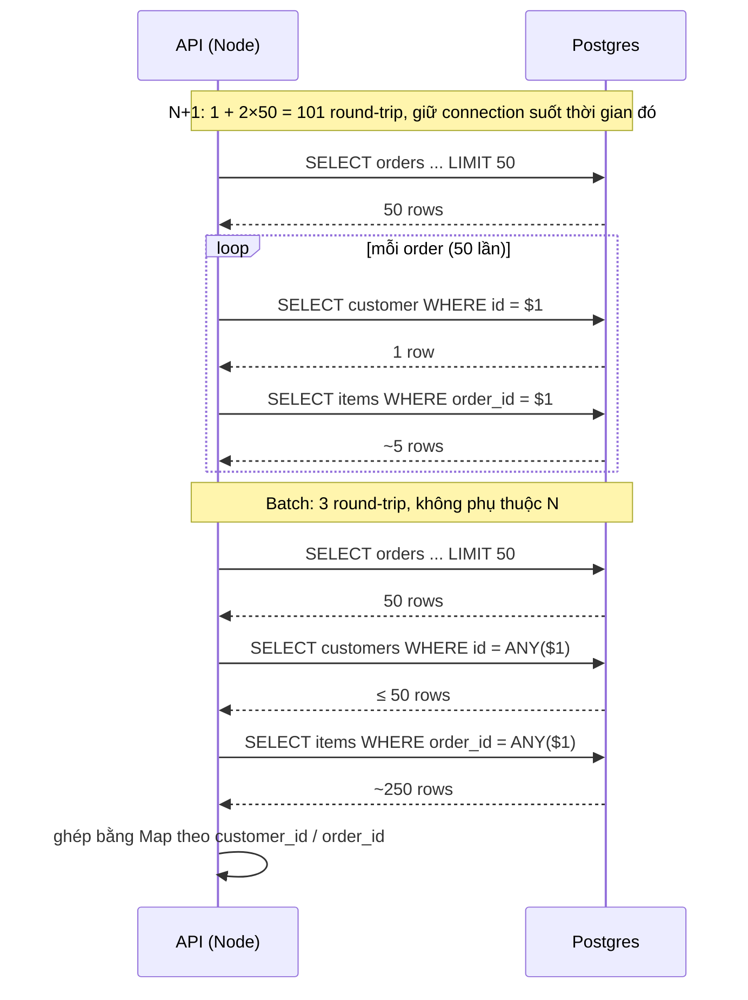
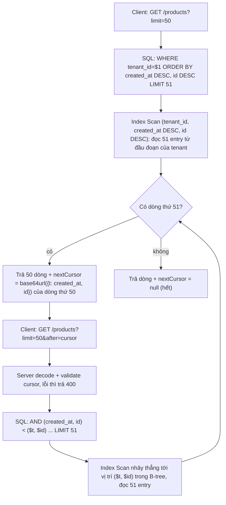
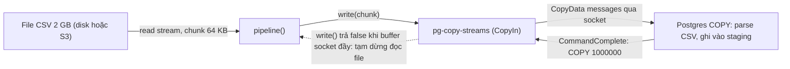

## Bối cảnh & vấn đề

Phần lớn sự cố hiệu năng database trong một backend Node/TypeScript không đến từ một query "khó" mà từ **cách app nói chuyện với DB**: gọi quá nhiều query nhỏ, đọc quá nhiều dòng rồi vứt đi, hoặc ghi từng dòng một. Mỗi query riêng lẻ trông vô hại trong log, nhưng nhân lên theo số item, số trang hay số dòng CSV thì thành hàng giây.

Ba tình huống điển hình mà lesson này giải quyết:

- **Endpoint danh sách đơn hàng p95 1,8 giây** dù mỗi trang chỉ 50 đơn. Mở trace ra thấy 101 query cho một request: 1 query lấy đơn, rồi mỗi đơn thêm 1 query lấy khách hàng và 1 query lấy item. Đây là **N+1**.
- **Infinite scroll bị trùng và thiếu sản phẩm**, còn trang 2.000 mất 4 giây. Query dùng `ORDER BY updated_at DESC LIMIT 50 OFFSET $2`. Đây là hai vấn đề của **OFFSET pagination**: chậm tuyến tính theo độ sâu, và không ổn định khi dữ liệu thay đổi.
- **Import file CSV giao dịch 2 GB mất 40 phút** và thỉnh thoảng làm Node hết memory. Code đọc cả file vào RAM rồi `INSERT` từng dòng trong vòng lặp. Đây là bài toán **bulk load**.

Cuối lesson có một phần ngắn về **parameterized query** và SQL injection, vì mọi pattern ở trên (batch bằng `ANY($1)`, cursor, `ORDER BY` động) đều phải được viết an toàn. Lesson giả định bạn biết B-tree index hoạt động ra sao; nếu chưa, đọc [B-tree index](/tracks/sql-postgres/learn/btree-indexes) và [Planner & EXPLAIN](/tracks/sql-postgres/learn/planner-explain) trước.

## Khái niệm

### Round-trip: đơn vị chi phí thật sự

Mỗi query từ app là một **round-trip**: gửi SQL qua mạng, Postgres parse, plan, execute, gửi kết quả về. Với query tra cứu theo primary key, phần execute chỉ mất vài chục microsecond; phần lớn thời gian nằm ở mạng và ở overhead của driver. Trong cùng availability zone của AWS, một round-trip thường khoảng 0,3–1 ms; qua region khác thì hàng chục ms (verify). Trong lúc đó, request đang **giữ một connection** từ pool, mà pool thì nhỏ (thường 10–20 connection mỗi instance, xem [Connection pooling](/tracks/sql-postgres/learn/connection-pooling)).

Vì vậy "số query mỗi request" là một metric quan trọng không kém "thời gian của query chậm nhất". 101 query × 1 ms là 101 ms chỉ riêng mạng, và nếu 20 request như thế chạy cùng lúc trên pool 10 connection thì các request còn lại phải xếp hàng chờ connection: đó là cách một endpoint "chỉ gồm query nhanh" lên tới p95 1,8 giây.

**Interview angle:** interviewer muốn nghe bạn nói về round-trip và pool contention, chứ không chỉ "query nhiều thì chậm".

### N+1 query

**N+1** xảy ra khi bạn lấy một danh sách N phần tử bằng 1 query, rồi với **từng phần tử** lại chạy thêm một query để lấy dữ liệu liên quan. Tổng cộng N+1 query, trong khi 2 hoặc 3 query là đủ. Nó thường không nằm trong SQL bạn viết tay mà ẩn trong ORM, qua **lazy loading**: truy cập `order.customer` trông như đọc một property, nhưng thực chất ORM phát một query mỗi lần.

```ts
// TypeORM-style: 1 query lấy 50 order, rồi 2 query cho MỖI order → 1 + 2×50 = 101 query
const orders = await orderRepo.find({ where: { tenantId }, take: 50 });
for (const o of orders) {
  o.customer = await customerRepo.findOneBy({ id: o.customerId });
  o.items = await itemRepo.findBy({ orderId: o.id });
}
```

Trong GraphQL, N+1 còn dễ xảy ra hơn: resolver `Order.customer` được gọi riêng cho từng order trong danh sách, và mỗi lần gọi là một query nếu không có batching.

**Interview angle:** N+1 thường là câu easy mở đầu; câu tiếp theo là "vậy eager loading bằng JOIN trả về gấp 50 lần số dòng mong đợi, vì sao?" (xem phần JOIN + LIMIT bên dưới).

### Các cách fix N+1

Có bốn cách chính, và chúng không tương đương:

- **Batch bằng `WHERE id = ANY($1)`**: gom tất cả `customerId` và `orderId` từ query đầu, rồi mỗi bảng liên quan chỉ query **một lần** với một mảng id, sau đó ghép lại trong memory bằng `Map`. Tổng cộng 1 + số quan hệ, bất kể N. Đây là cách mà Prisma `include` làm mặc định (verify), còn Hibernate gọi nó là "select-in loading".
- **JOIN**: lấy mọi thứ trong một query. Tốt với quan hệ **N:1** (order → customer: mỗi order đúng một dòng), nhưng với quan hệ **1:N** (order → items) thì mỗi order bị lặp lại cho mỗi item, và với hai quan hệ 1:N cùng lúc thì số dòng là tích của chúng (**cartesian explosion**).
- **`json_agg` trong Postgres**: JOIN rồi gom item thành một mảng JSON cho mỗi order, trả về đúng một dòng mỗi order. Rất hợp với API chỉ đọc.
- **DataLoader** (cho GraphQL hoặc code có nhiều lời gọi độc lập): gom mọi lời gọi `loader.load(id)` xảy ra trong cùng một tick của event loop thành một lời gọi batch, và cache kết quả trong phạm vi một request.

**Interview angle:** câu trả lời senior nói được khi nào JOIN tốt (N:1) và khi nào batch tốt hơn (1:N, nhiều quan hệ, cần phân trang).

### OFFSET pagination

`LIMIT 50 OFFSET 99950` nghĩa là "bỏ qua 99.950 dòng đầu rồi trả 50 dòng". Postgres **không có cách nào nhảy thẳng tới dòng thứ 99.950**: nó phải sinh ra, theo đúng thứ tự, cả 99.950 dòng đó rồi vứt đi. Docs nói rõ: "the rows skipped by an OFFSET clause still have to be computed inside the server". Chi phí vì thế tăng tuyến tính theo độ sâu của trang.

Vấn đề thứ hai là **tính ổn định**. OFFSET định vị theo **vị trí**, không theo dữ liệu. Nếu giữa lúc người dùng xem trang 1 và trang 2 có 3 sản phẩm mới được chèn lên đầu, thì 3 sản phẩm cuối trang 1 bị đẩy sang đầu trang 2 và hiện lại (trùng). Nếu có 3 sản phẩm bị xoá, 3 sản phẩm bị kéo lên trang 1 mà người dùng đã lướt qua (thiếu). Thêm nữa, nếu cột sort **không unique** (nhiều sản phẩm cùng `updated_at`), thứ tự giữa chúng không xác định, và hai lần chạy cùng một query có thể trả thứ tự khác nhau.

**Interview angle:** nói được cả hai vấn đề (hiệu năng và tính ổn định), và nói rằng OFFSET vẫn ổn cho admin tool nhỏ cần "nhảy tới trang 37".

### Keyset (cursor) pagination

**Keyset pagination** định vị theo **giá trị** thay vì vị trí: "cho tôi 50 dòng đứng ngay sau dòng cuối cùng tôi đã thấy". Với sort `ORDER BY created_at DESC, id DESC`, trang tiếp theo là `WHERE (created_at, id) < ($last_created_at, $last_id)`. Nếu có index khớp `(tenant_id, created_at DESC, id DESC)`, Postgres nhảy thẳng tới vị trí đó trong B-tree (O(log n)) rồi đọc 50 entry liên tiếp, bất kể đó là trang 2 hay trang 2.000.

Cột **tie-breaker** unique (`id`) là bắt buộc. Nếu cursor chỉ là `created_at` và có 5 sản phẩm cùng timestamp nằm vắt qua ranh giới trang, thì `WHERE created_at < $last` bỏ qua các sản phẩm còn lại cùng timestamp đó (thiếu), còn `<=` thì lặp lại chúng (trùng). Thêm `id` làm cho mỗi dòng có một vị trí duy nhất trong thứ tự sort.

Giá trị cursor được gửi cho client dưới dạng **opaque cursor**: một chuỗi base64 mà client không đọc hiểu và không tự tạo. Nhờ vậy server có thể đổi cấu trúc cursor (thêm cột sort, đổi định dạng) mà không phá API, và client không bị cám dỗ "tự tính" cursor.

**Interview angle:** "tại sao cursor phải có tie-breaker unique?" là follow-up gần như chắc chắn.

### Row-value comparison

`(a, b) < (x, y)` là **row constructor comparison** theo chuẩn SQL, nghĩa là so sánh theo thứ tự từ điển: `a < x OR (a = x AND b < y)`. Postgres hiểu dạng này và dùng được nó làm **Index Cond** trên B-tree `(a, b)`, tức là bắt đầu quét ngay tại vị trí `(x, y)`. Dạng viết tay `a < x OR (a = x AND b < y)` cho kết quả giống hệt nhưng planner thường không biến nó thành một điểm bắt đầu gọn như vậy.

Điều kiện để dùng row comparison: **mọi cột trong sort phải cùng chiều** (cùng `DESC` hoặc cùng `ASC`) và khớp chiều của index. Nếu bạn sort `created_at DESC, id ASC` thì không thể viết thành một row comparison, và phải dùng dạng OR viết tay, thường chậm hơn. Ngoài ra các cột phải `NOT NULL`, vì so sánh với NULL cho ra NULL và dòng đó biến mất khỏi mọi trang.

### Bulk load: bốn cách ghi nhiều dòng

- **Row-by-row INSERT**: một statement, một round-trip, và nếu autocommit thì một lần commit (tức một lần flush WAL xuống disk) cho mỗi dòng. Chậm nhất.
- **Multi-row INSERT**: `INSERT ... VALUES ($1,$2,$3), ($4,$5,$6), ...`, gom khoảng 500–1.000 dòng mỗi câu. Ít round-trip hơn hàng trăm lần. Giới hạn: giao thức Postgres cho tối đa 65.535 tham số mỗi statement.
- **`unnest` arrays**: truyền mỗi cột dưới dạng một mảng, `INSERT ... SELECT * FROM unnest($1::text[], $2::bigint[], ...)`. Chỉ có N tham số (N = số cột), nên câu SQL cố định và không đụng giới hạn tham số.
- **`COPY ... FROM STDIN`**: giao thức riêng để stream dữ liệu dạng text/CSV/binary thẳng vào bảng, không parse từng statement. Nhanh nhất cho load lớn. Trong Node dùng package `pg-copy-streams`.

Có một điểm dễ nhầm: `COPY table FROM '/path/file.csv'` đọc file **trên máy chủ database**, không phải trên máy chạy app, và cần quyền superuser hoặc role `pg_read_server_files`; trên dịch vụ managed như RDS thì không dùng được. `COPY ... FROM STDIN` (hoặc `\copy` trong psql) mới là dạng stream dữ liệu từ client, và chỉ cần quyền `INSERT`. Tương tự, `COPY ... TO '/path'` ghi file lên server DB; muốn export về app thì dùng `COPY ... TO STDOUT`.

**Interview angle:** interviewer hỏi "vì sao COPY nhanh hơn INSERT?" để xem bạn có hiểu chi phí nằm ở round-trip, parse/plan từng statement và commit từng dòng không.

### Staging table và upsert

**Staging table** là bảng trung gian, thường `UNLOGGED` (không ghi WAL, nhanh hơn, nhưng bị làm rỗng sau crash và không replicate sang replica), với mọi cột kiểu `text`. Bạn `COPY` dữ liệu thô vào đó, rồi dùng SQL để validate và chuyển sang bảng thật bằng `INSERT ... SELECT`. Cách này tách hai việc: nạp nhanh (COPY không bao giờ lỗi vì kiểu dữ liệu, vì mọi thứ là text) và kiểm tra kỹ (bằng SQL, trên toàn bộ file, báo lỗi theo từng dòng).

**Upsert** là "insert, nếu đã có thì update hoặc bỏ qua". Postgres làm bằng `INSERT ... ON CONFLICT (cột unique) DO UPDATE SET ... | DO NOTHING`. Nó dựa vào một **unique index hoặc constraint** và an toàn với concurrency: hai transaction insert cùng key đồng thời thì một bên insert, bên kia chờ rồi chuyển thành update (hoặc bỏ qua), không có lỗi duplicate. Trong `DO UPDATE`, bảng giả `EXCLUDED` chứa dòng mà bạn định insert. Hai gotcha: một câu `INSERT ... ON CONFLICT DO UPDATE` không được đụng cùng một dòng đích hai lần (`ERROR: ON CONFLICT DO UPDATE command cannot affect row a second time`), nên phải loại trùng trong nguồn trước; và `DO NOTHING` không trả dòng có sẵn trong `RETURNING`. Chi tiết so sánh với `MERGE` của SQL Server có ở [Locking & concurrency](/tracks/sql-postgres/learn/locking-concurrency).

**Interview angle:** "file 2 GB lỗi ở dòng 3.400.000, làm sao chạy lại mà không nhân đôi giao dịch?" Câu trả lời dựa trên một natural key unique (`ext_id`) cộng `ON CONFLICT DO NOTHING`, và một `batch_id` để theo dõi.

Tóm tắt các khái niệm:

| Khái niệm | Một dòng | Ví dụ |
| --- | --- | --- |
| N+1 | 1 query danh sách + N query con | lazy load `order.customer` trong vòng lặp |
| Batch `ANY` | 1 query cho mỗi quan hệ | `WHERE id = ANY($1::bigint[])` |
| OFFSET | Đọc và vứt các dòng phía trước | `LIMIT 50 OFFSET 99950` |
| Keyset | Tiếp tục sau giá trị cuối | `(created_at, id) < ($1, $2)` |
| COPY FROM STDIN | Stream dữ liệu vào bảng | `pg-copy-streams` |
| Staging + upsert | Nạp thô, validate, rồi merge | `INSERT ... SELECT ... ON CONFLICT` |

## Cơ chế hoạt động

### N+1 so với batch, nhìn theo round-trip



Nửa trên của sơ đồ là N+1: vòng lặp phát hai query cho mỗi order, và mỗi mũi tên là một lần chờ mạng. Tổng thời gian tăng tuyến tính theo N, và connection bị giữ suốt 101 round-trip đó. Nửa dưới là batch: số round-trip chỉ phụ thuộc số **quan hệ** (ở đây là 2), không phụ thuộc số order. Postgres xử lý `= ANY($1)` bằng một Index Scan (hoặc Bitmap Index Scan) duy nhất với danh sách giá trị, nên phía DB cũng rẻ hơn 50 query riêng lẻ. Công việc ghép dữ liệu chuyển sang app, nhưng đó chỉ là vài trăm lần `Map.get` trong memory.

### Keyset pagination từng bước



Điểm mấu chốt nằm ở hai ô Index Scan: trang đầu và trang thứ 2.000 làm **cùng một lượng việc**, vì B-tree cho phép đi thẳng tới vị trí `($t, $id)` bằng một lần descend từ root. Kỹ thuật "lấy 51 dòng cho trang 50" cho biết còn trang sau hay không mà không cần `count(*)`. Cursor được server tạo ra và validate lại khi nhận, nên client không thể gửi một cursor tuỳ tiện làm vỡ query. Và vì cursor là giá trị của dòng cuối cùng chứ không phải vị trí, dòng mới chèn lên đầu danh sách không làm xê dịch các trang tiếp theo.

### COPY FROM STDIN với backpressure



Node stream có cơ chế **backpressure**: khi phía ghi (socket tới Postgres) chậm hơn phía đọc (file), `write()` trả `false`, và `stream.pipeline()` tự tạm dừng đọc file cho tới khi buffer được xả (event `drain`). Nhờ vậy memory của process giữ ở mức vài chục MB bất kể file 2 GB hay 20 GB. Nếu bạn tự viết vòng lặp `for await (line of file) copyStream.write(line)` mà bỏ qua giá trị trả về của `write()`, toàn bộ file sẽ dồn vào buffer trong RAM. Postgres là bên parse CSV, nên app không cần parse từng dòng nếu dữ liệu đã đúng định dạng.

## Ví dụ thực tế

### Ví dụ 1: đo N+1 và fix bằng batch

Dữ liệu: 1.000 order, mỗi order 5 item. Code chạy bằng `node-postgres` (package `pg`) tới Postgres 18 trong Docker trên cùng laptop, nên round-trip chỉ khoảng 0,3–0,5 ms. Hàm `q()` đếm số query.

```ts
import { Client } from "pg";

const c = new Client({ host: "localhost", port: 55432, user: "postgres", password: "pw" });
let queries = 0;
const q = (sql: string, params?: unknown[]) => { queries++; return c.query(sql, params); };

const LIST = `SELECT id, customer_id FROM o_orders WHERE tenant_id = $1
              ORDER BY created_at DESC, id DESC LIMIT 50`;

async function nPlusOne(tenantId: number) {
  const { rows: orders } = await q(LIST, [tenantId]);
  for (const o of orders) {
    o.customer = (await q("SELECT id, name FROM o_customers WHERE id = $1", [o.customer_id])).rows[0];
    o.items = (await q("SELECT sku, qty FROM o_items WHERE order_id = $1", [o.id])).rows;
  }
  return orders;
}

async function batched(tenantId: number) {
  const { rows: orders } = await q(LIST, [tenantId]);
  const customerIds = [...new Set(orders.map((o) => o.customer_id))];
  const orderIds = orders.map((o) => o.id);
  const cust = await q("SELECT id, name FROM o_customers WHERE id = ANY($1::bigint[])", [customerIds]);
  const items = await q(
    "SELECT order_id, sku, qty FROM o_items WHERE order_id = ANY($1::bigint[]) ORDER BY order_id, id", [orderIds]);
  const custById = new Map(cust.rows.map((r) => [r.id, r]));
  const itemsByOrder = Map.groupBy(items.rows, (r) => r.order_id);   // Node 21+
  return orders.map((o) => ({ ...o, customer: custById.get(o.customer_id), items: itemsByOrder.get(o.id) ?? [] }));
}
```

```text
n+1        orders=50 queries=101 time=59.0ms
batched    orders=50 queries=3 time=1.9ms
```

Cùng dữ liệu, cùng kết quả, chênh lệch khoảng 30 lần ngay cả khi DB nằm trên cùng máy. Với round-trip 1 ms trong production, bản N+1 tốn ít nhất 100 ms chỉ cho mạng, và dưới tải còn phải cộng thời gian chờ connection. Nếu dùng ORM, bản batch tương ứng với `relations`/`include` (tuỳ ORM là JOIN hay select-in). Lưu ý rằng mọi query con vẫn nên lọc theo `tenant_id` trong hệ thống multi-tenant (xem [Data modeling](/tracks/sql-postgres/learn/data-modeling)).

**Phát hiện N+1** trước khi người dùng phàn nàn:

- **Query log của ORM** trong môi trường dev (`logging: true` với TypeORM, `log: ['query']` với Prisma): N+1 hiện ra như một chuỗi query giống hệt nhau chỉ khác tham số.
- **APM / OpenTelemetry**: instrumentation cho `pg` tạo một span cho mỗi query; một trace có 101 span con giống nhau là dấu hiệu rõ nhất. Đặt alert khi số span DB mỗi request vượt ngưỡng.
- **`pg_stat_statements`**: query nhỏ có `calls` rất cao so với query "cha" của nó, và `rows / calls` xấp xỉ 1.

```sql
SELECT calls, round(mean_exec_time::numeric, 3) AS mean_ms, rows, left(query, 60) AS query
FROM pg_stat_statements ORDER BY calls DESC LIMIT 3;
--   calls  | mean_ms |  rows   | query
-- ---------+---------+---------+------------------------------------------------------------
--  5012300 |   0.021 | 5012300 | SELECT id, name FROM o_customers WHERE id = $1
--  5012300 |   0.034 |24961000 | SELECT sku, qty FROM o_items WHERE order_id = $1
--   100246 |   0.410 | 5012300 | SELECT id, customer_id FROM o_orders WHERE tenant_id = $1 ORDER
-- (output minh hoạ: tỉ lệ calls 50:1 giữa query con và query cha là chữ ký của N+1)
```

- **Test khẳng định số query**: bọc repository bằng một counter như `q()` ở trên và viết `expect(queries).toBeLessThanOrEqual(3)` cho endpoint danh sách. Test này bắt được N+1 ngay khi ai đó thêm một lazy relation mới.

### Ví dụ 2: bẫy JOIN + LIMIT và cách paginate parent trước

Khi fix N+1 bằng JOIN với một quan hệ 1:N, `LIMIT` áp dụng lên **dòng sau khi JOIN**, không phải lên số order:

```sql
SELECT count(*) AS rows, count(DISTINCT id) AS distinct_orders FROM (
  SELECT o.id, i.sku FROM o_orders o JOIN o_items i ON i.order_id = o.id
  WHERE o.tenant_id = 1 ORDER BY o.created_at DESC, o.id DESC LIMIT 50) x;
--  rows | distinct_orders
-- ------+-----------------
--    50 |              10
```

Muốn 50 order nhưng chỉ nhận 10, vì mỗi order có 5 item. Đây là lý do một số ORM trả về ít order hơn `take: 50` khi eager load collection bằng JOIN, và lý do ORM tốt phải chạy một query phụ để lấy id của trang trước (TypeORM làm vậy với `take`/`skip` nhưng không với `limit()`/`offset()` của QueryBuilder (verify)). Cách đúng là **phân trang bảng cha trước**, rồi mới JOIN hoặc gom item:

```sql
WITH page AS (
  SELECT id, customer_id, created_at FROM o_orders WHERE tenant_id = 1
  ORDER BY created_at DESC, id DESC LIMIT 3)          -- 3 cho gọn output; thực tế 50
SELECT p.id, p.customer_id,
       json_agg(json_build_object('sku', i.sku, 'qty', i.qty) ORDER BY i.id) AS items
FROM page p LEFT JOIN o_items i ON i.order_id = p.id
GROUP BY p.id, p.customer_id, p.created_at
ORDER BY p.created_at DESC, p.id DESC;
```

```text
  id  | customer_id |                                  items
------+-------------+-------------------------------------------------------------------------
 1000 |         106 | [{"sku" : "SKU-1", "qty" : 2}, {"sku" : "SKU-2", "qty" : 3}, ... 5 phần tử]
  999 |         105 | [{"sku" : "SKU-1", "qty" : 2}, {"sku" : "SKU-2", "qty" : 3}, ... 5 phần tử]
  998 |         104 | [{"sku" : "SKU-1", "qty" : 2}, {"sku" : "SKU-2", "qty" : 3}, ... 5 phần tử]
```

Một dòng mỗi order, đúng số order, item nằm gọn trong mảng JSON. Với `LEFT JOIN`, order không có item sẽ cho `[null]` thay vì `[]`; muốn mảng rỗng thì dùng `COALESCE(json_agg(...) FILTER (WHERE i.id IS NOT NULL), '[]')`.

### Ví dụ 3: OFFSET vs keyset ở trang 2.000

Bảng `products` 2 triệu dòng, 10 tenant, index `(tenant_id, created_at DESC, id DESC)`. Trang 2.000 với 50 dòng mỗi trang là `OFFSET 99950`:

```sql
EXPLAIN (ANALYZE, BUFFERS, COSTS OFF)
SELECT id, name, price_cents, created_at FROM products WHERE tenant_id = 1
ORDER BY created_at DESC, id DESC LIMIT 50 OFFSET 99950;
```

```text
 Limit (actual time=23.665..23.678 rows=50.00 loops=1)
   Buffers: shared hit=10804 read=1 written=1
   ->  Index Scan using products_tenant_created_idx on products (actual time=0.058..19.779 rows=100000.00 loops=1)
         Index Cond: (tenant_id = 1)
 Execution Time: 23.711 ms
```

Node Index Scan trả về **100.000 dòng** để `Limit` giữ lại 50, và phải chạm 10.804 buffer (khoảng 84 MB tính theo page 8 KB). Con số 23 ms là khi mọi page đã nằm trong cache; trong production, với dòng rộng hơn, JOIN thêm, và page phải đọc từ disk, cùng query đó dễ lên hàng giây như ở đề bài. Bây giờ là keyset với cursor của dòng cuối trang 1.999:

```sql
EXPLAIN (ANALYZE, BUFFERS, COSTS OFF)
SELECT id, name, price_cents, created_at FROM products
WHERE tenant_id = 1 AND (created_at, id) < ('2026-01-04 20:38:23+00', 1000510)
ORDER BY created_at DESC, id DESC LIMIT 50;
```

```text
 Limit (actual time=0.207..0.294 rows=50.00 loops=1)
   Buffers: shared hit=8 read=1
   ->  Index Scan using products_tenant_created_idx on products (actual time=0.206..0.289 rows=50.00 loops=1)
         Index Cond: ((tenant_id = 1) AND (ROW(created_at, id) < ROW('2026-01-04 20:38:23+00'::timestamp with time zone, 1000510)))
 Execution Time: 0.411 ms
```

Row comparison nằm trong **Index Cond**, Index Scan chỉ trả đúng 50 dòng, và chỉ 9 buffer được chạm: ít hơn khoảng 1.200 lần. Nếu sort lệch chiều (`created_at DESC, id ASC`) mà index là `(created_at DESC, id DESC)`, plan đổi thành `Incremental Sort` với `Presorted Key: created_at`, tức là index chỉ giúp được một phần.

Phía API, cursor được mã hoá opaque. Hai chi tiết đáng chú ý trong code: `created_at` được lấy dưới dạng **text từ Postgres** (giữ đủ microsecond; `Date` của JavaScript chỉ có millisecond, và làm tròn sẽ làm mất dòng), còn `id` là string để an toàn với `bigint`.

```ts
type Cursor = { t: string; id: string };
const encode = (c: Cursor) => Buffer.from(JSON.stringify(c)).toString("base64url");
function decode(raw: string): Cursor {
  try {
    const c = JSON.parse(Buffer.from(raw, "base64url").toString("utf8"));
    if (typeof c.t === "string" && typeof c.id === "string" && /^\d+$/.test(c.id)) return c;
  } catch {}
  throw new Error("invalid cursor"); // map thành HTTP 400
}

const FIRST = `SELECT id::text, name, created_at::text AS t FROM products
  WHERE tenant_id = $1 ORDER BY created_at DESC, id DESC LIMIT $2`;
const NEXT = `SELECT id::text, name, created_at::text AS t FROM products
  WHERE tenant_id = $1 AND (created_at, id) < ($3::timestamptz, $4::bigint)
  ORDER BY created_at DESC, id DESC LIMIT $2`;

async function listProducts(db: Client, tenantId: number, limit: number, after?: string) {
  const cur = after ? decode(after) : null;
  const { rows } = cur
    ? await db.query(NEXT, [tenantId, limit + 1, cur.t, cur.id])
    : await db.query(FIRST, [tenantId, limit + 1]);   // lấy dư 1 dòng để biết còn trang sau
  const page = rows.slice(0, limit);
  const last = page.at(-1);
  return { items: page, nextCursor: rows.length > limit && last ? encode({ t: last.t, id: last.id }) : null };
}

const p1 = await listProducts(db, 1, 3);
console.log(p1.items.map((r) => r.id), p1.nextCursor);
const p2 = await listProducts(db, 1, 3, p1.nextCursor!);
console.log(p2.items.map((r) => r.id), p2.nextCursor);
await listProducts(db, 1, 3, "bm90LWpzb24").catch((e) => console.log(e.message));
```

```text
[ '2000000', '1999990', '1999980' ] eyJ0IjoiMjAyNi0wMS0wOCAxNzoxMTowMCswMCIsImlkIjoiMTk5OTk4MCJ9
[ '1999970', '1999960', '1999950' ] eyJ0IjoiMjAyNi0wMS0wOCAxNzoxMDo1MCswMCIsImlkIjoiMTk5OTk1MCJ9
invalid cursor
```

Có hai câu SQL riêng cho trang đầu và các trang sau, thay vì một câu kiểu `($3 IS NULL OR (created_at, id) < ...)`. Lý do: với prepared statement dùng **generic plan**, điều kiện OR đó không còn là Index Cond và bị đẩy xuống thành Filter, nên trang sâu lại quét từ đầu. Khi thử với `plan_cache_mode = force_generic_plan`, một trang gần cuối của tenant báo `Rows Removed by Filter: 189201` và 86 ms, thay vì 0,4 ms. **Backwards pagination** (nút "trang trước") dùng cursor của dòng **đầu** trang, đảo chiều so sánh và sort (`(created_at, id) > ($t, $id) ORDER BY created_at ASC, id ASC LIMIT 51`), rồi đảo ngược mảng kết quả trong app. Cùng một index B-tree phục vụ được cả hai chiều vì Postgres quét B-tree được theo cả hai hướng.

### Ví dụ 4: bulk load CSV, từ 50 giây xuống dưới 1 giây

Nạp 100.000 dòng `(ext_id text UNIQUE, amount_cents bigint, note text)` từ Node vào Postgres 18 trong Docker cùng máy. Hai phương án row-by-row chỉ chạy 10.000 dòng vì quá chậm:

```text
row-by-row, autocommit (10k)         5144 ms  rows=10000     → ~51 s cho 100k
row-by-row, 1 transaction (10k)      2817 ms  rows=10000     → ~28 s cho 100k
multi-row VALUES, 1000/batch          796 ms  rows=100000
unnest arrays, 10000/batch            495 ms  rows=100000
COPY FROM STDIN                       383 ms  rows=100000
```

Row-by-row có autocommit trả giá cho hai thứ: một round-trip mỗi dòng và một lần flush WAL mỗi commit. Gộp vào một transaction bỏ được phần commit (nhanh gần gấp đôi) nhưng vẫn còn 100.000 round-trip. Multi-row VALUES và `unnest` giảm round-trip xuống 100 và 10 lần. COPY nhanh nhất và, quan trọng hơn, **stream được**, nên không cần giữ cả file trong RAM. Đây là số đo trên laptop với round-trip rất nhỏ; qua mạng thật, khoảng cách giữa row-by-row và các cách còn lại còn lớn hơn nhiều. Hãy coi chúng là bậc độ lớn (order of magnitude), không phải benchmark (verify).

Một phát hiện khi đo: lần đầu COPY mất tới 4,1 giây vì code `yield` **mỗi dòng thành một chunk** riêng, tạo 100.000 lần ghi nhỏ xuống socket. Gom thành chunk khoảng 64 KB thì còn 383 ms. Với file thật, `fs.createReadStream` đã đọc theo chunk sẵn:

```ts
import { createReadStream } from "node:fs";
import { pipeline } from "node:stream/promises";
import { Client } from "pg";
import { from as copyFrom } from "pg-copy-streams";

const db = new Client({ /* ... */ });
await db.connect();
await db.query(`CREATE UNLOGGED TABLE IF NOT EXISTS payments_staging
  (line_no bigint GENERATED ALWAYS AS IDENTITY, ext_id text, amount text, paid_at text)`);
await db.query("TRUNCATE payments_staging RESTART IDENTITY");

const sink = db.query(copyFrom(
  "COPY payments_staging (ext_id, amount, paid_at) FROM STDIN WITH (FORMAT csv, HEADER true)"));
await pipeline(createReadStream("payments.csv", { highWaterMark: 64 * 1024 }), sink);  // backpressure tự động
console.log(`copied ${sink.rowCount} rows`);
```

```text
copied 1000000 rows in 492 ms, rss=100 MB
```

Một triệu dòng (file 36 MB) trong nửa giây, memory của process đứng yên quanh 100 MB (chủ yếu là runtime của Node), vì file chưa bao giờ nằm trọn trong RAM.

Tiếp theo là **validate trong staging** rồi **upsert** sang bảng thật. Staging có 5 dòng, trong đó `TX-1` đã tồn tại ở bảng `payments`, `TX-2` bị lặp trong file, `TX-3` sai số tiền, `TX-4` sai ngày:

```sql
SELECT line_no, ext_id,
  CASE WHEN amount !~ '^\d+$' THEN 'amount is not an integer'
       WHEN NOT pg_input_is_valid(paid_at, 'timestamptz') THEN 'bad paid_at'     -- PG 16+
       WHEN count(*) OVER (PARTITION BY ext_id) > 1 THEN 'duplicate ext_id in file'
  END AS error
FROM payments_staging ORDER BY line_no;
```

```text
 line_no | ext_id |          error
---------+--------+--------------------------
       2 | TX-1   |
       3 | TX-2   | duplicate ext_id in file
       4 | TX-3   | amount is not an integer
       5 | TX-4   | bad paid_at
       6 | TX-2   | duplicate ext_id in file
```

Báo cáo lỗi theo từng dòng này được trả về cho người upload. Sau đó chỉ chuyển các dòng hợp lệ, loại trùng bằng `DISTINCT ON`, và dùng `ON CONFLICT DO NOTHING` để lần upload lại không nhân đôi giao dịch đã có:

```sql
WITH valid AS (
  SELECT DISTINCT ON (ext_id) ext_id, amount::bigint AS amount_cents, paid_at::timestamptz AS paid_at
  FROM payments_staging
  WHERE amount ~ '^\d+$' AND pg_input_is_valid(paid_at, 'timestamptz')
  ORDER BY ext_id, line_no)
INSERT INTO payments (ext_id, amount_cents, paid_at, batch_id)
SELECT ext_id, amount_cents, paid_at, $1 FROM valid          -- $1 = id của lần upload
ON CONFLICT (ext_id) DO NOTHING
RETURNING ext_id;
--  ext_id
-- --------
--  TX-2
-- INSERT 0 1
```

`TX-1` đã có nên bị bỏ qua. Với **dữ liệu tiền**, `DO NOTHING` kèm báo cáo "dòng trùng" an toàn hơn `DO UPDATE`: âm thầm ghi đè số tiền của một giao dịch đã hạch toán là việc cần con người quyết định. `DO UPDATE SET amount_cents = EXCLUDED.amount_cents WHERE payments.amount_cents IS DISTINCT FROM EXCLUDED.amount_cents` phù hợp hơn cho dữ liệu tham chiếu như bảng giá hay danh mục sản phẩm.

## Parameterized queries & SQL injection

**SQL injection** xảy ra khi input của người dùng được **nối chuỗi** vào câu SQL, nên input đó có thể thay đổi cấu trúc của câu lệnh:

```ts
// ❌ status = "paid' OR '1'='1" → trả về đơn của mọi tenant
await db.query(`SELECT * FROM orders WHERE tenant_id = ${tenantId} AND status = '${status}'`);

// ✅ tham số được gửi tách khỏi câu SQL (extended protocol); Postgres không bao giờ parse nó như SQL
await db.query("SELECT * FROM orders WHERE tenant_id = $1 AND status = $2", [tenantId, status]);
```

Với tham số `$1`, `$2`, câu SQL và dữ liệu đi trong hai message riêng của giao thức; giá trị không thể "thoát ra" thành cú pháp, bất kể chứa dấu nháy hay dấu chấm phẩy. Các pattern trong lesson này đều giữ được điều đó: danh sách id dùng `= ANY($1::bigint[])` (một tham số mảng) thay vì tự dựng `IN (1,2,3)`, cursor được decode rồi truyền thành tham số, và `LIMIT $2` cũng là tham số. Với `LIKE`, nhớ escape `%` và `_` trong input nếu muốn tìm theo chuỗi literal.

Tham số chỉ thay được **giá trị**, không thay được **identifier** (tên cột, tên bảng) hay từ khoá (`ASC`/`DESC`). Vì vậy `ORDER BY` động phải dùng **allow-list**:

```ts
const SORTS = {
  newest:     "created_at DESC, id DESC",
  oldest:     "created_at ASC, id ASC",
  price_asc:  "price_cents ASC, id ASC",
} as const;
type SortKey = keyof typeof SORTS;

function orderBy(input: string): string {
  if (!Object.hasOwn(SORTS, input)) throw new Error(`invalid sort: ${input}`);   // HTTP 400
  return SORTS[input as SortKey];
}
const sql = `SELECT id, name FROM products WHERE tenant_id = $1 ORDER BY ${orderBy(req.query.sort)} LIMIT $2`;
```

Chỉ những chuỗi do bạn viết mới được nối vào SQL; input của người dùng chỉ dùng để **chọn** một trong số chúng. Mỗi lựa chọn sort cũng nên có index tương ứng và có tie-breaker `id`, để keyset pagination hoạt động với mọi kiểu sort mà API cho phép. Escape identifier (`client.escapeIdentifier()` của `pg` hoặc `format('%I')` trong SQL) chỉ là phương án dự phòng: nó chặn injection nhưng vẫn cho người dùng sort theo một cột không có index.

**Interview angle:** "prepared statement có chặn được injection trong `ORDER BY` không?" Không, vì `ORDER BY` nhận identifier; câu trả lời đúng là allow-list.

## Trade-offs & lựa chọn thay thế

### Fix N+1

| Cách | Số query | Ưu | Nhược | Dùng khi |
| --- | --- | --- | --- | --- |
| JOIN | 1 | Một round-trip, DB tối ưu join | 1:N lặp dữ liệu cha; nhiều 1:N thì cartesian explosion; phá `LIMIT` | Quan hệ N:1 (order → customer) |
| `ANY($1)` batch / select-in | 1 + số quan hệ | Không lặp dữ liệu, phân trang cha dễ, mỗi query đơn giản | Nhiều round-trip hơn JOIN; ghép trong app | Collection 1:N, nhiều quan hệ |
| `json_agg` + paginate cha trước | 1 | Một dòng mỗi cha, JSON sẵn cho API | SQL phức tạp hơn; JSON lớn tốn CPU phía DB | Endpoint chỉ đọc, trả JSON lồng nhau |
| DataLoader | 1 mỗi loại mỗi tick | Tự batch các lời gọi rời rạc, cache trong request | Phải tạo loader mới mỗi request; thứ tự kết quả phải khớp thứ tự key | GraphQL resolver, code nhiều tầng |
| ORM eager load | Tuỳ ORM | Ít code | Phải biết ORM dùng JOIN hay select-in; kiểm tra SQL thật | Khi đã kiểm tra log query |

Không có cách nào thắng tuyệt đối. Quy tắc thực dụng: JOIN cho quan hệ "một", batch cho quan hệ "nhiều", và **luôn phân trang bảng cha trước** khi kéo collection. Prisma có tuỳ chọn `relationLoadStrategy: "join"` dùng `LATERAL` và JSON aggregation trong một query (verify), còn mặc định là select-in; TypeORM `relations` dùng JOIN. Đọc SQL mà ORM thật sự sinh ra trước khi tin vào tên option.

### Pagination

| | OFFSET | Keyset / cursor |
| --- | --- | --- |
| Chi phí trang thứ k | Tăng tuyến tính theo k | Gần như hằng số (O(log n)) |
| Ổn định khi có insert/delete | Trùng hoặc thiếu dòng | Ổn định |
| Nhảy tới trang bất kỳ | Có | Không |
| Tổng số trang | Cần `count(*)` | Thường không cung cấp |
| Sort tuỳ ý | Dễ | Mỗi kiểu sort cần index và tie-breaker riêng |
| Độ phức tạp code | Thấp | Trung bình (cursor, hai chiều) |

Dùng OFFSET cho admin tool nội bộ, bảng nhỏ, hoặc khi người dùng thật sự cần số trang và hiếm khi đi sâu. Dùng keyset cho infinite scroll, API công khai, feed, export dữ liệu theo batch, và bất kỳ bảng nào đủ lớn để trang sâu trở nên đắt. Khi product muốn "nhảy tới trang 37" kèm tổng số: đề xuất tổng **ước lượng** (lấy từ `pg_class.reltuples` hoặc số `rows` trong `EXPLAIN`, hiển thị "khoảng 12.000 kết quả"), filter và search thay cho việc nhảy trang, hoặc giới hạn OFFSET ở vài trăm trang đầu. `count(*)` chính xác trên bảng lớn phải quét toàn bộ dòng khớp điều kiện vì MVCC (không có bộ đếm dòng sẵn), nên đừng chạy nó trên mọi request.

### Bulk load

| Cách | Bậc độ lớn, 100k dòng (laptop) | Streaming | Giới hạn | Dùng khi |
| --- | --- | --- | --- | --- |
| Row-by-row, autocommit | ~50 s | Có | Chậm, mỗi dòng một commit | Không dùng cho batch |
| Row-by-row, 1 transaction | ~30 s | Có | Vẫn một round-trip mỗi dòng | Vài trăm dòng |
| Multi-row VALUES | ~1 s | Theo batch | 65.535 tham số mỗi câu; SQL thay đổi theo số dòng | Vài nghìn dòng từ API |
| `unnest` arrays | ~0,5 s | Theo batch | Mảng lớn tốn memory phía app | Batch từ code, cần `ON CONFLICT` trực tiếp |
| `COPY FROM STDIN` | ~0,4 s | Có | Một dòng lỗi làm hỏng cả lệnh; không có `ON CONFLICT` | File lớn, import, ETL |

`COPY` không hỗ trợ `ON CONFLICT`, và theo mặc định một dòng sai kiểu dữ liệu làm hỏng toàn bộ lệnh. PG 17 thêm `ON_ERROR ignore` để bỏ qua dòng lỗi định dạng, và PG 18 thêm `REJECT_LIMIT` (verify), nhưng pattern staging table với cột `text` vẫn là cách linh hoạt nhất: nạp mọi thứ, validate bằng SQL, báo lỗi theo dòng, rồi upsert. Với SQL Server, các công cụ tương đương là `SqlBulkCopy` và table-valued parameter.

## Edge cases & failure modes

- **Mảng `ANY` quá lớn.** `WHERE id = ANY($1)` với 100.000 id vẫn chạy được, nhưng tốn memory ở cả hai phía và planner có thể chọn plan khác. Chia batch vài nghìn id mỗi lần. Multi-row VALUES với 3 cột thì tối đa khoảng 21.845 dòng mỗi câu trước khi chạm giới hạn 65.535 tham số, khi đó driver hoặc server sẽ từ chối câu lệnh.
- **Cartesian explosion.** JOIN order với 20 item và 10 payment cho ra 200 dòng mỗi order. Với 50 order là 10.000 dòng thay vì 50 + 1.000 + 500. Tách mỗi collection thành một query batch riêng.
- **DataLoader dùng chung giữa các request.** Cache của DataLoader phải có phạm vi request; dùng chung một instance toàn cục thì người dùng này có thể thấy dữ liệu (đã cache) của người dùng khác, hoặc thấy dữ liệu cũ mãi mãi.
- **Cột sort có thể NULL hoặc không unique.** Row comparison với NULL cho NULL, nên dòng đó không bao giờ xuất hiện. Dùng cột `NOT NULL` và luôn thêm `id` làm tie-breaker.
- **Sort theo cột thay đổi liên tục.** Keyset theo `updated_at` vẫn có thể làm một sản phẩm "nhảy" sang trang khác nếu nó được update giữa hai lần tải trang: nó chuyển lên đầu danh sách (người dùng không thấy lại nó) hoặc xuất hiện hai lần nếu kéo lại từ đầu. Với feed, sort theo cột bất biến như `created_at` hoặc `id`.
- **Mất độ chính xác của cursor.** `timestamptz` có microsecond, `Date` của JavaScript có millisecond. Cursor tạo từ `row.created_at.toISOString()` bị làm tròn xuống, và các dòng cùng millisecond nhưng khác microsecond có thể bị bỏ qua. Lấy giá trị cursor dạng text từ Postgres, hoặc khai báo cột `timestamptz(3)`.
- **Cursor cũ sau khi đổi schema sort.** Cursor phải có version hoặc được validate chặt; cursor không hợp lệ thì trả 400 với thông báo rõ, để client quay về trang đầu.
- **File 2 GB lỗi ở dòng 3.400.000.** Nếu cả file là một lệnh COPY vào staging, lỗi làm rollback toàn bộ và chưa có gì vào bảng thật: chỉ cần sửa và chạy lại. Nếu nạp theo chunk commit riêng, mỗi chunk phải idempotent: natural key `ext_id` unique, `ON CONFLICT DO NOTHING`, và một bảng `import_batches (id, file_sha256, status, last_line)` để biết đã tới đâu và để upload lại cùng file (cùng hash) không tạo batch mới.
- **Load khổng lồ vào bảng có nhiều index.** Mỗi dòng phải cập nhật mọi index và kiểm tra mọi FK. Với load rất lớn vào bảng mới hoặc bảng có thể tạm offline: drop các index phụ, load, rồi `CREATE INDEX` lại (nhanh hơn nhiều so với cập nhật từng dòng, nhất là khi tăng `maintenance_work_mem`), thêm FK với `NOT VALID` rồi `VALIDATE CONSTRAINT` sau, và chạy `ANALYZE` khi xong để planner có thống kê mới. `SET CONSTRAINTS ALL DEFERRED` chỉ có tác dụng với constraint khai báo `DEFERRABLE`: nó dời thời điểm kiểm tra tới lúc commit chứ không bỏ qua việc kiểm tra. Với bảng đang phục vụ traffic, đừng drop index; hãy chia batch và giới hạn tốc độ.
- **UNLOGGED staging và replica.** Bảng `UNLOGGED` không được replicate và bị làm rỗng sau crash. Không sao với staging (nạp lại được), nhưng đừng đọc staging từ replica, và đừng bao giờ dùng `UNLOGGED` cho bảng thật.
- **Transaction import quá dài.** Một transaction chạy 30 phút giữ snapshot cũ, làm [VACUUM](/tracks/sql-postgres/learn/mvcc-vacuum) không dọn được dead tuple trên toàn cluster và có thể làm replica lag. Chia bước chuyển từ staging sang bảng thật thành các batch có commit riêng (ví dụ theo khoảng `line_no`).

## Pitfalls

- ❌ Truy cập relation lazy trong vòng lặp → ✅ batch bằng `ANY($1)` hoặc eager load, và có test khẳng định số query mỗi endpoint.
- ❌ Fix N+1 bằng JOIN rồi `LIMIT 50` → ✅ phân trang bảng cha trước (CTE hoặc subquery), rồi mới JOIN hoặc gom collection.
- ❌ JOIN nhiều collection 1:N trong một query → ✅ một query batch cho mỗi collection, tránh cartesian explosion.
- ❌ `OFFSET` cho infinite scroll trên bảng lớn → ✅ keyset với tie-breaker unique và index khớp đúng thứ tự và chiều sort.
- ❌ Cursor chỉ gồm `created_at` → ✅ `(created_at, id)`, so sánh bằng row value `(created_at, id) < ($1, $2)`.
- ❌ Index `(created_at)` cho query có `WHERE tenant_id = $1` → ✅ `(tenant_id, created_at DESC, id DESC)`: cột lọc bằng đẳng thức đứng trước cột sort.
- ❌ Cursor là id thô hoặc JSON mà client tự sửa được → ✅ opaque base64url, validate khi decode, trả 400 nếu sai.
- ❌ `count(*)` chính xác trên mỗi request phân trang → ✅ lấy `LIMIT + 1` để biết `hasMore`, dùng số ước lượng cho tổng.
- ❌ Đọc cả file CSV vào memory rồi INSERT từng dòng → ✅ stream vào `COPY ... FROM STDIN` bằng `pipeline()` để có backpressure, qua staging table.
- ❌ `COPY ... FROM '/tmp/file.csv'` từ app → ✅ `COPY ... FROM STDIN` (đường dẫn kia nằm trên server DB và cần quyền đặc biệt, không có trên RDS).
- ❌ Upsert dữ liệu tiền bằng `DO UPDATE` → ✅ `DO NOTHING` kèm báo cáo trùng; chỉ ghi đè dữ liệu tham chiếu.
- ❌ Nối chuỗi input vào SQL, kể cả "chỉ là tên cột sort" → ✅ tham số `$1` cho giá trị, allow-list cho identifier.

## Tóm tắt

- N+1 là 1 query danh sách cộng N query con, thường do lazy loading của ORM; chi phí thật là round-trip và thời gian giữ connection. Phát hiện bằng query log, span APM, `pg_stat_statements` (`calls` cao bất thường) và test đếm query.
- Fix bằng JOIN cho quan hệ N:1, batch `= ANY($1)` hoặc select-in cho 1:N, `json_agg` cho API chỉ đọc, DataLoader cho GraphQL. Với JOIN + LIMIT, luôn phân trang bảng cha trước.
- OFFSET đọc rồi vứt mọi dòng phía trước (trang 2.000 chạm khoảng 10.800 buffer so với 9 của keyset) và gây trùng/thiếu khi dữ liệu thay đổi.
- Keyset pagination: `WHERE (created_at, id) < ($t, $id) ORDER BY created_at DESC, id DESC LIMIT n+1`, index `(tenant_id, created_at DESC, id DESC)`, cursor opaque giữ đủ microsecond, và hai câu SQL riêng thay vì `$1 IS NULL OR ...`.
- Keyset không nhảy được tới trang bất kỳ và không cho tổng chính xác miễn phí; dùng `hasMore`, số ước lượng, hoặc filter thay cho nhảy trang.
- Bulk load: row-by-row (hàng chục giây cho 100k dòng) → multi-row VALUES/`unnest` (dưới 1 giây) → `COPY FROM STDIN` (nhanh nhất, stream được, có backpressure qua `pipeline()`).
- Import an toàn: COPY vào staging `UNLOGGED` toàn cột `text`, validate bằng SQL và báo lỗi theo dòng, rồi `INSERT ... SELECT DISTINCT ON ... ON CONFLICT` sang bảng thật, với natural key unique và batch id để chạy lại idempotent.
- Luôn dùng parameterized query cho giá trị (`$1`, `ANY($1)`), và allow-list cho `ORDER BY` động, vì tham số không thay được identifier.
