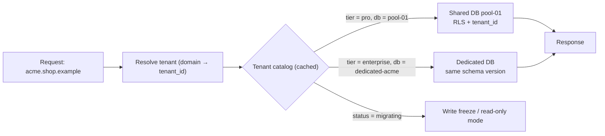
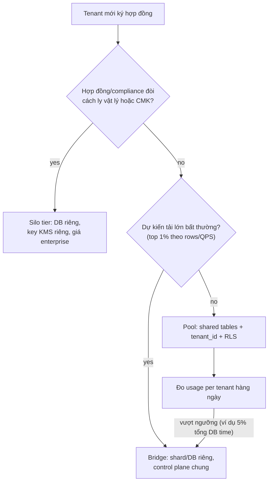

## Bối cảnh & vấn đề

Một startup làm nền tảng thương mại điện tử cho các thương hiệu (merchant). Năm đầu có 12 merchant, team chọn cách "đơn giản nhất": mỗi merchant một database Postgres riêng, deploy một script tạo DB khi ký hợp đồng. Hai năm sau có 1.400 merchant, phần lớn là shop nhỏ vài trăm đơn mỗi tháng. Mỗi lần release, pipeline chạy migration tuần tự qua 1.400 database mất 3 tiếng; tuần trước migration dừng ở database thứ 612 vì một shop có dữ liệu bẩn, và suốt nửa ngày hệ thống chạy với hai phiên bản schema. Hoá đơn cloud tăng theo số merchant chứ không theo doanh thu.

Một startup khác đi hướng ngược lại: mọi merchant chung một bảng `orders` với cột `tenant_id`. Chi phí thấp, migration chạy một lần. Nhưng một ngày thứ Hai, merchant lớn nhất import 5 triệu sản phẩm và cả nền tảng chậm; tháng sau một endpoint mới quên `WHERE tenant_id = ?` và merchant B thấy đơn hàng của merchant A. Rồi một khách hàng ngân hàng yêu cầu hợp đồng "dữ liệu phải nằm ở database riêng, mã hoá bằng key do chúng tôi quản lý", và kiến trúc không có chỗ cho yêu cầu đó.

Cả hai câu chuyện đều là cùng một quyết định kiến trúc: **mức cách ly (isolation) giữa các khách hàng**. Không có mô hình "đúng" tuyệt đối; mỗi mô hình mua một thứ và trả bằng thứ khác. Bài này định nghĩa tenant, ba mô hình silo/pool/bridge (thuật ngữ AWS SaaS Lens, được dùng rộng rãi trong phỏng vấn), schema-per-tenant như một dạng bridge phổ biến với Postgres, và cách chọn mô hình dựa trên con số chứ không dựa trên cảm giác. Các bài sau đi sâu vào từng lớp phòng thủ: [tenant resolution](/tracks/multi-tenancy/learn/tenant-resolution-authz), [tenant context](/tracks/multi-tenancy/learn/tenant-context), [schema pooled](/tracks/multi-tenancy/learn/pooled-schema-design), [RLS](/tracks/multi-tenancy/learn/postgres-rls).

## Khái niệm

### Multi-tenancy và tenant

**Multi-tenancy** là cách xây một hệ thống (code, hạ tầng, quy trình vận hành) để **một bản triển khai phục vụ nhiều khách hàng**, trong khi dữ liệu, cấu hình và trải nghiệm của mỗi khách được **cách ly** với nhau. Đối lập là **single-tenant**: mỗi khách một bản cài riêng (như phần mềm on-premise), cách ly tuyệt đối nhưng mỗi bản phải được nâng cấp, giám sát và vá lỗi riêng.

**Tenant** là đơn vị khách hàng được cách ly, thường là một tổ chức trả tiền: một công ty trong SaaS kế toán, một workspace trong công cụ chat, một merchant trong nền tảng thương mại. Tenant **không** đồng nghĩa với user. Một tenant có nhiều user; một user (một địa chỉ email) có thể thuộc nhiều tenant với vai trò khác nhau (kế toán viên làm cho ba công ty).

Ví dụ ngắn: trên nền tảng thương mại, "Acme Sneakers" là một tenant. Nhân viên của Acme đăng nhập admin là **merchant user**. Người mua giày trên storefront của Acme là **end customer**, và họ thuộc về tenant Acme.

**Interview angle:** câu đầu tiên interviewer muốn nghe là bạn phân biệt được tenant, user và end customer, vì mọi quyết định isolation phía sau dựa trên ranh giới đó.

### B2B2C: ba cấp chủ thể

**B2B2C** (business-to-business-to-consumer) là mô hình nền tảng bán cho doanh nghiệp (merchant), và doanh nghiệp bán tiếp cho người tiêu dùng. Có ba cấp chủ thể: **platform** (nhà cung cấp, có staff vận hành xuyên tenant), **merchant/tenant** (khách hàng trả tiền), và **end customer** (khách của merchant).

End customer **không phải tenant**: họ không trả tiền cho platform, không có cấu hình riêng, và dữ liệu của họ thuộc quyền quản lý của merchant. Một người mua ở cả Acme và Globex có thể có hai bản ghi customer riêng (mỗi tenant một bản, dữ liệu tách biệt), hoặc một identity toàn cục liên kết với hai hồ sơ customer. Lựa chọn thứ hai tiện cho "đăng nhập một lần" nhưng phải thiết kế cẩn thận để merchant A không suy ra được người đó cũng mua ở merchant B.

```text
platform (staff: support, billing, SRE)
 ├── tenant: acme      (merchant users: owner, staff)
 │     └── customers: an@mail.com, binh@mail.com
 └── tenant: globex    (merchant users: owner)
       └── customers: an@mail.com   ← cùng email, hồ sơ khác, dữ liệu khác
```

**Interview angle:** follow-up kinh điển là "end customer có phải tenant không, và user thuộc nhiều tenant thì model thế nào"; trả lời bằng bảng `memberships(user_id, tenant_id, role)` và customer thuộc về tenant (chi tiết ở [bài authorization](/tracks/multi-tenancy/learn/tenant-resolution-authz)).

### Silo

**Silo** là mô hình mỗi tenant có **tài nguyên riêng** ở tầng đang xét: database riêng, đôi khi compute riêng, thậm chí tài khoản cloud riêng. Isolation đến từ **hạ tầng**, không phụ thuộc code có nhớ filter hay không: một bug thiếu `WHERE tenant_id` trong silo không thể trả về dữ liệu tenant khác vì connection chỉ trỏ vào một database.

Silo mua được: blast radius nhỏ (một DB hỏng chỉ ảnh hưởng một tenant), không có noisy neighbor ở tầng đó, backup/restore và xoá dữ liệu theo tenant đơn giản (`DROP DATABASE`), dễ đáp ứng yêu cầu hợp đồng như data residency hay customer-managed key. Cái giá: chi phí trên mỗi tenant cao (DB nhỏ nhất vẫn tốn tiền), onboarding chậm vì phải provision, và **vận hành N bản**: migration, monitoring, connection pool nhân theo số tenant.

```text
tenant acme   → postgres://db-acme.internal/app
tenant globex → postgres://db-globex.internal/app
```

**Interview angle:** interviewer thường hỏi "silo có nghĩa là không cần tenant_id nữa không?"; câu trả lời tốt là vẫn nên có `tenant_id` trong dữ liệu (để export, analytics, và để có thể gộp về pool sau này).

### Pool

**Pool** là mô hình mọi tenant **dùng chung tài nguyên**: chung compute, chung database, chung bảng; mỗi dòng mang `tenant_id` để phân biệt. Isolation là **logic**: nó chỉ đúng nếu mọi đường truy cập dữ liệu (query, cache, search, file, event) đều lọc theo tenant.

Pool mua được: chi phí trên mỗi tenant thấp nhất, onboarding tức thì (insert một dòng vào `tenants`), một lần migration cho tất cả, analytics xuyên tenant dễ, và hệ thống scale theo tổng tải chứ không theo số tenant. Cái giá: một bug thiếu filter là **cross-tenant leak**, tenant lớn gây **noisy neighbor**, và restore dữ liệu của riêng một tenant rất khó (phải trích xuất theo `tenant_id` từ backup chung).

```sql
CREATE TABLE orders (
  tenant_id bigint NOT NULL REFERENCES tenants(id),
  id        bigint GENERATED ALWAYS AS IDENTITY PRIMARY KEY,
  total_minor bigint NOT NULL
);
```

**Interview angle:** câu trả lời mạnh nói pool là **mặc định hợp lý** cho long tail tenant nhỏ, kèm ngay danh sách lớp phòng thủ bắt buộc (context, repository filter, RLS, test leak).

### Bridge

**Bridge** là mọi mô hình lai giữa silo và pool. AWS SaaS Lens dùng từ này cho hai dạng chính. Dạng một: **lai theo tầng**, ví dụ compute (API, worker) dùng chung nhưng storage tách theo tenant (schema riêng hoặc DB riêng). Dạng hai: **lai theo tier**, tenant Free/Pro ở pool, tenant Enterprise ở silo, tất cả chạy cùng một codebase và một control plane.

Điểm quan trọng là **mô hình được chọn theo từng tầng**, không phải cho cả hệ thống. Một nền tảng có thể có API pool, Postgres pool cho phần lớn tenant nhưng DB riêng cho 5 tenant lớn, Elasticsearch shared index cho long tail và index riêng cho tenant lớn nhất, còn object storage chung bucket với prefix theo tenant. Mỗi tầng có câu trả lời riêng tuỳ rủi ro và chi phí.

```text
Layer            Free/Pro tenants          Enterprise tenants
API / workers    pooled                    pooled (dedicated worker pool optional)
Postgres         shared DB + tenant_id     dedicated DB (routing via tenant catalog)
Search           shared index + alias      dedicated index
Object storage   s3://files/tenant/{id}/   s3://files/tenant/{id}/ + per-tenant KMS key
```

**Interview angle:** follow-up "có thể pool compute nhưng silo storage không?" là cơ hội để nói về tenant catalog (bảng routing tenant → DB) và vì sao code phải không biết tenant đang ở pool hay silo.

### Schema-per-tenant

**Schema** trong Postgres là một namespace bên trong database: `tenant_42.orders` và `tenant_43.orders` là hai bảng khác nhau trong cùng DB, cùng instance, cùng connection pool. **Schema-per-tenant** là dạng bridge phổ biến: chung server và chung database, mỗi tenant một schema với bộ bảng giống nhau. App chọn tenant bằng cách schema-qualify tên bảng hoặc đặt `search_path`.

Ưu điểm: isolation tốt hơn pool (query không cần `tenant_id`, quên filter không leak), backup/xoá theo tenant dễ (`pg_dump -n tenant_42`, `DROP SCHEMA tenant_42 CASCADE`), có thể customize bảng cho tenant cụ thể. Nhược điểm: migration phải chạy **N lần** và các schema dễ lệch version; **catalog phình to** vì mỗi bảng tạo nhiều dòng trong `pg_class`, `pg_attribute`; analytics xuyên tenant phải `UNION ALL` qua N schema; `search_path` là **session state** nên rất nguy hiểm sau PgBouncer transaction mode (xem [Connections & PgBouncer](/tracks/sql-postgres/learn/connection-pooling)).

```sql
CREATE SCHEMA tenant_42;
CREATE TABLE tenant_42.orders (id bigint PRIMARY KEY, total_minor bigint NOT NULL);
-- per request, transaction-local
BEGIN;
SELECT set_config('search_path', 'tenant_42, public', true);
SELECT count(*) FROM orders;   -- resolves to tenant_42.orders
COMMIT;
```

**Interview angle:** câu hỏi "20.000 schema trong một DB thì cái gì vỡ?" đo xem bạn có hiểu catalog, `pg_dump`, autovacuum và planner cache hay chỉ học thuộc "schema-per-tenant cách ly tốt".

### Control plane và tenant catalog

**Control plane** là phần hệ thống quản lý **tenant như một thực thể**: onboarding, plan/tier, cấu hình, routing, billing, offboarding. Đối lập là **application plane**: phần xử lý nghiệp vụ (đơn hàng, sản phẩm). AWS SaaS Lens khuyên tách rõ hai phần này, vì control plane luôn là **dùng chung** kể cả khi application plane là silo.

Thành phần trung tâm của control plane là **tenant catalog**: một bảng (hoặc service) trả lời "tenant X đang ở đâu, tier gì, trạng thái gì". Mọi request đi qua catalog (có cache) để chọn connection. Nhờ catalog, việc "nhấc" một tenant từ pool sang DB riêng chỉ là đổi một dòng sau khi đã copy dữ liệu.

```sql
CREATE TABLE tenant_catalog (
  tenant_id   bigint PRIMARY KEY,
  slug        text UNIQUE NOT NULL,          -- acme
  tier        text NOT NULL,                 -- free | pro | enterprise
  db_cluster  text NOT NULL,                 -- pool-01 | dedicated-acme
  status      text NOT NULL DEFAULT 'active' -- active | migrating | suspended | deleting
);
```

**Interview angle:** nói được "code nghiệp vụ không bao giờ đọc connection string trực tiếp, nó hỏi catalog" cho thấy bạn đã nghĩ tới đường nâng cấp chứ không chỉ trạng thái hiện tại.

Tóm tắt các khái niệm:

| Khái niệm | Một dòng | Ví dụ |
| --- | --- | --- |
| Tenant | Đơn vị khách hàng được cách ly | Merchant Acme |
| Silo | Tài nguyên riêng mỗi tenant ở tầng đó | DB riêng cho Acme |
| Pool | Chung tài nguyên, phân biệt bằng `tenant_id` | `orders(tenant_id, ...)` |
| Bridge | Lai theo tầng hoặc theo tier | Pro ở pool, Enterprise ở silo |
| Schema-per-tenant | Một DB, mỗi tenant một schema | `tenant_42.orders` |
| Tenant catalog | Bảng routing tenant → tài nguyên | `db_cluster = 'pool-01'` |

## Cơ chế hoạt động

Khi một request đi vào hệ thống bridge, đường đi của nó phụ thuộc vào catalog. Sơ đồ dưới cho thấy cùng một codebase phục vụ tenant ở pool và tenant ở silo.



Diễn giải: tầng edge xác định tenant từ domain hoặc token (bài 2). Service hỏi catalog, thường qua cache in-memory vài chục giây, để biết tenant đang ở cluster nào và trạng thái gì. Với tenant ở pool, connection đi vào DB dùng chung và các lớp phòng thủ logic (filter, RLS) bảo vệ. Với tenant ở silo, connection đi vào DB riêng nhưng **cùng schema version**, nên code không có nhánh `if (tenant.isEnterprise)`. Trạng thái `migrating` cho phép control plane tạm khoá ghi khi đang chuyển tenant (bài 9).

Quyết định mô hình cho một tenant mới cũng là một quy trình, không phải một lần chọn cho cả đời sản phẩm:



Mặc định là pool. Tenant chỉ rời pool khi có **lý do đo được** (hợp đồng, compliance, hoặc tải vượt ngưỡng). Điều kiện để luồng "pool → bridge" khả thi được đặt từ ngày đầu: mọi bảng có `tenant_id`, ID toàn cục (không phụ thuộc sequence cục bộ của một DB), và routing qua catalog. Thiếu một trong ba, việc nhấc tenant ra sau này biến thành dự án nhiều tháng.

## Ví dụ thực tế

### Ví dụ 1: cái giá catalog của 2.000 schema (đo thật)

Thí nghiệm trên PostgreSQL 18.6 (Docker, laptop): tạo database trống, rồi tạo 2.000 schema, mỗi schema 5 bảng đơn giản có primary key. Đây là quy mô "SaaS vừa" với schema-per-tenant.

```sql
SELECT count(*) AS pg_class_before,
       pg_size_pretty(pg_total_relation_size('pg_class') + pg_total_relation_size('pg_attribute')) AS catalog_size
FROM pg_class;

DO $$ BEGIN FOR i IN 1..2000 LOOP
  EXECUTE format('CREATE SCHEMA t%s', i);
  FOR j IN 1..5 LOOP
    EXECUTE format('CREATE TABLE t%s.tbl%s (id bigint PRIMARY KEY, tenant_note text, created_at timestamptz)', i, j);
  END LOOP;
  IF i % 200 = 0 THEN COMMIT; END IF;
END LOOP; END $$;

SELECT count(*) AS pg_class_after,
       pg_size_pretty(pg_total_relation_size('pg_class') + pg_total_relation_size('pg_attribute')) AS catalog_size,
       pg_size_pretty(pg_database_size(current_database())) AS db_size
FROM pg_class;
```

```text
 pg_class_before | catalog_size
-----------------+--------------
             415 | 928 kB

 pg_class_after | catalog_size | db_size
----------------+--------------+---------
          40415 | 53 MB        | 245 MB
```

10.000 bảng tạo ra **40.000 dòng** trong `pg_class`: mỗi bảng có heap, index primary key, bảng TOAST và index của TOAST. Database **chưa có một dòng dữ liệu nào** đã chiếm 245 MB, vì mỗi index và TOAST index khởi tạo ít nhất một page 8 KB. `pg_dump --schema-only` của DB này mất khoảng 3,1 giây và in ra 228.031 dòng DDL, so với 0,36 giây cho DB thường (đo trên cùng máy, số tuyệt đối sẽ khác ở production).

Nhân lên với bảng thật (hàng chục bảng, vài index mỗi bảng) và 20.000 tenant, bạn có hàng triệu dòng catalog. Hệ quả thực tế: mỗi backend mới phải nạp catalog cache khi chạm bảng (memory per connection tăng), autovacuum phải duyệt qua hàng trăm nghìn relation, `pg_dump`/`pg_upgrade` chậm theo số relation, công cụ monitoring liệt kê bảng bị timeout, và migration N lần mất hàng giờ.

**Interview angle:** trả lời câu "20.000 schema" bằng cơ chế (mỗi bảng = nhiều relation trong catalog, catalog cache theo backend) mạnh hơn nhiều so với "nghe nói nó chậm".

### Ví dụ 2: chọn mô hình cho một nền tảng thương mại bằng số liệu

Dữ liệu đầu vào (minh hoạ, không phải số đo): 3.000 merchant; 2.900 merchant có dưới 50.000 đơn/năm; 95 merchant cỡ vừa; 5 merchant lớn chiếm 40% tổng write. Hai merchant ngân hàng/bảo hiểm có điều khoản "dedicated database, customer-managed key". Team platform có 6 kỹ sư.

Lập luận từng tầng:

- **API và worker**: pool. Không có lý do kỹ thuật tách compute theo tenant; noisy neighbor ở compute xử lý bằng rate limit và fair queue (bài 8).
- **Postgres**: pool cho 2.995 tenant với `tenant_id` + RLS. Năm tenant lớn: theo dõi, khi một tenant vượt 5–10% tổng DB time thì chuyển sang shard riêng (bridge). Hai tenant có điều khoản hợp đồng: silo tier, cùng schema version, cùng migration pipeline.
- **Search**: shared index với filtered alias cho long tail, index riêng cho 5 tenant lớn (bài 7).
- **Object storage**: một bucket, prefix `tenant/{id}/`; tenant silo có KMS key riêng.

Chi phí vận hành: thay vì 3.000 DB, team vận hành 1 cluster pool + khoảng 5–7 DB riêng. Migration pipeline phải hỗ trợ N database ngay từ đầu, nhưng N là 8 chứ không phải 3.000.

```text
Decision record (ADR-017): Tenancy model
Context: 3,000 merchants, long tail + 5 heavy + 2 contractual silo
Decision: pooled by default; bridge by tier and by measured load
Must hold from day one:
  - tenant_id on every business table, first column of every index
  - globally unique IDs (UUIDv7 / snowflake), no per-DB sequences in public IDs
  - all DB access routed through tenant catalog
  - migrations run by a multi-target runner (N >= 1 databases)
Revisit when: any tenant > 10% DB time, or > 20 silo tenants
```

**Interview angle:** interviewer đánh giá cao việc bạn nêu "điều kiện phải đúng từ ngày đầu để sau này di chuyển tenant được", vì đó là phần tốn kém nhất nếu thiếu.

### Ví dụ 3: khách enterprise đòi DB riêng và customer-managed key

Tình huống: nền tảng hoàn toàn pooled, một khách enterprise yêu cầu "dedicated database" và "customer-managed encryption keys (CMK)". Câu trả lời tốt có hai nửa.

Nửa kiến trúc: trước tiên hỏi **yêu cầu thật** là gì. Nhiều khi đằng sau "dedicated DB" là một checklist compliance (SOC 2, ISO 27001, quy định ngành) mà RLS + encryption at rest + audit log + pentest report đã đáp ứng nếu giải thích được. Nếu yêu cầu là thật (hợp đồng bắt buộc), hệ thống cần **silo tier trong mô hình bridge**: catalog routing, migration runner đa DB, provisioning tự động (IaC). CMK thường làm bằng **envelope encryption**: KMS key của tenant (nằm trong tài khoản của họ hoặc được họ kiểm soát) mã hoá data key; nếu khách thu hồi key, hệ thống phải **fail closed** (không đọc được dữ liệu, trả lỗi rõ ràng) chứ không crash dây chuyền.

Nửa thương mại: silo tăng chi phí vận hành thật (DB riêng, monitoring, on-call), nên tier enterprise phải có giá phản ánh chi phí và có giới hạn số tenant silo mà team vận hành nổi. Rủi ro dài hạn là **drift**: tenant silo bị "đóng băng" ở version cũ vì sợ ảnh hưởng khách lớn. Phòng bằng quy tắc: silo tenant chạy cùng migration pipeline, tối đa lệch một version, test tự động chạy trên cả topology pool và silo.

```ts
// Envelope encryption sketch (illustrative, not a full implementation)
type TenantKeyRef = { tenantId: string; kmsKeyArn: string };
async function encryptForTenant(ref: TenantKeyRef, plaintext: Buffer) {
  const { plaintextKey, encryptedKey } = await kms.generateDataKey(ref.kmsKeyArn); // fails if tenant revoked the key
  const { iv, ciphertext, tag } = aesGcmEncrypt(plaintextKey, plaintext);
  plaintextKey.fill(0);
  return { encryptedKey, iv, ciphertext, tag }; // store all four; only KMS can unwrap encryptedKey
}
```

**Interview angle:** đây là câu open/senior; interviewer không cần bạn nói "có" hay "không", họ muốn thấy bạn làm rõ yêu cầu, đưa ra phương án kiến trúc, và nói về chi phí và rủi ro drift.

## Trade-offs & lựa chọn thay thế

| Tiêu chí | Silo (DB per tenant) | Bridge: schema per tenant | Bridge: tier (pool + vài silo) | Pool (shared tables) |
| --- | --- | --- | --- | --- |
| Isolation dữ liệu | Hạ tầng, mạnh nhất | Namespace, khá mạnh | Mạnh cho tier silo | Logic (code + RLS) |
| Chi phí / tenant | Cao | Trung bình | Thấp cho đa số | Thấp nhất |
| Onboarding | Phút–giờ (provision) | Giây (tạo schema + migrate) | Tức thì cho pool | Tức thì |
| Migration | N DB, dễ lệch | N schema, dễ lệch | 1 + số silo | 1 lần |
| Noisy neighbor | Gần như không (tầng DB) | Còn chung CPU/IO | Tenant lớn được tách | Rủi ro cao nhất |
| Restore / xoá 1 tenant | `DROP DATABASE` | `DROP SCHEMA` | Tuỳ tier | Xoá theo `tenant_id`, restore khó |
| Analytics xuyên tenant | Khó (ETL từ N DB) | Khó (`UNION ALL`) | Trung bình | Dễ |
| Số tenant hợp lý | Chục–vài trăm | Chục–vài nghìn | Không giới hạn | Không giới hạn |
| Connection | Pool per DB, bùng nổ | `search_path` + pooler cẩn thận | Ít pool | Một pool |

**Khi nào chọn cái nào.** Pool là điểm khởi đầu hợp lý cho hầu hết SaaS có nhiều tenant nhỏ, với điều kiện đầu tư đủ vào lớp phòng thủ (context, repository, RLS, test leak). Schema-per-tenant hợp với vài chục đến vài trăm tenant B2B, mỗi tenant dữ liệu vừa phải, cần restore/xoá theo tenant thường xuyên, và team chấp nhận migration N lần. Silo hợp khi tenant ít nhưng lớn, hợp đồng yêu cầu cách ly vật lý, hoặc dữ liệu thuộc ngành có quy định chặt; đi kèm tự động hoá hạ tầng nghiêm túc. Bridge theo tier là câu trả lời thực dụng cho đa số nền tảng trưởng thành: pool cho long tail, silo cho số ít trả tiền cho nó.

Có một lựa chọn thay thế ít được nhắc: **single-tenant per deployment** (mỗi khách một stack đầy đủ, còn gọi là "separate service per tenant"). Nó hợp với phần mềm bán cho chính phủ hoặc khách tự host, nhưng không còn là multi-tenancy theo nghĩa kinh tế: mỗi bản là một sản phẩm cần vận hành riêng.

## Edge cases & failure modes

- **Tenant pool lớn dần thành "tenant silo không chính thức"**: một tenant chiếm 30% bảng `orders`; mọi thống kê planner bị lệch theo tenant đó, query của tenant nhỏ nhận plan tối ưu cho tenant lớn. Dấu hiệu: `pg_stats.most_common_vals` của `tenant_id` bị một giá trị chiếm phần lớn. Xử lý: tách tenant đó ra, hoặc partition theo tenant cho bảng nóng.
- **Silo drift**: 20 DB riêng, ba DB bị bỏ lại ở version cũ vì "khách đang peak season". Sau một năm, code phải hỗ trợ ba version schema. Đặt SLO "mọi DB lệch tối đa một version trong 7 ngày".
- **Hybrid code path**: code có nhánh riêng cho tenant silo (`if (tenant.dedicated) useOtherRepo()`). Nhánh ít chạy thì ít được test, và bug chỉ xuất hiện ở khách lớn nhất. Giữ một code path, chỉ khác connection.
- **Catalog là single point of failure**: mọi request cần catalog; catalog DB chết thì toàn hệ thống chết. Cache catalog trong process với TTL, cho phép phục vụ từ cache cũ khi catalog không phản hồi (stale-if-error).
- **ID trùng khi gộp hoặc tách**: silo dùng `bigserial` cục bộ, sau này gộp hai tenant về pool thì `orders.id = 1` xuất hiện hai lần. Dùng ID toàn cục từ đầu (xem [UUIDv7 và snowflake](/tracks/sql-postgres/learn/data-modeling)).
- **Chi phí silo ẩn**: DB nhỏ nhất trên cloud vẫn tốn tiền cố định, cộng backup, monitoring, log. 1.000 tenant silo × chi phí cố định thường vượt doanh thu từ tenant nhỏ.

## Pitfalls

- ❌ Chọn silo cho mọi tenant "cho an toàn" từ ngày đầu → ✅ pool mặc định, silo theo tier và theo hợp đồng, vì chi phí vận hành N DB tăng tuyến tính còn doanh thu tenant nhỏ thì không.
- ❌ Chọn pool mà không đầu tư lớp phòng thủ, "code review cẩn thận là đủ" → ✅ context bắt buộc + repository filter + RLS + test leak tự động, vì một lần quên filter là sự cố bảo mật.
- ❌ Coi tenant = user → ✅ tách `users` (identity) khỏi `tenants`, nối bằng `memberships`, vì user thuộc nhiều tenant là chuyện thường.
- ❌ Đặt `search_path` ở mức session cho schema-per-tenant sau PgBouncer → ✅ `set_config('search_path', ..., true)` trong transaction hoặc schema-qualify tên bảng, vì session state rò sang request khác.
- ❌ Hard-code connection string theo tenant trong config → ✅ tenant catalog có cache, để di chuyển tenant chỉ là đổi một dòng.
- ❌ Hứa "dedicated DB" với khách mà chưa có migration runner đa DB → ✅ xây pipeline đa DB trước, vì DB đầu tiên ngoài pool là DB dễ bị bỏ quên nhất.
- ❌ Nghĩ database-per-tenant là điều kiện bắt buộc của GDPR/HIPAA → ✅ các quy định đó yêu cầu biện pháp bảo vệ và quy trình (xoá, truy cập, audit), không bắt buộc một topology cụ thể; silo chỉ làm một số việc dễ chứng minh hơn (verify với legal của từng dự án).

## Tóm tắt

- Multi-tenancy: một bản triển khai phục vụ nhiều tenant, dữ liệu và cấu hình cách ly; tenant ≠ user ≠ end customer.
- **Silo** cách ly bằng hạ tầng (mạnh, đắt, vận hành N bản); **pool** cách ly bằng logic (rẻ, nhanh, rủi ro leak và noisy neighbor); **bridge** lai theo tầng hoặc theo tier.
- Mô hình được chọn **theo từng tầng** (compute, DB, search, storage), không phải một lần cho cả hệ thống.
- Schema-per-tenant tốt cho vài chục đến vài trăm tenant; 2.000 schema × 5 bảng đã tạo 40.000 relation trong catalog và DB rỗng 245 MB (đo thật trên PG 18).
- Tenant catalog trong control plane là thứ cho phép di chuyển tenant giữa các mô hình mà code nghiệp vụ không đổi.
- Điều kiện từ ngày đầu: `tenant_id` mọi bảng, ID toàn cục, routing qua catalog, migration runner đa DB.
- Khách đòi DB riêng/CMK: làm rõ yêu cầu thật, cung cấp silo tier trong bridge với envelope encryption và fail closed, định giá theo chi phí, chống drift.
