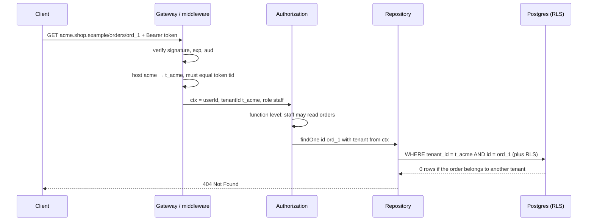

## Bối cảnh & vấn đề

Đoạn code dưới đây đã qua code review, chạy production nhiều tháng, và có test:

```ts
router.get('/orders/:id', auth, async (req, res) => {
  const order = await db.query('SELECT * FROM orders WHERE id = $1', [req.params.id]);
  if (!order.rows[0]) return res.status(404).end();
  res.json(order.rows[0]);
});

router.put('/orders/:id/address', auth, async (req, res) => {
  await db.query('UPDATE orders SET address = $1, tenant_id = $2 WHERE id = $3',
    [req.body.address, req.body.tenantId, req.params.id]);
  res.status(204).end();
});
```

Middleware `auth` xác thực token đúng cách, nên mọi request đều có user đã đăng nhập. Test gọi `GET /orders/1` bằng user của tenant sở hữu order 1 và nhận 200. Pentest thì làm khác: đăng nhập bằng một merchant dùng thử, đổi id trong URL từ 1 tới 50.000 và tải về đơn hàng của mọi merchant. Với `PUT`, họ gửi `tenantId` của chính mình trong body và "chuyển" đơn hàng của merchant khác sang tenant của họ.

Lỗi này có tên: **IDOR** (Insecure Direct Object Reference), trong OWASP API Top 10 gọi là **BOLA** (Broken Object Level Authorization), đứng hạng 1. Trong hệ thống multi-tenant nó nghiêm trọng hơn thường lệ, vì nạn nhân không phải một user mà là **toàn bộ dữ liệu của một công ty khác**. Gốc rễ là hai câu hỏi chưa được trả lời rõ: **tenant của request này là gì và ai nói thế**, và **resource này có thuộc tenant đó không**. Bài này trả lời hai câu hỏi đó. Phần HTTP semantics chi tiết (ma trận role × endpoint, Admin vs Storefront API) có ở [Authorization và API cho multi-tenant](/tracks/api-design/learn/authz-multitenant-api); bài này tập trung vào góc nhìn isolation.

## Khái niệm

### Tenant resolution

**Tenant resolution** là bước xác định tenant của một request, trước khi bất kỳ logic nghiệp vụ nào chạy. Có năm nguồn phổ biến:

- **Subdomain**: `acme.shop.example` → slug `acme` → tra bảng `tenants`.
- **Custom domain**: `shop.acme.com` (merchant trỏ CNAME về platform) → tra bảng `tenant_domains`.
- **Path**: `/t/acme/orders`; ít dùng cho app người dùng cuối, hay gặp ở API nội bộ.
- **Claim trong token**: access token có `tenant_id` (hoặc `tid`, `org_id`) do authorization server cấp.
- **API key**: key tra DB ra đúng một tenant; phổ biến cho integration server-to-server.
- Thêm một nguồn nữa, **header** `X-Tenant-Id`, do client tự gửi.

Các nguồn này chia làm hai loại. **Nguồn đã xác thực** là thông tin mà server có thể kiểm chứng bằng mật mã hoặc tra cứu: claim trong token đã verify chữ ký, API key tra DB. **Nguồn gợi ý** là thứ client tuỳ ý đặt: subdomain, path, header, body. Nguồn gợi ý hữu ích để chọn giao diện hay chọn tenant muốn làm việc, nhưng **không bao giờ đủ để cấp quyền**. Quy tắc: nếu dùng nguồn gợi ý, phải đối chiếu với identity đã xác thực (user có membership trong tenant đó không).

```ts
// Hint (from host) must agree with the authenticated source (token claim)
const hostTenant = await tenantByHost(req.hostname);      // hint
const claims = await verifyAccessToken(req);              // authenticated
if (hostTenant && hostTenant.id !== claims.tid) throw new ForbiddenError('token not issued for this tenant');
```

**Interview angle:** red flag rõ nhất là "lấy `X-Tenant-Id` từ header rồi query theo nó". Interviewer muốn nghe từ "đối chiếu với membership" hoặc "claim trong token đã verify".

### Active tenant và đổi tenant

Khi một user thuộc nhiều tenant, mỗi request phải có **một active tenant**, tức tenant mà request đang thao tác. Có hai cách thiết kế an toàn. Cách một: **token theo tenant**. Khi user chọn tenant trong UI, client gọi endpoint "switch tenant"; server kiểm tra membership và **cấp token mới** có claim `tid` và role của tenant đó. Mọi request sau mang token này, server không cần tra membership mỗi lần. Cách hai: **token theo user + header chọn tenant**. Token chỉ chứa `sub`; client gửi `X-Tenant-Id`; server **kiểm tra membership mỗi request** (có cache) rồi mới đặt context.

Cách một đơn giản hoá phía server và tránh quên check, nhưng khi membership bị thu hồi thì token cũ còn hiệu lực tới khi hết hạn (nên để access token ngắn, 5–15 phút). Cách hai linh hoạt (mở hai tab hai tenant), nhưng mỗi request có thêm một lookup và **mọi** đường vào (HTTP, WebSocket, GraphQL subscription) đều phải làm đúng check đó. Điều không được làm: client tự sửa claim trong token (chữ ký sai, bị từ chối) hay tự đổi header mà server tin luôn.

**Interview angle:** follow-up "user thuộc ba tenant và chuyển qua lại trong UI, backend biết tenant nào đang active một cách an toàn?" có đáp án chuẩn là "server cấp token mới sau khi check membership", kèm nhược điểm về thu hồi.

### Memberships và role theo tenant

Mô hình dữ liệu chuẩn tách ba thứ: `users` là **identity toàn cục** (email, mật khẩu hoặc liên kết IdP), `tenants` là khách hàng, và `memberships(user_id, tenant_id, role)` nối hai bảng, với role **thuộc về cặp user–tenant** chứ không thuộc về user. An là `owner` ở Acme nhưng chỉ là `viewer` ở Globex; mọi quyết định quyền phải dùng role của active tenant.

```sql
CREATE TABLE memberships (
  user_id   bigint NOT NULL REFERENCES users(id),
  tenant_id bigint NOT NULL REFERENCES tenants(id),
  role      text   NOT NULL CHECK (role IN ('owner', 'admin', 'staff', 'viewer')),
  PRIMARY KEY (user_id, tenant_id)
);
```

Authorization là hai câu hỏi liên tiếp: **function level** (role này có được gọi hành động này không, ví dụ `staff` được sửa địa chỉ đơn nhưng không được hoàn tiền) và **object level** (resource này có thuộc active tenant không, và với end customer thì có thuộc chính họ không). Thiếu câu thứ hai chính là BOLA.

**Interview angle:** câu trả lời mạnh nói "role là thuộc tính của membership", và tách rõ function-level check (middleware/guard) với object-level check (data layer).

### Ba cấp chủ thể trong B2B2C

Nền tảng B2B2C có ba loại người gọi API, và mỗi loại cần một mô hình quyền khác nhau:

- **Platform staff** (support, SRE, billing): có thể cần thao tác **xuyên tenant**. Quyền này phải hẹp, có thời hạn, và có **audit log** ghi rõ ai, tenant nào, lúc nào, lý do. Hình thức phổ biến là **impersonation** có thời hạn: staff nhận một token "act as tenant X" 30 phút, mọi hành động được gắn cả `actor = staff` lẫn `tenant = X`.
- **Merchant users**: role trong tenant như trên.
- **End customers**: chỉ thấy dữ liệu **của chính họ** trong tenant đó. Check kép: `order.tenant_id = ctx.tenantId` **và** `order.customer_id = ctx.customerId`.

Token của ba loại nên khác nhau rõ ràng (audience khác, issuer hoặc claim `typ` khác), và API admin phải từ chối token customer ngay ở gateway. Nhiều nền tảng tách hẳn hai bề mặt API (Admin API và Storefront API) để một lỗi cấu hình route không mở cửa admin cho customer.

**Interview angle:** câu hỏi "merchant support agent sửa địa chỉ của customer qua điện thoại, authorize và audit thế nào" đo xem bạn có nghĩ tới hành động thay mặt người khác (on-behalf-of) và audit trail hay không.

### 404 thay vì 403

Khi resource tồn tại nhưng thuộc tenant khác, trả **404 Not Found** chứ không trả 403 Forbidden. Lý do: 403 xác nhận "có thứ này, chỉ là bạn không được xem", tức là lộ **sự tồn tại** của dữ liệu tenant khác. Kẻ tấn công có thể dò id để đếm đơn hàng của đối thủ. 404 làm cho resource của tenant khác không thể phân biệt với resource không tồn tại.

403 vẫn đúng cho trường hợp **cùng tenant nhưng thiếu quyền**: `viewer` của Acme gọi API hoàn tiền của Acme nhận 403, vì họ đã biết đơn đó tồn tại. Cách triển khai tự nhiên là đặt `tenant_id` **vào trong câu query**: không có dòng nào khớp thì là 404, không cần nhánh riêng.

```ts
const order = await repo.findOne({ id, tenantId: ctx.tenantId });  // tenant filter inside the query
if (!order) throw new NotFoundError();                            // other tenant ≡ not found
if (!can(ctx.role, 'order.refund')) throw new ForbiddenError();   // same tenant, missing permission
```

**Interview angle:** interviewer hay hỏi "trả 403 hay 404?"; trả lời kèm lý do (không lộ sự tồn tại) và ngoại lệ (cùng tenant thiếu quyền → 403).

### ID toàn cục, ID theo tenant, và vì sao UUID không chữa IDOR

Có hai loại định danh. **ID kỹ thuật** (primary key) nên **toàn cục**: bigint từ identity column, UUIDv7 hoặc snowflake. ID toàn cục đơn giản cho join, cache key, event, và cho việc di chuyển tenant giữa các DB. **ID hiển thị theo tenant** (số đơn 1001, 1002 của riêng Acme) là **thuộc tính nghiệp vụ**, lưu ở cột riêng với `UNIQUE (tenant_id, order_no)`.

UUID làm id **khó đoán**, nhưng không làm truy cập **được phép**. UUID vẫn lộ qua URL chia sẻ, email xác nhận, log, screenshot gửi support, header Referer. Một khi kẻ tấn công có UUID của đơn hàng tenant khác, endpoint thiếu check tenant vẫn trả dữ liệu. UUID là **defense in depth** (giảm khả năng dò hàng loạt), còn kiểm soát truy cập vẫn phải là `WHERE tenant_id = ctx AND id = ?`. Lý do khác để tránh sequential id ở bề mặt public là **lộ quy mô kinh doanh**: đối thủ đặt một đơn mỗi sáng và đọc số đơn để biết bạn bán bao nhiêu mỗi ngày.

```sql
CREATE TABLE orders (
  tenant_id bigint NOT NULL,
  id        uuid   NOT NULL DEFAULT uuidv7() PRIMARY KEY,   -- uuidv7() is built in from PG 18 (checked on 18.6); use an extension or app-side UUIDv7 on older versions
  order_no  int    NOT NULL,
  UNIQUE (tenant_id, order_no)
);
```

**Interview angle:** câu "UUID có giải quyết IDOR không?" là câu bẫy; đáp án là không, kèm lý do UUID bị lộ, và phân biệt "khó đoán" với "được phép".

### Share link công khai có thể thu hồi

Đôi khi cần truy cập **không đăng nhập**: link xem đơn hàng gửi cho người nhận quà, link hoá đơn gửi kế toán. Thiết kế an toàn là một bảng `share_links(token_hash, tenant_id, resource_id, scope, expires_at, revoked_at)`. Token là chuỗi ngẫu nhiên 128 bit trở lên, DB chỉ lưu **hash** của nó (giống mật khẩu), link có hạn và có thể thu hồi bằng `revoked_at`. Endpoint public tra token → ra đúng một resource và một tenant, và chỉ trả những field mà scope cho phép (không trả địa chỉ đầy đủ, không trả email).

**Interview angle:** trả lời bằng "token ngẫu nhiên lưu dạng hash, có hạn, có thu hồi, scope hẹp" thay vì "dùng UUID của order làm link".

## Cơ chế hoạt động

Luồng dưới là đường đi của `GET /orders/:id` từ lúc request đến tới lúc trả dữ liệu, với mỗi bước là một lớp phòng thủ:



Các bước theo thứ tự. **Xác thực**: gateway verify chữ ký, hạn (`exp`) và audience của token; token sai là 401. **Resolution**: host `acme.shop.example` tra ra `t_acme` và phải khớp claim `tid`; không khớp là 403 (người dùng đã xác thực đang ở sai domain, không có dữ liệu nào bị lộ). **Context**: tenant, user, role được đặt vào request context (bài 3), từ đây mọi lớp dưới đọc tenant từ context, **không đọc từ request**. **Function level**: role `staff` có quyền `order.read`. **Object level**: repository luôn thêm `tenant_id` từ context vào query, và RLS ở DB (bài 5) là lưới an toàn nếu một câu raw SQL nào đó quên. Order của tenant khác trả 0 dòng, thành 404.

Điểm then chốt là **tenant đi một chiều**: từ nguồn đã xác thực vào context, rồi từ context vào query. Không có bước nào đọc tenant từ body, query string hay header để dùng cho truy vấn.

## Ví dụ thực tế

### Middleware resolution + membership, chạy thật

Demo Express 5.2.1 trên Node 24.21.0. Token là JSON ký HMAC (thay cho JWT để tránh dependency; nguyên tắc giống hệt). Hai tenant: Acme và Globex; An là `owner` ở Acme và `viewer` ở Globex.

```ts
app.use((req, res, next) => {
  const claims = verify(req.header('authorization')?.replace('Bearer ', '') ?? '');
  if (!claims) return res.status(401).json({ error: 'unauthenticated' });
  const hostTenant = tenantsByHost[req.hostname];
  if (hostTenant && hostTenant !== claims.tid) return res.status(403).json({ error: 'token not issued for this tenant' });
  if (req.header('x-tenant-id') && req.header('x-tenant-id') !== claims.tid)
    console.log(`  [audit] ignored spoofed X-Tenant-Id=${req.header('x-tenant-id')} for ${claims.sub}`);
  res.locals.ctx = { userId: claims.sub, tenantId: claims.tid, role: claims.role };
  next();
});

app.post('/session/switch-tenant', (req, res) => {
  const m = memberships.find((x) => x.userId === res.locals.ctx.userId && x.tenantId === req.body.tenantId);
  if (!m) return res.status(404).json({ error: 'not found' });
  res.json({ token: sign({ sub: m.userId, tid: m.tenantId, role: m.role, exp: Math.floor(Date.now() / 1000) + 900 }) });
});

app.get('/orders/:id', (req, res) => {
  const o = orders.find((x) => x.id === req.params.id && x.tenantId === res.locals.ctx.tenantId);
  o ? res.json(o) : res.status(404).json({ error: 'not found' });
});
```

Output thật khi chạy sáu kịch bản:

```text
An@acme GET ord_1                            200 {"id":"ord_1","tenantId":"t_acme","total":120}
An@acme GET ord_2 (globex order)             404 {"error":"not found"}
  [audit] ignored spoofed X-Tenant-Id=t_globex for u_an
An@acme + X-Tenant-Id: t_globex, GET ord_2   404 {"error":"not found"}
An switches to globex                        200 {"token":"eyJzdWIiOiJ1X2FuIiwidGlkIjoidF9nbG9iZXgi... (truncated)"}
An tries tenant without membership           404 {"error":"not found"}
Tampered token (tid edited client-side)      401 {"error":"unauthenticated"}
```

Đọc kết quả: đơn của Globex trả 404 dù An đã đăng nhập hợp lệ. Header giả bị bỏ qua (và được ghi audit, vì đó là tín hiệu tấn công hoặc bug client). Muốn làm việc ở Globex, An phải đi qua endpoint switch; server kiểm tra membership và cấp token mới với role `viewer`, không phải `owner`. Sửa claim `tid` ngay trong token làm hỏng chữ ký, nên bị 401. Tenant không có membership trả 404, không lộ việc tenant đó có tồn tại hay không.

### Sửa lỗi IDOR ở đầu bài, ở bốn lớp

Lớp 1, **handler/repository**: tenant lấy từ context, nằm trong câu query, và cột `tenant_id` không bao giờ nằm trong danh sách được update.

```ts
router.get('/orders/:id', auth, async (req, res) => {
  const { tenantId } = requireCtx();
  const r = await db.query('SELECT * FROM orders WHERE tenant_id = $1 AND id = $2', [tenantId, req.params.id]);
  if (!r.rows[0]) return res.status(404).end();
  res.json(r.rows[0]);
});

const AddressBody = z.object({ address: z.string().min(5).max(500) }).strict();   // tenantId in body → 400
router.put('/orders/:id/address', auth, requirePermission('order.update_address'), async (req, res) => {
  const { tenantId } = requireCtx();
  const { address } = AddressBody.parse(req.body);
  const r = await db.query('UPDATE orders SET address = $1 WHERE tenant_id = $2 AND id = $3', [address, tenantId, req.params.id]);
  if (r.rowCount === 0) return res.status(404).end();
  res.status(204).end();
});
```

Lớp 2, **database**: RLS với `USING` và `WITH CHECK` (bài 5) chặn cả đọc chéo lẫn việc đổi `tenant_id` sang tenant khác; composite FK (bài 4) chặn tham chiếu chéo. Lớp 3, **permission trong tenant**: `requirePermission` kiểm tra role có được sửa địa chỉ không, và nếu caller là end customer thì thêm `customer_id = ctx.customerId`. Lớp 4, **test**: suite tự động gọi mọi route có `:id` bằng token tenant A với id của tenant B và kỳ vọng 404 (bài 10). Muốn tìm mọi endpoint cùng lỗi trong codebase 300 route, cách nhanh là chạy chính suite đó, rồi grep các câu SQL trên bảng tenant không chứa `tenant_id` như lưới bổ sung.

### Kể lại đường đi của `/orders/:id` trong phỏng vấn

Khi được hỏi "request `/orders/:id` được đảm bảo chỉ trả dữ liệu tenant của caller như thế nào", một câu trả lời có cấu trúc đi theo đúng sơ đồ ở trên: tenant lấy từ đâu (claim đã verify, đối chiếu domain), context đi qua các lớp ra sao, data access filter ở đâu (repository bắt buộc, RLS hoặc với SQL Server là security policy dùng `SESSION_CONTEXT`, index bắt đầu bằng tenant), trả 404 khi khác tenant, và test nào chứng minh. Phần giá trị nhất là **lớp yếu nhất** của thiết kế và thứ bạn sẽ thêm. Hãy điền bằng trải nghiệm thật của bạn; đừng dựng lên incident không có thật.

## Trade-offs & lựa chọn thay thế

| Cách xác định active tenant | Ưu | Nhược | Hợp khi |
| --- | --- | --- | --- |
| Subdomain/custom domain + claim phải khớp | Rõ ràng cho user, cookie tách theo domain | Cần wildcard TLS, quản lý custom domain | Storefront, admin web theo tenant |
| Token theo tenant (switch cấp token mới) | Server không tra membership mỗi request | Thu hồi membership trễ tới khi token hết hạn | SPA/mobile, API cho merchant user |
| Token theo user + header + check membership mỗi request | Nhiều tab nhiều tenant, thu hồi tức thì | Thêm lookup, dễ quên ở kênh phụ (WebSocket) | Công cụ nội bộ, user làm cho nhiều tenant cùng lúc |
| API key → tenant | Đơn giản cho server-to-server | Key bị lộ = toàn quyền tenant, cần rotate | Integration, webhook consumer |
| Path `/t/:tenant` | Dễ debug, dễ log | Dễ bị tin nhầm như nguồn xác thực | API nội bộ, luôn kèm check membership |

Chọn theo loại client. Web admin theo tenant thường kết hợp subdomain (trải nghiệm) với token theo tenant (bảo mật). Integration dùng API key có scope theo tenant. Trường hợp user làm cho nhiều tenant cùng lúc (kế toán dịch vụ) là lý do chính để chọn token theo user + check membership mỗi request, với cache membership có TTL ngắn và invalidation khi membership thay đổi.

## Edge cases & failure modes

- **Membership bị thu hồi khi token còn hạn**: nhân viên nghỉ việc vẫn đọc được dữ liệu tới 15 phút. Giảm bằng access token ngắn, kiểm tra membership cho thao tác nhạy cảm, hoặc danh sách thu hồi theo `sub` + `tid`.
- **Custom domain bị chiếm**: merchant bỏ domain, CNAME còn trỏ về platform, người khác đăng ký lại domain đó và nhận traffic. Cần xác minh sở hữu domain (TXT record) và gỡ mapping khi tenant rời đi.
- **Cookie dùng chung giữa subdomain**: cookie session đặt `Domain=.shop.example` được gửi tới mọi subdomain tenant; một XSS ở storefront tenant A có thể dùng session của admin tenant B nếu cookie chung. Đặt cookie host-only (không có `Domain`, prefix `__Host-`).
- **WebSocket và SSE**: check tenant ở lúc handshake nhưng không ở từng message subscribe; client subscribe `channel: orders:t_globex`. Mỗi subscription phải được authorize như một request.
- **Lỗi validation lộ dữ liệu**: `409 Conflict: email already used by tenant Globex` là một cross-tenant leak nhỏ nhưng thật. Thông báo lỗi chỉ được nói về tenant của caller.
- **Platform staff impersonation không hết hạn**: token "act as" tồn tại vô thời hạn trong trình duyệt của support. Giới hạn 30–60 phút, gắn lý do (ticket id), và hiển thị banner cho staff biết đang impersonate.

## Pitfalls

- ❌ `const tenantId = req.headers['x-tenant-id']` rồi query thẳng → ✅ tenant từ claim đã verify, hoặc header đối chiếu membership, vì header do client tuỳ ý đặt.
- ❌ Nhận `tenantId` trong body của create/update → ✅ schema request `.strict()` không có `tenantId`, tenant luôn lấy từ context, vì body là dữ liệu của kẻ tấn công.
- ❌ Cho phép `UPDATE ... SET tenant_id = ...` qua API → ✅ `tenant_id` bất biến sau khi tạo, RLS `WITH CHECK` chặn ở DB, vì đổi tenant là "chuyển nhà" dữ liệu sang kẻ tấn công.
- ❌ Trả 403 khi resource thuộc tenant khác → ✅ 404, vì 403 lộ sự tồn tại.
- ❌ "Dùng UUID nên không lo IDOR" → ✅ UUID là lớp phụ, check tenant và quyền là lớp chính, vì UUID bị lộ qua URL, log, email.
- ❌ Role lưu trên bảng `users` → ✅ role nằm trên `memberships`, vì cùng một người có role khác nhau ở tenant khác nhau.
- ❌ Chỉ check tenant ở list endpoint → ✅ mọi endpoint có id (GET, PUT, DELETE, export, webhook, admin tool), vì list thường là endpoint duy nhất được viết cẩn thận.

## Tóm tắt

- Nguồn tenant **đã xác thực**: claim trong token đã verify, API key tra DB. Nguồn **gợi ý**: subdomain, path, header, body; chỉ dùng khi đối chiếu với membership.
- User nhiều tenant: server cấp **token mới theo tenant** sau khi check membership, hoặc check membership mỗi request; client không bao giờ tự quyết tenant.
- `users` (identity) – `memberships(user_id, tenant_id, role)` – resource có `tenant_id`; role thuộc membership.
- B2B2C: platform staff (xuyên tenant, audit, impersonation có hạn), merchant user (role trong tenant), end customer (tenant check + ownership check).
- Resource của tenant khác → **404**; cùng tenant thiếu quyền → 403.
- ID kỹ thuật toàn cục, số hiển thị theo tenant `UNIQUE (tenant_id, order_no)`; UUID không chữa IDOR.
- Sửa IDOR ở nhiều lớp: query có tenant từ context, `tenant_id` bất biến, RLS + composite FK, permission trong tenant, test chéo tenant tự động.
