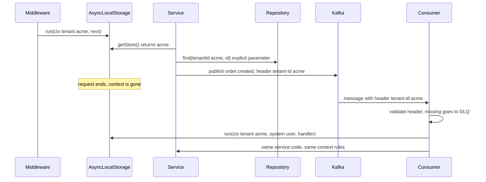
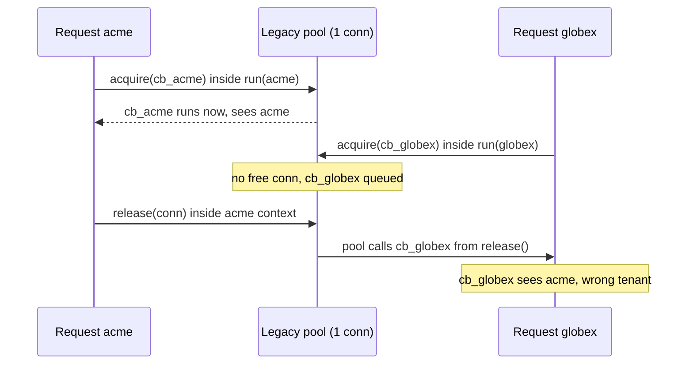

## Bối cảnh & vấn đề

Service đơn hàng có 40 hàm từ controller xuống repository. Phiên bản đầu truyền `tenantId` qua từng hàm: `createOrder(tenantId, input)` → `priceCart(tenantId, cart)` → `loadPromotions(tenantId, skus)` → `promoRepo.find(tenantId, ...)`. Mỗi hàm mới thêm một tham số; một dev mệt mỏi viết `loadPromotions(skus)` và hàm đó, không có tenant, gọi `promoRepo.findAll()`. Lần khác, một dev "tối ưu" bằng cách lưu tenant vào một biến module:

```ts
let lastTenant: string | undefined;            // "fallback"

app.use(async (req, res, next) => {
  const auth = await verify(req);
  als.enterWith({ tenantId: auth.tenantId });
  lastTenant = auth.tenantId;
  next();
});

legacyPool.acquire((err, conn) => {
  const t = als.getStore()?.tenantId ?? lastTenant;
  conn.query(sql, [t]);
});
```

Production log thỉnh thoảng có `No tenant context`, và tệ hơn, vài request **thực thi dưới tenant khác**. Không có lỗi nào tái hiện được khi test tuần tự; chúng chỉ xuất hiện khi hai request chạy đồng thời.

Bài toán là **tenant context**: làm sao để tenant, được xác định một lần ở edge (bài 2), đi theo request qua mọi lớp và mọi `await`, không bị mất, không bị lẫn giữa các request đồng thời, và **fail closed** khi thiếu. Công cụ chuẩn trong Node.js là `AsyncLocalStorage`. Phần cơ bản của ALS (run, getStore, mất context qua batcher) đã có ở [bài request context của Express](/tracks/express/learn/validation-request-context); bài này đi vào những gì đặc thù multi-tenant: nhầm tenant (không chỉ mất), job, consumer và cấu hình theo tenant.

## Khái niệm

### Tenant context

**Tenant context** là một object nhỏ, bất biến, mô tả "request này đang chạy cho ai": `tenantId`, `userId`, role, có thể thêm `requestId` và cấu hình của tenant. Nó được tạo **một lần** sau khi xác thực, và mọi lớp phía dưới đọc từ nó thay vì từ request. Nguyên tắc: context **không bao giờ đổi tenant giữa chừng** và **không bao giờ có giá trị mặc định**. Nếu một hàm cần tenant mà context rỗng, nó ném lỗi.

```ts
type TenantCtx = Readonly<{ tenantId: string; userId: string; role: string; requestId: string }>;
```

**Interview angle:** interviewer muốn nghe "fail closed": thiếu context là lỗi lập trình, không phải tín hiệu để chạy query không filter.

### AsyncLocalStorage và `run()`

**`AsyncLocalStorage`** (module `node:async_hooks`) cho phép gắn một giá trị (store) vào một **chuỗi thao tác bất đồng bộ**. Gọi `als.run(store, fn)` thì mọi code chạy trong `fn`, kể cả sau `await`, trong `setTimeout`, trong promise continuation được tạo bên trong, đều thấy `als.getStore() === store`. Hai lời gọi `run()` đồng thời có hai store độc lập, không đè lên nhau. Ngoài phạm vi `fn`, store trở lại như trước.

Tại sao nó hoạt động: khi một async resource (promise, timer, socket request) được **tạo**, Node chụp context hiện tại và gắn vào resource; khi callback của resource chạy, context đó được khôi phục. Từ **Node 24**, implementation mặc định chuyển sang **AsyncContextFrame** (context được lưu theo "frame" mà V8 mang theo qua promise), nhanh hơn cách dựa trên async_hooks cũ; API không đổi và cờ `--no-async-context-frame` quay về cách cũ (verify khi nâng version). Trong thí nghiệm của bài này, cả hai chế độ cho cùng kết quả.

```ts
import { AsyncLocalStorage } from 'node:async_hooks';
export const als = new AsyncLocalStorage<TenantCtx>();

app.use((req, res, next) => {
  const { tid, sub, role } = res.locals.claims;           // verified in the auth middleware
  als.run(Object.freeze({ tenantId: tid, userId: sub, role, requestId: req.id }), next);
});

export function currentTenant(): string {
  const ctx = als.getStore();
  if (!ctx) throw new Error('No tenant context');
  return ctx.tenantId;
}
```

**Interview angle:** câu hỏi "làm sao propagate tenant mà không truyền tham số" có đáp án ALS; điểm cộng là giải thích cơ chế "context đi theo nơi tạo async resource".

### `enterWith()` và vì sao tránh nó trong server

**`als.enterWith(store)`** gán store cho **phần còn lại của execution đồng bộ hiện tại** và mọi async resource tạo ra sau đó, không có phạm vi kết thúc rõ ràng. Trong middleware, điều đó có nghĩa là store "tràn" ra ngoài: code của caller chạy sau khi middleware return vẫn thấy tenant đó. Tài liệu Node khuyến nghị dùng `run()` thay cho `enterWith()` trong hầu hết trường hợp.

Thí nghiệm thật (Node 24.21.0): một hàm gọi `enterWith({ tenantId: 'acme' })` rồi return; caller đọc `getStore()` và nhận `acme`. Nếu caller đó là vòng lặp xử lý nhiều việc (event loop tick xử lý request kế tiếp trong cùng callback), tenant của request trước dính sang.

```text
3. after enterWith returned, caller sees: acme
```

**Interview angle:** nói được "`run` có phạm vi, `enterWith` thì không" là tín hiệu bạn đã đọc tài liệu chứ không chỉ copy snippet.

### Context bị mất và context bị nhầm

Có hai kiểu hỏng khác nhau về mức nghiêm trọng. **Mất context**: `getStore()` trả `undefined`; nếu code fail closed, bạn nhận lỗi 500 và log `No tenant context`, khó chịu nhưng an toàn. **Nhầm context**: `getStore()` trả store của **request khác**; code chạy trơn tru với tenant sai, và đây là cross-tenant leak. Nhầm context nguy hiểm hơn nhiều vì không có lỗi nào báo.

Nguồn gây nhầm phổ biến nhất là **thư viện tự quản hàng đợi callback**: connection pool kiểu callback, batcher, client cache. Callback được đưa vào hàng đợi trong request A nhưng được **gọi từ code của request B** (ví dụ lúc B trả connection về pool), nên nó chạy trong context của B. Nguồn thứ hai là **EventEmitter**: `emit()` gọi listener đồng bộ trong context của nơi **emit**, không phải nơi đăng ký listener.

Cách sửa: `AsyncResource.bind(fn)` hoặc `AsyncLocalStorage.bind(fn)` gói callback với context **hiện tại** trước khi đưa cho thư viện; dùng API promise-based của thư viện (promise giữ context đúng); với emitter riêng, `EventEmitterAsyncResource`. Và ở tầng data access, lớp bảo vệ mạnh nhất là **truyền tenant tường minh** vào repository (lấy từ context một lần ở ranh giới service) thay vì để hàm sâu nhất tự đọc ALS.

**Interview angle:** follow-up "kể các tình huống ALS mất context và cách sửa" đo kinh nghiệm thật; nhắc cả "nhầm" chứ không chỉ "mất" là điểm khác biệt.

### Context qua queue, job và consumer

Context **không tự đi qua biên process**. Khi một request enqueue job hoặc publish message, ALS của request đó kết thúc ở producer. Consumer nhận message trong một process khác (hoặc cùng process nhưng từ socket của broker), với context rỗng. Quy tắc: producer ghi `tenantId` vào **payload hoặc header** của message; consumer đọc ra, **validate**, rồi `als.run({ tenantId, userId: 'system' }, handler)` trước khi gọi service. Message thiếu tenant đi vào **dead-letter queue**, không được xử lý "toàn cục".

Job định kỳ cho mọi tenant (tính điểm thưởng hằng đêm, gửi báo cáo) không nên là một vòng lặp chạy dưới một context "system" rồi query mọi tenant cùng lúc. Nên lặp qua danh sách tenant và `run()` **riêng cho từng tenant**: lỗi được cô lập theo tenant, concurrency được giới hạn, và code nghiệp vụ dùng lại y nguyên như trong request.

```ts
consumer.run({
  eachMessage: async ({ message }) => {
    const tenantId = message.headers?.['tenant-id']?.toString();
    if (!tenantId) throw new Error('Missing tenant-id header');   // retried, then DLQ
    await als.run(Object.freeze({ tenantId, userId: 'system', role: 'system', requestId: message.key?.toString() ?? '' }),
      () => handle(message));
  },
});
```

**Interview angle:** câu "nightly job lặp 3.000 tenant, một tenant lỗi làm dừng cả vòng" có đáp án là run per tenant + giới hạn concurrency + ghi nhận lỗi từng tenant + retry riêng.

### Per-tenant configuration và feature flag

Mỗi tenant có cấu hình riêng: plan, giới hạn, locale, currency, time zone, tính năng được bật. Dấu hiệu thiết kế tồi là `if (tenantId === 't_acme') { ... }` rải khắp code. Thiết kế tốt có ba phần: **bảng config** với default toàn cục và override theo tenant; **nạp config một lần** vào đầu request (lazy, có cache theo tenant, invalidation khi đổi) và đặt vào context; **feature flag** với targeting theo thuộc tính tenant (plan, region, danh sách tenant) qua một hệ thống flag (OpenFeature là chuẩn API mở, LaunchDarkly hay Unleash là implementation) thay vì hard-code id.

Customization lớn hơn (tenant A tính thuế khác, tenant B có workflow duyệt đơn) nên đi qua **extension point**: strategy theo capability (`taxStrategy: 'vat-inclusive' | 'us-sales-tax'`) được chọn theo config, không fork code theo tenant. Mọi thay đổi config phải có audit log vì config là một dạng quyền.

```ts
type TenantConfig = { plan: 'free' | 'pro' | 'enterprise'; currency: string; timeZone: string; maxProducts: number; flags: Record<string, boolean> };
const DEFAULTS: TenantConfig = { plan: 'free', currency: 'USD', timeZone: 'UTC', maxProducts: 1000, flags: {} };

async function loadConfig(tenantId: string): Promise<TenantConfig> {
  return configCache.getOrLoad(`t:${tenantId}:config:v3`, async () => ({ ...DEFAULTS, ...(await configRepo.overrides(tenantId)) }), { ttlSeconds: 60 });
}
```

**Interview angle:** follow-up "roll out tính năng rủi ro cho 5% tenant rồi rollback tức thì" có đáp án là flag có targeting theo tenant với phân bổ theo hash của `tenantId` (ổn định), kill switch, và metric tách theo nhóm bật/tắt.

## Cơ chế hoạt động

Sơ đồ dưới cho thấy context đi từ HTTP request qua các lớp, qua message broker, và được dựng lại ở consumer:



Từng bước: middleware mở một phạm vi `run()` sau khi token đã được verify; service đọc tenant từ ALS **một lần** ở ranh giới và truyền tường minh xuống repository; khi publish, tenant được ghi thành header. Phạm vi `run()` kết thúc cùng request. Ở phía consumer, không có gì "tự nhiên" mang context sang: consumer đọc header, từ chối message thiếu tenant, rồi mở phạm vi `run()` mới. Service code không cần biết nó được gọi từ HTTP hay từ consumer.

Còn đây là cơ chế của lỗi "nhầm tenant" qua pool kiểu callback, là phần khó nhất:



Callback của globex được lưu trong mảng của pool, không phải trong một async resource do Node theo dõi. Khi acme trả connection, pool gọi callback đó **đồng bộ, từ bên trong hàm `release()` của acme**, nên ALS trả về context của acme. `AsyncResource.bind(cb)` chụp context tại thời điểm `acquire()` được gọi và khôi phục nó khi callback chạy, bất kể ai gọi.

## Ví dụ thực tế

### Tái hiện bốn lỗi context và cách sửa (chạy thật)

Script dưới chạy trên Node 24.21.0, cả chế độ mặc định và `--no-async-context-frame` (kết quả giống nhau).

```ts
import { AsyncLocalStorage, AsyncResource } from 'node:async_hooks';
import { EventEmitter } from 'node:events';
import { setTimeout as sleep } from 'node:timers/promises';

const als = new AsyncLocalStorage<{ tenantId: string }>();
const t = () => als.getStore()?.tenantId ?? '(none)';

// 1. Module-level "fallback" races between concurrent requests
let lastTenant: string | undefined;
async function handlerWithFallback(tenantId: string, delay: number) {
  lastTenant = tenantId;
  await sleep(delay);
  return `request for ${tenantId} used ${lastTenant}`;
}
console.log('1.', await Promise.all([handlerWithFallback('acme', 20), handlerWithFallback('globex', 5)]));

// 2. run() keeps context across await/timers, each request isolated
async function handler(delay: number) { await sleep(delay); return t(); }
console.log('2.', await Promise.all([
  als.run({ tenantId: 'acme' }, () => handler(20)),
  als.run({ tenantId: 'globex' }, () => handler(5)),
]));

// 4. Callback-queue pool: the queued callback runs in the releaser's context
class LegacyPool {
  private waiters: Array<(conn: string) => void> = [];
  private free = ['conn-1'];
  acquire(cb: (conn: string) => void) { const c = this.free.pop(); if (c) cb(c); else this.waiters.push(cb); }
  release(conn: string) { const next = this.waiters.shift(); if (next) next(conn); else this.free.push(conn); }
}
// acme acquires, releases 10 ms later; globex queues a callback meanwhile
//   ...pool.acquire(cb)                      → globex callback sees acme
//   ...pool.acquire(AsyncResource.bind(cb))  → globex callback sees globex

// 6. EventEmitter: listeners run in the context of emit()
const bus = new EventEmitter();
als.run({ tenantId: 'acme' }, () => bus.on('order.created', () => console.log('6. listener registered under acme sees', t())));
als.run({ tenantId: 'globex' }, () => bus.emit('order.created'));
```

```text
1. [ 'request for acme used globex', 'request for globex used globex' ]
2. [ 'acme', 'globex' ]
3. after enterWith returned, caller sees: acme
4. [ 'acme callback sees acme', 'globex callback sees acme' ]
5. [ 'globex callback sees globex' ]
6. listener registered under acme sees globex
7. No tenant context
```

Đọc từng dòng. (1) Biến module là **một ô nhớ cho cả process**: request acme chờ 20 ms, trong lúc đó request globex ghi đè, nên acme chạy với tenant globex. Đây đúng là lỗi "act under another tenant" trong code đầu bài. (2) `run()` cô lập đúng. (3) `enterWith()` tràn ra caller. (4) Pool kiểu callback làm globex **chạy dưới tenant acme**, không có lỗi nào được ném. (5) `AsyncResource.bind` sửa được. (6) Listener nhận context của nơi emit; nếu listener ghi audit log thì log sẽ gắn sai tenant. (7) Ngoài phạm vi `run()`, `currentTenant()` ném lỗi thay vì trả giá trị mặc định.

Bản sửa hoàn chỉnh cho code đầu bài: bỏ `lastTenant`; `als.run(ctx, next)` thay cho `enterWith`; bọc callback của pool cũ bằng `AsyncResource.bind` hoặc chuyển sang API promise; repository nhận `tenantId` tường minh. Để chứng minh không còn lẫn context, viết load test bắn song song hàng nghìn request xen kẽ hai tenant, với độ trễ ngẫu nhiên ở tầng DB giả lập, và assert tenant trong mỗi response khớp token.

### Nightly job qua nhiều tenant, cô lập lỗi (chạy thật)

```ts
async function recalcLoyaltyPoints() {           // business code only reads context
  const t = tenant();
  await sleep(t === 't_007' ? 30 : 5);
  if (t === 't_013') throw new Error('invalid points rule');
  return t;
}

// BAD: one loop, one failure stops the rest
for (const t of tenants) done.push(await als.run({ tenantId: t, jobId: 'nightly' }, recalcLoyaltyPoints));

// GOOD: per-tenant run(), bounded concurrency, isolate failures
async function perTenant(concurrency = 4) {
  const queue = [...tenants]; const ok: string[] = []; const failed: { tenantId: string; error: string }[] = [];
  const worker = async () => {
    for (let t = queue.shift(); t; t = queue.shift()) {
      try { ok.push(await als.run({ tenantId: t, jobId: `nightly:${t}` }, recalcLoyaltyPoints)); }
      catch (e) { failed.push({ tenantId: t, error: (e as Error).message }); }
    }
  };
  await Promise.all(Array.from({ length: concurrency }, worker));
  return { ok: ok.length, failed };
}
```

```text
naive: stopped after 12/20: invalid points rule
{ ok: 19, failed: [ { tenantId: 't_013', error: 'invalid points rule' } ], ms: 37 }
```

Vòng lặp ngây thơ dừng ở tenant thứ 13; tám tenant sau không được xử lý đêm đó. Bản per-tenant hoàn thành 19/20, ghi lại tenant lỗi để retry riêng và cảnh báo. Ở quy mô 3.000 tenant, thêm ba điều: mỗi tenant là **một job riêng trong queue** (retry, timeout, visibility riêng) thay vì một process chạy cả vòng; tenant lớn không được chiếm hết worker (fair scheduling, bài 8); và job ghi checkpoint để chạy lại không làm hai lần.

## Trade-offs & lựa chọn thay thế

| Cách mang tenant | Ưu | Nhược | Hợp khi |
| --- | --- | --- | --- |
| Tham số tường minh mọi hàm | Rõ ràng, type-check được, không phép màu | Rườm rà, dễ có hàm "quên" nhận tenant | Tầng repository/data access |
| AsyncLocalStorage | Không đổi chữ ký hàm, hợp log/trace | Mất/nhầm context với thư viện callback, "phép màu" khó đọc | Middleware → service, logger, tracer |
| NestJS request-scoped provider | Tích hợp DI | Tạo instance mỗi request, lan ngược lên cả chuỗi dependency, hỏng ngoài HTTP (cron, consumer) | Hiếm khi; xem [injection scopes](/tracks/nestjs/learn/injection-scopes) |
| `nestjs-cls` (ALS bọc cho Nest) | ALS + DI, hỗ trợ guard/interceptor, dùng được ngoài HTTP | Thêm dependency, cùng rủi ro ALS | App NestJS |
| Biến module/field singleton | Không có ưu điểm | Race giữa request đồng thời | Không bao giờ |

Cách phối hợp được khuyến nghị: ALS ở tầng trên (middleware, service, logger) để không phải truyền tay; **ở ranh giới data access, lấy tenant từ context một lần và truyền tường minh** vào repository. Như vậy lớp nguy hiểm nhất (nơi query được tạo) không phụ thuộc vào việc ALS có còn nguyên vẹn qua mọi thư viện hay không, và RLS ở DB là lưới cuối cùng.

## Edge cases & failure modes

- **Thư viện không hỗ trợ ALS**: driver cũ, client batching (DataLoader tạo ở module scope), SDK tự quản queue. Dấu hiệu là log `No tenant context` rải rác dưới tải. Bọc callback bằng `AsyncResource.bind`, hoặc tạo DataLoader **per request** bên trong `run()`.
- **Cache in-process dùng chung promise**: `memo.get(key) ?? memo.set(key, load())` với key không có tenant; request globex nhận promise do acme tạo, cả dữ liệu lẫn context bên trong đều của acme. Key memo phải có tenant.
- **Stream và event từ socket**: callback `data` của một stream tạo lúc boot chạy trong context rỗng; stream tạo trong request thì mang context đúng. Kiểm tra nơi tạo resource.
- **Middleware thứ tự sai**: logger middleware chạy trước auth nên log của 401/403 không có tenant, không điều tra được khi bị dò token. Ghi tenant "chưa xác thực" (hint) riêng với tenant đã xác thực.
- **Worker threads**: ALS không đi qua `worker_threads`; phải truyền tenant trong message tới worker và `run()` lại bên trong.
- **Retry của consumer**: message retry sau khi config tenant đã đổi (tenant bị suspend). Consumer phải kiểm tra trạng thái tenant ở mỗi lần xử lý, không chỉ lúc publish.
- **Hiệu năng**: ALS có chi phí nhỏ; với AsyncContextFrame trên Node 24 chi phí giảm so với async_hooks cũ (verify bằng benchmark của chính bạn nếu đường nóng rất nhạy).

## Pitfalls

- ❌ Lưu tenant hiện tại vào biến module hoặc field của service singleton → ✅ `als.run()` mỗi request, vì một process phục vụ nhiều request đồng thời.
- ❌ `?? lastTenant`, `?? 'default'`, hay query không filter khi context rỗng → ✅ ném `No tenant context`, vì fallback biến lỗi "mất" thành lỗi "nhầm".
- ❌ `als.enterWith()` trong middleware → ✅ `als.run(store, next)`, vì `enterWith` không có phạm vi kết thúc.
- ❌ Đưa callback thô cho pool/batcher kiểu callback → ✅ `AsyncResource.bind(cb)` hoặc API promise, vì callback có thể chạy trong context của request khác.
- ❌ Publish message không mang tenant, consumer "đoán" tenant từ dữ liệu → ✅ header `tenant-id` bắt buộc, thiếu thì DLQ.
- ❌ Store có thể sửa (`ctx.tenantId = other`) → ✅ `Object.freeze`, đổi tenant nghĩa là mở `run()` mới.
- ❌ `if (tenantId === 't_acme')` trong code nghiệp vụ → ✅ config/flag theo thuộc tính tenant, strategy theo capability.

## Tóm tắt

- Tenant context: object bất biến tạo một lần sau xác thực; thiếu context thì **ném lỗi**, không fallback.
- `als.run(ctx, next)` cô lập request đồng thời; `enterWith` tràn phạm vi; Node 24 dùng AsyncContextFrame mặc định, API không đổi.
- "Nhầm context" nguy hiểm hơn "mất context": biến module, pool kiểu callback (đo thật: globex chạy dưới acme), EventEmitter chạy theo context của `emit`.
- Sửa: `AsyncResource.bind`/`als.bind`, API promise, và truyền tenant tường minh ở tầng repository.
- Queue/Kafka: tenant trong header, consumer validate rồi `run()` lại; thiếu tenant → DLQ.
- Job cho nhiều tenant: `run()` riêng từng tenant, giới hạn concurrency, cô lập lỗi (đo thật: 19/20 thay vì dừng ở 12/20).
- Config/flag theo tenant: default + override, nạp vào context, targeting theo thuộc tính tenant, không `if (tenantId === ...)`.
