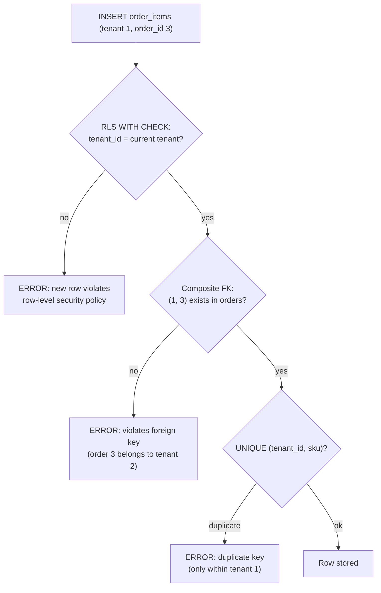

## Bối cảnh & vấn đề

Một nền tảng pooled có bảng `orders(tenant_id, id, ...)` và `order_items(id, order_id, sku, ...)`. Bảng con không có `tenant_id` vì "đã có qua order rồi". Rồi các vấn đề lần lượt xuất hiện:

- Một job import có bug: nó tạo `order_items` của tenant Acme trỏ vào `order_id` của Globex. Foreign key `order_items.order_id → orders.id` hài lòng, vì order đó có tồn tại. Báo cáo doanh thu của Globex tăng vì hàng của Acme.
- Merchant Acme không tạo được sản phẩm SKU `SUMMER-01`, báo lỗi "already exists", dù Acme chưa từng có SKU đó. Constraint là `UNIQUE (sku)` toàn cục; Globex đã dùng SKU này. Lỗi không chỉ chặn nghiệp vụ hợp lệ mà còn **cho Acme biết** Globex có SKU `SUMMER-01`, một thông tin có thể nhạy cảm (sản phẩm chưa công bố).
- Báo cáo "doanh thu theo ngày" cho merchant ở New York tính theo ngày UTC; đơn lúc 22 giờ tối ngày 29 bị tính sang ngày 30.
- Một dev viết endpoint export mới bằng raw SQL, quên `tenant_id`, và file CSV chứa đơn của mọi merchant.

Bài này là về **thiết kế schema và data access** cho mô hình pool: làm sao để database **tự** từ chối dữ liệu lẫn tenant, constraint không lộ thông tin, và việc quên filter bị phát hiện trước production. Nền tảng về kiểu dữ liệu, khoá chính và composite index có ở [Data modeling](/tracks/sql-postgres/learn/data-modeling); RLS có bài riêng ([Row-Level Security](/tracks/multi-tenancy/learn/postgres-rls)).

## Khái niệm

### `tenant_id` ở mọi bảng nghiệp vụ

Trong mô hình pool, **mọi bảng chứa dữ liệu thuộc tenant đều có cột `tenant_id NOT NULL`**, kể cả bảng con như `order_items`, `order_events`, `product_images`. Lý do: mọi query có thể lọc theo tenant mà không cần JOIN ngược lên bảng cha; RLS policy trên bảng con đơn giản như trên bảng cha; export, xoá, di chuyển dữ liệu theo tenant chỉ là `WHERE tenant_id = X` trên từng bảng; và composite FK (phần sau) cần cột này để hoạt động.

Chi phí là 8 byte mỗi dòng (bigint) và thêm một cột trong mỗi index liên quan, gần như luôn đáng giá. Ngoại lệ là bảng **toàn cục** thật sự: danh mục quốc gia, currency, bảng `tenants` và `users` (identity toàn cục). Hãy liệt kê rõ danh sách bảng toàn cục; mặc định mọi bảng mới là bảng tenant.

```sql
CREATE TABLE order_items (
  tenant_id bigint NOT NULL,
  id        bigint GENERATED ALWAYS AS IDENTITY PRIMARY KEY,
  order_id  bigint NOT NULL,
  sku       text   NOT NULL
);
```

**Interview angle:** câu hỏi "bảng con có cần `tenant_id` không?" có đáp án có, kèm lý do filter, RLS, xoá/di chuyển theo tenant và composite FK.

### `tenant_id` đầu mọi index

Gần như mọi query của app có `tenant_id = $1`, nên `tenant_id` là **cột đầu của gần như mọi index**: `(tenant_id, created_at)`, `(tenant_id, customer_id)`, `(tenant_id, status, created_at)`. Cột đầu của B-tree là cột lọc bằng đẳng thức hiệu quả nhất; index `(created_at)` đơn thuần buộc Postgres quét khoảng thời gian của **mọi tenant** rồi lọc bỏ phần lớn (chi tiết cơ chế ở [B-tree indexes](/tracks/sql-postgres/learn/btree-indexes)). Với RLS, điều kiện `tenant_id = <giá trị>` của policy được planner dùng làm index condition giống hệt filter viết tay, nên cùng một index phục vụ cả hai.

**Interview angle:** interviewer hay hỏi thứ tự cột trong index cho query "đơn gần đây của tenant"; `(tenant_id, created_at DESC)` là đáp án và lý do là equality trước, range sau.

### Composite foreign key

Foreign key đơn cột `order_items.order_id → orders.id` chỉ kiểm tra "order có tồn tại", không kiểm tra "order **cùng tenant**". **Composite foreign key** giải quyết: bảng cha có `UNIQUE (tenant_id, id)` (hoặc primary key `(tenant_id, id)`), bảng con khai báo `FOREIGN KEY (tenant_id, order_id) REFERENCES orders (tenant_id, id)`. Khi đó DB từ chối mọi dòng con có tenant khác dòng cha, bất kể code có bug gì.

Cái giá là một index unique bổ sung trên bảng cha nếu primary key vẫn là `id` đơn. Cách tránh là chọn **primary key `(tenant_id, id)`** ngay từ đầu cho bảng tenant: một index phục vụ cả PK, composite FK và lookup theo tenant. Nhược điểm là mọi FK trỏ tới bảng đó đều phải hai cột, và ORM đôi khi xử lý composite key kém hơn.

```sql
ALTER TABLE orders ADD CONSTRAINT orders_tenant_id_id UNIQUE (tenant_id, id);
ALTER TABLE order_items
  ADD CONSTRAINT order_items_order_fk
  FOREIGN KEY (tenant_id, order_id) REFERENCES orders (tenant_id, id);
CREATE INDEX order_items_tenant_order ON order_items (tenant_id, order_id);  -- FK columns need their own index
```

**Interview angle:** follow-up "unique index bổ sung có đáng không với bảng rất lớn?" cần một con số; phần Ví dụ có số đo thật, và lựa chọn PK `(tenant_id, id)` để khỏi trả giá hai lần.

### Unique theo tenant và covert channel

Ràng buộc nghiệp vụ thường là **duy nhất trong phạm vi tenant**: SKU, số đơn, email customer, slug sản phẩm. Constraint đúng là `UNIQUE (tenant_id, sku)`, `UNIQUE (tenant_id, lower(email))`. Constraint toàn cục `UNIQUE (sku)` sai về nghiệp vụ (hai merchant không thể có cùng SKU) và **rò thông tin**: lỗi "already exists" cho biết tenant khác có giá trị đó.

Tài liệu Postgres gọi đây là **covert channel**: kiểm tra unique và foreign key được thực hiện **không qua RLS**, vì constraint phải toàn vẹn trên toàn bảng. Kể cả khi RLS ẩn hoàn toàn dòng của tenant khác, một INSERT vẫn có thể "thăm dò" sự tồn tại của giá trị. Postgres có giảm thiểu một phần: khi bảng bật RLS, thông báo lỗi bỏ phần `DETAIL: Key (sku)=(...)`, nhưng bản thân lỗi vẫn xảy ra.

Ngoại lệ có chủ đích là **identity toàn cục**: `users.email` unique toàn hệ thống nếu một tài khoản đăng nhập được vào nhiều tenant. Khi đó luồng đăng ký phải tránh **user enumeration**: không trả "email đã tồn tại" mà luôn trả "đã gửi email xác nhận", và gửi email khác nhau tuỳ trường hợp (kích hoạt tài khoản mới, hay "bạn đã có tài khoản, đăng nhập tại đây").

**Interview angle:** câu hỏi "vì sao unique toàn cục có thể leak" đo xem bạn biết constraint bypass RLS; nhắc đúng từ "covert channel" trong tài liệu Postgres là điểm cộng.

### Nơi đặt tenant filter

Có bốn chỗ để đảm bảo mọi query có điều kiện tenant, xếp theo độ tin cậy tăng dần:

- **Mỗi query thủ công**: dev tự viết `WHERE tenant_id = $1`. Một câu thiếu là một leak; không có gì phát hiện.
- **Repository/base class**: mọi truy cập bảng tenant đi qua một lớp mà **mọi method đều nhận tenant** và tự thêm điều kiện. Tập trung, dễ review, dễ test; nhưng raw query ngoài repository vẫn là lỗ.
- **ORM global filter**: Prisma client extension (`$allOperations` thêm `where.tenantId`), EF Core `HasQueryFilter`, Hibernate `@TenantId`, TypeORM subscriber. Tự động cho mọi query qua ORM; nhưng raw SQL, một số thao tác bulk, và join thủ công có thể không được áp dụng (kiểm tra tài liệu từng ORM, từng version).
- **RLS**: database tự thêm điều kiện cho mọi câu lệnh, kể cả raw SQL, script, tool nội bộ. Là lớp cuối, cần quản lý role và setting cẩn thận.

Khuyến nghị là **defense in depth**: repository hoặc ORM filter (để code đúng ngay từ đầu, trả 404 đúng) **và** RLS (để lỗi của lớp trên không thành leak), **và** test tự động phát hiện thiếu filter. Không lớp nào đủ một mình.

```ts
// Prisma client extension (illustrative; check the exact API for your Prisma version)
const tenantPrisma = (tenantId: string) =>
  prisma.$extends({
    query: {
      $allModels: {
        async $allOperations({ model, operation, args, query }) {
          if (!TENANT_MODELS.has(model)) return query(args);
          if (['findMany', 'findFirst', 'count', 'updateMany', 'deleteMany', 'aggregate'].includes(operation))
            args.where = { ...args.where, tenantId };
          if (operation === 'create') args.data = { ...args.data, tenantId };
          if (['findUnique', 'update', 'delete', 'upsert'].includes(operation))
            throw new Error(`${operation} by unique id bypasses tenant filter; use the tenant-scoped variant`);
          return query(args);
        },
      },
    },
  });
```

**Interview angle:** câu "enforce trong CI rằng không ai viết query thiếu tenant filter" có thể trả lời bằng ba mức: test chạy với RLS và role của app, query guard trong môi trường test, và rule lint/semgrep cho raw SQL trên bảng tenant.

### Time zone và tiền tệ theo tenant

Tenant ở nhiều múi giờ và nhiều đồng tiền, nên mô hình dữ liệu phải tách **thời điểm** khỏi **cách hiển thị**. Thời điểm lưu bằng `timestamptz` (Postgres lưu UTC, chi tiết ở [Data modeling](/tracks/sql-postgres/learn/data-modeling)). **Time zone là thuộc tính của tenant hoặc của store** (tên IANA như `America/New_York`, không phải offset `-05:00` vì offset đổi theo DST). Mọi khái niệm "ngày" (doanh thu hôm nay, báo cáo theo ngày, ca làm việc) phải tính theo **ngày local của tenant**: `(created_at AT TIME ZONE t.time_zone)::date`.

Tiền lưu bằng **số nguyên đơn vị nhỏ nhất** (`total_minor bigint`: cent, đồng) hoặc `numeric`, kèm **mã currency ISO 4217** (`USD`, `VND`, `JPY`). Không dùng float. Số chữ số thập phân khác nhau theo currency (USD 2, VND 0, JPY 0, một số currency 3), nên phép chia minor unit phải dựa trên bảng currency. Tenant có thể bán đa currency, nên currency nằm trên từng đơn hàng, không chỉ trên tenant.

**Interview angle:** follow-up "tenant đổi time zone thì báo cáo lịch sử ra sao?" có đáp án: dữ liệu gốc (`timestamptz`) không đổi; báo cáo tính lại theo zone mới sẽ dịch ranh giới ngày; aggregate đã precompute theo ngày cần được tính lại hoặc gắn với zone tại thời điểm tính.

## Cơ chế hoạt động

Sơ đồ dưới cho thấy một câu INSERT đi qua các lớp kiểm tra của DB, và lớp nào bắt được lỗi gì:



Thứ tự thực tế trong Postgres: RLS `WITH CHECK` được kiểm tra trên dòng mới trước khi dòng được ghi; constraint unique được kiểm tra khi chèn index entry; FK được kiểm tra bằng trigger hệ thống sau khi dòng được chèn (cuối câu lệnh hoặc cuối transaction nếu `DEFERRABLE`). Điểm quan trọng không phải thứ tự chính xác mà là **mỗi lớp bắt một loại lỗi khác nhau**: RLS bắt ghi sai tenant, composite FK bắt tham chiếu chéo tenant (kể cả khi tenant của dòng đúng), unique theo tenant bắt trùng trong tenant mà không lộ thông tin tenant khác. Unique và FK chạy **không qua RLS**, nên chúng phải được thiết kế theo tenant thì mới không thành kênh rò.

## Ví dụ thực tế

### Composite FK và covert channel (chạy thật trên Postgres 18.6)

Dữ liệu: tenant 1 (Acme) có order 1, 2; tenant 2 (Globex) có order 3, 4. `order_items` có composite FK; `bad_items` chỉ có FK đơn cột.

```sql
INSERT INTO shop.order_items (tenant_id, order_id, sku) VALUES (1, 3, 'X');

CREATE TABLE shop.bad_items (tenant_id bigint NOT NULL, order_id bigint NOT NULL REFERENCES shop.orders(id));
INSERT INTO shop.bad_items VALUES (1, 3);
SELECT i.tenant_id AS item_tenant, o.tenant_id AS order_tenant
FROM shop.bad_items i JOIN shop.orders o ON o.id = i.order_id;
```

```text
ERROR:  insert or update on table "order_items" violates foreign key constraint "order_items_tenant_id_order_id_fkey"
DETAIL:  Key (tenant_id, order_id)=(1, 3) is not present in table "orders".

 item_tenant | order_tenant
-------------+--------------
           1 |            2
```

Composite FK từ chối; FK đơn cột chấp nhận và tạo ra một dòng "tenant 1" trỏ vào đơn của tenant 2. Mọi báo cáo JOIN qua `order_id` từ đây trộn dữ liệu hai tenant.

Covert channel với unique toàn cục, dưới RLS đầy đủ (bảng `products` có `ENABLE` + `FORCE ROW LEVEL SECURITY`, app chạy bằng role không phải owner, tenant 1 đang active):

```sql
SELECT count(*) AS visible FROM shop.products WHERE sku = 'GLOBEX-SECRET-LAUNCH-2027';
INSERT INTO shop.products (tenant_id, sku) VALUES (1, 'GLOBEX-SECRET-LAUNCH-2027');
```

```text
 visible
---------
       0

ERROR:  duplicate key value violates unique constraint "products_sku_key"
```

RLS làm đúng việc của nó: tenant 1 không thấy dòng nào. Nhưng INSERT trả lỗi duplicate, và tenant 1 vừa biết Globex có SKU cho một sản phẩm chưa công bố. Để ý Postgres đã bỏ dòng `DETAIL: Key (sku)=...` vì bảng bật RLS, nhưng lỗi vẫn là tín hiệu đủ. Sửa: `UNIQUE (tenant_id, sku)`.

### Cái giá của unique index bổ sung (đo thật)

Bảng `events` 2 triệu dòng, 1.000 tenant, PK là `id` đơn, đã có index `(tenant_id, created_at)`. Thêm `UNIQUE (tenant_id, id)` để phục vụ composite FK:

```text
 relname               | size
-----------------------+--------
 events                | 178 MB
 events_pkey           |  43 MB
 events_tenant_created |  16 MB
 events_tenant_id_id   |  60 MB     -- created in 1.27 s
```

Index mới lớn hơn cả PK (hai cột bigint, không được deduplicate vì mọi cặp đều khác nhau), khoảng một phần ba kích thước bảng, và mọi INSERT phải cập nhật thêm một index. Đáng giá cho bảng cha của nhiều quan hệ (orders, customers, products), nhưng là lý do tốt để chọn **PK `(tenant_id, id)` ngay từ đầu**: bạn có đúng một index thay vì hai.

### Repository theo tenant và query guard trong test (chạy thật)

```ts
class TenantRepo<Row> {
  private table: string; private cols: string;
  constructor(table: string, cols: string) { this.table = table; this.cols = cols; }
  async findById(tenantId: string, id: string): Promise<Row | undefined> {
    const r = await pool.query(`SELECT ${this.cols} FROM ${this.table} WHERE tenant_id = $1 AND id = $2`, [tenantId, id]);
    return r.rows[0];
  }
  async list(tenantId: string, limit = 10): Promise<Row[]> {
    return (await pool.query(`SELECT ${this.cols} FROM ${this.table} WHERE tenant_id = $1 ORDER BY id LIMIT $2`, [tenantId, limit])).rows;
  }
}

// Test-only guard: any statement touching a tenant table must mention tenant_id
(pool as any).query = (text: any, values?: any) => {
  const sql = typeof text === 'string' ? text : text.text;
  if ([...TENANT_TABLES].some((t) => sql.includes(t)) && !/\btenant_id\b/.test(sql))
    throw new Error(`Tenant guard: query without tenant_id: ${sql}`);
  return original(text, values);
};
```

```text
findById(t1, 3): undefined
findById(t2, 3): { tenant_id: '2', id: '3', order_no: 1001 }
list(t1): [ { tenant_id: '1', id: '1', order_no: 1001 }, { tenant_id: '1', id: '2', order_no: 1002 } ]
Tenant guard: query without tenant_id: SELECT * FROM shop.orders WHERE id = $1
```

Order 3 thuộc tenant 2, nên tenant 1 nhận `undefined` (thành 404 ở handler). Query guard là heuristic thô (chỉ kiểm tra chuỗi), nên chỉ dùng trong test để bắt raw SQL bị quên; lưới thật ở production là RLS. Trong CI, cách mạnh nhất là chạy **toàn bộ integration test bằng role của app với RLS bật**: một query thiếu filter sẽ không trả dữ liệu tenant khác, và test hai tenant (bài 10) sẽ phát hiện hành vi sai.

### Doanh thu theo ngày local của tenant (chạy thật)

Hai đơn mỗi tenant tại `2026-09-29 18:30Z` và `2026-09-30 02:00Z`; Acme ở `Asia/Ho_Chi_Minh` (UTC+7), Globex ở `America/New_York` (UTC−4 vào tháng 9).

```sql
SELECT o.tenant_id, (o.created_at AT TIME ZONE t.time_zone)::date AS local_day, sum(total_minor) AS revenue_minor
FROM shop.orders o JOIN shop.tenants t ON t.id = o.tenant_id
GROUP BY 1, 2 ORDER BY 1, 2;
```

```text
 tenant_id | local_day  | revenue_minor
-----------+------------+---------------
         1 | 2026-09-30 |        249000
         2 | 2026-09-29 |          5500

-- same data grouped by UTC day:
 tenant_id |  utc_day   |  sum
-----------+------------+--------
         1 | 2026-09-29 | 150000
         1 | 2026-09-30 |  99000
         2 | 2026-09-29 |   4200
         2 | 2026-09-30 |   1300
```

Theo giờ Việt Nam, cả hai đơn của Acme rơi vào ngày 30 (01:30 và 09:00 sáng); theo giờ New York, cả hai đơn của Globex rơi vào ngày 29 (14:30 và 22:00). Group theo ngày UTC chia sai cả hai tenant. Lưu ý index: `(tenant_id, created_at)` vẫn phục vụ tốt bộ lọc khoảng thời gian nếu bạn chuyển ranh giới ngày local thành khoảng `timestamptz` trước (`created_at >= '2026-09-30 00:00' AT TIME ZONE tz`), thay vì bọc cột trong biểu thức.

## Trade-offs & lựa chọn thay thế

| Nơi đặt filter | Bắt được raw SQL | Bắt được tool nội bộ/psql | Chi phí vận hành | Rủi ro còn lại |
| --- | --- | --- | --- | --- |
| Query thủ công | Không | Không | Thấp | Một câu quên là leak |
| Repository bắt buộc | Không (nếu bypass repo) | Không | Thấp | Raw query, code mới bỏ qua repo |
| ORM global filter | Không | Không | Thấp–trung bình | Bulk API, raw query, join thủ công, khác nhau theo version |
| RLS | Có | Có (trừ owner/superuser/BYPASSRLS) | Trung bình: role, setting mỗi transaction, debug | Kênh phụ ngoài DB (cache, search, file) |

| Primary key bảng tenant | Ưu | Nhược |
| --- | --- | --- |
| `id` đơn + `UNIQUE (tenant_id, id)` | ORM thân thiện, FK từ bảng toàn cục dễ | Hai index, tốn chỗ và write |
| `(tenant_id, id)` | Một index cho PK, composite FK, lookup | Mọi FK hai cột, một số ORM hỗ trợ kém |

Khi nào chọn gì: codebase mới, nhiều bảng tenant, team kiểm soát schema → PK `(tenant_id, id)` hoặc ít nhất composite FK cho mọi quan hệ cha–con. Codebase cũ với ORM khó chịu composite key → giữ PK `id`, thêm `UNIQUE (tenant_id, id)` cho bảng cha quan trọng. Về filter: repository/ORM filter là lớp chính cho đúng nghiệp vụ, RLS là lớp an toàn, test là lớp phát hiện. Nếu chỉ được chọn một lớp ngoài code, chọn RLS, vì nó bảo vệ cả những đường mà bạn chưa nghĩ tới.

## Edge cases & failure modes

- **Bảng toàn cục bị tenant hoá ngầm**: bảng `categories` lúc đầu dùng chung, sau đó merchant muốn category riêng; thêm cột `tenant_id NULL` để "NULL là chung". Mọi query và policy phải xử lý `tenant_id IS NULL OR tenant_id = X`, dễ sai. Tách hai bảng (global và per-tenant) rõ ràng hơn.
- **Unique với soft delete**: `UNIQUE (tenant_id, sku)` chặn tạo lại SKU đã xoá mềm. Dùng partial unique index `WHERE deleted_at IS NULL`.
- **Email case**: `UNIQUE (tenant_id, email)` cho phép `An@x.io` và `an@x.io` cùng tồn tại. Dùng `UNIQUE (tenant_id, lower(email))` hoặc kiểu `citext`.
- **Sequence cục bộ trong số hiển thị**: `order_no` theo tenant cấp bằng `max(order_no) + 1` bị race khi hai đơn tạo đồng thời. Dùng bảng counter per tenant với `UPDATE ... RETURNING` (khoá dòng) hoặc chấp nhận khoảng trống.
- **FK tới bảng partitioned theo tenant**: nếu sau này partition `orders` theo `tenant_id`, PK/unique phải chứa cột partition key; thiết kế PK `(tenant_id, id)` từ đầu làm việc này dễ hơn.
- **DST và ngày không tồn tại**: ngày chuyển giờ có 23 hoặc 25 giờ; báo cáo theo giờ local phải chấp nhận giờ lặp hoặc giờ thiếu. Không tự cộng `+ interval '24 hours'` để sang ngày kế tiếp.
- **Tiền đa currency**: cộng `total_minor` của đơn USD và VND trong một SUM ra con số vô nghĩa. Mọi aggregate tiền phải group theo currency hoặc quy đổi với tỉ giá tại thời điểm giao dịch.

## Pitfalls

- ❌ Bảng con không có `tenant_id` → ✅ mọi bảng tenant có `tenant_id NOT NULL`, vì filter, RLS, composite FK và xoá theo tenant đều cần nó.
- ❌ FK đơn cột `order_id → orders(id)` → ✅ composite FK `(tenant_id, order_id)`, vì FK đơn cột cho phép tham chiếu chéo tenant (đã chạy thật).
- ❌ `UNIQUE (sku)`, `UNIQUE (email)` toàn cục cho dữ liệu tenant → ✅ `UNIQUE (tenant_id, ...)`, vì unique bypass RLS và thành covert channel.
- ❌ Index `(created_at)` cho query có `tenant_id` → ✅ `(tenant_id, created_at)`, vì equality phải đứng trước range.
- ❌ Tin vào ORM global filter cho mọi trường hợp → ✅ kiểm tra raw query, bulk update, và thêm RLS, vì global filter không áp dụng ở mọi API.
- ❌ Group doanh thu theo `created_at::date` → ✅ `(created_at AT TIME ZONE tenant.time_zone)::date`, vì ngày của tenant không phải ngày UTC.
- ❌ Lưu tiền bằng `float`/`double` → ✅ integer minor unit hoặc `numeric` + mã ISO 4217.

## Tóm tắt

- Mọi bảng dữ liệu tenant có `tenant_id NOT NULL`; `tenant_id` là cột đầu của gần như mọi index.
- Composite FK `(tenant_id, parent_id) → parent (tenant_id, id)` để DB từ chối tham chiếu chéo tenant; cân nhắc PK `(tenant_id, id)` để khỏi tốn index thứ hai (đo thật: index bổ sung 60 MB trên bảng 178 MB).
- Unique nghiệp vụ theo tenant; unique/FK **không qua RLS** nên unique toàn cục là covert channel (chạy thật: 0 dòng thấy được nhưng INSERT báo duplicate).
- Identity toàn cục (login email) là ngoại lệ có chủ đích; signup phải chống user enumeration.
- Filter: repository/ORM (đúng nghiệp vụ) + RLS (lưới an toàn) + test/guard trong CI (phát hiện).
- Thời điểm lưu `timestamptz`; "ngày" tính theo IANA zone của tenant; tiền là integer minor unit + currency ISO 4217.
