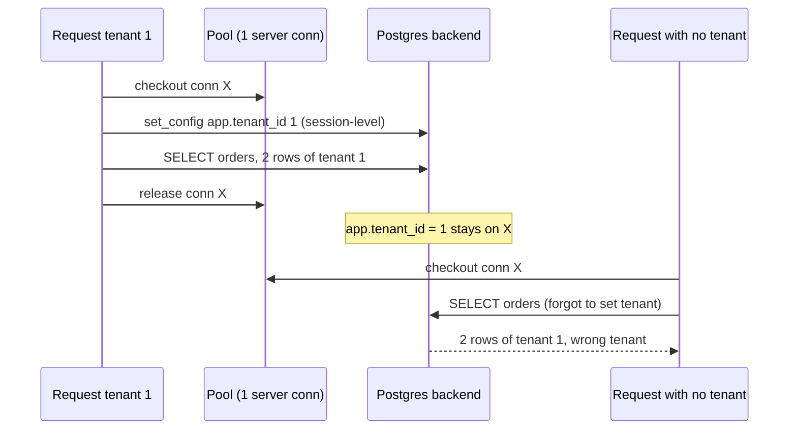
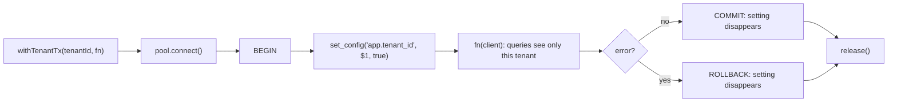

## Bối cảnh & vấn đề

Team đã làm đúng những gì bài trước khuyên: `tenant_id` ở mọi bảng, repository bắt buộc tenant, composite FK. Nhưng codebase có 400 câu SQL, vài chục script vận hành, một service reporting do team khác viết, và một công cụ admin nội bộ viết vội. Không ai đảm bảo được mọi câu đều có `WHERE tenant_id = ?`. Bạn muốn một lớp nằm **dưới** mọi code: kể cả khi ai đó viết `SELECT * FROM orders`, database vẫn chỉ trả dòng của tenant hiện tại.

Đó là **Row-Level Security** (RLS). Nhưng RLS có những cái bẫy khiến nhiều team tin rằng mình được bảo vệ trong khi không phải. Một incident điển hình: team bật RLS, viết policy, test thấy chạy đúng. Rồi service reporting (kết nối bằng role đã chạy migration, tức **owner** của bảng) trả về dữ liệu của mọi tenant qua một view:

```sql
-- migration run as role app_owner (table owner)
ALTER TABLE orders ENABLE ROW LEVEL SECURITY;
CREATE POLICY p ON orders USING (tenant_id = current_setting('app.tenant_id')::bigint);
CREATE VIEW order_summary AS
  SELECT tenant_id, date_trunc('day', created_at) d, sum(total) FROM orders GROUP BY 1, 2;
```

```ts
// reporting service connects as app_owner
await db.query('SELECT * FROM order_summary');
```

Bài này dựng RLS từ đầu trên PostgreSQL 18.6, chạy từng kịch bản bypass để thấy tận mắt, và xây wrapper `withTenantTx` an toàn với connection pool. Bài sau ([RLS ở production](/tracks/multi-tenancy/learn/rls-production)) nói về hiệu năng, rollout và SQL Server.

## Khái niệm

### RLS là gì

**Row-Level Security** là tính năng cho phép gắn **policy** vào một bảng: một biểu thức boolean mà Postgres tự động thêm vào mọi câu lệnh truy cập bảng đó. Với `SELECT`, `UPDATE`, `DELETE`, dòng nào làm biểu thức sai thì **như không tồn tại**: không trả về, không bị sửa, không bị xoá, và không có lỗi nào. Với `INSERT` và giá trị mới của `UPDATE`, dòng vi phạm bị **từ chối bằng lỗi**.

Về cơ chế, policy được chèn vào query ở giai đoạn **rewriter**, trước planner (xem [Query processing](/tracks/sql-postgres/learn/query-processing)). Planner nhìn thấy điều kiện policy như một điều kiện `WHERE` được đánh dấu "security barrier", nên có thể dùng index cho nó. Đây là lý do RLS hấp dẫn cho mô hình pool: **quên `WHERE tenant_id` trong code không còn làm leak**, vì DB đã thêm nó.

```sql
ALTER TABLE shop.orders ENABLE ROW LEVEL SECURITY;
CREATE POLICY tenant_isolation ON shop.orders
  USING (tenant_id = nullif(current_setting('app.tenant_id', true), '')::bigint)
  WITH CHECK (tenant_id = nullif(current_setting('app.tenant_id', true), '')::bigint);
```

**Interview angle:** câu mở đầu thường là "RLS là gì và vì sao hấp dẫn cho pooled multi-tenancy"; trả lời bằng "lớp phòng thủ ở DB, bảo vệ cả raw SQL" và nhắc ngay rằng nó không bảo vệ cache/search/file.

### ENABLE, FORCE và default deny

`ALTER TABLE ... ENABLE ROW LEVEL SECURITY` bật RLS cho bảng. Nếu bảng bật RLS mà **không có policy nào** áp dụng cho role, Postgres dùng **default deny**: không thấy dòng nào, không ghi được dòng nào. Điều này an toàn: bật RLS trước, viết policy sau, không bao giờ có khoảng hở.

Nhưng `ENABLE` **không áp dụng cho owner của bảng**. Owner (role tạo bảng, thường là role chạy migration) bỏ qua RLS trừ khi bảng có thêm `ALTER TABLE ... FORCE ROW LEVEL SECURITY`. Superuser và role có thuộc tính `BYPASSRLS` thì **luôn** bỏ qua, kể cả khi có `FORCE`.

```sql
ALTER TABLE shop.orders FORCE ROW LEVEL SECURITY;
SELECT relname, relrowsecurity, relforcerowsecurity FROM pg_class WHERE relname = 'orders';
```

```text
 relname | relrowsecurity | relforcerowsecurity
---------+----------------+---------------------
 orders  | t              | t
```

**Interview angle:** redFlag kinh điển là "bật RLS rồi thì không ai thấy dòng của tenant khác". Đáp án đúng liệt kê superuser, `BYPASSRLS`, owner (khi chưa `FORCE`).

### USING và WITH CHECK

Một policy có hai biểu thức. **`USING`** áp dụng cho dòng **đang có trong bảng**: dòng nào thoả thì được thấy (`SELECT`), được chọn để sửa hoặc xoá (`UPDATE`, `DELETE`). **`WITH CHECK`** áp dụng cho dòng **sắp được ghi**: dòng mới của `INSERT`, và giá trị sau khi sửa của `UPDATE`. Không thoả `WITH CHECK` thì câu lệnh lỗi.

Tách hai biểu thức vì chúng bảo vệ hai thứ khác nhau. `USING` chặn đọc chéo. `WITH CHECK` chặn **ghi chéo**: insert dòng mang tenant khác, hoặc update `tenant_id` để "chuyển" dòng sang tenant khác. Nếu một policy `FOR ALL` chỉ khai báo `USING`, Postgres dùng chính biểu thức đó làm `WITH CHECK`. Viết cả hai tường minh giúp người đọc không phải nhớ quy tắc này.

**Interview angle:** câu "giải thích USING vs WITH CHECK" cần ví dụ cụ thể: `UPDATE orders SET tenant_id = 2` bị `WITH CHECK` chặn, không phải `USING`.

### Truyền tenant vào DB: custom setting và `set_config`

Policy cần biết "tenant hiện tại là ai". Cách phổ biến là **custom configuration parameter** (GUC) có tiền tố, như `app.tenant_id`: app đặt giá trị, policy đọc bằng `current_setting('app.tenant_id', true)`. Tham số thứ hai `true` là **missing_ok**: nếu setting chưa từng được định nghĩa trong session, hàm trả `NULL` thay vì báo lỗi `unrecognized configuration parameter`.

Có hai cách đặt giá trị. `SET app.tenant_id = '42'` hay `set_config('app.tenant_id', '42', false)` là **session-level**: giá trị sống tới khi connection đóng hoặc bị đặt lại. `SET LOCAL` hay `set_config('app.tenant_id', '42', true)` là **transaction-local**: giá trị tự biến mất khi `COMMIT` hoặc `ROLLBACK`. Với connection pool, chỉ bản local là an toàn; lý do ở phần Cơ chế. `set_config` tiện hơn `SET LOCAL` vì nhận tham số bind (`$1`), tránh ghép chuỗi SQL.

**Interview angle:** follow-up "vì sao `true` (is_local) trong `set_config` quan trọng khi dùng pool?" là câu then chốt của cả chủ đề.

### Bẫy chuỗi rỗng của `current_setting`

Một chi tiết mà nhiều bài viết bỏ qua, và thí nghiệm dưới cho thấy rõ: `current_setting('app.tenant_id', true)` chỉ trả `NULL` khi setting **chưa từng được định nghĩa** trong session. Sau khi một transaction trước đó đã `set_config(..., true)` rồi kết thúc, setting vẫn **được định nghĩa** trong session nhưng với giá trị **chuỗi rỗng `''`**. Khi đó `''::bigint` báo lỗi `invalid input syntax for type bigint: ""`.

Trên connection pool, connection gần như luôn "đã từng được dùng", nên policy `current_setting(...)::bigint` sẽ **báo lỗi** (không phải trả 0 dòng) mỗi khi code quên đặt tenant. Kết quả vẫn là fail closed, nhưng thành lỗi 500 thay vì kết quả rỗng, và hành vi khác nhau giữa connection mới và cũ làm test khó hiểu. Cách viết nhất quán là `nullif(current_setting('app.tenant_id', true), '')::bigint`: cả hai trường hợp đều thành `NULL`, so sánh `tenant_id = NULL` luôn không đúng, nên không thấy dòng nào.

**Interview angle:** biết hành vi `''` sau lần set đầu tiên là dấu hiệu bạn đã vận hành RLS thật với pool, không chỉ đọc tutorial.

### Ai bypass RLS và những đường bypass không hiển nhiên

Danh sách đầy đủ, mỗi mục đều được chạy thật ở phần Ví dụ:

- **Superuser**: luôn bypass.
- **Role có `BYPASSRLS`**: luôn bypass; thường dùng cho role backup hoặc reporting có chủ đích.
- **Table owner**: bypass nếu bảng chỉ `ENABLE` mà không `FORCE`.
- **View**: mặc định view chạy với quyền của **owner của view** khi truy cập bảng bên dưới. Nếu owner của view là owner của bảng (thường vậy, vì cùng migration tạo ra), truy vấn qua view bypass RLS dù người gọi là role app thường. Từ PostgreSQL 15 có `CREATE VIEW ... WITH (security_invoker = true)` để view chạy với quyền của **người gọi**.
- **Hàm `SECURITY DEFINER`**: chạy với quyền của người tạo hàm; nếu đó là owner bảng, hàm thấy mọi dòng.
- **Unique và FK check**: không qua RLS (covert channel, bài 4).
- **Kênh ngoài SQL thường**: `pg_dump` bằng role có quyền, replication vật lý, logical decoding, backup: đều chứa dữ liệu mọi tenant. RLS bảo vệ query, không bảo vệ file.

**Interview angle:** interviewer muốn ít nhất owner + view + superuser/BYPASSRLS; nhắc thêm `security_invoker` (PG 15+) và `SECURITY DEFINER` cho thấy chiều sâu.

## Cơ chế hoạt động

Đây là lý do `set_config(..., false)` (session-level) nguy hiểm với pool. Một connection vật lý phục vụ nhiều request nối tiếp nhau:



Setting session-level gắn với **backend process** của connection X, không gắn với request. Khi request A trả connection về pool, giá trị vẫn nằm đó. Request B (một bug quên đặt tenant, hoặc một job chạy "system") nhận X và **thừa hưởng tenant 1**. Nếu đặt tenant là lỗi fail closed, RLS lẽ ra phải trả 0 dòng; ở đây nó trả dữ liệu của tenant 1 cho một request không phải của tenant 1. Cùng cơ chế xảy ra với PgBouncer transaction mode, nơi mỗi transaction có thể rơi vào một server connection khác (chi tiết ở [Connections & PgBouncer](/tracks/sql-postgres/learn/connection-pooling)).

Cách đúng là mọi truy cập bảng tenant nằm trong **một transaction**, và tenant được đặt **local** ở đầu transaction:



Vì setting chết cùng transaction, connection trả về pool luôn "sạch". Query autocommit đơn lẻ (không `BEGIN`) chạy trong transaction ngầm của riêng nó, nên một `set_config(..., true)` gửi riêng lẻ sẽ hết hiệu lực ngay sau câu đó; đó là lý do phải bọc transaction tường minh.

## Ví dụ thực tế

### Dựng RLS và kiểm tra USING, WITH CHECK (chạy thật)

Role: `app_owner` (NOLOGIN, sở hữu bảng, chạy migration), `app_user` (LOGIN, role của app, không phải owner, không `BYPASSRLS`). Dữ liệu: tenant 1 có 2 đơn, tenant 2 có 2 đơn. Policy dạng `current_setting(...)::bigint` (chưa có `nullif`) để thấy cả hai hành vi.

```sql
\echo '--- owner, ENABLE only, no tenant set'
SET ROLE app_owner;  SELECT count(*) FROM shop.orders;  RESET ROLE;
\echo '--- app_user, no tenant set'
SET ROLE app_user;   SELECT count(*) FROM shop.orders;
\echo '--- app_user, tenant 1 local'
BEGIN;
SELECT set_config('app.tenant_id', '1', true);
SELECT tenant_id, id, order_no FROM shop.orders ORDER BY id;
SAVEPOINT s;
INSERT INTO shop.orders (tenant_id, order_no, total_minor) VALUES (2, 9999, 1);
ROLLBACK TO s;
UPDATE shop.orders SET tenant_id = 2 WHERE id = 1;
ROLLBACK;
```

```text
--- owner, ENABLE only, no tenant set
 count
-------
     4
--- app_user, no tenant set
 count
-------
     0
--- app_user, tenant 1 local
 tenant_id | id | order_no
-----------+----+----------
         1 |  1 |     1001
         1 |  2 |     1002
ERROR:  new row violates row-level security policy for table "orders"
ERROR:  new row violates row-level security policy for table "orders"
```

Owner thấy cả 4 dòng dù chưa đặt tenant: `ENABLE` không áp dụng cho owner. `app_user` chưa đặt tenant thấy 0 dòng (setting chưa định nghĩa → `NULL`). Với tenant 1, chỉ thấy 2 dòng của tenant 1. INSERT dòng tenant 2 và UPDATE đổi `tenant_id` sang 2 đều bị `WITH CHECK` từ chối.

### Bẫy chuỗi rỗng (chạy thật)

```sql
SET ROLE app_user;
SELECT current_setting('app.tenant_id', true) IS NULL AS is_null;   -- fresh session
SELECT count(*) FROM shop.orders;
BEGIN; SELECT set_config('app.tenant_id', '1', true); COMMIT;         -- a previous transaction
SELECT current_setting('app.tenant_id', true) IS NULL AS is_null,
       quote_literal(current_setting('app.tenant_id', true)) AS val;
SELECT count(*) FROM shop.orders;
```

```text
 is_null
---------
 t
 count
-------
     0
 is_null | val
---------+-----
 f       | ''
ERROR:  invalid input syntax for type bigint: ""
```

Cùng một câu `SELECT count(*)`, cùng role, không đặt tenant: connection mới trả 0 dòng, connection đã từng dùng báo lỗi. Sau khi đổi policy sang `nullif(current_setting('app.tenant_id', true), '')::bigint`, cả hai trường hợp đều trả 0 dòng. Còn nếu bỏ hẳn `missing_ok` (`current_setting('app.tenant_id')`), connection mới báo `ERROR: unrecognized configuration parameter "app.tenant_id"`. Chọn có chủ đích: lỗi ồn ào dễ phát hiện bug quên đặt tenant, còn 0 dòng thì êm nhưng có thể che bug. Nhiều team chọn `nullif` trong policy và **kiểm tra ở tầng app** rằng tenant luôn được đặt (wrapper ném lỗi).

### Các đường bypass: view, SECURITY DEFINER, FORCE, BYPASSRLS (chạy thật)

```sql
SET ROLE app_owner;
CREATE VIEW shop.order_summary AS
  SELECT tenant_id, count(*) AS n, sum(total_minor) AS revenue FROM shop.orders GROUP BY tenant_id;
CREATE VIEW shop.order_summary_inv WITH (security_invoker = true) AS
  SELECT tenant_id, count(*) AS n, sum(total_minor) AS revenue FROM shop.orders GROUP BY tenant_id;
CREATE FUNCTION shop.all_orders_count() RETURNS bigint LANGUAGE sql SECURITY DEFINER
  AS $$ SELECT count(*) FROM shop.orders $$;
-- grants to app_user omitted
RESET ROLE;

SET ROLE app_user;
BEGIN; SELECT set_config('app.tenant_id', '1', true);
SELECT * FROM shop.order_summary ORDER BY tenant_id;       -- default view
SELECT * FROM shop.order_summary_inv ORDER BY tenant_id;   -- security_invoker view
SELECT shop.all_orders_count();                            -- SECURITY DEFINER
COMMIT;
```

```text
 tenant_id | n | revenue          <- default view: runs as the view owner
-----------+---+---------
         1 | 2 |  249000
         2 | 2 |    5500

 tenant_id | n | revenue          <- security_invoker view: runs as app_user
-----------+---+---------
         1 | 2 |  249000

 all_orders_count                 <- SECURITY DEFINER function owned by the table owner
------------------
                4
```

Đây chính là incident ở đầu bài: `app_user` là role đúng, tenant được đặt đúng, nhưng view mặc định trả doanh thu của tenant 2. Sau `ALTER TABLE shop.orders FORCE ROW LEVEL SECURITY`, owner cũng chịu policy: owner không đặt tenant thấy `0` dòng, và view mặc định (chạy với quyền owner nhưng đọc setting của session hiện tại) chỉ còn trả dòng của tenant 1. Superuser và role `BYPASSRLS` vẫn thấy đủ 4 dòng:

```text
 superuser_count      bypassrls_count
-----------------    -----------------
               4                    4

  rolname  | rolsuper | rolbypassrls
-----------+----------+--------------
 app_owner | f        | f
 app_user  | f        | f
 postgres  | t        | t
 reporting | f        | t
```

Bản sửa cho incident: service reporting kết nối bằng role riêng không phải owner; bảng có `FORCE ROW LEVEL SECURITY`; mọi view tạo mới dùng `security_invoker = true`; và test tự động chạy bằng đúng role của app. Nếu platform thật sự cần tổng hợp xuyên tenant (dashboard nội bộ), dùng một role `BYPASSRLS` **riêng**, chỉ có quyền `SELECT`, chỉ kết nối từ service nội bộ, có audit, hoặc tốt hơn là đọc từ data warehouse đã tách khỏi đường production.

Muốn chứng minh role app không bypass được, viết test chạy ở CI:

```sql
-- run as the application role, in CI
SELECT rolsuper, rolbypassrls FROM pg_roles WHERE rolname = current_user;   -- expect f, f
SELECT c.relname FROM pg_class c JOIN pg_namespace n ON n.oid = c.relnamespace
WHERE n.nspname = 'shop' AND c.relkind = 'r'
  AND (NOT c.relrowsecurity OR NOT c.relforcerowsecurity)
  AND c.relname NOT IN ('tenants', 'currencies');                           -- expect 0 rows
SELECT count(*) FROM pg_class c WHERE c.relowner = (SELECT oid FROM pg_roles WHERE rolname = current_user); -- expect 0
```

### `withTenantTx` với pool, và rò rỉ khi dùng session-level (chạy thật)

node-postgres 8.23 với `max: 1` để ép mọi request dùng chung một connection, kết nối bằng `app_user`:

```ts
async function badRequest(tenantId: string | null) {
  const c = await pool.connect();
  try {
    if (tenantId) await c.query(`SELECT set_config('app.tenant_id', $1, false)`, [tenantId]);   // session-level
    const r = await c.query('SELECT tenant_id, order_no FROM shop.orders ORDER BY id');
    return r.rows.map((x) => `${x.tenant_id}/${x.order_no}`);
  } finally { c.release(); }
}

async function withTenantTx<T>(tenantId: string, fn: (c: pg.PoolClient) => Promise<T>): Promise<T> {
  const c = await pool.connect();
  try {
    await c.query('BEGIN');
    await c.query(`SELECT set_config('app.tenant_id', $1, true)`, [tenantId]);                 // local
    const r = await fn(c);
    await c.query('COMMIT');
    return r;
  } catch (e) { await c.query('ROLLBACK'); throw e; }
  finally { c.release(); }
}
```

```text
A (tenant 1, session set): [ '1/1001', '1/1002' ]
B (forgot to set tenant):   [ '1/1001', '1/1002' ]
C (tenant 2, local):        [ '2/1001', '2/1002' ]
D (no tx, after C):         { n: 0 }
```

Request B không đặt tenant nhưng nhận dữ liệu tenant 1, thừa hưởng từ A. Với `withTenantTx`, sau khi C commit, query kế tiếp không có tenant thấy 0 dòng. Trong code thật, `withTenantTx` lấy tenant từ context (bài 3) thay vì nhận tham số tự do, và repository của bảng tenant chỉ chấp nhận `PoolClient` đến từ wrapper này.

## Trade-offs & lựa chọn thay thế

| Cách truyền tenant vào policy | Ưu | Nhược |
| --- | --- | --- |
| `set_config('app.tenant_id', $1, true)` trong transaction | An toàn với mọi pooler, bind parameter | Phải bọc transaction, thêm round-trip |
| `SET app.tenant_id` session-level | Một lần mỗi connection | Rò sang request khác qua pool/PgBouncer |
| Một DB role mỗi tenant, policy dùng `current_user` | Không cần setting, rõ ràng | Hàng nghìn role; PgBouncer pool theo cặp db/user nên pool bùng nổ |
| `SET ROLE tenant_x` trong transaction (`SET LOCAL ROLE`) | Dùng được GRANT theo tenant | Quản lý nhiều role, vẫn cần transaction |
| Không RLS, chỉ filter ở app | Đơn giản, dễ debug | Không bảo vệ raw SQL/tool nội bộ |

| Cách viết điều kiện trong policy | Tenant chưa đặt, connection mới | Tenant chưa đặt, connection đã dùng |
| --- | --- | --- |
| `current_setting('app.tenant_id')::bigint` | ERROR unrecognized parameter | ERROR invalid input `""` |
| `current_setting('app.tenant_id', true)::bigint` | 0 dòng | ERROR invalid input `""` |
| `nullif(current_setting('app.tenant_id', true), '')::bigint` | 0 dòng | 0 dòng |

Lựa chọn phổ biến nhất và an toàn nhất cho Node.js + pool: một role app duy nhất (không owner, không `BYPASSRLS`), tenant truyền bằng `set_config(..., true)` trong `withTenantTx`, policy dùng `nullif(...)`, và wrapper ở app ném lỗi nếu không có tenant context. Mô hình role-per-tenant chỉ hợp khi số tenant nhỏ và bạn cần GRANT khác nhau theo tenant.

## Edge cases & failure modes

- **Policy chồng nhau**: nhiều policy `PERMISSIVE` cho cùng lệnh được **OR** với nhau; một policy "admin thấy hết" viết lỏng sẽ mở cửa cho mọi người. Dùng `AS RESTRICTIVE` cho điều kiện tenant (AND với các policy khác), và giới hạn policy theo `TO role`.
- **Policy theo lệnh**: `CREATE POLICY ... FOR SELECT` chỉ áp dụng cho SELECT; nếu không có policy cho `UPDATE`, default deny chặn UPDATE. Đọc kỹ ma trận lệnh trong tài liệu `CREATE POLICY` (ví dụ UPDATE cũng cần quyền thấy dòng qua policy SELECT khi có `RETURNING` hoặc WHERE đọc cột).
- **`TRUNCATE` không chịu RLS**: role có quyền `TRUNCATE` xoá sạch dữ liệu mọi tenant. Không GRANT `TRUNCATE` cho role app.
- **`COPY ... TO`**: chịu RLS, nhưng `COPY` bằng superuser trong script vận hành thì không. Script export theo tenant phải chạy bằng role app với tenant đặt đúng.
- **Transaction dài**: `withTenantTx` giữ connection suốt thời gian `fn` chạy; gọi HTTP bên ngoài trong đó làm cạn pool. Kéo network call ra ngoài.
- **Autocommit từ ORM**: ORM gửi query ngoài transaction của bạn (lazy loading, query song song trên connection khác). Mọi query bảng tenant phải đi qua client của wrapper.
- **Superuser trong migration seed**: seed dữ liệu bằng superuser bỏ qua `WITH CHECK`, có thể chèn dòng sai tenant mà không ai biết. Seed bằng role app với tenant đặt đúng.

## Pitfalls

- ❌ App kết nối bằng role đã chạy migration (owner) → ✅ role app riêng, không owner, không `BYPASSRLS`, và `FORCE ROW LEVEL SECURITY`, vì owner bỏ qua `ENABLE`.
- ❌ `SET app.tenant_id` hoặc `set_config(..., false)` với pool → ✅ `set_config(..., true)` trong transaction, vì session state rò sang request khác (chạy thật: request không có tenant nhận dữ liệu tenant 1).
- ❌ `current_setting('app.tenant_id', true)::bigint` và tin rằng chưa đặt thì trả `NULL` → ✅ `nullif(..., '')`, vì sau lần set đầu tiên giá trị là `''`.
- ❌ View mặc định trên bảng có RLS → ✅ `WITH (security_invoker = true)` (PG 15+) hoặc owner view không phải owner bảng, vì view chạy với quyền owner.
- ❌ Chỉ có `USING` mà nghĩ đã chặn ghi → ✅ viết cả `WITH CHECK` tường minh và test UPDATE đổi `tenant_id`.
- ❌ "Có RLS rồi, bỏ filter ở app" → ✅ giữ filter ở repository, vì RLS không bảo vệ cache, search, file, và app cần filter để trả 404 đúng và dùng index tốt.
- ❌ Test RLS bằng superuser trong CI → ✅ test bằng đúng role của app, vì superuser luôn bypass.

## Tóm tắt

- RLS thêm điều kiện policy vào mọi câu lệnh; `USING` lọc dòng hiện có, `WITH CHECK` chặn dòng mới hoặc giá trị sau UPDATE.
- `ENABLE` không áp dụng cho owner; cần `FORCE`. Superuser và `BYPASSRLS` luôn bypass. Bật RLS mà không có policy = default deny.
- Tenant truyền qua `set_config('app.tenant_id', $1, true)` **trong transaction**; session-level làm lộ dữ liệu qua pool (đã tái hiện).
- `current_setting(..., true)` trả `NULL` chỉ khi chưa từng đặt; sau đó là `''` và `::bigint` báo lỗi. Dùng `nullif(..., '')`.
- View mặc định và hàm `SECURITY DEFINER` chạy với quyền owner nên bypass RLS; dùng `security_invoker = true` (PG 15+).
- Unique/FK, `TRUNCATE`, backup, replication nằm ngoài RLS.
- CI kiểm tra: role app không super/bypass, mọi bảng tenant có `relrowsecurity` và `relforcerowsecurity`, test chạy bằng role app.
