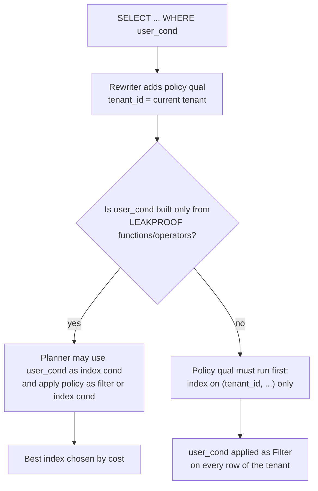
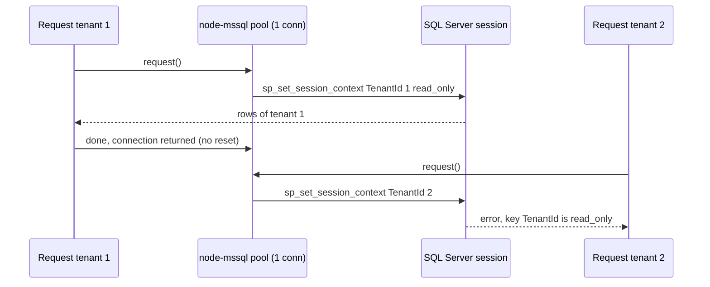

## Bối cảnh & vấn đề

Sau khi bật RLS (bài trước), ba câu hỏi xuất hiện trong buổi review kiến trúc. Team performance hỏi: "RLS thêm điều kiện vào mọi query, vậy nó làm chậm bao nhiêu?". Một bạn đề xuất policy "xịn hơn": user chỉ thấy dữ liệu của những tenant họ là member, bằng một subquery vào bảng `memberships`, và p99 của trang dashboard tăng từ 8 ms lên 40 ms. Một bạn khác thêm tìm kiếm theo `lower(name)` có expression index, và index đó không bao giờ được dùng khi chạy bằng role app, dù `EXPLAIN` bằng superuser cho thấy index scan đẹp.

Câu hỏi thứ hai đến từ tech lead: codebase 300 endpoint đang chạy production không có RLS, làm sao bật RLS mà không có đêm nào mọi query trả 0 dòng? Và câu thứ ba, từ một service viết bằng Node.js trên SQL Server: SQL Server có RLS không, và truyền tenant thế nào?

Bài này trả lời bằng số đo thật: EXPLAIN ANALYZE trên bảng 2 triệu dòng với PostgreSQL 18.6, đo round-trip của wrapper transaction, và chạy RLS của SQL Server 2022 qua node-mssql. Nền tảng về RLS ở [bài 5](/tracks/multi-tenancy/learn/postgres-rls); đọc plan ở [Planner & EXPLAIN](/tracks/sql-postgres/learn/planner-explain).

## Khái niệm

### Policy là một điều kiện WHERE có "security barrier"

Planner xử lý điều kiện policy gần giống điều kiện `WHERE` bạn tự viết: nếu nó so sánh cột với một giá trị ổn định trong câu lệnh (`tenant_id = <biểu thức STABLE>`), planner dùng nó làm **index condition** trên index bắt đầu bằng `tenant_id`. Hàm `current_setting` là `STABLE` (không đổi trong một câu lệnh), nên `tenant_id = nullif(current_setting(...), '')::bigint` được tính một lần và đưa vào index scan. Đó là lý do policy đơn giản gần như miễn phí.

Khác biệt nằm ở **thứ tự đánh giá**. Postgres phải đảm bảo điều kiện của người dùng không được chạy trên dòng mà policy chưa cho phép, nếu điều kiện đó có thể **làm lộ giá trị** (ví dụ một hàm ghi giá trị tham số vào log, hoặc ném lỗi chứa giá trị). Vì vậy điều kiện policy có mức ưu tiên bảo mật cao hơn, và điều kiện của user chỉ được đẩy lên trước (hoặc dùng làm index condition) nếu nó chỉ gồm hàm và toán tử **LEAKPROOF**.

**Interview angle:** giải thích "policy là điều kiện có security barrier, điều kiện user chỉ được ưu tiên nếu leakproof" là cốt lõi của câu hỏi hiệu năng RLS.

### LEAKPROOF

**`LEAKPROOF`** là thuộc tính của một hàm, cam kết hàm **không để lộ thông tin về tham số** qua bất kỳ kênh nào ngoài giá trị trả về: không ném lỗi phụ thuộc vào giá trị, không ghi log. Chỉ superuser mới được đánh dấu hàm `LEAKPROOF`, vì đánh dấu sai là mở lỗ bảo mật. Các toán tử so sánh cơ bản như `int8eq` (bigint `=`) và `texteq` (text `=`) là leakproof; nhiều hàm quen thuộc thì **không**: `lower()`, `LIKE` (`textlike`), phần lớn hàm do bạn tự viết.

```sql
SELECT proname, proleakproof FROM pg_proc WHERE proname IN ('texteq', 'int8eq', 'lower', 'textlike') ORDER BY 1;
```

```text
 proname  | proleakproof
----------+--------------
 int8eq   | t
 lower    | f
 lower    | f
 lower    | f
 textlike | f
 texteq   | t
```

Hệ quả thực tế: `WHERE lower(name) = $1` hoặc `WHERE name LIKE 'abc%'` dưới RLS không dùng được index riêng cho điều kiện đó trước policy; planner phải lọc theo policy trước (dùng index tenant), rồi áp điều kiện của bạn như một filter trên các dòng của tenant. Với tenant nhỏ thì không sao; với tenant 2 triệu dòng, đó là khác biệt giữa 0,1 ms và vài trăm ms.

**Interview angle:** follow-up "LEAKPROOF là gì và vì sao ảnh hưởng plan RLS?" là câu phân loại senior; nhắc ví dụ `lower()` hoặc `LIKE` không leakproof là điểm cộng.

### Round-trip của wrapper transaction

Để đặt tenant an toàn với pool, mỗi unit of work tốn thêm round-trip: `BEGIN`, `set_config`, (các query), `COMMIT`. Với query đơn lẻ, đó là 4 round-trip thay vì 1. Trên cùng máy, mỗi round-trip là vài chục micro giây; qua mạng giữa các AZ, 0,3–1 ms mỗi lần. Có vài cách giảm: gộp `BEGIN` và `set_config` vào **một simple query nhiều câu lệnh** (tenant id phải được validate là số nguyên trước khi ghép chuỗi, vì simple query không nhận bind parameter); gom nhiều query của một request vào cùng một transaction; hoặc dùng pipeline mode của driver (nếu có).

**Interview angle:** câu "chi phí round-trip của pattern này và cách giảm" muốn nghe con số và ít nhất một cách gộp, kèm lưu ý an toàn khi ghép chuỗi.

### SQL Server: security policy, predicate và SESSION_CONTEXT

SQL Server có RLS từ bản 2016, cấu trúc khác Postgres. Bạn viết một **inline table-valued function** (hàm trả về bảng, `WITH SCHEMABINDING`) làm **predicate**: trả về một dòng nếu được phép, không trả gì nếu không. Rồi `CREATE SECURITY POLICY` gắn predicate vào bảng dưới hai dạng: **FILTER PREDICATE** lọc dòng khi đọc (tương đương `USING`), và **BLOCK PREDICATE** chặn ghi (`AFTER INSERT`, `AFTER UPDATE`, `BEFORE UPDATE`, `BEFORE DELETE`), tương đương `WITH CHECK` nhưng chi tiết hơn theo từng thao tác.

Tenant được truyền qua **`sp_set_session_context`**: một kho key–value gắn với **session** (connection), đọc bằng `SESSION_CONTEXT(N'TenantId')`. Tham số `@read_only = 1` khoá key cho tới hết session, để code sau không đổi được tenant. Khác Postgres ở hai điểm quan trọng: RLS của SQL Server **áp dụng cho cả sysadmin và db_owner** (không có "owner bypass" tự động; muốn cho admin thấy hết thì phải viết vào predicate, ví dụ `OR IS_MEMBER('db_owner') = 1`), nhưng người có quyền `ALTER ANY SECURITY POLICY` có thể tắt policy. Và session context là **session-level**, nên hành vi với connection pool phụ thuộc vào việc driver có reset connection khi tái sử dụng hay không.

**Interview angle:** interviewer hỏi "SQL Server RLS thế nào và truyền tenant từ Node ra sao" muốn nghe FILTER vs BLOCK predicate, `SESSION_CONTEXT`, và câu hỏi về reset connection trong pool.

## Cơ chế hoạt động

Sơ đồ dưới cho thấy planner quyết định dùng index nào khi có policy và điều kiện của user:



Điều kiện policy luôn được áp dụng; câu hỏi chỉ là điều kiện của user có được "chen lên trước" hay không. Nếu được (leakproof), planner tự do chọn index tốt nhất cho điều kiện user, như expression index trên `lower(name)`. Nếu không, planner buộc phải đi qua policy trước, tức index `(tenant_id, ...)`, rồi lọc từng dòng của tenant bằng điều kiện user. Policy dạng subquery (`tenant_id IN (SELECT ... FROM memberships ...)`) còn tệ hơn: nó không còn là `tenant_id = <hằng>`, nên planner không dùng được nó làm index condition trên `(tenant_id, created_at)` một cách hiệu quả.

Với SQL Server, đường đi của tenant qua connection pool trong node-mssql như sau (đã đo thật ở phần Ví dụ):



ADO.NET (C#) gửi `sp_reset_connection` khi lấy connection từ pool, nên session context được xoá và `@read_only = 1` an toàn: tài liệu Microsoft minh hoạ đúng pattern này. node-mssql (tarn + tedious) trong thử nghiệm của bài **không** reset connection khi trả về pool, nên context còn nguyên cho request kế tiếp; với `@read_only = 1`, request kế tiếp của tenant khác thậm chí không đặt lại được.

## Ví dụ thực tế

### Ba policy, ba plan (chạy thật, PostgreSQL 18.6)

Bảng `shop.events`: 2 triệu dòng, 1.000 tenant (2.000 dòng mỗi tenant), index `(tenant_id, created_at)`. Chạy bằng `app_user`, tenant 42 đặt bằng `set_config(..., true)`.

**A. Policy đơn giản**, query 24 giờ gần nhất:

```sql
CREATE POLICY simple ON shop.events USING (tenant_id = nullif(current_setting('app.tenant_id', true), '')::bigint);
EXPLAIN (ANALYZE, COSTS OFF, TIMING OFF, SUMMARY ON)
SELECT count(*) FROM shop.events WHERE created_at > now() - interval '1 day';
```

```text
 Aggregate (actual rows=1.00 loops=1)
   ->  Bitmap Heap Scan on events (actual rows=40.00 loops=1)
         Recheck Cond: ((tenant_id = (NULLIF(current_setting('app.tenant_id'::text, true), ''::text))::bigint) AND (created_at > (now() - '1 day'::interval)))
         ->  Bitmap Index Scan on events_tenant_created (actual rows=40.00 loops=1)
               Index Cond: ((tenant_id = (NULLIF(current_setting('app.tenant_id'::text, true), ''::text))::bigint) AND (created_at > (now() - '1 day'::interval)))
 Execution Time: 0.540 ms
```

Điều kiện policy và điều kiện thời gian cùng nằm trong `Index Cond`: y hệt query viết tay `WHERE tenant_id = 42 AND created_at > ...`. Không cần bọc `current_setting` trong subselect `(SELECT current_setting(...))` ở đây, vì hàm STABLE đã được tính một lần; mẹo subselect có ích khi điều kiện rơi vào `Filter` và hàm bị gọi lại trên từng dòng.

**C. Policy qua membership subquery**, cùng query:

```sql
CREATE POLICY via_membership ON shop.events USING (
  tenant_id IN (SELECT m.tenant_id FROM shop.memberships m
                WHERE m.user_id = nullif(current_setting('app.user_id', true), '')::bigint));
```

```text
 Aggregate (actual rows=1.00 loops=1)
   ->  Bitmap Heap Scan on events (actual rows=40.00 loops=1)
         Recheck Cond: (created_at > (now() - '1 day'::interval))
         Filter: (ANY (tenant_id = (hashed SubPlan 1).col1))
         Rows Removed by Filter: 28760
         ->  Bitmap Index Scan on events_tenant_created (actual rows=28800.00 loops=1)
               Index Cond: (created_at > (now() - '1 day'::interval))
               Index Searches: 1001
         SubPlan 1
           ->  Index Only Scan using memberships_pkey on memberships m (actual rows=1.00 loops=1)
 Execution Time: 28.181 ms
```

Cùng kết quả (40 dòng), nhưng planner quét khoảng thời gian của **mọi tenant** (28.800 dòng, 1.001 lần tìm trên index) rồi lọc bằng subplan: chậm hơn khoảng **50 lần**. Bài học: giữ policy ở dạng `tenant_id = <giá trị đã biết>`. Việc "user này có được vào tenant này không" nên được kiểm tra **một lần** ở app (hoặc ở một hàm lúc đặt context), rồi đặt `app.tenant_id` thành kết quả.

**D và E. Hàm không LEAKPROOF làm mất expression index.** Thêm expression index trên `shop.slow_lower(payload)` (một hàm plpgsql bọc `lower()`), rồi tìm một payload cụ thể của tenant 42:

```sql
EXPLAIN (ANALYZE, COSTS OFF, TIMING OFF, SUMMARY ON)
SELECT id FROM shop.events WHERE shop.slow_lower(payload) = 'd736bb10d83a904aefc1d6ce93dc54b8';
```

```text
-- D. function NOT LEAKPROOF (default)
 Bitmap Heap Scan on events (actual rows=1.00 loops=1)
   Recheck Cond: (tenant_id = (NULLIF(current_setting('app.tenant_id'::text, true), ''::text))::bigint)
   Filter: (shop.slow_lower(payload) = 'd736bb10d83a904aefc1d6ce93dc54b8'::text)
   Rows Removed by Filter: 1999
   ->  Bitmap Index Scan on events_tenant_created (actual rows=2000.00 loops=1)
 Execution Time: 4.441 ms

-- E. same function after ALTER FUNCTION ... LEAKPROOF (as superuser)
 Index Scan using events_lower_payload on events (actual rows=1.00 loops=1)
   Index Cond: (shop.slow_lower(payload) = 'd736bb10d83a904aefc1d6ce93dc54b8'::text)
   Filter: (tenant_id = (NULLIF(current_setting('app.tenant_id'::text, true), ''::text))::bigint)
 Execution Time: 0.095 ms
```

Ở D, planner không được phép chạy hàm trên dòng của tenant khác, nên phải đọc 2.000 dòng của tenant rồi lọc. Ở E, hàm được tin là không làm lộ dữ liệu, planner dùng expression index trước và kiểm tra policy sau: nhanh hơn khoảng 45 lần. Với tenant 2 triệu dòng thay vì 2.000, khoảng cách còn lớn hơn nhiều. Đừng đánh dấu LEAKPROOF bừa để lấy tốc độ: một hàm có thể ném lỗi chứa giá trị tham số là hàm **không** leakproof. Cách an toàn hơn là thiết kế index **bắt đầu bằng `tenant_id`**: `(tenant_id, lower(name))` phục vụ cả policy lẫn điều kiện, không cần leakproof.

### Round-trip của `withTenantTx` (chạy thật)

node-postgres 8.23, Postgres trong Docker trên cùng máy, 2.000 lần lặp mỗi kiểu:

```ts
await timeIt('plain query (no tenant, 1 RT):   ', () => pool.query(q));
await timeIt('withTenantTx (4 RT):             ', () => withTenantTx('1', (c) => c.query(q)));
await timeIt('BEGIN+set_config merged (3 RT):  ', async () => {
  const tenantId = 1; if (!Number.isSafeInteger(tenantId)) throw new Error('bad tenant');
  const c = await pool.connect();
  try {
    await c.query(`BEGIN; SELECT set_config('app.tenant_id', '${tenantId}', true)`);   // validated integer only
    await c.query(q); await c.query('COMMIT');
  } finally { c.release(); }
});
```

```text
plain query (no tenant, 1 RT):    0.433 ms/op
withTenantTx (4 RT):              1.235 ms/op
BEGIN+set_config merged (3 RT):   0.854 ms/op
```

Trên localhost, mỗi round-trip khoảng 0,3–0,4 ms (phần lớn là overhead của Docker networking và driver). Qua mạng thật, nhân số round-trip với RTT: ở 0,5 ms RTT, 4 round-trip là 2 ms mỗi unit of work. Với endpoint làm 5 query, gom vào một transaction thì chi phí phụ chỉ trả một lần. Trong đa số API, vài trăm micro giây này nhỏ hơn nhiều so với chi phí của một lần leak.

### RLS trên SQL Server 2022 qua node-mssql (chạy thật)

SQL Server 2022 (RTM-CU26) trong Docker, node-mssql 12.7.2 / tedious 20.0.0, pool `max: 1`:

```sql
CREATE FUNCTION sec.fn_tenant(@TenantId int) RETURNS TABLE WITH SCHEMABINDING AS
  RETURN SELECT 1 AS ok WHERE @TenantId = CAST(SESSION_CONTEXT(N'TenantId') AS int);
CREATE SECURITY POLICY sec.TenantPolicy
  ADD FILTER PREDICATE sec.fn_tenant(TenantId) ON dbo.Orders,
  ADD BLOCK PREDICATE sec.fn_tenant(TenantId) ON dbo.Orders AFTER INSERT,
  ADD BLOCK PREDICATE sec.fn_tenant(TenantId) ON dbo.Orders AFTER UPDATE
  WITH (STATE = ON);
```

```text
sa (sysadmin), no context   : [{"n":0}]
app_user, no context        : [{"n":0}]
app_user, TenantId=1        : [{"TenantId":1,"OrderNo":1001},{"TenantId":1,"OrderNo":1002}]
same pooled conn, next req  : [{"leftover":1,"n":2}]
insert other tenant         : ERROR The attempted operation failed because the target object 'shop.dbo.Orders' has a block predicate that conflicts with this operation. ...
update to other tenant      : ERROR The attempted operation failed because the target object 'shop.dbo.Orders' has a block predicate that conflicts with this operation. ...
read_only set, then change  : ERROR Cannot set key 'TenantId' in the session context. The key has been set as read_only for this session.
```

Đọc kết quả. Dòng đầu: `sa` là sysadmin nhưng vẫn thấy 0 dòng, khác hẳn superuser của Postgres. Dòng 4: request kế tiếp trên cùng connection **không đặt tenant** nhưng `SESSION_CONTEXT` vẫn là 1 và thấy 2 dòng của tenant 1, đúng lỗi rò session state như Postgres session-level. BLOCK predicate chặn cả insert sang tenant khác lẫn update đổi `TenantId`. Thí nghiệm thứ hai với hai request riêng trên pool:

```text
req1 tenant 1 read_only: [{"spid":73,"t":1}]
req2 tenant 2          : ERROR Cannot set key 'TenantId' in the session context. The key has been set as read_only for this session.
after tedious reset()  : [{"spid":73,"t":null}]
```

Cùng `spid` 73: node-mssql trả connection về pool mà không reset. Với `@read_only = 1`, request của tenant 2 hỏng. Chỉ khi gọi `reset()` của tedious (gửi yêu cầu reset connection tới server) thì context mới bị xoá. Cách làm an toàn trong Node: đặt `sp_set_session_context` **trong cùng batch hoặc transaction** với query, **không dùng `@read_only = 1`** trên connection pool dùng chung (hoặc reset connection mỗi lần mượn, chấp nhận chi phí), và đặt lại về `NULL` khi xong; wrapper tương tự `withTenantTx`. Chi tiết reset theo version driver nên kiểm tra lại khi nâng cấp (verify).

## Trade-offs & lựa chọn thay thế

| Tiêu chí | RLS ở DB | Filter ở app (repository/ORM) | Cả hai |
| --- | --- | --- | --- |
| Bắt raw SQL, script, tool nội bộ | Có | Không | Có |
| Trả 404 đúng, dùng index tốt | Có (0 dòng) | Có | Có |
| Debug "vì sao query trả 0 dòng?" | Khó hơn (điều kiện ẩn) | Dễ | Trung bình |
| Chi phí | Round-trip, quản lý role/setting | Gần như 0 | Cộng dồn |
| Bảo vệ cache, search, file, event | Không | Chỉ khi code đúng | Không (cần kênh phụ riêng) |
| Hợp với DB-per-tenant | Không cần | Không cần | Không cần |
| ORM hiểu policy | Không | Có | Có |

**Lập trường nên có** khi được hỏi "RLS hay filter ở app": RLS là lớp **bổ sung** (defense in depth), không thay thế authorization ở app. App vẫn phải filter để trả 404 đúng, để permission trong tenant hoạt động, và vì RLS không bảo vệ các kho dữ liệu khác. Không dùng RLS khi: mô hình là DB-per-tenant (đã cách ly bằng hạ tầng); DB không hỗ trợ tốt (một số engine, hoặc ORM/driver không cho kiểm soát transaction); team chưa có kỷ luật role và transaction (RLS với role owner tạo cảm giác an toàn giả, tệ hơn không có). Trong các trường hợp đó, tối thiểu phải có repository bắt buộc và test hai tenant tự động.

**Rollout RLS vào codebase lớn đang chạy** theo các bước, mỗi bước deploy riêng:

1. Tạo role app mới (không owner, không `BYPASSRLS`); chuyển app sang role đó; sửa mọi chỗ thiếu quyền. Chưa bật RLS.
2. Đưa mọi truy cập DB vào `withTenantTx` (đặt tenant local). Thêm log/metric khi có query bảng tenant chạy ngoài wrapper.
3. Tạo policy ở **chế độ quan sát**: một policy permissive "cho tất cả" đi kèm policy tenant, hoặc chạy shadow check (ví dụ trigger/extension ghi lại dòng nào lẽ ra bị lọc) để phát hiện code không đặt tenant mà không chặn nó. Dạng đơn giản hơn: bật RLS trên staging với traffic replay.
4. Bật RLS theo từng bảng, bắt đầu từ bảng ít đường truy cập nhất; theo dõi lỗi và số query trả 0 dòng bất thường. Có sẵn lệnh rollback (`ALTER TABLE ... DISABLE ROW LEVEL SECURITY`).
5. Cuối cùng `FORCE ROW LEVEL SECURITY` và thêm check CI (bài 5).

## Edge cases & failure modes

- **Plan khác nhau giữa superuser và role app**: `EXPLAIN` bằng superuser (bypass RLS) cho plan đẹp, production chậm. Luôn `EXPLAIN` dưới đúng role và đúng setting.
- **Statistics lệch theo tenant**: planner ước lượng số dòng của `tenant_id = $1` từ thống kê chung; tenant 30% bảng và tenant 0,001% nhận cùng ước lượng khi giá trị là tham số. Tenant lớn có thể cần xử lý riêng (bài 9, tách tenant).
- **Prepared statement/generic plan**: sau vài lần thực thi, plan generic có thể được dùng cho mọi tenant; với tenant lệch kích thước, plan tốt cho tenant nhỏ là plan tệ cho tenant lớn. Theo dõi `plan_cache_mode` nếu thấy hiện tượng này.
- **Hàm trong policy không STABLE**: một hàm `VOLATILE` trong policy bị gọi lại mỗi dòng và chặn mọi tối ưu. Đánh dấu đúng volatility.
- **SQL Server predicate chậm**: predicate function phải inline được và dùng index; tránh truy vấn bảng khác trong predicate; `SCHEMABINDING` là bắt buộc.
- **SQL Server `@read_only` với pool không reset**: request kế tiếp của tenant khác lỗi (đo thật). Không dùng read_only trên pool dùng chung trong Node trừ khi reset connection.
- **Rollout nửa vời**: một bảng bật RLS, bảng con chưa; JOIN giữa hai bảng vẫn lộ dữ liệu bảng con. Bật theo cụm bảng liên quan.

## Pitfalls

- ❌ Policy subquery vào `memberships` cho mỗi dòng → ✅ kiểm tra membership một lần ở app, policy chỉ `tenant_id = setting`, vì subquery policy chậm 50 lần trong thí nghiệm.
- ❌ Index `lower(name)` hay trigram riêng trên bảng có RLS → ✅ index bắt đầu bằng `tenant_id`, vì `lower`/`LIKE` không leakproof nên index riêng không được dùng trước policy.
- ❌ Đánh dấu hàm tự viết `LEAKPROOF` để có plan nhanh → ✅ chỉ khi chứng minh được hàm không ném lỗi/ghi log phụ thuộc giá trị, vì LEAKPROOF sai là lỗ bảo mật.
- ❌ `EXPLAIN` bằng superuser → ✅ `EXPLAIN` bằng role app với tenant đặt đúng.
- ❌ Bật RLS + FORCE cho mọi bảng trong một deploy → ✅ rollout từng bước có quan sát và rollback.
- ❌ SQL Server: `sp_set_session_context ... @read_only = 1` trên pool node-mssql → ✅ đặt trong cùng batch/transaction, không read_only, reset về NULL khi xong.
- ❌ Coi RLS là thay thế authorization → ✅ RLS là lưới an toàn; permission và 404 vẫn ở app.

## Tóm tắt

- Policy `tenant_id = nullif(current_setting(...), '')::bigint` được dùng làm index condition: gần như miễn phí (đo thật 0,54 ms, giống query viết tay).
- Policy subquery vào `memberships` biến index condition thành filter: cùng kết quả, chậm khoảng 50 lần (28 ms).
- Điều kiện của user chỉ được ưu tiên trước policy nếu **leakproof**; `lower()`, `LIKE` thì không; LEAKPROOF làm query 4,4 ms thành 0,1 ms trong thí nghiệm, nhưng index bắt đầu bằng `tenant_id` là cách an toàn.
- `withTenantTx` tốn 4 round-trip; gộp `BEGIN` + `set_config` (với id đã validate) và gom query vào một transaction để giảm.
- RLS là lớp bổ sung, không thay thế filter ở app; không cần với DB-per-tenant; rollout theo từng bước có quan sát.
- SQL Server: FILTER/BLOCK predicate + `SESSION_CONTEXT`; sysadmin cũng bị lọc; node-mssql không reset connection nên context rò sang request sau và `@read_only = 1` làm hỏng request của tenant khác.
