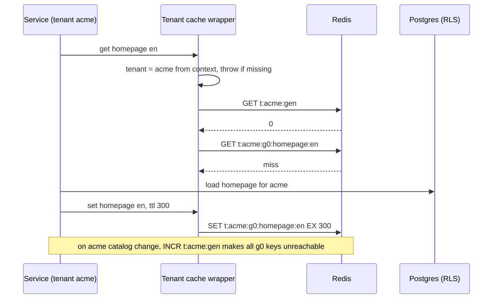
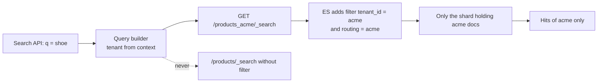

## Bối cảnh & vấn đề

Merchant Globex mở ticket: "Trang chủ storefront của chúng tôi hiển thị banner '-50% sale' và giá của Acme". Database có RLS, repository filter đầy đủ, test hai tenant pass. Đoạn code gây lỗi nằm ở chỗ không ai nghĩ tới:

```ts
async function getHomepage(req: Request) {
  const key = `homepage:${req.query.locale ?? 'en'}`;
  const cached = await redis.get(key);
  if (cached) return JSON.parse(cached);
  const data = await loadHomepage(currentTenant(), req.query.locale);
  await redis.set(key, JSON.stringify(data), 'EX', 300);
  res.setHeader('Cache-Control', 'public, max-age=300');
  return data;
}
```

`loadHomepage` lọc đúng theo tenant. Nhưng cache key không có tenant: tenant nào gọi trước trong 5 phút thì mọi tenant khác nhận dữ liệu đó. Và header `Cache-Control: public` cho phép CDN lưu response; nếu CDN không đưa host vào cache key, dù Redis đã sửa, lỗi vẫn còn ở tầng CDN.

Cache, search index, object storage, queue, log là các **kho dữ liệu thứ hai**: chúng chứa bản sao dữ liệu tenant nhưng **không có RLS**, không có composite FK, không có lớp nào tự thêm `tenant_id`. Mọi đảm bảo isolation ở đó phải được thiết kế lại từ đầu. Bài này đi qua ba kênh phổ biến nhất: Redis/CDN, Elasticsearch, object storage. Các thí nghiệm chạy thật trên Redis 7.4 và Elasticsearch 9.5.3. Chủ đề cache nói chung (stampede, invalidation) có ở track Caching; bài này chỉ giữ góc nhìn tenant.

## Khái niệm

### Cache là "database thứ hai không có RLS"

Một cache key là **địa chỉ** của dữ liệu. Nếu hai tenant có thể tính ra cùng một key cho hai dữ liệu khác nhau, cache sẽ trả dữ liệu của tenant này cho tenant kia, bất kể DB được bảo vệ tốt thế nào. Quy tắc: **mọi key của dữ liệu tenant bắt đầu bằng tenant**, theo một quy ước duy nhất như `t:{tenantId}:{entity}:{id}:v{schemaVersion}`. Phần `v{schemaVersion}` giúp đổi cấu trúc dữ liệu cache mà không đọc nhầm bản cũ.

Quy ước thôi chưa đủ, vì dev vẫn có thể gọi `redis.set` trực tiếp. Cách chắc chắn là một **cache client theo tenant**: wrapper tự lấy tenant từ context (bài 3) và tự thêm prefix; code nghiệp vụ không bao giờ thấy client Redis thô. Lint rule chặn import client thô ngoài module cache.

```ts
// BAD
const key = `price:${sku}`;
// GOOD
const key = `t:${ctx.tenantId}:price:${sku}`;
```

**Interview angle:** câu "vì sao cache key phải có tenant, cho ví dụ key xấu" có đáp án ngắn, nhưng follow-up "làm sao đảm bảo không ai ghi key thiếu prefix?" mới là phần phân loại: wrapper bắt buộc + lint.

### Invalidation theo tenant: generation key

Cần xoá mọi cache của một tenant: tenant đổi theme, import lại catalog, hoặc bị offboard. Cách ngây thơ là `SCAN MATCH t:acme:*` rồi `DEL`: trên Redis có hàng chục triệu key, SCAN phải duyệt toàn bộ keyspace (O(N) theo tổng số key, không theo số key của tenant), chậm và tốn CPU của một instance dùng chung.

**Generation key** (hay namespace version) tránh việc đó: lưu một số nguyên `t:{tenantId}:gen`, và nhét nó vào mọi key: `t:acme:g7:homepage:en`. Muốn xoá mọi cache của Acme, chỉ cần `INCR t:acme:gen`; từ đó mọi key tính ra đều mới, key cũ không ai đọc nữa và tự hết hạn theo TTL. Chi phí là một lần đọc `gen` mỗi thao tác cache (có thể cache `gen` trong process vài giây), và bộ nhớ của key cũ cho tới khi TTL hết.

**Interview angle:** follow-up "invalidate mọi thứ của một tenant mà không SCAN triệu key" có đáp án generation key; nhắc chi phí (một GET thêm, bộ nhớ tạm) cho thấy bạn đã dùng nó thật.

### HTTP cache và CDN

Header `Cache-Control` quyết định **ai** được lưu response: `private` chỉ cho trình duyệt của user đó, `public` (hoặc response không có `private` nhưng có `max-age`/`s-maxage`) cho phép **shared cache** như CDN, reverse proxy lưu và trả cho người khác. CDN tạo cache key từ URL (thường gồm host và path) và các header được khai báo trong `Vary` hoặc cấu hình cache key.

Rủi ro multi-tenant: nếu tenant được xác định bằng **host** (`acme.shop.example`) và CDN đưa host vào cache key thì response của hai tenant không đụng nhau. Nếu tenant được xác định bằng **header hoặc cookie** (`X-Tenant`, cookie session) trên cùng một host, CDN không biết điều đó và trả response của tenant A cho tenant B, trừ khi cache key/`Vary` có header đó. Response chứa dữ liệu cá nhân (giỏ hàng, giá theo nhóm khách) không bao giờ được `public`.

**Interview angle:** trong câu debug banner, interviewer chờ bạn chỉ ra **hai** lỗi: Redis key và `Cache-Control: public`; nhiều ứng viên dừng ở lỗi thứ nhất.

### Elasticsearch: ba cách tổ chức index

**Index per tenant**: mỗi tenant một index. Isolation rõ ràng (query sai index thì sai rõ), xoá tenant là `DELETE /products_acme`, mapping riêng được. Nhưng mỗi index có ít nhất một shard, và mỗi shard tốn heap, file handle, và làm cluster state lớn lên; hàng nghìn index nhỏ làm cluster chậm và khó vận hành. Hướng dẫn của Elastic khuyên tránh quá nhiều shard nhỏ (verify giới hạn cụ thể theo version).

**Shared index + `tenant_id`**: một index cho mọi tenant, field `tenant_id` kiểu `keyword`, và **mọi query phải có filter** `term: { tenant_id }`. Hiệu quả tài nguyên; rủi ro là quên filter, và **relevance bị ảnh hưởng**: điểm BM25 dùng IDF (độ hiếm của từ) tính trên toàn shard, nên từ "shoe" hiếm với Acme nhưng phổ biến với Globex sẽ cho Acme điểm thấp hơn.

**Routing** và **filtered alias** là hai công cụ ở giữa. Routing `routing=tenantId` đưa mọi document của tenant vào cùng một shard, nên query có routing chỉ chạm một shard; đổi lại tenant lớn làm shard đó lệch. Filtered alias là một alias (tên ảo) gắn filter `tenant_id` và routing: app query `products_acme` thay vì `products`, filter được ES tự thêm, giảm rủi ro quên filter khi **đọc**. Alias **không** kiểm tra dữ liệu khi **ghi**.

**Interview angle:** câu so sánh "index per tenant vs shared" cần cả ba chiều: số shard, rủi ro quên filter, và relevance; và nói được thực tế thường là shared + alias/routing cho long tail, index riêng cho tenant lớn.

### Document id trong search index

Nếu dùng id nghiệp vụ làm `_id` (`123`) và hai tenant cùng có sản phẩm 123, hai điều có thể xảy ra tuỳ routing. Không routing: document thứ hai **ghi đè** document thứ nhất (cùng `_id` cùng index) và tenant A mất sản phẩm, hoặc tệ hơn, thấy sản phẩm của tenant B nếu filter lỏng. Có routing theo tenant: hai document cùng `_id` nằm ở hai shard, `GET /_doc/123` phụ thuộc routing và dễ lấy nhầm. Cách đúng là `_id = "{tenantId}:{productId}"`: không bao giờ va chạm, và nhìn id là biết tenant.

**Interview angle:** trong câu CV về indexer, chi tiết "_id có tenant" là tín hiệu bạn đã gặp lỗi thật hoặc nghĩ đủ sâu.

### Object storage: prefix, policy, presigned URL

File (ảnh sản phẩm, hoá đơn PDF, file export) nằm trong object storage như S3. Quy ước key: `tenant/{tenantId}/invoices/{invoiceId}.pdf`. Ba lớp bảo vệ: **key có tenant** và không bao giờ nhận đường dẫn từ client (`?file=../../tenant/2/...`); **bucket private**, không public-read; **presigned URL** ngắn hạn (vài phút), được cấp **sau khi** app đã kiểm tra quyền trên invoice đó trong tenant hiện tại. Tenant cần mã hoá riêng thì dùng KMS key theo tenant; IAM policy có điều kiện theo prefix nếu mỗi tenant có credential riêng (hiếm với pool).

**Interview angle:** sự cố "khách thấy hoá đơn PDF của công ty khác" (bài 10) thường có gốc ở đây: key đoán được, link public, hoặc presigned URL quá dài hạn bị chia sẻ.

## Cơ chế hoạt động

Luồng đọc qua cache theo tenant với generation key:



Wrapper là nơi duy nhất ghép key. Nó đọc tenant từ context (không nhận tenant làm tham số, để không ai truyền nhầm), đọc generation hiện tại, rồi ghép `t:{tenant}:g{gen}:{key}`. Khi dữ liệu nguồn của tenant thay đổi trên diện rộng, `INCR` generation làm mọi key cũ "biến mất" với người đọc trong O(1). Key cũ vẫn chiếm bộ nhớ tới hết TTL; nếu Redis dùng `maxmemory-policy allkeys-lru` hoặc `volatile-lru`, chúng bị đẩy ra trước vì không ai đọc.

Luồng tìm kiếm qua filtered alias:



Query builder là nơi duy nhất tạo request tới ES, và nó chỉ biết đường dẫn alias của tenant hiện tại. Alias thêm filter và routing phía ES, nên kể cả query builder bị viết sai (quên `bool.filter`), kết quả vẫn chỉ của tenant đó. Endpoint tìm kiếm mới không thể "quên filter" vì không có API nào cho phép query index gốc.

## Ví dụ thực tế

### Tái hiện và sửa lỗi banner (Redis 7.4.11, chạy thật)

```ts
// BAD: key without tenant
async function homepageBad(locale: string) {
  const key = `homepage:${locale}`;
  const hit = await redis.get(key);
  if (hit) return JSON.parse(hit);
  loads++; const data = db[tenant()]; await redis.set(key, JSON.stringify(data), 'EX', 300); return data;
}

// GOOD: tenant-scoped wrapper with a per-tenant generation for O(1) invalidation
const tcache = {
  async key(k: string) {
    const t = tenant();                                   // throws "No tenant context" if missing
    const gen = (await redis.get(`t:${t}:gen`)) ?? '0';
    return `t:${t}:g${gen}:${k}`;
  },
  async get(k: string) { return redis.get(await this.key(k)); },
  async set(k: string, v: string, ttl: number) { return redis.set(await this.key(k), v, 'EX', ttl); },
  async invalidateTenant() { return redis.incr(`t:${tenant()}:gen`); },
};
```

```text
BAD  acme  : { banner: 'Acme -50% sale' }
BAD  globex: { banner: 'Acme -50% sale' }
GOOD acme  : { banner: 'Acme -50% sale' }
GOOD globex: { banner: 'Globex free shipping' }
GOOD acme again (hit): { banner: 'Acme -50% sale' } loads = 2
after acme invalidate: { banner: 'Acme autumn collection' } loads = 3
globex still cached  : { banner: 'Globex free shipping' } loads = 3
keys: [ 't:acme:g0:homepage:en', 't:acme:g1:homepage:en', 't:acme:gen', 't:globex:g0:homepage:en' ]
outside context: No tenant context
```

Bản BAD tái hiện đúng ticket. Bản GOOD cô lập hai tenant; `invalidateTenant()` của Acme chỉ làm Acme load lại (loads 2 → 3), cache của Globex không bị ảnh hưởng. Key `t:acme:g0:...` còn nằm trong Redis tới khi hết TTL. Gọi wrapper ngoài tenant context thì ném lỗi thay vì ghi một key không có chủ.

Phần CDN của cùng incident: đổi `Cache-Control: public` thành `private, max-age=0` cho response có dữ liệu theo customer; với trang public của tenant, giữ `public` nhưng kiểm tra cấu hình CDN có host trong cache key. Xử lý sự cố: sửa code, xoá key sai (`homepage:*` là một tập nhỏ, biết trước), purge CDN theo path, và dùng access log (có tenant, host, cache status) để xác định trong khoảng thời gian nào tenant nào đã nhận response sai.

### Elasticsearch cho nhiều tenant (ES 9.5.3, chạy thật)

Shared index `products` (3 shard), field `tenant_id: keyword`, hai filtered alias:

```ts
await call('PUT', '/products', { settings: { number_of_shards: 3, number_of_replicas: 0 },
  mappings: { properties: { tenant_id: { type: 'keyword' }, name: { type: 'text' }, price_minor: { type: 'long' } } } });
await call('POST', '/_aliases', { actions: ['acme', 'globex'].map((t) => ({
  add: { index: 'products', alias: `products_${t}`, filter: { term: { tenant_id: t } }, routing: t } })) });
```

Thí nghiệm A, `_id` va chạm: cả hai tenant ghi `_id = 123` với routing theo tenant, rồi tìm theo id trên index gốc:

```text
A. _id=123 docs (different routing => both survive, unsafe): [ 'acme:Trail running shoe', 'globex:Office chair' ]
```

Hai document cùng `_id` cùng tồn tại ở hai shard; lookup theo id mà quên routing sẽ lấy ngẫu nhiên một trong hai. Nếu không dùng routing, document thứ hai ghi đè document thứ nhất. Từ đây dùng `_id = "{tenant}:{id}"`: Acme có 1 sản phẩm "Leather shoe", Globex có 500 sản phẩm "Shoe model N".

```text
B. raw index, no tenant filter: total 501 tenants [ 'acme', 'globex' ]
C. alias products_acme: total 1 [ 'acme:1 score=0.199' ] shards 1
D. dedicated acme index: score [ 'acme:1 score=0.693' ]
E. write via filtered alias with wrong tenant_id: created -> alias filter does not validate writes
F. docs per shard (routing skew): 0:2 1:0 2:500
```

(B) Query index gốc không filter trả dữ liệu của cả hai tenant: đây là lỗi "quên filter". (C) Qua alias, chỉ còn đúng 1 kết quả của Acme và query chỉ chạm **1 shard** nhờ routing. Nhưng điểm là 0,199, trong khi (D) cùng document trong index riêng của Acme có điểm 0,693: IDF của "shoe" bị 500 document của Globex làm loãng. Với một tenant thì thứ hạng tương đối giữa các sản phẩm của họ thường vẫn hợp lý, nhưng nếu bạn dùng ngưỡng điểm (`min_score`) hoặc trộn kết quả, điểm lệch theo tenant khác là bug khó hiểu. (E) Ghi một document `tenant_id: globex` qua alias `products_acme` vẫn thành công: alias chỉ lọc khi đọc, nên đường ghi cần validate riêng ở indexer. (F) Routing dồn 500 document của Globex vào shard 2, shard 1 trống: tenant lớn gây shard lệch.

### Indexer tenant-safe (tóm tắt thiết kế)

Một indexer biến sản phẩm thành document ES nên có các quy tắc: document mang `tenant_id` lấy từ nguồn (event hoặc DB), **không** từ tham số tự do; `_id = "{tenantId}:{productId}"`; ghi qua bulk API với `routing = tenantId` (hoặc không routing cho tenant lớn có index riêng); query builder chỉ nhận alias theo tenant; giá theo nhóm khách hàng lưu thành field riêng (`prices: [{ group, amount }]`) hoặc tính lúc đọc, không lưu "giá của customer" vào document chung. Khi tenant offboard: long tail xoá bằng `_delete_by_query` với filter `tenant_id` (chạy nền, có throttle), tenant có index riêng thì xoá index; alias của tenant bị gỡ trước để ngừng phục vụ ngay.

## Trade-offs & lựa chọn thay thế

| Cách tổ chức search | Isolation | Tài nguyên cluster | Relevance | Xoá tenant | Hợp khi |
| --- | --- | --- | --- | --- | --- |
| Index per tenant | Mạnh (sai index là sai rõ) | Tệ khi hàng nghìn tenant (nhiều shard nhỏ) | Chuẩn theo tenant | `DELETE index` | Vài chục–vài trăm tenant, hoặc tenant lớn |
| Shared index + filter thủ công | Phụ thuộc code | Tốt nhất | IDF lẫn tenant | `_delete_by_query` | Không khuyến nghị đứng một mình |
| Shared + routing + filtered alias | Tốt cho đọc, ghi cần validate | Tốt, query chạm 1 shard | IDF theo shard | `_delete_by_query` + gỡ alias | Long tail nhiều tenant nhỏ |
| Lai: shared cho long tail, index riêng cho tenant lớn | Tốt | Cân bằng | Tốt cho tenant lớn | Tuỳ loại | Đa số nền tảng thực tế |

| Invalidate cache tenant | Chi phí xoá | Chi phí đọc | Ghi chú |
| --- | --- | --- | --- |
| `SCAN` + `DEL` theo prefix | O(tổng số key) | 0 | Chặn Redis dùng chung khi keyspace lớn |
| Generation key | O(1) (`INCR`) | +1 GET (cache được) | Key cũ chiếm bộ nhớ tới TTL |
| Redis riêng (DB/instance) cho tenant lớn | `FLUSHDB` | 0 | Vận hành thêm instance |
| TTL ngắn | Không cần xoá | Tỉ lệ miss cao hơn | Lưới an toàn, không thay thế invalidation |

Chọn theo kích thước: long tail nhỏ đi shared + alias + routing và generation key; vài tenant lớn đi index riêng (và có thể Redis riêng nếu họ chiếm phần lớn bộ nhớ). Dù chọn gì, **đường truy cập** phải đi qua một wrapper theo tenant: đó mới là lớp chống quên filter thật sự.

## Edge cases & failure modes

- **Cache stampede của tenant lớn**: sau `INCR gen` của tenant có 100.000 sản phẩm, mọi key của họ miss cùng lúc và DB nhận một làn sóng query. Dùng single-flight (khoá theo key), stale-while-revalidate, hoặc warm cache theo batch sau invalidate.
- **Bộ nhớ Redis dùng chung bị một tenant chiếm**: tenant lớn cache 5 triệu key đẩy key của tenant khác ra (eviction). Giới hạn số key/bytes theo tenant ở wrapper, hoặc tách instance.
- **Memo in-process thiếu tenant**: `Map` cache trong process (config, feature flag) với key không có tenant, giống hệt lỗi Redis nhưng khó thấy hơn vì chỉ xảy ra trên một pod.
- **Negative cache**: cache kết quả "không tìm thấy" với key thiếu tenant làm tenant B nhận 404 cho sản phẩm có thật.
- **ES `_delete_by_query` trên index lớn**: tốn tài nguyên, tạo nhiều deleted docs chờ merge; chạy có `requests_per_second`, ngoài giờ cao điểm.
- **Alias bị xoá nhưng app còn cache đường dẫn**: tenant offboard, alias gỡ, request cũ gọi alias không tồn tại và nhận 404 index; xử lý thành "tenant không hoạt động" chứ đừng fallback sang index gốc.
- **Presigned URL bị chia sẻ**: URL còn hạn 7 ngày bị forward qua email; mọi người có link đều tải được. Giữ hạn ngắn và cấp lại theo yêu cầu.
- **Log và APM**: log chứa payload của tenant (email, địa chỉ) được lưu chung; ai có quyền đọc log là đọc được dữ liệu mọi tenant. Che PII trong log và giới hạn quyền truy cập.

## Pitfalls

- ❌ `redis.set('homepage:en', ...)` → ✅ wrapper tự thêm `t:{tenant}:g{gen}:`, vì key thiếu tenant là cross-tenant leak (tái hiện thật).
- ❌ `Cache-Control: public` cho response phụ thuộc tenant/customer mà CDN không phân biệt → ✅ host trong cache key CDN, `Vary` đúng, hoặc `private`.
- ❌ `SCAN MATCH t:acme:*` trên Redis dùng chung để invalidate → ✅ generation key.
- ❌ Search API nhận index name hoặc filter từ caller → ✅ query builder chỉ query alias của tenant từ context.
- ❌ Tin filtered alias cho cả đường ghi → ✅ indexer validate `tenant_id` của document, vì alias không kiểm tra khi ghi (chạy thật: ghi thành công).
- ❌ `_id = productId` → ✅ `_id = "{tenantId}:{productId}"`, vì id trùng giữa tenant gây ghi đè hoặc trùng lặp.
- ❌ File key theo tên do user đặt, bucket public → ✅ `tenant/{id}/...` do server sinh, bucket private, presigned URL ngắn hạn sau khi check quyền.

## Tóm tắt

- Cache, search, file, queue, log là kho dữ liệu **không có RLS**; isolation phải được thiết kế riêng cho từng kênh.
- Cache key luôn có tenant, qua một wrapper đọc tenant từ context; generation key cho invalidate cả tenant trong O(1).
- CDN: `public` + cache key không phân biệt tenant là leak; response theo customer luôn `private`.
- Elasticsearch: index per tenant (isolation rõ, nhiều shard), shared + filter (rẻ, dễ quên filter, IDF lệch: 0,199 so với 0,693 trong thí nghiệm), routing + filtered alias (1 shard, alias không chặn ghi, shard lệch với tenant lớn).
- `_id` của document có tenant; query builder chỉ biết alias của tenant.
- Object storage: key `tenant/{id}/...` do server sinh, bucket private, presigned URL ngắn hạn sau khi check quyền, KMS key riêng khi cần.
