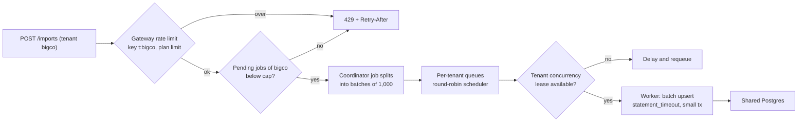
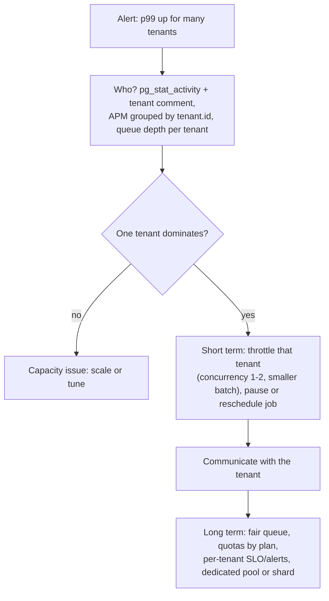

## Bối cảnh & vấn đề

Mỗi sáng thứ Hai lúc 9 giờ, cả nền tảng chậm: p99 API tăng từ 200 ms lên 4 giây, dashboard của merchant nhỏ timeout, hàng đợi gửi email tồn hàng chục nghìn job. Tới 10 giờ mọi thứ tự hết. Mất hai tuần để tìm ra nguyên nhân: một merchant lớn lên lịch import toàn bộ catalog 5 triệu sản phẩm lúc 9 giờ thứ Hai. Job import chiếm hết worker (queue FIFO), mỗi batch ghi vào bảng dùng chung làm DB CPU lên 100%, indexer bắn bulk request vào Elasticsearch dùng chung, và cache của merchant đó bị invalidate hàng loạt.

Đây là **noisy neighbor**: trong mô hình pool, tài nguyên (CPU DB, connection, worker, queue, bộ nhớ cache, shard ES, băng thông) là chung, nên một tenant dùng quá nhiều sẽ làm tenant khác chậm hoặc lỗi. Không ai làm gì sai; merchant lớn đang dùng đúng tính năng. Vấn đề là hệ thống **không có khái niệm công bằng giữa tenant**.

Hai tuần tìm nguyên nhân cũng là một vấn đề: dashboard có CPU DB, có số request, nhưng không có "ai" đứng sau tải. Bài này đi qua: tìm tenant ồn ào bằng dữ liệu, các lớp giới hạn (rate limit, quota, concurrency), fair queue, cách xử lý ngắn hạn và dài hạn cho sự cố thứ Hai, và đo chi phí theo tenant. Thuật toán rate limit (token bucket, sliding window, Lua trên Redis) có chi tiết ở [Rate limiting](/tracks/api-design/learn/rate-limiting).

## Khái niệm

### Noisy neighbor

**Noisy neighbor** là tình trạng một tenant tiêu thụ quá mức một tài nguyên dùng chung, làm giảm chất lượng dịch vụ của tenant khác. Nguồn phổ biến trong thương mại điện tử: import catalog lớn, flash sale (tải đột biến có chủ đích), báo cáo nặng quét nhiều tháng dữ liệu, bot scraping storefront, webhook retry storm từ hệ thống của merchant, và vòng lặp bug trong integration của merchant gọi API liên tục.

Tài nguyên bị tranh chấp không chỉ có CPU. Connection pool DB (một tenant giữ 40/40 connection), worker của queue, partition Kafka (hot partition), bộ nhớ Redis (eviction đẩy key của tenant khác ra), shard Elasticsearch, băng thông mạng, và quota API của bên thứ ba (một tenant gửi 1 triệu email làm tài khoản email provider chung bị throttle). Mỗi tài nguyên cần một cơ chế giới hạn riêng.

**Interview angle:** câu định nghĩa dễ; interviewer đánh giá qua ví dụ cụ thể và danh sách tài nguyên ngoài CPU.

### Nhận diện tenant ồn ào

Khi DB ở 100% CPU, câu hỏi đầu tiên là "tenant nào?". `pg_stat_statements` cho biết **query nào** tốn nhiều thời gian, nhưng nó gộp theo query đã chuẩn hoá (tham số thành `$1`), nên không có tenant. Có ba nguồn dữ liệu có tenant:

- **Comment trong SQL** theo chuẩn **sqlcommenter**: app thêm `/* tenant='acme',route='GET /reports' */` vào đầu câu query. `pg_stat_activity` hiển thị nguyên văn câu query đang chạy, nên bạn thấy tenant của từng query **đang chạy**. Log slow query (`log_min_duration_statement`) cũng giữ comment.
- **Metric phía app**: đo thời gian DB, số request, số job theo tenant ở tầng app (nơi biết tenant), rồi tổng hợp.
- **Trace**: span có attribute `tenant.id`; công cụ APM nhóm theo attribute để tìm tenant chiếm nhiều thời gian nhất.

**Interview angle:** follow-up "làm sao biết tenant nào là noisy khi DB 100% CPU?" chờ câu trả lời có `pg_stat_activity` + comment tenant, hoặc metric/trace theo tenant ở app; nói "`pg_stat_statements` không có tenant" là điểm cộng.

### Rate limit và quota theo tenant

**Rate limit** giới hạn **tốc độ** (request mỗi giây, job mỗi phút) trong một cửa sổ thời gian; vượt thì trả `429 Too Many Requests` với `Retry-After`. **Quota** giới hạn **lượng tích luỹ** (số sản phẩm tối đa, GB lưu trữ, số email mỗi tháng); vượt thì từ chối hành động hoặc chuyển sang tính phí. Cả hai đặt **theo tenant**, với giá trị lấy từ **plan/tier** của tenant (bài 3, per-tenant config), và thường có thêm tầng con theo user hoặc API key trong tenant để một integration lỗi không ăn hết hạn mức của cả tenant.

Rate limit ở gateway bảo vệ **đầu vào** nhưng không đủ: một request "tạo job import" rẻ ở gateway nhưng sinh ra 5 triệu thao tác phía sau. Cần giới hạn ở **mỗi tầng tiêu thụ tài nguyên**: concurrency của worker theo tenant, `statement_timeout` cho truy vấn báo cáo, kích thước batch của import, số bulk request ES đồng thời.

```ts
// Plan-driven limits (illustrative)
const LIMITS = {
  free:       { rps: 5,   importConcurrency: 1, maxProducts: 1_000,     reportTimeoutMs: 5_000 },
  pro:        { rps: 50,  importConcurrency: 2, maxProducts: 100_000,   reportTimeoutMs: 15_000 },
  enterprise: { rps: 300, importConcurrency: 4, maxProducts: 5_000_000, reportTimeoutMs: 60_000 },
} as const;
```

**Interview angle:** câu "implement rate limit và quota theo tenant" muốn thấy key theo tenant, giá trị theo plan, 429 + `Retry-After`, và giới hạn ở tầng sâu hơn gateway.

### Fair queuing

Queue **FIFO** toàn cục phục vụ theo thứ tự đến: tenant enqueue 1 triệu job trước thì mọi tenant khác xếp sau 1 triệu job đó. **Fair queuing** chia hàng đợi theo tenant và lấy job **luân phiên** giữa các tenant đang có job (**round-robin**), hoặc theo trọng số theo tier (**weighted fair queuing**: enterprise được 3 lượt cho mỗi lượt của free). Tenant có 1 triệu job vẫn được xử lý liên tục khi hệ thống rảnh, nhưng job của tenant nhỏ không phải chờ.

Cách triển khai: queue riêng mỗi tenant cộng một scheduler chọn queue kế tiếp; hoặc một queue chung nhưng giới hạn **concurrency theo tenant** (mỗi tenant tối đa N job đang chạy, xuyên mọi worker), để tenant lớn không thể chiếm hết worker. BullMQ Pro có tính năng "groups" cho đúng mục đích này (verify tính năng theo phiên bản/giấy phép); với Kafka, cân nhắc kỹ vì partition theo `tenantId` tạo **hot partition** cho tenant lớn.

**Interview angle:** câu "thiết kế job system để một tenant enqueue 1 triệu job không làm đói tenant khác" có đáp án khung: không FIFO toàn cục; per-tenant queue + round-robin/WFQ hoặc concurrency limit theo tenant; backpressure ở producer; metric wait time theo tenant.

### Backpressure ở producer

Fair queue giải quyết việc **thứ tự**, nhưng 1 triệu job pending vẫn chiếm bộ nhớ Redis và làm chậm thao tác trên queue. **Backpressure** giới hạn ngay từ đầu vào: mỗi tenant tối đa N job pending (ví dụ 50.000); vượt thì API trả 429 hoặc job lớn được chia thành **một job cha** tự sinh các batch con theo tốc độ cho phép (import 5 triệu sản phẩm = 1 job điều phối + 5.000 batch 1.000 sản phẩm, được thả dần). Tenant vượt quota được **delay** (xếp sau) thay vì bị từ chối toàn bộ, để trải nghiệm vẫn là "chậm hơn" chứ không phải "lỗi".

**Interview angle:** nhắc backpressure cho thấy bạn nghĩ tới cả bộ nhớ và độ trễ của chính hệ thống queue, không chỉ worker.

### Cardinality và cost attribution

**Cardinality** của một metric là số chuỗi thời gian (time series) khác nhau, bằng tích số giá trị của các label. Thêm label `tenant_id` với 50.000 tenant vào metric `http_request_duration_seconds` (histogram với khoảng 10 bucket, 30 route, 5 status) tạo ra hàng chục triệu series: Prometheus tốn RAM theo số series, query chậm, và chi phí hệ thống metric tăng vọt. Tài liệu Prometheus khuyên không dùng label có cardinality không giới hạn như user id.

Cách làm: metric tổng hợp **không** có tenant; dữ liệu theo tenant đi qua **log có cấu trúc** hoặc **trace** (hệ thống lưu trữ chịu cardinality cao tốt hơn), hoặc metric theo tenant chỉ cho **top-N** tenant (còn lại gộp thành `other`), hoặc tổng hợp định kỳ vào bảng usage của control plane. **Cost attribution** dùng chính dữ liệu đó: đo "đơn vị tiêu thụ" (request, DB time đo ở app, CPU-ms của job, GB lưu trữ, số document ES, bytes S3 theo prefix), rồi chia chi phí hạ tầng chung theo tỉ lệ. Kết quả phục vụ ba việc: định giá tier, phát hiện noisy neighbor, và quyết định tách tenant ra silo.

**Interview angle:** câu "thêm `tenant_id` làm label Prometheus với 50.000 tenant thì sao" là câu kiểm tra kinh nghiệm vận hành; trả lời bằng phép nhân cardinality và giải pháp log/trace/top-N.

## Cơ chế hoạt động

Sơ đồ các lớp giới hạn mà một yêu cầu import đi qua, từ gateway tới DB:



Mỗi lớp chặn một kiểu lạm dụng khác nhau. Gateway chặn tốc độ request. Cap số job pending chặn việc một tenant nhồi hàng triệu job vào queue. Job điều phối chia việc lớn thành phần nhỏ để có thể xen kẽ. Scheduler round-robin đảm bảo **thứ tự** công bằng. Lease concurrency theo tenant (xuyên mọi pod) đảm bảo **số worker** một tenant chiếm có giới hạn. Worker dùng transaction nhỏ và `statement_timeout` để không giữ lock và connection lâu. Khi tenant chạm giới hạn, job của họ bị **trì hoãn**, không bị huỷ.

Quy trình xử lý sự cố noisy neighbor, từ phát hiện tới khắc phục lâu dài:



## Ví dụ thực tế

### Tìm tenant ồn ào: pg_stat_activity so với pg_stat_statements (PostgreSQL 18.6, chạy thật)

App gắn comment sqlcommenter vào mọi query. Một query báo cáo chậm của `acme` (có `pg_sleep(1)` để mô phỏng) đang chạy; đồng thời đọc `pg_stat_activity`, sau đó chạy thêm vài query của các tenant khác rồi đọc `pg_stat_statements`:

```ts
const q = (tenant: string, tid: number, sleep = 0) =>
  pool.query(`/* tenant='${tenant}',route='GET /reports' */ SELECT count(*), pg_sleep($2) FROM orders WHERE tenant_id = $1`, [tid, sleep]);
```

```text
pg_stat_activity (live):
│ query                                                                    │ running_ms │
│ "/* tenant='acme',route='GET /reports' */ SELECT count(*), pg_sleep($2)" │ 218        │

pg_stat_statements (aggregated):
│ calls │ total_ms │ query                                                            │
│ '4'   │ 1031     │ 'SELECT count(*), pg_sleep($2) FROM orders WHERE tenant_id = $1' │
```

`pg_stat_activity` cho thấy chính xác tenant và route của query đang chạy 218 ms, đủ để tìm thủ phạm **trong lúc** sự cố. `pg_stat_statements` gộp query của ba tenant (acme, globex, initech) vào **một dòng** với 4 lần gọi, và văn bản được lưu không còn comment: không thể dùng nó để chia DB time theo tenant. Vì vậy cost attribution theo DB time phải đo ở app (bọc query, ghi thời gian theo tenant) hoặc lấy từ log slow query có comment. Lưu ý: comment chứa tenant không được đến từ input của user (nguy cơ SQL injection qua comment), chỉ từ context đã xác thực và đã được escape.

### Fair queue so với FIFO (mô phỏng thật)

Mô phỏng rời rạc bằng TypeScript: 4 worker, mỗi job 50 ms. `bigco` enqueue 2.000 job lúc t=0; ba shop nhỏ mỗi shop 20 job, đều đặn mỗi 500 ms bắt đầu từ t=100 ms.

```ts
class RoundRobin implements Scheduler {
  queues = new Map<string, Job[]>(); order: string[] = []; i = 0;
  push(j: Job) {
    if (!this.queues.has(j.tenant)) { this.queues.set(j.tenant, []); this.order.push(j.tenant); }
    this.queues.get(j.tenant)!.push(j);
  }
  pop() {
    for (let k = 0; k < this.order.length; k++) {
      const t = this.order[(this.i + k) % this.order.length];
      const q = this.queues.get(t)!;
      if (q.length) { this.i = (this.i + k + 1) % this.order.length; return q.shift(); }
    }
  }
  size() { let n = 0; for (const q of this.queues.values()) n += q.length; return n; }
}
```

```text
FIFO        { bigco: 'p50=12500ms max=24950ms', 'shop-a': 'p50=20700ms max=24900ms', 'shop-b': 'p50=20750ms max=24900ms', 'shop-c': 'p50=20750ms max=24900ms' }
RoundRobin  { bigco: 'p50=13250ms max=25700ms', 'shop-a': 'p50=0ms max=0ms',       'shop-b': 'p50=0ms max=0ms',       'shop-c': 'p50=0ms max=0ms' }
```

Với FIFO, job của shop nhỏ chờ trung vị 20,7 giây, đơn giản vì chúng đứng sau 2.000 job của `bigco`. Với round-robin, shop nhỏ chờ 0 ms (job của họ được lấy ở lượt kế tiếp), còn `bigco` chỉ chậm thêm khoảng 6% ở trung vị (13,25 giây so với 12,5 giây). Tổng throughput không đổi; chỉ thứ tự thay đổi. Đây là lập luận mạnh nhất khi thuyết phục team: fairness gần như **miễn phí** với tenant lớn.

### Giới hạn concurrency theo tenant xuyên nhiều pod (Redis 7.4, chạy thật)

Scheduler trong một process không đủ khi có 20 pod worker: mỗi pod không biết pod khác đang chạy bao nhiêu job của `bigco`. Dùng một **semaphore phân tán** trong Redis: sorted set theo tenant, mỗi job đang chạy là một lease có hạn (tự hết hạn nếu worker crash), thao tác acquire nguyên tử bằng Lua.

```lua
local key, limit, now, ttl, id = KEYS[1], tonumber(ARGV[1]), tonumber(ARGV[2]), tonumber(ARGV[3]), ARGV[4]
redis.call('ZREMRANGEBYSCORE', key, '-inf', now)          -- drop leases of crashed workers
if redis.call('ZCARD', key) < limit then
  redis.call('ZADD', key, now + ttl, id)
  return 1
end
return 0
```

Ba "pod" (ba Redis client độc lập), mỗi pod nhận 10 job của `bigco` và 1 job của `shop-a`, giới hạn 4 job đồng thời mỗi tenant, mỗi job 40 ms:

```text
{ peak: { bigco: 4, 'shop-a': 3 }, deferredAttempts: 392, ms: 407 }
```

Dù 30 job `bigco` được đẩy vào ba pod cùng lúc, số job `bigco` chạy đồng thời không bao giờ vượt 4; job của `shop-a` không bị chặn bởi giới hạn của `bigco`. 392 lần acquire thất bại là job được **trì hoãn và thử lại**, không chiếm worker. Trong production, thay polling 10 ms bằng việc trả job về queue với delay, và gia hạn lease cho job chạy lâu (heartbeat).

### Sự cố sáng thứ Hai: ngắn hạn và dài hạn

**Ngắn hạn (trong ngày)**: xác nhận thủ phạm bằng dữ liệu (queue depth theo tenant, `pg_stat_activity` với comment tenant, APM theo `tenant.id`). Throttle import của tenant đó: concurrency 1–2, batch nhỏ hơn, `statement_timeout` cho batch; tạm dời lịch sang giờ thấp điểm sau khi trao đổi với merchant. Không "kill" job giữa chừng nếu import không idempotent.

**Dài hạn**: fair queue hoặc concurrency theo tenant cho mọi loại job; import ghi vào **bảng staging** rồi merge theo batch nhỏ (giảm lock và WAL đột biến trên bảng nóng); indexer ES dùng bulk với giới hạn đồng thời theo tenant; quota theo plan (số sản phẩm, số import mỗi ngày); SLO và alert **theo tenant** (wait time của tenant nhỏ là chỉ báo sớm nhất); tenant lớn có worker pool riêng, và nếu DB time của họ vượt ngưỡng thì chuyển sang shard/DB riêng (bài 9).

## Trade-offs & lựa chọn thay thế

| Cơ chế | Chặn được | Chi phí | Hạn chế |
| --- | --- | --- | --- |
| Rate limit ở gateway theo tenant | Request dồn dập, bot, integration lỗi | Thấp (Redis, Lua) | Không thấy chi phí phía sau request |
| Quota theo plan | Tích luỹ quá mức (sản phẩm, storage) | Thấp | Không chặn đột biến ngắn hạn |
| Fair queue (round-robin/WFQ) | Tenant lớn làm đói tenant nhỏ trong queue | Trung bình (nhiều queue, scheduler) | Không giới hạn tổng tài nguyên tenant lớn dùng |
| Concurrency lease theo tenant | Tenant chiếm hết worker xuyên pod | Trung bình (Redis, lease, heartbeat) | Cần xử lý worker crash, lease hết hạn |
| `statement_timeout`, batch nhỏ | Một query/transaction chiếm DB quá lâu | Thấp | Cần job idempotent để retry |
| Worker pool / DB riêng cho tenant lớn | Mọi dạng tranh chấp ở tầng đó | Cao (vận hành thêm) | Chỉ đáng cho vài tenant |

| Cách đo theo tenant | Cardinality | Độ chính xác | Hợp cho |
| --- | --- | --- | --- |
| Prometheus label `tenant_id` | Bùng nổ với nhiều tenant | Cao | Chỉ khi số tenant nhỏ (dưới vài trăm) |
| Top-N label + `other` | Có giới hạn | Cao cho top-N | Dashboard noisy neighbor |
| Log có cấu trúc / trace attribute | Hệ thống log/trace chịu tốt | Cao, truy vấn chậm hơn | Điều tra, cost attribution |
| Bảng usage tổng hợp định kỳ | Không ảnh hưởng metric | Theo chu kỳ | Billing, định giá tier |

Chọn tổ hợp, không chọn một: gateway rate limit và quota là tối thiểu cho mọi SaaS pooled; fair queue hoặc concurrency lease trở nên bắt buộc ngay khi có job nặng do tenant kích hoạt (import, export, báo cáo); tách tenant lớn là bước cuối khi dữ liệu đo được cho thấy họ chiếm phần lớn tài nguyên.

## Edge cases & failure modes

- **Hot partition Kafka**: partition key `tenantId` giữ thứ tự theo tenant nhưng dồn toàn bộ event của tenant lớn vào một partition, consumer của partition đó tụt lag. Dùng key `tenantId:entityId` khi chỉ cần thứ tự theo entity, hoặc topic riêng cho tenant lớn.
- **Lease không được trả**: worker crash giữa job, lease giữ chỗ tới khi hết TTL, tenant bị giảm concurrency tạm thời. TTL vừa đủ và heartbeat gia hạn.
- **Starvation ngược**: weighted fair queuing với trọng số quá chênh làm tenant free chờ mãi khi tenant enterprise luôn có job. Đặt trọng số tối thiểu và giới hạn wait time tối đa.
- **Rate limit per tenant quá chặt với flash sale hợp lệ**: tenant chạy khuyến mãi lớn bị 429 đúng lúc cần nhất. Cho phép burst theo plan, và cơ chế nâng hạn mức tạm thời có lịch.
- **Retry storm**: client của tenant nhận 429 và retry ngay không theo `Retry-After`, tạo thêm tải. Rate limit phải rẻ (từ chối sớm ở edge), và tài liệu API nói rõ backoff.
- **Noisy neighbor ở dịch vụ bên thứ ba**: một tenant gửi hàng loạt email/SMS làm tài khoản provider chung bị throttle, mọi tenant không gửi được OTP. Quota gửi theo tenant và tách luồng giao dịch (OTP) khỏi luồng marketing.
- **Comment tenant trong SQL từ input**: ghép tên tenant do user nhập vào comment mở đường SQL injection (`*/ DROP ...`). Chỉ dùng id từ context, escape theo chuẩn sqlcommenter.

## Pitfalls

- ❌ Một queue FIFO cho mọi tenant → ✅ per-tenant queue + round-robin, hoặc concurrency theo tenant, vì FIFO làm shop nhỏ chờ 20 giây sau job của tenant lớn (mô phỏng).
- ❌ Chỉ rate limit ở gateway → ✅ giới hạn ở mọi tầng tiêu thụ (worker, DB timeout, bulk ES), vì một request rẻ có thể sinh hàng triệu thao tác.
- ❌ `tenant_id` làm label trên mọi metric Prometheus với hàng chục nghìn tenant → ✅ top-N + `other`, còn lại qua log/trace.
- ❌ Dựa vào `pg_stat_statements` để tìm tenant ồn ào → ✅ comment tenant + `pg_stat_activity`/slow log, hoặc đo DB time ở app, vì `pg_stat_statements` gộp mọi tenant (đo thật).
- ❌ Từ chối toàn bộ job khi tenant vượt quota → ✅ delay/giảm ưu tiên, trả 429 chỉ ở đầu vào, để tenant thấy "chậm hơn" thay vì "hỏng".
- ❌ Tách tenant lớn ra silo theo cảm giác → ✅ dựa trên cost attribution và ngưỡng đo được.

## Tóm tắt

- Noisy neighbor là cái giá của pool: một tenant chiếm DB, connection, worker, partition, cache, shard, hay quota bên thứ ba.
- Tìm thủ phạm: comment sqlcommenter + `pg_stat_activity` (thấy tenant của query đang chạy); `pg_stat_statements` gộp mất tenant (đo thật).
- Giới hạn nhiều tầng: rate limit gateway, quota theo plan, cap job pending, concurrency lease theo tenant, `statement_timeout`, batch nhỏ.
- Fair queue: round-robin giữa tenant làm shop nhỏ chờ 0 ms thay vì 20,7 giây, tenant lớn chỉ chậm thêm khoảng 6% (mô phỏng).
- Concurrency theo tenant xuyên pod: semaphore Redis với lease có TTL, acquire nguyên tử bằng Lua (chạy thật: đỉnh đúng bằng giới hạn 4).
- Metric tổng không có tenant; dữ liệu theo tenant qua log/trace/top-N; cost attribution dùng cho pricing, phát hiện noisy neighbor, quyết định tách silo.
