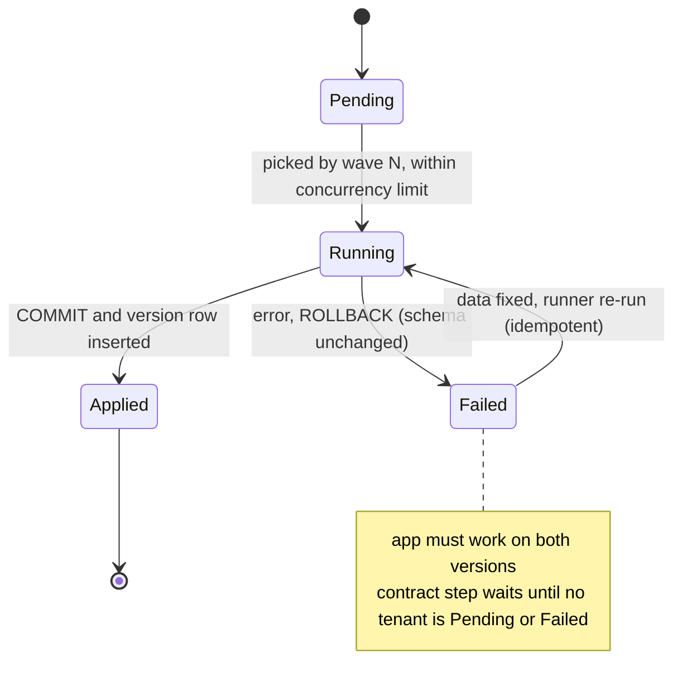
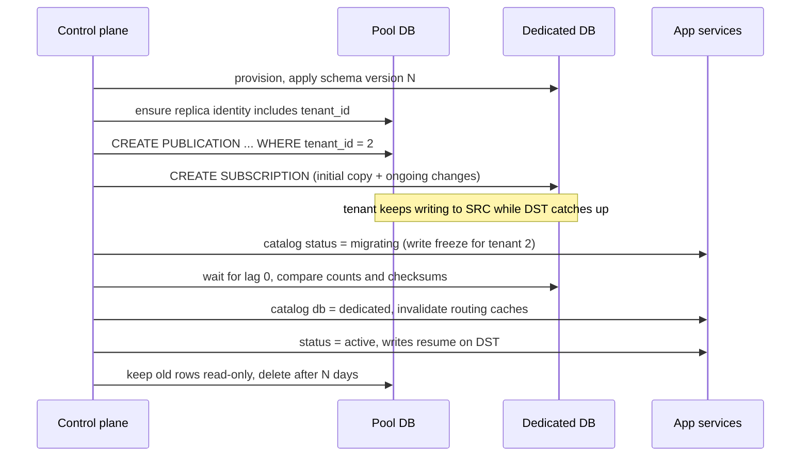

## Bối cảnh & vấn đề

Ba ticket trong cùng một tuần, của một nền tảng bridge (phần lớn tenant ở pool, vài chục tenant ở schema riêng, năm tenant ở DB riêng):

1. Migration release 4.12 dừng ở tenant 312 trên 800 với lỗi `could not create unique index`. Pipeline đỏ, 311 tenant đã ở schema mới, 488 tenant ở schema cũ, và bản deploy app mới đang chờ.
2. Merchant lớn nhất chiếm 30% DB time của cụm pool. Quyết định đã có: chuyển họ sang DB riêng. Yêu cầu: downtime tối đa vài phút.
3. Một merchant chấm dứt hợp đồng và yêu cầu export rồi xoá toàn bộ dữ liệu trong 30 ngày, kèm văn bản xác nhận đã xoá. Dữ liệu của họ nằm ở Postgres, read replica, data warehouse, Elasticsearch, Redis, S3, Kafka, log và backup hằng đêm.

Không việc nào trong ba việc trên tồn tại ở một hệ thống single-tenant. Chúng là **vận hành per-tenant**: các thao tác phải chạy "cho từng tenant" hoặc "cho một tenant" trên một hạ tầng dùng chung, và phải an toàn khi bị gián đoạn giữa chừng. Bài này đi qua bốn chủ đề: migration đa tenant, di chuyển tenant, connection khi có nhiều DB, và xoá/export dữ liệu. Nền tảng migration không downtime (expand/contract, lock_timeout) có ở [Zero-downtime migrations](/tracks/sql-postgres/learn/zero-downtime-migrations).

## Khái niệm

### Migration đa tenant và trạng thái hỗn hợp

Với pool, một migration chạy **một lần** cho mọi tenant. Với schema-per-tenant hoặc DB-per-tenant, cùng migration chạy **N lần**, và N lần đó không thể nguyên tử: luôn có một khoảng thời gian (vài phút tới vài giờ) mà một phần tenant đã ở version mới còn phần còn lại ở version cũ. Nếu migration dừng giữa chừng, khoảng thời gian đó kéo dài tới khi có người sửa.

Hệ quả thiết kế: **app phải chạy được với cả hai version schema** cùng lúc. Điều này buộc mọi migration theo **expand/contract**: release N chỉ **thêm** (cột nullable hoặc có default, bảng mới, index); code của release N đọc/ghi được cả hai dạng; chỉ ở release N+1, khi **mọi** tenant đã lên version N, mới **xoá** thứ cũ. Trong Postgres, phần lớn DDL là transactional, nên migration của một tenant hoặc thành công trọn vẹn hoặc rollback sạch; ngoại lệ đáng nhớ là `CREATE INDEX CONCURRENTLY` (và một số lệnh khác) **không chạy được trong transaction**, nên bước đó phải tách riêng và phải idempotent (`IF NOT EXISTS`, kiểm tra index `INVALID` còn sót).

**Interview angle:** câu "migration lỗi ở tenant 312/800, bạn đang ở trạng thái nào?" cần ba ý: 311 mới, 1 lỗi (sạch hay dở dang tuỳ DDL có transactional không), 488 cũ, và app phải chịu được trạng thái đó.

### Runner idempotent, version theo tenant, chạy theo wave

Một migration runner đa tenant cần: **bảng version theo tenant** (`tenant_migrations(tenant, version, applied_at)`) trong control plane; mỗi tenant migrate trong **transaction riêng** có `lock_timeout` và `statement_timeout`; **idempotent** (chạy lại thì tenant đã xong được bỏ qua); chạy theo **wave** (canary vài tenant → 10% → phần còn lại) với **concurrency giới hạn**; dừng khi tỉ lệ lỗi vượt ngưỡng; và dashboard "bao nhiêu tenant ở version nào" có alert khi lệch quá lâu. Test migration trên bản copy của **tenant lớn nhất**, vì lỗi thời gian và lock thường chỉ xuất hiện ở đó.

**Interview angle:** trình bày runner như một hệ thống có trạng thái (state machine per tenant) chứ không phải một vòng `for` trong CI.

### Di chuyển tenant: copy, bắt kịp, cutover

Chuyển một tenant từ DB pool sang DB riêng gồm ba pha. **Copy**: provision DB mới cùng schema version, copy snapshot dữ liệu của tenant (`WHERE tenant_id = X` cho từng bảng). **Bắt kịp**: trong lúc copy, tenant vẫn ghi vào DB cũ, nên cần **CDC** (change data capture) để áp các thay đổi đó sang DB mới: logical replication với **row filter** (PostgreSQL 15+) hoặc Debezium. **Cutover**: tạm dừng ghi của tenant đó vài giây (trạng thái `migrating` trong catalog), chờ CDC bắt kịp, **đối chiếu** (count, checksum theo bảng), đổi routing trong tenant catalog, invalidate cache routing ở mọi service, mở lại ghi. Dữ liệu cũ giữ read-only một thời gian để rollback, rồi mới xoá.

Tiền đề phải có từ ngày đầu (bài 1): mọi bảng có `tenant_id`, **ID toàn cục** (sequence cục bộ của DB pool sẽ va chạm hoặc bị reset ở DB mới), và mọi truy cập đi qua catalog. Và đừng quên kênh phụ: ES index, Redis key, file storage, job đang chạy hoặc đang chờ trong queue của tenant đó.

**Interview angle:** follow-up "cái gì vỡ nếu một số ID là sequence cục bộ của DB chung?" có đáp án: ID trùng khi tenant sau này quay về hoặc khi gộp dữ liệu, sequence ở DB mới phải được đặt lên trên max hiện tại, và ID đã lộ ra ngoài (URL, email) phải giữ nguyên.

### Replica identity và row filter

**Replica identity** là tập cột mà Postgres ghi vào WAL để nhận diện dòng cũ khi `UPDATE`/`DELETE` được replicate (mặc định là primary key). **Row filter** của publication (`FOR TABLE orders WHERE (tenant_id = 2)`) quyết định dòng nào được gửi đi. Với `UPDATE` và `DELETE`, Postgres chỉ có thể đánh giá filter trên các cột nằm trong replica identity, vì chỉ các cột đó có mặt cho dòng cũ. Nếu `tenant_id` không nằm trong replica identity, publication với filter theo `tenant_id` làm **mọi UPDATE/DELETE trên bảng nguồn lỗi**, tức là **production ngừng ghi** ngay khi bạn tạo publication. Cách sửa: primary key `(tenant_id, id)`, hoặc `REPLICA IDENTITY USING INDEX` trên unique index `(tenant_id, id)` (cột phải `NOT NULL`), hoặc `REPLICA IDENTITY FULL` (ghi cả dòng vào WAL, tốn hơn).

**Interview angle:** biết bẫy replica identity là dấu hiệu rõ ràng của người đã làm tenant move thật; nó cũng là lý do thêm cho PK `(tenant_id, id)`.

### Connection khi có nhiều database

Với DB-per-tenant, code ngây thơ tạo **một `pg.Pool` mỗi tenant** và giữ mãi. Mỗi pool mở tới `max` connection, nhân với số pod. 2.000 tenant × 5 connection × 10 pod = 100.000 connection tiềm năng, trong khi Postgres (mỗi connection là một process, xem [Connections & PgBouncer](/tracks/sql-postgres/learn/connection-pooling)) thường chỉ chịu vài trăm. Ngay cả khi connection chưa mở, mỗi pool object tốn bộ nhớ và timer trong process Node.

Lựa chọn: **LRU pool**: chỉ giữ pool cho K tenant hoạt động gần nhất, đóng pool ít dùng nhất khi vượt K, và `max` nhỏ cho mỗi pool; **PgBouncer** trước các server, nơi pool tính theo cặp (database, user) và có trần `max_db_connections`/`max_client_conn` để chặn tổng; **gom tenant nhỏ** về pool/schema chung (bridge) để chỉ tenant lớn có DB riêng; và **router** tenant → server qua catalog để biết connection string nào.

**Interview angle:** câu "2.000 tenant DB, Node hết RAM, Postgres chạm max_connections" có đáp án nhân số (tenant × max × pod) rồi mới đến giải pháp; nhắc cold start của pool mới (follow-up) là điểm cộng.

### Xoá và export dữ liệu tenant

Khi tenant rời đi, hợp đồng và luật (GDPR điều 17 về quyền xoá, điều 20 về quyền di chuyển dữ liệu, hoặc điều khoản hợp đồng B2B) có thể yêu cầu **export** rồi **xoá** dữ liệu trong thời hạn. Khó khăn không nằm ở câu `DELETE`, mà ở **danh sách nơi dữ liệu tồn tại**: DB chính, read replica (tự xoá theo), data warehouse, search index, cache, object storage, topic Kafka (dữ liệu nằm tới hết retention), log/APM có PII, bên thứ ba (email provider, payment), và **backup**.

Cách làm chứng minh được: một **registry** các data store chứa dữ liệu tenant, nằm trong code, mỗi service đăng ký handler `exportTenant` và `deleteTenant`; một **workflow async** có trạng thái từng bước (bước nào xong, lúc nào, bao nhiêu dòng), idempotent, retry được; và một **báo cáo hoàn tất** sinh từ trạng thái đó. Backup không sửa được từng dòng, nên có hai hướng: **retention có hạn** (xoá tenant khỏi DB, backup chứa họ tự hết hạn sau N ngày, và điều này được ghi trong hợp đồng), hoặc **crypto-shredding**: mã hoá dữ liệu của tenant bằng key riêng, xoá key thì mọi bản sao (kể cả trong backup) thành vô dụng. Silo có lợi thế thật ở đây: `DROP DATABASE` và xoá bucket là xong phần lớn.

**Interview angle:** follow-up "crypto-shredding là gì và cần gì từ thiết kế ngay từ đầu?" có đáp án: key per tenant (envelope encryption), mọi dữ liệu nhạy cảm được mã hoá bằng key đó **trước khi** đi vào DB/backup/log, và quản lý key (KMS) tách khỏi dữ liệu.

## Cơ chế hoạt động

Vòng đời một migration đa tenant, theo trạng thái của từng tenant:



Mỗi tenant là một máy trạng thái riêng. Runner chọn tenant theo wave, chạy migration trong transaction, và chỉ ghi dòng version khi commit thành công (cùng transaction với DDL, nên không bao giờ có "version ghi rồi mà DDL chưa chạy"). Tenant lỗi được rollback sạch và chờ sửa; chạy lại runner thì tenant đã `Applied` bị bỏ qua. Bước contract (xoá cột cũ) chỉ được phép khi không còn tenant nào ở `Pending` hoặc `Failed`.

Di chuyển một tenant sang DB riêng:



Subscription làm cả hai pha copy và bắt kịp: lúc tạo, nó copy dữ liệu hiện có khớp filter, rồi áp các thay đổi tiếp theo. Cửa sổ downtime chỉ là đoạn "write freeze" cho **một tenant**, thường vài giây tới vài chục giây, trong lúc chờ lag về 0 và đổi catalog. Các tenant khác không bị ảnh hưởng.

## Ví dụ thực tế

### Migration 20 tenant, lỗi ở tenant 13 (PostgreSQL 18.6, chạy thật)

20 schema `tenant_001`…`tenant_020`, mỗi schema có bảng `customers`. Tenant 13 có hai email chỉ khác hoa thường (`a@x.io`, `A@x.io`). Migration version 2 thêm cột và tạo unique index trên `lower(email)`. Runner chạy theo ba wave (2, 8, 10 tenant), concurrency 4:

```ts
async function migrateTenant(s: string): Promise<Result> {
  const c = await pool.connect();
  try {
    await c.query('BEGIN');
    await c.query(`SET LOCAL lock_timeout = '2s'; SET LOCAL statement_timeout = '60s'`);
    const done = await c.query('SELECT 1 FROM control.tenant_migrations WHERE tenant = $1 AND version = $2', [s, migration.version]);
    if (done.rowCount) { await c.query('ROLLBACK'); return { tenant: s, ok: true }; }   // idempotent
    await c.query(migration.sql(s));   // ADD COLUMN ... DEFAULT false; CREATE UNIQUE INDEX ... (lower(email))
    await c.query('INSERT INTO control.tenant_migrations (tenant, version) VALUES ($1, $2)', [s, migration.version]);
    await c.query('COMMIT');
    return { tenant: s, ok: true };
  } catch (e) { await c.query('ROLLBACK'); return { tenant: s, ok: false, err: (e as Error).message }; }
  finally { c.release(); }
}
```

```text
wave 1: 2/2 ok []
wave 2: 8/8 ok []
wave 3: 9/10 ok [ 'tenant_013: could not create unique index "customers_email_lower"' ]
halt: fix data, re-run (idempotent)
┌─────────┬─────────┬─────────┐
│ (index) │ version │ tenants │
├─────────┼─────────┼─────────┤
│ 0       │ 1       │ 1       │
│ 1       │ 2       │ 19      │
└─────────┴─────────┴─────────┘
tenant_013 half-applied? { has_new_column: 0 }
CONCURRENTLY in tx: CREATE INDEX CONCURRENTLY cannot run inside a transaction block
```

19 tenant ở version 2, tenant 13 ở version 1. Nhờ DDL transactional, tenant 13 **không** có cột mới (`has_new_column: 0`): lỗi ở câu thứ hai đã rollback cả câu thứ nhất. Sửa dữ liệu của tenant 13 (gộp hai email trùng), chạy lại runner: 19 tenant được bỏ qua, chỉ tenant 13 chạy. Dòng cuối là giới hạn của cách làm này: với bảng lớn, bạn muốn `CREATE INDEX CONCURRENTLY` để không khoá ghi, nhưng nó không chạy được trong transaction, nên bước đó phải tách khỏi transaction, và runner phải kiểm tra index `INVALID` còn sót từ lần chạy lỗi trước (`pg_index.indisvalid = false`) để drop và tạo lại.

So với pool: pool chỉ có một lần migration nên không có trạng thái hỗn hợp giữa tenant, nhưng migration đó chạm **mọi** tenant cùng lúc và trên bảng lớn nhất; lỗi hay lock kéo dài ảnh hưởng tất cả. Schema/DB per tenant chia nhỏ rủi ro (blast radius từng tenant, canary được) nhưng đổi lấy trạng thái hỗn hợp và thời gian chạy dài. Về vận hành, nhiều team thấy pool an toàn hơn **nếu** migration được viết đúng expand/contract, vì chỉ có một trạng thái để suy luận.

### Chuyển tenant 2 sang DB riêng bằng logical replication (chạy thật)

Hai container PostgreSQL 18.6: nguồn (`wal_level = logical`) và đích. Bảng `orders` và `order_items` có PK `id` đơn; 30.000 dòng mỗi bảng, chia cho 3 tenant.

```sql
-- source
CREATE PUBLICATION move_tenant_2 FOR TABLE orders WHERE (tenant_id = 2), order_items WHERE (tenant_id = 2);
-- destination
CREATE SUBSCRIPTION move_tenant_2
  CONNECTION 'host=devrecall-mt-src user=postgres password=... dbname=postgres'
  PUBLICATION move_tenant_2;
```

```text
NOTICE:  created replication slot "move_tenant_2" on publisher

-- destination after initial sync
 tenant_id | count |     sum
-----------+-------+-------------
         2 | 10000 | 14999500000
 items
-------
 10000
```

Copy ban đầu đúng: chỉ 10.000 dòng của tenant 2 ở mỗi bảng. Rồi app tiếp tục ghi vào nguồn như bình thường:

```sql
-- source, normal application traffic
UPDATE orders SET total_minor = 1 WHERE id = 2;
```

```text
ERROR:  cannot update table "orders"
DETAIL:  Column used in the publication WHERE expression is not part of the replica identity.
```

Đây là bẫy replica identity: ngay khi publication có filter theo `tenant_id` được tạo, **mọi UPDATE trên bảng `orders` của mọi tenant** ở DB nguồn bị lỗi, vì replica identity (PK `id`) không chứa `tenant_id`. Trên production, đó là sự cố toàn nền tảng gây ra bởi việc chuyển một tenant. Sửa trước khi tạo publication:

```sql
CREATE UNIQUE INDEX orders_tenant_id_id ON orders (tenant_id, id);
ALTER TABLE orders ALTER COLUMN tenant_id SET NOT NULL;
ALTER TABLE orders REPLICA IDENTITY USING INDEX orders_tenant_id_id;

INSERT INTO orders VALUES (2, 900001, 5), (1, 900002, 7);   -- one row per tenant
-- destination: SELECT * FROM orders WHERE id IN (900001, 900002); SELECT count(*) FROM orders;

UPDATE orders SET total_minor = 1 WHERE id = 1;       -- a tenant 2 row
UPDATE orders SET tenant_id = 1 WHERE id = 4;         -- row leaves tenant 2
-- destination: SELECT * FROM orders WHERE id IN (1, 4); SELECT count(*) FROM orders;
```

```text
-- destination after the inserts
 tenant_id |   id   | total_minor
-----------+--------+-------------
         2 | 900001 |           5
 count
-------
 10001

-- destination after the two updates
 tenant_id | id | total_minor
-----------+----+-------------
         2 |  1 |           1
 count
-------
 10000
```

Insert của tenant 2 sang đích, insert của tenant 1 không; update giá trị được áp; dòng 4 **rời khỏi** tenant 2 nên bị xoá ở đích (số dòng từ 10.001 về 10.000), đúng hành vi được mô tả trong tài liệu row filter: UPDATE làm dòng không còn khớp filter được chuyển thành DELETE ở subscriber. (Làm lại toàn bộ trên bảng `order_items` với cùng cách.) Sau đó: freeze ghi của tenant 2 ở catalog, chờ lag về 0 (`pg_stat_subscription`), so count/checksum, đổi routing, và sequence ở đích phải được đặt lớn hơn max id hiện có nếu DB đích còn sinh id bằng sequence cục bộ.

### LRU pool cho DB-per-tenant (chạy thật)

30 database tenant trên một server có `max_connections = 100`. Mỗi tenant nhận 3 query đồng thời:

```ts
class TenantPools {
  private pools = new Map<string, pg.Pool>();
  private maxPools: number;
  constructor(maxPools: number) { this.maxPools = maxPools; }
  get(tenantDb: string): pg.Pool {
    const hit = this.pools.get(tenantDb);
    if (hit) { this.pools.delete(tenantDb); this.pools.set(tenantDb, hit); return hit; }   // move to MRU
    if (this.pools.size >= this.maxPools) {
      const [lruKey, lruPool] = this.pools.entries().next().value!;
      this.pools.delete(lruKey); void lruPool.end();                                        // drains in-flight queries first
    }
    const p = new pg.Pool({ connectionString: urlFor(tenantDb), max: 3, idleTimeoutMillis: 30_000 });
    this.pools.set(tenantDb, p); return p;
  }
}
```

```text
naive: pools = 30 backends = 90
lru:   pools = 5 backends = 15
```

Chỉ với 30 tenant và một process, cách ngây thơ đã giữ 90 backend, sát trần 100. Nhân 10 pod là không khởi động được. LRU giới hạn ở 5 pool và 15 backend. Cái giá: request cho tenant vừa bị đẩy ra phải mở connection mới (TLS + auth, vài chục ms), và nếu nhiều request cho cùng tenant tới đồng thời, chúng không được tạo nhiều pool trùng: `get()` ở trên đồng bộ nên an toàn trong một process, nhưng thao tác async như tra catalog trước khi tạo pool phải được gom (single-flight). Ở quy mô lớn hơn, đặt PgBouncer trước mỗi server DB để trần connection được áp ở một chỗ.

### Xoá dữ liệu tenant: registry, workflow, crypto-shredding

```ts
// Each service registers what it holds for a tenant (illustrative)
export const tenantDataStores: TenantDataStore[] = [
  { name: 'postgres:orders', export: exportOrders, delete: (t) => deleteInBatches('orders', t) },
  { name: 'elasticsearch:products', export: noop, delete: (t) => es.deleteByQuery({ index: 'products', query: { term: { tenant_id: t } } }) },
  { name: 'redis', export: noop, delete: (t) => redis.incr(`t:${t}:gen`) },            // plus TTL expiry
  { name: 's3:tenant-prefix', export: zipPrefix, delete: (t) => deletePrefix(`tenant/${t}/`) },
  { name: 'kms:tenant-key', export: noop, delete: (t) => kms.scheduleKeyDeletion(keyArnFor(t)) },   // crypto-shredding
];
```

Workflow chạy từng store theo thứ tự (export trước, xoá sau, KMS key cuối cùng), ghi trạng thái từng bước vào bảng `tenant_deletions(tenant, store, status, rows, finished_at)`, và sinh báo cáo từ bảng đó. Crypto-shredding trong vài dòng (chạy thật với `node:crypto`, `Map` đóng vai KMS):

```text
before: [ 'an@mail.com, 12 Nguyen Hue', 'binh@mail.com, 5th Ave' ]
after : acme key for acme destroyed: data unrecoverable
after : globex binh@mail.com, 5th Ave
```

Bản ghi của Acme nằm trong "backup" vẫn còn nguyên bytes, nhưng không còn key để giải mã; Globex không bị ảnh hưởng. Điều kiện để crypto-shredding có giá trị: dữ liệu phải được mã hoá **trước khi** rời app (không phải chỉ encryption at rest của đĩa, vốn dùng một key cho mọi tenant), mọi bản sao (DB, log, export, warehouse) đều chỉ chứa ciphertext, và key thật sự bị huỷ ở KMS (có thời gian chờ theo chính sách của KMS).

## Trade-offs & lựa chọn thay thế

| Vấn đề | Pool | Schema per tenant | DB per tenant |
| --- | --- | --- | --- |
| Migration | 1 lần, chạm mọi tenant | N lần, trạng thái hỗn hợp | N lần, trạng thái hỗn hợp, lâu nhất |
| Blast radius migration lỗi | Toàn nền tảng | 1 tenant | 1 tenant |
| Di chuyển 1 tenant | Copy theo `tenant_id` + CDC có row filter | `pg_dump -n` + CDC | Đổi server là chuyện hạ tầng |
| Connection | 1 pool | 1 pool, `search_path` local | Pool per DB, cần LRU/PgBouncer |
| Xoá 1 tenant | DELETE theo batch trên mọi bảng | `DROP SCHEMA` | `DROP DATABASE` |
| Restore 1 tenant | Khó (trích từ backup chung) | `pg_restore -n` | Restore cả DB |

| Cách xoá dữ liệu trong backup | Ưu | Nhược |
| --- | --- | --- |
| Retention có hạn | Đơn giản, không cần thiết kế trước | Dữ liệu còn trong backup tới hết hạn; phải ghi trong hợp đồng |
| Crypto-shredding | Xoá "ngay" mọi bản sao | Cần key per tenant và mã hoá ở tầng app từ đầu |
| Backup per tenant (silo) | Xoá backup của tenant đó | Chỉ khả thi với silo |

Khi nào chọn gì: pool với migration expand/contract kỷ luật là đơn giản nhất về trạng thái; per-tenant (schema/DB) hợp khi cần restore/xoá theo tenant thường xuyên hoặc blast radius nhỏ là yêu cầu. Di chuyển tenant bằng logical replication với row filter hợp khi downtime phải tính bằng giây; với tenant nhỏ, một cửa sổ bảo trì ngắn và `COPY` đơn giản thường đủ và ít rủi ro hơn. Crypto-shredding đáng làm khi hợp đồng hoặc luật yêu cầu xoá có chứng minh mà retention backup không đáp ứng được.

## Edge cases & failure modes

- **Migration chạy song song quá nhiều tenant**: 50 tenant cùng `ALTER TABLE` trên cùng server làm IO bão hoà; giới hạn concurrency theo server DB, không chỉ theo runner.
- **Lock chờ vô hạn**: `ALTER TABLE` chờ lock sau một transaction dài của tenant, rồi chặn mọi query khác của tenant đó phía sau nó. Luôn `lock_timeout` ngắn và retry.
- **Drift âm thầm**: một tenant được "hotfix" tay bằng psql, schema khác các tenant còn lại; migration sau lỗi khó hiểu. So sánh schema định kỳ (checksum của DDL) giữa các tenant.
- **Replication slot bị bỏ quên**: huỷ tenant move giữa chừng nhưng quên `DROP SUBSCRIPTION`/slot; slot giữ WAL, đĩa nguồn đầy dần. Theo dõi `pg_replication_slots` và dọn trong bước rollback.
- **DDL trong lúc move**: logical replication không replicate DDL; migration chạy trên nguồn giữa chừng làm subscription lỗi. Đóng băng migration cho tenant đang move.
- **Cutover quên cache routing**: một service còn cache "tenant 2 ở pool-01" 5 phút và tiếp tục ghi vào DB cũ (đã read-only thì lỗi, chưa read-only thì mất dữ liệu). Invalidate chủ động và đặt DB cũ read-only cho tenant đó trước khi mở ghi ở đích.
- **Cold start pool**: tenant bị đẩy khỏi LRU nhận burst request; mỗi request mở connection mới cùng lúc (thundering herd). Tạo pool một lần (single-flight), có `min` nhỏ cho tenant hoạt động thường xuyên.
- **Xoá nhưng Kafka còn giữ**: topic có retention 7 ngày chứa event của tenant; consumer mới replay từ đầu sẽ tái tạo dữ liệu vừa xoá. Consumer phải bỏ qua tenant ở trạng thái `deleted`, và event nhạy cảm nên mã hoá theo key tenant.

## Pitfalls

- ❌ Migration N tenant bằng vòng `for` dừng ở lỗi đầu tiên, không lưu version → ✅ runner có bảng version per tenant, idempotent, wave, concurrency giới hạn.
- ❌ Release vừa thêm vừa xoá cột → ✅ expand ở release N, contract ở release N+1 khi mọi tenant đã lên, vì trạng thái hỗn hợp là bình thường.
- ❌ Tạo publication có row filter `tenant_id` khi replica identity chỉ là `id` → ✅ đưa `tenant_id` vào replica identity trước, vì UPDATE/DELETE ở nguồn sẽ lỗi toàn bảng (chạy thật).
- ❌ Một `pg.Pool` mỗi tenant, không bao giờ đóng → ✅ LRU pool + `max` nhỏ + PgBouncer, vì tenant × max × pod vượt `max_connections` (đo thật: 30 tenant đã 90/100).
- ❌ "Xoá tenant" = `DELETE FROM` vài bảng chính → ✅ registry mọi data store, workflow có trạng thái, báo cáo hoàn tất, xử lý backup bằng retention hoặc crypto-shredding.
- ❌ Dùng sequence cục bộ cho id công khai → ✅ ID toàn cục, để tenant di chuyển được mà id không đổi.

## Tóm tắt

- Migration đa tenant tạo trạng thái hỗn hợp; app phải chạy được với hai version, nên expand/contract là bắt buộc.
- Runner: version per tenant, transaction + `lock_timeout` mỗi tenant, idempotent, wave, concurrency; `CREATE INDEX CONCURRENTLY` không chạy trong transaction nên phải tách bước (chạy thật: 19/20 lên version 2, tenant lỗi rollback sạch).
- Di chuyển tenant: provision → CDC (logical replication có row filter, PG 15+) → freeze ghi một tenant → đối chiếu → đổi catalog → giữ bản cũ read-only.
- Row filter theo `tenant_id` đòi `tenant_id` trong replica identity; thiếu nó thì UPDATE/DELETE ở nguồn lỗi (chạy thật). UPDATE làm dòng rời filter thành DELETE ở đích.
- DB-per-tenant: pool per tenant làm cạn `max_connections`; dùng LRU pool, PgBouncer, gom tenant nhỏ.
- Xoá/export tenant: registry data store trong code, workflow có trạng thái và báo cáo; backup xử lý bằng retention có hạn hoặc crypto-shredding (key per tenant).
