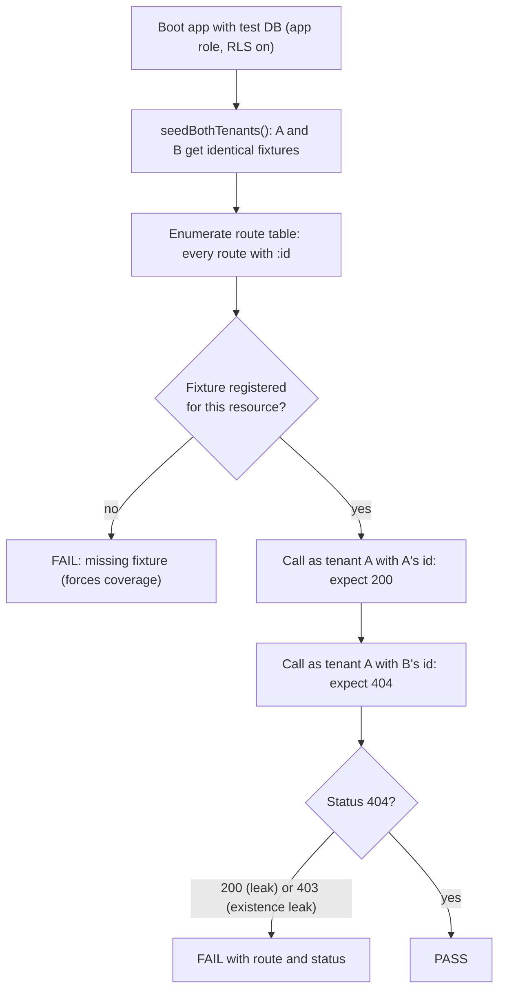
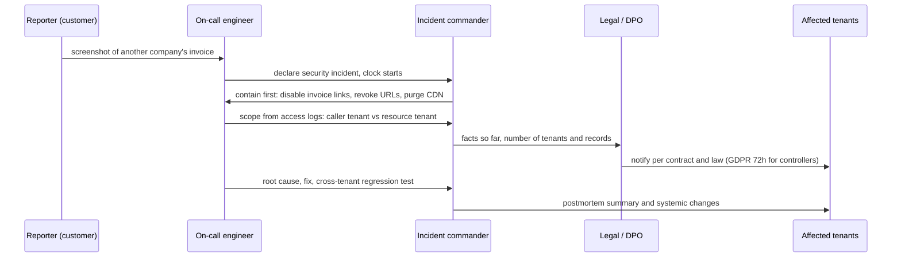
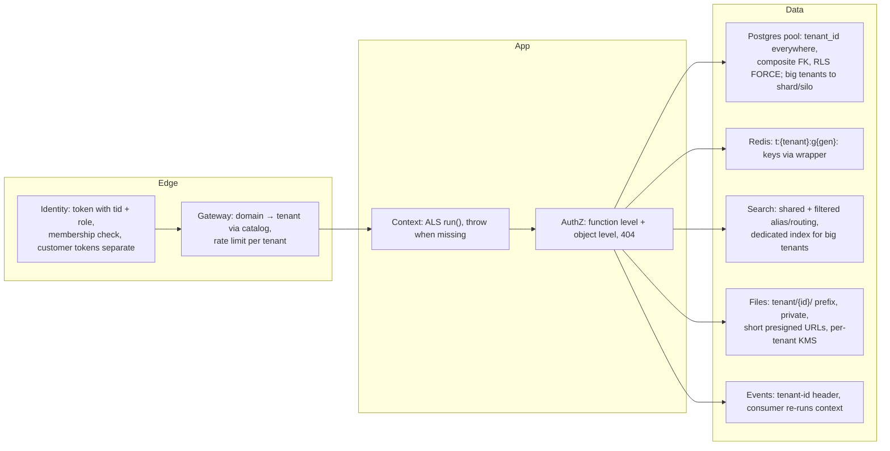

## Bối cảnh & vấn đề

Một nền tảng đã làm gần như mọi thứ ở các bài trước: tenant từ token đã verify, AsyncLocalStorage, repository bắt buộc, RLS, cache key có tenant. Một ngày, một khách hàng gửi email kèm screenshot: họ mở link hoá đơn trong email và thấy hoá đơn PDF của một công ty khác, có tên, địa chỉ và số tiền.

Sự cố này đặt ra hai loại câu hỏi. Câu hỏi **ngay lập tức**: chặn lại thế nào, ai khác bị ảnh hưởng, từ khi nào, phải báo cho ai trong bao lâu. Câu hỏi **hệ thống**: vì sao mọi lớp phòng thủ không bắt được, và làm sao để biết chắc không còn lỗi tương tự ở 300 endpoint khác. Câu trả lời "code review cẩn thận hơn" không đủ: reviewer đọc diff, còn leak thường nằm ở thứ **không có trong diff** (một route cũ, một job, một kênh phụ).

Bài này là phần kết của track: biến "không leak" thành thuộc tính được **kiểm chứng tự động**, xử lý sự cố khi nó vẫn xảy ra, kể lại một bug isolation trong phỏng vấn, và tổng hợp toàn bộ thành một thiết kế end-to-end.

## Khái niệm

### Fixture hai tenant

**Fixture hai tenant** là quy ước rằng **mọi** integration test tạo dữ liệu cho **ít nhất hai tenant** có cấu trúc giống nhau (tenant A và tenant B mỗi bên có customer, order, invoice, product), và test chạy dưới danh tính của A. Lý do: phần lớn bug thiếu filter **vô hình** khi DB chỉ có một tenant, vì "mọi dòng" và "dòng của tenant hiện tại" là một. Chỉ cần tenant B tồn tại, query thiếu filter sẽ trả thêm dữ liệu và assertion "list chỉ chứa id của A" thất bại.

Helper tạo dữ liệu nên sinh **song song** cho cả hai tenant bằng cùng một lời gọi (`seedBothTenants()`), để người viết test không phải nhớ.

**Interview angle:** câu "test leak có hệ thống" bắt đầu từ đây; nói "mọi test có hai tenant" là nền tảng cho mọi ý phía sau.

### Leak test tự sinh từ route table

Thay vì viết tay một test cross-tenant cho mỗi endpoint (và quên endpoint mới), **sinh test từ danh sách route** của app: duyệt mọi route có tham số id, với mỗi route tạo resource ở tenant B, gọi bằng token của tenant A, và kỳ vọng **404** (với list: kết quả không chứa id của B). Route mới thêm vào app tự động được test; route không có fixture thì **test fail** ("MISSING FIXTURE"), buộc người thêm route phải khai báo cách tạo dữ liệu cho nó.

Cách này kiểm tra hành vi từ bên ngoài, nên bắt được lỗi ở bất kỳ lớp nào: handler quên filter, service gọi repository sai, hay trả 403 thay vì 404.

**Interview angle:** follow-up "làm sao test route-based luôn cập nhật khi có endpoint mới?" có đáp án: sinh từ route table (hoặc OpenAPI spec), và fail khi thiếu fixture.

### Test ở tầng DB và lint cho kênh phụ

Ở tầng DB: chạy test bằng **đúng role của app** (không phải superuser); assert rằng không đặt tenant thì 0 dòng (hoặc lỗi), đặt tenant A thì không thấy dòng của B; và assert cấu hình (role không `BYPASSRLS`, mọi bảng tenant có `FORCE ROW LEVEL SECURITY`, như ở [bài RLS](/tracks/multi-tenancy/learn/postgres-rls)).

Kênh phụ không có RLS, nên kiểm tra bằng **cấu trúc code**: lint rule cấm import client Redis/ES/S3 thô ngoài module wrapper theo tenant; unit test cho wrapper (key luôn có prefix, gọi ngoài context thì ném lỗi); ES query builder chỉ nhận alias theo tenant; S3 key do server sinh với prefix `tenant/{id}/`. Mục tiêu là làm cho cách viết sai **không biên dịch được hoặc không qua CI**, thay vì dựa vào trí nhớ.

**Interview angle:** interviewer thường hỏi riêng về cache/search; trả lời bằng "wrapper bắt buộc + lint cấm client thô" cho thấy bạn nghĩ theo hệ thống.

### Tenant honeypot và giám sát ở production

Test không phủ hết production. **Tenant honeypot** (canary tenant) là một tenant giả trong production chứa dữ liệu có **dấu hiệu đặc biệt** (chuỗi ngẫu nhiên dài trong tên sản phẩm, email, địa chỉ). Một job theo dõi hoặc lớp response filter quét response, log, export của các tenant **khác**; nếu chuỗi canary xuất hiện ở đó, đó là bằng chứng leak và alert ngay. Kết hợp với **access log có tenant của caller và tenant của resource**: một dòng log mà hai giá trị khác nhau (ngoài platform staff có impersonation) là tín hiệu leak.

Cuối cùng là **pentest** định kỳ và **bug bounty**, với phạm vi nhấn mạnh vào authorization giữa tenant.

**Interview angle:** nhắc honeypot và log "caller tenant vs resource tenant" cho thấy bạn nghĩ cả về phát hiện ở production, không chỉ phòng ngừa.

### Incident response cho data leak

Một cross-tenant leak là **sự cố bảo mật** và có thể là **personal data breach** theo GDPR. Quy trình chuẩn có sáu bước: **Contain** (chặn rò rỉ tiếp: tắt tính năng hoặc endpoint, thu hồi link, purge cache/CDN); **Scope** (ai đã thấy gì, từ khi nào, dùng access log); **Root cause** (lớp nào hỏng); **Fix** kèm test hồi quy cross-tenant; **Notify** (legal/DPO, tenant bị ảnh hưởng, cơ quan quản lý nếu luật yêu cầu); **Postmortem** không đổ lỗi, tập trung vào "lớp phòng thủ nào lẽ ra phải bắt được".

Về thời hạn: GDPR điều 33 yêu cầu controller thông báo cho cơ quan giám sát **trong 72 giờ** kể từ khi biết về breach (trừ khi breach khó gây rủi ro cho quyền của cá nhân), và processor phải báo cho controller "không chậm trễ". Trong B2B2C, nền tảng thường là **processor** còn merchant là **controller** của dữ liệu khách hàng của họ, nên nghĩa vụ đầu tiên là báo cho merchant bị ảnh hưởng theo điều khoản DPA trong hợp đồng. Chi tiết pháp lý phải do legal quyết định; kỹ sư cần biết đồng hồ bắt đầu chạy và cần dữ liệu log để trả lời nhanh.

**Interview angle:** interviewer đánh giá thứ tự (contain trước, điều tra sau), khả năng trả lời "chính xác ai đã thấy gì" (phụ thuộc log có sẵn từ trước), và việc biết có nghĩa vụ thông báo có thời hạn.

## Cơ chế hoạt động

Leak test tự sinh chạy như sau trong CI:



Hai lời gọi cho mỗi route có mục đích khác nhau. Lời gọi với id của chính A kiểm tra fixture và route thật sự hoạt động (nếu nó cũng 404 thì test cross-tenant vô nghĩa). Lời gọi với id của B kiểm tra isolation. Kết quả 200 là leak dữ liệu; 403 là leak **sự tồn tại** (bài 2), cũng bị coi là fail. Cùng khung này mở rộng được cho `PUT`, `DELETE` (kỳ vọng 404 và dữ liệu của B không đổi) và list (không chứa id của B).

Còn đây là dòng thời gian xử lý sự cố leak:



Contain đi trước mọi thứ, kể cả trước khi hiểu nguyên nhân: tắt tính năng rẻ hơn nhiều so với để leak tiếp tục trong lúc điều tra. Scope phụ thuộc hoàn toàn vào dữ liệu **đã được ghi từ trước**: nếu access log không có tenant của caller và id resource, câu "ai đã thấy gì" không có lời đáp và phải giả định trường hợp xấu nhất.

## Ví dụ thực tế

### Leak test sinh từ route table (Express 5.2.1, chạy thật)

App có ba route; một route đúng, một route thiếu check tenant, một route check tenant nhưng trả 403:

```ts
app.get('/orders/:id', (req, res) => {
  const row = tables.orders.find((r) => r.id === req.params.id && r.tenantId === res.locals.tenantId);
  row ? res.json(row) : res.status(404).end();
});
app.get('/invoices/:id', (req, res) => {             // BUG: no tenant check
  const row = tables.invoices.find((r) => r.id === req.params.id);
  row ? res.json(row) : res.status(404).end();
});
app.get('/customers/:id', (req, res) => {
  const row = tables.customers.find((r) => r.id === req.params.id);
  if (!row) return res.status(404).end();
  if (row.tenantId !== res.locals.tenantId) return res.status(403).end();  // leaks existence
  res.json(row);
});
```

Harness đọc route table của chính app, không có danh sách viết tay:

```ts
const routes = (app as any).router.stack
  .filter((l: any) => l.route?.methods?.get && l.route.path.includes(':id'))
  .map((l: any) => l.route.path as string);
const fixtures: Record<string, { A: string; B: string }> = { orders: { A: 'o1', B: 'o2' }, invoices: { A: 'i1', B: 'i2' }, customers: { A: 'c1', B: 'c2' } };
for (const path of routes) {
  const f = fixtures[path.split('/')[1]];
  if (!f) { console.log(`MISSING FIXTURE ${path}`); failed++; continue; }
  const own = await fetch(url(path.replace(':id', f.A)), { headers: { authorization: 'Bearer tenant-A' } });
  const cross = await fetch(url(path.replace(':id', f.B)), { headers: { authorization: 'Bearer tenant-A' } });
  const ok = own.status === 200 && cross.status === 404;
  console.log(`${ok ? 'PASS' : 'FAIL'} GET ${path}  own=${own.status} cross=${cross.status}`);
}
```

```text
PASS GET /orders/:id  own=200 cross=404
FAIL GET /invoices/:id  own=200 cross=200
FAIL GET /customers/:id  own=200 cross=403
3 routes, 2 failing
```

Harness bắt được cả IDOR thật (`/invoices/:id` trả dữ liệu của B) và lỗi tinh vi hơn (`/customers/:id` trả 403, xác nhận customer `c2` tồn tại ở tenant khác). Trong codebase thật, lấy route từ OpenAPI spec hoặc router introspection của framework (Express `app.router.stack` trong bản 5, NestJS `DiscoveryService`), và registry fixture nằm cạnh module của resource.

### Test ở tầng DB bằng role app

```ts
// CI, connected as the application role (never superuser)
test('app role cannot see other tenants', async () => {
  await withTenantTx(TENANT_A, async (c) => {
    const r = await c.query('SELECT tenant_id FROM orders');                     // no WHERE on purpose
    expect(new Set(r.rows.map((x) => x.tenant_id))).toEqual(new Set([TENANT_A]));
  });
  const outside = await pool.query('SELECT count(*)::int AS n FROM orders');     // no tenant set
  expect(outside.rows[0].n).toBe(0);
});
```

Test này cố tình viết query **không có** `WHERE tenant_id` để chứng minh lớp RLS đứng vững một mình. Kết hợp với các query kiểm tra cấu hình (`rolbypassrls`, `relforcerowsecurity`) ở bài 5, nó ngăn một thay đổi migration vô tình tắt RLS hay đổi role.

### Sự cố hoá đơn PDF: đi qua từng bước

**Contain** (phút 0–30): tắt endpoint tải hoá đơn qua link email (feature flag), thu hồi mọi link chia sẻ đang hiệu lực, purge CDN theo path `/invoices/*`. Thông báo nội bộ, mở kênh incident, ghi dòng thời gian.

**Scope** (giờ 1–6): từ access log, lọc các request tải hoá đơn có `caller_tenant != resource_tenant`. Nếu log chỉ có URL mà không có tenant, phải join với bảng invoice để suy ra tenant của resource, và với session để suy ra tenant của caller; link công khai (không đăng nhập) thì không có caller tenant, chỉ có IP và thời điểm. Kết quả là danh sách (tenant bị lộ, số hoá đơn, số lần truy cập, khoảng thời gian).

**Root cause**: các giả thuyết thường gặp theo thứ tự khả năng: S3 key không có prefix tenant và tên file đoán được (`invoices/10234.pdf`); presigned URL có hạn quá dài và bị forward; cache/CDN key thiếu tenant; endpoint `GET /invoices/:id/pdf` thiếu check tenant (IDOR); job render PDF chạy dưới context sai (bài 3, callback pool hoặc biến module) nên ghi file của tenant A vào đường dẫn của tenant B.

**Fix**: sửa lớp hỏng, thêm test hồi quy cross-tenant cho đúng đường đi đó, và kiểm tra các đường tương tự (mọi loại file, mọi job render). **Notify**: legal/DPO quyết định nghĩa vụ; tenant bị ảnh hưởng nhận thông báo theo DPA. **Postmortem**: lớp nào lẽ ra phải bắt được (leak test không phủ link công khai? wrapper S3 không bắt buộc?), và hành động cụ thể có người chịu trách nhiệm.

Log cần có **trước** sự cố để trả lời "chính xác ai đã thấy gì": mỗi request ghi `caller_tenant_id`, `user_id` (hoặc share token id), `resource_type`, `resource_id`, `resource_tenant_id` (khi đọc được), status, thời điểm; giữ đủ lâu theo chính sách retention; và truy vấn được theo tenant.

### Kể một bug isolation theo STAR

Câu hỏi hành vi "kể một bug hoặc near-miss về tenant isolation" được chấm theo cấu trúc **STAR**: **Situation** (bug gì, ở đâu: thiếu filter trong export, cache key thiếu tenant, job chạy sai context), **Task** (mức ảnh hưởng, ai phát hiện: test, review, khách hàng, monitoring), **Action** (fix trước mắt, rồi thay đổi **hệ thống**: helper bắt buộc, lint rule, fixture hai tenant, RLS, leak test), **Result** (không tái diễn, số liệu nếu có). Kết bằng **reflection**: lớp phòng thủ nào nên có từ đầu, và bạn đã kiểm tra "còn chỗ nào khác cùng loại lỗi không" bằng cách nào (chạy leak test trên toàn bộ route, grep query trên bảng tenant, audit kênh phụ).

Hãy kể bằng trải nghiệm thật. Nếu chưa từng gặp incident, kể về lần bạn **chủ động tìm**: audit endpoint, viết leak test đầu tiên, phát hiện một near-miss trong review. Interviewer có kinh nghiệm nhận ra câu chuyện dựng lên qua follow-up, và một near-miss thật có giá trị hơn một incident bịa.

## Thiết kế isolation end-to-end cho nền tảng B2B2C

Câu hỏi thiết kế "tenant isolation cho API, DB, cache, search, file, event" là nơi mọi bài trong track gặp nhau. Một câu trả lời mạnh đi theo **đường đi của dữ liệu**, mỗi lớp một câu:



Bổ sung ba lớp xuyên suốt: **observability** (tenant id trong log và trace span, metric tổng không có tenant, top-N theo tenant), **testing** (fixture hai tenant, leak test sinh từ route, test DB bằng role app, honeypot), và **operations** (migration runner đa DB, tenant move qua catalog, deletion workflow có registry). Kết thúc bằng trade-off: pool mặc định để tối ưu chi phí, bridge theo tier và theo tải đo được, và con đường "nhấc" một tenant lên silo mà code không đổi.

Nếu chỉ có **một sprint**, đầu tư vào lớp nào trước? Câu trả lời hợp lý là **leak test tự động với fixture hai tenant**, vì nó đo được mọi lớp khác và biến các lỗ hổng hiện có thành danh sách việc cụ thể; hoặc RLS nếu codebase có nhiều raw SQL và tool nội bộ. Điều quan trọng là lập luận: chọn thứ giảm rủi ro lớn nhất trên đơn vị công sức, và nói rõ vì sao.

## Trade-offs & lựa chọn thay thế

| Cách phát hiện leak | Bắt được gì | Chi phí | Điểm mù |
| --- | --- | --- | --- |
| Code review | Lỗi hiển nhiên trong diff | Thời gian reviewer | Route cũ, job, kênh phụ, lỗi giữa nhiều file |
| Fixture hai tenant trong mọi test | Filter thiếu ở luồng được test | Thấp (một lần viết helper) | Luồng không có test |
| Leak test sinh từ route table | Mọi route có id, kể cả route mới | Trung bình (registry fixture) | Route không có id, job, kênh phụ |
| Test DB bằng role app | RLS/role/config sai | Thấp | Cache, search, file |
| Lint + wrapper cho kênh phụ | Key/query/path thiếu tenant | Thấp–trung bình | Code bỏ qua lint (suppress) |
| Honeypot + log caller vs resource tenant | Leak thật ở production | Trung bình | Chỉ phát hiện sau khi xảy ra |
| Pentest / bug bounty | Lỗi logic, chuỗi tấn công | Cao, định kỳ | Theo thời điểm |

Không có lớp nào đủ một mình. Thứ tự đầu tư hợp lý cho một team đang có hệ thống chạy: fixture hai tenant và leak test route (rẻ, bắt nhiều), rồi test DB + RLS, rồi wrapper/lint kênh phụ, rồi honeypot và log caller/resource tenant, và pentest định kỳ để kiểm tra chính các lớp trên.

## Edge cases & failure modes

- **Route không có `:id` nhưng vẫn leak**: `GET /reports?customerId=...`, `POST /search` với body. Leak test phải mở rộng cho query string và body, hoặc khai báo tham số resource trong OpenAPI để harness biết.
- **Leak qua lỗi**: message lỗi chứa dữ liệu của tenant khác (`duplicate key (email)=(...)`, stack trace có tham số). Test cũng phải kiểm tra body của response lỗi.
- **Leak qua thời gian phản hồi**: 404 cho resource không tồn tại nhanh hơn 404 cho resource thuộc tenant khác (vì có thêm bước check), cho phép dò sự tồn tại. Đặt filter tenant **trong** query để hai trường hợp có cùng đường đi.
- **Export và webhook**: file export sinh bởi job, webhook gửi ra ngoài; không đi qua route nên leak test không thấy. Cần test riêng cho job (chạy job dưới tenant A, kiểm tra output không chứa dữ liệu B).
- **Test chạy bằng superuser**: mọi test pass vì superuser bypass RLS, còn lớp app thì đúng tình cờ. Cấu hình CI dùng role app.
- **Log thiếu trường cần thiết khi sự cố xảy ra**: không trả lời được scope, buộc phải báo cáo trường hợp xấu nhất cho mọi tenant. Thiết kế log trước, không phải sau.
- **Honeypot bị lộ**: dữ liệu canary bị lọc ra khỏi analytics nhưng vô tình xuất hiện trong báo cáo cho tenant thật. Đánh dấu tenant honeypot trong catalog và loại khỏi mọi tính toán nghiệp vụ.

## Pitfalls

- ❌ "Code review kỹ là đủ" → ✅ leak test tự động + fixture hai tenant, vì leak thường nằm ngoài diff.
- ❌ Test chỉ có một tenant trong DB → ✅ luôn seed hai tenant, vì query thiếu filter vô hình khi chỉ có một tenant.
- ❌ Danh sách endpoint để test viết tay → ✅ sinh từ route table/OpenAPI và fail khi thiếu fixture (chạy thật: bắt được 2/3 route lỗi).
- ❌ Chấp nhận 403 cho resource của tenant khác → ✅ test kỳ vọng đúng 404.
- ❌ Khi có sự cố, điều tra trước rồi mới chặn → ✅ contain trước (tắt tính năng, thu hồi link, purge cache).
- ❌ Access log không có tenant của caller và resource → ✅ ghi từ đầu, vì không có nó thì không trả lời được "ai đã thấy gì".
- ❌ Bịa một incident trong câu hỏi hành vi → ✅ kể near-miss thật hoặc cách bạn chủ động tìm lỗi.

## Tóm tắt

- "Không leak" phải là thuộc tính được **kiểm chứng tự động**, không phải kết quả của code review.
- Fixture hai tenant trong mọi test; leak test sinh từ route table, kỳ vọng 200 cho id của mình và 404 cho id của tenant khác (chạy thật: bắt được IDOR và 403 lộ tồn tại).
- Test DB bằng role app, không đặt tenant thì 0 dòng; kiểm tra cấu hình RLS/role trong CI; wrapper + lint cho cache, search, file.
- Production: honeypot tenant, log "caller tenant vs resource tenant", pentest định kỳ.
- Incident: contain → scope (từ log có sẵn) → root cause → fix + test hồi quy → notify (legal, tenant; GDPR 72 giờ cho controller) → postmortem không đổ lỗi.
- Câu hành vi: STAR + thay đổi hệ thống + cách kiểm chứng không còn lỗi cùng loại; kể chuyện thật.
- Thiết kế end-to-end đi theo đường đi dữ liệu: identity → edge → context → authz → DB/cache/search/files/events, cộng observability, testing, operations.
