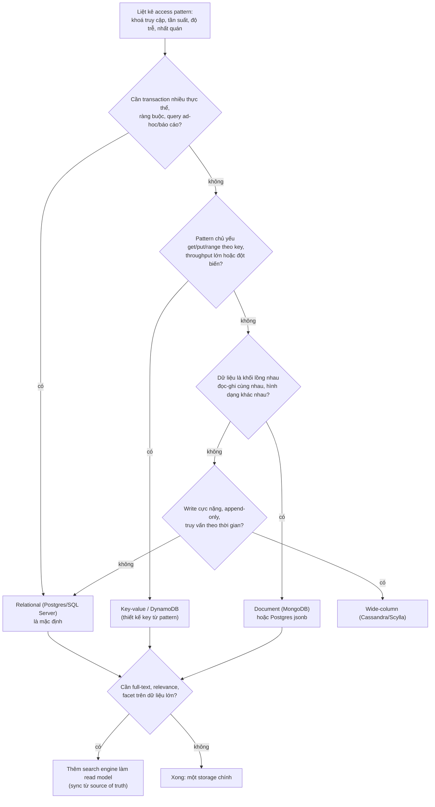
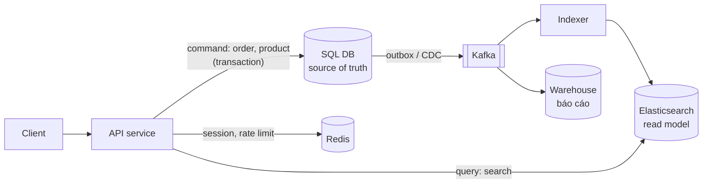

## Bối cảnh & vấn đề

Một team bắt đầu service quản lý đơn hàng mới. Trong buổi họp thiết kế có người đề xuất: "Dùng MongoDB đi, schema còn đổi nhiều, lại scale tốt hơn Postgres." Sáu tháng sau, team phải viết một báo cáo doanh thu theo tháng, theo tenant, theo danh mục. Dữ liệu order nằm trong một collection, product ở collection khác, customer ở collection thứ ba. Mỗi báo cáo là một aggregation pipeline dài 80 dòng với ba `$lookup`, chạy 40 giây trên primary và làm checkout chậm theo. Cùng lúc đó, hoá ra "schema đổi nhiều" vẫn cần migration: document cũ không có field `currency`, nên mọi chỗ đọc phải xử lý hai phiên bản.

Kịch bản ngược lại cũng có thật. Một hệ thống lưu session và giỏ hàng cho flash sale nằm trong Postgres: 50.000 request mỗi giây vào giờ mở bán, mỗi request chỉ là `SELECT ... WHERE session_id = $1` và `UPDATE`. Connection pool cạn, primary CPU 100%, còn đội vận hành phải lo vacuum một table bị update liên tục. Đây là access pattern key-value thuần tuý, và một key-value store (Redis, DynamoDB) phục vụ nó rẻ hơn, đơn giản hơn nhiều.

Cả hai sai lầm có chung một gốc: chọn database theo **khẩu hiệu** ("NoSQL scale tốt", "SQL an toàn") thay vì theo **access pattern**, tức là danh sách cụ thể các câu hỏi mà ứng dụng sẽ hỏi dữ liệu, kèm tần suất và yêu cầu nhất quán. Bài này dựng khung để trả lời câu "khi nào NoSQL?" một cách có căn cứ, giới thiệu các họ NoSQL, làm rõ CAP/PACELC thật sự nói gì, và đặt Elasticsearch vào đúng chỗ của nó: một **read model** bên cạnh database chính.

**Interview angle:** câu "khi nào chọn NoSQL?" là câu mở đầu để đo xem bạn nghĩ theo access pattern hay theo trend. Câu trả lời mạnh luôn có "tuỳ vào..." kèm tín hiệu cụ thể, và dám nói "ở đây Postgres đủ".

## Khái niệm

### Access pattern là gì và vì sao nó quyết định mọi thứ

**Access pattern** là một câu hỏi cụ thể ứng dụng hỏi dữ liệu, ví dụ "lấy order 991 kèm các line item", "liệt kê đơn của customer 7 trong tháng 9, mới nhất trước", "đếm doanh thu theo danh mục trong quý". Mỗi access pattern có ba thuộc tính: **khoá truy cập** (tìm theo gì), **tần suất và độ trễ yêu cầu** (10.000 lần/giây dưới 10 ms hay một lần/ngày), và **yêu cầu nhất quán** (phải thấy ngay bản ghi vừa ghi hay chậm vài giây cũng được).

Database quan hệ được thiết kế cho điều ngược lại: bạn **chuẩn hoá** dữ liệu theo thực thể (entity) trước, rồi hỏi bất cứ câu gì sau bằng SQL, join và planner. Cái giá là mọi query phức tạp đều dựa vào planner và index, và scale ngang khó. NoSQL kiểu DynamoDB đảo ngược: bạn liệt kê access pattern **trước**, rồi thiết kế key sao cho mỗi pattern là một lần đọc thẳng vào đúng partition. Query không nằm trong danh sách thì gần như không làm được một cách rẻ.

Ví dụ: với access pattern "lấy order kèm items", Postgres làm bằng `SELECT ... FROM orders JOIN order_items`. DynamoDB đặt order và items **cùng partition key** `TENANT#42#ORDER#991` để một `Query` lấy hết (chi tiết ở [DynamoDB single-table](/tracks/nosql-search/learn/dynamodb-single-table)). MongoDB **nhúng** items vào document order. Ba cách, cùng một câu hỏi.

**Interview angle:** interviewer thường hỏi tiếp "vậy nếu access pattern đổi thì sao?". Đó là điểm yếu thật của NoSQL thiết kế theo key: phải thêm index phụ, backfill, hoặc đưa dữ liệu sang hệ khác.

### Các họ NoSQL

"NoSQL" là tên gọi chung cho nhiều mô hình dữ liệu rất khác nhau, chỉ giống nhau ở chỗ không lấy table quan hệ + SQL làm giao diện chính. Nên nói "họ" (family) thay vì "NoSQL" chung chung:

- **Key-value**: một map khổng lồ `key → value`. Value thường "mờ" với database (Redis string/hash, Memcached) hoặc là item có attribute (DynamoDB). Cực nhanh cho get/put theo key. Use case production: session, cache, rate limit, giỏ hàng, feature flag, idempotency key.
- **Document**: value là document JSON/BSON có cấu trúc mà engine hiểu được, nên index và query được vào field lồng nhau. MongoDB, Couchbase, Firestore, Amazon DocumentDB. Use case: catalog sản phẩm có attribute khác nhau theo danh mục, user profile, CMS, dữ liệu cấu hình.
- **Wide-column** (hay column-family): row có **row key**, trong đó các cột thưa, sắp xếp theo **clustering key**. Cassandra, ScyllaDB, HBase, Bigtable. Lưu bằng LSM-tree nên ghi rất rẻ. Use case: time-series, event log, IoT, message inbox, write cực nặng.
- **Graph**: node + edge là công dân hạng nhất, query là phép duyệt (traversal). Neo4j, Amazon Neptune. Use case: gợi ý "bạn của bạn", phát hiện vòng gian lận (fraud ring), knowledge graph, phân quyền dạng quan hệ.
- **Search engine**: Elasticsearch, OpenSearch, Solr. Xây trên inverted index của Lucene, tối ưu cho full-text, relevance, facet, aggregation, log analytics. Thường được xếp riêng vì nó không định vị làm database chính.

DynamoDB hay được gọi là key-value, nhưng AWS mô tả nó là **key-value và document**, và mô hình partition key + sort key của nó rất giống wide-column: trong một partition key có nhiều item sắp xếp theo sort key, mỗi item có tập attribute khác nhau. Vì vậy nhiều người xếp nó vào cả hai họ.

**Interview angle:** follow-up hay gặp là "vì sao DynamoDB cũng được gọi là wide-column?". Câu trả lời: partition key ≈ row key, sort key ≈ clustering column, item có attribute thưa. Nhận ra điểm này cho thấy bạn hiểu mô hình dữ liệu chứ không chỉ thuộc tên.

### Tín hiệu nên chọn NoSQL, và tín hiệu nên ở lại relational

Tín hiệu **nghiêng về NoSQL** (họ tương ứng trong ngoặc):

- Access pattern **biết trước, ổn định, đơn giản**: get/put theo key, range theo key, không cần join ad-hoc (DynamoDB, Cassandra).
- Throughput rất lớn hoặc **đột biến** (flash sale, game launch) mà bạn không muốn tự quản lý capacity, hoặc cần multi-region active-active (DynamoDB global tables, Cassandra).
- Dữ liệu là **một khối lồng nhau** đọc và ghi cùng nhau, hình dạng khác nhau giữa các bản ghi (MongoDB).
- Write cực nặng, append-only, truy vấn theo thời gian (wide-column).
- Truy vấn là duyệt quan hệ nhiều bước mà SQL phải viết recursive CTE (graph).
- Full-text, relevance, facet (search engine, **bổ sung** cho DB chính).

Tín hiệu **ở lại relational**:

- Nhiều quan hệ giữa thực thể, cần **ràng buộc toàn vẹn** (foreign key, unique, check).
- **Transaction nhiều thực thể** là chuyện hằng ngày: order + inventory + payment + ledger.
- **Query ad-hoc, báo cáo**, admin search nhiều điều kiện, câu hỏi chưa biết trước.
- Quy mô vừa phải: một Postgres managed tốt chịu được hàng chục nghìn TPS, vài TB dữ liệu. Phần lớn hệ thống không bao giờ vượt ngưỡng đó.
- Team thạo SQL, cần debug và vận hành dễ.

"Schema đổi nhiều" **không** phải lý do đủ mạnh. Postgres có `jsonb` với GIN index (xem [JSONB](/tracks/sql-postgres/learn/index-types-jsonb)), cho phép phần "linh hoạt" nằm trong một cột JSON trong khi phần cốt lõi vẫn có ràng buộc. Còn ở MongoDB, schema không biến mất: nó chuyển từ database sang **code ứng dụng**, và bạn vẫn phải xử lý document cũ thiếu field mới.

**Interview angle:** follow-up của câu 001 là "team muốn MongoDB vì schema đổi nhiều, bạn phản biện thế nào?". Trả lời: hỏi schema đổi ở phần nào, dữ liệu có quan hệ không, có báo cáo không; đề xuất `jsonb` cho phần động; nếu vẫn chọn MongoDB thì bật `$jsonSchema` validator và versioning document.

### CAP và PACELC nói thật gì

**CAP theorem** (Brewer, chứng minh bởi Gilbert và Lynch) nói: khi hệ phân tán bị **network partition** (P, các node không liên lạc được với nhau), bạn phải chọn giữa **Consistency** (C, ở đây nghĩa hẹp là linearizability: mọi read thấy write mới nhất) và **Availability** (A, mọi request tới node còn sống đều được trả lời không lỗi). Vì partition là điều không tránh được trong mạng thật, câu hỏi thực tế là "khi partition xảy ra, hệ này từ chối request hay trả dữ liệu có thể cũ?".

CAP hay bị dùng sai theo ba cách. Một, dán nhãn cả hệ thống là "CP" hay "AP", trong khi phần lớn database cho **chỉnh theo từng request** (DynamoDB có eventually consistent read và `ConsistentRead: true`; MongoDB có read/write concern). Hai, nói "RDBMS là CA": một Postgres đơn node không phải hệ phân tán nên CAP không áp dụng; khi thêm replica async, nó hành xử như mọi hệ khác. Ba, quên rằng CAP chỉ nói về lúc **có partition**, trong khi 99,9% thời gian không có partition.

**PACELC** (Abadi) bổ sung phần còn thiếu: **if Partition → chọn A hoặc C; Else → chọn Latency hoặc Consistency**. Ngay cả khi mạng khoẻ, muốn đọc nhất quán mạnh thì phải chờ đồng bộ với replica khác (tăng latency). DynamoDB mặc định là PA/EL (eventual read rẻ và nhanh), Cassandra PA/EL theo cấu hình mặc định, còn hệ đồng thuận kiểu Spanner là PC/EC. Nhãn của MongoDB tranh cãi: bài gốc của Abadi xếp nó PA/EC, nhưng với mặc định hiện đại (`w: "majority"`, đọc từ primary) nó hành xử gần PC/EC hơn. Chính điều đó cho thấy nhãn phụ thuộc cấu hình.

**Interview angle:** interviewer senior không muốn nghe định nghĩa CAP; họ muốn nghe "với DynamoDB, read mặc định có thể cũ, tôi dùng `ConsistentRead` ở chỗ nào và chỗ nào không cần". Nối CAP về quyết định cụ thể.

### Polyglot persistence và CQRS

**Polyglot persistence** là dùng nhiều loại storage trong cùng một hệ thống, mỗi loại cho access pattern nó giỏi nhất: Postgres cho order và thanh toán, Redis cho session và rate limit, Elasticsearch cho product search, S3 + warehouse cho báo cáo. Cái giá là **dữ liệu bị nhân bản** qua nhiều nơi, nên phải có cơ chế đồng bộ và một nơi được coi là **source of truth** (nguồn sự thật: khi hai nơi khác nhau, nơi này thắng).

**CQRS** (Command Query Responsibility Segregation) là tách mô hình **ghi** (command, nơi áp dụng business rule và transaction) khỏi mô hình **đọc** (query, được tối ưu cho cách hiển thị). Pattern "DB chính + search index" chính là một dạng CQRS: ghi vào Postgres/SQL Server, rồi một **projection** bất đồng bộ đẩy dữ liệu đã denormalize sang Elasticsearch để đọc. Read model có thể trễ, có thể bị xoá và dựng lại từ source of truth bất cứ lúc nào.

Ví dụ: API `PUT /products/991` ghi vào SQL Server trong một transaction, kèm một dòng outbox. Indexer đọc outbox (hoặc CDC), load product + category + tồn kho, build document và index vào ES. API `GET /search?q=ao+thun` chỉ đọc ES. Cách làm pipeline này đúng khi có lỗi nằm ở bài [đồng bộ DB → ES](/tracks/nosql-search/learn/db-es-sync-indexer).

### Vì sao Elasticsearch không nên là database chính cho order

Elasticsearch lưu JSON, có API CRUD, có replica, nên nhìn qua giống một document database. Nhưng nó thiếu những thứ mà dữ liệu giao dịch cần:

- **Không có transaction nhiều document**. Mỗi thao tác index/update/delete chỉ atomic trên một document. Không thể "trừ tồn kho và tạo order" cùng lúc.
- **Không có ràng buộc** ngoài `_id` duy nhất: không foreign key, không unique trên field khác (không chặn được hai order cùng `orderNumber`).
- **Near real-time**: document mới chỉ search thấy sau lần **refresh** kế tiếp (mặc định mỗi 1 giây với index đang được search). Đọc-sau-ghi qua `_search` có thể không thấy bản ghi vừa tạo (chi tiết ở [shard & refresh](/tracks/nosql-search/learn/shards-refresh-cluster)).
- **Mapping khó đổi**: đổi kiểu field phải tạo index mới và reindex toàn bộ.
- **Lịch sử vận hành**: các phiên bản cũ (trước 7.x) có nguy cơ split brain khi cấu hình `minimum_master_nodes` sai; cluster cấu hình kém mà không có snapshot từng mất dữ liệu thật. Phiên bản hiện đại đã tốt hơn nhiều, nhưng cộng đồng vẫn khuyên không dùng làm nơi lưu duy nhất.

Ngược lại, ES là lựa chọn tuyệt vời làm **read model**: trang admin "tìm order theo tên khách, số điện thoại, khoảng ngày, trạng thái" là use case kinh điển. Dữ liệu gốc ở DB, ES được dựng lại được.

**Interview angle:** câu hỏi "ES có làm DB chính được không?" là bẫy nhỏ. Trả lời "không nên" kèm ba lý do cụ thể (transaction, near real-time, mapping) và đề xuất vai trò read model, rồi nối sang CQRS nếu được hỏi tiếp.

## Cơ chế hoạt động

Quy trình chọn storage nên chạy từ access pattern chứ không từ tên công nghệ. Sơ đồ sau là cây quyết định rút gọn mà bạn có thể nói trong phỏng vấn:



Cây này có ba điểm cần giải thích. Thứ nhất, nhánh đầu tiên là **relational**, không phải vì SQL "tốt hơn" mà vì nó chịu được sự thay đổi yêu cầu tốt nhất: khi chưa chắc access pattern, bạn muốn một hệ cho phép hỏi câu mới mà không phải thiết kế lại. Thứ hai, nhánh "Document" có ghi "hoặc Postgres jsonb": với nhiều team, lợi ích của document model đạt được mà không cần thêm hệ thống. Thứ ba, **search engine không nằm ở cùng tầng** với các lựa chọn kia. Nó là tầng đọc thêm vào sau, bất kể database chính là gì, và luôn kéo theo một pipeline đồng bộ.

Một hệ thống thật thường ra nhiều nhánh cùng lúc. Sơ đồ dưới cho thấy luồng dữ liệu của một nền tảng e-commerce điển hình theo kiểu polyglot + CQRS:



Chiều mũi tên nói lên source of truth: dữ liệu **chảy ra** từ SQL DB sang ES và warehouse, không bao giờ chảy ngược. Nếu ES mất hết, bạn dựng lại từ SQL. Nếu Redis mất session, user đăng nhập lại. Nếu SQL mất dữ liệu, đó mới là sự cố thật. Đặt câu hỏi "mất storage này thì sao?" cho từng hộp là cách nhanh nhất để xác định vai trò của nó.

## Ví dụ thực tế

### Liệt kê access pattern cho order service trước khi chọn database

Bảng dưới là bước bắt buộc trước khi trả lời câu "DynamoDB hay Postgres cho order service?". Số liệu là ví dụ cho một nền tảng vừa.

| # | Access pattern | Khoá | Tần suất | Nhất quán |
|---|---|---|---|---|
| 1 | Lấy order kèm items | orderId | 2.000/s | đọc-sau-ghi |
| 2 | Đơn của customer, mới nhất trước | customerId + thời gian | 500/s | vài giây ok |
| 3 | Tạo order + trừ tồn kho + giữ payment | nhiều thực thể | 300/s, đỉnh 3.000/s | transaction |
| 4 | Admin: tìm order theo tên/SĐT/trạng thái/khoảng ngày | nhiều điều kiện | 5/s | vài giây ok |
| 5 | Báo cáo doanh thu theo tháng/tenant/danh mục | aggregate | 1/ngày | cuối ngày ok |

Đọc bảng: pattern 1 và 2 là key/range thuần tuý, DynamoDB làm rất tốt. Pattern 3 cần transaction nhiều thực thể; DynamoDB có `TransactWriteItems` (tối đa 100 action, tốn gấp đôi capacity), Postgres làm tự nhiên. Pattern 4 là search nhiều điều kiện, không database nào làm tốt bằng index thường, cần ES hoặc Postgres với nhiều index/FTS. Pattern 5 là analytics, với DynamoDB phải export sang S3/warehouse; với Postgres chạy được trên replica. Kết luận hợp lý ở quy mô này: **Postgres** cho 1, 2, 3, 5 (replica cho 5), ES cho 4. DynamoDB chỉ thắng nếu pattern 1–2 lên tới hàng chục nghìn mỗi giây, multi-region, và team chấp nhận thêm pipeline cho 4 và 5.

### Cùng một giỏ hàng trong ba mô hình

Để cảm nhận "mô hình theo access pattern", đây là giỏ hàng của user 42 trong ba họ NoSQL:

```text
# Key-value (Redis hash): pattern "lấy/sửa giỏ của user đang hoạt động", tự hết hạn
HSET cart:user:42 prod_001 2 prod_073 1
EXPIRE cart:user:42 3600
HGETALL cart:user:42
1) "prod_001"
2) "2"
3) "prod_073"
4) "1"
```

```json
// Document (MongoDB): pattern "giỏ bền vững, hiển thị kèm tên và giá lúc thêm"
{
  "_id": "cart_user_42",
  "userId": 42,
  "items": [
    { "productId": "prod_001", "qty": 2, "nameSnapshot": "Bàn phím cơ", "priceSnapshot": 1290000 },
    { "productId": "prod_073", "qty": 1, "nameSnapshot": "Keycap PBT", "priceSnapshot": 199000 }
  ],
  "updatedAt": "2026-09-30T10:42:00Z"
}
```

```text
# Wide-column (Cassandra CQL): pattern "mọi hành động trên giỏ theo thời gian" cho analytics
CREATE TABLE cart_events (
  user_id bigint, event_ts timestamp, event_type text, product_id text, qty int,
  PRIMARY KEY (user_id, event_ts)
) WITH CLUSTERING ORDER BY (event_ts DESC);
```

Ba mô hình phục vụ ba câu hỏi khác nhau về cùng một "giỏ hàng". Một hệ thống thật có thể dùng cả ba. Điều quan trọng là mỗi lựa chọn bắt nguồn từ một access pattern cụ thể, không phải từ sở thích.

### Checklist câu hỏi trước khi đồng ý dùng DynamoDB cho order service

Khi một team đề xuất DynamoDB thay Postgres, các câu hỏi nên đặt ra, theo thứ tự quan trọng:

1. **Access pattern đã liệt kê đủ và ổn định chưa?** Có báo cáo, admin search, export không? Mỗi cái sẽ cần GSI, ES hoặc warehouse.
2. **Quy mô thật là bao nhiêu?** Nếu đỉnh 3.000 write/s, một Postgres managed (RDS/Aurora) chịu được. DynamoDB đáng giá khi quy mô hoặc độ đột biến vượt xa, hoặc cần multi-region active-active.
3. **Transaction nhiều thực thể**: order + inventory + payment có cần atomic không? `TransactWriteItems` giới hạn 100 action, tốn gấp đôi WCU, conflict thì cả transaction fail.
4. **Team có kinh nghiệm single-table design không?** Chi phí học, debug (dữ liệu nhìn trong console khó đọc), onboarding.
5. **Chi phí**: on-demand vs provisioned; mỗi GSI nhân thêm write cost; item to thì tốn RCU/WCU.
6. **Lock-in và dev/test**: DynamoDB Local cho test, migration khi access pattern đổi (backfill GSI, rewrite key).
7. **Báo cáo tài chính** làm thế nào: DynamoDB export to S3 + Athena/warehouse, hoặc Streams → pipeline.

Kết luận nên là **có điều kiện**: "Nếu pattern 1–2 chiếm 95% traffic, cần multi-region và team đã quen single-table, DynamoDB hợp lý và báo cáo đi qua export to S3. Nếu không, Postgres + read replica + ES cho search ít rủi ro hơn."

## Trade-offs & lựa chọn thay thế

| Nhu cầu | Relational (Postgres/SQL Server) | DynamoDB | MongoDB | Cassandra | Elasticsearch |
|---|---|---|---|---|---|
| Transaction nhiều thực thể | Mạnh, tự nhiên | Có (`TransactWriteItems`, ≤100 action, 2× capacity) | Có (multi-document, tốn hơn) | Hạn chế (LWT trong một partition) | Không |
| Query ad-hoc / join | Mạnh | Yếu, phải biết trước pattern | Khá (`$lookup`, aggregation) | Yếu | Không join; denormalize |
| Full-text + relevance | Cơ bản (FTS, `pg_trgm`) | Không | Có (Atlas Search) | Không | Mạnh nhất |
| Scale ngang | Khó hơn (Citus, sharding thủ công) | Tự động | Sharding có sẵn | Tuyến tính | Shard có sẵn |
| Nhất quán mặc định | Mạnh trên primary | Eventual read, chọn strong được | Mạnh trên primary (`w: majority`) | Tuỳ chỉnh (ONE/QUORUM) | Near real-time |
| Vận hành | Trung bình | Managed hoàn toàn | Trung bình hoặc Atlas | Nặng | Nặng (heap, shard, upgrade) |

Khi nào chọn cái nào, nói bằng lời: **relational là mặc định** cho dữ liệu nghiệp vụ có quan hệ và transaction, và cho mọi hệ chưa chắc access pattern. **DynamoDB** khi pattern là key/range đã biết, cần throughput lớn hoặc đột biến với vận hành tối thiểu, đặc biệt trong hệ sinh thái AWS serverless. **MongoDB** khi dữ liệu thật sự là document lồng nhau, đọc-ghi cả khối, và team muốn query phong phú hơn DynamoDB; cân nhắc Postgres `jsonb` trước. **Cassandra/Scylla** cho write rất nặng dạng time-series, khi team đủ sức vận hành. **Elasticsearch** không thay thế cái nào ở trên; nó là tầng đọc cho search và analytics.

Lựa chọn thay thế "không thêm hệ thống": Postgres với `jsonb` + GIN cho schema linh hoạt, partitioning cho dữ liệu theo thời gian, `tsvector`/`pg_trgm` cho search cơ bản, read replica cho báo cáo. Nhiều công ty đi rất xa chỉ với Postgres. Bài [khi nào không nên thêm ES](/tracks/nosql-search/learn/drift-search-design) đi sâu phần search.

## Edge cases & failure modes

- **Access pattern mới xuất hiện sau khi go-live**: với DynamoDB, thêm GSI được (backfill tự động, tốn WCU), nhưng pattern cần filter nhiều chiều hoặc aggregate thì không có cách rẻ. Hệ thống bị kéo sang dùng `Scan` (đắt, chậm) hoặc phải thêm ES/warehouse. Đây là rủi ro lớn nhất khi chọn NoSQL quá sớm.
- **"Schemaless" nhưng dữ liệu bẩn**: MongoDB không có validator thì document cũ có `price` là string, document mới là number. Query `{ price: { $gt: 100 } }` bỏ qua document có price là string mà không báo lỗi. Hậu quả hiện ra ở báo cáo, rất muộn.
- **Hai storage lệch nhau (drift)**: polyglot đồng nghĩa với dữ liệu nhân bản. Pipeline đồng bộ lỗi mà không ai biết thì search hiển thị sản phẩm đã xoá hoặc giá cũ (xem [drift](/tracks/nosql-search/learn/drift-search-design)).
- **Eventual consistency lộ ra UI**: user tạo order rồi được redirect sang trang "đơn của tôi" đọc từ GSI hoặc ES, và không thấy đơn vừa tạo. Cần read-your-writes: đọc từ primary/source of truth cho trang ngay sau ghi, hoặc cập nhật lạc quan ở client.
- **Network partition thật**: DynamoDB global tables với ghi ở hai region cùng lúc giải quyết xung đột bằng **last writer wins** (theo mặc định), nên một trong hai update biến mất lặng lẽ (verify: AWS hiện có thêm chế độ multi-region strong consistency cho global tables).
- **ES bị dùng làm DB chính rồi cluster red**: một primary shard mất mà không có snapshot, dữ liệu đó không lấy lại được từ đâu.

## Pitfalls

- ❌ "NoSQL luôn nhanh hơn và scale tốt hơn" → ✅ NoSQL nhanh cho **đúng access pattern nó được thiết kế**; query ngoài pattern thường chậm hơn SQL nhiều lần. Postgres đơn node chịu được phần lớn workload thực tế.
- ❌ Chọn MongoDB vì "schema đổi nhiều" → ✅ hỏi phần nào đổi; dùng `jsonb` cho phần động; nếu chọn MongoDB thì vẫn có schema trong code, bật validator, có kế hoạch migrate document cũ.
- ❌ Dán nhãn "DynamoDB là AP, MongoDB là CP" rồi dừng → ✅ nói về lựa chọn nhất quán **theo request** (ConsistentRead, read/write concern) và PACELC (latency vs consistency khi không có partition).
- ❌ Dùng Elasticsearch làm nơi lưu order duy nhất → ✅ DB là source of truth, ES là read model dựng lại được; có pipeline sync và reconcile.
- ❌ Chọn DynamoDB trước khi liệt kê access pattern → ✅ viết bảng pattern (khoá, tần suất, nhất quán) trước; nếu không liệt kê được, đó là tín hiệu chọn relational.
- ❌ Thêm database mới cho mỗi nhu cầu nhỏ → ✅ mỗi hệ thống thêm là một thứ phải on-call, backup, upgrade, bảo mật; chỉ thêm khi lợi ích đo được lớn hơn chi phí vận hành.

## Tóm tắt

- Chọn database theo **access pattern** (khoá, tần suất, độ trễ, nhất quán), không theo khẩu hiệu.
- Các họ NoSQL: key-value (session, cache), document (catalog, profile), wide-column (time-series, write nặng), graph (quan hệ nhiều bước), search engine (full-text, bổ sung cho DB).
- Relational là mặc định khi có quan hệ, transaction nhiều thực thể, query ad-hoc, báo cáo, hoặc khi chưa chắc pattern. Postgres `jsonb` phủ phần lớn nhu cầu "schema linh hoạt".
- CAP chỉ nói về lúc partition và định nghĩa C rất hẹp; PACELC thêm trade-off latency vs consistency lúc bình thường. Nhất quán thường chỉnh được theo request.
- Polyglot persistence cần một **source of truth** rõ ràng và pipeline đồng bộ; DB + search index là một dạng CQRS.
- Elasticsearch không làm DB chính: không transaction nhiều document, không ràng buộc, near real-time, mapping khó đổi. Dùng nó làm read model dựng lại được.
- Trước khi đồng ý DynamoDB: hỏi pattern, quy mô thật, transaction, kinh nghiệm team, chi phí GSI, và báo cáo sẽ đi đường nào.
