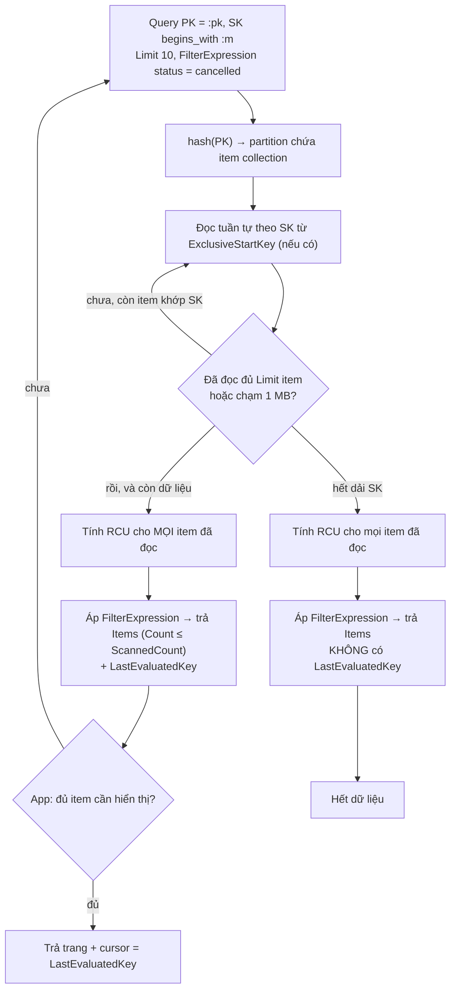
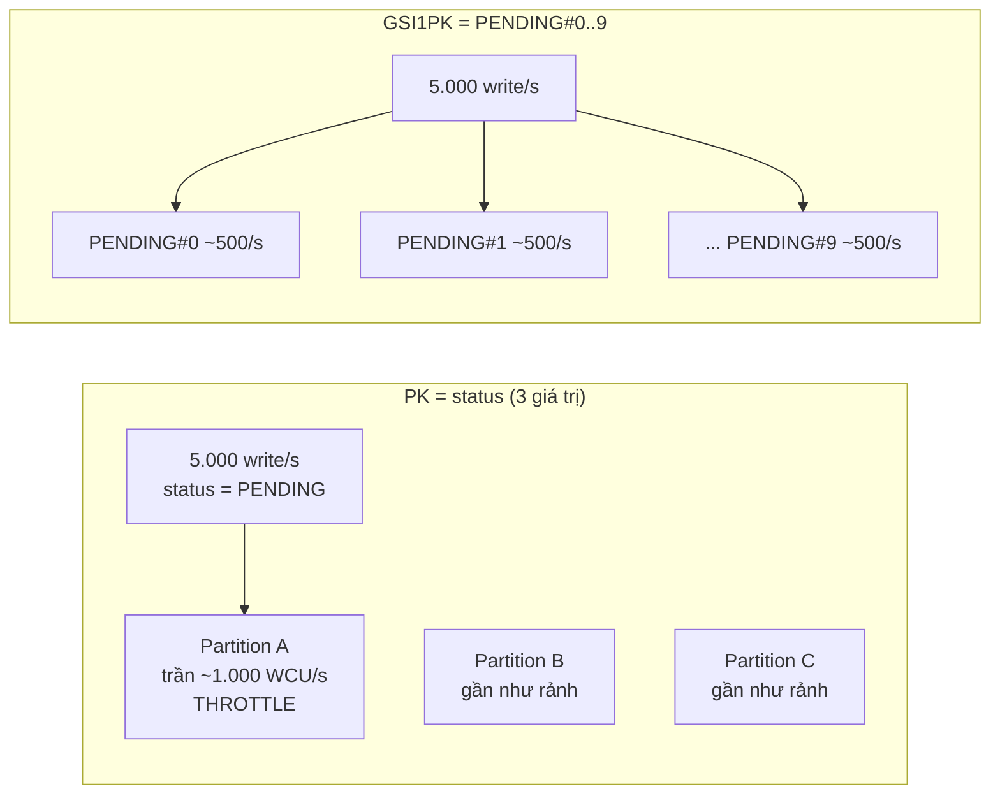

## Bối cảnh & vấn đề

Một team dùng DynamoDB làm hàng đợi job. Table `jobs` có partition key là `status` và sort key là `createdAt#jobId`. Worker lấy việc bằng `Query PK = 'PENDING'` sắp theo thời gian. Thiết kế nhìn rất gọn. Mỗi sáng lúc 8 giờ, khi batch import đổ vào 5.000 job mỗi giây, CloudWatch báo `ProvisionedThroughputExceededException` và `ThrottledRequests` tăng vọt, trong khi biểu đồ **consumed capacity** của cả table chỉ ở 30% mức provisioned. Team tăng capacity gấp đôi. Throttle không giảm.

Lý do là DynamoDB không có "một cái máy" chứa table. Table được chia thành nhiều **partition** vật lý, và **mỗi partition có trần throughput riêng**. Partition key quyết định item nằm ở partition nào. Với `status` chỉ có 3–4 giá trị, gần như mọi write buổi sáng dồn vào một partition duy nhất (`PENDING`). Tổng capacity còn dư không giúp được, vì phần dư nằm ở các partition không ai ghi.

Bài này giải thích partition key và sort key làm gì, vì sao `Query` và `Scan` khác nhau về bản chất (không chỉ về tốc độ), vì sao `Limit` + `FilterExpression` hay làm UI hiểu sai "hết dữ liệu", và cách chữa hot partition. Mọi output bên dưới chạy thật trên **DynamoDB Local 3.3.1** với AWS SDK v3 (`@aws-sdk/lib-dynamodb` 3.1143), trừ khi ghi "minh hoạ". DynamoDB Local mô phỏng API chứ không mô phỏng partition hay throttle, nên phần hot partition là minh hoạ theo docs.

**Interview angle:** interviewer muốn nghe bạn nói "throttle dù capacity dư" nghĩa là hot partition, và biết ba cách chữa: đổi key, write sharding, hoặc dùng đúng công cụ (SQS).

## Khái niệm

### Item, attribute và primary key

**Table** DynamoDB chứa các **item** (tương tự row), mỗi item là tập **attribute** (tương tự cột, nhưng mỗi item có thể có attribute khác nhau). Kích thước mỗi item tối đa **400 KB**, tính cả tên attribute. Chỉ **primary key** là bắt buộc và phải khai báo lúc tạo table.

Primary key có hai dạng. **Simple primary key** chỉ gồm **partition key** (còn gọi là hash key), ví dụ `userId`; mỗi giá trị xác định đúng một item. **Composite primary key** gồm partition key + **sort key** (range key), ví dụ `PK = TENANT#42#ORDER#991`, `SK = ITEM#001`; nhiều item có thể chung partition key miễn là sort key khác nhau. Tập item chung một partition key gọi là **item collection**.

Ví dụ: order 991 và ba line item của nó có cùng `PK = TENANT#42#ORDER#991`, với `SK` lần lượt là `META`, `ITEM#001`, `ITEM#002`, `ITEM#003`. Một lần đọc theo `PK` lấy được cả bốn.

### Partition key được hash để chọn partition vật lý

DynamoDB đưa giá trị partition key qua một hàm **hash** nội bộ, và kết quả hash quyết định item nằm trên **partition** nào. Partition là đơn vị lưu trữ vật lý (SSD, được replicate qua 3 AZ). Khi dữ liệu lớn hơn khoảng 10 GB một partition hoặc throughput tăng, DynamoDB tự **tách** partition. Bạn không thấy và không điều khiển được partition, bạn chỉ điều khiển được **phân phối của partition key**.

Vì hash làm mất thứ tự, bạn **không** query được range trên partition key (không có `PK > 'A'`). Bạn chỉ hỏi được "đúng giá trị partition key này". Đây là ràng buộc lớn nhất của mô hình.

**Interview angle:** câu hỏi "vì sao không `ORDER BY` được trên toàn table?" có câu trả lời ở đây: thứ tự chỉ tồn tại **bên trong** một partition key, theo sort key.

### Sort key và range query

Trong một item collection, item được lưu **sắp xếp theo sort key** (so sánh chuỗi theo byte UTF-8, số theo giá trị số). Nhờ vậy `Query` hỗ trợ điều kiện trên sort key: `=`, `<`, `<=`, `>`, `>=`, `BETWEEN`, `begins_with`. Kết quả trả về theo thứ tự tăng dần, hoặc giảm dần với `ScanIndexForward: false`.

Sort key được thiết kế như một **chuỗi phân cấp**: `ORDER#2026-09-28T10:00Z#991` cho phép hỏi "đơn trong tháng 9" bằng `begins_with(SK, 'ORDER#2026-09')`, hoặc "đơn trong khoảng ngày" bằng `BETWEEN`. Dùng ISO 8601 vì chuỗi ISO sắp xếp theo byte đúng bằng thứ tự thời gian. Số thì nên zero-pad (`ITEM#001` chứ không `ITEM#1`), nếu không `ITEM#10` sẽ đứng trước `ITEM#2`.

### Capacity: RCU, WCU và giới hạn mỗi partition

Throughput đo bằng **capacity unit**. Một **RCU** (read capacity unit) = một strongly consistent read mỗi giây cho item tới 4 KB, hoặc **hai** eventually consistent read. Một **WCU** = một write mỗi giây cho item tới 1 KB. Item 3,5 KB tốn 4 WCU mỗi lần ghi. Transaction tốn gấp đôi. Có hai chế độ tính tiền: **provisioned** (đặt trước RCU/WCU, có auto scaling) và **on-demand** (trả theo request).

Quan trọng nhất: **mỗi partition tối đa khoảng 3.000 RCU và 1.000 WCU mỗi giây** (verify: con số quota hiện tại trên trang Service Quotas). Giới hạn này áp dụng cả ở on-demand. Table có 20.000 WCU provisioned trải trên 20 partition vẫn throttle nếu mọi write rơi vào một partition.

**Adaptive capacity** là cơ chế DynamoDB tự dồn capacity chưa dùng sang partition nóng, và **split for heat** tự tách partition khi một dải key nóng kéo dài. Chúng giảm đau cho key "hơi lệch", nhưng không cứu được **một giá trị key duy nhất** bị ghi vượt trần partition. Split for heat có thể tách một item collection theo dải sort key (verify: chi tiết không được AWS công bố đầy đủ), nhưng không tách được khi mọi write rơi vào cùng một dải sort key hẹp (ví dụ sort key là thời gian hiện tại) hay cùng một item.

**Interview angle:** follow-up "tenant lớn trong multi-tenant thì chọn partition key thế nào?" cần trả lời: đừng dùng `tenantId` đơn thuần làm partition key cho dữ liệu ghi nhiều; ghép với entity id (`TENANT#42#ORDER#991`) hoặc shard suffix cho tenant lớn.

### Query và Scan

**`Query`** yêu cầu **đúng một giá trị partition key** (điều kiện `=`), cộng điều kiện tuỳ chọn trên sort key. DynamoDB đi thẳng tới partition chứa item collection đó và đọc tuần tự theo sort key. Chi phí tỉ lệ với **dữ liệu nằm trong dải sort key**, không tỉ lệ với kích thước table.

**`Scan`** đọc **toàn bộ table (hoặc index)**, từng trang tối đa **1 MB**, theo thứ tự hash. Chi phí tỉ lệ với **kích thước table**. `Scan` có ích cho export, migration, batch job chạy off-peak (có `Segment`/`TotalSegments` để parallel scan), nhưng không bao giờ nên nằm trên đường request của user.

### FilterExpression chạy sau khi đọc

**`FilterExpression`** (dùng được cho cả Query và Scan) là điều kiện áp dụng **sau khi** DynamoDB đã đọc item từ storage và **trước khi** trả về cho bạn. Nó giảm dữ liệu truyền qua mạng, nhưng **không giảm capacity tiêu thụ**: bạn trả RCU cho mọi item đã đọc, kể cả item bị loại. Nó cũng không giảm latency đáng kể.

Hệ quả: `Scan` + `FilterExpression 'customerId = :c'` trên table 50 GB là đọc 50 GB để lấy vài item. Cách đúng là đưa điều kiện đó vào **key** (partition key, sort key hoặc GSI) để `Query` chỉ đọc đúng dải cần.

### Limit, trang 1 MB và LastEvaluatedKey

**`Limit`** giới hạn số item DynamoDB **đọc** (evaluate) trong một lần gọi, **trước** khi áp FilterExpression. Mỗi lần gọi còn bị giới hạn 1 MB dữ liệu đọc. Khi dừng vì `Limit` hoặc vì 1 MB mà dữ liệu còn, response có **`LastEvaluatedKey`**: primary key (và key của index, nếu query trên index) của item cuối cùng đã đọc. Truyền nó vào **`ExclusiveStartKey`** ở lần gọi sau để đọc tiếp.

Quy tắc duy nhất đúng: **còn `LastEvaluatedKey` là còn dữ liệu**, bất kể trang vừa rồi trả về bao nhiêu item, kể cả 0. Response có hai con số: `Count` (số item sau filter) và `ScannedCount` (số item đã đọc trước filter). `ScannedCount` lớn hơn nhiều so với `Count` là dấu hiệu key design không khớp access pattern.

**Interview angle:** câu gotcha "Limit 20 trả về 3 item, UI báo hết" kiểm tra đúng điểm này. Trả lời: Limit tính trước filter, trang tối đa 1 MB, và chỉ `LastEvaluatedKey` vắng mặt mới là hết.

### Hot partition và write sharding

**Hot partition** (hay hot key) là khi một phần nhỏ partition key nhận phần lớn traffic. Nguyên nhân hay gặp: partition key có **cardinality thấp** (`status`, `country`, `date`), key **lệch** (một tenant chiếm 60% traffic), hoặc key **tăng dần theo thời gian** mà mọi write đều vào "hôm nay" (`PK = 2026-09-30`).

**Write sharding** là thêm hậu tố vào partition key để trải một key logic ra N key vật lý: `PENDING#0` … `PENDING#9`. Hậu tố có thể **ngẫu nhiên** (trải đều nhất, nhưng đọc phải hỏi cả N shard) hoặc **tính từ hash** của một attribute (ví dụ `hash(jobId) % N`, cho phép tìm lại shard của một item cụ thể). Cái giá là đọc: muốn "mọi job pending" phải chạy N `Query` song song rồi gộp.

## Cơ chế hoạt động

Sơ đồ sau theo một `Query` có `Limit` và `FilterExpression` từ lúc gửi tới lúc app phải quyết định đọc tiếp hay dừng:



Ba điểm cần đọc ra từ sơ đồ. Thứ nhất, **bước hash** xảy ra trước mọi thứ: đó là lý do Query phải có đúng một giá trị partition key, và cũng là lý do một partition key nóng dồn tải vào một chỗ. Thứ hai, **RCU được tính trước filter**: nút "Tính RCU cho MỌI item đã đọc" nằm trước nút áp filter. Thứ ba, "hết dữ liệu" chỉ xuất hiện ở nhánh **không có `LastEvaluatedKey`**. Nhánh F có thể trả về 0 item mà vẫn còn dữ liệu phía sau.

Với `Scan`, sơ đồ giống hệt nhưng bước B được thay bằng "đi qua lần lượt mọi partition". Parallel scan chia không gian hash thành `TotalSegments` đoạn, mỗi worker quét một đoạn: nhanh hơn về thời gian, nhưng tổng RCU vẫn bằng kích thước table.

### Hot partition dưới tải



Bên trái, tổng capacity của table là ba partition cộng lại nhưng chỉ một partition làm việc; throttle xảy ra ở đó dù CloudWatch cấp table báo "30% consumed". Bên phải, mười giá trị key logic được hash ra nhiều partition, mỗi cái nhận khoảng 500 write/s, dưới trần. Worker đọc bằng 10 Query song song, mỗi Query lấy vài job cũ nhất của shard đó.

## Ví dụ thực tế

Các snippet dưới chạy với client:

```ts
import { DynamoDBClient } from '@aws-sdk/client-dynamodb';
import { DynamoDBDocumentClient, QueryCommand, ScanCommand, PutCommand } from '@aws-sdk/lib-dynamodb';

const raw = new DynamoDBClient({
  endpoint: 'http://localhost:18000', // DynamoDB Local
  region: 'local',
  credentials: { accessKeyId: 'x', secretAccessKey: 'x' },
});
const ddb = DynamoDBDocumentClient.from(raw);
```

Table `app` có `PK`/`SK` và một GSI `GSI1` (`GSI1PK`/`GSI1SK`). Dữ liệu: order 991 với ba item, cộng 30 order của customer 7 trong tháng 9 (cứ 5 order có 1 order `cancelled`).

### Query một item collection

```ts
const r = await ddb.send(new QueryCommand({
  TableName: 'app',
  KeyConditionExpression: 'PK = :pk',
  ExpressionAttributeValues: { ':pk': 'TENANT#42#ORDER#991' },
}));
console.log(r.Items.map((i) => `${i.SK}(${i.type})`).join(', '));
```

```text
ITEM#001(OrderItem), ITEM#002(OrderItem), ITEM#003(OrderItem), META(Order)
```

Kết quả sắp theo sort key dạng chuỗi: `ITEM#...` đứng trước `META` vì `I` < `M`. Nếu bạn muốn order header đứng đầu, đặt `SK` của nó là `#META` hoặc `A#META` (ký tự sắp trước). Chi tiết thiết kế single-table ở [bài sau](/tracks/nosql-search/learn/dynamodb-single-table).

### Range query trên sort key, mới nhất trước

```ts
const r = await ddb.send(new QueryCommand({
  TableName: 'app',
  IndexName: 'GSI1',
  KeyConditionExpression: 'GSI1PK = :c AND GSI1SK BETWEEN :a AND :b',
  ExpressionAttributeValues: { ':c': 'TENANT#42#CUST#7', ':a': '2026-09-25', ':b': '2026-09-28~' },
  ScanIndexForward: false,
}));
console.log(r.Items.map((i) => i.GSI1SK).join(', '));
```

```text
2026-09-28T10:00Z#991, 2026-09-28T08:00Z#928, 2026-09-27T08:00Z#927, 2026-09-26T08:00Z#926, 2026-09-25T08:00Z#925
```

Mẹo `'2026-09-28~'`: ký tự `~` (0x7E) lớn hơn mọi chữ số và chữ cái ASCII, nên cận trên bao hết mọi sort key bắt đầu bằng `2026-09-28`.

### Limit + FilterExpression: 2 item và vẫn còn dữ liệu

```ts
const r = await ddb.send(new QueryCommand({
  TableName: 'app', IndexName: 'GSI1',
  KeyConditionExpression: 'GSI1PK = :c',
  FilterExpression: '#s = :x',
  ExpressionAttributeNames: { '#s': 'status' },
  ExpressionAttributeValues: { ':c': 'TENANT#42#CUST#7', ':x': 'cancelled' },
  Limit: 10,
}));
console.log(r.Count, r.ScannedCount, r.LastEvaluatedKey);
```

```text
Limit 10 + Filter status=cancelled → Count 2, ScannedCount 10, LastEvaluatedKey {"SK":"META","PK":"TENANT#42#ORDER#910","GSI1PK":"TENANT#42#CUST#7","GSI1SK":"2026-09-10T08:00Z#910"}
```

DynamoDB đọc 10 item (`ScannedCount`), filter giữ lại 2, và trả `LastEvaluatedKey`. Lưu ý key này chứa **cả key của table (`PK`, `SK`) lẫn key của GSI**, vì cần đủ để định vị chính xác trong index. Vòng lặp đúng:

```ts
let key: Record<string, unknown> | undefined;
const all = [];
let pages = 0;
do {
  const r = await ddb.send(new QueryCommand({ /* như trên */ ExclusiveStartKey: key }));
  all.push(...(r.Items ?? []));
  key = r.LastEvaluatedKey;
  pages++;
} while (key);
console.log(`${pages} pages, ${all.length} items`);
```

```text
loop until no LastEvaluatedKey: 4 pages, 6 items
```

31 item trong GSI, `Limit 10` → 4 lần gọi, tổng 6 order `cancelled`. Một UI dừng ở trang đầu vì "2 < 10" sẽ báo sai "chỉ có 2 đơn huỷ". Trong API công khai, app nên lặp tới khi **đủ số item cần hiển thị hoặc hết `LastEvaluatedKey`**, rồi trả cursor.

Cursor cho API public: đừng trả `LastEvaluatedKey` dạng JSON thô, vì nó lộ cấu trúc key (tenant, id nội bộ) và cho client sửa để đọc partition khác. Mã hoá base64url và **ký HMAC** (hoặc mã hoá), khi nhận lại thì verify chữ ký và kiểm tra `PK` trong cursor thuộc đúng tenant của user.

### Scan + FilterExpression đọc cả table

```ts
const r = await ddb.send(new ScanCommand({
  TableName: 'app',
  FilterExpression: 'customerId = :c',
  ExpressionAttributeValues: { ':c': 'CUST#7' },
}));
console.log(`Count ${r.Count}, ScannedCount ${r.ScannedCount}`);
```

```text
Scan + Filter: Count 1, ScannedCount 34
```

34 item đọc để trả 1. Ở table production 200 triệu item, cùng câu này là 200 triệu item đọc (trả RCU tương ứng, theo trang 1 MB). DynamoDB Local có trả `ConsumedCapacity` nhưng con số không phản ánh cách tính thật, nên đừng dùng nó để ước lượng chi phí; hãy tính theo công thức RCU ở phần Khái niệm.

### Chữa hot partition bằng write sharding trên GSI

Thiết kế lại table `jobs`: partition key là `JOB#<id>` (cardinality cao, mỗi job một partition key), còn "hàng đợi pending" là một GSI có key được shard:

```ts
const N = 4; // production: chọn theo throughput đỉnh / ~1.000 WCU, cộng dự phòng
await ddb.send(new PutCommand({
  TableName: 'app',
  Item: {
    PK: `JOB#${jobId}`, SK: 'META', status: 'PENDING',
    GSI1PK: `PENDING#${hash(jobId) % N}`,
    GSI1SK: `${createdAt}#${jobId}`,
  },
}));

// Worker: hỏi N shard song song, mỗi shard lấy 2 job cũ nhất
const pages = await Promise.all(
  Array.from({ length: N }, (_, s) => ddb.send(new QueryCommand({
    TableName: 'app', IndexName: 'GSI1',
    KeyConditionExpression: 'GSI1PK = :p',
    ExpressionAttributeValues: { ':p': `PENDING#${s}` },
    Limit: 2,
  }))),
);
```

```text
pending per shard (Limit 2 each): PENDING#0:1000/1004  PENDING#1:1001/1005  PENDING#2:1002/1006  PENDING#3:1003/1007
```

Khi job chuyển sang `RUNNING`, app **xoá** attribute `GSI1PK`/`GSI1SK` (`REMOVE GSI1PK, GSI1SK`). Item không có key của GSI sẽ không nằm trong GSI, nên GSI chỉ chứa job pending: đây là **sparse index**. Không cần delete + put sang partition khác như thiết kế cũ.

Chọn N: lấy throughput ghi đỉnh chia cho khoảng 1.000 WCU/partition, nhân hệ số an toàn. 5.000 write/s → N khoảng 10. Cái giá: mỗi lần worker poll tốn N Query, và thứ tự "cũ nhất trước" chỉ đúng **trong từng shard**, không đúng toàn cục. Nếu cần FIFO nghiêm ngặt và visibility timeout, dead-letter queue, thì **SQS** (hoặc SQS FIFO) là công cụ đúng, không phải DynamoDB.

## Trade-offs & lựa chọn thay thế

| Cách đọc | Chi phí RCU | Latency | Khi nào dùng |
|---|---|---|---|
| `GetItem` theo primary key | 1 item | Thấp nhất, ổn định | Biết đủ PK (+SK) |
| `Query` trên table/LSI | Item trong dải SK | Thấp, tỉ lệ dải đọc | Access pattern chính |
| `Query` trên GSI | Item trong dải SK của GSI | Thấp, đọc eventual | Pattern phụ (theo customer, theo status) |
| `Query` + `FilterExpression` | Mọi item trong dải SK | Như Query | Filter loại ít item (<~20%) |
| `Scan` (+ parallel) | Toàn table | Cao | Export, migration, batch off-peak |
| Export to S3 / Streams → warehouse | Không tốn RCU table (export) | Phút–giờ | Báo cáo, analytics |

| Chữa hot partition | Ưu | Nhược |
|---|---|---|
| Đổi partition key sang cardinality cao | Gốc rễ, đọc đơn giản | Cần migrate dữ liệu, có thể mất pattern cũ |
| Write sharding (random/hash suffix) | Trải đều ghi | Đọc phải fan-out N; mất thứ tự toàn cục |
| Sparse GSI | Index nhỏ, chỉ chứa item cần | GSI eventual; GSI throttle ảnh hưởng write table |
| Cache (DAX, Redis) cho read nóng | Giảm read nóng | Không giúp write; thêm tầng |
| Công cụ khác (SQS, Kinesis) | Đúng ngữ nghĩa queue/stream | Thêm hệ thống |

Nói bằng lời: nếu access pattern đọc bằng filter loại phần lớn item, đó là tín hiệu thiết kế key sai, không phải tín hiệu cần filter giỏi hơn. Write sharding là công cụ cho **write** nóng; read nóng trên một vài item thì cache (DAX) rẻ hơn. Và nếu thứ bạn đang xây trên DynamoDB thực chất là hàng đợi, hãy dùng hàng đợi.

## Edge cases & failure modes

- **Throttle trên GSI làm throttle write của table**: mỗi write vào table phải ghi sang GSI. GSI có partition key nóng (ví dụ `GSI1PK = PENDING` không shard) sẽ throttle, và DynamoDB **chặn write vào table** để giữ GSI không tụt quá xa. Write sharding phải áp dụng cho cả key của GSI.
- **Trang rỗng giữa chừng**: Query với filter có thể trả `Items: []` kèm `LastEvaluatedKey`. Code `if (items.length === 0) break` là bug.
- **Cursor bị sửa**: `ExclusiveStartKey` do client gửi lên mà không kiểm tra thì client có thể đọc partition của tenant khác nếu query dùng key từ cursor. Luôn dựng `KeyConditionExpression` từ identity của user, chỉ dùng cursor làm điểm bắt đầu, và ký cursor.
- **Item vượt 400 KB**: `ValidationException: Item size has exceeded the maximum allowed size` (chạy thật với item 400 KB dữ liệu cộng key). Dữ liệu lớn để ở S3, item giữ con trỏ.
- **Sort key sai kiểu so sánh**: số lưu dạng chuỗi không zero-pad sắp sai; timestamp không cùng timezone/độ chính xác (`...10:00Z` vs `...10:00:00.000Z`) sắp lệch.
- **Scan làm nghẽn traffic thật**: một batch job `Scan` hết tốc độ trên table provisioned ăn sạch RCU, request của user bị throttle. Dùng `Limit` nhỏ + nghỉ giữa trang, chạy off-peak, hoặc Export to S3.
- **Key tăng theo thời gian**: `PK = 2026-09-30` làm mọi write trong ngày vào một key; hôm sau key khác nóng. Ghép ngày với shard hoặc với entity id.

## Pitfalls

- ❌ Partition key là `status`, `type`, `country`, `date` → ✅ partition key có cardinality cao gắn với entity (`JOB#<id>`, `TENANT#42#ORDER#991`); pattern theo status đi qua GSI sparse có shard.
- ❌ `Scan` + `FilterExpression` trên đường request → ✅ thiết kế key/GSI để access pattern đó là một `Query`. `Scan` chỉ cho batch, export, migration.
- ❌ Coi "trả về ít hơn `Limit`" là hết dữ liệu → ✅ chỉ dừng khi không còn `LastEvaluatedKey`; lặp tới khi đủ item cần hiển thị.
- ❌ Tăng provisioned capacity để chữa throttle trong khi consumed thấp → ✅ đó là hot partition; xem CloudWatch Contributor Insights để tìm key nóng, rồi sửa key design.
- ❌ Trả `LastEvaluatedKey` thô ra API public → ✅ cursor opaque, ký HMAC, verify tenant khi nhận lại.
- ❌ Dùng DynamoDB làm hàng đợi FIFO với key `PENDING` → ✅ SQS (hoặc sparse GSI có shard nếu thật sự cần truy vấn trạng thái job).

## Tóm tắt

- Primary key = partition key (hash) [+ sort key]. Partition key được hash để chọn partition vật lý; sort key sắp item trong item collection và cho phép range (`begins_with`, `BETWEEN`).
- Mỗi partition có trần khoảng 3.000 RCU và 1.000 WCU mỗi giây. Throttle khi consumed tổng thấp gần như luôn là **hot partition**.
- `Query` = một partition key + điều kiện sort key, chi phí theo dải đọc. `Scan` = cả table, chi phí theo kích thước table.
- `FilterExpression` chạy **sau** khi đọc: vẫn tính RCU cho mọi item đã đọc. `ScannedCount` ≫ `Count` là tín hiệu key sai.
- `Limit` tính trước filter, mỗi trang tối đa 1 MB. Còn `LastEvaluatedKey` là còn dữ liệu, kể cả khi trang rỗng.
- Chữa hot key: đổi key sang cardinality cao, write sharding (N shard, đọc fan-out), sparse GSI; hoặc dùng SQS nếu thực chất là queue.
- Cursor public phải opaque và ký; luôn dựng key condition từ identity của user.
