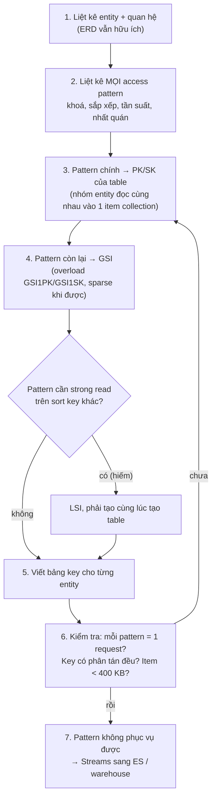
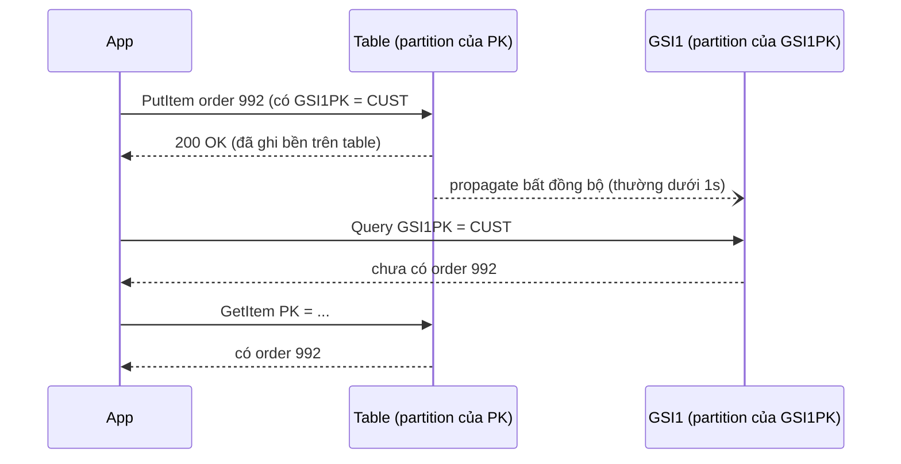

## Bối cảnh & vấn đề

Service order của một nền tảng e-commerce chạy trên DynamoDB theo kiểu "một entity một table", học từ thói quen SQL: table `orders`, table `order_items`, table `customers`. Trang chi tiết đơn cần order + items + tên customer: ba request tuần tự, vì DynamoDB không có join. p99 latency 90 ms, chủ yếu là round-trip. Trang "đơn của tôi" cần tìm order theo `customerId`, nhưng partition key của `orders` là `orderId`, nên team viết `Scan` + `FilterExpression`. Ổn khi có 10.000 order, sập khi có 20 triệu.

Cùng thời điểm, một bug khác: đăng ký tài khoản kiểm tra "email đã tồn tại chưa" bằng `Query` trên GSI `email-index`, thấy chưa có, rồi `PutItem`. Hai request đăng ký cùng email trong vòng 200 ms tạo ra **hai user trùng email**. GSI là eventually consistent, và "check rồi ghi" không bao giờ an toàn khi có hai request song song.

Bài này dạy cách thiết kế DynamoDB **từ access pattern ngược về key** (single-table design), hai loại index phụ và khác biệt về nhất quán, rồi các công cụ ghi đúng dưới concurrency: condition expression, optimistic locking, transaction. Output chạy thật trên DynamoDB Local 3.3.1 với AWS SDK v3. Nền tảng partition/sort key nằm ở [bài trước](/tracks/nosql-search/learn/dynamodb-keys-query).

**Interview angle:** single-table design là câu hỏi "có từng dùng DynamoDB thật chưa". Interviewer muốn thấy bạn liệt kê access pattern trước, vẽ bảng key, và nói được trade-off (khó query ad-hoc, khó onboard).

## Khái niệm

### Single-table design và item collection

**Single-table design** là đặt nhiều loại entity vào **một table**, dùng tên key chung chung (`PK`, `SK`, `GSI1PK`, `GSI1SK`) và **key overloading** (giá trị key có tiền tố theo loại: `ORDER#991`, `CUST#7`, `ITEM#001`) để các entity hay được đọc cùng nhau nằm chung một **item collection** (cùng partition key). Một `Query` theo partition key khi đó trả về cả nhóm, giống một join đã được tính sẵn lúc ghi.

Ý tưởng cốt lõi: DynamoDB không join được, nên bạn **denormalize theo access pattern**. Không phải "mọi thứ phải vào một table". Mục tiêu là mỗi access pattern quan trọng là **một** request. Nhiều team chọn vài table theo bounded context (order service một table, catalog một table) thay vì một table cho cả công ty.

Ví dụ: order và items chung `PK = TENANT#42#ORDER#991`. Order có `SK = META`, item có `SK = ITEM#001`. Một Query lấy đủ.

### Global Secondary Index (GSI)

**GSI** là một index có **partition key và sort key tuỳ ý** (khác table). DynamoDB tự copy item (hoặc một phần attribute theo **projection**: `KEYS_ONLY`, `INCLUDE`, `ALL`) sang GSI một cách **bất đồng bộ** mỗi khi bạn ghi vào table. Hệ quả:

- GSI chỉ hỗ trợ **eventually consistent read**. Gửi `ConsistentRead: true` vào GSI bị từ chối.
- GSI **tạo và xoá được bất cứ lúc nào** (tạo sau thì DynamoDB backfill).
- GSI có capacity riêng. Mỗi write vào table có attribute key của GSI là thêm một write vào GSI; GSI bị throttle thì write vào table cũng bị throttle.
- Key của GSI **không cần duy nhất**: nhiều item có thể cùng `GSI1PK` + `GSI1SK`.
- Giới hạn mặc định 20 GSI mỗi table (verify).

### Local Secondary Index (LSI)

**LSI** dùng **cùng partition key** với table nhưng **sort key khác**. Vì nằm cùng partition với dữ liệu gốc, LSI được cập nhật **đồng bộ** và hỗ trợ **strongly consistent read**. Đổi lại:

- LSI **chỉ tạo được lúc tạo table**. API `UpdateTable` không có tham số cho LSI (chỉ có `GlobalSecondaryIndexUpdates`), và không xoá được LSI.
- Table có LSI bị giới hạn **10 GB mỗi item collection** (mỗi giá trị partition key, tính cả dữ liệu LSI). Vượt là write lỗi `ItemCollectionSizeLimitExceededException`.
- Tối đa 5 LSI mỗi table.

Ví dụ: table `PK = CUST#7`, `SK = ORDER#<id>`; LSI với sort key `total` cho phép "đơn của customer 7 sắp theo giá trị" với strong read.

**Interview angle:** câu "GSI vs LSI" có đáp án ngắn gọn là: GSI linh hoạt, tạo lúc nào cũng được, chỉ eventual; LSI cùng partition key, chỉ tạo lúc tạo table, có strong read, kèm giới hạn 10 GB. Thực tế gần như luôn dùng GSI.

### GSI overloading và sparse index

**GSI overloading**: vì tên attribute là chung chung (`GSI1PK`), mỗi loại entity có thể đặt giá trị mang ý nghĩa khác nhau vào cùng một GSI. Order đặt `GSI1PK = CUST#7` để phục vụ "đơn theo customer"; product đặt `GSI1PK = CATEGORY#shoes` để phục vụ "sản phẩm theo danh mục". Một GSI phục vụ nhiều access pattern, đỡ tốn chi phí và quota index.

**Sparse index**: item **không có** attribute key của GSI thì **không nằm** trong GSI. Chỉ order đang `pending` mới có `GSI2PK`; khi xử lý xong, `REMOVE GSI2PK` và item tự rời GSI. GSI khi đó nhỏ, rẻ, và query "mọi order pending" chỉ đọc đúng những gì cần.

### Read consistency

Mặc định mọi read là **eventually consistent**: có thể không thấy write vừa hoàn tất (thường trễ dưới một giây), tốn **nửa** RCU. `ConsistentRead: true` cho **strongly consistent read**: thấy mọi write đã thành công trước đó, tốn đủ RCU, và có thể lỗi 500 hoặc latency cao hơn khi có sự cố mạng nội bộ.

Strong read **có** trên: `GetItem`, `Query`, `Scan`, `BatchGetItem` trên **table** và **LSI**, trong **một region**. Strong read **không có** trên: **GSI**, **DynamoDB Streams**, và theo mặc định **giữa các region** của global tables (replicate bất đồng bộ, thường dưới một giây, xung đột giải bằng last writer wins). AWS có thêm chế độ **multi-region strong consistency (MRSC)** cho global tables với một số giới hạn cấu hình (verify: danh sách region và giới hạn hiện tại).

### Condition expression và optimistic locking

**Condition expression** là điều kiện DynamoDB kiểm tra **atomic** ngay tại item trước khi ghi (`PutItem`, `UpdateItem`, `DeleteItem`). Nếu điều kiện sai, write không xảy ra và bạn nhận `ConditionalCheckFailedException`. Không có khoảng hở giữa "check" và "ghi", vì cả hai là một thao tác trên server.

**Optimistic locking** dùng condition expression với một attribute `version`: đọc item (ví dụ `version = 17`), tính giá trị mới, ghi với `ConditionExpression: version = :v` và `SET version = version + 1`. Nếu ai đó đã ghi trước (version thành 18), write của bạn fail; bạn đọc lại và thử lại. Không cần lock, phù hợp khi conflict hiếm.

**Uniqueness** ngoài primary key: DynamoDB không có unique constraint trên attribute thường. Cách chuẩn là tạo thêm một **item đánh dấu** (`PK = EMAIL#a@b.com`) với `attribute_not_exists(PK)`, ghi cùng user trong một transaction.

### TransactWriteItems vs BatchWriteItem

**`TransactWriteItems`** gom tối đa **100 action** (Put, Update, Delete, ConditionCheck) trên tối đa 100 item khác nhau (có thể nhiều table, cùng account và region), **all-or-nothing**. Mỗi action có thể kèm condition. Chi phí: mỗi item tốn **gấp đôi** WCU (prepare + commit). `ClientRequestToken` làm request **idempotent** trong 10 phút: gửi lại cùng token không thực hiện lại. Tổng dữ liệu tối đa 4 MB.

**`BatchWriteItem`** gom tối đa **25** Put/Delete (không có Update, không có condition), **không atomic**: mỗi item thành công hay thất bại độc lập, item bị throttle trả về trong **`UnprocessedItems`** và bạn phải tự retry với backoff. Nó chỉ tiết kiệm round-trip cho bulk load.

**Interview angle:** follow-up "vì sao BatchWriteItem không thay transaction được?" có ba ý: không atomic, không condition, và item có thể nằm trong `UnprocessedItems` mà code quên retry.

## Cơ chế hoạt động

Quy trình thiết kế single-table đi theo một chiều duy nhất, từ câu hỏi về dữ liệu tới key:



Điểm khác biệt với thiết kế SQL nằm ở bước 2 và 3: SQL chuẩn hoá theo entity rồi mới nghĩ query; DynamoDB thiết kế key **sau khi** biết query. Bước 6 là vòng lặp thật: thường phải thử vài bảng key trước khi mọi pattern đều thành một request. Bước 7 thừa nhận giới hạn: báo cáo, search nhiều điều kiện, "mọi order trên 500 USD tuần trước" không phải việc của DynamoDB. DynamoDB Streams đẩy thay đổi sang Elasticsearch hoặc warehouse.

Sơ đồ dưới cho thấy vì sao GSI chỉ có eventual read: write đi vào table trước, GSI được cập nhật sau.



Response 200 chỉ bảo đảm item đã nằm trong table. Query GSI ngay sau đó có thể chưa thấy. Nếu trang "đơn của tôi" phải hiện ngay order vừa tạo, hãy đọc order mới bằng `GetItem` strong trên table (bạn biết id của nó) và ghép vào kết quả GSI, hoặc cập nhật lạc quan ở client.

## Ví dụ thực tế

### Bảng key cho order service

Access pattern (multi-tenant):

1. Lấy order kèm items theo orderId.
2. Đơn của một customer, mới nhất trước, lọc theo khoảng ngày.
3. Đơn đang `pending` của tenant (cho worker xử lý).
4. Lấy customer theo id.

| Entity | PK | SK | GSI1PK | GSI1SK | GSI2PK (sparse) |
|---|---|---|---|---|---|
| Order | `TENANT#42#ORDER#991` | `META` | `TENANT#42#CUST#7` | `2026-09-28T10:00Z#991` | `TENANT#42#PENDING#<0..3>` khi pending |
| OrderItem | `TENANT#42#ORDER#991` | `ITEM#001` | – | – | – |
| Customer | `TENANT#42#CUST#7` | `PROFILE` | – | – | – |

Pattern 1: Query `PK = TENANT#42#ORDER#991`. Pattern 2: Query GSI1 `GSI1PK = TENANT#42#CUST#7 AND GSI1SK BETWEEN ...`, `ScanIndexForward: false`. Pattern 3: Query GSI2 trên 4 shard. Pattern 4: GetItem. Output chạy thật của pattern 1 và 2 ở [bài trước](/tracks/nosql-search/learn/dynamodb-keys-query#sec-vi-du-thuc-te).

Yêu cầu mới "mọi order trên 500 USD trong tuần trước, mọi customer": không có key nào phục vụ. Có ba lựa chọn: GSI mới `GSI3PK = TENANT#42#DAY#2026-09-28`, `GSI3SK = total` (query 7 ngày × điều kiện `>= 500`; cẩn thận key theo ngày bị nóng); đẩy qua Streams sang Elasticsearch/warehouse và query ở đó; hoặc nếu đây là báo cáo hằng ngày thì Export to S3 + Athena. Đưa ra lựa chọn theo tần suất: báo cáo 1 lần/ngày không đáng một GSI ghi thêm mỗi write.

### Strong read trên GSI bị từ chối, trên LSI thì được

```ts
await ddb.send(new QueryCommand({
  TableName: 'app', IndexName: 'GSI1', ConsistentRead: true,
  KeyConditionExpression: 'GSI1PK = :c',
  ExpressionAttributeValues: { ':c': 'TENANT#42#CUST#7' },
}));
```

```text
GSI ConsistentRead: ValidationException - Consistent reads are not supported on global secondary indexes
LSI ConsistentRead: ok, items 0
```

Thử thêm LSI cho table đã tồn tại qua `UpdateTable`: API không có trường cho LSI, SDK bỏ qua tham số lạ và DynamoDB Local trả `ValidationException - Nothing to update`. Muốn LSI mới thì phải tạo table mới và migrate.

### Optimistic locking

```ts
await ddb.send(new PutCommand({ TableName: 'app',
  Item: { PK: 'TENANT#42#PRODUCT#9', SK: 'STOCK', qty: 10, version: 17 } }));

const reserve = (expected: number) => ddb.send(new UpdateCommand({
  TableName: 'app',
  Key: { PK: 'TENANT#42#PRODUCT#9', SK: 'STOCK' },
  UpdateExpression: 'SET qty = qty - :n, version = version + :one',
  ConditionExpression: 'qty >= :n AND version = :v',
  ExpressionAttributeValues: { ':n': 2, ':one': 1, ':v': expected },
  ReturnValues: 'ALL_NEW',
}));

console.log((await reserve(17)).Attributes);
await reserve(17).catch((e) => console.log('second writer with stale version 17 →', e.name));
```

```text
update with version 17 → {"SK":"STOCK","PK":"TENANT#42#PRODUCT#9","version":18,"qty":8}
second writer with stale version 17 → ConditionalCheckFailedException
```

Với trừ tồn kho, thật ra điều kiện `qty >= :n` **một mình** đã đủ an toàn (update là atomic trên item, `SET qty = qty - :n` không đọc giá trị cũ ở client). `version` cần khi client tính giá trị mới dựa trên state đã đọc (ví dụ sửa cả document qua form). Hiểu khi nào cần version là điểm cộng khi phỏng vấn.

### Uniqueness bằng transaction + item đánh dấu

```ts
const register = (email: string, userId: string) => ddb.send(new TransactWriteCommand({
  TransactItems: [
    { Put: { TableName: 'app', Item: { PK: `USER#${userId}`, SK: 'PROFILE', email },
             ConditionExpression: 'attribute_not_exists(PK)' } },
    { Put: { TableName: 'app', Item: { PK: `EMAIL#${email}`, SK: 'UNIQUE', userId },
             ConditionExpression: 'attribute_not_exists(PK)' } },
  ],
}));

await register('a@b.com', 'u1');
await register('a@b.com', 'u2').catch((e) => console.log(e.name, e.CancellationReasons.map((r) => r.Code)));
```

```text
register a@b.com as u1: ok
register a@b.com as u2 → TransactionCanceledException ["None","ConditionalCheckFailed"]
u2 profile exists? false
```

`CancellationReasons` cho biết action thứ hai (item email) fail, và vì là transaction nên profile của u2 cũng **không** được tạo. Đây là cách đúng cho "check username availability rồi create": không check trước bằng GSI, mà để condition + transaction làm cả hai việc atomic. Đổi email thì transaction gồm ba action: xoá marker cũ, tạo marker mới với `attribute_not_exists`, update profile.

### Giới hạn của BatchWriteItem

```ts
await ddb.send(new BatchWriteCommand({ RequestItems: { app: Array.from({ length: 26 }, (_, i) => (
  { PutRequest: { Item: { PK: `B#${i}`, SK: 'X' } } })) } }));
```

```text
BatchWrite 26 items → ValidationException - Too many items requested for the BatchWriteItem call
```

Và ngay cả với ≤ 25 item, response có thể chứa `UnprocessedItems`. Vòng retry tối thiểu:

```ts
let pending = requestItems;
for (let attempt = 0; Object.keys(pending).length > 0; attempt++) {
  const r = await ddb.send(new BatchWriteCommand({ RequestItems: pending }));
  pending = r.UnprocessedItems ?? {};
  if (Object.keys(pending).length) await sleep(Math.min(2 ** attempt * 50, 2000) + Math.random() * 100);
}
```

## Trade-offs & lựa chọn thay thế

| | GSI | LSI |
|---|---|---|
| Partition key | Tuỳ ý | Cùng table |
| Tạo/xoá | Bất cứ lúc nào (backfill) | Chỉ lúc tạo table, không xoá |
| Consistency | Chỉ eventual | Eventual hoặc strong |
| Capacity | Riêng; throttle GSI chặn write table | Dùng chung table |
| Giới hạn | ~20/table, key không cần unique | 5/table, 10 GB mỗi item collection |

| Thiết kế | Ưu | Nhược |
|---|---|---|
| Single-table (một table cho context) | Một request cho mỗi pattern, ít GSI | Khó đọc, khó onboard, khó query ad-hoc, đổi pattern tốn |
| Multi-table theo entity | Dễ hiểu, giống SQL | Nhiều round-trip, "join" ở app, tốn GSI hơn |
| DynamoDB + Streams → ES/warehouse | Bù phần search/báo cáo | Thêm pipeline, eventual |
| Postgres | Query ad-hoc, join, transaction mạnh | Scale ngang khó hơn, phải vận hành |

| Ghi nhiều item | Atomic | Condition | Giới hạn | Chi phí |
|---|---|---|---|---|
| `TransactWriteItems` | Có | Có | 100 action, 4 MB | 2× WCU |
| `BatchWriteItem` | Không | Không | 25 item, 16 MB | 1× WCU, phải retry `UnprocessedItems` |
| Từng `PutItem`/`UpdateItem` + condition | Từng item | Có | – | 1× WCU |

Khi nào chọn gì: dùng single-table khi access pattern ổn định và latency quan trọng, team chấp nhận đường cong học tập. Dùng multi-table khi pattern còn thay đổi hoặc team mới với DynamoDB, sẵn sàng trả thêm round-trip. Transaction cho bất biến nghiệp vụ nhiều item (uniqueness, chuyển tồn kho); condition trên một item cho hầu hết trường hợp còn lại; batch chỉ cho bulk load không cần atomic.

## Edge cases & failure modes

- **Transaction conflict**: hai transaction chạm cùng item cùng lúc, một bên nhận `TransactionCanceledException` với reason `TransactionConflict`. Retry với backoff. Transaction cũng xung đột với write thường đang diễn ra trên item đó.
- **Hot item trong transaction**: mọi đơn hàng đều cập nhật một item "counter tổng" trong transaction → conflict liên tục. Tách counter ra shard hoặc tính bất đồng bộ qua Streams.
- **GSI backfill khi tạo index mới** trên table lớn: tốn WCU của GSI và mất thời gian (giờ với table TB). Trong lúc backfill, index ở trạng thái `CREATING` và chưa query được.
- **Item collection vượt 10 GB khi có LSI**: tenant lớn làm write fail. Chỉ biết khi quá muộn; đó là lý do nên tránh LSI trừ khi cần strong read.
- **Global tables và last writer wins**: hai region cùng sửa item trong vài trăm ms, một update mất lặng lẽ. Chọn "home region" cho mỗi item (theo tenant) hoặc dùng MRSC nếu phù hợp.
- **Đọc GSI sau ghi**: trang redirect sau khi tạo order đọc GSI, không thấy order mới, user tạo lại đơn thứ hai. Dùng idempotency key cho tạo order và đọc strong trên table cho item vừa tạo.
- **Retry transaction không idempotent**: timeout mạng, client retry, nhưng transaction lần đầu đã commit. Luôn gửi `ClientRequestToken` ổn định cho cùng một ý định.

## Pitfalls

- ❌ Kiểm tra trùng email bằng Query GSI rồi mới Put → ✅ item đánh dấu `EMAIL#...` với `attribute_not_exists(PK)` trong cùng transaction với profile.
- ❌ Thiết kế table theo entity như SQL rồi "join" bằng nhiều request → ✅ liệt kê access pattern, đặt entity đọc cùng nhau vào một item collection.
- ❌ Dùng `BatchWriteItem` như transaction → ✅ `TransactWriteItems` khi cần all-or-nothing; batch thì luôn retry `UnprocessedItems`.
- ❌ Tạo LSI "phòng khi cần" → ✅ LSI kéo theo giới hạn 10 GB mỗi item collection vĩnh viễn; chỉ tạo khi thật sự cần strong read trên sort key khác.
- ❌ Gửi `ConsistentRead: true` tới GSI và nghĩ đã có strong read → ✅ bị từ chối; đọc strong trên table bằng primary key.
- ❌ Ép mọi yêu cầu báo cáo vào DynamoDB bằng GSI mới → ✅ Streams/Export sang warehouse hoặc ES cho analytics và search.

## Tóm tắt

- Single-table design: liệt kê access pattern trước, dùng key generic (`PK`, `SK`, `GSI1PK`, `GSI1SK`) và tiền tố theo entity để một Query lấy đủ item collection.
- GSI: key tuỳ ý, tạo lúc nào cũng được, **chỉ eventual**, capacity riêng (throttle GSI chặn write table). Overloading cho nhiều pattern; sparse index cho tập con.
- LSI: cùng partition key, **chỉ tạo lúc tạo table**, có strong read, giới hạn 10 GB mỗi item collection.
- Strong read có trên table/LSI trong một region; không có trên GSI, Streams, và mặc định không có giữa region của global tables.
- Condition expression là check-and-write atomic; optimistic locking = `version = :v` + tăng version; uniqueness = item đánh dấu + `attribute_not_exists`.
- `TransactWriteItems`: ≤ 100 action, all-or-nothing, 2× WCU, idempotent với `ClientRequestToken`. `BatchWriteItem`: ≤ 25 item, không atomic, phải retry `UnprocessedItems`.
- Pattern DynamoDB không phục vụ được (ad-hoc, báo cáo, search) → Streams/Export sang ES hoặc warehouse.
