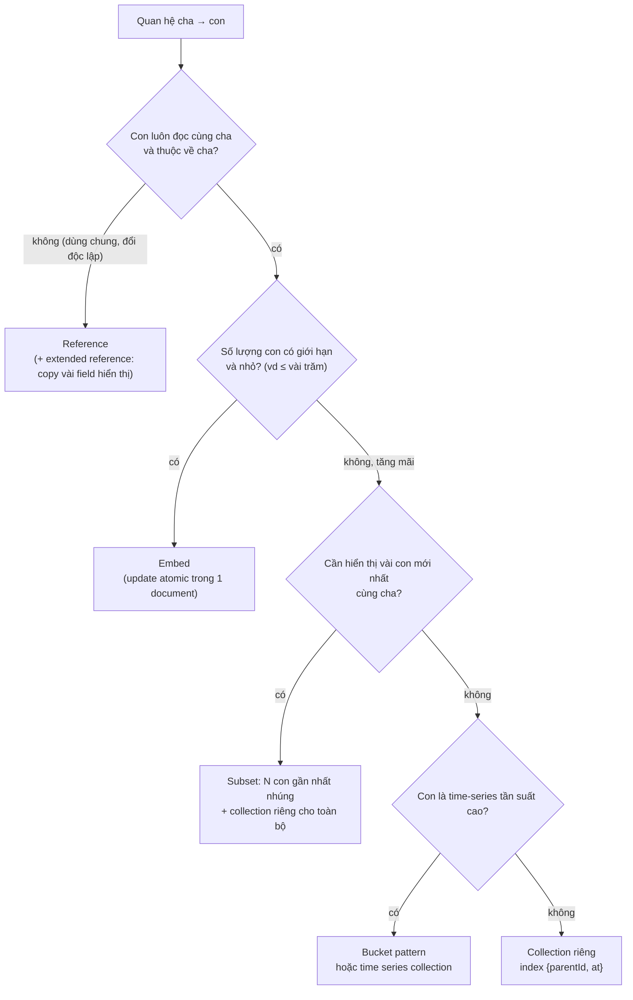
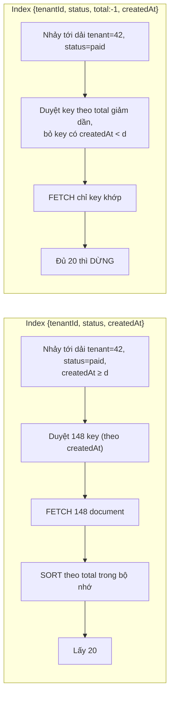

## Bối cảnh & vấn đề

Một team logistics lưu order trong MongoDB và làm đúng lời khuyên "embed những gì đọc cùng nhau": mỗi order nhúng mảng `events` chứa mọi lần đổi trạng thái và mọi cập nhật vị trí shipment. Trang chi tiết order chỉ cần một lần đọc, rất nhanh. Sáu tháng sau, các order giao quốc tế có hàng nghìn event tracking. Mỗi `$push` phải ghi lại document vài MB, index trên `events.at` phình to, trang danh sách order kéo theo cả lịch sử dù chỉ hiển thị trạng thái. Rồi một order vượt 16 MB và mọi update trên nó bắt đầu fail.

Cùng hệ thống, query "đơn đã thanh toán của tenant 42 từ đầu tháng, sắp theo giá trị giảm dần, lấy 20 đơn" chạy 2 giây. Có index `{ tenantId: 1, status: 1, createdAt: 1 }` "khớp đủ ba field". Nhưng `explain` cho thấy một stage `SORT` trong bộ nhớ: index lọc được nhưng không trả kết quả theo thứ tự cần.

Bài này dạy hai kỹ năng quan trọng nhất của MongoDB: **mô hình hoá** (embed hay reference, và các pattern khi mảng lớn dần) và **thiết kế compound index** theo ESR, đọc bằng `explain`. Phần cuối là các nút vặn nhất quán: write concern, read concern, read preference và transaction. Mọi output chạy thật trên **MongoDB 8.2.1** (replica set một node qua `mongodb-memory-server`) với Node driver 7.7.

**Interview angle:** interviewer MongoDB gần như luôn hỏi "embed hay reference?" và "index này có dùng được cho sort không?". Câu trả lời mạnh nói về **giới hạn kích thước** và **tốc độ tăng trưởng** của dữ liệu nhúng, và đọc được `totalKeysExamined` vs `nReturned`.

## Khái niệm

### Document, collection và BSON

MongoDB lưu **document** dạng **BSON** (Binary JSON), gom trong **collection**. BSON thêm kiểu mà JSON không có: `ObjectId`, `Date`, `Decimal128`, `Int32`/`Int64`, binary. Mỗi document có `_id` duy nhất trong collection (mặc định `ObjectId` 12 byte: 4 byte timestamp, 5 byte random, 3 byte counter). Mỗi document tối đa **16 MB** (`16777216` byte).

Collection không bắt buộc schema, nhưng **ứng dụng luôn có schema**. Không khai báo thì schema chỉ nằm trong code, và dữ liệu bẩn đi vào lặng lẽ. MongoDB có **schema validation** bằng `$jsonSchema` để chặn ở database.

### Embed (nhúng)

**Embed** là đặt dữ liệu con **bên trong** document cha: address trong user, line items trong order. Lợi ích: một lần đọc lấy đủ, và **update một document là atomic** (đổi order và items cùng lúc không cần transaction). Nhúng phù hợp khi:

- Dữ liệu con **luôn được đọc cùng** cha.
- Quan hệ 1-1 hoặc 1-ít, **số lượng có giới hạn** và biết trước (một order có tối đa vài chục line item).
- Dữ liệu con **thuộc về** cha, không được entity khác dùng chung.

Ví dụ kinh điển: line item nhúng trong order kèm **snapshot** tên và giá lúc mua. Giá product đổi sau đó thì order cũ vẫn phải giữ giá cũ, nên snapshot là **đúng về nghiệp vụ**, không chỉ là tối ưu.

### Reference (tham chiếu)

**Reference** là lưu `_id` của document khác và đọc riêng (hoặc `$lookup` trong aggregation). Dùng khi:

- Quan hệ 1-rất-nhiều hoặc **không giới hạn** (comment của bài viết nổi tiếng, event của order, log).
- Dữ liệu **dùng chung** và **thay đổi độc lập** (product dùng trong hàng triệu order; category).
- Document sẽ vượt 16 MB, hoặc dữ liệu con cần được truy cập, phân trang, index riêng.

**Hybrid** (MongoDB gọi là **extended reference**): lưu reference id **cộng** vài field hay hiển thị (`{ productId, name, price }`). Đọc nhanh như embed cho trang danh sách, nhưng dữ liệu gốc vẫn ở một nơi.

**Interview angle:** follow-up "vì sao line item nên lưu snapshot giá thay vì reference tới product?" đo xem bạn phân biệt được "dữ liệu lịch sử" và "dữ liệu hiện tại". Order là bản ghi sự kiện đã xảy ra; nó không được đổi khi catalog đổi.

### Mảng không giới hạn và các pattern thay thế

**Unbounded array** là mảng tăng mãi theo thời gian (event, comment, log). Nó gây ba vấn đề: document tiến tới 16 MB rồi mọi write fail; mỗi update ghi lại document lớn (WiredTiger ghi document mới, không sửa tại chỗ); và index trên field trong mảng là **multikey index**, mỗi phần tử một index key, nên index phình theo tổng số phần tử.

Các pattern thay thế:

- **Tách collection** (`order_events` với `orderId`, index `{ orderId: 1, at: -1 }`): đơn giản nhất, phân trang được.
- **Subset pattern**: giữ trong order chỉ **N event gần nhất** (ví dụ 10) để hiển thị nhanh, toàn bộ lịch sử ở collection riêng. `$push` với `$slice: -10` giữ mảng cố định.
- **Bucket pattern**: gom event theo nhóm cố định (theo giờ, theo 200 event) vào một document bucket: `{ orderId, bucketStart, count, events: [...] }`. Ít document hơn một-event-một-document, index nhỏ hơn, vẫn có giới hạn kích thước. Hợp với time-series tần suất cao (IoT, tracking). MongoDB 5.0+ có **time series collection** làm việc này tự động.

### Compound index và ESR

**Compound index** là index trên nhiều field theo thứ tự, ví dụ `{ tenantId: 1, status: 1, total: -1, createdAt: 1 }`. Giống B-tree composite trong SQL (xem [B-tree index](/tracks/sql-postgres/learn/btree-indexes)), index sắp theo field đầu, rồi field thứ hai trong mỗi giá trị field đầu, và cứ thế.

**ESR guideline**: đặt field **Equality** (so sánh bằng) trước, rồi field **Sort**, cuối cùng field **Range** (`$gt`, `$lt`, `$in` với nhiều giá trị khi có sort...). Lý do:

- Equality trước: thu hẹp về một dải liền mạch trong index.
- Sort tiếp theo: trong dải đó, key đã sẵn thứ tự của sort, nên MongoDB **đọc index theo thứ tự và dừng khi đủ `limit`**, không cần sort trong bộ nhớ.
- Range cuối: range trên field đứng trước sort sẽ phá thứ tự sort (mỗi giá trị range là một dải con có thứ tự riêng). Để range cuối, nó thành điều kiện lọc trên key trong lúc duyệt.

Đánh đổi: với ESR, MongoDB có thể phải duyệt thêm key không thoả range (vì range không nằm trước), nhưng tránh được việc fetch và sort hàng nghìn document. Với query có `limit`, đây gần như luôn là thắng lợi lớn.

### Đọc explain('executionStats')

`explain('executionStats')` cho biết plan thắng và số liệu thật:

- **Stage**: `COLLSCAN` (quét collection), `IXSCAN` (quét index), `FETCH` (đọc document từ key), `SORT` (sort trong bộ nhớ, giới hạn 100 MB, vượt thì phải spill ra disk), `LIMIT`.
- **`totalKeysExamined`**: số index key đã duyệt. **`totalDocsExamined`**: số document đã đọc. **`nReturned`**: số trả về.

Tỉ lệ lý tưởng gần `1 : 1 : 1`. `totalKeysExamined` gấp 100 lần `nReturned` nghĩa là index không đủ chọn lọc (range đứng trước equality, hoặc thiếu field). `totalDocsExamined` ≫ `nReturned` nghĩa là lọc sau khi fetch (field lọc không có trong index). Có stage `SORT` với query có `limit` nghĩa là index không phục vụ thứ tự.

### Write concern

**Write concern** là số node trong replica set phải xác nhận trước khi driver báo write thành công. `w: 1`: chỉ primary; nhanh, nhưng nếu primary chết trước khi replicate, write có thể bị **rollback** khi node cũ quay lại. `w: "majority"`: đa số node đã ghi (và journal); write không bị rollback qua failover. `j: true` yêu cầu ghi journal xuống disk. `wtimeout` giới hạn thời gian chờ (hết giờ không có nghĩa write bị huỷ, nó chỉ chưa được xác nhận).

Từ MongoDB 5.0, write concern mặc định là **`majority`** cho hầu hết cấu hình (ngoại lệ: replica set có arbiter trong một số điều kiện). Chạy thật: `getDefaultRWConcern` trên 8.2.1 trả `{"w":"majority","wtimeout":0}`.

### Read concern và read preference

**Read concern** quyết định **dữ liệu nào** được đọc:

- `local` (mặc định cho đọc thường): dữ liệu mới nhất trên node, có thể là dữ liệu chưa được majority xác nhận và có thể bị rollback.
- `majority`: chỉ dữ liệu đã được majority xác nhận, không bao giờ bị rollback.
- `linearizable`: chỉ trên primary, bảo đảm thấy mọi write majority đã hoàn tất trước khi read bắt đầu; chậm, dùng cho vài document.
- `snapshot`: dùng trong transaction, đọc một snapshot nhất quán.

**Read preference** quyết định **đọc từ node nào**: `primary` (mặc định), `primaryPreferred`, `secondary`, `secondaryPreferred`, `nearest`. Đọc từ secondary giảm tải primary nhưng có thể **stale** (replication lag), và không thấy write vừa ghi vào primary.

**Causal consistency**: dùng **causally consistent session** (mặc định bật trong session) với read concern `majority` và write concern `majority`, driver gửi kèm `afterClusterTime` để secondary chờ tới khi đã áp dụng các write trước đó của session. Nhờ vậy có read-your-writes kể cả khi đọc từ secondary.

**Interview angle:** follow-up "đọc secondary ngay sau khi ghi primary thấy gì?" đáp án: có thể không thấy write của chính mình, có thể thấy dữ liệu đi lùi giữa hai lần đọc nếu rơi vào hai secondary lag khác nhau. Causal session với majority giải quyết cả hai.

### Multi-document transaction

MongoDB hỗ trợ **multi-document ACID transaction** trên replica set từ 4.0 và trên sharded cluster từ 4.2. Transaction có **thời gian sống tối đa** mặc định 60 giây (`transactionLifetimeLimitSeconds`, chạy thật trả `60`), giữ lock và snapshot trong WiredTiger cache suốt thời gian đó, và có thể bị abort vì write conflict (`TransientTransactionError`, cần retry cả transaction). Driver có `session.withTransaction()` tự retry các lỗi tạm thời.

Nguyên tắc: **model để thao tác atomic trong một document** trước. Transaction dành cho bất biến nghiệp vụ thật sự nhiều document (chuyển tiền giữa hai account, tạo order + trừ tồn kho ở collection khác). Dùng transaction cho mọi thứ là tín hiệu model chưa "hình document".

## Cơ chế hoạt động

Sơ đồ quyết định embed hay reference cho một quan hệ cha-con:



Câu hỏi quan trọng nhất trong sơ đồ không phải "có đọc cùng nhau không" mà là **"có giới hạn không"**. Mọi sự cố embed trong production đến từ mảng không giới hạn: comment, event, log, lịch sử giá. Nhánh subset giữ lợi ích "một lần đọc" cho trường hợp phổ biến (hiển thị 10 event mới nhất) mà không mang theo toàn bộ lịch sử.

Sơ đồ thứ hai cho thấy vì sao thứ tự field trong index quyết định có `SORT` hay không, với query `{ tenantId: 42, status: 'paid', createdAt: { $gte: d } }` sort `{ total: -1 }` limit 20:



Với index E-E-R, mọi key khớp range đều phải được fetch và sort trước khi biết 20 cái lớn nhất. Với ESR, index đã sắp theo `total` trong dải equality, nên MongoDB đọc từ trên xuống và dừng ở kết quả thứ 20. Khi dải khớp là 150.000 document thay vì 148, khác biệt là 2 giây và 5 ms.

## Ví dụ thực tế

### ESR đo bằng explain

200.000 order (50 tenant, 4 trạng thái, 270 ngày). Query:

```ts
const cur = orders
  .find({ tenantId: 42, status: 'paid', createdAt: { $gte: new Date('2026-09-01') } })
  .sort({ total: -1 })
  .limit(20)
  .hint(indexName);
const ex = await cur.explain('executionStats');
```

Chạy với từng index (in stage từ trên xuống, và các số liệu):

```text
no index                                     stages SORT<-COLLSCAN           keys      0 docs 200000 n 20 ms 78
{tenantId,status,createdAt} (E,E,R)          stages SORT<-FETCH<-IXSCAN      keys    148 docs    148 n 20 ms 12
{tenantId,status,total:-1,createdAt} (ESR)   stages LIMIT<-FETCH<-IXSCAN     keys    156 docs     20 n 20 ms 6
{createdAt,tenantId,status} (R first)        stages SORT<-FETCH<-IXSCAN      keys    195 docs    148 n 20 ms 10
```

Đọc kết quả: không index thì quét 200.000 document. Index E-E-R chọn lọc tốt (148 key) nhưng vẫn phải fetch 148 document và có stage `SORT`. Index ESR duyệt 156 key (hơi nhiều hơn, vì phải bỏ qua key có `createdAt` trước tháng 9), nhưng **chỉ fetch 20 document và không có `SORT`**, plan kết thúc bằng `LIMIT`. Index range-first duyệt nhiều key nhất và vẫn phải sort. Ở dữ liệu nhỏ này thời gian chênh ít; khi tenant 42 có 100.000 order đã thanh toán trong tháng, E-E-R phải sort 100.000 document còn ESR vẫn fetch 20.

### Mảng không giới hạn chạm 16 MB

```ts
await big.insertOne({ _id: 'o1', events: [] });
const ev = { type: 'shipment_update', note: 'x'.repeat(1000), at: new Date() };
for (;;) {
  await big.updateOne({ _id: 'o1' }, { $push: { events: { $each: Array(1000).fill(ev) } } });
}
```

```text
after 15000 events: 10334: Plan executor error during update :: caused by :: Resulting document after update is larger than 16777216
doc size bytes 15903920
```

Lỗi `10334` (BSONObjectTooLarge) xuất hiện ở update đẩy document vượt 16.777.216 byte. Từ lúc đó order này **không ghi được gì nữa**, kể cả đổi `status`. Trước khi tới giới hạn, mỗi `$push` đã phải ghi lại document gần 16 MB. Sửa bằng subset pattern:

```ts
// order giữ 10 event gần nhất để hiển thị
await orders.updateOne(
  { _id: orderId },
  { $set: { status: 'in_transit' }, $push: { recentEvents: { $each: [ev], $slice: -10 } } },
);
// toàn bộ lịch sử ở collection riêng
await orderEvents.insertOne({ orderId, ...ev });
await orderEvents.createIndex({ orderId: 1, at: -1 });
```

Hai write này không atomic với nhau. Nếu cần chắc chắn cả hai cùng xảy ra, bọc bằng transaction, hoặc coi `order_events` là nguồn chính và cập nhật `recentEvents` bất đồng bộ.

### Multikey index phình theo số phần tử

```text
multikey index keys ≈ docs*50; indexSizes {"_id_":4096,"tags_1":237568}
isMultiKey true keysExamined 1000
```

1.000 document, mỗi document 50 tag: index `tags_1` có 50.000 key, lớn gấp gần 60 lần index `_id`. Mảng không giới hạn có index thì mỗi phần tử mới là một index entry mới và một lần ghi index.

### Transaction abort giữ nguyên mọi thứ

```ts
await session.withTransaction(async () => {
  await ordersTx.insertOne({ _id: 'o9', items: ['sku1', 'sku2'] }, { session });
  for (const id of ['sku1', 'sku2']) {
    const r = await stock.updateOne({ _id: id, qty: { $gte: 1 } }, { $inc: { qty: -1 } }, { session });
    if (r.modifiedCount === 0) throw new Error(`out of stock ${id}`);
  }
}, { readConcern: { level: 'snapshot' }, writeConcern: { w: 'majority' } });
```

```text
tx aborted: out of stock sku2
after abort: order exists? false sku1 qty 5
transactionLifetimeLimitSeconds 60
```

`sku2` hết hàng, callback ném lỗi, driver abort: order không được tạo và `sku1` không bị trừ. Lưu ý điều kiện `qty: { $gte: 1 }` nằm **trong filter** của update, nên việc kiểm tra và trừ là atomic trên document, giống condition expression của DynamoDB.

### Schema validation và dữ liệu lệch kiểu

```ts
await db.createCollection('products', { validator: { $jsonSchema: {
  bsonType: 'object', required: ['sku', 'price'],
  properties: { price: { bsonType: ['int', 'long', 'decimal'] } },
} } });
await db.collection('products').insertOne({ sku: 'A', price: '100' }); // lỗi 121 Document failed validation

// Collection không validator
await loose.insertMany([{ sku: 'A', price: 150 }, { sku: 'B', price: '150' }]);
await loose.countDocuments({ price: { $gt: 100 } });
```

```text
validator: 121 undefined Document failed validation
price > 100 finds 1 of 2
```

Không có validator, document `price: '150'` (string) bị query `$gt: 100` bỏ qua **mà không báo lỗi**, vì MongoDB so sánh theo kiểu (so sánh chuỗi với số không khớp). Báo cáo doanh thu thiếu dữ liệu lặng lẽ. Validator chặn ngay lúc ghi.

## Trade-offs & lựa chọn thay thế

| Mô hình | Đọc | Ghi | Giới hạn | Khi nào |
|---|---|---|---|---|
| Embed | 1 lần đọc | Atomic trong document | 16 MB, update ghi lại cả document | Con đọc cùng cha, có giới hạn |
| Reference | Nhiều lần / `$lookup` | Độc lập | Không | Con dùng chung, không giới hạn |
| Extended reference | 1 lần cho trang danh sách | Phải đồng bộ field copy | Dữ liệu copy có thể cũ | Hiển thị vài field của entity khác |
| Subset | 1 lần cho N gần nhất | 2 write | N cố định | Lịch sử dài, UI chỉ cần gần nhất |
| Bucket | Ít document | `$push` vào bucket hiện tại | Kích thước bucket | Time-series tần suất cao |

| Nút nhất quán | Rẻ / nhanh | An toàn |
|---|---|---|
| Write concern | `w: 1` | `w: "majority"` (mặc định từ 5.0) |
| Read concern | `local` | `majority`, `linearizable`, `snapshot` |
| Read preference | `secondary*`, `nearest` (stale) | `primary` |
| Nhiều document | Model để atomic trong 1 document | Transaction (60s, retry, tốn cache) |

Khi nào chọn gì: mặc định dùng `w: majority` + đọc primary; chỉ hạ xuống khi đo được lợi ích và chấp nhận rủi ro (log analytics có thể `w: 1`). Đọc secondary cho báo cáo chấp nhận trễ, không cho luồng "vừa ghi xong đọc lại". So với Postgres `jsonb`: MongoDB mạnh hơn ở query và update sâu vào document lồng nhau, sharding có sẵn; Postgres mạnh hơn khi dữ liệu có quan hệ và cần join, ràng buộc. Nhiều hệ thống chỉ cần `jsonb`.

## Edge cases & failure modes

- **Rollback khi `w: 1`**: primary nhận write, trả OK, chết trước khi secondary nhận. Secondary lên làm primary. Khi primary cũ quay lại, write đó bị **rollback** ra file rollback. Với dữ liệu tiền bạc, đây là mất dữ liệu.
- **Transaction quá 60 giây** bị abort; transaction đụng nhiều document khi cache áp lực có thể lỗi `WriteConflict` liên tục. Chia nhỏ, hoặc không dùng transaction cho batch lớn.
- **In-memory sort vượt giới hạn**: stage `SORT` không dùng index có ngân sách 100 MB; vượt thì phải spill ra disk (`allowDiskUse`; từ 6.0 tham số `allowDiskUseByDefault` mặc định bật (verify)) và chậm hẳn. Chữa gốc bằng index ESR.
- **`$in` nhiều giá trị + sort**: `$in` trên field đứng trước sort được xử lý như range (MongoDB phải merge nhiều dải), nên có thể cần sort; với ít giá trị, planner dùng `SORT_MERGE`. Luôn kiểm bằng explain.
- **Replication lag** làm read preference `secondary` trả dữ liệu cũ hàng phút khi secondary quá tải; causal session sẽ chờ, nên latency tăng thay vì dữ liệu sai.
- **Unicode**: document có tên tiếng Việt dạng NFD và NFC là hai chuỗi khác nhau với index thường; chuẩn hoá NFC lúc ghi (xem [enrichment](/tracks/nosql-search/learn/db-es-sync-indexer)).
- **`upsert` với filter không unique**: hai request song song cùng upsert có thể tạo hai document. Cần unique index trên field filter.

## Pitfalls

- ❌ Nhúng mọi event, comment, log vào document cha → ✅ nhúng khi có giới hạn; tách collection, subset hoặc bucket khi tăng mãi.
- ❌ Line item reference tới product để "luôn có giá mới nhất" → ✅ snapshot giá và tên lúc mua; order là bản ghi lịch sử.
- ❌ Index "đủ field" theo thứ tự tuỳ ý → ✅ Equality → Sort → Range; kiểm tra bằng `explain('executionStats')`, không có stage `SORT`, `totalDocsExamined` gần `nReturned`.
- ❌ Hạ `w: 1` để nhanh hơn cho order → ✅ giữ `majority`; chấp nhận vài ms để không mất write khi failover.
- ❌ Đọc secondary ngay sau khi ghi → ✅ đọc primary, hoặc causal session + majority.
- ❌ Transaction cho mọi thao tác → ✅ model để atomic trong một document; transaction cho bất biến nhiều document, luôn qua `withTransaction` để retry.
- ❌ "Schemaless" không validator → ✅ `$jsonSchema` validator cho field quan trọng, và versioning document khi đổi cấu trúc.

## Tóm tắt

- Embed khi dữ liệu đọc cùng nhau, thuộc về cha và **có giới hạn**; reference khi dùng chung, đổi độc lập hoặc không giới hạn; extended reference khi cần vài field hiển thị.
- Mảng không giới hạn: chạm 16 MB (lỗi `10334`), update ghi lại document lớn, multikey index phình. Dùng collection riêng, subset hoặc bucket pattern.
- Compound index theo **ESR**: Equality → Sort → Range, để index trả đúng thứ tự và dừng ở `limit`.
- `explain('executionStats')`: tránh `COLLSCAN` và `SORT` không cần; so `totalKeysExamined`, `totalDocsExamined` với `nReturned`.
- Write concern mặc định `majority` (từ 5.0); `w: 1` có thể rollback khi failover.
- Read concern chọn dữ liệu nào (`local`, `majority`, `linearizable`, `snapshot`); read preference chọn node nào; secondary có thể stale, causal session cho read-your-writes.
- Multi-document transaction có từ 4.0/4.2, giới hạn 60 giây mặc định, cần retry; ưu tiên thiết kế để atomic trong một document.
