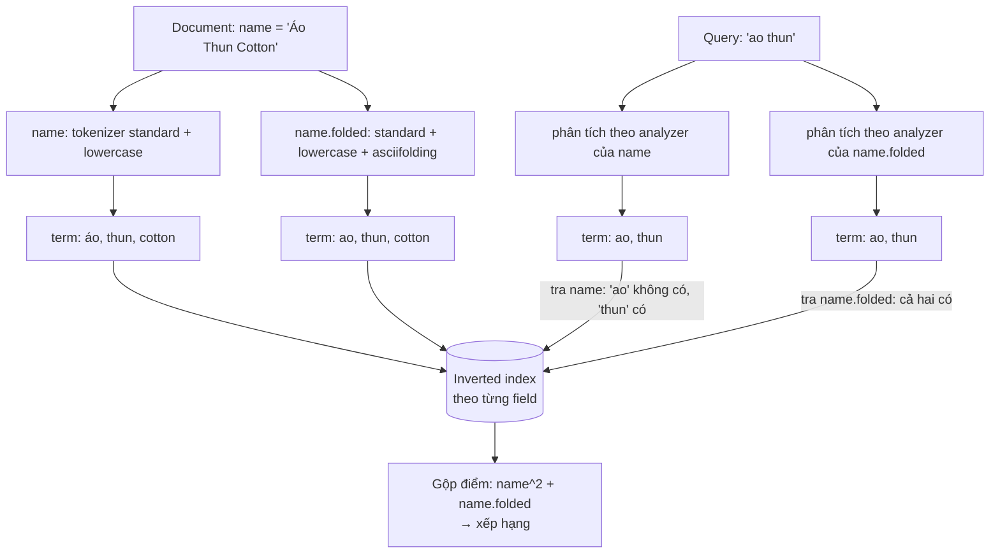
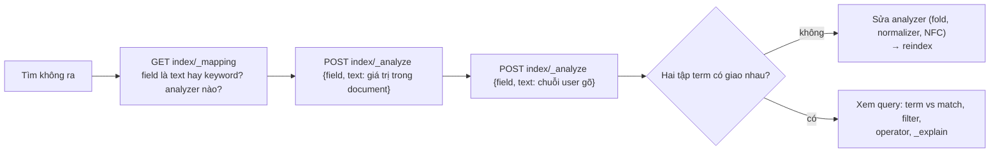

## Bối cảnh & vấn đề

Trang tìm sản phẩm ban đầu chạy trên SQL Server: `SELECT ... FROM products WHERE name LIKE N'%áo thun%'`. Với 20.000 sản phẩm, mọi thứ ổn. Với 3 triệu sản phẩm của 40 tenant, mỗi lần gõ là một **full scan**, vì B-tree index sắp theo tiền tố của chuỗi và không giúp được pattern bắt đầu bằng `%`. Tệ hơn, kết quả sai theo nhiều cách: gõ "ao thun" (không dấu, cách người Việt gõ trên điện thoại rất phổ biến) không ra "Áo thun"; "thun áo" không ra; kết quả không có thứ tự liên quan, "Áo thun cotton" và "Sơ mi, không phải áo thun" ngang hàng.

**Search engine** như Elasticsearch giải quyết bằng hai ý tưởng. Một, **inverted index**: thay vì lưu "document chứa chữ gì", nó lưu sẵn "chữ này nằm trong document nào", nên tìm kiếm là tra từ điển chứ không phải quét. Hai, **analyzer**: trước khi vào index, text được chuẩn hoá thành **term** (viết thường, bỏ dấu, tách từ...), và câu query cũng được chuẩn hoá **theo cùng cách**, nên "ao thun", "Áo Thun", "ÁO THUN" đều trở thành cùng term.

Bài này đi qua hai ý tưởng đó, cách debug analyzer bằng `_analyze`, cấu hình cho tiếng Việt, và ba cách làm autocomplete. Output chạy thật trên **Elasticsearch 9.5.3** (Lucene 10.5.1), single node trong Docker. Mapping (kiểu `text` vs `keyword`) được học kỹ ở [bài mapping](/tracks/nosql-search/learn/mapping).

**Interview angle:** câu "vì sao inverted index nhanh hơn `LIKE`" là câu khởi động; câu thật sự phân loại ứng viên là "sản phẩm 'Áo thun' không tìm thấy khi gõ 'ao thun', bạn sửa gì?". Trả lời phải nhắc tới analyzer ở **cả lúc index và lúc search**, và `_analyze` để kiểm chứng.

## Khái niệm

### Inverted index và posting list

**Inverted index** là cấu trúc map mỗi **term** tới **posting list**: danh sách các document chứa term đó, kèm thông tin phụ (vị trí trong document để hỗ trợ phrase query, tần suất để tính điểm). Danh sách term (**term dictionary**) được sắp xếp và nén (Lucene dùng cấu trúc FST), nên tra một term là thao tác rất nhanh, gần như không phụ thuộc số document.

Ví dụ với ba document:

```text
doc1: "Áo thun cotton"     doc2: "Áo thun polo"     doc3: "Sơ mi cotton"

term     → posting list
áo       → [1, 2]
cotton   → [1, 3]
mi       → [3]
polo     → [2]
sơ       → [3]
thun     → [1, 2]
```

Query "áo cotton" (AND) = giao `[1, 2]` với `[1, 3]` = `[1]`. Query OR = hợp = `[1, 2, 3]`, rồi xếp hạng theo điểm. Chi phí tỉ lệ với **độ dài posting list** của các term trong query, không tỉ lệ với tổng số document.

Mỗi shard Elasticsearch là một Lucene index, gồm nhiều **segment** bất biến; mỗi segment có inverted index riêng. Chi tiết segment và refresh ở [bài shard & refresh](/tracks/nosql-search/learn/shards-refresh-cluster).

### Vì sao LIKE '%term%' không làm được việc này

B-tree index sắp theo giá trị đầy đủ của cột, nên dùng được cho `LIKE 'áo%'` (tiền tố) nhưng **không** cho `LIKE '%thun%'` (chuỗi con ở giữa): database phải đọc mọi row và so khớp. Ngoài tốc độ, `LIKE` còn thiếu ba thứ: **không hiểu ngôn ngữ** (hoa/thường tuỳ collation, dấu, số nhiều, từ đồng nghĩa), **không xếp hạng** (chỉ khớp/không khớp), và **không có khái niệm từ** ("thun" khớp cả "thung lũng").

Relational database có công cụ tương tự nếu không muốn thêm hệ thống: Postgres `tsvector` + GIN index (full-text với stemming và ranking), `pg_trgm` + GIN cho `ILIKE '%x%'` và fuzzy, `unaccent` để bỏ dấu; SQL Server có Full-Text Search (`CONTAINS`, `FREETEXT`). Khi nào đủ, khi nào cần Elasticsearch: xem [bài cuối](/tracks/nosql-search/learn/drift-search-design).

### Analyzer: char filter → tokenizer → token filter

**Analyzer** là pipeline ba bước chạy trên mỗi giá trị field `text`:

1. **Character filter** (0 hoặc nhiều): sửa chuỗi ký tự trước khi tách. Ví dụ `html_strip` bỏ thẻ HTML, `mapping` thay ký tự (`&` → `and`), `pattern_replace`.
2. **Tokenizer** (đúng 1): tách chuỗi thành **token**, ghi lại vị trí và offset. `standard` tách theo quy tắc Unicode word boundary (UAX #29), bỏ dấu câu; `whitespace` chỉ tách theo khoảng trắng; `keyword` giữ nguyên cả chuỗi; `icu_tokenizer` (plugin `analysis-icu`) xử lý tốt hơn cho nhiều ngôn ngữ châu Á.
3. **Token filter** (0 hoặc nhiều, theo thứ tự): biến đổi từng token. `lowercase`; `asciifolding` bỏ dấu (`á` → `a`, `đ` → `d`); `stop` bỏ stopword; `stemmer` đưa về gốc từ (`running` → `run`); `synonym_graph`; `edge_ngram`; `shingle` ghép từ liền kề.

Kết quả cuối là các **term** được ghi vào inverted index. Analyzer mặc định của field `text` là `standard` = tokenizer `standard` + filter `lowercase` (không bỏ stopword theo mặc định).

**Interview angle:** interviewer hay hỏi "analyzer có liên quan gì tới việc document có match không?". Đáp án: match xảy ra **giữa term**, không giữa chuỗi gốc. Term lúc index và term lúc search phải giống hệt nhau.

### Index-time vs search-time analyzer

Mỗi field `text` có `analyzer` (dùng lúc index và, mặc định, cả lúc search) và `search_analyzer` tuỳ chọn (chỉ lúc search). Quy tắc mặc định: **dùng cùng một analyzer** ở hai phía, để term khớp nhau.

Khác nhau **có chủ đích** trong hai trường hợp phổ biến:

- **Autocomplete với `edge_ngram`**: lúc index, "thun" sinh ra `t`, `th`, `thu`, `thun` để user gõ "th" là khớp. Nhưng lúc search phải dùng analyzer **không** ngram: nếu không, query "ao" bị tách thành `a`, `ao`, và `a` khớp mọi từ bắt đầu bằng "a".
- **Synonym lúc search**: đặt `synonym_graph` chỉ trong search analyzer, để thay đổi danh sách đồng nghĩa (reload được với synonym set/`updateable: true`) không cần reindex.

### Bỏ dấu tiếng Việt: asciifolding, preserve_original và multi-field

Người dùng Việt gõ không dấu rất nhiều, nhưng cũng có người gõ đủ dấu và muốn kết quả chính xác. **`asciifolding`** chuyển ký tự Latin có dấu về ASCII: `Áo` → `ao`, `đỏ` → `do`. Chạy thật cho thấy vấn đề ngay: "bán", "bàn", "bạn" **cùng thành `ban`**. Bỏ dấu tăng recall (tìm được nhiều hơn) nhưng giảm precision (kết quả lẫn lộn).

Hai cách giữ precision:

- **`preserve_original: true`**: filter sinh cả token gốc lẫn token đã fold ở **cùng vị trí**. Gõ có dấu khớp token gốc; gõ không dấu khớp token fold.
- **Multi-field** (cách hay dùng hơn): `name` với analyzer giữ dấu (chỉ lowercase), `name.folded` với analyzer bỏ dấu. Query cả hai field và **boost** field giữ dấu cao hơn. Người gõ "bàn" thấy "Bàn gỗ" đứng trên "Bán kèm"; người gõ "ban" vẫn thấy cả hai.

`icu_folding` (plugin ICU) làm việc tương tự `asciifolding` nhưng theo chuẩn Unicode đầy đủ, kèm lowercase. Tiếng Việt còn đặc điểm là **đơn âm tiết**: một từ ghép như "áo thun" là hai token. Tokenizer chuẩn không biết "áo thun" là một từ, nên query "áo thun" cũng khớp "thun áo" hay "áo sơ mi, thun lạnh". Dùng `match_phrase` (trong `should` để tăng điểm) hoặc filter `shingle` để ưu tiên cụm liền kề. Có plugin tách từ tiếng Việt do cộng đồng viết, nhưng mỗi plugin là một thứ phải build lại theo từng version Elasticsearch.

### Unicode NFC vs NFD

Chữ "Á" có thể được lưu hai cách: **NFC** (một code point `U+00C1`) hoặc **NFD** (`A` + dấu sắc kết hợp `U+0301`). Hai chuỗi hiển thị giống hệt nhau nhưng là hai chuỗi byte khác nhau. Dữ liệu copy từ macOS, từ một số bàn phím hoặc từ provider bên ngoài có thể ở dạng NFD. Chạy thật: document tên "Áo thun" dạng NFD **không khớp** query `match: "áo"` gõ dạng NFC (0 hit), chỉ khớp "thun". Chuẩn hoá `normalize('NFC')` ở tầng enrichment trước khi index, hoặc thêm filter `icu_normalizer` trong analyzer.

### Ba cách làm autocomplete

- **`edge_ngram`** (tự cấu hình analyzer): lúc index sinh mọi tiền tố của mỗi từ (`min_gram`–`max_gram`), lúc search dùng analyzer thường. Query là `match` bình thường nên **kết hợp được mọi filter** (tenant, còn hàng), có scoring. Index to hơn (mỗi từ thành nhiều term).
- **`search_as_you_type`** (kiểu field có sẵn): tự tạo sub-field `._2gram`, `._3gram` (shingle) và `._index_prefix` (edge ngram). Query bằng `multi_match` kiểu `bool_prefix`: từ cuối được coi là tiền tố. Dễ dùng, hỗ trợ prefix cho nhiều từ; analyzer mặc định là `standard` nên **không bỏ dấu** trừ khi bạn chỉ định analyzer.
- **Completion suggester** (field `completion`): cấu trúc **FST trong bộ nhớ**, cực nhanh cho **tiền tố từ đầu chuỗi input**. Không tìm được từ ở giữa ("thun" không gợi ý "Áo thun cotton"), filter hạn chế (chỉ qua **context**: category hoặc geo), phải cung cấp danh sách `input` riêng. Hợp cho gợi ý "top query phổ biến", tên thương hiệu.

## Cơ chế hoạt động

Sơ đồ theo cùng một chuỗi qua hai phía, index và search, với cấu hình multi-field cho tiếng Việt:



Điều quan trọng trong sơ đồ: **mỗi field có inverted index riêng**, và query được phân tích **theo analyzer của từng field** nó tra. Query "ao thun" không khớp term `áo` của field `name` (vì chuỗi không dấu), nhưng khớp đầy đủ ở `name.folded`. Nếu user gõ "áo thun" có dấu, cả hai field đều khớp và field `name` được boost, nên document có dấu đúng đứng đầu. Đó là cách giữ cả recall lẫn precision.

Luồng debug khi "rõ ràng có mà tìm không ra":



`_analyze` với tham số `field` dùng đúng analyzer của field đó trong index, nên là cách chắc chắn nhất để thấy term thật, thay vì đoán.

## Ví dụ thực tế

### _analyze: xem term thật

```json
POST _analyze
{ "analyzer": "standard", "text": "Áo Thun Cotton 100%" }
```

```text
[ 'áo', 'thun', 'cotton', '100' ]
```

Analyzer `standard` hạ chữ thường, bỏ `%`, **giữ dấu**. Thêm `asciifolding`:

```json
POST _analyze
{ "tokenizer": "standard", "filter": ["lowercase", "asciifolding"], "text": "Áo Thun Cotton" }
```

```text
[ 'ao', 'thun', 'cotton' ]
```

Ba âm tiết khác nghĩa sau khi fold:

```json
POST _analyze
{ "tokenizer": "standard", "filter": ["lowercase", "asciifolding"], "text": "bán bàn bạn" }
```

```text
[ 'ban', 'ban', 'ban' ]
```

`preserve_original` giữ cả hai dạng ở cùng vị trí (in `token@position`):

```json
POST _analyze
{ "tokenizer": "standard",
  "filter": ["lowercase", { "type": "asciifolding", "preserve_original": true }],
  "text": "Áo đỏ" }
```

```text
[ 'ao@0', 'áo@0', 'do@1', 'đỏ@1' ]
```

Char filter và stemmer (tiếng Anh):

```text
html_strip + standard + lowercase trên "<b>Áo</b> THUN"   → [ 'áo', 'thun' ]
analyzer english trên "Running shoes for runners"          → [ 'run', 'shoe', 'runner' ]
```

Analyzer `english` bỏ stopword "for" và đưa về gốc từ. Không có stemmer tiếng Việt trong bản chuẩn, và tiếng Việt cũng ít cần vì không chia động từ.

### Multi-field cho tiếng Việt, đo precision

```json
PUT products_v1
{
  "settings": { "analysis": { "analyzer": {
    "vi_folded": { "tokenizer": "standard", "filter": ["lowercase", "asciifolding"] }
  } } },
  "mappings": { "properties": {
    "name": { "type": "text",
              "fields": { "folded": { "type": "text", "analyzer": "vi_folded" },
                          "keyword": { "type": "keyword" } } }
  } }
}
```

Có hai sản phẩm "Bàn gỗ" (id 6) và "Bán kèm: đệm ghế" (id 7). Chỉ query field bỏ dấu:

```json
GET products_v1/_search
{ "query": { "match": { "name.folded": "ban" } } }
```

```text
[{"_id":"6","_score":1.3848337},{"_id":"7","_score":1.0681566}]
```

User gõ có dấu "bàn", query cả hai field với boost cho field giữ dấu:

```json
GET products_v1/_search
{ "query": { "multi_match": { "query": "bàn", "fields": ["name^2", "name.folded"] } } }
```

```text
[{"_id":"6","_score":3.9860334},{"_id":"7","_score":1.0681566}]
```

"Bàn gỗ" nhận điểm từ cả `name` (khớp `bàn`, nhân 2) và `name.folded`; "Bán kèm" chỉ khớp ở `name.folded`. Khoảng cách điểm tăng từ 1,3 lần lên gần 4 lần. Người gõ không dấu vẫn thấy cả hai.

### NFD không khớp NFC

```ts
const nfd = 'Áo thun'.normalize('NFD'); // "A" + U+0301 + "o thun", length 8 thay vì 7
await es.index({ index: 'nfd', id: '1', document: { name: nfd }, refresh: true });
```

```text
match "áo thun" (NFC) → 1 hit   (chỉ nhờ term "thun")
match "áo"      (NFC) → 0 hit
match "thun"          → 1 hit
```

Tên sản phẩm đến từ một provider dùng NFD sẽ "biến mất" với mọi query chỉ gồm từ có dấu. Lỗi này rất khó thấy bằng mắt vì chuỗi hiển thị giống hệt. Chuẩn hoá NFC ở enrichment là cách rẻ nhất.

### Autocomplete: ba cách trên cùng dữ liệu

Index `ac` có 4 tên: "Áo thun cotton", "Áo khoác", "Tất cao cổ", "Thắt lưng da". Analyzer index `ac_index` = standard + lowercase + asciifolding + `edge_ngram(1..15)`; analyzer search `ac_search` = standard + lowercase + asciifolding.

```json
POST ac/_analyze
{ "analyzer": "ac_index", "text": "Áo thun" }
```

```text
a ao t th thu thun
```

So sánh field `name` (có `search_analyzer` riêng) và `name_bad` (dùng `ac_index` cho cả search), query "ao th":

```text
name      match "ao th" (OR mặc định)  → Áo thun cotton, Áo khoác, Thắt lưng da
name_bad  match "ao th" (OR mặc định)  → Áo thun cotton, Áo khoác, Thắt lưng da, Tất cao cổ
name      match "ao th" operator and  → Áo thun cotton
```

`name_bad` trả cả "Tất cao cổ" vì chính **query** cũng bị ngram: "ao th" thành `a`, `ao`, `t`, `th`. Ngram là tiền tố của **từng từ**, nên "tất" đã được index thành `t`, `ta`, `tat`, và term `t` của query khớp nó. Người gõ "th" không hề muốn "Tất cao cổ". Đó chính là lý do search analyzer không được ngram. Với field `name` (search analyzer thường) và OR mặc định, "Thắt lưng da" vẫn lọt vào nhờ tiền tố `th`; thêm `operator: and` thì mọi từ đã gõ phải khớp và chỉ còn "Áo thun cotton".

`search_as_you_type` với analyzer mặc định:

```json
GET ac/_search
{ "query": { "multi_match": { "query": "áo th", "type": "bool_prefix", "operator": "and",
  "fields": ["name_sayt", "name_sayt._2gram", "name_sayt._3gram"] } } }
```

```text
"áo th" operator and → Áo thun cotton
"ao th" operator and → (không có kết quả)
"ao th" (OR mặc định) → Áo thun cotton, Thắt lưng da
```

Không khai báo analyzer bỏ dấu thì `search_as_you_type` không hiểu "ao". Và `bool_prefix` mặc định là OR: "ao th" khớp "Thắt lưng da" chỉ nhờ tiền tố "th".

Completion suggester với context tenant:

```json
PUT ac/_doc/1
{ "suggest": { "input": ["Áo thun cotton"], "contexts": { "tenant": ["42"] } } }

GET ac/_search
{ "suggest": { "s": { "prefix": "áo", "completion": { "field": "suggest", "contexts": { "tenant": ["42"] } } } } }
```

```text
prefix "áo",  tenant 42 → Áo khoác, Áo thun cotton
prefix "ao",  tenant 42 → (không có)
prefix "thun", tenant 42 → (không có: chỉ khớp từ đầu input)
prefix "áo",  tenant 7  → (không có)
```

Context `tenant` làm suggester nhận biết tenant, nhưng khả năng lọc dừng ở đó: không lọc được "còn hàng" hay khoảng giá. Muốn gợi ý từ giữa tên, phải thêm nhiều `input` cho mỗi document (ví dụ "thun cotton", "cotton").

## Trade-offs & lựa chọn thay thế

| Autocomplete | Khớp giữa tên | Filter tuỳ ý | Tốc độ | Chi phí index | Độ phức tạp |
|---|---|---|---|---|---|
| `edge_ngram` + search analyzer thường | Có (mọi từ) | Có (query thường) | Nhanh | Lớn | Tự cấu hình |
| `search_as_you_type` + `bool_prefix` | Có, prefix nhiều từ | Có | Nhanh | Trung bình | Thấp |
| Completion suggester | Không (chỉ đầu input) | Chỉ context | Rất nhanh (FST trong RAM) | Nhỏ, tốn heap | Phải quản lý `input` |

| Xử lý dấu | Recall | Precision | Ghi chú |
|---|---|---|---|
| Chỉ lowercase | Thấp (gõ không dấu trượt) | Cao | Không hợp user Việt |
| Chỉ asciifolding | Cao | Thấp ("bán" = "bàn") | Đơn giản |
| asciifolding `preserve_original` | Cao | Trung bình | Một field, điểm khó điều chỉnh |
| Multi-field + boost | Cao | Cao | Index gấp đôi field, cách hay dùng |

Khi nào chọn gì: với e-commerce có filter theo tenant và tồn kho, dùng `search_as_you_type` (có analyzer bỏ dấu) hoặc `edge_ngram` tự cấu hình, vì autocomplete phải tôn trọng cùng filter với search. Completion suggester hợp cho gợi ý **query phổ biến** hoặc tên thương hiệu, nơi dữ liệu nhỏ và cần cực nhanh. Với dấu tiếng Việt, multi-field + boost là mặc định an toàn.

Thay thế ngoài Elasticsearch: Postgres `pg_trgm` cho autocomplete/fuzzy trên vài triệu row, `unaccent` + `tsvector` cho full-text bỏ dấu; Meilisearch/Typesense có typo tolerance và prefix search sẵn, vận hành nhẹ hơn cho catalog vừa.

## Edge cases & failure modes

- **Đổi analyzer của field đã có dữ liệu**: không được. Term cũ đã nằm trong segment theo analyzer cũ; phải tạo index mới và reindex (xem [reindex với alias](/tracks/nosql-search/learn/reindex-alias-bulk)). Chỉ `search_analyzer` là đổi được trên field đang có.
- **Index-time và search-time lệch nhau vô tình**: ai đó thêm `asciifolding` vào `search_analyzer` nhưng không vào `analyzer`, mọi query có dấu trượt.
- **`max_gram` quá nhỏ**: `edge_ngram` với `max_gram: 10` không khớp khi user gõ từ dài hơn 10 ký tự (query "chuyenmonhoa" không có term tương ứng). Đặt đủ lớn hoặc thêm field full-text song song.
- **Index phình vì ngram**: `edge_ngram(1..20)` trên field mô tả dài nhân số term lên hàng chục lần. Chỉ áp ngram cho field ngắn (name, brand).
- **Stopword xoá mất query**: filter `stop` với danh sách sai có thể làm query toàn stopword thành rỗng và trả 0 hit (hoặc tất cả, tuỳ query).
- **Synonym đổi thường xuyên**: synonym ở index-time cần reindex mỗi lần đổi; đặt ở search-time với synonym set cập nhật được.
- **Completion suggester tốn heap**: FST nằm trong bộ nhớ; hàng chục triệu input với nhiều context làm heap áp lực.
- **Mixed normalization**: dữ liệu vừa NFC vừa NFD trong cùng index; aggregation trên `keyword` cho ra hai bucket "Áo" nhìn giống nhau.

## Pitfalls

- ❌ `LIKE '%term%'` cho search trên bảng lớn → ✅ inverted index (ES, hoặc Postgres `tsvector`/`pg_trgm` + GIN).
- ❌ Đoán vì sao không match → ✅ `POST index/_analyze` với `field` cho cả giá trị trong document và chuỗi user gõ, so hai tập term.
- ❌ Dùng `edge_ngram` cho cả index lẫn search → ✅ ngram chỉ lúc index; `search_analyzer` không ngram; `operator: and`.
- ❌ Chỉ `asciifolding` rồi than precision kém → ✅ multi-field (giữ dấu + bỏ dấu), boost field giữ dấu.
- ❌ Bỏ qua Unicode normalization → ✅ `normalize('NFC')` ở enrichment hoặc `icu_normalizer` trong analyzer.
- ❌ Completion suggester cho autocomplete cần filter tồn kho, giá → ✅ `search_as_you_type`/`edge_ngram` với query thường và `filter`.

## Tóm tắt

- Inverted index map term → posting list; search là tra từ điển đã sắp xếp và giao/hợp posting list, không quét document. `LIKE '%x%'` không dùng được B-tree và không hiểu ngôn ngữ.
- Analyzer = char filter → tokenizer → token filter. Match xảy ra giữa **term**, nên term lúc index và lúc search phải khớp.
- Mặc định dùng cùng analyzer hai phía; khác nhau có chủ đích cho `edge_ngram` (search không ngram) và synonym (chỉ lúc search).
- Tiếng Việt: `asciifolding` làm "bán/bàn/bạn" thành `ban`; dùng multi-field giữ dấu + bỏ dấu và boost để có cả recall lẫn precision; `match_phrase` cho cụm từ.
- NFC vs NFD là hai chuỗi byte khác nhau: chuẩn hoá NFC trước khi index.
- Autocomplete: `edge_ngram` (linh hoạt, filter tuỳ ý), `search_as_you_type` (dễ, prefix nhiều từ), completion suggester (nhanh nhất, chỉ prefix từ đầu, filter qua context).
- Debug bằng `_analyze` và `_mapping` trước khi sửa query.
