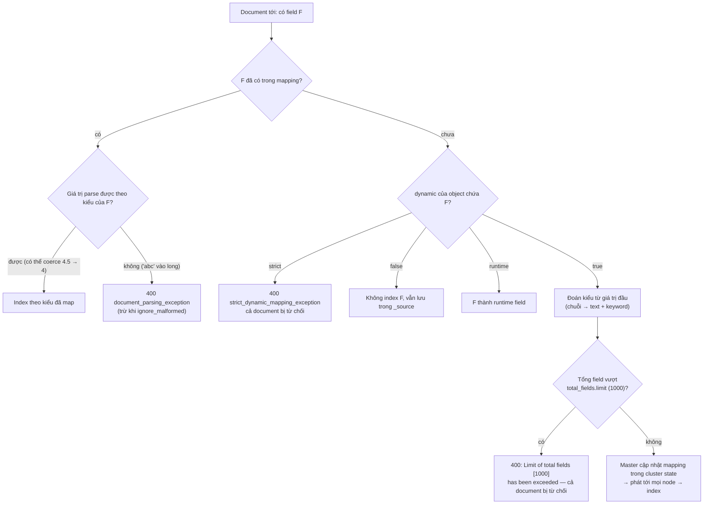
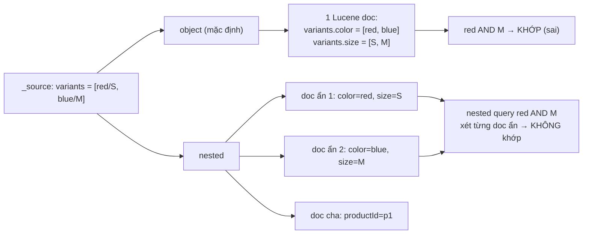

## Bối cảnh & vấn đề

Ngày đầu tiên của một product index, team không khai báo mapping: "Elasticsearch tự đoán được mà". Document đầu tiên có `status: "Active"`, `rating: 4`, `zip: "70000"`. Ba tuần sau xuất hiện ba bug cùng lúc. Filter `{"term": {"status": "Active"}}` trả **0 hit** dù nhìn vào dữ liệu thấy rõ "Active". Sản phẩm rating 4,5 sao không hiện trong bộ lọc "từ 4,5 sao trở lên". Và Data Enrichment Service bắt đầu nhận lỗi `Limit of total fields [1000] has been exceeded`: mọi document mới của một provider đều bị từ chối.

Cả ba bug có chung gốc: **mapping**, tức là schema của index, được tạo tự động từ document đầu tiên và từ những key lạ mà provider gửi tới. Mapping trong Elasticsearch khác schema SQL ở một điểm quyết định: **kiểu của field đã tồn tại không đổi được**. Muốn sửa phải tạo index mới và index lại toàn bộ dữ liệu.

Bài này dạy những lựa chọn mapping quan trọng nhất cho product search: `text` vs `keyword`, dynamic vs explicit mapping, `nested` vs `object` vs `flattened`, và cách chữa mapping explosion. Output chạy thật trên **Elasticsearch 9.5.3**. Analyzer (thứ biến `text` thành term) đã học ở [bài trước](/tracks/nosql-search/learn/inverted-index-analyzers).

**Interview angle:** mapping là nơi interviewer đặt nhiều câu debug nhất ("filter này trả 0 hit, vì sao?", "index từ chối document, vì sao?"). Họ muốn thấy bạn nghĩ theo **term trong index**, không theo chuỗi hiển thị.

## Khái niệm

### Mapping là gì

**Mapping** định nghĩa với mỗi field: kiểu dữ liệu, analyzer (với `text`), có index để search hay không (`index`), có lưu **doc values** (cấu trúc cột trên disk dùng cho sort, aggregation, script) hay không, và các sub-field. Mapping quyết định Lucene sẽ dựng cấu trúc gì cho field: inverted index cho `text`/`keyword`, **points** (BKD tree) cho số/ngày/IP, doc values cho sort/aggregation.

Vì những cấu trúc này được ghi vào **segment bất biến** lúc index, mapping là cam kết: đổi kiểu một field nghĩa là mọi segment chứa field đó đều sai. Xem mapping hiện tại bằng `GET index/_mapping`.

### text vs keyword

**`text`** đi qua analyzer và thành nhiều term: "Áo Thun Cotton" → `áo`, `thun`, `cotton`. Dùng cho **full-text search** (`match`), có relevance score. Mặc định `text` **không có doc values** và **fielddata** tắt, nên **không sort, không aggregate** được: thử là nhận lỗi `Fielddata is disabled on [status]`.

**`keyword`** lưu **nguyên giá trị** như một term duy nhất (có thể qua **normalizer**, ví dụ `lowercase`, nhưng không tách từ). Dùng cho **exact filter** (`term`, `terms`), **sort**, **aggregation**/facet, và có doc values mặc định. `sku`, `status`, `tenantId`, `email`, `category`, id: gần như luôn là `keyword`.

**Multi-field** (`fields`) index cùng một giá trị theo nhiều cách: `name` là `text` cho search, `name.keyword` là `keyword` cho sort và facet. Dynamic mapping mặc định sinh cấu trúc này cho mọi chuỗi, kèm `ignore_above: 256` (chuỗi dài hơn 256 ký tự không được index vào `.keyword`).

**Interview angle:** follow-up "sku do user gõ vào ô search, vì sao vẫn nên là keyword?". Vì sku cần khớp **chính xác** ("TS-001" không được khớp "TS-0011" hay bị tách thành `ts`, `001`). Dùng `keyword` + normalizer `lowercase` để không phân biệt hoa thường, và trong query search thì thêm một nhánh `term` trên `sku` bên cạnh `match` trên `name`.

### Dynamic mapping đoán kiểu

Khi một field chưa có trong mapping xuất hiện, **dynamic mapping** (mặc định `dynamic: true`) đoán kiểu từ **giá trị JSON đầu tiên**:

- Chuỗi → `text` + sub-field `keyword` (`ignore_above: 256`); chuỗi giống ngày (theo `dynamic_date_formats`) → `date`; nếu bật `numeric_detection` thì chuỗi số → số (mặc định tắt, nên `"70000"` thành text).
- Số nguyên → `long`; số thực → `float`.
- `true`/`false` → `boolean`; object → `object`; mảng → kiểu của phần tử đầu.

Đoán sai là **vĩnh viễn** cho index đó. Chạy thật: `rating: 4` ở document đầu tạo field `long`. Document sau có `rating: 4.5` vẫn được nhận (Elasticsearch **coerce** 4.5 thành 4 cho field `long`), `_source` vẫn giữ `4.5`, nhưng giá trị được index là 4. Query `range rating >= 4.5` trả 0 hit, `term rating: 4` trả cả hai. Không có lỗi nào báo cho bạn biết.

### dynamic: true, false, strict, runtime

Tham số `dynamic` (đặt ở gốc mapping hoặc từng object) quyết định số phận field lạ:

- **`true`**: thêm field mới vào mapping (mặc định).
- **`false`**: **bỏ qua** field lạ khi index, nhưng vẫn lưu trong `_source`. Document được nhận, field không search được. Hợp cho object tự do chỉ cần trả về.
- **`strict`**: **từ chối** cả document với `strict_dynamic_mapping_exception`. Hợp cho index có hợp đồng dữ liệu rõ ràng (product index do indexer của bạn kiểm soát).
- **`runtime`**: field lạ thành runtime field (tính lúc query, không index).

**Dynamic template** cho phép dynamic mapping có kiểm soát: "mọi field khớp `attr_*` là `keyword`", "mọi chuỗi là `keyword` thay vì `text`".

### Vì sao không đổi được kiểu field

Dữ liệu đã được index thành cấu trúc Lucene **theo kiểu cũ** (term của `text` đã qua analyzer, số của `long` đã nằm trong BKD tree) trong các segment bất biến. Đổi `status` từ `text` sang `keyword` nghĩa là mọi term `active` (đã lowercase) phải thành `Active` nguyên gốc, điều Lucene không thể suy ngược. Nên API từ chối: `mapper [status] cannot be changed from type [text] to [keyword]`.

Những gì **được phép** trên index đang chạy:

- **Thêm field mới**.
- **Thêm multi-field** vào field có sẵn (ví dụ thêm `status.raw` kiểu `keyword`). Nhưng sub-field mới chỉ có dữ liệu cho document index **sau đó**. Document cũ cần `_update_by_query` (index lại chính nó từ `_source`) để có.
- Đổi một số tham số: `ignore_above`, `search_analyzer`, bật `dynamic`...
- **Runtime field**: định nghĩa field tính lúc query từ `_source` hoặc doc values. Dùng tạm để có "kiểu mới" mà không reindex, nhưng chậm vì tính cho mọi document khớp.

Đổi kiểu hoặc analyzer thật sự: **index mới + reindex + đổi alias** (xem [reindex với alias](/tracks/nosql-search/learn/reindex-alias-bulk)).

### object bị flatten và nested

Lucene không có khái niệm object lồng nhau, nó chỉ có document phẳng với các field nhiều giá trị. Kiểu **`object`** (mặc định cho JSON object) được **làm phẳng**: mảng `variants: [{color: red, size: S}, {color: blue, size: M}]` thành `variants.color = [red, blue]`, `variants.size = [S, M]`. **Liên kết giữa các field của cùng một phần tử bị mất.** Query "color = red AND size = M" khớp product này dù không có variant đỏ size M nào.

Kiểu **`nested`** index mỗi phần tử của mảng thành một **document Lucene ẩn** riêng, nằm liền kề document cha trong cùng block. Query bằng `nested` query (với `path`) chạy điều kiện trên từng document ẩn, nên "red AND M" phải đúng **trong cùng một variant**. Chi phí: số document Lucene tăng (một product 50 variant là 51 document), update bất kỳ field nào của product phải index lại cả block, query và aggregation nested chậm hơn, và có giới hạn `index.mapping.nested_objects.limit` (mặc định 10.000 object mỗi document) cùng `nested_fields.limit` (mặc định 100 field nested mỗi index).

Thay thế: index **mỗi SKU (variant) là một document riêng** có `productId`, rồi dùng `collapse` theo `productId` để trả một kết quả mỗi product. Hợp khi variant có giá, tồn kho riêng và thay đổi thường xuyên.

### flattened

Kiểu **`flattened`** index cả một object tuỳ ý thành **một field duy nhất** trong mapping: mọi leaf value được index như `keyword`, kèm đường dẫn key. Query được `attributes.switch_type: brown` bằng `term`, `terms`, `prefix`, `range`, `exists`. Không bao giờ gây mapping explosion vì chỉ tốn một field.

Cái bạn mất: mọi giá trị là **keyword** nên không full-text (không analyzer), **so sánh theo chuỗi** (range trên số sai), phân biệt hoa thường, không highlight, aggregation chỉ theo key cụ thể. Chạy thật: `range attributes.weight >= "1000"` khớp document có `weight: "900"` vì so sánh chuỗi `"900" > "1000"`.

### Mapping explosion

**Mapping explosion** là khi số field trong mapping tăng không kiểm soát, thường vì **key do người ngoài định nghĩa** (attribute của merchant, custom field của provider, header HTTP, tag) đi vào object có `dynamic: true`. Mỗi key mới là một field mới (thường là hai: `text` + `.keyword`). Hậu quả: mapping nằm trong **cluster state**, được master cập nhật và đẩy tới mọi node ở mỗi lần thêm field; heap tăng; và khi vượt `index.mapping.total_fields.limit` (mặc định **1000**) thì document chứa field mới bị **từ chối toàn bộ**.

Nâng limit lên 10.000 chỉ dời sự cố và làm cluster chậm hơn. Cách chữa thật là đổi mô hình dữ liệu.

## Cơ chế hoạt động

Sơ đồ những gì xảy ra với một field khi document tới index, theo từng chế độ `dynamic`:



Hai điểm cần giải thích. Thứ nhất, nhánh `true` kết thúc bằng một bước **tốn kém ở tầng cluster**: mỗi field mới là một lần cập nhật cluster state do master thực hiện. Index nhận hàng nghìn key lạ mỗi giờ nghĩa là master bận liên tục, và mọi node phải nhận mapping mới. Thứ hai, ba nút lỗi (`ERR1`, `ERR2`, `ERR3`) đều từ chối **cả document**, không chỉ field lỗi. Trong bulk request, lỗi này nằm trong từng item với HTTP tổng vẫn là 200 (xem [bài sync](/tracks/nosql-search/learn/db-es-sync-indexer)); indexer không đọc lỗi từng item sẽ mất document lặng lẽ.

Sơ đồ thứ hai cho thấy vì sao `object` match chéo còn `nested` thì không:



## Ví dụ thực tế

### Dynamic mapping sinh ra gì

```json
PUT dyn/_doc/1
{ "productId": "p-1", "status": "Active", "price": 199000, "rating": 4,
  "createdAt": "2026-09-28T10:00:00Z", "tags": ["a"], "zip": "70000" }
GET dyn/_mapping
```

```text
createdAt → date
price     → long
rating    → long
productId → text + keyword (ignore_above 256)
status    → text + keyword (ignore_above 256)
tags      → text + keyword (ignore_above 256)
zip       → text + keyword (ignore_above 256)
```

`productId` và `zip` thành `text` (vô nghĩa để full-text), `rating` thành `long`. Document tiếp theo có `price: "abc"`:

```text
400 document_parsing_exception: failed to parse field [price] of type [long] in document with id '2'. Preview of field's value: 'abc'
```

### Rating 4.5 bị cắt thành 4

```json
PUT dyn/_doc/3
{ "productId": "p-3", "rating": 4.5 }
GET dyn/_search
{ "query": { "range": { "rating": { "gte": 4.5 } } } }
GET dyn/_search
{ "query": { "term": { "rating": 4 } } }
```

```text
range rating >= 4.5 → 0 hit
term  rating = 4    → 2 hit
```

Không lỗi, không cảnh báo. `_source` vẫn hiển thị `4.5`, nên nhìn document thấy đúng mà query sai. Mapping explicit với `rating: { type: "half_float" }` (hoặc `scaled_float`) từ đầu tránh được hoàn toàn.

### term trên text trả 0 hit

```json
GET dyn/_search
{ "query": { "bool": { "filter": [ { "term": { "status": "Active" } } ] } } }
```

```text
term status = "Active"          → 0 hit
term status.keyword = "Active"  → 1 hit
match status "Active"           → 1 hit
match status "inactive"         → 0 hit
```

`status` là `text`: lúc index "Active" thành term `active`. `term` **không phân tích** query, tìm đúng term `Active` (chữ hoa) và không thấy. `status.keyword` giữ nguyên "Active" nên khớp. `match` phân tích "Active" thành `active` nên "chạy được", nhưng vẫn là lựa chọn sai: nó tính score vô nghĩa cho một filter, và với giá trị nhiều từ ("Out of stock") nó khớp **bất kỳ** từ nào ("stock" khớp "In stock"). Sort và aggregate trên `status` còn lỗi:

```text
Fielddata is disabled on [status] in [dyn]. Text fields are not optimised for operations that require per-document field data like aggregations and sorting, so these operations are disabled by default. Please use a keyword field instead.
```

Fix đúng: map `status` là `keyword` từ đầu, chuẩn hoá giá trị enum ở indexer (`active`), hoặc dùng normalizer `lowercase` để không phân biệt hoa thường.

### Không đổi được kiểu, nhưng thêm được multi-field

```json
PUT dyn/_mapping
{ "properties": { "status": { "type": "keyword" } } }
```

```text
400 illegal_argument_exception: mapper [status] cannot be changed from type [text] to [keyword]
```

```json
PUT dyn/_mapping
{ "properties": { "status": { "type": "text", "fields": { "raw": { "type": "keyword" } } } } }
GET dyn/_search { "query": { "term": { "status.raw": "Active" } } }
POST dyn/_update_by_query?refresh=true
GET dyn/_search { "query": { "term": { "status.raw": "Active" } } }
```

```text
PUT mapping (thêm status.raw)   → acknowledged
term status.raw trước update    → 0 hit
_update_by_query                → {"total":2,"updated":2}
term status.raw sau update      → 1 hit
```

Sub-field mới rỗng cho document cũ cho tới khi `_update_by_query` index lại chúng. Trên index hàng trăm triệu document, `_update_by_query` là một job nặng; thường khi đã tới mức đó thì reindex sang index mới cho sạch.

### dynamic: strict vs false

```json
PUT strict { "mappings": { "dynamic": "strict", "properties": { "name": { "type": "text" } } } }
PUT strict/_doc/1 { "name": "a", "color": "red" }
```

```text
400 strict_dynamic_mapping_exception: [1:22] mapping set to strict, dynamic introduction of [color] within [_doc] is not allowed
```

```json
PUT dfalse { "mappings": { "dynamic": false, "properties": { "name": { "type": "text" } } } }
PUT dfalse/_doc/1?refresh=true { "name": "a", "color": "red" }
GET dfalse/_search { "query": { "term": { "color": "red" } } }
GET dfalse/_doc/1
```

```text
index            → created
term color=red   → 0 hit
_source          → {"name":"a","color":"red"}
```

`strict` báo lỗi to và rõ ở indexer (tốt cho product index do bạn kiểm soát). `false` nhận document, lưu `color` trong `_source` nhưng không search được (tốt cho payload phụ chỉ cần trả về).

### Mapping explosion, tái hiện

Document có `attributes` với 600 key do provider đặt tên, gửi vào index dynamic mặc định:

```ts
const attributes = Object.fromEntries(
  Array.from({ length: 600 }, (_, i) => [`provider_x_custom_field_${i}`, 'yes']),
);
await es.index({ index: 'expl', id: '1', document: { productId: 'p-991', attributes } });
```

```text
400 document_parsing_exception: failed to parse: Limit of total fields [1000] has been exceeded while adding new fields [1001]
```

600 key × 2 field (`text` + `.keyword`) = 1.200 field, vượt 1.000. Cả document bị từ chối. Setting mặc định kiểm được bằng `GET expl/_settings?include_defaults=true`: `total_fields.limit: 1000`, `ignore_dynamic_beyond_limit: false`.

Ba cách sửa, theo thứ tự nên làm:

1. **Normalize ở enrichment**: map key provider về tập attribute chuẩn (`switch_type`, `size`, `bluetooth_version`), key lạ thì bỏ hoặc lưu vào field không index.
2. **Đổi model sang cặp name/value `nested`**, số field cố định dù có bao nhiêu attribute:

```json
"attributes": { "type": "nested", "properties": {
  "name":  { "type": "keyword" },
  "value": { "type": "keyword" }
} }
```

   Query "switch_type = brown" là `nested` + `bool` với hai `term`; facet theo attribute dùng `nested` aggregation.
3. **`flattened`** khi chỉ cần exact match đơn giản:

```json
PUT flat { "mappings": { "properties": { "attributes": { "type": "flattened" } } } }
PUT flat/_doc/1?refresh=true
{ "attributes": { "switch_type": "brown", "Kích thước": "75%", "bluetooth version": "5.1", "weight": "900" } }
```

```text
term  attributes.switch_type = "brown"   → 1 hit
match attributes.switch_type = "Brown"   → 0 hit   (keyword, phân biệt hoa thường)
range attributes.weight >= "1000"        → 1 hit   (so sánh chuỗi: "900" > "1000")
mapping                                  → {"attributes":{"type":"flattened"}}
```

Mapping chỉ có đúng một field dù object có bao nhiêu key. Cái giá là range trên số sai và không có full-text.

### object vs nested với variant

```json
PUT obj { "mappings": { "properties": { "variants": { "properties": {
  "color": { "type": "keyword" }, "size": { "type": "keyword" } } } } } }
PUT nst { "mappings": { "properties": { "variants": { "type": "nested", "properties": {
  "color": { "type": "keyword" }, "size": { "type": "keyword" } } } } } }
-- cùng document: { "productId": "p1", "variants": [ { "color": "red", "size": "S" }, { "color": "blue", "size": "M" } ] }
```

```text
obj: bool filter color=red AND size=M                     → 1 hit (sai)
nst: nested { path: variants, color=red AND size=M }       → 0 hit
nst: nested { path: variants, color=red AND size=S }       → 1 hit
_cat/indices docs.count: obj = 1, nst = 3
```

`docs.count` của `nst` là 3: một document cha cộng hai document ẩn. Đó là chi phí nhìn thấy được của `nested`.

### Mapping explicit cho product index

```json
PUT products_v2
{
  "settings": { "analysis": {
    "analyzer":   { "vi_folded": { "tokenizer": "standard", "filter": ["lowercase", "asciifolding"] } },
    "normalizer": { "lc": { "type": "custom", "filter": ["lowercase"] } }
  } },
  "mappings": {
    "dynamic": "strict",
    "properties": {
      "tenantId":   { "type": "keyword" },
      "sku":        { "type": "keyword", "normalizer": "lc" },
      "status":     { "type": "keyword" },
      "name":       { "type": "text", "analyzer": "vi_folded",
                      "fields": { "exact": { "type": "text" }, "keyword": { "type": "keyword" } } },
      "description":{ "type": "text", "analyzer": "vi_folded" },
      "price":      { "type": "scaled_float", "scaling_factor": 100 },
      "sold":       { "type": "integer" },
      "updatedAt":  { "type": "date" },
      "attributes": { "type": "nested", "properties": {
                        "name": { "type": "keyword" }, "value": { "type": "keyword" } } },
      "raw":        { "type": "object", "enabled": false }
    }
  }
}
```

`dynamic: strict` ở gốc để indexer phát hiện ngay field lạ. `raw` với `enabled: false`: giữ payload gốc trong `_source` mà không parse (tránh explosion), không search được.

## Trade-offs & lựa chọn thay thế

| Kiểu | Full-text | Exact filter | Sort/agg | Chi phí | Dùng cho |
|---|---|---|---|---|---|
| `text` | Có | Kém (theo term) | Không (fielddata tắt) | Inverted index | name, description |
| `keyword` | Không | Có | Có (doc values) | Nhỏ | id, sku, status, tenant, tag |
| `text` + `.keyword` | Có | Có | Có | Gấp đôi | Field cần cả hai |
| `object` | – | Mất liên kết giữa field trong mảng | – | Rẻ nhất | Object đơn, không phải mảng |
| `nested` | Có | Đúng theo phần tử | Nested agg | Nhiều Lucene doc, update cả block | Mảng object cần điều kiện cùng phần tử |
| `flattened` | Không | Có (keyword) | Hạn chế | 1 field | Key tuỳ ý, exact match |
| SKU là document riêng + `collapse` | Có | Đúng | Có | Nhiều document | Variant có giá/tồn kho riêng, đổi thường |

| Chế độ `dynamic` | Field lạ | Khi nào |
|---|---|---|
| `true` | Thêm vào mapping | Prototype, log có schema ổn định |
| `false` | Bỏ qua, giữ `_source` | Payload phụ chỉ cần trả về |
| `strict` | Từ chối document | Index do bạn kiểm soát (product) |
| `runtime` | Runtime field | Khám phá dữ liệu, chấp nhận chậm |

Khi nào chọn gì: product index của hệ thống production nên **explicit mapping + `strict`**, vì indexer của bạn là người duy nhất ghi và mọi field lạ là bug. Attribute do merchant định nghĩa: `nested` name/value khi cần facet chính xác theo từng attribute; `flattened` khi chỉ cần lọc exact. Variant: `nested` khi variant ít và ít đổi; SKU-document + `collapse` khi variant có giá, tồn kho riêng và cập nhật liên tục (tránh index lại cả product mỗi lần đổi tồn kho một SKU).

## Edge cases & failure modes

- **`ignore_above: 256`** trên `.keyword`: chuỗi dài hơn không được index vào keyword, nên `term` và aggregation bỏ qua document đó lặng lẽ. Tên sản phẩm 300 ký tự biến mất khỏi facet.
- **Conflict mapping giữa các index** dùng chung alias hoặc pattern: `price` là `long` ở index tháng 8 và `float` ở tháng 9; query và aggregation trên alias cho kết quả lạ hoặc lỗi. Dùng index template để cố định mapping.
- **Mảng hỗn hợp kiểu**: `tags: [1, "a"]` với field `long` → document bị từ chối.
- **`null` và mảng rỗng** không được index (không có term); `exists` query không thấy chúng. Muốn filter "không có giá" cần `null_value` hoặc field boolean riêng.
- **Nested quá lớn**: product có 20.000 variant vượt `nested_objects.limit` (10.000) → document bị từ chối. Và update một field của product 5.000 variant là index lại 5.001 document Lucene.
- **Thêm multi-field quên `_update_by_query`**: query trên sub-field mới chỉ trả document mới, trông như dữ liệu mất một nửa.
- **Dynamic date detection**: chuỗi "2026-09-30" ở field `note` biến `note` thành `date`, document sau có `note: "hello"` bị từ chối.
- **`ignore_dynamic_beyond_limit: true`** (có sẵn trong 9.x) cho phép nhận document và bỏ qua field vượt limit thay vì từ chối; tiện nhưng che giấu vấn đề mapping.

## Pitfalls

- ❌ Để dynamic mapping tự đoán cho product index → ✅ explicit mapping + `dynamic: strict`; index template cho index theo thời gian.
- ❌ `term` trên field `text` → ✅ `term` trên `keyword` (hoặc `.keyword`); `match` cho `text`. Enum chuẩn hoá ở indexer hoặc normalizer `lowercase`.
- ❌ Sort/aggregate trên `text` hoặc bật `fielddata: true` → ✅ dùng `keyword`/doc values; fielddata ăn heap khủng khiếp.
- ❌ Nâng `total_fields.limit` lên 10.000 khi gặp mapping explosion → ✅ normalize key ở enrichment, `nested` name/value hoặc `flattened`, `dynamic: false`/`strict` cho phần còn lại.
- ❌ Mảng object với điều kiện nhiều field dùng kiểu `object` → ✅ `nested` + `nested` query, hoặc mỗi SKU một document.
- ❌ Số lưu dạng chuỗi (`"900"`) rồi range → ✅ map số là kiểu số; `flattened` chỉ so sánh chuỗi.
- ❌ Cố `PUT _mapping` để đổi kiểu → ✅ index mới + reindex + alias swap; runtime field chỉ là cầu tạm.

## Tóm tắt

- Mapping là schema của index và quyết định cấu trúc Lucene (inverted index, points, doc values). Kiểu field đã có **không đổi được**.
- `text`: analyze, full-text, có score, không sort/agg. `keyword`: nguyên giá trị (normalizer tuỳ chọn), filter/sort/agg. Multi-field cho cả hai.
- Dynamic mapping đoán từ giá trị đầu: chuỗi → text + keyword, số nguyên → long (4.5 sau đó bị coerce thành 4 lặng lẽ). Product index nên explicit + `strict`.
- `dynamic: false` bỏ qua field lạ nhưng giữ `_source`; `strict` từ chối document; `runtime` tính lúc query.
- Được thêm field và multi-field (cần `_update_by_query` cho document cũ); đổi kiểu/analyzer thì index mới + reindex + alias.
- `object` làm phẳng mảng và mất liên kết giữa field; `nested` giữ liên kết với chi phí nhiều Lucene doc; SKU-document + `collapse` là thay thế.
- Mapping explosion: key do bên ngoài định nghĩa + dynamic → vượt 1000 field, document bị từ chối, cluster state phình. Sửa bằng normalize, `nested` name/value, `flattened`, không phải nâng limit.
