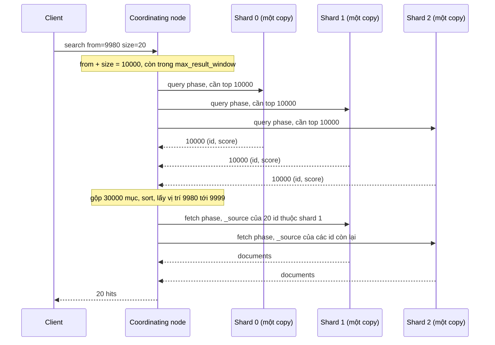
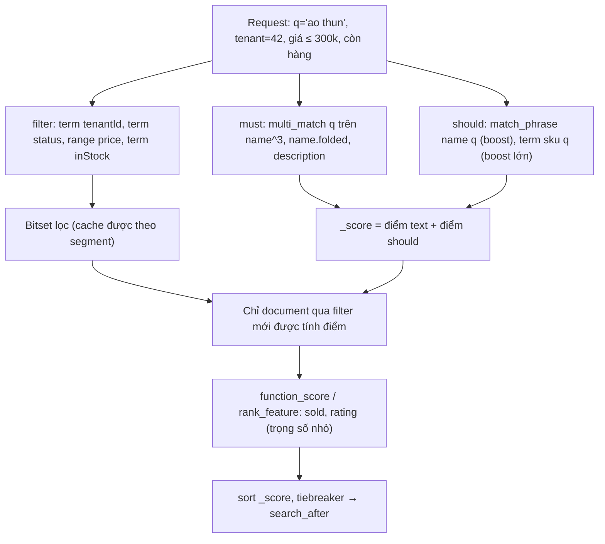

## Bối cảnh & vấn đề

Endpoint search sản phẩm được viết bởi một dev mới với Elasticsearch: mọi điều kiện đều nằm trong `must`, kể cả `tenantId`, `status`, khoảng giá. Kết quả "chạy được", nhưng ba vấn đề xuất hiện. Latency p95 cao hơn mong đợi dù cluster rảnh, vì mọi điều kiện đều được tính điểm và không có gì được cache. Thứ tự kết quả thay đổi khó hiểu giữa các tenant với cùng một query. Và một khách hàng bấm "trang 600" trên UI thì nhận lỗi 500 với thông điệp `Result window is too large`.

Ba vấn đề này đều bắt nguồn từ việc không phân biệt **query context** (tính điểm) và **filter context** (chỉ lọc), không hiểu **BM25** tính điểm từ đâu, và không hiểu search phân tán thực thi qua **query-then-fetch** ra sao. Bài này đi qua cả ba, rồi dạy cách phân trang sâu đúng bằng `search_after` + **Point in Time**. Output chạy thật trên **Elasticsearch 9.5.3** với một index `products_v1` nhỏ (7–8 sản phẩm, hai tenant) để các con số dễ theo dõi.

**Interview angle:** câu "`must` vs `filter`" gần như chắc chắn xuất hiện. Câu trả lời đủ có ba ý: filter không tính điểm, được cache, và việc đưa điều kiện tenant vào `must` **làm thay đổi ranking**.

## Khái niệm

### match và term

**`match`** là full-text query: chuỗi query được **phân tích bằng analyzer của field** thành các term, rồi tìm document chứa các term đó (mặc định OR, `operator: and` để bắt buộc tất cả, `minimum_should_match` cho mức giữa). Dùng cho field `text`. `multi_match` chạy trên nhiều field, mỗi field có thể **boost** (`name^3`). `match_phrase` yêu cầu các term liền kề đúng thứ tự.

**`term`** là exact query: giá trị **không được phân tích**, tìm đúng term đó trong index. Dùng cho `keyword`, số, boolean, date. `terms` cho nhiều giá trị (IN), `range` cho khoảng. Dùng `term` trên field `text` là lỗi kinh điển: "Active" được index thành term `active`, nhưng `term: "Active"` tìm term `Active` và trả 0 hit (tái hiện ở [bài mapping](/tracks/nosql-search/learn/mapping#sec-vi-du-thuc-te)).

Trên field `keyword` có **normalizer**, `term` query **có** áp normalizer (chạy thật: `term sku: "ts-001"` khớp `TS-001` với normalizer `lowercase`).

### bool query: must, filter, should, must_not

**`bool`** kết hợp các mệnh đề:

- **`must`**: phải khớp, **đóng góp điểm**.
- **`filter`**: phải khớp, **không tính điểm**, kết quả có thể được **cache**.
- **`should`**: tăng điểm nếu khớp. Nếu `bool` không có `must`/`filter`, ít nhất một `should` phải khớp; nếu có, `should` chỉ là "cộng điểm" (điều chỉnh bằng `minimum_should_match`).
- **`must_not`**: loại bỏ, chạy trong filter context (không điểm, cache được).

**Query context** trả lời "document này **khớp tốt tới mức nào**?" và tính `_score`. **Filter context** chỉ trả lời "có khớp không?". Filter rẻ hơn vì bỏ qua tính điểm, và Elasticsearch có **node query cache** lưu bitset kết quả của filter trên mỗi segment (với segment đủ lớn và filter được dùng lặp lại), nên lần sau filter `tenantId: 42` gần như miễn phí. Chạy thật: cùng `match name: "thun"` đặt trong `filter` cho mọi hit `_score: 0.0`.

Quy tắc thực hành: **từ khoá người dùng gõ** → `must` (hoặc `should`); **mọi thứ còn lại** (tenant, status, category, khoảng giá, còn hàng, quyền truy cập) → `filter`.

**Interview angle:** follow-up "vì sao đặt tenant trong `must` làm lệch ranking một cách tinh vi?". Vì `term` trong `must` cộng một lượng điểm vào mọi document, và lượng đó phụ thuộc IDF của term `42` trong shard. Tenant nhỏ (term hiếm, IDF cao) được cộng nhiều, tenant lớn cộng ít, nên tỉ lệ giữa phần điểm "từ khoá" và phần "tenant" khác nhau giữa các tenant.

### Query then fetch

Một index có nhiều shard; mỗi shard là một Lucene index độc lập. Search mặc định chạy theo **query-then-fetch**:

1. **Query phase**: **coordinating node** (node nhận request) gửi query tới **một bản copy** (primary hoặc replica) của **mỗi shard** liên quan. Mỗi shard tự tìm, tính điểm và trả về **top `from + size`** kết quả dạng `(doc id, score, sort values)`, không kèm nội dung.
2. Coordinating node **gộp và sắp xếp** các danh sách đó, chọn đúng trang `from..from+size`.
3. **Fetch phase**: chỉ lấy `_source` (và highlight) của những document trong trang đó, từ đúng shard chứa chúng.

Tách hai pha để không truyền nội dung của hàng nghìn document chỉ để bỏ đi. Nhưng bước 1 cũng là lý do **deep pagination đắt**: trang 600 với `size: 20` nghĩa là `from = 11.980`, mỗi shard phải tìm và trả **12.000** kết quả, coordinating node phải gộp `12.000 × số shard`.

### BM25

Điểm mặc định (similarity `BM25`) cho mỗi term của query trong mỗi document được tính từ ba yếu tố:

- **IDF** (inverse document frequency): term càng **hiếm** trong index càng có giá trị. `idf = ln(1 + (N − n + 0.5) / (n + 0.5))`, với N là số document có field, n là số document chứa term.
- **TF** (term frequency) có **bão hoà**: term xuất hiện nhiều lần tăng điểm nhưng giảm dần, điều khiển bằng `k1` (mặc định 1.2).
- **Chuẩn hoá độ dài field**: khớp trong field **ngắn** đáng giá hơn trong field dài, điều khiển bằng `b` (mặc định 0.75), so độ dài field `dl` với trung bình `avgdl`.

`tf = freq / (freq + k1 × (1 − b + b × dl / avgdl))`, điểm term = `boost × idf × tf`, trong đó boost mặc định trong explain là `k1 + 1 = 2.2`. Điểm của query là tổng điểm các term (qua cấu trúc `bool`).

**IDF theo shard**: mặc định mỗi shard tính N và n **trên dữ liệu của chính nó**. Với index nhiều shard mà dữ liệu ít hoặc phân phối lệch (custom routing theo tenant!), cùng một term có IDF khác nhau ở mỗi shard, và điểm giữa các shard không so sánh được. `search_type=dfs_query_then_fetch` thêm một vòng thu thập thống kê toàn cục trước khi tính điểm, đổi lấy một round-trip.

### Tuning relevance cho product search

BM25 thuần hiếm khi đủ cho e-commerce, vì "liên quan" còn có nghĩa là bán chạy, còn hàng, đúng thương hiệu. Các công cụ, theo thứ tự nên thử:

- **Boost field**: `name^3`, `brand^2`, `description`. Khớp ở tên quan trọng hơn khớp ở mô tả.
- **Phrase boost**: thêm `match_phrase` trên `name` trong `should` để "áo thun" liền nhau đứng trên "áo sơ mi... thun".
- **Exact match boost**: `term` trên `sku` hoặc `name.keyword` trong `should` với boost lớn.
- **Tín hiệu nghiệp vụ**: `function_score` (`field_value_factor` trên `sold` với `modifier: log1p`, `decay` theo ngày), hoặc field `rank_feature` + query `rank_feature` (hiệu quả hơn). Giữ trọng số nhỏ so với phần text để không đẩy sản phẩm bán chạy nhưng không liên quan lên đầu.
- **Synonym** ("quần jean" = "quần bò") và **fuzziness** (`fuzziness: AUTO` cho lỗi gõ), bật có kiểm soát vì cả hai làm giảm precision.
- **Đo lường**: một **judgement list** (bộ query thật + kết quả mong muốn có chấm điểm), API `_rank_eval` (tính NDCG, precision@k), và số liệu online (CTR, conversion, tỉ lệ search không kết quả). Không tune theo cảm giác của một người thử vài query.

### Phân trang: from/size, search_after, PIT, scroll

**`from`/`size`** đơn giản nhưng bị chặn bởi `index.max_result_window` (mặc định **10.000**): `from + size` vượt ngưỡng là lỗi 400. Tăng ngưỡng không giải quyết chi phí, chỉ dời nó.

**`search_after`**: thay vì "bỏ qua N kết quả", bạn nói "cho tôi các kết quả **sau** giá trị sort này". Mỗi trang lấy mảng `sort` của hit cuối cùng làm `search_after` cho trang sau. Mỗi shard chỉ cần trả `size` kết quả sau mốc đó, nên chi phí mỗi trang không tăng theo độ sâu. Sort phải **ổn định** và có **tiebreaker duy nhất**; nếu không, các document có cùng giá trị sort có thể bị lặp hoặc bị bỏ qua giữa hai trang.

**Point in Time (PIT)**: `POST index/_pit?keep_alive=1m` trả về một id giữ nguyên **trạng thái segment** tại thời điểm tạo. Search với `pit` thấy một snapshot nhất quán dù index đang được ghi, nên các trang không bị lệch khi có document mới chen vào. Khi dùng PIT, sort có thể thêm `_shard_doc` làm tiebreaker có sẵn (duy nhất và rẻ). PIT giữ segment cũ không bị merge xoá, nên phải đặt `keep_alive` ngắn và đóng khi xong.

**Scroll** là API cũ cho export; docs hiện tại khuyên dùng PIT + `search_after` cho cả deep pagination lẫn export.

## Cơ chế hoạt động

Query-then-fetch cho một trang sâu trên index 3 shard:



Chi phí nằm ở query phase: 3 shard × 10.000 mục phải được tìm, sắp xếp, truyền và gộp, chỉ để trả 20. Tăng số shard hoặc độ sâu nhân chi phí lên. `search_after` biến "cần top 10.000" thành "cần 20 mục sau mốc X", nên mọi trang có chi phí như trang đầu.

Luồng xây một bool query cho product search, tách rõ phần tính điểm và phần lọc:



Filter chạy như một **bitset** giao với tập khớp của phần query, không đóng góp điểm. Điểm chỉ đến từ từ khoá người dùng và tín hiệu nghiệp vụ, nên hai tenant khác nhau với cùng một query có cách xếp hạng cùng logic.

## Ví dụ thực tế

Index `products_v1` có sản phẩm của tenant 42 và tenant 7 (mapping ở [bài mapping](/tracks/nosql-search/learn/mapping#sec-vi-du-thuc-te)).

### Bool query chuẩn cho product search

```json
GET products_v1/_search
{
  "query": { "bool": {
    "must":   [ { "multi_match": { "query": "ao thun", "fields": ["name^3", "name.folded", "description"] } } ],
    "filter": [
      { "term":  { "tenantId": "42" } },
      { "term":  { "status": "active" } },
      { "range": { "price": { "lte": 300000 } } }
    ]
  } }
}
```

```text
[{"_id":"1","_score":1.7897599},{"_id":"2","_score":1.7897599}]
```

Chỉ "Áo thun cotton" và "Áo thun polo" của tenant 42, đang active, dưới 300k. "Áo sơ mi trắng" có "áo thun" trong mô tả nhưng giá 349k nên bị filter loại; "Áo thun trẻ em" `inactive`.

### must vs filter: điểm số

```text
must   [match name "thun"]                            → 1:0.5966, 2:0.5966, 5:0.5966, 4:0.5284
filter [match name "thun"]                            → 1:0.0,    2:0.0,    4:0.0,    5:0.0
must   [match name "thun", term tenantId "42"]        → 1:0.8042, 2:0.8042, 4:0.7360
must   [match name "thun"] + filter [term tenantId]   → 1:0.5966, 2:0.5966, 4:0.5284
```

Trong filter, mọi điểm bằng 0 (thứ tự theo doc id). Đưa `term tenantId` vào `must` cộng thêm khoảng 0,21 vào mọi document; con số đó là IDF của term `42` trong index này. Với tenant 7 (ít document hơn, term hiếm hơn), phần cộng thêm sẽ lớn hơn. Đặt tenant vào `filter` giữ nguyên điểm text, như dòng cuối.

### Exact match cho sku, và vì sao vẫn cần filter tenant

```json
GET products_v1/_search
{ "query": { "term": { "sku": "ts-001" } } }
```

```text
{"hits":{"total":{"value":2,"relation":"eq"}}}
```

Normalizer `lowercase` làm "ts-001" khớp "TS-001". Nhưng 2 hit: sku `TS-001` tồn tại ở **cả tenant 42 và tenant 7**. Trong index chung nhiều tenant, filter tenant không phải tối ưu hoá mà là **ranh giới bảo mật**: nên được thêm tự động ở tầng repository (hoặc qua filtered alias), không phụ thuộc vào từng query viết tay.

### Đọc BM25 qua _explain

```json
GET products_v1/_explain/1
{ "query": { "match": { "name": "thun" } } }
```

```text
weight(name:thun in 0) = 0.7046783, computed as boost * idf * tf from:
  boost = 2.2
  idf   = 0.6931472   computed as log(1 + (N - n + 0.5) / (n + 0.5)) from:
          n = 4   (number of documents containing term)
          N = 8   (total number of documents with field)
  tf    = 0.46210724  computed as freq / (freq + k1 * (1 - b + b * dl / avgdl)) from:
          freq = 1.0, k1 = 1.2, b = 0.75, dl = 3.0, avgdl = 3.125
```

Kiểm tay: `idf = ln(1 + 4.5/4.5) = ln 2 = 0.693`; `tf = 1 / (1 + 1.2 × (0.25 + 0.75 × 3/3.125)) = 0.462`; `2.2 × 0.693 × 0.462 = 0.7047`. Explain này chạy sau khi thêm document thứ 8, nên điểm khác 0,5966 ở ví dụ trên (lúc đó N = 7). Đó là minh hoạ trực tiếp: **điểm của một document thay đổi khi document khác được thêm vào**, vì IDF và `avgdl` thay đổi.

### Trang 600 và lỗi max_result_window

```json
GET products_v1/_search
{ "from": 9995, "size": 10, "query": { "match_all": {} } }
```

```text
400 illegal_argument_exception: Result window is too large, from + size must be less than or equal to: [10000] but was [10005]. See the scroll api for a more efficient way to request large data sets. This limit can be set by changing the [index.max_result_window] index level setting.
```

Lỗi xảy ra **bất kể index có bao nhiêu document** (index này chỉ có 8): kiểm tra dựa trên `from + size`. Thông điệp vẫn nhắc "scroll api", nhưng docs khuyên PIT + `search_after`.

### search_after + PIT

```ts
const { id: pitId } = await es.openPointInTime({ index: 'products_v1', keep_alive: '1m' });

const page = (after?: unknown[]) => es.search({
  size: 3,
  pit: { id: pitId, keep_alive: '1m' },
  sort: [{ updatedAt: 'desc' }, { _shard_doc: 'asc' }],
  ...(after ? { search_after: after } : {}),
});

const p1 = await page();
const p2 = await page(p1.hits.hits.at(-1)!.sort);
```

```text
trang 1: 7 [1788739200000, 6]   6 [1788652800000, 5]   5 [1788566400000, 4]
trang 2: 4 [1788480000000, 3]   3 [1788393600000, 2]   2 [1788307200000, 1]
```

Mảng `sort` của hit cuối trang 1 (`[1788566400000, 4]`, tức `updatedAt` dạng epoch ms và `_shard_doc`) là `search_after` của trang 2. Không có `from`. Request có `pit` thì **không** ghi tên index trong URL (`GET _search`).

Snapshot nhất quán: sau khi mở PIT, thêm document 8 rồi đếm:

```text
_search với pit (track_total_hits) → 7
products_v1/_count                 → 8
```

Người đang phân trang không thấy document mới chen vào giữa, nên không có kết quả bị lặp hoặc nhảy. Đóng PIT khi xong: `DELETE _pit { "id": "..." }`.

Với API public, trả `search_after` dưới dạng **cursor opaque** (base64 của mảng sort, kèm PIT id nếu dùng), không cho phép nhảy tới "trang 600". Phần lớn người dùng không qua trang 5; UI nên khuyến khích filter thay vì phân trang sâu.

### Tuning với should và function_score

```json
GET products/_search
{
  "query": { "function_score": {
    "query": { "bool": {
      "must":   [ { "multi_match": { "query": "ao thun", "fields": ["name^3", "name.folded", "brand^2", "description"] } } ],
      "should": [ { "match_phrase": { "name.folded": { "query": "ao thun", "boost": 2 } } },
                  { "term": { "sku": { "value": "ao thun", "boost": 10 } } } ],
      "filter": [ { "term": { "tenantId": "42" } }, { "term": { "status": "active" } } ]
    } },
    "functions": [ { "field_value_factor": { "field": "sold", "modifier": "log1p", "factor": 0.1 } } ],
    "boost_mode": "sum"
  } }
}
```

`log1p` làm sản phẩm bán 10.000 cái không lấn át hoàn toàn sản phẩm bán 100 cái; `boost_mode: sum` cộng tín hiệu bán chạy vào điểm text thay vì nhân (nhân làm sản phẩm không liên quan nhưng bán chạy vọt lên). Chạy thật trên alias `products` (index v2, vài sản phẩm):

```text
[{"_id":"1","_score":5.29},{"_id":"2","_score":4.70},{"_id":"3","_score":2.03},{"_id":"10","_score":1.22},{"_id":"8","_score":0.99}]
```

"Áo thun cotton" (bán 1.200) và "Áo thun polo" (bán 300) có điểm text bằng nhau, chênh nhau ở phần `log1p(sold)`; "Áo sơ mi trắng" khớp nhờ mô tả nên đứng sau. Trên dữ liệu thật, mọi thay đổi như thế nên được đo bằng `_rank_eval` trên judgement list trước khi ra production.

## Trade-offs & lựa chọn thay thế

| Mệnh đề | Tính điểm | Cache | Dùng cho |
|---|---|---|---|
| `must` | Có | Không | Từ khoá người dùng |
| `filter` | Không | Có (node query cache) | Tenant, status, category, giá, quyền |
| `should` | Có | Không | Boost phrase, exact, thương hiệu |
| `must_not` | Không | Có | Loại trừ (đã xoá, hết hàng) |

| Phân trang | Nhảy trang bất kỳ | Chi phí trang sâu | Nhất quán | Khi nào |
|---|---|---|---|---|
| `from`/`size` | Có | Tăng tuyến tính, chặn ở 10.000 | Không (index đổi giữa các trang) | UI vài trang đầu |
| `search_after` | Không (chỉ trang sau) | Như trang đầu | Không, trừ khi có PIT | Infinite scroll, API cursor |
| `search_after` + PIT | Không | Như trang đầu | Snapshot | Export, phân trang cần ổn định |
| Scroll (cũ) | Không | Giữ context nặng | Snapshot | Code cũ; thay bằng PIT |

Khi nào chọn gì: UI tìm kiếm cho người dùng dùng `from`/`size` cho vài trang đầu (giới hạn số trang hiển thị), infinite scroll dùng `search_after`. Export toàn bộ kết quả hoặc job đồng bộ dùng PIT + `search_after`. Relevance: bắt đầu bằng BM25 + boost field + filter đúng chỗ; chỉ thêm `function_score`, synonym, fuzziness khi có số liệu chứng minh. Với cluster có IDF lệch (dữ liệu nhỏ, routing theo tenant), cân nhắc `dfs_query_then_fetch` cho query cần điểm chính xác, hoặc 1 shard cho index nhỏ.

## Edge cases & failure modes

- **Sort không ổn định**: `search_after` với sort chỉ theo `_score` hoặc `price`: các document cùng giá có thể bị lặp hoặc mất giữa trang. Luôn thêm tiebreaker duy nhất (`_shard_doc` với PIT, hoặc một field id `keyword`).
- **PIT hết hạn**: `keep_alive` quá ngắn cho người dùng đọc chậm, trang sau lỗi `search_context_missing_exception`. Gia hạn ở mỗi request (tham số `keep_alive` trong `pit`) và xử lý lỗi bằng cách mở PIT mới.
- **PIT/scroll bỏ quên** giữ segment cũ, làm disk và heap tăng. Luôn đóng; giới hạn số search context.
- **Filter cache không hiệu quả** khi filter chứa giá trị luôn đổi, ví dụ `range updatedAt >= now` (từng mili giây khác nhau). Làm tròn: `now/m` hoặc `now/d` để cache được.
- **`should` bị hiểu sai**: `bool` có `filter` mà không có `must`, các `should` trở thành tuỳ chọn, và query trả mọi document qua filter. Cần `minimum_should_match: 1` nếu ý đồ là "ít nhất một điều kiện".
- **Score khác nhau giữa replica**: primary và replica có thể có segment khác nhau (chưa merge xoá document đã xoá), nên cùng query cho điểm hơi khác và thứ tự "nhảy" giữa hai lần reload. Dùng `preference` (ví dụ theo session id) để cùng người dùng luôn đi cùng bộ copy.
- **Query quá rộng**: `fuzziness: AUTO` + `wildcard` đầu chuỗi (`*thun`) trên field lớn làm CPU tăng vọt. Chặn wildcard đầu chuỗi (`search.allow_expensive_queries: false` cho môi trường public).

## Pitfalls

- ❌ Mọi điều kiện trong `must` → ✅ chỉ từ khoá người dùng trong `must`; tenant, status, giá, quyền trong `filter` (không điểm, cache được, ranking ổn định giữa tenant).
- ❌ `term` trên field `text` → ✅ `term` trên `keyword`; `match` trên `text`.
- ❌ Tăng `max_result_window` lên 1 triệu → ✅ `search_after` (+ PIT), cursor opaque, giới hạn số trang trong UI.
- ❌ `search_after` với sort không có tiebreaker → ✅ thêm `_shard_doc` (với PIT) hoặc id duy nhất.
- ❌ Tune relevance theo cảm giác → ✅ judgement list + `_rank_eval` + số liệu CTR/conversion.
- ❌ `function_score` nhân mạnh theo `sold` → ✅ `log1p`/`sqrt`, trọng số nhỏ, `boost_mode: sum`; hoặc `rank_feature`.
- ❌ Filter tenant viết tay trong từng query → ✅ bắt buộc ở tầng repository hoặc filtered alias, vì thiếu một lần là lộ dữ liệu tenant khác.

## Tóm tắt

- `match` phân tích query theo analyzer của field (full-text); `term` không phân tích (exact, dùng cho keyword/số/ngày). Normalizer của keyword vẫn áp cho `term`.
- `bool`: `must` tính điểm; `filter` không điểm và cache được; `should` cộng điểm; `must_not` loại trừ. Từ khoá → `must`, mọi thứ khác → `filter`.
- Đặt tenant trong `must` cộng một lượng điểm phụ thuộc IDF, làm ranking khác nhau giữa tenant.
- Search chạy query-then-fetch: mỗi shard trả top `from + size`, coordinating node gộp, rồi fetch `_source` của trang. Trang sâu đắt tuyến tính.
- BM25 = IDF (term hiếm) × TF bão hoà (`k1`) × chuẩn hoá độ dài (`b`); IDF tính theo shard, điểm đổi khi index đổi. `_explain` cho thấy từng thành phần.
- Tuning: boost field, phrase/exact boost, `function_score`/`rank_feature` với trọng số nhỏ, synonym/fuzziness có kiểm soát, đo bằng `_rank_eval` và CTR.
- `from + size` bị chặn ở 10.000 (`max_result_window`); dùng `search_after` với sort có tiebreaker duy nhất, cộng PIT để có snapshot nhất quán.
