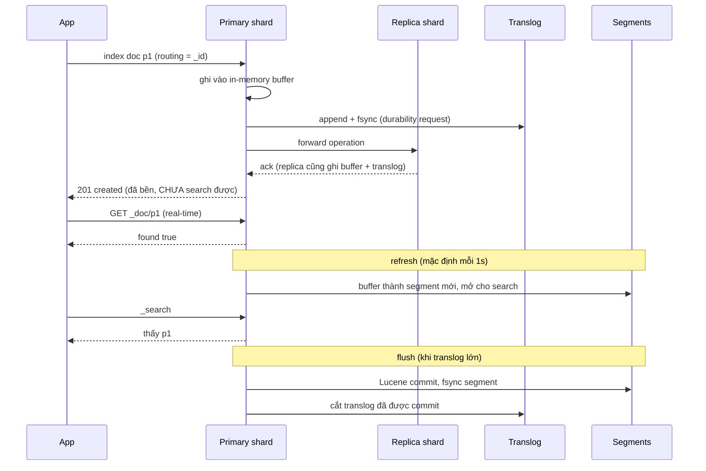
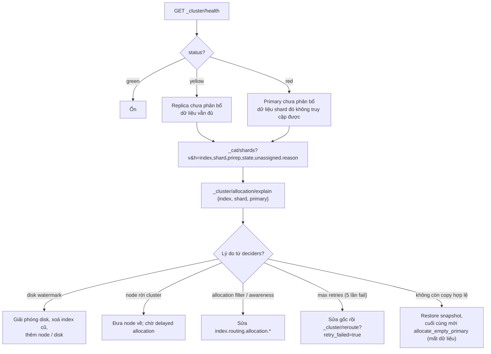

## Bối cảnh & vấn đề

Ba sự cố từ cùng một nền tảng:

- **Test flaky**: integration test tạo sản phẩm qua API rồi gọi ngay endpoint search, kỳ vọng thấy sản phẩm đó. Test pass trên máy dev, fail ngẫu nhiên trên CI khoảng 1/5 lần. Có người thêm `sleep(2000)` và test chậm đi mười lần.
- **Cluster không ổn định**: để "cô lập tenant", team tạo **một index cho mỗi tenant mỗi tháng**, mỗi index 1 primary + 1 replica. Sau hai năm với 3.000 tenant, cluster có 144.000 shard; master liên tục timeout, restart một node mất hàng giờ để các shard được phân bổ lại.
- **Cluster red**: sau khi restart một node, `_cluster/health` báo **red**, một phần search lỗi, và dashboard của đội vận hành chỉ có chữ "red".

Cả ba đều cần hiểu cách Elasticsearch **chia index thành shard**, **đưa document tới shard nào**, và **khi nào document trở nên search được**. Bài này đi qua các cơ chế đó và cách đọc sức khoẻ cluster. Output chạy thật trên **Elasticsearch 9.5.3**, single node trong Docker (nên có vài hiện tượng chỉ single node mới có, ví dụ replica luôn unassigned, được chỉ rõ bên dưới).

**Interview angle:** interviewer hay hỏi "vì sao ES là near real-time?" rồi đào xuống: refresh khác flush thế nào, translog để làm gì, test flaky sửa thế nào mà không hại production.

## Khái niệm

### Cluster, node, index, shard

**Cluster** là tập **node** (mỗi node một process Elasticsearch) cùng chia sẻ dữ liệu, có một **master node** được bầu để quản lý **cluster state** (danh sách index, mapping, settings, vị trí từng shard). **Index** là tập document logic. Mỗi index được chia thành một hoặc nhiều **primary shard**; mỗi shard là **một Lucene index hoàn chỉnh** (inverted index, doc values, segment riêng), có thể nằm trên node khác nhau. Nhờ vậy index lớn hơn một máy và việc search được chạy song song.

### Replica

**Replica shard** là bản sao đầy đủ của một primary, luôn đặt **trên node khác** với primary của nó. Replica phục vụ hai việc: **HA** (primary chết thì replica được **promote** thành primary) và **tăng throughput đọc** (search có thể chạy trên bất kỳ copy nào). Mọi write đi tới primary trước, rồi primary forward sang các replica; request trả về khi các copy đang hoạt động đã ghi.

Vì thế thêm replica **không** giúp indexing nhanh hơn: mỗi document phải được index **thêm** một lần trên mỗi replica (Elasticsearch dùng document replication, mỗi copy tự phân tích và index). Nó cũng không giúp khi **một shard quá lớn**: một query trên shard 200 GB vẫn chậm dù có 3 bản sao của nó.

### Cái gì đổi được sau khi tạo index

- `number_of_replicas`: **đổi bất cứ lúc nào**, là dynamic setting.
- `number_of_shards` (primary): **không đổi trực tiếp**. Chạy thật: `Can't update non dynamic setting(s) [[index.number_of_shards]] for open indices ... cannot be modified on an index once it is created`.
- **`_split`**: tạo index mới có nhiều primary hơn. Số đích phải là **bội số** của số hiện tại và phải chia hết `index.number_of_routing_shards` (mặc định chọn sao cho có thể nhân đôi nhiều lần, tới 1.024 shard). Chạy thật: index 2 shard split thành 8 được, thành 6 lỗi `the number of routing shards [1024] must be a multiple of the target shards [6]`.
- **`_shrink`**: giảm về một **ước số** của số hiện tại (2 → 1 được), cần mọi copy của mọi shard nằm trên cùng một node trong lúc làm.
- Cả hai yêu cầu chặn ghi (`index.blocks.write: true`) trên index nguồn trước. Đổi tuỳ ý (3 → 5) thì phải **reindex**.

### Routing: document về shard nào

Mỗi document có một **routing value**, mặc định là `_id`. Shard được chọn bằng công thức dựa trên `hash(routing) % routing_num_shards`, rồi quy về số primary thực tế (dạng `(hash(routing) % routing_num_shards) / routing_factor`). Công thức cụ thể là chi tiết cài đặt, nhưng hệ quả thì quan trọng:

- Đổi số primary làm mọi document "sai shard", nên không đổi được trực tiếp (split hoạt động được vì nó chia đều theo `routing_num_shards` đã chọn sẵn).
- Search không có routing phải **hỏi mọi shard** (một copy mỗi shard).
- GET/UPDATE/DELETE theo `_id` tính lại shard từ routing, nên phải dùng **đúng routing** đã dùng lúc index.

### Custom routing

**Custom routing** (`?routing=tenant-42`) ép mọi document cùng giá trị routing vào **cùng một shard**. Search của tenant truyền cùng routing chỉ chạm một shard thay vì N: ít tài nguyên hơn, latency ổn định hơn, rất có ích với index chung nhiều tenant nhỏ.

Rủi ro:

- **Hot shard**: tenant lớn làm một shard to và nóng hơn hẳn các shard khác. `index.routing_partition_size` (chọn lúc tạo index) trải một routing value ra một nhóm nhỏ shard thay vì một.
- **Quên routing**: GET/DELETE không kèm routing đi tới shard tính theo `_id`, trả "không tìm thấy". DELETE thiếu routing trả `not_found` và document **vẫn còn**. Đặt `_routing: { required: true }` trong mapping để index/get/delete thiếu routing bị từ chối thay vì âm thầm sai.
- Search không kèm routing vẫn thấy document (vì hỏi mọi shard), nên bug quên routing thường chỉ lộ ra ở GET/DELETE.

### Segment, in-memory buffer và refresh

Khi document được index, primary shard ghi nó vào **in-memory indexing buffer** và đồng thời append vào **translog**. Document **chưa search được**: search chỉ đọc **segment** đã mở, và segment là cấu trúc bất biến.

**Refresh** lấy nội dung buffer, ghi thành **một segment mới** (vào filesystem cache, chưa chắc đã fsync xuống disk) và mở nó cho search. Mặc định refresh chạy **mỗi 1 giây** (`index.refresh_interval: 1s`), vì thế Elasticsearch là **near real-time**: document mới search được sau tối đa khoảng 1 giây.

**Search idle**: nếu một shard không nhận search nào trong `index.search.idle.after` (mặc định 30 giây) và `refresh_interval` **không được đặt tường minh**, shard ngừng refresh định kỳ để tiết kiệm tài nguyên. Search đầu tiên sau đó sẽ **chờ** một refresh rồi mới chạy (chậm hơn một chút nhưng thấy dữ liệu mới).

Mỗi refresh tạo segment nhỏ; nhiều segment nhỏ làm search chậm, nên Lucene **merge** chúng thành segment lớn ở nền. Refresh quá thường xuyên = nhiều segment nhỏ = nhiều merge.

### Translog và flush

**Translog** (transaction log) là log ghi trước trên mỗi shard: mọi thao tác index/delete được append và (mặc định `index.translog.durability: request`) **fsync trước khi trả lời client**. Nếu node chết, những thao tác chưa nằm trong một Lucene commit được **replay từ translog** khi shard khởi động lại. Đây là thứ làm write **bền**, không phải refresh.

**Flush** là **Lucene commit**: fsync các segment xuống disk và ghi commit point, sau đó phần translog tương ứng không còn cần để phục hồi và có thể cắt bớt. Flush chạy tự động (khi translog đủ lớn, mặc định quanh 512 MB). Flush **không liên quan** tới việc search thấy document; đó là việc của refresh.

### Real-time GET và tham số refresh

**GET theo `_id`** là **real-time**: nếu document chưa được refresh, Elasticsearch lấy nó (từ translog/version map, và có thể ép refresh nội bộ), nên GET thấy ngay document vừa index. Chỉ `_search` là near real-time.

Tham số `refresh` trên request ghi:

- `refresh=false` (mặc định): trả về ngay.
- **`refresh=wait_for`**: không ép refresh, mà **chờ lần refresh định kỳ tiếp theo** rồi mới trả lời. Latency của request tăng tới ~1s, nhưng không tạo thêm segment.
- `refresh=true`: **ép refresh ngay** các shard liên quan. Tạo segment nhỏ mỗi lần; gọi thường xuyên trong production làm hại hiệu năng cả cluster.

### Cỡ shard và oversharding

Mỗi shard có **chi phí cố định** dù nhỏ: metadata trong cluster state, heap cho cấu trúc segment, file handle, thread khi search (một search chạm N shard là N task), và công việc khi recovery hoặc rebalance. **Oversharding** là có quá nhiều shard nhỏ: master chậm vì cluster state khổng lồ, heap cạn, search "rộng" chạm hàng nghìn shard, restart node mất hàng giờ vì hàng nghìn shard phải recover.

Hướng dẫn của Elastic: shard khoảng **10–50 GB** và dưới khoảng **200 triệu document**; tránh shard li ti. Có giới hạn cứng `cluster.max_shards_per_node` (mặc định **1.000** shard không frozen mỗi node, chạy thật trả `"max_shards_per_node":"1000"`), vượt thì tạo index mới bị từ chối (verify: con số khuyến nghị có thể đổi theo version; kiểm trang "Size your shards").

Dữ liệu theo thời gian (log, event) dùng **ILM rollover**: ghi qua một alias/data stream, khi index hiện tại đạt ngưỡng (ví dụ `max_primary_shard_size: 50gb` hoặc `max_age: 30d`), ILM tạo index mới và chuyển write sang đó. Index được cắt theo **kích thước**, không theo lịch cứng, nên không sinh ra hàng nghìn index nhỏ.

### Cluster health: green, yellow, red

- **Green**: mọi primary và mọi replica đều được phân bổ (allocated).
- **Yellow**: mọi **primary** được phân bổ, nhưng một số **replica** chưa. Search và ghi vẫn chạy đầy đủ; khả năng chịu lỗi giảm. Cluster một node với `number_of_replicas: 1` **luôn** yellow, vì replica không được đặt cùng node với primary.
- **Red**: ít nhất một **primary** chưa được phân bổ. Dữ liệu của shard đó không truy cập được: search trả kết quả thiếu hoặc lỗi, ghi vào shard đó lỗi.

Công cụ điều tra: `GET _cluster/health`, `GET _cat/shards?v&h=index,shard,prirep,state,unassigned.reason`, và quan trọng nhất `GET _cluster/allocation/explain` (cho biết **vì sao** shard không được phân bổ lên từng node: disk watermark, allocation filter, node thiếu, shard hỏng, số lần thử thất bại).

### Disk watermark

Elasticsearch bảo vệ disk bằng ba ngưỡng (chạy thật, giá trị mặc định): **low 85%** (không phân bổ shard **mới** lên node đó), **high 90%** (bắt đầu **di chuyển** shard ra khỏi node), **flood stage 95%** (đặt block **`index.blocks.read_only_allow_delete`** lên mọi index có shard trên node đó: chỉ đọc và xoá được, ghi bị từ chối). Với disk lớn, mỗi ngưỡng có thêm `max_headroom` (ví dụ flood stage chỉ yêu cầu giữ trống tối đa 100 GB), nên trên disk 10 TB ngưỡng thực tế cao hơn 95%. Từ 7.4, block flood stage được **tự gỡ** khi disk xuống dưới high watermark.

## Cơ chế hoạt động

Vòng đời của một document từ lúc index tới lúc search thấy và lúc bền trên disk:



Ba mốc cần tách bạch: **bền** (sau khi translog fsync và replica ack, trước khi trả 201), **search thấy** (sau refresh), và **commit** (sau flush). Nhầm lẫn hay gặp là nghĩ "refresh = ghi xuống disk" hoặc "flush = làm search thấy". Refresh làm search thấy; translog làm bền; flush dọn translog.

Luồng điều tra khi cluster không green:



Nguyên tắc: **đừng đoán**, đọc `allocation/explain`. Nó trả lời cho từng node "vì sao không đặt shard này ở đây". Thứ tự khắc phục đi từ ít rủi ro tới nhiều rủi ro; lệnh `allocate_stale_primary` hoặc `allocate_empty_primary` là chấp nhận mất dữ liệu và chỉ dùng khi không còn copy và không có snapshot.

## Ví dụ thực tế

### Near real-time, chạy thật

```ts
import { Client } from '@elastic/elasticsearch';
const es = new Client({ node: 'http://localhost:19200' });

await es.indices.create({ index: 'nrt', settings: { number_of_replicas: 0 } });
const count = async () => (await es.search({ index: 'nrt', size: 0, query: { match_all: {} } })).hits.total.value;
await count(); // có search → shard không "idle"

await es.index({ index: 'nrt', id: 'p1', document: { name: 'Áo thun' } });
console.log('search ngay sau index      :', await count(), 'hit');
console.log('GET /_doc/p1 (realtime get):', (await es.get({ index: 'nrt', id: 'p1' })).found);

const t0 = Date.now();
await es.index({ index: 'nrt', id: 'p2', document: { name: 'Áo polo' }, refresh: 'wait_for' });
console.log(`index p2 refresh=wait_for mất ${Date.now() - t0} ms → search:`, await count(), 'hit');

await es.indices.putSettings({ index: 'nrt', settings: { refresh_interval: '-1' } });
await es.index({ index: 'nrt', id: 'p3', document: { name: 'Áo khoác' } });
await new Promise((r) => setTimeout(r, 2000));
console.log('refresh_interval=-1, sau 2s:', await count(), 'hit');
await es.indices.refresh({ index: 'nrt' });
console.log('sau POST /nrt/_refresh      :', await count(), 'hit');
// rồi in es.indices.stats({ metric: ['translog','refresh','flush','segments'] }), gọi _flush, in lại
```

```text
search ngay sau index      : 0 hit
GET /_doc/p1 (realtime get): true
index p2 refresh=wait_for mất 900 ms → search: 2 hit
refresh_interval=-1, sau 2s: 2 hit
sau POST /nrt/_refresh      : 3 hit
{ translog_ops: 3, uncommitted_ops: 3, refreshes: 5, flushes: 0, segments: 3 }
sau _flush: { uncommitted_ops: 0, flushes: 1 }
```

Đọc từng dòng: `_search` ngay sau index không thấy p1, nhưng GET thấy (real-time). `refresh=wait_for` chờ khoảng 900 ms tới refresh định kỳ tiếp theo, sau đó cả p1 và p2 search được. Với `refresh_interval: -1`, p3 không bao giờ search được cho tới khi gọi `_refresh` tay. Stats cho thấy 3 thao tác vẫn "uncommitted" trong translog dù đã refresh 5 lần và có 3 segment: refresh không phải commit. Sau `_flush`, translog không còn thao tác chưa commit.

### Sửa test flaky mà không hại production

Test "tạo sản phẩm rồi search" fail vì search chạy trước refresh. Ba cách, theo thứ tự nên dùng:

1. Trong test, request tạo sản phẩm gửi `refresh: 'wait_for'` qua một tham số chỉ bật ở môi trường test, hoặc test gọi `POST products/_refresh` sau bước arrange. Không `sleep`.
2. Nếu test kiểm "API trả về sản phẩm vừa tạo", hãy kiểm bằng GET theo id (real-time) hoặc đọc từ DB, đúng với cách production nên làm cho trang ngay sau khi tạo.
3. Không bao giờ bật `refresh=true` cho mọi write trong production để "tiện cho test".

Trong production, luồng "tạo xong redirect sang trang chi tiết" nên đọc DB hoặc GET theo id; chỉ trang search mới đọc `_search` và chấp nhận trễ khoảng 1 giây.

### Custom routing và cái bẫy quên routing

```text
PUT rt { number_of_shards: 4 }
PUT rt/_doc/o1?routing=tenant-42&refresh=true     → created, _shards.total 1
GET rt/_doc/o1                                     → {"found":false}
GET rt/_doc/o1?routing=tenant-42                   → {"_routing":"tenant-42","found":true}
DELETE rt/_doc/o1                                  → "result":"not_found"   (document vẫn còn!)
GET rt/_search?routing=tenant-42                   → _shards.total 1, hits 1
GET rt/_search                                     → _shards.total 4, hits 1
```

Search có routing chỉ chạm 1/4 shard. Search không routing vẫn thấy document (hỏi cả 4 shard), nên bug không lộ ra ở trang search, mà lộ ra khi "xoá sản phẩm" trả thành công giả (`not_found` bị code bỏ qua) và sản phẩm vẫn hiện. Bắt buộc routing:

```json
PUT rt2
{ "settings": { "number_of_shards": 4 }, "mappings": { "_routing": { "required": true } } }
PUT rt2/_doc/o1  { "a": 1 }
```

```text
400 routing_missing_exception: routing is required for [rt2]/[o1]
```

### Đổi số shard: split, shrink, và giới hạn

```text
PUT sp { number_of_shards: 2 } ; PUT sp/_settings { index.blocks.write: true }
POST sp/_split/sp6 { index.number_of_shards: 6 }  → illegal_state_exception: the number of routing shards [1024] must be a multiple of the target shards [6]
POST sp/_split/sp8 { index.number_of_shards: 8 }  → acknowledged
POST sp/_shrink/sp1 { index.number_of_shards: 1 } → acknowledged
PUT sp/_settings { index.number_of_shards: 3 }    → Can't update non dynamic setting(s) ...
```

Split nhanh vì nó hard-link segment rồi xoá document không thuộc shard mới ở nền, không index lại. Nhưng nó chỉ nhân theo hệ số chia hết `routing_num_shards`, và index nguồn phải chặn ghi trong lúc làm. Muốn 3 → 5 hoặc đổi mapping cùng lúc thì reindex.

### Oversharding: phép tính và giới hạn

3.000 tenant × 24 tháng = **72.000 index**; × (1 primary + 1 replica) = **144.000 shard**. Với giới hạn mặc định 1.000 shard mỗi node, cluster cần ít nhất 144 node chỉ để **được phép** tạo chừng đó shard, dù tổng dữ liệu có thể chỉ vài trăm GB (trung bình vài MB mỗi shard). Chạy thật với giới hạn hạ xuống 30 để thấy thông điệp:

```text
PUT _cluster/settings { persistent: { cluster.max_shards_per_node: 30 } }
PUT many { number_of_shards: 20 }
→ validation_exception: this action would add [20] shards, but this cluster currently has [52]/[30] maximum normal shards open
```

Thiết kế lại: **một index chung** cho catalog (filter theo `tenantId`, custom routing hoặc filtered alias cho tenant nhỏ), vài primary shard theo tổng dung lượng; **index riêng chỉ cho vài tenant rất lớn**; dữ liệu theo thời gian thì ILM rollover theo kích thước và xoá theo retention; `_shrink` cho index cũ đã ngừng ghi.

### Yellow và red, tái hiện

```text
PUT yel { number_of_shards: 1, number_of_replicas: 1 }       (cluster 1 node)
GET _cluster/health/yel        → {"status":"yellow","unassigned_shards":1}
GET _cat/shards/yel            → yel 0 p STARTED ; yel 0 r UNASSIGNED INDEX_CREATED
allocation/explain (replica)   → "a copy of this shard is already allocated to this node"
```

Replica không được đặt cùng node với primary, nên cluster một node không bao giờ green với replica 1. Đây là yellow "vô hại" trong dev; trong production, yellow kéo dài nghĩa là mất HA.

Red: tạo index với allocation filter trỏ tới node không tồn tại, mô phỏng "node chứa primary không quay lại":

```text
PUT red { number_of_shards: 1, number_of_replicas: 0, index.routing.allocation.require._name: "node-khong-ton-tai" }
GET _cluster/health            → {"status":"red","unassigned_shards":9}
GET _cat/shards/red            → red 0 p UNASSIGNED INDEX_CREATED
allocation/explain (primary)   → decider "filter": node does not match index setting [index.routing.allocation.require] filters [_name:"node-khong-ton-tai"]
GET red/_search                → 503 no_shard_available_action_exception (all shards failed)
PUT red/_doc/1?timeout=2s      → unavailable_shards_exception: [red][0] primary shard is not active Timeout: [2s]
```

`allocation/explain` chỉ thẳng decider `filter` và setting gây ra. Với sự cố thật sau restart, decider thường là `disk_threshold` (disk vượt watermark), `same_shard`, `max_retry` (shard fail 5 lần liên tiếp), hoặc không còn copy nào hợp lệ.

### Watermark mặc định

```text
GET _cluster/settings?include_defaults=true (lọc watermark)
low 85%, high 90%, flood_stage 95%
low.max_headroom 200GB, high.max_headroom 150GB, flood_stage.max_headroom 100GB
```

Khi flood stage kích hoạt, mọi write vào index bị ảnh hưởng nhận lỗi `cluster_block_exception ... index [products] blocked by: [TOO_MANY_REQUESTS/12/disk usage exceeded flood-stage watermark, index has read-only-allow-delete block]` (thông điệp theo docs; không tái hiện được trong môi trường này). Xử lý: xoá index cũ hoặc snapshot rồi xoá, thêm disk/node; block tự gỡ khi disk xuống dưới high watermark. Trên version cũ phải gỡ tay: `PUT products/_settings { "index.blocks.read_only_allow_delete": null }`.

## Trade-offs & lựa chọn thay thế

| Quyết định | Ít | Nhiều | Gợi ý |
|---|---|---|---|
| Số primary shard | Shard to, recovery chậm, ít song song | Oversharding, overhead heap/cluster state | Shard 10–50 GB; index nhỏ (< vài GB) thì 1 shard |
| Số replica | Mất HA (0 replica) | Tốn disk, index chậm hơn | 1 cho production; 0 tạm thời khi bulk load |
| `refresh_interval` | 1s: thấy nhanh, nhiều segment | 30s/-1: index nhanh, trễ search | 1s cho catalog; 30s cho log; -1 khi bulk load |
| Routing | Mặc định: đều, search hỏi mọi shard | Custom: search 1 shard, rủi ro hot shard | Custom cho nhiều tenant nhỏ, `routing_partition_size` nếu lệch |

| Tổ chức multi-tenant | Ưu | Nhược |
|---|---|---|
| Index chung + filter `tenantId` | Ít shard, vận hành đơn giản | Phải bảo đảm filter; IDF trộn giữa tenant |
| Index chung + custom routing | Search 1 shard | Hot shard với tenant lớn |
| Index per tenant | Cô lập, xoá tenant dễ | Oversharding khi nhiều tenant |
| Lai: chung cho nhỏ, riêng cho lớn | Cân bằng | Logic định tuyến ở app/alias |

Khi nào chọn gì: đa số nền tảng SaaS nên dùng index chung (có thể kèm routing) và chỉ tách index cho tenant rất lớn hoặc có yêu cầu cô lập hợp đồng. Dữ liệu theo thời gian dùng data stream + ILM rollover theo kích thước. Tăng replica để tăng throughput **đọc** hoặc HA, không phải để chữa ghi chậm hay shard quá lớn.

## Edge cases & failure modes

- **Replica thiếu thì ghi vẫn chạy**: primary vẫn nhận write khi replica chưa phân bổ (yellow); `wait_for_active_shards` mặc định là 1. Node chứa primary chết trước khi replica bắt kịp là mất HA thật sự.
- **Delayed allocation**: khi node rời cluster, replica của nó không được phân bổ lại ngay mà chờ `index.unassigned.node_left.delayed_timeout` (mặc định 1 phút) để tránh copy dữ liệu vô ích nếu node quay lại nhanh (restart). Cluster yellow một phút sau restart là bình thường.
- **Recovery sau khi bật replica**: đặt `number_of_replicas: 1` sau bulk load, cluster yellow cho tới khi replica copy xong segment từ primary. Với 50 GB có thể mất hàng chục phút; bình thường, miễn là đang tiến triển (`_cat/recovery?active_only`).
- **Refresh quá thường**: code gọi `refresh=true` trên mỗi write làm sinh hàng nghìn segment nhỏ mỗi phút, merge không kịp, CPU và IO tăng.
- **Translog `async`**: đặt `index.translog.durability: async` tăng tốc ghi nhưng có thể mất tới `sync_interval` (5s) dữ liệu khi node chết.
- **Split brain ở version cũ**: trước 7.x, `discovery.zen.minimum_master_nodes` cấu hình sai có thể cho hai master cùng lúc. Từ 7.0 cơ chế bầu master mới tự quản lý quorum.
- **Cluster red vì shard hỏng**: disk lỗi làm segment corrupt; không còn copy lành thì chỉ còn snapshot. Không có snapshot → mất dữ liệu shard đó.

## Pitfalls

- ❌ `sleep(2000)` trong test để chờ search → ✅ `refresh: 'wait_for'` hoặc `_refresh` trong test; GET theo id khi kiểm document vừa tạo.
- ❌ `refresh=true` trên mọi write production → ✅ để refresh định kỳ; `wait_for` chỉ ở luồng thật sự cần.
- ❌ Tăng replica để chữa indexing chậm → ✅ replica làm ghi chậm hơn; tối ưu bulk, `refresh_interval`, cỡ shard.
- ❌ Index per tenant per tháng → ✅ index chung + filter/routing, index riêng cho tenant lớn, ILM rollover theo kích thước.
- ❌ Custom routing nhưng GET/DELETE không truyền routing → ✅ `_routing.required: true`, và kiểm tra `result` của delete.
- ❌ Thấy red thì restart cả cluster → ✅ `_cat/shards` + `_cluster/allocation/explain`, sửa đúng nguyên nhân, `reroute?retry_failed=true`.
- ❌ Không có snapshot vì "ES chỉ là read model" → ✅ vẫn cần snapshot (dựng lại từ DB mất hàng giờ); hoặc chứng minh rebuild đủ nhanh.

## Tóm tắt

- Index chia thành primary shard (mỗi shard là một Lucene index); replica là bản sao trên node khác cho HA và đọc. Replica đổi bất cứ lúc nào; primary cố định trừ `_split` (bội số chia hết `routing_num_shards`) và `_shrink` (ước số), hoặc reindex.
- Routing mặc định theo `_id`; custom routing (vd theo tenant) cho search 1 shard nhưng có rủi ro hot shard và phải truyền routing cho mọi GET/UPDATE/DELETE (`_routing.required`).
- Near real-time: document vào buffer + translog (bền), **refresh** mỗi 1s biến buffer thành segment search được, **flush** là Lucene commit và cắt translog. GET theo id là real-time.
- `refresh=wait_for` chờ refresh kế tiếp; `refresh=true` ép refresh và hại hiệu năng nếu lạm dụng. Shard search idle sau 30s bỏ refresh định kỳ.
- Shard 10–50 GB; mỗi shard có chi phí cố định; `cluster.max_shards_per_node` mặc định 1.000. Tránh index per tenant per tháng; dùng ILM rollover.
- Yellow = replica chưa phân bổ; red = primary chưa phân bổ, dữ liệu shard đó không truy cập được. Điều tra bằng `_cat/shards` và `_cluster/allocation/explain`.
- Watermark: low 85%, high 90%, flood stage 95% (kèm `max_headroom`); flood stage đặt block read-only-allow-delete, tự gỡ khi disk xuống dưới high.
