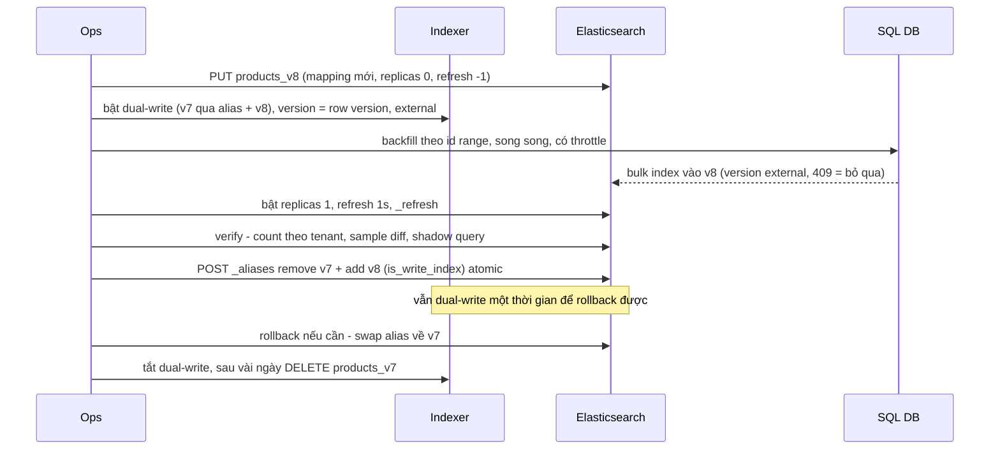
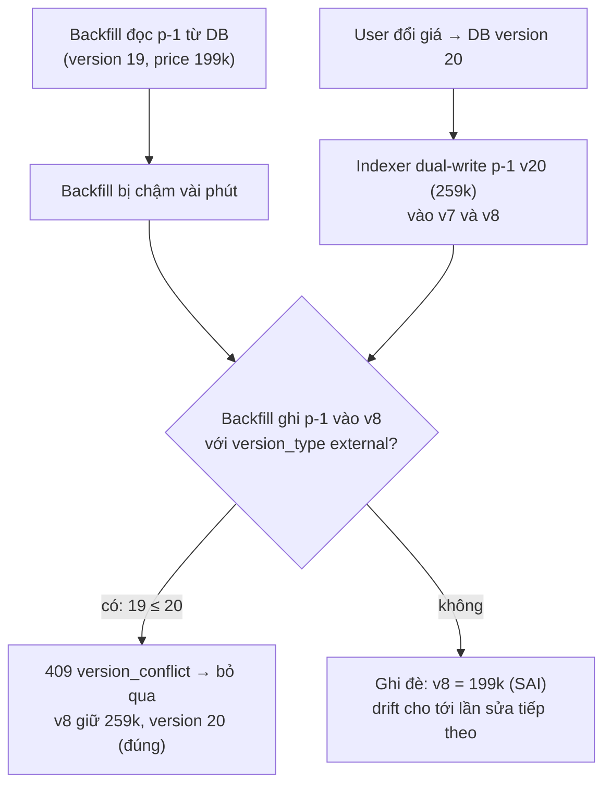

## Bối cảnh & vấn đề

Product index `products` đang phục vụ search cho 40 tenant. Team cần đổi analyzer của `name` sang cấu hình bỏ dấu tiếng Việt, đổi `attributes` từ `object` sang `nested`, và map lại `status` thành `keyword`. Như [bài mapping](/tracks/nosql-search/learn/mapping) đã chỉ ra, không lệnh nào đổi được kiểu hay analyzer của field đang có dữ liệu. Cách duy nhất là **tạo index mới với mapping mới và index lại toàn bộ dữ liệu**.

Lần đầu team làm việc này theo kiểu "maintenance": xoá index cũ, tạo index mới cùng tên, chạy script backfill từ SQL Server. Trong 3 tiếng backfill, search trả kết quả thiếu; một số tenant thấy trang trống. Tệ hơn, những sản phẩm được sửa **trong lúc backfill** có lúc hiện giá cũ: script đọc một lô từ DB, chậm vài phút, rồi ghi đè lên bản mới mà indexer vừa ghi.

Bài này dạy cách làm việc đó **không downtime**: app nói chuyện qua **alias**, index mới được dựng song song, write trong lúc dựng được xử lý đúng, và cutover là một thao tác atomic có đường rollback. Phần sau là tối ưu bulk load và một kế hoạch cho 500 triệu document. Output chạy thật trên **Elasticsearch 9.5.3**.

**Interview angle:** câu "zero-downtime reindex" là câu design kinh điển. Interviewer sẽ đào vào **writes trong lúc reindex** và **race giữa backfill và update live**; câu trả lời không nói về versioning thường bị đánh giá thiếu.

## Khái niệm

### Alias

**Alias** là tên ảo trỏ tới một hoặc nhiều index. App search và ghi vào `products`, còn `products` thực chất trỏ tới `products_v7`. Đổi alias sang `products_v8` là đổi index thật mà app không cần deploy. Quy tắc: **app không bao giờ biết tên index thật**, kể cả ở lần đầu tiên (tạo `products_v1` + alias `products` ngay từ ngày đầu).

Alias còn có thể có **filter** (filtered alias: `products_tenant_42` = `products` + filter `tenantId: 42`) và **routing**, hữu ích cho multi-tenant.

### Write index và atomic swap

Alias trỏ tới **nhiều** index vẫn search được (search trên tất cả), nhưng **ghi** thì Elasticsearch cần biết ghi vào đâu. Nếu không có index nào được đánh dấu **`is_write_index: true`**, ghi qua alias đó bị từ chối: `no write index is defined for alias [products]`. Alias trỏ tới đúng một index thì index đó mặc định là write index.

**`POST _aliases`** nhận một danh sách `actions` (`add`, `remove`, `remove_index`) và áp dụng **atomic**: mọi action cùng có hiệu lực, không có thời điểm nào alias trỏ tới không index nào hoặc tới cả hai ngoài ý muốn. Cutover = một request gồm `remove v7` + `add v8`.

### _reindex và backfill từ DB

**`_reindex`** copy document từ index nguồn sang index đích **bên trong cluster**, đọc `_source` và index lại theo mapping mới. Nhanh, không cần code, hỗ trợ `slices` để chạy song song, `script` để biến đổi, `version_type: external` để giữ version. Nhưng nó copy **đúng những gì đang có trong index cũ**: document đã drift, field đã bị mất vì `dynamic: false`, dữ liệu sai do bug cũ đều được copy nguyên.

**Backfill từ DB** chạy chính code indexer (load từ source of truth, transform, enrich) cho toàn bộ id. Chậm hơn và tốn tải DB, nhưng kết quả **đúng theo DB hiện tại**, sửa luôn drift, và dùng được khi document mới cần field mà `_source` cũ không có. Với product search nơi DB là nguồn sự thật, backfill thường là lựa chọn đúng; `_reindex` hợp khi `_source` đầy đủ, đáng tin, và chỉ đổi analyzer/mapping.

### Writes trong lúc reindex

Backfill 3 tiếng thì trong 3 tiếng đó vẫn có sản phẩm được tạo, sửa, xoá. Có hai chiến lược:

- **Dual-write**: indexer ghi mỗi thay đổi vào **cả v7 (qua alias) và v8**. Khi backfill xong, v8 đã có mọi thay đổi trong lúc backfill. Rollback sau cutover rẻ, vì v7 vẫn được cập nhật.
- **Ghi nhớ điểm bắt đầu rồi replay**: ghi lại offset Kafka (hoặc vị trí outbox/CDC) tại lúc bắt đầu backfill; sau khi backfill xong, cho một consumer riêng replay mọi event từ offset đó vào v8 cho tới khi bắt kịp, rồi cutover.

Cả hai đều gặp một **race**: backfill đọc sản phẩm p-1 từ DB lúc version 19, bị chậm; trong lúc đó user sửa giá (version 20), indexer ghi version 20 vào v8; rồi backfill ghi snapshot version 19 **đè lên**. Chữa bằng **external versioning**: mọi write vào ES (của indexer lẫn backfill) mang `version` = version của row trong DB (monotonic) với `version_type: external`. Write mang version nhỏ hơn hoặc bằng version hiện có bị từ chối với 409, và bị bỏ qua.

### Tối ưu bulk load

Nạp hàng chục triệu document vào **index mới chưa phục vụ traffic** có thể tắt những thứ chỉ cần cho index live:

- **`number_of_replicas: 0`** trong lúc load: mỗi document chỉ index một lần. Bật lại sau, replica sẽ **copy segment** từ primary (rẻ hơn index lại).
- **`refresh_interval: -1`**: không tạo segment mới mỗi giây; ít segment nhỏ, ít merge. Bật lại (`null` để về mặc định) và `_refresh` khi xong.
- **Bulk API** với request cỡ **vài MB** (thử 5–15 MB, đo để chọn), **nhiều worker song song**, tăng dần tới khi cluster bắt đầu trả `429`.
- **Xử lý `429 es_rejected_execution_exception`** (thread pool write đầy) bằng exponential backoff, và **đọc lỗi từng item**: bulk trả HTTP 200 kể cả khi một số item lỗi, cờ `errors: true` và `items[i].index.error` mới cho biết.
- **ID**: để Elasticsearch tự sinh id nhanh hơn một chút (không phải kiểm tra id tồn tại), nhưng mất **idempotency** (retry tạo bản trùng). Product index gần như luôn dùng id nghiệp vụ.
- Bỏ index cho field không search (`index: false`, `enabled: false`), tránh `_source` quá lớn; chạy vào giờ thấp điểm hoặc trên node tách riêng; theo dõi heap, merge, disk.

## Cơ chế hoạt động

Toàn bộ quy trình reindex không downtime với dual-write:



Thứ tự các bước là điểm mấu chốt. **Dual-write phải bật trước khi backfill bắt đầu**; nếu bật sau, mọi thay đổi xảy ra giữa lúc backfill đọc một row và lúc dual-write bật sẽ bị mất ở v8. External versioning làm thứ tự giữa backfill và dual-write không còn quan trọng: bản nào mang version lớn hơn thắng. Verify xảy ra **trước** cutover, trên v8 đã có replica và refresh bình thường, để số liệu phản ánh đúng trạng thái sẽ phục vụ. Và dual-write **tiếp tục sau cutover**: đó là điều làm rollback (swap alias ngược lại) an toàn, vì v7 vẫn mới.

Race giữa backfill và update live, và vì sao external version giải quyết được:



## Ví dụ thực tế

### Alias từ ngày đầu và cutover atomic

```json
POST _aliases
{ "actions": [ { "add": { "index": "products_v1", "alias": "products" } } ] }
```

Tạo index mới với mapping mới (analyzer bỏ dấu, `dynamic: strict`) và trong lúc nạp thì tắt replica/refresh:

```json
PUT products_v2
{
  "settings": { "number_of_shards": 1, "number_of_replicas": 0, "refresh_interval": "-1",
    "analysis": { "analyzer": { "vi_folded": { "tokenizer": "standard", "filter": ["lowercase", "asciifolding"] } },
                  "normalizer": { "lc": { "type": "custom", "filter": ["lowercase"] } } } },
  "mappings": { "dynamic": "strict", "properties": {
    "tenantId": { "type": "keyword" }, "sku": { "type": "keyword", "normalizer": "lc" },
    "status": { "type": "keyword" },
    "name": { "type": "text", "analyzer": "vi_folded",
              "fields": { "exact": { "type": "text" }, "keyword": { "type": "keyword" } } },
    "description": { "type": "text", "analyzer": "vi_folded" },
    "price": { "type": "scaled_float", "scaling_factor": 100 }, "sold": { "type": "integer" },
    "updatedAt": { "type": "date" } } }
}
```

Copy bằng `_reindex` (index nhỏ, `_source` đáng tin), giữ version bằng `external`:

```json
POST _reindex?wait_for_completion=true
{ "source": { "index": "products_v1" }, "dest": { "index": "products_v2", "version_type": "external" } }
```

```text
{"took":16,"total":8,"created":8,"failures":[]}
```

Bật lại refresh, verify count:

```text
PUT products_v2/_settings { refresh_interval: null } ; POST products_v2/_refresh
GET _cat/count/products_v1,products_v2 → 16   (8 + 8, alias chưa đổi)
```

Thử thêm v2 vào alias mà **không** chỉ định write index:

```json
POST _aliases { "actions": [ { "add": { "index": "products_v2", "alias": "products" } } ] }
PUT products/_doc/1 { "tenantId": "42" }
```

```text
400 illegal_argument_exception: no write index is defined for alias [products]. The write index may be explicitly disabled using is_write_index=false or the alias points to multiple indices without one being designated as a write index
```

Cutover atomic:

```json
POST _aliases
{ "actions": [
  { "remove": { "index": "products_v1", "alias": "products" } },
  { "add":    { "index": "products_v2", "alias": "products", "is_write_index": true } }
] }
GET _alias/products
```

```text
{"acknowledged":true,"errors":false}
{"products_v2":{"aliases":{"products":{"is_write_index":true}}}}
```

Ngay sau đó, `match name: "AO THUN"` qua alias trả sản phẩm 1, 2, 5: analyzer mới bỏ dấu đã có hiệu lực mà app không đổi dòng code nào. Rollback = cùng request với `v1` và `v2` đổi chỗ.

### Race backfill vs update live, chạy thật

```ts
// DB: p-1 version 19. Backfill đọc snapshot {price: 199000, version: 19} rồi bị chậm.
// Trong lúc đó user đổi giá → version 20 → indexer dual-write vào v7 và v8:
await es.index({ index: 'race_v8', id: 'p-1', document: { price: 259000 }, version: 20, version_type: 'external' });

// Backfill ghi snapshot cũ:
await es.index({ index: 'race_v8', id: 'p-1', document: { price: 199000 }, version: 19, version_type: 'external' });
```

```text
backfill có external version → 409 version_conflict_engine_exception
  v8 p-1: price 259000, _version 20
backfill KHÔNG có external version → updated
  v8 p-1: price 199000, _version 21
```

Không có external version, snapshot cũ ghi đè giá mới và ES giữ giá sai cho tới lần sửa tiếp theo của sản phẩm (có thể là vài tháng). Trong bulk, conflict không làm request throw:

```text
bulk errors: true | item: 409 version_conflict_engine_exception
```

Code backfill phải coi item 409 là **bình thường** (bản mới hơn đã có) và coi mọi lỗi khác là cần retry hoặc đưa vào DLQ.

### Bulk load: cấu hình và số đo

Script nạp 300.000 document (mỗi request bulk khoảng 5 MB, một worker, single node, `number_of_replicas: 0`):

```ts
let body: object[] = [], bytes = 0;
for (let i = 0; i < N; i++) {
  const d = doc(i);
  body.push({ index: { _index: index, _id: `p-${i}` } }, d);
  bytes += JSON.stringify(d).length + 40;
  if (bytes > 5 * 1024 * 1024) { await flush(); }
}
async function flush() {
  const r = await es.bulk({ operations: body });
  if (r.errors) handleItemErrors(r.items); // 200 OK vẫn có thể có item lỗi
  body = []; bytes = 0;
}
```

```text
bulk_default   refresh_interval=1s: 20 bulk req ~5MB, load 11111 ms, refreshes 12, segments 10
bulk_norefresh refresh_interval=-1: 20 bulk req ~5MB, load 12527 ms, refreshes 4, segments 2
bulk_default   refresh_interval=1s: 20 bulk req ~5MB, load 7750 ms, refreshes 9, segments 7
bulk_norefresh refresh_interval=-1: 20 bulk req ~5MB, load 7133 ms, refreshes 4, segments 2
```

Kết quả trung thực: ở quy mô nhỏ này với một worker, **thời gian nạp chênh lệch nằm trong nhiễu** (lần chạy đầu chậm vì JVM chưa "nóng"). Khác biệt đo được là **số segment**: 7–10 so với 2, tức ít việc merge hơn về sau. Lợi ích lớn của `refresh_interval: -1` và `replicas: 0` xuất hiện ở quy mô hàng chục triệu document với nhiều worker và cluster nhiều node, nơi refresh mỗi giây và index trên replica tranh CPU/IO với indexing. Hãy **đo trên dữ liệu và cluster của bạn**: chọn cỡ bulk và số worker bằng cách tăng dần cho tới khi throughput ngừng tăng hoặc bắt đầu có `429`.

Lỗi từng item, chạy thật với một document sai kiểu và một document có field lạ trong index `strict`:

```text
HTTP 200
errors: true
10 201 created
11 400 document_parsing_exception: failed to parse field [price] of type [scaled_float] in document with id '11'
12 400 strict_dynamic_mapping_exception: mapping set to strict, dynamic introduction of [color] within [_doc] is not allowed
```

Indexer chỉ kiểm HTTP status sẽ tưởng cả ba thành công.

### Kế hoạch cho 500 triệu document, 40 tenant

1. **Chuẩn bị**: index template cho `products_v9` (mapping + analyzer mới); tính số primary theo cỡ shard 30–40 GB; `replicas: 0`, `refresh_interval: -1` cho giai đoạn nạp.
2. **Dual-write** trong indexer: ghi v8 (qua write alias) và v9, cùng `version` external. Bật trước mọi thứ khác.
3. **Backfill từ DB** theo **tenant và id range** (ví dụ mỗi job một dải `id` của một tenant), song song có **throttle** (giới hạn QPS vào DB replica, giới hạn bulk concurrency vào ES), checkpoint để chạy lại từ chỗ dừng. Hoặc `_reindex` với `slices: auto` nếu `_source` của v8 đủ tin cậy và không cần enrich lại.
4. **Hoàn thiện index**: bật replica, refresh, có thể `_forcemerge` nếu index gần như chỉ đọc (cân nhắc, vì catalog vẫn nhận update).
5. **Verify**: count theo tenant giữa DB, v8 và v9; so sánh mẫu (hash của các field quan trọng) theo lô id; **shadow traffic**: app gửi một phần query thật tới cả v8 và v9 (v9 kết quả không trả cho user), so overlap top-10, latency p95/p99, tỉ lệ zero-result; relevance check trên judgement list.
6. **Cutover**: theo tenant (filtered alias `products_t42` chuyển trước với vài tenant nhỏ) hoặc toàn bộ, bằng một `POST _aliases` atomic.
7. **Rollback**: swap alias về v8. Vì dual-write vẫn chạy, v8 không lỗi thời.
8. **Dọn**: sau thời gian quan sát (ví dụ một tuần qua một chu kỳ traffic cao), tắt dual-write, snapshot rồi xoá v8.

Thời gian giữ dual-write sau cutover được quyết định bởi: độ tự tin (sự cố relevance thường chỉ lộ ra với traffic thật), chi phí (ghi gấp đôi, disk gấp đôi), và có sự kiện traffic lớn sắp tới hay không.

### Kể lại một lần đổi mapping (câu hỏi hành vi)

Khung STAR cho câu "kể về lần bạn đổi mapping hoặc analyzer trên production":

- **Situation/Task**: đổi gì (analyzer bỏ dấu cho `name`, `attributes` sang `nested`), vì sao (user gõ không dấu không ra kết quả; facet theo attribute sai do object bị flatten), quy mô (số document, số tenant).
- **Action**: index mới + alias; dual-write hay replay; backfill từ DB hay `_reindex`; external versioning; verify bằng count, sample diff, shadow query; cutover và rollback plan.
- **Result**: không downtime, thời gian backfill, chỉ số cải thiện (tỉ lệ zero-result, CTR) (điền số liệu thật của bạn).
- **Reflection**: lần sau thiết kế mapping explicit + `strict` từ đầu; alias từ ngày đầu; index template.

Nếu chưa trực tiếp làm, nói rõ vai trò và mô tả quy trình bạn sẽ làm. Interviewer đánh giá cao sự trung thực hơn một câu chuyện bịa.

## Trade-offs & lựa chọn thay thế

| Nguồn dữ liệu cho index mới | Ưu | Nhược | Khi nào |
|---|---|---|---|
| `_reindex` từ index cũ | Nhanh, trong cluster, `slices` song song | Copy nguyên drift và dữ liệu sai; cần `_source` đầy đủ | Chỉ đổi analyzer/mapping, `_source` tin được |
| Backfill từ DB | Đúng theo source of truth, sửa drift, enrich lại | Chậm, tải DB, cần code | Product search có DB làm nguồn; đổi document shape |
| Snapshot/restore sang cluster mới | Nhanh cho di chuyển nguyên trạng | Không đổi mapping | Chuyển cluster, không đổi schema |

| Xử lý write trong lúc reindex | Ưu | Nhược |
|---|---|---|
| Dual-write v7 + v8 | Rollback rẻ, v8 luôn mới | Ghi gấp đôi, indexer phức tạp hơn |
| Replay từ offset Kafka/outbox | Indexer đơn giản | Cần retention đủ dài; rollback sau cutover khó hơn (v7 đứng yên) |
| Dừng write (maintenance) | Đơn giản | Downtime cho luồng ghi, dữ liệu search cũ trong lúc đó |

Khi nào chọn gì: với product search, **backfill từ DB + dual-write + external version** là mặc định an toàn nhất. `_reindex` là tối ưu tốc độ khi bạn tin `_source`. Replay từ Kafka hợp khi indexer đã là consumer Kafka và retention của topic dài hơn thời gian backfill vài lần.

## Edge cases & failure modes

- **Xoá trong lúc backfill**: sản phẩm bị xoá sau khi backfill đã đọc nó; dual-write xoá khỏi v8 trước, rồi backfill ghi lại, sản phẩm "sống lại". External version cho delete giúp trong cửa sổ `index.gc_deletes` (mặc định 60 giây, xem [bài sync](/tracks/nosql-search/learn/db-es-sync-indexer)); ngoài cửa sổ đó cần soft delete trong DB hoặc bước reconcile sau backfill.
- **`_reindex` dài bị gián đoạn**: task chết giữa chừng thì không tự tiếp tục. Chạy async (`wait_for_completion=false`), theo dõi `_tasks`, chia theo query (id range) để chạy lại từng phần.
- **Alias trỏ tới index có mapping khác nhau** trong lúc chuyển theo tenant: query dùng field chỉ có ở v9 trả kết quả thiếu từ phần còn ở v8.
- **Quên bật lại replica/refresh**: cutover sang index `replicas: 0`, `refresh_interval: -1`: mất HA và document mới không bao giờ search được. Đưa việc này vào checklist và verify trước cutover.
- **Disk không đủ cho hai bản**: v8 + v9 (+ replica) cần gấp đôi dung lượng trong lúc chuyển. Kiểm watermark trước khi bắt đầu.
- **Bulk quá to**: request 100 MB làm heap coordinating node tăng vọt, có thể gây circuit breaker; request quá nhỏ tốn overhead. 5–15 MB là điểm bắt đầu, không phải chân lý.
- **Backfill đè lên DB chính**: đọc 500 triệu row từ primary làm chậm checkout. Đọc từ replica, có throttle, chạy ngoài giờ cao điểm.

## Pitfalls

- ❌ App dùng tên index thật → ✅ luôn qua alias (read alias, write alias), kể cả index đầu tiên.
- ❌ Xoá index cũ rồi tạo lại cùng tên → ✅ index mới song song + `POST _aliases` atomic.
- ❌ Bật dual-write sau khi backfill đã bắt đầu → ✅ bật trước, và mọi write mang external version từ DB.
- ❌ Coi HTTP 200 của bulk là thành công → ✅ kiểm `errors` và từng `items[i]`; 409 với external version là bình thường, lỗi khác thì retry/DLQ.
- ❌ Tắt dual-write và xoá index cũ ngay sau cutover → ✅ giữ dual-write và index cũ một thời gian để rollback bằng một lệnh alias.
- ❌ Cutover khi chưa verify → ✅ count theo tenant, sample diff, shadow traffic, relevance check.
- ❌ Bulk load vào index đang phục vụ traffic với replica và refresh mặc định → ✅ nạp vào index mới với `replicas: 0`, `refresh_interval: -1`, rồi bật lại và swap alias.

## Tóm tắt

- Không đổi được kiểu/analyzer của field có dữ liệu → index mới + nạp lại + đổi alias. App luôn dùng alias.
- `POST _aliases` áp dụng các action atomic; alias trỏ nhiều index cần `is_write_index` để ghi được.
- `_reindex` nhanh nhưng copy nguyên dữ liệu cũ; backfill từ DB chậm hơn nhưng đúng theo source of truth.
- Write trong lúc reindex: dual-write (bật trước backfill) hoặc replay từ offset Kafka; race backfill vs update live được chặn bằng `version_type: external` với version từ DB.
- Bulk load: index mới, `replicas: 0`, `refresh_interval: -1`, bulk vài MB, nhiều worker, backoff khi `429`, đọc lỗi từng item; đo trên dữ liệu thật.
- Rollout lớn: template, backfill theo tenant/id range có throttle, verify (count, diff, shadow traffic, relevance), cutover atomic (có thể theo tenant), rollback bằng swap alias, dọn sau thời gian quan sát.
