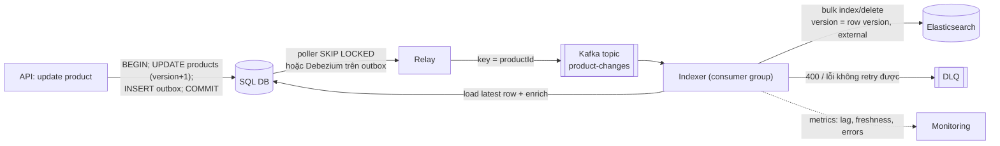
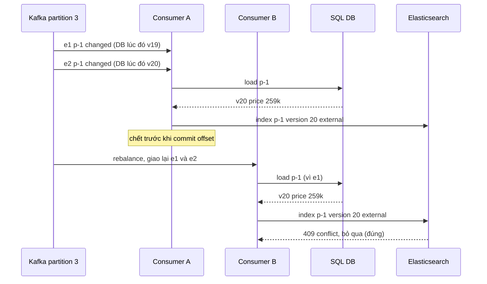

## Bối cảnh & vấn đề

Đây là code cập nhật sản phẩm của một service thật, rút gọn:

```ts
async function updateProduct(id: string, patch: Patch) {
  await db.transaction(async (tx) => {
    await tx.products.update(id, patch);
  });
  // ngoài transaction, fire-and-forget
  es.index({ index: 'products', id, document: await buildDoc(id) }).catch(() => {});
}
```

Hai loại ticket cứ lặp lại. "Tôi sửa sản phẩm mà search không đổi": khi Elasticsearch timeout hoặc đang bị flood-stage block, `.catch(() => {})` nuốt lỗi, DB đã commit, ES giữ bản cũ **mãi mãi**. "Search hiện giá đã bị revert một tiếng trước": admin A đổi giá thành 259k, admin B ngay sau đó revert về 199k; hai request chạy song song, request A `buildDoc` chậm hơn nên gọi `es.index` **sau** request B, và ES giữ 259k. Còn nếu process bị kill giữa `COMMIT` và `es.index` (deploy, OOM), update đó không bao giờ tới ES.

Mẫu hình này gọi là **dual write**: ghi vào hai hệ thống không có transaction chung. Nó không bao giờ đúng hoàn toàn, chỉ đúng "hầu hết thời gian". Bài này dạy cách thay nó bằng pipeline đúng khi có lỗi: **transactional outbox** hoặc **CDC** để không mất event, và một **indexer idempotent có versioning** để event trùng, event đến muộn, event sai thứ tự đều vô hại. Đây là phần lõi của câu hỏi CV về Indexer Service. Output chạy thật trên **Postgres 17.11** (outbox) và **Elasticsearch 9.5.3**.

**Interview angle:** câu debug về đoạn code trên kiểm tra ba ý: không atomic (drift vĩnh viễn), crash giữa hai bước (mất update), và race (bản cũ ghi sau bản mới). Câu trả lời mạnh đưa ra fix cho cả ba: outbox/CDC, load trạng thái mới nhất, external version.

## Khái niệm

### Dual write và vì sao nó drift

**Dual write** là ứng dụng tự ghi vào DB rồi ghi vào hệ thứ hai (ES, cache, broker) trong cùng một request. Hai lần ghi không thể atomic, nên luôn có ba cửa sổ lỗi: ghi thứ hai thất bại sau khi ghi thứ nhất đã commit (drift); process chết giữa hai bước (mất); hai request đồng thời hoàn tất bước hai theo thứ tự khác bước một (đảo thứ tự). Retry trong request giảm cửa sổ thứ nhất nhưng không đóng được nó, và làm tăng latency.

Dual write chỉ chấp nhận được khi có **reconcile mạnh** chạy thường xuyên để sửa drift (xem [bài drift](/tracks/nosql-search/learn/drift-search-design)), và dữ liệu không nhạy cảm.

### Transactional outbox

**Outbox** là một table trong **chính DB nghiệp vụ**. Trong **cùng transaction** với thay đổi nghiệp vụ, app insert thêm một dòng vào `outbox` mô tả sự kiện (`ProductChanged`, `aggregate_id = p-1`). Transaction commit thì cả hai cùng tồn tại; rollback thì cả hai cùng biến mất. Không bao giờ có "DB đổi mà không có event" hay "có event mà DB không đổi".

Một **relay** (poller hoặc CDC trên chính table outbox) đọc các dòng chưa xử lý, publish sang Kafka (hoặc gọi thẳng indexer), rồi đánh dấu đã xử lý. Relay có thể chết sau khi publish mà trước khi đánh dấu, nên event có thể được gửi **hơn một lần**: outbox cho **at-least-once**, và phía nhận phải idempotent. Poller nhiều instance dùng `SELECT ... FOR UPDATE SKIP LOCKED` để chia việc mà không xử lý trùng cùng lúc. Table outbox phải được **dọn** định kỳ (xoá dòng đã xử lý cũ hơn N ngày).

Lợi thế của outbox là event mang **ý nghĩa nghiệp vụ** (`ProductPriceChanged` kèm `oldPrice`, `newPrice`), schema do bạn kiểm soát, tách khỏi cấu trúc table.

### CDC (Change Data Capture)

**CDC** đọc **log thay đổi** mà DB vốn đã ghi cho mục đích riêng: WAL của Postgres qua **logical decoding** (replication slot + plugin `pgoutput`), binlog của MySQL, **CDC tables** của SQL Server (job của SQL Agent đọc transaction log và ghi vào các table `cdc.*`). **Debezium** là bộ connector phổ biến chạy trên Kafka Connect, biến mỗi thay đổi row thành một event Kafka (`before`, `after`, `op`, vị trí log).

Ưu điểm: **không sửa code app**, và bắt **mọi thay đổi**, kể cả từ script SQL tay, migration, admin tool, backfill 2 triệu row bằng một câu `UPDATE`. Nhược điểm: event ở **mức row** (một product thay đổi có thể là 3 event trên 3 table, indexer phải join/enrich); consumer **phụ thuộc schema DB** (đổi tên cột làm vỡ consumer); cần hạ tầng Kafka Connect; và phải quản lý **replication slot** (Postgres): consumer chết thì slot giữ WAL, disk đầy và giữ xmin horizon (xem [MVCC](/tracks/sql-postgres/learn/mvcc-vacuum)).

Kết hợp phổ biến: **CDC trên table outbox** (Debezium Outbox Event Router). App ghi outbox trong transaction, Debezium đọc WAL của table outbox và publish, không cần poller.

### Key Kafka theo entity và thứ tự

Kafka chỉ bảo đảm thứ tự **trong một partition**. Đặt **message key = productId** để mọi event của một sản phẩm vào cùng partition, được một consumer xử lý tuần tự. Event của các sản phẩm khác nhau vẫn song song.

Nhưng thứ tự trong partition không đủ: **rebalance** (consumer mới vào, consumer chết) làm các message đã xử lý mà chưa commit offset được giao lại cho consumer khác, nên **duplicate** là bình thường; retry tay, replay từ offset cũ, hoặc hai nguồn (backfill + live) đều có thể mang trạng thái cũ tới sau trạng thái mới. Indexer phải đúng **bất kể** thứ tự và số lần nhận.

### Indexer idempotent: event là tín hiệu, load trạng thái mới nhất

Hai cách thiết kế indexer:

- **Event mang state**: event chứa toàn bộ document (hoặc field đổi), indexer index nguyên payload. Nhanh, không cần gọi DB, nhưng event cũ đến muộn mang state cũ.
- **Event là tín hiệu** ("p-1 đã đổi"): indexer **load trạng thái mới nhất từ DB** (hoặc read replica), build document, index. Event cũ hay mới đều dẫn tới cùng một kết quả: trạng thái hiện tại. Dễ đúng hơn, đổi lại một query DB mỗi event (gom batch để giảm).

Index là thao tác **"set state"** (ghi đè toàn bộ document), không phải "increment", nên xử lý lại cùng event là vô hại. Đừng dùng partial update kiểu `ctx._source.stock -= 1` trong indexer.

### External versioning

Elasticsearch cho phép ghi với **`version_type: external`** và `version` do bạn cung cấp (số nguyên dương, ví dụ version của row trong DB, tăng mỗi lần update). ES chỉ chấp nhận write nếu `version` **lớn hơn** version hiện có của document; ngược lại trả **409 `version_conflict_engine_exception`**. `external_gte` chấp nhận cả bằng (hữu ích khi re-index cùng version, ví dụ backfill vào index mới).

Nguồn version phải **đơn điệu theo từng entity**: cột `version bigint` tăng trong mỗi UPDATE là tốt nhất. `updated_at` dạng epoch ms dùng được nhưng có rủi ro hai update trong cùng mili giây hoặc lệch đồng hồ. Kafka offset **không** dùng được (offset theo partition, reset khi đổi topic).

Với external versioning, 409 là **kết quả bình thường** (đã có bản mới hơn), không phải lỗi cần retry.

### Delete, tombstone và gc_deletes

Xoá document cũng có version: `DELETE ...?version=19&version_type=external`. ES giữ **tombstone** (version của document đã xoá) trong một khoảng thời gian **`index.gc_deletes`**, mặc định **60 giây**. Trong cửa sổ đó, một update cũ (version 18) tới muộn bị từ chối. **Sau** cửa sổ đó, ES quên version của document đã xoá, và update cũ tới muộn sẽ **tạo lại** document: sản phẩm đã xoá "sống lại" trong search.

Cách phòng: **soft delete** trong DB (cột `deleted`, version vẫn tăng) và indexer luôn load trạng thái từ DB (thấy `deleted = true` thì xoá, bất kể event nói gì); hoặc index document với `deleted: true` và filter ra khi search thay vì xoá thật; và reconcile định kỳ để bắt các trường hợp sót.

### Bulk, lỗi từng item, retry và DLQ

Indexer ghi bằng **bulk API**. Bulk trả **HTTP 200** kể cả khi một số item lỗi; phải đọc `errors` và từng `items[i]`. Phân loại:

- **409** với external version: bỏ qua (đã có bản mới hơn).
- **429** (rejected, thread pool đầy) và 5xx: retry với exponential backoff + jitter.
- **400** (mapping, parse lỗi): retry vô ích; đưa vào **DLQ** (dead-letter queue) kèm lý do, alert, sửa dữ liệu hoặc mapping rồi replay.

Offset Kafka chỉ commit sau khi batch đã xử lý xong (thành công, bỏ qua 409, hoặc đã vào DLQ). Metric quan trọng: **consumer lag**, throughput, tỉ lệ lỗi theo loại, số message DLQ, và **freshness** (thời gian từ DB commit tới khi document search được).

### Enrichment: chuẩn hoá dữ liệu provider trước khi index

Khi dữ liệu sản phẩm đến từ nhiều provider bên ngoài, một **Data Enrichment Service** đứng trước indexer (hoặc là một phần của nó) biến dữ liệu thô thành **canonical model**:

- **Adapter per provider** → canonical model có **version** schema; validate ở biên (zod/JSON Schema); bản ghi lỗi vào **quarantine/DLQ** kèm lý do, không chặn cả batch.
- **Normalize**: đơn vị (gram/kg), **currency và đơn vị tiền** (cent vs dollar), category mapping, **attribute key** về tập chuẩn (chống mapping explosion, xem [bài mapping](/tracks/nosql-search/learn/mapping#sec-mapping-explosion)), Unicode **NFC** (tiếng Việt NFD không khớp NFC, [đã chạy thật](/tracks/nosql-search/learn/inverted-index-analyzers#sec-unicode-nfc-vs-nfd)).
- **Idempotency và dedupe**: provider gửi lại cùng bản ghi; hash nội dung để bỏ qua bản không đổi.
- **Lưu raw payload** để replay khi rule normalize thay đổi.
- **Phát hiện provider đổi format**: contract test, alert khi tỉ lệ lỗi validate tăng, **kiểm tra thống kê** (giá trung bình của provider nhảy 100 lần là dấu hiệu cent/dollar).

## Cơ chế hoạt động

Pipeline đầy đủ từ API tới ES với outbox:



Mỗi mũi tên có một bảo đảm riêng. API → DB: atomic (outbox cùng transaction). DB → Relay → Kafka: at-least-once (có thể trùng, không mất). Kafka → Indexer: thứ tự theo productId, có thể trùng khi rebalance. Indexer → ES: idempotent nhờ "set state" và external version, nên trùng hay đảo thứ tự đều không làm hỏng dữ liệu. Không có mắt xích nào cần "exactly-once"; tính đúng đến từ việc **ghép at-least-once với idempotency**.

Sơ đồ event đảo thứ tự sau rebalance và vì sao indexer vẫn đúng:



Nếu indexer tin payload của e1 (state v19), nó sẽ ghi 199k với version 19 và ES trả 409 vẫn đúng nhờ external version. Nếu không có external version và tin payload, e1 được giao lại sau sẽ ghi đè 259k bằng 199k. Có **hai lớp** phòng thủ độc lập: load state mới nhất, và version. Nên có cả hai.

## Ví dụ thực tế

### Outbox + relay + indexer, chạy thật

Schema (Postgres):

```sql
CREATE TABLE products (
  id text PRIMARY KEY, tenant_id text NOT NULL, name text NOT NULL, price int NOT NULL,
  deleted boolean NOT NULL DEFAULT false,
  version bigint NOT NULL DEFAULT 1,
  updated_at timestamptz NOT NULL DEFAULT now()
);
CREATE TABLE outbox (
  id bigserial PRIMARY KEY, aggregate_id text NOT NULL, type text NOT NULL,
  created_at timestamptz NOT NULL DEFAULT now(), processed_at timestamptz
);
CREATE INDEX ON outbox (id) WHERE processed_at IS NULL;
```

Write path: thay đổi nghiệp vụ và dòng outbox trong **một** transaction, version tăng mỗi update:

```ts
async function upsertProduct(id: string, tenantId: string, name: string, price: number) {
  const c = await db.connect();
  try {
    await c.query('BEGIN');
    await c.query(
      `INSERT INTO products (id, tenant_id, name, price) VALUES ($1,$2,$3,$4)
       ON CONFLICT (id) DO UPDATE SET name = EXCLUDED.name, price = EXCLUDED.price,
         version = products.version + 1, updated_at = now()`,
      [id, tenantId, name, price],
    );
    await c.query(`INSERT INTO outbox (aggregate_id, type) VALUES ($1, 'ProductChanged')`, [id]);
    await c.query('COMMIT');
  } catch (e) { await c.query('ROLLBACK'); throw e; } finally { c.release(); }
}
```

Indexer: event là tín hiệu, load trạng thái mới nhất, external version, soft delete thành delete:

```ts
async function indexOne(id: string) {
  const { rows: [p] } = await db.query('SELECT * FROM products WHERE id = $1', [id]);
  const meta = { _index: 'sync_products', _id: id, version: Number(p.version), version_type: 'external' as const };
  const ops = p.deleted
    ? [{ delete: meta }]
    : [{ index: meta }, { tenantId: p.tenant_id, name: p.name, price: p.price }];
  const r = await es.bulk({ operations: ops });
  const item = Object.values(r.items[0])[0]!;
  return item.error ? `${item.status} ${item.error.type}` : `${item.result} v${item._version}`;
}
```

Relay: nhận một lô với `FOR UPDATE SKIP LOCKED`, xử lý, đánh dấu:

```ts
const { rows } = await c.query(
  `SELECT id, aggregate_id FROM outbox WHERE processed_at IS NULL
   ORDER BY id LIMIT $1 FOR UPDATE SKIP LOCKED`, [100]);
for (const r of rows) await indexOne(r.aggregate_id);
await c.query(`UPDATE outbox SET processed_at = now() WHERE id = ANY($1)`, [rows.map((r) => r.id)]);
```

Kịch bản: tạo p-1 (199k), đổi giá p-1 (259k), tạo p-2, xoá mềm p-2; relay chạy **một lần** sau cả bốn thay đổi:

```text
relay batch 1: [
  '1:p-1 → created v2',
  '2:p-1 → 409 version_conflict_engine_exception',
  '3:p-2 → not_found v2',
  '4:p-2 → 409 version_conflict_engine_exception'
]
```

Event 1 của p-1 load trạng thái **hiện tại** (version 2, 259k), nên index luôn bản mới nhất; event 2 thành 409 vô hại. p-2 đã bị xoá mềm khi relay chạy, nên event 3 gửi delete version 2 (`not_found` vì ES chưa từng có p-2, nhưng tombstone version 2 được ghi); event 4 là 409. Replay một event cũ của p-1:

```text
relay replay : [ '5:p-1 → 409 version_conflict_engine_exception' ]
ES p-1: {"tenantId":"42","name":"Áo thun cotton","price":259000} _version 2 | p-2 exists: false
```

Transaction nghiệp vụ lỗi thì không có event:

```text
tx failed: 23502 null value in column "name" of relation "products" violates ...
outbox rows for p-3: 0
unprocessed outbox: { n: '0', oldest_s: 0 }
```

Dòng cuối là metric nên export: số dòng outbox chưa xử lý và tuổi của dòng cũ nhất (lag của relay).

### Delete rồi update cũ tới muộn: cửa sổ gc_deletes

```text
PUT ver/_doc/p-991?version=18&version_type=external {price:259000}  → created, _version 18
PUT ver/_doc/p-991?version=17&version_type=external {price:199000}  → 409: current version [18] is higher or equal to the one provided [17]
DELETE ver/_doc/p-991?version=19&version_type=external               → deleted, _version 19
PUT ver/_doc/p-991?version=18&version_type=external                  → 409: current version [19] is higher or equal to the one provided [18]
GET ver/_settings?include_defaults=true → "gc_deletes":"60s"
```

Trong 60 giây sau delete, update cũ (v18) bị chặn. Hạ `gc_deletes` xuống 1 giây để thấy chuyện gì xảy ra sau cửa sổ:

```text
PUT ver/_settings {index.gc_deletes: 1s}
PUT p-2 version 5 → created ; DELETE p-2 version 6 → deleted ; (chờ 3 giây)
PUT p-2 version 5 → "result":"created"
```

Update cũ (v5) **tạo lại** document đã xoá. Với `gc_deletes` mặc định, cửa sổ là 60 giây: một event bị kẹt trong DLQ rồi replay sau 10 phút sẽ "hồi sinh" sản phẩm đã xoá nếu indexer tin payload. Indexer load từ DB thấy `deleted = true` nên gửi delete thay vì index, và không bị lỗi này.

### Chọn giữa dual write, outbox và CDC

Câu hỏi "một script backfill `UPDATE` 2 triệu row trực tiếp bằng SQL, cách nào tự bắt được?" phân biệt ba lựa chọn: **dual write** và **outbox** đều **không** thấy (script không đi qua code app, không ghi outbox); **CDC trên table nghiệp vụ** thấy tất cả. Với outbox, quy trình vận hành phải là: script backfill cũng ghi outbox, hoặc sau backfill chạy job re-emit event cho các id bị ảnh hưởng, hoặc để reconcile bắt.

### Kể lại kiến trúc Indexer Service (câu hỏi CV)

Khung câu trả lời, điền bằng hệ thống thật của bạn:

1. **Nguồn event**: outbox/CDC/topic Kafka, key theo productId, consumer group bao nhiêu instance (điền cách làm thật).
2. **Transform**: load từ DB hay dùng payload; enrich category, giá, tồn kho; document shape và mapping.
3. **Ghi ES**: bulk size, concurrency, retry khi 429, xử lý lỗi từng item, DLQ.
4. **Correctness**: idempotency (set state), external version từ row version, delete bằng soft delete, xử lý rebalance.
5. **Khi ES sập 10 phút**: consumer lag tăng, không mất event (Kafka giữ), indexer retry với backoff, sau đó bắt kịp; freshness SLO bị vi phạm trong thời gian đó, có alert.
6. **Observability**: lag, throughput, error rate, freshness p95 (điền số liệu thật).
7. **Rebuild toàn bộ**: index mới + backfill từ DB + dual-write + alias swap ([bài reindex](/tracks/nosql-search/learn/reindex-alias-bulk)).

Red flag trong câu trả lời: "chúng tôi gọi Elasticsearch ngay sau khi lưu DB" và không trả lời được chuyện gì xảy ra khi ES sập.

## Trade-offs & lựa chọn thay thế

| Cách đồng bộ | Không mất event | Thứ tự theo entity | Bắt thay đổi ngoài app | Đổi code app | Hạ tầng |
|---|---|---|---|---|---|
| Dual write trong request | Không | Không | Không | Ít | Không |
| Outbox + poller | Có (at-least-once) | Có (key theo entity) | Không | Có (ghi outbox) | Table + relay |
| Outbox + Debezium | Có | Có | Không | Có | Kafka Connect |
| CDC trên table nghiệp vụ | Có | Theo row/key | Có | Không | Kafka Connect, slot |
| Batch theo `updated_at` | Có thể sót | Không | Có nếu cập nhật `updated_at` | Không | Cron |

| Thiết kế indexer | Ưu | Nhược |
|---|---|---|
| Event mang state | Không gọi DB, nhanh | Event cũ mang state cũ; cần version chặt |
| Event là tín hiệu, load DB | Luôn đúng trạng thái hiện tại | Tải DB (gom batch, đọc replica), replica lag |
| External version | Chặn ghi đè bằng bản cũ | Cần cột version đơn điệu; cửa sổ `gc_deletes` cho delete |

Khi nào chọn gì: **outbox** khi bạn kiểm soát code ghi và muốn event mang nghĩa nghiệp vụ; **CDC** khi có nhiều nguồn ghi ngoài app (script, hệ cũ, nhiều service chung DB) hoặc không sửa được code; **outbox + Debezium** khi đã có Kafka Connect và muốn bỏ poller. Batch theo `updated_at` chỉ hợp cho dữ liệu không quan trọng, vì nó bỏ sót hard delete, sót transaction commit muộn hơn mốc thời gian đã quét, và phụ thuộc đồng hồ. Trong mọi trường hợp: indexer load trạng thái mới nhất + external version + reconcile.

Riêng SQL Server: CDC dựa trên transaction log và job SQL Agent ghi vào các table `cdc.<schema>_<table>_CT`; Debezium có connector SQL Server đọc các table đó. Postgres: logical decoding qua replication slot (`pgoutput`); nhớ giám sát slot.

## Edge cases & failure modes

- **Read replica lag**: indexer load từ read replica có lag 2 giây, đọc bản cũ hơn event, index version cũ; event sau cũng có thể đọc bản cũ. External version không cứu được vì bản đọc được là cũ. Load từ primary cho indexer, hoặc so version trong event với version đọc được và retry nếu nhỏ hơn.
- **Outbox phình**: không dọn thì table outbox thành table lớn nhất DB. Xoá theo lô dòng `processed_at < now() - interval '7 days'`, hoặc partition theo ngày và drop.
- **Poll outbox không index**: `WHERE processed_at IS NULL` không có partial index quét cả table mỗi giây.
- **Replication slot chết**: Debezium dừng một tuần, WAL tích tụ làm đầy disk Postgres. Alert khi slot `active = false` hoặc `pg_wal_lsn_diff` lớn; đặt `max_slot_wal_keep_size`.
- **Poison message**: một product có dữ liệu làm indexer crash (null, mapping sai) chặn cả partition nếu consumer retry mãi. Giới hạn số lần retry rồi đưa vào DLQ.
- **Kafka retention ngắn hơn downtime**: ES sập 3 ngày, topic giữ 1 ngày: event bị xoá trước khi indexer đọc. Rebuild từ DB hoặc re-emit theo `updated_at > outage_start` (cẩn thận hard delete).
- **Hard delete trong DB**: indexer load không thấy row. Phải hiểu "không có row" là xoá (delete không có version, hoặc dùng version từ event); soft delete an toàn hơn.
- **Version reset**: restore DB từ backup cũ làm version nhỏ hơn version trong ES; mọi update sau đó bị 409 cho tới khi version vượt lại. Sau restore phải rebuild index.

## Pitfalls

- ❌ `es.index(...).catch(() => {})` sau khi commit DB → ✅ outbox trong cùng transaction (hoặc CDC), indexer bất đồng bộ có retry/DLQ.
- ❌ Indexer tin payload của event → ✅ coi event là tín hiệu, load trạng thái mới nhất từ DB (primary), hoặc ít nhất external version.
- ❌ Partial update/increment trong indexer → ✅ "set state" toàn bộ document để xử lý lại vô hại.
- ❌ Coi 409 là lỗi và retry mãi → ✅ với external version, 409 nghĩa là đã có bản mới hơn: bỏ qua.
- ❌ Chỉ kiểm HTTP status của bulk → ✅ đọc `errors` và từng item; 429 retry, 400 DLQ.
- ❌ Hard delete và tin rằng mọi event tới đúng thứ tự → ✅ soft delete + load DB; biết cửa sổ `gc_deletes` 60 giây.
- ❌ Message key ngẫu nhiên → ✅ key = productId để thứ tự theo entity.
- ❌ Không có metric freshness → ✅ đo thời gian từ commit tới searchable, alert theo SLO.

## Tóm tắt

- Dual write không atomic: drift khi bước hai lỗi, mất update khi crash, đảo thứ tự khi đồng thời. Chỉ chấp nhận khi có reconcile mạnh.
- Outbox: event ghi cùng transaction với thay đổi nghiệp vụ; relay (poller `SKIP LOCKED` hoặc Debezium) cho at-least-once; event mang nghĩa nghiệp vụ.
- CDC (Debezium, logical decoding, SQL Server CDC): bắt mọi thay đổi kể cả script SQL, không sửa app; event mức row, phụ thuộc schema, cần quản lý slot.
- Key Kafka = entity id cho thứ tự theo entity; rebalance vẫn gây trùng và giao lại, nên indexer phải idempotent.
- Indexer đúng: event là tín hiệu → load trạng thái mới nhất → "set state" → `version_type: external` với row version; 409 là bình thường.
- Delete: tombstone chỉ được nhớ trong `index.gc_deletes` (60s); sau đó update cũ có thể hồi sinh document. Soft delete + load DB tránh được.
- Bulk: đọc lỗi từng item, 429 retry, 400 vào DLQ; metric lag, freshness, error rate.
- Enrichment: canonical model có version, validate ở biên, normalize đơn vị/tiền/attribute key/NFC, lưu raw để replay, phát hiện provider đổi format bằng thống kê.
