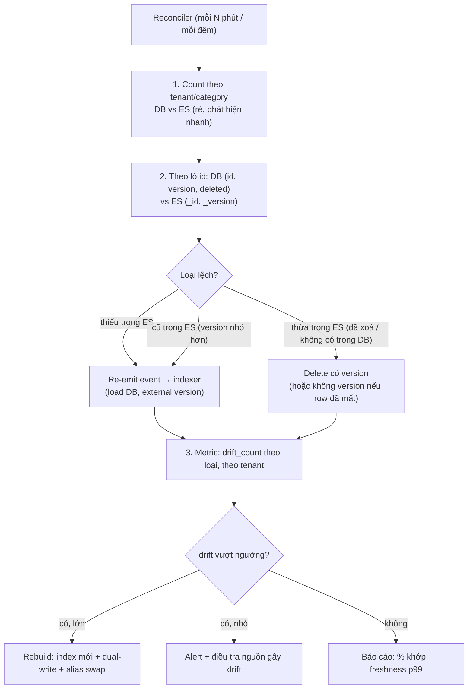
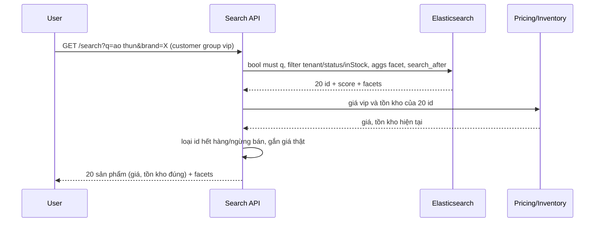

## Bối cảnh & vấn đề

Bộ phận chăm sóc khách hàng chuyển lên ba ticket trong một tuần: một sản phẩm đã ngừng bán vẫn hiện trong kết quả tìm kiếm và bấm vào thì lỗi 404; một sản phẩm hết hàng từ hôm qua vẫn hiện "còn hàng" ở trang kết quả; và merchant phàn nàn sản phẩm mới đăng từ sáng không tìm thấy. Không có alert nào kêu. Indexer vẫn chạy, consumer lag bằng 0, dashboard ES xanh.

Đây là **drift**: trạng thái trong Elasticsearch lệch với source of truth trong DB. Với mọi pipeline đồng bộ, dù thiết kế tốt như [outbox + indexer có version](/tracks/nosql-search/learn/db-es-sync-indexer), drift vẫn xảy ra theo thời gian: một script SQL tay bỏ qua outbox, một bulk item lỗi bị bỏ qua, một event nằm trong DLQ không ai replay, một delete bị "hồi sinh". Câu hỏi không phải "có drift không" mà "bạn **phát hiện, đo và sửa** nó thế nào, và **chứng minh** với stakeholder rằng search khớp DB".

Bài cuối gom mọi thứ lại: reconciliation, freshness SLO, thiết kế product search multi-tenant hoàn chỉnh, và câu hỏi ngược "khi nào **không nên** thêm Elasticsearch". Output chạy thật trên **Postgres 17.11** và **Elasticsearch 9.5.3**.

**Interview angle:** câu drift là câu scenario hay nhất để phân loại senior: junior nói "reindex lại"; senior nói cách **đo** (count, version theo lô, pipeline metrics), cách **sửa có mục tiêu**, cách **phòng** (reconciler định kỳ, SLO), và cách giảm tác hại cho dữ liệu nhạy cảm (hydrate giá/tồn kho từ DB).

## Khái niệm

### Drift và các nguồn gây drift

**Drift** là khác biệt giữa read model (ES) và source of truth (DB) **tồn tại lâu hơn độ trễ bình thường** của pipeline. Trễ 2 giây do refresh không phải drift; lệch 2 ngày là drift. Các nguồn phổ biến:

- **Thay đổi đi vòng pipeline**: script SQL, migration, admin tool ghi thẳng DB khi hệ thống dùng outbox (CDC thì bắt được).
- **Lỗi bị nuốt**: bulk trả 200 với `errors: true` mà indexer không đọc từng item; `.catch(() => {})`.
- **DLQ không ai xử lý**: event lỗi 400 nằm trong DLQ mãi.
- **Delete bị mất hoặc hồi sinh**: batch sync theo `updated_at` không thấy hard delete; update cũ tới sau cửa sổ `gc_deletes` tạo lại document.
- **Write không version trộn với write có version**: một tool xoá document **không** dùng external version làm version nội bộ tăng, và lần sửa sau với version từ DB bị 409 (chạy thật ở dưới).
- **Outage dài hơn retention**: ES hoặc indexer chết lâu hơn retention của topic.

### Đo drift: count, rồi so version theo lô

**Count theo nhóm** (tenant, category, trạng thái) giữa DB và ES là tín hiệu rẻ, chạy mỗi vài phút. Nhưng count **che lỗi bù trừ**: một document thiếu cộng một document thừa cho count bằng nhau. Chạy thật bên dưới, tenant 0 lệch 1 nhưng thực tế có 3 lỗi.

**So version theo lô id** là phép đo thật: lấy `(id, version, deleted)` từ DB theo dải id (1.000–10.000 id mỗi lô), lấy `(_id, _version)` (hoặc field `dbVersion`) từ ES cho cùng dải, so sánh để ra ba danh sách: **thiếu trong ES**, **thừa trong ES** (đã xoá hoặc không tồn tại trong DB), **cũ trong ES** (version nhỏ hơn). Có thể thay version bằng **checksum** các field quan trọng khi không có cột version. Chạy nền, có throttle, đọc từ read replica.

Kiểm tra thêm **pipeline**: consumer lag, số message trong DLQ, tỉ lệ item lỗi của bulk, tuổi của dòng outbox chưa xử lý, trạng thái replication slot (với CDC).

### Sửa drift

- **Có mục tiêu**: với các id lệch, **re-emit event** vào pipeline (để đi đúng đường indexer) hoặc gọi thẳng hàm index của indexer. Luôn qua cùng logic "load DB → build document → external version".
- **Toàn bộ**: khi drift lớn hoặc không tin được index hiện tại, **rebuild** vào index mới + dual-write + alias swap (xem [reindex](/tracks/nosql-search/learn/reindex-alias-bulk)).
- **Sau outage**: replay từ offset Kafka hoặc outbox chưa xử lý; nếu event đã mất, re-emit theo `updated_at > outage_start` **và** xử lý hard delete riêng (so danh sách id trong ES với DB, vì hard delete không để lại row có `updated_at`).

### Giảm tác hại: hydrate dữ liệu nhạy cảm

Với dữ liệu mà sai là mất tiền hoặc mất uy tín (giá, tồn kho, trạng thái được bán), search API có thể dùng ES để **tìm và xếp hạng id**, rồi **hydrate** các field nhạy cảm của trang kết quả (20 id) từ DB hoặc pricing/inventory service, và **loại** những id đã xoá hoặc ngừng bán. Chi phí: một query DB theo 20 id mỗi request. Lợi ích: drift của giá/tồn kho không bao giờ tới mắt user; drift của text chỉ làm ranking kém, không làm sai thông tin. Filter trong ES (`inStock`, `status`) vẫn cần để kết quả không bị "thủng" sau khi loại.

### Freshness SLO

**Freshness** là thời gian từ lúc thay đổi **commit trong DB** tới lúc **search thấy**. Một SLO ví dụ: "99% thay đổi sản phẩm search thấy trong 60 giây, đo theo cửa sổ 30 ngày". Đo bằng: **canary** (một job định kỳ cập nhật sản phẩm test, đo thời gian tới khi `_search` thấy version mới), hoặc **timestamp trong pipeline** (indexer ghi `committedAt` từ outbox và thời điểm bulk thành công + refresh interval, đẩy histogram vào metrics). Consumer lag chỉ là một phần; freshness đo cả relay, indexer, bulk retry và refresh.

### Thiết kế product search multi-tenant

Một thiết kế đầy đủ gồm các lớp:

- **Index layout**: một index chung (qua alias) cho mọi tenant nhỏ/vừa, `tenantId` là `keyword`, filter bắt buộc ở tầng repository hoặc qua **filtered alias** per tenant; custom routing theo tenant nếu nhiều tenant nhỏ; index riêng cho vài tenant rất lớn hoặc có yêu cầu cô lập (xem [shard & routing](/tracks/nosql-search/learn/shards-refresh-cluster)).
- **Document**: product (hoặc SKU) đã **denormalize**: name/brand/category (`text` + `keyword`), attribute chuẩn hoá (`nested` name/value hoặc `flattened`), giá cơ bản, `inStock`, popularity (`rank_feature`), `status`, `updatedAt`, `dbVersion`.
- **Giá theo nhóm khách hàng**: nếu số nhóm ít (vài chục), lưu map nhỏ `prices: { retail: 199000, vip: 179000, wholesale: 150000 }` để filter/sort theo `prices.<group>`; nếu nhiều hoặc giá động (khuyến mãi theo người), filter/sort theo **giá cơ bản** trong ES rồi **hydrate giá thật** từ pricing service cho trang kết quả, chấp nhận sort theo giá chỉ gần đúng.
- **Query**: `bool` với `must` cho từ khoá (multi_match, boost), `filter` cho tenant/status/facet/giá, `should` cho phrase/exact; **aggregations** cho facet (`terms` trên `brand`, `nested` agg cho attribute, `range` cho giá); `post_filter` để facet đã chọn không làm biến mất các lựa chọn khác trong cùng facet; `search_after` cho infinite scroll (xem [query DSL](/tracks/nosql-search/learn/query-dsl-relevance)).
- **Relevance**: boost field, synonym **per tenant** (với index chung: synonym set riêng cho từng tenant và chọn search analyzer theo tenant, hoặc mở rộng query ở tầng app; index riêng cho tenant lớn thì dễ hơn), đo bằng judgement list và CTR.
- **Sync**: outbox/CDC → indexer idempotent + external version; reconciler; reindex bằng alias.
- **Ops**: cỡ shard, snapshot, không cần ILM cho catalog (catalog không theo thời gian), dashboard freshness và drift.

### Khi nào thêm Elasticsearch là sai

Elasticsearch là **một hệ thống nữa** phải vận hành: heap và GC, shard sizing, upgrade version (mapping, plugin, client), security, snapshot, on-call, cộng pipeline đồng bộ, drift, reindex. Thêm nó là sai khi:

- Nhu cầu thật chỉ là **filter/sort có cấu trúc** (theo trạng thái, khoảng ngày, category): index SQL làm tốt.
- **Dữ liệu nhỏ**: vài trăm nghìn tới vài triệu row, full-text trên vài field ngắn.
- **Team không có khả năng vận hành** cluster và pipeline.
- Yêu cầu **nhất quán tức thì** (đọc được ngay sau ghi trong search) là bắt buộc.

Thay thế:

- **Postgres full-text search**: `tsvector` + GIN index, `ts_rank`, dictionary theo ngôn ngữ (config `simple` cho tiếng Việt), `unaccent` để bỏ dấu, `websearch_to_tsquery` cho cú pháp giống Google.
- **`pg_trgm`** + GIN: `ILIKE '%x%'` dùng index, fuzzy bằng `similarity` và toán tử `%`, autocomplete đơn giản.
- **SQL Server Full-Text Search**: `CONTAINS`, `FREETEXT`, `CONTAINSTABLE` có rank; tuning relevance và facet kém linh hoạt, và tải search đè lên DB OLTP.
- **Managed search**: Elastic Cloud, Amazon OpenSearch Service (bớt vận hành cluster, không bớt pipeline); Algolia, Typesense, Meilisearch (nhẹ, typo tolerance và prefix sẵn, hợp catalog vừa).

**Tín hiệu đã tới lúc chuyển** từ Postgres FTS sang search engine riêng: search chiếm phần đáng kể CPU của DB OLTP; cần relevance tuning phức tạp (boost theo nhiều tín hiệu, synonym per tenant, học từ click); facet trên nhiều chiều với dữ liệu lớn chậm; cần autocomplete + typo tolerance chất lượng cao; hoặc dữ liệu vượt vài chục triệu document với nhiều field text.

## Cơ chế hoạt động

Reconciler định kỳ và các đường sửa:



Reconciler không thay thế pipeline, nó là **lưới an toàn** cho pipeline. Mọi sửa chữa đi qua **cùng logic indexer** (load DB, version) để không tạo thêm một đường ghi thứ hai với hành vi khác. Metric drift theo loại quan trọng hơn bản thân việc sửa: "tuần này 300 document thừa trong ES đều của tenant 12" chỉ thẳng vào một tool admin xoá hard delete không đi qua outbox.

Luồng request của product search có hydrate:



ES quyết định **tìm gì và thứ tự**; service nguồn quyết định **giá và tồn kho hiển thị**. Drift của ES khi đó chỉ ảnh hưởng tới việc một sản phẩm có lọt vào top 20 hay không, không ảnh hưởng tới con số khách nhìn thấy.

## Ví dụ thực tế

### Tạo drift rồi tìm nó, chạy thật

5.000 sản phẩm (3 tenant) được đồng bộ đúng sang ES với external version. Sau đó tạo drift đi vòng pipeline:

```sql
UPDATE rproducts SET deleted = true, version = version + 1 WHERE id IN (17, 4242);            -- event xoá bị mất
UPDATE rproducts SET in_stock = false, version = version + 1 WHERE id BETWEEN 100 AND 104;   -- event tồn kho bị mất
DELETE FROM rproducts WHERE id = 999;                                                           -- hard delete bằng script
```

```ts
await es.delete({ index: 'recon_products', id: '3000', refresh: true }); // một tool xoá nhầm trong ES, không dùng version
```

Bước 1, count theo tenant:

```text
count per tenant (db vs es): 0: 1664 vs 1665 | 1: 1667 vs 1667 | 2: 1666 vs 1667
```

Tenant 0 chỉ lệch 1, nhưng thật ra có **3 lỗi**: 4242 và 999 thừa trong ES, 3000 thiếu trong ES; chúng bù trừ nhau. Tenant 1 khớp count dù 5 sản phẩm (100–104) đang hiển thị sai tồn kho. Count chỉ là tín hiệu, không phải bằng chứng.

Bước 2, so version theo lô 1.000 id:

```ts
for (let lo = 1; lo <= 5000; lo += 1000) {
  const { rows } = await db.query(
    'SELECT id, version, deleted FROM rproducts WHERE id BETWEEN $1 AND $2', [lo, lo + 999]);
  const r = await es.search({
    index: 'recon_products', size: 1000, _source: false, version: true,
    query: { ids: { values: range(lo, lo + 999).map(String) } },
  });
  // so dbMap(id → version, deleted) với esMap(_id → _version) → missingInEs / extraInEs / stale
}
```

```text
reconcile 5000 ids in 63 ms → {"missingInEs":["3000"],"extraInEs":["17","999","4242"],"stale":["100","101","102","103","104"]}
```

Chín lệch, phân loại rõ ràng, trong 63 ms cho 5.000 id. Với 50 triệu id, cùng thuật toán chạy theo lô trên read replica mất vài chục phút; chạy hằng đêm cho toàn bộ và mỗi vài phút cho các id vừa đổi gần đây.

Bước 3, sửa bằng cùng logic indexer (load DB, external version):

```text
repair bulk errors: true items: 9
   index 3000 409 [3000]: version conflict, current version [2] is higher or equal to the one provided [1]
   index 100 200 updated
   ... 101–104 updated
   delete 17 200 deleted
   delete 999 200 deleted
   delete 4242 200 deleted
after repair: db 4997 es 4996
```

Tám sửa thành công, nhưng **3000 không sửa được**. Nguyên nhân: tool xoá nhầm dùng `DELETE` **không** external version, nên ES tăng version nội bộ của tombstone lên 2. Row trong DB vẫn ở version 1, nên re-index với `version: 1, version_type: external` bị 409 cho tới khi tombstone hết hạn (`gc_deletes`, 60 giây). Bài học: **mọi** đường ghi vào index dùng external version phải dùng cùng cơ chế version; và reconciler phải báo cáo item 409 ở bước sửa (một 409 khi sửa "thiếu trong ES" là bất thường), rồi thử lại sau cửa sổ `gc_deletes` hoặc index không version.

### Chứng minh với stakeholder sau một outage

Indexer chết 2 giờ vì hết quota. Báo cáo với stakeholder nên có số liệu, không phải "đã fix":

1. **Phạm vi**: từ `outage_start` tới `outage_end`, bao nhiêu thay đổi trong DB (đếm outbox hoặc `updated_at` trong khoảng), bao nhiêu tenant bị ảnh hưởng.
2. **Khôi phục**: indexer replay từ offset Kafka tại `outage_start`; theo dõi lag về 0. Hard delete trong thời gian outage: đã xử lý bằng so danh sách id (hard delete không có row để replay).
3. **Kiểm chứng**: chạy reconciler toàn bộ: "5.000.000 id, 0 thiếu, 0 thừa, 0 cũ" (hoặc số thật và danh sách đã sửa), count theo tenant khớp.
4. **Freshness**: biểu đồ freshness p99 trước, trong và sau outage; SLO bị vi phạm bao lâu.
5. **Phòng ngừa**: alert trên consumer lag và freshness canary, runbook replay.

(Điền số liệu thật của hệ thống bạn khi trả lời phỏng vấn.)

### Postgres làm được bao nhiêu, chạy thật

Trước khi thêm Elasticsearch, thử những gì Postgres 17 làm được với `unaccent` + `tsvector` + `pg_trgm`:

```sql
CREATE EXTENSION unaccent; CREATE EXTENSION pg_trgm;
CREATE FUNCTION f_unaccent(text) RETURNS text LANGUAGE sql IMMUTABLE PARALLEL SAFE
  AS $$ SELECT public.unaccent('public.unaccent', $1) $$;  -- wrapper IMMUTABLE để dùng trong index

ALTER TABLE p ADD COLUMN tsv tsvector
  GENERATED ALWAYS AS (to_tsvector('simple', f_unaccent(name))) STORED;
CREATE INDEX ON p USING gin (tsv);
CREATE INDEX p_trgm ON p USING gin (f_unaccent(lower(name)) gin_trgm_ops);

-- full-text không dấu, có rank
SELECT id, name, ts_rank(tsv, q) AS rank
FROM p, plainto_tsquery('simple', f_unaccent('ao thun')) q
WHERE tsv @@ q ORDER BY rank DESC;
```

```text
 id |      name      |  rank
----+----------------+--------
  1 | Áo thun cotton | 0.0991
  2 | Áo thun polo   | 0.0991
```

```sql
-- chuỗi con giữa từ (LIKE '%x%' dùng được GIN trigram)
SELECT id, name FROM p WHERE f_unaccent(lower(name)) LIKE '%' || f_unaccent(lower('hun cot')) || '%';
-- gõ sai chính tả
SELECT id, name, similarity(f_unaccent(lower(name)), 'ao thn cotton') AS sim
FROM p WHERE f_unaccent(lower(name)) % 'ao thn cotton' ORDER BY sim DESC;
```

```text
 1 | Áo thun cotton                  (LIKE '%hun cot%')
 1 | Áo thun cotton | 0.706          (similarity với lỗi gõ "thn")
```

```text
EXPLAIN: Bitmap Heap Scan on p
           Recheck Cond: (tsv @@ '''ao'' & ''thun'''::tsquery)
           ->  Bitmap Index Scan on p_tsv_idx
```

Bỏ dấu, ranking cơ bản, substring, typo tolerance, tất cả trong cùng DB, cùng transaction, không pipeline, không drift. Thứ còn thiếu so với ES: BM25 và tuning relevance linh hoạt, facet nhanh trên dữ liệu lớn, analyzer phong phú, scale đọc tách khỏi DB OLTP. Với catalog vài trăm nghìn sản phẩm, đây thường là lựa chọn đúng. Wrapper `f_unaccent` cần thiết vì `unaccent()` gốc chỉ là `STABLE`, không dùng được trong index hoặc generated column.

### Vì sao chọn ES thay vì SQL Server Full-Text Search (câu hỏi CV)

Khung câu trả lời trung thực, điền bằng bối cảnh thật:

- **Nhu cầu**: relevance tuning (boost, tín hiệu bán chạy), facet/aggregation nhanh trên nhiều chiều, typo/fuzzy, bỏ dấu tiếng Việt, autocomplete, và **tách tải search khỏi DB OLTP** SQL Server.
- **SQL Server FTS**: có `CONTAINS`/`FREETEXT`/`CONTAINSTABLE` với rank, nhưng tuning relevance và facet kém linh hoạt hơn, analyzer tiếng Việt hạn chế, và mọi query search chạy trên cùng máy với giao dịch.
- **Chi phí đã trả**: pipeline indexer, drift, reindex, vận hành cluster.
- **Đánh giá**: có lúc nào thấy overkill không; số liệu latency/traffic (điền số liệu thật). Nếu làm lại với Postgres, có cần ES từ ngày đầu không? Câu trả lời trưởng thành thường là "bắt đầu với Postgres FTS, chuyển khi có tín hiệu rõ".

## Trade-offs & lựa chọn thay thế

| Công cụ search | Relevance/tuning | Facet trên dữ liệu lớn | Bỏ dấu, typo | Nhất quán với DB | Vận hành |
|---|---|---|---|---|---|
| Postgres FTS + `pg_trgm` + `unaccent` | Cơ bản (`ts_rank`) | Chậm khi lớn | Có (unaccent, similarity) | Tức thì, cùng transaction | Không thêm hệ thống |
| SQL Server FTS | Cơ bản (rank) | Hạn chế | Hạn chế | Gần tức thì (populate nền) | Có sẵn trong SQL Server |
| Elasticsearch/OpenSearch | Mạnh nhất | Nhanh | Mạnh | Eventual (pipeline) | Nặng |
| Algolia/Typesense/Meilisearch | Tốt, ít tuỳ biến sâu | Tốt | Có sẵn | Eventual (pipeline) | Nhẹ/managed |

| Chiến lược với drift | Ưu | Nhược |
|---|---|---|
| Chỉ pipeline, không reconcile | Đơn giản | Drift tích tụ không ai biết |
| Count theo nhóm | Rẻ, nhanh | Che lỗi bù trừ |
| So version theo lô id | Chính xác, phân loại được | Tốn đọc DB/ES, cần cột version |
| Hydrate field nhạy cảm từ nguồn | User không thấy sai giá/tồn kho | Thêm latency, phụ thuộc service nguồn |
| Rebuild định kỳ | Xoá mọi drift | Tốn, không phát hiện nguyên nhân |

Khi nào chọn gì: bắt đầu với Postgres FTS khi catalog nhỏ và team nhỏ; chuyển sang search engine khi các tín hiệu ở trên xuất hiện. Khi đã có ES: pipeline đúng (outbox/CDC + version) là tuyến một, reconciler so version theo lô là tuyến hai, hydrate giá/tồn kho là tuyến ba cho dữ liệu nhạy cảm; rebuild chỉ khi drift lớn hoặc đổi mapping.

## Edge cases & failure modes

- **Reconciler tự gây drift**: reconciler đọc DB, thấy version 5, trong lúc đó indexer ghi version 6, reconciler "sửa" bằng version 5. External version chặn được; reconciler không dùng version thì không.
- **So sánh trên replica lag**: DB read replica chậm 30 giây, reconciler báo "ES mới hơn DB". Bỏ qua id có `updated_at` trong vài phút gần nhất, hoặc so trên primary cho lô nhỏ.
- **Reconciler quá nặng**: quét toàn bộ 50 triệu id mỗi 5 phút làm DB và ES quá tải. Chia tầng: gần đây (id đổi trong 1 giờ) thường xuyên, toàn bộ hằng đêm có throttle.
- **Facet sai do drift**: count trong facet ("Brand X (120)") tính trên ES; sau hydrate loại bớt id hết hàng, số hiển thị không khớp số item thật. Chấp nhận gần đúng hoặc filter `inStock` trong ES.
- **Giá theo nhóm quá nhiều**: map `prices` với hàng nghìn nhóm gây mapping explosion (mỗi nhóm một field). Chuyển sang hydrate hoặc `nested` giá theo nhóm.
- **Synonym per tenant trong index chung**: một analyzer cho mọi tenant thì synonym của tenant A ảnh hưởng tenant B. Tách search analyzer theo tenant (nhiều multi-field) hoặc mở rộng query ở app.
- **Postgres FTS với `unaccent` không IMMUTABLE**: tạo index trên `unaccent(name)` trực tiếp lỗi `functions in index expression must be marked IMMUTABLE`; cần wrapper như ví dụ.

## Pitfalls

- ❌ Tin count khớp là dữ liệu khớp → ✅ so `(id, version)` theo lô; count chỉ là tín hiệu nhanh.
- ❌ Sửa drift bằng một script riêng ghi thẳng ES → ✅ re-emit qua indexer (load DB, external version), để chỉ có một logic ghi.
- ❌ Tool admin xoá document ES không version → ✅ mọi đường ghi dùng cùng external version; tốt nhất mọi thay đổi đi qua DB + pipeline.
- ❌ Hiển thị giá/tồn kho từ ES cho luồng mua hàng → ✅ hydrate từ nguồn cho trang kết quả; checkout luôn đọc DB.
- ❌ Không có freshness SLO → ✅ đo commit → searchable (canary hoặc timestamp pipeline), alert khi vượt.
- ❌ Thêm Elasticsearch cho catalog 200.000 sản phẩm vì "search phải dùng ES" → ✅ thử Postgres FTS + `pg_trgm` + `unaccent` trước; chuyển khi có tín hiệu đo được.
- ❌ Thiết kế search multi-tenant không có filter tenant bắt buộc → ✅ filter ở tầng repository hoặc filtered alias; đó là ranh giới bảo mật.

## Tóm tắt

- Drift là lệch giữa ES và DB kéo dài hơn độ trễ bình thường; nguồn: ghi vòng pipeline, lỗi bulk bị nuốt, DLQ bỏ quên, delete mất hoặc hồi sinh, đường ghi không version, outage dài hơn retention.
- Đo: count theo tenant (rẻ nhưng che lỗi bù trừ) rồi so `(id, version, deleted)` theo lô id để ra thiếu/thừa/cũ; theo dõi lag, DLQ, lỗi bulk, slot.
- Sửa: re-emit qua indexer với external version cho id lệch; rebuild bằng alias khi drift lớn; sau outage replay offset và xử lý hard delete riêng.
- Dữ liệu nhạy cảm (giá, tồn kho): ES tìm và xếp hạng, hydrate giá trị thật từ nguồn cho trang kết quả.
- Freshness SLO đo commit → searchable bằng canary hoặc timestamp pipeline.
- Product search multi-tenant: index chung + filter/routing (index riêng cho tenant lớn), document denormalize, giá theo nhóm (map nhỏ hoặc hydrate), bool + aggs + `search_after`, sync idempotent, relevance đo được.
- Đừng thêm ES khi nhu cầu là filter có cấu trúc, dữ liệu nhỏ, hoặc team không vận hành được; Postgres FTS + `pg_trgm` + `unaccent` phủ nhiều nhu cầu, chuyển khi có tín hiệu rõ.
