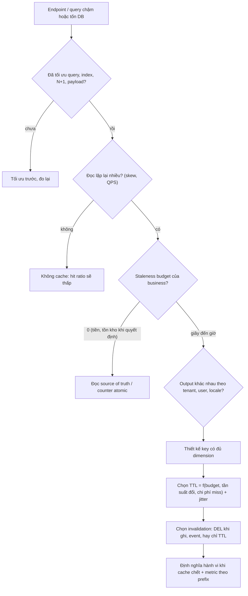
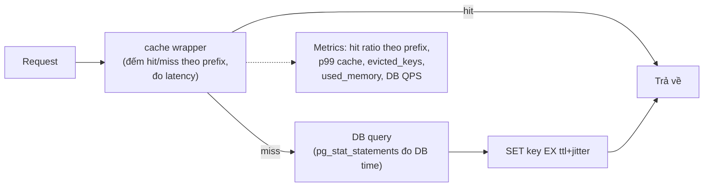

## Bối cảnh & vấn đề

Một team e-commerce multi-tenant thấy DB CPU thường xuyên ở mức 80% vào giờ cao điểm. Ai đó đề xuất "thêm Redis đi". Hai tuần sau, dashboard Redis rất đẹp: `keyspace_hits` gấp 19 lần `keyspace_misses`, tức **hit ratio 95%**. Nhưng DB CPU chỉ giảm từ 80% xuống 74%. Đồng thời support bắt đầu nhận ticket "sửa giá rồi mà trang vẫn hiện giá cũ".

Khi điều tra, team phát hiện ba điều. Thứ nhất, endpoint được cache nhiều nhất là `GET /tenants/:id/config`, vốn là một lookup theo primary key tốn 0,3 ms; cache nó làm hit ratio đẹp nhưng gần như không đỡ gì cho DB. Thứ hai, câu query thật sự đắt (trang listing với filter, 400 ms, chiếm 60% DB time theo `pg_stat_statements`) lại không được cache vì "khó invalidate". Thứ ba, giá sản phẩm được cache với TTL 1 giờ, trong khi business chỉ chấp nhận giá sai tối đa vài chục giây.

Câu chuyện này tóm tắt đúng những gì interviewer muốn nghe khi hỏi về caching ở mức senior: cache không phải là "bật lên là nhanh". Mọi quyết định cache là trả lời ba câu hỏi: **cache cái gì** (thứ tốn nhất và được đọc lặp lại nhiều nhất), **được phép sai bao lâu** (staleness budget), và **khi cache chết thì hệ thống sống thế nào**. Bài này xây nền cho cả track: định nghĩa, cách đo, cách chọn TTL, và cách chứng minh cache đáng giá. Các bài sau đi vào pattern ([bài 2](/tracks/caching/learn/caching-patterns)), invalidation ([bài 3](/tracks/caching/learn/invalidation-consistency)) và failure mode.

## Khái niệm

### Cache là bản sao có thể sai

**Cache** là một bản sao dữ liệu đặt ở nơi đọc nhanh hơn nguồn gốc (**source of truth**, thường là database). Nó có ích vì hai tính chất của workload thực tế: **temporal locality** (thứ vừa được đọc có khả năng được đọc lại sớm) và **skew** (một phần nhỏ dữ liệu nhận phần lớn traffic, ví dụ 1% sản phẩm nhận 40% lượt xem).

Điều quan trọng nhất cần nhớ: cache là bản sao **có thể sai**. Ngay khi DB thay đổi mà cache chưa được cập nhật, hai bên lệch nhau. Mọi kỹ thuật trong track này (TTL, invalidation, versioning) đều là cách **giới hạn** mức sai đó, không phải loại bỏ nó hoàn toàn. Một hệ thống vừa có cache vừa có strong consistency là chuyện rất khó; trong thực tế ta chấp nhận **eventual consistency có giới hạn** (bounded staleness).

**Interview angle:** mở đầu câu trả lời bằng "cache đổi consistency lấy latency và giảm tải" cho thấy bạn hiểu bản chất, thay vì liệt kê công nghệ.

### Hit, miss và hit ratio

Khi app hỏi cache một key: có dữ liệu là **hit**, không có là **miss**. **Hit ratio** = hits / (hits + misses). Nhưng hit ratio chỉ là proxy; mục tiêu thật là giảm **latency** và **tải lên nguồn gốc**. Latency trung bình hiệu dụng có thể ước lượng:

```text
latency_avg ≈ hit_ratio × t_cache + (1 − hit_ratio) × (t_cache + t_db + t_set)
```

Với `t_cache` = 0,4 ms, `t_db` = 20 ms: hit ratio 90% cho trung bình khoảng 2,5 ms; hit ratio 99% cho khoảng 0,6 ms. Để ý rằng miss còn **chậm hơn** không có cache (phải hỏi cache trước, rồi set sau), nên cache với hit ratio thấp làm hệ thống tệ hơn.

Hit ratio phụ thuộc mạnh vào **phân bố truy cập**. Trong mô phỏng ở phần Ví dụ, cùng một LRU chứa 10% catalog cho hit ratio 67,6% với traffic lệch kiểu Zipf nhưng chỉ 10% với traffic đều. Vì thế "cache 10% dữ liệu có đủ không?" không có câu trả lời chung, phải đo trên traffic thật.

**Interview angle:** interviewer hay hỏi "hit ratio 95% mà DB không giảm, vì sao?"; câu trả lời là hit ratio tính theo **số lần đọc**, không theo **chi phí** của lần đọc đó.

### TTL và staleness budget

**TTL (time to live)** là thời gian sống của một key; hết TTL, Redis xoá key (chi tiết cơ chế expire ở [bài 9](/tracks/caching/learn/memory-eviction-persistence)). TTL làm hai việc: (1) là **lưới an toàn**: kể cả khi có đường ghi quên invalidate (script, migration, service khác), dữ liệu sai chỉ tồn tại tối đa bằng TTL; (2) giới hạn memory cho key không còn ai đọc.

**Staleness budget** là lượng thời gian mà business chấp nhận dữ liệu hiển thị sai. Đây là con số của product/business, không phải dev tự chọn. Ví dụ: tên và ảnh sản phẩm có thể sai vài giờ; giá hiển thị trên listing có thể sai 30–60 giây; số dư ví hay tồn kho lúc checkout thì **không được** sai. TTL nên được suy ra từ staleness budget, kết hợp với tần suất thay đổi và chi phí miss:

- Dữ liệu đổi hiếm + đã có invalidate khi ghi → TTL dài (giờ) chỉ làm lưới an toàn.
- Dữ liệu đổi thường, không invalidate được chính xác (listing, search) → TTL ngắn bằng staleness budget.
- Query rất đắt → TTL dài hơn nhưng làm mới nền (stale-while-revalidate, [bài 5](/tracks/caching/learn/stampede-protection)).

Luôn thêm **jitter** (ngẫu nhiên hoá TTL, ví dụ `300 + random(0..60)`) để các key được set cùng lúc không hết hạn cùng lúc; đó là cách chống **avalanche** ([bài 6](/tracks/caching/learn/penetration-avalanche-warmup)).

**Interview angle:** câu follow-up kinh điển là "đã invalidate khi ghi thì còn cần TTL không?" — có, vì luôn tồn tại đường ghi bạn không kiểm soát, và vì DEL có thể thất bại.

### Các tầng cache

Một request đi qua nhiều tầng có thể cache:

- **Browser cache**: theo HTTP header `Cache-Control`, riêng từng user.
- **CDN / reverse proxy**: shared cache ở edge, gần user (xem [bài 12](/tracks/caching/learn/http-cdn-caching)).
- **In-process cache (L1)**: `Map`/LRU trong memory của process Node; nhanh nhất (micro giây), nhưng mỗi pod một bản.
- **Distributed cache (L2)**: Redis/Memcached dùng chung cho mọi pod; tốn một network hop (thường dưới 1 ms trong cùng AZ).
- **Cache trong database**: shared buffers của Postgres, buffer pool của InnoDB. Tự động, luôn đúng, nhưng không giảm số query, số connection hay CPU parse/plan.

Mỗi tầng có owner, cơ chế invalidate và rủi ro riêng. Một thiết kế tốt nói rõ tầng nào cache gì, TTL bao nhiêu, và invalidate ra sao.

**Interview angle:** khi được hỏi "cache ở đâu", đừng trả lời một tầng; hãy đi từ ngoài vào trong và nói tầng nào phù hợp với loại dữ liệu nào (public/per-tenant/per-user).

### Dữ liệu không nên cache (hoặc cache rất cẩn thận)

Nguyên tắc: cache thứ **đọc nhiều, đổi ít, chịu được stale, và đắt để tính**. Ngược lại:

- **Dữ liệu dùng để ra quyết định cần strong consistency**: số dư, tồn kho khi đặt hàng, quyền truy cập vừa bị thu hồi. Có thể cache để **hiển thị**, nhưng quyết định phải đọc từ source of truth (hoặc một counter atomic duy nhất).
- **Dữ liệu cá nhân / nhạy cảm** nếu key không scope đúng user/tenant; secret, token dài hạn (nếu buộc phải cache thì TTL ngắn, mã hoá, ACL Redis).
- **Cardinality cực cao, mỗi key đọc một lần** (ví dụ cache kết quả search với query tự do): hit ratio gần 0, chỉ tốn memory và đẩy key có ích ra ngoài.
- **Thứ rẻ hơn chi phí cache**: lookup theo primary key 0,3 ms trên DB nhàn rỗi có thể không đáng thêm serialize JSON + network + code invalidation.

**Interview angle:** câu "stock hiển thị ở listing và stock khi checkout" là cách interviewer kiểm tra bạn có tách "đọc để hiển thị" và "đọc để quyết định" hay không.

### Chi phí thật của một cache

Cache thêm vào hệ thống: một dependency có thể chết, code invalidation ở mọi đường ghi, loại bug mới (stale data, leak giữa tenant, cache lỗi), chi phí RAM, và độ phức tạp khi debug ("dữ liệu này đến từ đâu?"). Vì vậy câu trả lời senior thường là: **cache là tối ưu cuối cùng**. Trước đó hãy xem query plan, index, N+1, payload quá lớn, connection pool. Nếu một materialized view hay một index giải quyết được thì nó thường rẻ hơn về lâu dài vì luôn đúng.

**Interview angle:** red flag là "cái gì chậm thì cache"; green flag là "tôi đo DB time theo query trước, tối ưu query, rồi mới cache phần còn lại".

## Cơ chế hoạt động

Quyết định có cache một loại dữ liệu hay không nên đi theo một chuỗi câu hỏi có thứ tự. Sơ đồ dưới là checklist mà một senior dùng trước khi viết dòng `redis.set` đầu tiên:



Đọc sơ đồ từ trên xuống: bước đầu tiên không phải cache mà là loại trừ các cách rẻ hơn. Bước "đọc lặp lại nhiều" ngăn bạn cache dữ liệu cardinality cao. Bước staleness budget tách dữ liệu dùng để quyết định ra khỏi cache. Bước dimension ngăn leak giữa tenant ([bài 13](/tracks/caching/learn/keys-multi-tenant)). Ba bước cuối là "hợp đồng vận hành" của cache: TTL, invalidation, và hành vi khi Redis chết ([bài 7](/tracks/caching/learn/multi-level-resilience)). Thiếu bất kỳ bước nào đều là một loại incident đã từng xảy ra ở đâu đó.

Về phía đo lường, Redis đếm `keyspace_hits` và `keyspace_misses` trong `INFO stats`. Hai con số này là **toàn instance**, không theo prefix, và tăng cho **mọi lệnh đọc key** (không chỉ `GET`). Vì vậy nguồn metric đáng tin là tầng app: bọc client cache để đếm hit/miss theo **loại key** (prefix), đo latency lệnh cache, và quan trọng nhất là đặt cạnh **DB QPS / DB time** của các query tương ứng.



## Ví dụ thực tế

### Cache-aside đo thật trên Redis 8 và gotcha của `keyspace_hits`

Chạy trên Redis 8.10.2 (Docker) với ioredis 6.0.0, Node 24. DB giả lập bằng `Map` với latency 20 ms để thấy rõ chênh lệch:

```ts
const key = (t: string, id: string) => `t:${t}:product:${id}:v1`;

async function getProduct(t: string, id: string) {
  const k = key(t, id);
  const t0 = performance.now();
  const cached = await redis.get(k);
  if (cached) { console.log(`HIT  ${k} ${(performance.now() - t0).toFixed(2)}ms`); return JSON.parse(cached); }
  const row = await db.find(id);                                   // 20 ms
  if (row) await redis.set(k, JSON.stringify(row), "EX", 300 + Math.floor(Math.random() * 60));
  console.log(`MISS ${k} ${(performance.now() - t0).toFixed(2)}ms (db queries=${db.queries})`);
  return row;
}

async function updatePrice(t: string, id: string, price: number) {
  await db.update(id, { price });   // 1. commit
  await redis.del(key(t, id));      // 2. delete, not set
}

await redis.config("RESETSTAT");
await getProduct("acme", "42"); await getProduct("acme", "42"); await getProduct("acme", "42");
await updatePrice("acme", "42", 45);
console.log(await getProduct("acme", "42"));
console.log("TTL left:", await redis.ttl(key("acme", "42")));
// print keyspace_hits / keyspace_misses from INFO stats
```

```text
MISS t:acme:product:42:v1 22.40ms (db queries=1)
HIT  t:acme:product:42:v1 0.40ms
HIT  t:acme:product:42:v1 0.39ms
UPDATE price=45 -> DEL t:acme:product:42:v1
MISS t:acme:product:42:v1 22.02ms (db queries=2)
{ id: '42', name: 'Keyboard', price: 45, version: 2 }
TTL left: 347
keyspace_hits:3  keyspace_misses:2
```

Ba quan sát. Một: hit tốn khoảng 0,4 ms (localhost), miss tốn 22 ms, đúng như công thức latency ở trên. Hai: TTL còn lại là 347 giây, tức 300 + jitter; mỗi key có hạn khác nhau. Ba, và đây là gotcha: app chỉ có **2** lần `GET` hit, nhưng Redis báo `keyspace_hits:3`. Lần thứ ba đến từ lệnh `TTL`, vì Redis đếm hit cho mọi lệnh tra cứu key tồn tại. Trong production, các lệnh `EXISTS`, `TTL`, `HGET` của lock, rate limiter, session... đều cộng vào cùng hai counter. Kết luận: `INFO stats` chỉ dùng để nhìn xu hướng toàn instance; hit ratio theo loại dữ liệu phải đo ở app.

### Hit ratio phụ thuộc phân bố truy cập

Mô phỏng 200.000 request trên catalog 10.000 sản phẩm, so sánh traffic lệch (Zipf, s = 1, giống thực tế: vài sản phẩm hot) với traffic đều, cho LRU ở ba kích thước:

```text
LRU capacity  100 (1% of catalog): zipf(s=1) hit=39.1%  uniform hit=1.0%
LRU capacity 1000 (10% of catalog): zipf(s=1) hit=67.6%  uniform hit=10.0%
LRU capacity 5000 (50% of catalog): zipf(s=1) hit=88.7%  uniform hit=49.3%
```

Với traffic đều, hit ratio xấp xỉ đúng tỉ lệ dữ liệu nằm trong cache, nghĩa là cache gần như vô ích. Với traffic lệch, 1% catalog đã phục vụ 39% request. Đây là lý do cache trang sản phẩm hiệu quả còn cache kết quả search tự do thì không. (Cài đặt LRU chi tiết ở [LRU/LFU trong track DSA](/tracks/dsa/learn/lru-lfu-caching).)

### Staleness budget thành tài liệu

Thay vì mỗi dev tự chọn TTL, một bảng staleness budget được review cùng product là artifact rất có giá trị (và là câu chuyện tốt khi phỏng vấn):

```text
| data                     | budget  | TTL (+jitter) | invalidation              | khi Redis chết        |
|--------------------------|---------|---------------|---------------------------|-----------------------|
| product content (tên,ảnh)| 1 giờ   | 1h +10%       | DEL khi sửa + TTL         | đọc DB (có limiter)   |
| giá hiển thị listing     | 60 giây | 60s +20%      | event price-changed + TTL | đọc DB                |
| giá khi checkout         | 0       | không cache   | -                         | -                     |
| tenant config            | 5 phút  | 5m + DEL      | DEL khi admin sửa         | L1 in-process giữ 30s |
| tồn kho hiển thị         | 10 giây | 10s           | TTL                       | ẩn số, hiện "còn hàng"|
```

Mỗi dòng trả lời đủ: được phép sai bao lâu, TTL, cơ chế invalidate, và hành vi khi cache chết. Khi xảy ra incident stale data, bảng này cho biết lỗi nằm ở thiết kế (budget sai) hay ở implementation (quên DEL).

### Chứng minh cache đáng giá (và câu chuyện CV)

Với câu hỏi kiểu "bạn đã thêm Redis cho các API hay truy cập, chọn endpoint thế nào và đo kết quả ra sao?", cấu trúc trả lời mạnh là: **đo trước → tiêu chí chọn → thiết kế từng loại → đo sau → bài học**. Đo trước bằng APM (top endpoint theo tổng thời gian = QPS × latency) và DB (`pg_stat_statements` với Postgres, Query Store với SQL Server) để biết query nào chiếm DB time:

```sql
SELECT left(query, 60) AS q, calls, round(total_exec_time) AS total_ms,
       round(mean_exec_time::numeric, 1) AS mean_ms
FROM pg_stat_statements
ORDER BY total_exec_time DESC
LIMIT 3;
```

```text
                              q                               | calls  | total_ms | mean_ms
--------------------------------------------------------------+--------+----------+---------
 SELECT p.* FROM products p JOIN prices pr ON ... WHERE p.ten | 182340 |  7293600 |    40.0
 SELECT * FROM tenant_config WHERE tenant_id = $1             | 910221 |   273066 |     0.3
 SELECT count(*) FROM orders WHERE tenant_id = $1 AND status  |  12011 |   240220 |    20.0
```

(Output minh hoạ.) Dòng thứ hai được gọi nhiều nhất nhưng chỉ chiếm 3,5% DB time; dòng đầu mới là mục tiêu. Sau khi cache, so sánh cùng khung giờ: DB CPU, DB QPS của đúng query đó, p95/p99 của endpoint, hit ratio theo prefix, và số incident stale. Nếu bạn không có số đo thật, hãy nói thẳng và mô tả cách **lẽ ra** nên đo; bịa số chính xác là red flag mà interviewer nhận ra ngay khi hỏi follow-up.

## Trade-offs & lựa chọn thay thế

| Cách giảm tải đọc | Luôn đúng? | Chi phí vận hành | Khi nào chọn |
| --- | --- | --- | --- |
| Tối ưu query / thêm index | Có | Thấp | Luôn thử đầu tiên |
| Materialized view (refresh định kỳ) | Stale theo lịch refresh | Thấp, nằm trong DB | Aggregate/report nặng, chấp nhận trễ phút |
| Read replica | Stale theo replication lag | Trung bình | Nhiều query đa dạng, khó cache theo key |
| Cache in-process (L1) | Stale theo TTL, mỗi pod một bản | Thấp | Config, dữ liệu nhỏ rất hot |
| Redis / Memcached (L2) | Stale theo TTL + invalidation | Trung bình (HA, memory, invalidation) | Lookup theo key lặp lại nhiều, dùng chung giữa pod |
| CDN / HTTP cache | Stale theo `max-age` | Thấp nếu public | Nội dung public, không theo user |

Chọn thế nào: nếu vấn đề là **một query cụ thể chậm**, index hoặc viết lại query giải quyết tận gốc và không có rủi ro stale. Nếu vấn đề là **volume đọc** của các lookup theo key (chi tiết sản phẩm, config tenant) thì cache theo key là lựa chọn tự nhiên. Nếu là **aggregate** chạy lại nhiều lần với cùng tham số, materialized view hoặc bảng pre-aggregate thường tốt hơn cache vì dễ giải thích độ trễ. Read replica hợp khi các query đa dạng đến mức không có key tốt để cache, nhưng nhớ rằng replica cũng stale ([bài 3](/tracks/caching/learn/invalidation-consistency) có bug replica + cache).

## Edge cases & failure modes

- **Hit ratio cao nhưng DB không giảm**: cache nhầm query rẻ; hoặc hit ratio đo toàn instance bị "làm đẹp" bởi lock/rate limiter; hoặc miss rơi đúng vào query đắt (key cardinality cao). Luôn đặt hit ratio cạnh DB time.
- **Cache lỗi như dữ liệu thật**: DB timeout trả mảng rỗng và mảng rỗng được cache 5 phút ([bài 13](/tracks/caching/learn/keys-multi-tenant) có ví dụ debug). Chỉ cache kết quả thành công.
- **Key không có TTL**: một đường ghi quên DEL là stale vĩnh viễn; memory tăng mãi tới khi `OOM command not allowed` ([bài 9](/tracks/caching/learn/memory-eviction-persistence)).
- **TTL quá dài so với budget**: không có incident kỹ thuật nào nhưng business mất tiền (giá cũ, khuyến mãi đã hết vẫn hiện).
- **TTL quá ngắn**: hit ratio thấp, nhiều miss đồng thời, dễ stampede với key hot.
- **Cache làm lộ vấn đề thiết kế**: cache che một query tệ; khi cache chết (restart, eviction), query tệ đó hạ DB ([bài 7](/tracks/caching/learn/multi-level-resilience)).

## Pitfalls

- ❌ Cache mọi thứ chậm → ✅ đo DB time theo query, tối ưu query trước, rồi cache phần còn lại theo skew; cache sai chỗ tốn memory và thêm bug.
- ❌ Một TTL cho mọi loại dữ liệu → ✅ TTL suy ra từ staleness budget của từng loại, có jitter.
- ❌ Bỏ TTL vì "đã DEL khi ghi" → ✅ luôn có TTL làm lưới an toàn cho đường ghi bạn không kiểm soát.
- ❌ Dùng `keyspace_hits/misses` làm KPI chính → ✅ hit ratio theo prefix ở tầng app, cộng DB QPS/time và p99.
- ❌ Dùng giá/tồn kho trong cache để quyết định thanh toán → ✅ cache để hiển thị, quyết định bằng source of truth.
- ❌ Tự chọn TTL mà không hỏi product → ✅ biến staleness thành tài liệu có owner và review khi có incident.
- ❌ Giữ cache mãi mãi dù không còn giá trị → ✅ định kỳ xem hit ratio và DB time; gỡ cache khi index/materialized view đã đủ hoặc cache gây bug nhiều hơn lợi.

## Tóm tắt

- Cache là bản sao **có thể sai**; mọi kỹ thuật chỉ giới hạn mức sai (bounded staleness).
- Hit ratio phụ thuộc skew; miss còn chậm hơn không cache, nên cache hit ratio thấp là lỗ.
- `keyspace_hits/misses` là toàn instance và tính mọi lệnh đọc key; đo hit ratio theo prefix ở app và đặt cạnh DB time.
- TTL là lưới an toàn và giới hạn memory; chọn theo staleness budget, tần suất đổi, chi phí miss; luôn có jitter.
- Không cache dữ liệu dùng để quyết định (tiền, tồn kho, quyền), dữ liệu cá nhân chưa scope đúng, và dữ liệu cardinality cao.
- Staleness budget là quyết định của business, nên được ghi thành tài liệu cùng TTL, invalidation và hành vi khi cache chết.
- Cache là tối ưu cuối cùng; chứng minh giá trị bằng số đo trước/sau và sẵn sàng gỡ khi không còn đáng.
