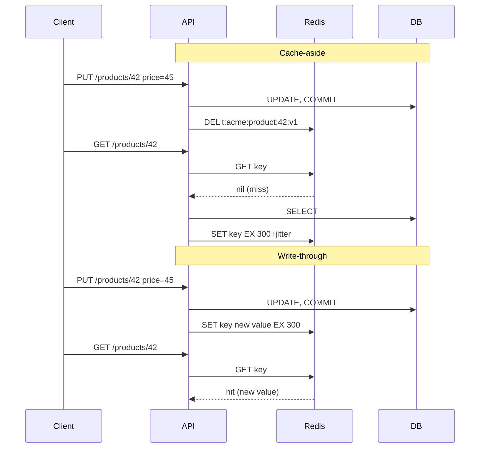
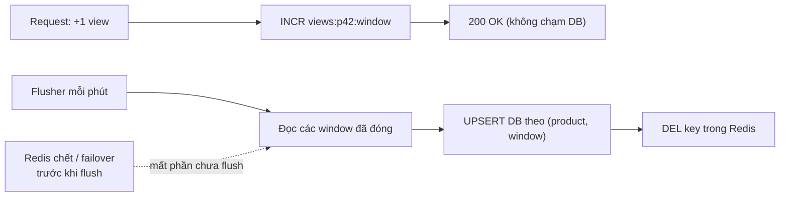

## Bối cảnh & vấn đề

Trong một buổi review thiết kế, ba dev đề xuất ba cách cache cho profile người dùng. Người thứ nhất: "đọc Redis, miss thì đọc DB rồi set". Người thứ hai: "mỗi lần update thì ghi cả DB lẫn Redis, như vậy cache luôn đúng". Người thứ ba: "ghi vào Redis rồi một worker đẩy xuống DB sau cho nhanh". Cả ba đều gọi cách của mình là "caching", nhưng chúng khác nhau về **ai giữ logic**, **đọc ngay sau ghi có thấy dữ liệu mới không**, và quan trọng nhất là **có thể mất dữ liệu hay không**.

Một tài liệu nội bộ (và nhiều bài blog) còn xếp write-through và refresh-ahead vào cột "strong consistency". Đây là hiểu lầm phổ biến và nguy hiểm: write-through ghi hai hệ thống **không có transaction chung**, refresh-ahead vẫn trả dữ liệu cũ giữa hai lần refresh. Nếu team tin rằng cache "luôn đúng", họ sẽ dùng nó để ra quyết định tiền bạc.

Bài này đi qua năm pattern theo cùng một khung: read path, write path, ai giữ logic, cửa sổ stale, rủi ro mất dữ liệu. Đây là nền cho các bài về invalidation ([bài 3](/tracks/caching/learn/invalidation-consistency)) và stampede ([bài 5](/tracks/caching/learn/stampede-protection)).

## Khái niệm

### Cache-aside (lazy loading)

**Cache-aside** là pattern mà **app code** tự làm hết: đọc cache; nếu **hit** thì trả; nếu **miss** thì query DB, `SET` kết quả vào cache kèm TTL, rồi trả. Khi **ghi**, app commit vào DB rồi **xoá** key trong cache (không set lại giá trị mới); lần đọc sau sẽ tự nạp bản mới. Cache không biết DB tồn tại; nó chỉ là một key-value store.

Ưu điểm: đơn giản, chỉ cache thứ thật sự được đọc (lazy), và khi cache chết thì app vẫn đọc DB được (dù DB có thể quá tải, xem [bài 7](/tracks/caching/learn/multi-level-resilience)). Nhược điểm: miss tốn hai round-trip cộng một lần set; có cửa sổ stale; hot key hết hạn gây stampede; và có race giữa reader và writer làm bản cũ quay lại cache ([bài 3](/tracks/caching/learn/invalidation-consistency)).

```ts
async function getProduct(tenantId: string, id: string): Promise<Product | null> {
  const key = `t:${tenantId}:product:${id}:v1`;
  const cached = await redis.get(key);
  if (cached) return JSON.parse(cached);
  const row = await db.product.findFirst({ where: { tenantId, id } });
  if (row) await redis.set(key, JSON.stringify(row), "EX", 300 + Math.floor(Math.random() * 60));
  return row;
}
```

Vì sao **xoá** thay vì set giá trị mới khi ghi? Vì hai writer đồng thời có thể set cache theo thứ tự ngược với thứ tự commit DB, và vì giá trị cache thường là một view tổng hợp mà writer không có đủ dữ liệu để dựng lại. Lập luận đầy đủ ở [bài 3](/tracks/caching/learn/invalidation-consistency#sec-delete-hay-update-khi-ghi).

**Interview angle:** red flag là chỉ mô tả read path; interviewer luôn hỏi tiếp "còn write path thì sao?".

### Read-through

**Read-through** có hành vi dữ liệu gần như cache-aside, nhưng logic "miss thì load" nằm trong **tầng cache** (một library hoặc provider) thay vì rải trong app. App chỉ gọi `cache.get(key)`; tầng cache được cấu hình một `loader` và tự gọi nó khi miss. Ví dụ: DataLoader, các thư viện cache có `fetch`/`loader` option, hoặc một class wrapper nội bộ.

Khác biệt quan trọng nằm ở **chỗ đặt logic**. Gom vào một chỗ giúp áp dụng đồng nhất TTL + jitter, singleflight (request coalescing), metrics theo prefix, và cách xử lý null. Cái giá là phụ thuộc vào library/abstraction và khó tuỳ biến cho từng trường hợp đặc biệt.

**Interview angle:** câu follow-up hay gặp là "request coalescing nên đặt ở app hay ở tầng read-through?"; câu trả lời tốt là ở tầng read-through, vì đó là nơi duy nhất thấy mọi miss của cùng một key.

### Write-through

**Write-through**: mỗi lần ghi, app (hoặc tầng cache) ghi **cả DB lẫn cache** trong cùng request; request chỉ xong khi cả hai xong. Lợi ích: đọc ngay sau ghi sẽ hit với dữ liệu mới, hit ratio cao cho dữ liệu vừa được sửa. Chi phí: write chậm hơn (hai lần ghi), và cache chứa cả những thứ ghi xong không ai đọc.

Điểm then chốt: DB và Redis **không có transaction chung**. Ghi DB xong mà set cache fail (timeout, Redis restart) thì hai bên lệch; set cache trước rồi DB rollback thì cache chứa dữ liệu chưa bao giờ tồn tại. Hai writer đồng thời vẫn có thể set cache sai thứ tự. Vì vậy write-through vẫn cần TTL và vẫn là eventual consistency. Nó **không** phải "strong consistency" như một số tài liệu ghi.

**Interview angle:** interviewer thường gài bằng câu "write-through cho strong consistency đúng không?"; câu trả lời đúng là "tốt hơn cache-aside cho read-after-write, nhưng không atomic".

### Write-behind (write-back)

**Write-behind**: ghi vào cache trước và trả response ngay; một tiến trình nền **flush** xuống DB sau (theo batch, theo lịch, hoặc qua queue). Write cực nhanh và gom được nhiều update thành một lần ghi DB, rất hợp với **counter** (view count, like count, metrics).

Rủi ro chính: trong khoảng thời gian trước khi flush, dữ liệu **chỉ tồn tại trong cache**. Nếu Redis chết, restart không có persistence, hoặc failover sang một replica chưa nhận các write gần nhất (replication của Redis là **async**), phần đó mất vĩnh viễn. DB cũng luôn trễ, nên mọi report đọc từ DB là số cũ. Vì thế write-behind chỉ dùng khi business chấp nhận mất một phần và nói rõ SLA ("số view có thể thiếu vài giây dữ liệu khi có sự cố").

**Interview angle:** "cho một use case write-behind đúng đắn" — view counter, analytics, rate counter; câu trả lời sai là đơn hàng hay số dư.

### Refresh-ahead

**Refresh-ahead**: làm mới key **trước khi** nó hết hạn, để key hot không bao giờ "trống". Có hai kiểu: theo **ngưỡng** (khi có request đọc và key đã sống quá 80% TTL thì refresh nền), hoặc theo **lịch** (job định kỳ nạp lại các key biết trước là hot, như trang chủ, bảng giá). Biến thể tốt hơn ngưỡng cố định là **probabilistic early expiration** (XFetch, [bài 5](/tracks/caching/learn/stampede-protection#sec-probabilistic-early-expiration-xfetch)).

Refresh-ahead lãng phí khi dự đoán sai (refresh key không còn ai đọc), khi số key lớn (refresh theo lịch thành gánh nặng DB liên tục), hoặc khi dữ liệu hiếm đổi (TTL dài + invalidate là đủ). Và nó **không** làm dữ liệu strong consistent: giữa hai lần refresh, người dùng vẫn thấy bản cũ.

**Interview angle:** red flag là "refresh-ahead nên luôn hit và không bao giờ stale".

### Memcached với TTL + refresh

Nhiều hệ thống cũ (và back-office migration) dùng **Memcached** với cache-aside + TTL + refresh. Memcached chỉ có get/set/add/delete trên blob, nên các kỹ thuật phải xây trên những primitive đó: lệnh `add` chỉ ghi khi key **chưa tồn tại**, nên nó hoạt động như một lock đơn giản để chỉ một process refresh khi key hết hạn; refresh theo lịch bằng một job nạp lại các key hot. Giới hạn cần nhớ: không persistence, không cấu trúc dữ liệu, item size mặc định tối đa **1 MB** (`item_size_max`), eviction LRU theo slab class. So sánh Redis/Memcached chi tiết ở [bài 8](/tracks/caching/learn/redis-core).

**Interview angle:** khi kể dự án dùng Memcached, interviewer muốn nghe **vì sao** (đã có sẵn, chỉ cần blob, multi-thread, vận hành đơn giản) và **giới hạn** bạn đã gặp.

## Cơ chế hoạt động

Sơ đồ dưới so sánh read path và write path của cache-aside và write-through cho cùng một thao tác "sửa giá sản phẩm rồi đọc lại":



Với cache-aside, request đọc ngay sau write sẽ miss và trả giá DB; với write-through, nó hit ngay. Nhưng nếu lệnh `SET` trong write-through fail sau khi DB đã commit, cache vẫn giữ giá cũ tới hết TTL: đây là lý do write-through vẫn cần TTL. Ở cả hai pattern, DB là source of truth và commit DB xảy ra **trước** thao tác trên cache.

Write-behind có luồng khác hẳn: request chỉ chạm Redis, còn DB được cập nhật theo lô:



Hai thiết kế giúp flush an toàn. Thứ nhất, **key theo cửa sổ thời gian** (`views:p42:<minute>`): flusher chỉ xử lý cửa sổ đã đóng, nên không tranh với writer đang `INCR`. Thứ hai, ghi DB bằng **upsert theo khoá (product, window)** với giá trị tuyệt đối thay vì `+=`: nếu flusher crash sau khi ghi DB nhưng trước khi DEL, lần retry ghi lại đúng giá trị cũ thay vì cộng đôi. Chỉ xoá key Redis **sau** khi DB commit; nếu dùng `GETDEL` trước khi ghi DB, một crash ở giữa làm mất luôn số đếm của cửa sổ đó.

## Ví dụ thực tế

### Read-through với loader và request coalescing

Một class read-through nhỏ gom TTL + jitter, coalescing và metrics vào một chỗ. Chạy trên Redis 8.10.2 / ioredis 6.0.0:

```ts
class ReadThroughCache<T> {
  #inflight = new Map<string, Promise<T | null>>();
  stats = { hit: 0, miss: 0, load: 0 };
  constructor(private redis: Redis, private prefix: string,
              private loader: (id: string) => Promise<T | null>, private ttlSec: number) {}

  async get(id: string): Promise<T | null> {
    const key = `${this.prefix}:${id}`;
    const raw = await this.redis.get(key);
    if (raw !== null) { this.stats.hit++; return JSON.parse(raw); }
    this.stats.miss++;
    let p = this.#inflight.get(key);
    if (!p) {
      p = (async () => {
        this.stats.load++;
        const v = await this.loader(id);
        if (v !== null) await this.redis.set(key, JSON.stringify(v), "EX",
          this.ttlSec + Math.floor(Math.random() * this.ttlSec * 0.1));
        return v;
      })().finally(() => this.#inflight.delete(key));
      this.#inflight.set(key, p);
    }
    return p;
  }
}

const products = new ReadThroughCache(redis, "rt:product", loadProductFromDb, 300);
await Promise.all(Array.from({ length: 100 }, () => products.get("42"))); // cold cache, 100 concurrent
await products.get("42");
await products.get("404"); await products.get("404");                     // id không tồn tại
console.log(products.stats);
```

```text
{ hit: 1, miss: 102, load: 3 }
```

100 request đồng thời trên cache lạnh chỉ gây **1** lần load (coalescing hoạt động). Lần đọc tiếp theo hit. Nhưng id `404` không tồn tại gây 2 lần load cho 2 request: loader trả `null` nên không có gì được cache, và mỗi request cho id rác đều chạm DB. Đó là **cache penetration**, và cách chữa (null caching, Bloom filter) nằm ở [bài 6](/tracks/caching/learn/penetration-avalanche-warmup).

### Write-behind cho view counter: vì sao flush phải idempotent

Tình huống ở câu hỏi: view counter dùng write-behind; sau một lần Redis failover, một phần số liệu của ngày biến mất, và một lần khác số liệu lại **gấp đôi**. Mất là do replication async (replica được promote chưa nhận các `INCR` cuối) hoặc Redis chết trước khi flush. Gấp đôi là do flush không idempotent. Mô phỏng: 1.500 view trong một phút, flusher crash sau khi ghi DB nhưng trước khi xoá key, rồi retry:

```ts
const windowOf = (ms: number) => Math.floor(ms / 60_000);
async function recordView(product: string, now: number) {
  await redis.incr(`views:${product}:${windowOf(now)}`);          // hot path: 1 Redis op
}
async function flushClosed(now: number) {
  for (const k of await scanKeys("views:*")) {
    const [, product, w] = k.split(":");
    if (Number(w) >= windowOf(now)) continue;                      // window still open
    const n = Number(await redis.get(k));
    await db.query(
      `INSERT INTO product_views(product_id, window_start, views) VALUES ($1, $2, $3)
       ON CONFLICT (product_id, window_start) DO UPDATE SET views = EXCLUDED.views`, // "=" not "+="
      [product, w, n]);
    await redis.del(k);                                            // only after DB commit
  }
}
```

```text
increment (+=)  run 1: flusher crashed after DB write, before DEL
increment (+=)  after retry: DB views=3000 (true value 1500)
upsert (=)      run 1: flusher crashed after DB write, before DEL
upsert (=)      after retry: DB views=1500 (true value 1500)
```

Bản `+=` đếm đôi sau retry; bản upsert theo (product, window) cho đúng 1.500. Để giảm phần **mất**: flush thường xuyên hơn (cửa sổ nhỏ), bật AOF `everysec` (vẫn có thể mất khoảng 1 giây), và nhớ rằng `WAIT` chỉ tăng xác suất write đã tới replica, không biến Redis thành hệ thống durable. Nếu con số là dữ liệu kinh doanh quan trọng (tính tiền quảng cáo theo view), hãy ghi **event bền** (Kafka, hoặc Redis Stream có ack) rồi aggregate, và chấp nhận chi phí cao hơn.

### Memcached: item size và `add` làm lock

Chạy trên Memcached 1.6.45 (Docker), nói chuyện trực tiếp bằng text protocol:

```text
set 5-byte value     -> STORED
set 1 MiB+10B value  -> SERVER_ERROR object too large for cache
add lock (1st)       -> STORED
add lock (2nd)       -> NOT_STORED
STAT threads 4
STAT limit_maxbytes 67108864
STAT item_size_max 1048576
```

Giá trị vượt 1 MB bị từ chối (một trang listing JSON lớn sẽ không cache được nếu không nén hoặc chia nhỏ). `add` lần hai trả `NOT_STORED`, nên chỉ process đầu tiên "thắng" và được refresh key; các process khác trả bản cũ hoặc chờ. Memory mặc định 64 MB và 4 worker thread cho thấy Memcached được thiết kế để scale theo core, khác với Redis.

## Trade-offs & lựa chọn thay thế

| Pattern | Read latency | Write latency | Cửa sổ stale | Mất dữ liệu? | Rủi ro chính | Hợp khi |
| --- | --- | --- | --- | --- | --- | --- |
| Cache-aside | Miss chậm (2 round-trip + set) | Không đổi (+1 DEL) | Tới lúc DEL, hoặc TTL nếu race | Không (DB là nguồn) | Race reader/writer, stampede | Mặc định cho read-heavy |
| Read-through | Như cache-aside | Không đổi | Như cache-aside | Không | Phụ thuộc library | Muốn gom TTL/coalescing/metrics một chỗ |
| Write-through | Hit ngay sau write | Tăng (2 lần ghi) | Nhỏ, nhưng không atomic | Không | Lệch khi một bên fail, cache dữ liệu không ai đọc | Dữ liệu vừa ghi được đọc ngay |
| Write-behind | Nhanh | Rất nhanh | DB luôn trễ | **Có** | Mất khi cache chết/failover, đếm đôi khi retry | Counter, metrics chấp nhận xấp xỉ |
| Refresh-ahead | Luôn hit với key hot | Không đổi | Giữa hai lần refresh | Không | Refresh key không ai dùng | Key hot, loader đắt, pattern đọc đều |

Chọn thế nào. Bắt đầu với **cache-aside + TTL có jitter + DEL sau commit**; đó là lựa chọn đúng cho phần lớn API đọc nhiều. Khi team có nhiều loại dữ liệu cần cache giống nhau, bọc thành **read-through** nội bộ để không ai quên coalescing hay jitter. Dùng **write-through** cho những màn hình "sửa xong quay về xem ngay" (profile, settings) nếu miss sau ghi gây khó chịu, nhưng vẫn giữ TTL. **Write-behind** chỉ cho số liệu chấp nhận xấp xỉ, với flush idempotent. **Refresh-ahead** cho một số ít key hot đã biết trước. Không pattern nào thay được việc đọc source of truth khi cần quyết định tiền hoặc tồn kho.

## Edge cases & failure modes

- **Write-through nửa chừng**: DB commit xong, `SET` timeout. Cache giữ bản cũ tới hết TTL. Nếu đặt `SET` trước DB và DB rollback, cache chứa dữ liệu không tồn tại. Luôn ghi DB trước, và trên lỗi cache thì DEL (hoặc chấp nhận TTL).
- **Write-behind khi Redis failover**: replica được promote thiếu các write cuối; counter mất một đoạn. Nếu flusher đọc từ replica cũ thì còn có thể đọc số lệch.
- **Flush retry không idempotent**: `UPDATE views = views + n` cộng đôi sau crash. Dùng upsert theo cửa sổ, hoặc lưu "đã flush tới offset nào".
- **Refresh-ahead theo lịch với key đã chết**: job cứ refresh 50.000 key "hot tuần trước", gây tải DB liên tục. Chỉ refresh key có lượt đọc gần đây.
- **Read-through che lỗi**: loader ném lỗi, nếu tầng cache nuốt lỗi và cache `null` thì một sự cố DB 2 giây thành "sản phẩm không tồn tại" 5 phút.
- **Memcached item quá lớn**: `SERVER_ERROR object too large for cache`; nếu code bỏ qua lỗi set thì mọi request của key đó đều miss, âm thầm đánh DB.

## Pitfalls

- ❌ Mô tả cache-aside chỉ có read path → ✅ luôn nói write path: commit DB rồi DEL key, cộng TTL làm lưới an toàn.
- ❌ "Write-through/refresh-ahead cho strong consistency" → ✅ không có transaction chung giữa DB và cache; vẫn là eventual consistency có giới hạn.
- ❌ Ghi cache trước rồi mới ghi DB → ✅ DB trước, cache sau; nếu không, rollback để lại cache "ma".
- ❌ Write-behind cho đơn hàng/thanh toán → ✅ chỉ cho dữ liệu chấp nhận mất một phần; dữ liệu quan trọng đi qua log bền (Kafka/Stream) rồi aggregate.
- ❌ Flush write-behind bằng `+=` hoặc `GETDEL` trước khi ghi DB → ✅ upsert giá trị tuyệt đối theo (key, window), xoá Redis sau khi DB commit.
- ❌ Refresh-ahead mọi key → ✅ chỉ key hot đã đo, và ưu tiên XFetch/SWR thay cho job refresh toàn bộ.
- ❌ Rải logic cache-aside ở 30 chỗ → ✅ một tầng read-through nội bộ để TTL, jitter, coalescing, metrics nhất quán.

## Tóm tắt

- Cache-aside: app đọc cache, miss thì đọc DB và set có TTL; ghi thì commit DB rồi **DEL** key. Là mặc định cho read-heavy.
- Read-through: hành vi giống cache-aside, khác ở chỗ loader nằm trong tầng cache; nơi tốt nhất cho coalescing và metrics.
- Write-through: ghi DB và cache cùng request; đọc ngay sau ghi hit, nhưng **không atomic**, vẫn cần TTL.
- Write-behind: ghi cache trước, flush DB sau; nhanh nhất nhưng **có thể mất dữ liệu** (Redis chết, failover async), cần flush idempotent.
- Refresh-ahead: làm mới trước khi hết hạn cho key hot; lãng phí nếu đoán sai, và vẫn stale giữa các lần refresh.
- Không pattern nào cho strong consistency; quyết định tiền/tồn kho đọc từ source of truth.
- Memcached: blob, multi-thread, item tối đa 1 MB mặc định, `add` làm lock đơn giản cho refresh.
