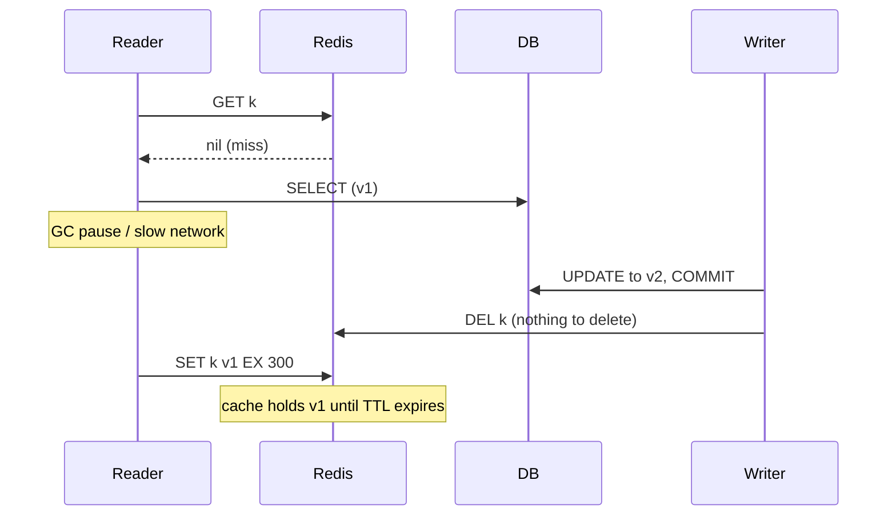
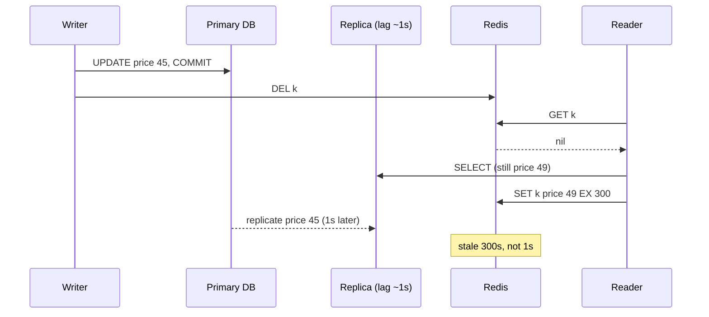

## Bối cảnh & vấn đề

User đổi giá sản phẩm từ 49 xuống 45. Code đã làm đúng "sách giáo khoa": commit DB rồi `DEL` key cache. Vậy mà trong khoảng 1 trên vài nghìn lần sửa, trang sản phẩm tiếp tục hiện giá 49 suốt **5 phút**, đúng bằng TTL. Không có log lỗi nào. Team thêm log và thấy thứ tự sự kiện rất lạ: lệnh `SET` với giá 49 xảy ra **sau** lệnh `DEL`.

Một team khác thêm read replica để giảm tải primary. Từ đó, người dùng thỉnh thoảng thấy dữ liệu cũ **vài phút**, trong khi replication lag đo được chỉ khoảng 1 giây. Lag 1 giây sao lại thành stale 5 phút?

Cả hai bug có cùng gốc: trong cache-aside, **reader** là người ghi vào cache, và reader có thể mang theo một bản dữ liệu đã cũ vào cache **sau** khi writer đã dọn dẹp. Bài này mổ xẻ các interleaving đó, so sánh delete và update, vị trí của DEL so với commit, và những công cụ giảm cửa sổ stale: TTL, delayed double delete, version-checked SET bằng Lua, đọc primary khi repopulate. Invalidation ở quy mô nhiều service (CDC, event) nằm ở [bài 4](/tracks/caching/learn/invalidation-at-scale).

## Khái niệm

### Invalidation và cửa sổ stale

**Invalidation** là hành động làm cho cache không còn trả dữ liệu cũ sau khi source of truth thay đổi: xoá key, ghi đè giá trị mới, hoặc đổi key (version). **Cửa sổ stale** là khoảng thời gian từ lúc DB commit tới lúc mọi lần đọc cache đều thấy dữ liệu mới. Mục tiêu thực tế không phải cửa sổ bằng 0, mà là cửa sổ **có giới hạn và biết trước** (bounded staleness), khớp với staleness budget ([bài 1](/tracks/caching/learn/cache-fundamentals)).

Trong cache-aside có hai "người ghi" vào cache: writer (khi invalidate) và reader (khi miss thì set). Mọi race đều đến từ việc hai người này không phối hợp. Phil Karlton có câu nổi tiếng "There are only two hard things in Computer Science: cache invalidation and naming things", và phần còn lại của bài giải thích vì sao.

**Interview angle:** nói được "reader cũng ghi vào cache" là chìa khoá để giải mọi câu hỏi race.

### Delete hay update khi ghi

Khi dữ liệu đổi, writer có hai lựa chọn: `DEL key` hoặc `SET key <giá trị mới>`. **Delete là mặc định an toàn** vì ba lý do.

Thứ nhất, **thứ tự**. Hai writer A và B cùng sửa một sản phẩm. DB commit A rồi B (giá cuối là của B). Nhưng lệnh `SET` tới Redis có thể đi theo thứ tự B rồi A (network, GC pause, retry). Cache giữ giá của A, **khác DB**, tới hết TTL. Với `DEL`, thứ tự không quan trọng: xoá hai lần vẫn là xoá, lệnh idempotent.

Thứ hai, **giá trị cache thường là view tổng hợp**: trang sản phẩm gồm product + giá theo tenant + tồn kho + review. Writer sửa giá không có đủ dữ liệu để dựng lại toàn bộ view; nếu cố dựng lại, nó phải query thêm và dễ lệch với logic đọc. Thứ ba, update tốn công tính giá trị mà có thể **không ai đọc** trước khi nó lại đổi.

Nhược điểm của delete: request kế tiếp chắc chắn miss. Với key hot, một lần DEL có thể gây stampede, nên kết hợp singleflight/SWR ([bài 5](/tracks/caching/learn/stampede-protection)). Update chỉ hợp lý khi có **version** để từ chối ghi đè bằng bản cũ (xem phần Lua bên dưới) hoặc trong write-through có kiểm soát.

**Interview angle:** red flag là "update tốt hơn vì tránh được một lần miss" mà không nhắc tới race.

### DEL trước, trong, hay sau commit

Ba vị trí có thể đặt DEL so với transaction DB:

- **DEL trước rồi mới ghi DB**: giữa hai bước, một reader miss, đọc DB (vẫn là bản cũ vì chưa ghi), set bản cũ vào cache. Sau đó writer ghi DB. Cache stale tới hết TTL. Đây là lựa chọn **tệ nhất**.
- **DEL bên trong transaction (trước COMMIT)**: dưới Read Committed, reader khác vẫn thấy dữ liệu cũ cho tới khi commit, nên reader miss lúc này đọc bản cũ và set lại. Cùng vấn đề. Nếu transaction rollback, DEL vô ích nhưng vô hại.
- **DEL sau commit**: cửa sổ nhỏ nhất, vì mọi reader đọc DB sau DEL đều thấy bản mới. Rủi ro còn lại là DEL **fail** (Redis timeout) và race của reader chậm (phần tiếp theo).

Khi DEL sau commit bị timeout: không rollback được DB (đã commit). Hãy retry DEL (với backoff), và nếu vẫn fail thì đẩy vào hàng đợi invalidation (outbox/queue) để xử lý lại; TTL là lưới an toàn cuối cùng. Cách mạnh nhất là không phụ thuộc vào việc mọi code path nhớ DEL: phát invalidation từ **transactional outbox** hoặc **CDC** ([bài 4](/tracks/caching/learn/invalidation-at-scale)).

**Interview angle:** interviewer thường hỏi "DEL sau commit bị timeout thì sao?"; câu trả lời có retry + outbox + TTL là đủ tầng.

### Race: reader chậm đưa bản cũ trở lại

Ngay cả với DEL sau commit, interleaving sau vẫn xảy ra: (1) reader miss, đọc DB được v1; (2) reader bị chậm (GC pause, network, event loop bận); (3) writer update v2, commit, DEL; (4) reader lúc này mới `SET key v1`. Cache giữ v1 tới hết TTL. Điều kiện để xảy ra là thời gian "đọc DB tới SET" của reader dài hơn thời gian "commit tới DEL" của writer, hiếm nhưng không hiếm ở traffic lớn.

Các cách giảm, từ rẻ tới mạnh:

- **TTL ngắn**: giới hạn thời gian stale tối đa. Luôn có.
- **Delayed double delete**: writer DEL ngay, rồi DEL lần nữa sau một khoảng lớn hơn thời gian đọc+set tối đa của reader (vài trăm ms). Rẻ, giảm xác suất mạnh, nhưng không tuyệt đối (reader có thể chậm hơn khoảng trễ).
- **Version-checked SET**: mỗi row có `version` (hoặc `updated_at`) tăng đơn điệu; lệnh set vào cache chỉ thành công nếu version mới hơn version đang có. Cần writer để lại dấu version (ghi giá trị mới kèm version, hoặc tombstone chứa version) thay vì DEL trơn.
- **Lease** (kỹ thuật của Memcache ở Facebook): khi miss, cache cấp một token; lệnh set chỉ được chấp nhận nếu token còn hiệu lực, và DEL làm token mất hiệu lực.

**Interview angle:** câu trả lời tốt kết thúc bằng "không có cách hoàn hảo nếu không versioning; tôi nói rõ bounded staleness bằng TTL".

### Lua script: atomic read-modify-write trên Redis

Để làm version-checked SET, ta cần "đọc version hiện tại, so sánh, rồi ghi" như **một bước**. Nếu làm bằng `HGET` rồi `HSET` từ app, một client khác có thể chen vào giữa. Redis thực thi command trên **một luồng**, nên một **Lua script** (`EVAL`, hoặc Redis Functions) chạy từ đầu tới cuối mà không command nào khác chen vào: đó là atomicity.

`MULTI/EXEC` cũng gom lệnh thành một khối atomic, nhưng lệnh được **queue trước** và không thể đọc giá trị giữa chừng để rẽ nhánh; muốn điều kiện phải dùng `WATCH` + retry (optimistic). Lua cho phép logic có điều kiện trong một round-trip. Cái giá: script chạy lâu **block cả instance** ([bài 8](/tracks/caching/learn/redis-core)), và mọi key script đụng tới phải truyền qua `KEYS[]` để Redis Cluster route đúng slot ([bài 10](/tracks/caching/learn/cluster-hot-big-keys)).

```lua
-- KEYS[1] = cache key, ARGV[1] = version, ARGV[2] = price, ARGV[3] = ttl
local cur = redis.call('HGET', KEYS[1], 'ver')
if (not cur) or tonumber(ARGV[1]) > tonumber(cur) then
  redis.call('HSET', KEYS[1], 'ver', ARGV[1], 'price', ARGV[2])
  redis.call('EXPIRE', KEYS[1], ARGV[3])
  return 1
end
return 0
```

**Interview angle:** interviewer hỏi "khi nào Lua thay vì MULTI/EXEC?" — khi cần rẽ nhánh theo giá trị đọc được trong cùng bước.

### Replica lag và read-your-writes

**Replication lag** là độ trễ giữa lúc primary commit và lúc replica áp dụng thay đổi (Postgres streaming replication, MySQL binlog, đều async theo mặc định). **Read-your-writes** là đảm bảo rằng sau khi user ghi, chính user đó đọc lại sẽ thấy thay đổi của mình.

Khi kết hợp cache-aside với replica: writer ghi primary, DEL cache; request kế tiếp miss, đọc **replica đang lag**, được bản cũ, và **set bản cũ vào cache với TTL đầy đủ**. Stale giờ kéo dài bằng **TTL**, không phải bằng lag. Một lag 800 ms biến thành stale 300 giây. Cách sửa: khi repopulate cache (đặc biệt ngay sau write), đọc từ **primary**; hoặc writer tự set cache bằng dữ liệu vừa commit (kèm version check); hoặc delayed double delete với độ trễ lớn hơn lag; và theo dõi lag, ngừng đọc replica khi lag vượt ngưỡng. Chi tiết replication ở [track SQL](/tracks/sql-postgres/learn/replication-scaling).

**Interview angle:** nối được "lag nhỏ × TTL lớn = stale lớn" là dấu hiệu bạn đã debug bug này thật.

## Cơ chế hoạt động

Sơ đồ đầu là interleaving của race "reader chậm". Điểm mấu chốt: DEL của writer xảy ra **trước** SET của reader, nên DEL không có gì để xoá, còn SET sau đó ghi bản cũ.



Với version-checked SET, writer không DEL trơn mà ghi v2 kèm `ver=2` bằng script. Khi reader chậm tới với v1, script so sánh `1 > 2` là sai và trả 0: bản cũ bị từ chối. Nếu writer muốn chỉ xoá (không có view đầy đủ để ghi), nó có thể ghi một **tombstone** chỉ chứa `ver=2` với TTL ngắn; reader đọc thấy tombstone thì coi như miss, và SET v1 vẫn bị từ chối.

Sơ đồ thứ hai là bug replica + cache: lag nhỏ nhưng được "khuếch đại" bởi TTL.



## Ví dụ thực tế

### Tái hiện race và sửa bằng version-checked SET

Chạy trên Redis 8.10.2 / ioredis 6.0.0 / Node 24. DB giả lập, reader bị "pause" 100 ms giữa SELECT và SET, writer commit ở giây thứ 30 ms:

```ts
const reader = (async () => {
  if (!(await redis.get(K))) log("reader: GET -> miss");
  const row = await db.find("42");            log(`reader: SELECT -> price=${row.price} v${row.version}`);
  await sleep(100);                            // GC pause / slow network
  await redis.set(K, JSON.stringify(row), "EX", 300);
});
const writer = (async () => {
  await sleep(30);
  const row = await db.update("42", { price: 45 }); log(`writer: UPDATE price=45 v${row.version}, COMMIT`);
  await redis.del(K);                                log("writer: DEL key");
});
```

```text
== plain SET (stale for full TTL)
t=  1ms reader: GET -> miss
t=  2ms reader: SELECT -> price=49 v1
t= 37ms writer: UPDATE price=45 v2, COMMIT
t= 38ms writer: DEL key
t=103ms reader: SET v1 -> OK
t=106ms final: cache price=49 v1 | db price=45 v2 | TTL=300s
```

Đúng kịch bản trong bối cảnh: DB có giá 45, cache giữ 49 với TTL 300 giây. Bây giờ thay SET trơn bằng script `setIfNewer` (Lua ở phần Khái niệm, đăng ký bằng `defineCommand` của ioredis), và writer ghi bản mới kèm version thay vì DEL:

```ts
redis.defineCommand("setIfNewer", { numberOfKeys: 1, lua: SET_IF_NEWER });
// reader:  await redis.setIfNewer(K, row.version, row.price, 300)
// writer:  await redis.setIfNewer(K, row.version, row.price, 300)   // after COMMIT
```

```text
== version-checked SET (writer writes new version)
t=  1ms reader: SELECT -> price=49 v1
t= 35ms writer: UPDATE v2, COMMIT
t= 37ms writer: setIfNewer v2 -> written
t=103ms reader: setIfNewer v1 -> rejected (older)
t=105ms final: cache {"ver":"2","price":"45"}
```

Bản cũ bị từ chối vì `1 > 2` sai. Điều kiện cần: version phải đến từ DB (cột `version` tăng trong cùng transaction với update, hoặc `xmin`/`updated_at` đủ độ phân giải), không phải từ đồng hồ của app server.

### Delayed double delete

Nếu không có version, delayed double delete là lựa chọn rẻ. Cùng kịch bản, writer DEL lần hai sau 300 ms:

```ts
await redis.del(K);                                                 // DEL #1 right after COMMIT
setTimeout(() => redis.del(K).catch(log.warn), 300);                 // DEL #2, > max read+set time
```

```text
t=  1ms reader: SELECT v1
t= 37ms writer: COMMIT v2
t= 38ms writer: DEL #1
t=105ms reader: SET v1
t=340ms writer: DEL #2 (delayed 300ms)
t=508ms cache now: (empty) -> next read loads v2
```

Bản cũ tồn tại trong cache khoảng 235 ms thay vì 300 giây. Trong production, `setTimeout` trong process là không bền (pod restart thì mất lần DEL thứ hai); dùng một delayed job (BullMQ delay, SQS delay queue) nếu cần chắc chắn. Và khoảng trễ phải lớn hơn thời gian đọc+set **tối đa** thực tế (p99.9), cộng replication lag nếu reader đọc replica.

### Replica lag: repopulate từ replica so với primary

Mô phỏng primary/replica với lag 800 ms:

```text
== repopulate from REPLICA
t=   2ms write price=45 on primary, DEL cache
t= 106ms read -> price=49 (from replica)
t=1111ms read after replica caught up -> price=49 (from cache), cache TTL=299s

== repopulate from PRIMARY
t=1114ms write price=40 on primary, DEL cache
t=1217ms read -> price=40 (from primary)
t=2222ms read after replica caught up -> price=40 (from cache), cache TTL=299s
```

Khi đọc replica, dù replica đã bắt kịp sau 1 giây, cache vẫn giữ giá 49 với 299 giây còn lại. Khi repopulate từ primary, cache đúng ngay. Chính sách thực tế: đường **cache miss** đọc primary (vì mỗi miss chỉ xảy ra một lần mỗi TTL, tải lên primary nhỏ), còn các query đa dạng không cache thì mới đọc replica. Một biến thể khác: sau khi user ghi, gắn cờ "vừa ghi" vào session vài giây để mọi đọc của user đó đi primary (read-your-writes).

## Trade-offs & lựa chọn thay thế

| Kỹ thuật | Cửa sổ stale còn lại | Chi phí | Hạn chế |
| --- | --- | --- | --- |
| Chỉ TTL | Tới hết TTL | Không | Stale dài nếu TTL dài |
| DEL sau commit + TTL | Nhỏ; race reader chậm vẫn tới TTL | Thấp | Cần mọi đường ghi nhớ DEL |
| Update (SET) khi ghi | Có thể vĩnh viễn tới TTL khi 2 writer đảo thứ tự | Thấp | Sai thứ tự, writer thiếu dữ liệu view |
| Delayed double delete | Tới lúc DEL #2 (vài trăm ms) | Thêm một job trễ | Reader chậm hơn khoảng trễ vẫn lọt |
| Version-checked SET (Lua) | Gần như 0 cho race đọc/ghi | Cột version, script, key dạng hash | Phức tạp hơn, cần version đơn điệu từ DB |
| Lease (kiểu Memcache FB) | Gần như 0 | Hỗ trợ ở tầng cache | Ít client/Redis hỗ trợ sẵn |
| CDC/outbox invalidation | Bằng độ trễ pipeline (giây) | Pipeline vận hành | Xem [bài 4](/tracks/caching/learn/invalidation-at-scale) |

Chọn thế nào: với dữ liệu chấp nhận stale vài phút trong trường hợp hiếm, **DEL sau commit + TTL ngắn vừa phải** là đủ và đơn giản. Khi stale gây thiệt hại (giá, khuyến mãi), thêm **delayed double delete** hoặc chuyển sang **version-checked SET**. Nếu có read replica, sửa đường miss để đọc primary trước khi làm gì phức tạp hơn. Khi nhiều service cùng ghi, tầng invalidation phải chuyển xuống CDC/outbox thay vì dựa vào từng code path.

## Edge cases & failure modes

- **DEL fail sau commit**: Redis timeout trả lỗi, request vẫn nên thành công (DB đã commit); ghi lại vào queue invalidation để retry. Đừng trả 500 cho user vì cache.
- **Version không đơn điệu**: dùng `Date.now()` của app server làm version; hai server lệch đồng hồ 2 giây thì bản cũ có "version" lớn hơn. Version phải đến từ DB.
- **Script đụng key không khai báo trong `KEYS[]`**: chạy được trên single instance, vỡ trên Cluster (`CROSSSLOT` hoặc sai node).
- **Transaction dài giữ DEL chậm**: DEL sau commit nhưng commit mất 3 giây vì lock; cửa sổ tính từ lúc commit, không phải lúc bắt đầu request.
- **Rollback sau DEL**: nếu lỡ DEL trong transaction rồi rollback, cache chỉ bị miss thêm một lần, vô hại; nhưng nếu lỡ **SET** giá trị mới trong transaction rồi rollback, cache chứa dữ liệu chưa từng tồn tại.
- **Replica failover**: replica được promote có thể thiếu vài giây dữ liệu; cache được repopulate từ đó có thể "quay ngược thời gian".
- **Serializer đổi shape**: writer ghi bản mới theo format v2, reader cũ (pod chưa deploy) đọc bằng format v1 và crash; version schema trong key ([bài 13](/tracks/caching/learn/keys-multi-tenant)).

## Pitfalls

- ❌ SET giá trị mới vào cache khi ghi → ✅ DEL (idempotent, không phụ thuộc thứ tự), hoặc SET có version check.
- ❌ DEL trước khi ghi DB hoặc bên trong transaction → ✅ DEL **sau commit**, retry/outbox khi lỗi, TTL làm lưới an toàn.
- ❌ Nghĩ DEL sau commit là "đúng tuyệt đối" → ✅ biết race reader chậm, nói rõ bounded staleness và công cụ giảm.
- ❌ Repopulate cache từ read replica → ✅ đọc primary trên đường miss, hoặc delayed delete lớn hơn lag.
- ❌ Read-modify-write bằng hai lệnh từ app → ✅ Lua script (hoặc WATCH + retry) để atomic.
- ❌ Version lấy từ đồng hồ app → ✅ version tăng trong DB cùng transaction.
- ❌ Double delete bằng `setTimeout` cho dữ liệu quan trọng → ✅ delayed job bền.

## Tóm tắt

- Trong cache-aside có hai người ghi vào cache: writer (invalidate) và reader (set khi miss); mọi race đến từ đó.
- **Delete** là mặc định: idempotent, không phụ thuộc thứ tự, không cần dựng lại view.
- DEL **sau commit**; trước commit hoặc trong transaction để lại bản cũ. DEL fail thì retry/outbox, TTL là lưới cuối.
- Reader chậm vẫn có thể SET bản cũ sau DEL; giảm bằng TTL, delayed double delete, version-checked SET, lease.
- Lua cho read-modify-write atomic vì Redis thực thi lệnh đơn luồng; MULTI/EXEC không rẽ nhánh được.
- Replica lag × TTL: repopulate từ replica biến lag 1 giây thành stale bằng TTL; đọc primary khi miss.
- Luôn nói bằng ngôn ngữ **bounded staleness**, không hứa strong consistency.
