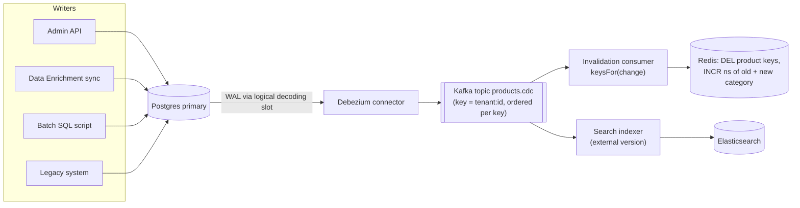

## Bối cảnh & vấn đề

Một nền tảng e-commerce có dữ liệu sản phẩm được ghi từ **bốn** nơi: admin UI (qua API), một Data Enrichment Service đồng bộ từ provider bên ngoài mỗi giờ, một batch script sửa giá hàng loạt chạy tay, và hệ thống legacy vẫn còn ghi thẳng vào DB trong giai đoạn migration. Chỉ đường admin UI có code `redis.del(...)` sau khi ghi. Kết quả: mỗi lần sync hay chạy script, trang sản phẩm hiện dữ liệu cũ tới hết TTL; team phản ứng bằng cách giảm TTL xuống 30 giây, và DB CPU tăng gấp đôi.

Vấn đề thứ hai là **fan-out**: một sản phẩm đổi giá không chỉ ảnh hưởng key `product:42`. Nó nằm trong hàng chục trang listing (theo category, theo filter giá, theo sort), trong trang chủ "sản phẩm nổi bật", và trong index Elasticsearch. Không thể `KEYS *product*` để tìm, và không thể liệt kê mọi tổ hợp filter.

Invalidation "trong code của từng endpoint" (bài [3](/tracks/caching/learn/invalidation-consistency)) không còn đủ khi số đường ghi và số view tăng lên. Bài này trình bày ba ý: (1) đưa nguồn invalidation xuống **tầng dữ liệu** (CDC, outbox) để bắt mọi đường ghi; (2) các kỹ thuật **invalidate theo nhóm** (namespace version, tag) cho listing; (3) coi search index là một **read model** có độ trễ riêng.

## Khái niệm

### Invalidation theo code path và giới hạn của nó

Cách phổ biến nhất là mỗi handler ghi dữ liệu tự gọi `DEL`. Nó hoạt động khi chỉ có một service và mọi ghi đi qua API. Nó hỏng khi có: batch script/migration SQL chạy tay, service khác ghi cùng bảng, hệ thống legacy, trigger trong DB, hoặc đơn giản là một dev quên gọi helper. Mỗi đường ghi bị quên là một nguồn stale kéo dài bằng TTL, và loại bug này **không có log lỗi**: mọi thứ "thành công".

Hệ quả thiết kế: invalidation nên được **suy ra từ thay đổi dữ liệu**, không phải từ code path. Có hai cách: đọc transaction log của DB (CDC) hoặc ghi sự kiện vào outbox trong cùng transaction.

**Interview angle:** interviewer muốn nghe bạn nói "bắt mọi đường ghi" và "đúng thứ tự commit", không chỉ "dùng Kafka".

### Change Data Capture (CDC)

**Change Data Capture** là đọc **transaction log** của database (WAL trong Postgres qua logical decoding, binlog trong MySQL, CDC/Change Tracking trong SQL Server) để phát ra một luồng sự kiện "row X đổi từ A sang B", theo **thứ tự commit**. Công cụ phổ biến là **Debezium** (đẩy vào Kafka). Một **invalidation consumer** đọc luồng này và `DEL`/cập nhật các cache key liên quan.

Ưu điểm: bắt **mọi** đường ghi, kể cả script và service khác; chỉ phát sự kiện cho transaction đã commit (không có invalidation "ma" từ transaction rollback); giữ thứ tự. Nhược điểm: thêm một pipeline cần vận hành (connector, Kafka, consumer, replication slot), có độ trễ (thường dưới vài giây, tăng khi consumer tụt lại), và vẫn phải tự map **row → các cache key**. Replication slot của Postgres giữ WAL cho tới khi consumer đọc; consumer chết lâu làm đĩa primary đầy.

**Interview angle:** nhắc tới "replication slot giữ WAL" và "invalidation lag là một metric" cho thấy bạn đã vận hành CDC.

### Transactional outbox

**Outbox** là một bảng trong cùng DB; mỗi transaction nghiệp vụ ghi thêm một row vào `outbox` (ví dụ `{type: "product.updated", tenant, id, version}`) **trong cùng transaction**. Một relay đọc outbox (polling hoặc CDC trên chính bảng outbox) và publish sự kiện. Vì cùng transaction, sự kiện tồn tại khi và chỉ khi dữ liệu đã commit.

Khác CDC thuần: outbox mang **ngữ nghĩa nghiệp vụ** ("giá đổi", "sản phẩm đổi category") thay vì diff của row, nên consumer dễ map sang key hơn. Nhưng outbox chỉ bắt được các đường ghi **có viết vào outbox**; batch SQL chạy tay vẫn lọt. Nhiều hệ thống dùng cả hai: outbox cho sự kiện nghiệp vụ, CDC làm lưới an toàn.

**Interview angle:** so sánh outbox vs CDC theo trục "bắt mọi đường ghi" vs "ngữ nghĩa nghiệp vụ" là câu trả lời senior.

### Map một thay đổi thành nhiều key

Một row đổi ảnh hưởng nhiều key. Cần một **hàm thuần** `keysFor(change) → string[]` được viết cạnh code dựng cache, ví dụ product 42 đổi giá thì xoá `product:42` (mọi locale), bump namespace của category chứa nó, và key "featured" nếu sản phẩm nằm trong đó. Khi category đổi (42 chuyển từ category 12 sang 13), phải invalidate **cả category cũ và mới**, nên sự kiện phải mang **giá trị cũ**. Với Postgres logical decoding, giá trị cũ của cột không thuộc key chỉ có khi bảng đặt `REPLICA IDENTITY FULL` (xem ví dụ).

Tránh cách "quét key để tìm": `KEYS`/`SCAN MATCH *product:42*` trên production vừa chậm vừa block ([bài 10](/tracks/caching/learn/cluster-hot-big-keys)). Mapping phải tính được từ dữ liệu sự kiện.

**Interview angle:** câu follow-up "một row đổi phải xoá 30 list key, map thế nào mà không scan?" — trả lời bằng namespace version hoặc tag set.

### Namespace version

**Namespace version** (còn gọi generation key) là một counter cho một nhóm key, ví dụ `ns:acme:plp:cat12`. Mọi key trong nhóm chứa giá trị counter hiện tại: `shop:acme:plp:cat12:n7:<hash(filter)>`. Muốn "xoá cả nhóm", chỉ cần `INCR` counter: mọi lần đọc sau tính ra key với `n8`, miss, nạp mới. Key cũ `n7` không bị xoá mà **mồ côi**, tự hết hạn theo TTL.

Ưu: invalidate O(1) bất kể nhóm có bao nhiêu key, không cần biết key nào tồn tại. Nhược: memory của key mồ côi tồn tại tới hết TTL (nên TTL phải có), mỗi lần đọc thêm một lệnh `GET` counter (có thể cache counter ở L1 vài giây, đổi lại stale thêm vài giây), và bump quá thường (mỗi giây một lần) thì hit ratio của cả nhóm về 0.

**Interview angle:** "giải thích namespace version và chi phí memory của nó" là follow-up trực tiếp của câu KEYS/DEL.

### Tag-based invalidation

**Tag** là một Redis Set lưu tên các key thuộc về một thực thể: `SADD tag:product:42 <listKey>` mỗi khi cache một trang listing chứa sản phẩm 42. Khi sản phẩm đổi: `SMEMBERS tag:product:42`, `UNLINK` các key đó và chính tag. Chính xác hơn namespace version (chỉ xoá trang thật sự chứa sản phẩm), nhưng tốn memory cho tag, tag có thể thành **big key** với sản phẩm xuất hiện ở hàng trăm nghìn trang, và tag giữ **member mồ côi** khi key đã hết TTL. Trên Cluster, tag và các key thường nằm ở slot khác nhau nên không xoá được trong một lệnh multi-key.

**Interview angle:** nêu được "member mồ côi" và "tag thành big key" là dấu hiệu đã dùng thật.

### Search index là read model có độ trễ

**Elasticsearch** (hoặc OpenSearch) trong kiến trúc này không phải cache theo nghĩa key-value, mà là một **read model**: bản sao dữ liệu được tổ chức cho full-text, filter, facet, sort, cập nhật **bất đồng bộ** bởi một indexer. Nó "near real-time": document mới chỉ tìm thấy sau một lần **refresh**, mặc định mỗi 1 giây với index đang có traffic search (index idle có thể hoãn refresh tới khi có search) (verify theo version). Cộng thêm độ trễ của indexer, kết quả search có thể trễ vài giây tới vài phút sau khi DB đổi.

Phân vai hợp lý: Redis cho lookup theo key (chi tiết sản phẩm, config tenant, session); Elasticsearch cho listing/search/facet; DB cho mọi quyết định (checkout, tồn kho thật). Với listing, thường không cần cache thêm trước Elasticsearch trừ vài trang đầu phổ biến.

Vấn đề thứ tự: event update có thể tới indexer trước event create, hoặc hai update đảo thứ tự. Dùng **external version** (`version_type=external` với version từ DB): Elasticsearch từ chối ghi bản có version không lớn hơn (lỗi 409 conflict), nên update cũ đến muộn bị bỏ qua. Với update tới trước create, dùng lệnh index nguyên document (upsert) thay vì partial update, vì partial update trên document chưa tồn tại trả `document_missing_exception`.

**Interview angle:** nói "Elasticsearch là read model near real-time, không phải source of truth" và "external version" là đủ ý chính.

## Cơ chế hoạt động

Luồng CDC-based invalidation, từ commit tới cache và search index:



Đọc từ trái sang: mọi writer, kể cả script và legacy, chỉ cần ghi vào DB. Logical decoding đọc WAL qua một **replication slot**, Debezium chuyển thành event và publish vào Kafka với message key là `tenant:id`, nên mọi thay đổi của cùng một sản phẩm nằm trong cùng partition và giữ thứ tự. Hai consumer group độc lập: một cho cache (tính danh sách key bằng hàm `keysFor`, DEL và INCR namespace), một cho search index (ghi document với version từ DB). Consumer cache nên **idempotent** (DEL hai lần vô hại) vì Kafka giao at-least-once.

Metric bắt buộc: **invalidation lag** = thời điểm consumer xử lý − thời điểm commit (có trong event). Alert khi lag vượt staleness budget; kèm theo kích thước WAL bị slot giữ lại (`pg_replication_slots`). TTL vẫn giữ làm lưới an toàn khi pipeline dừng.

## Ví dụ thực tế

### Postgres logical decoding: thấy mọi đường ghi

Chạy trên PostgreSQL 16.14 (Docker, `wal_level=logical`) với plugin `test_decoding` có sẵn (Debezium dùng `pgoutput`, cùng cơ chế):

```sql
CREATE TABLE products (tenant_id text, id int, category_id int, price numeric,
                       version int DEFAULT 1, PRIMARY KEY (tenant_id, id));
INSERT INTO products VALUES ('acme', 42, 12, 49), ('acme', 43, 12, 19);
SELECT pg_create_logical_replication_slot('cache_invalidator', 'test_decoding');

BEGIN; UPDATE products SET price = 45, version = version + 1 WHERE tenant_id='acme' AND id=42; COMMIT;
-- a batch script that "forgot" to call the API
UPDATE products SET category_id = 13, version = version + 1 WHERE tenant_id='acme' AND id=43;

SELECT lsn, xid, data FROM pg_logical_slot_get_changes('cache_invalidator', NULL, NULL);
```

```text
    lsn    | xid |                          data
-----------+-----+------------------------------------------------------------------------------------------------
 0/151F0C8 | 733 | BEGIN 733
 0/151F0C8 | 733 | table public.products: UPDATE: tenant_id[text]:'acme' id[integer]:42 category_id[integer]:12 price[numeric]:45 version[integer]:2
 0/151F158 | 733 | COMMIT 733
 0/151F158 | 734 | BEGIN 734
 0/151F158 | 734 | table public.products: UPDATE: tenant_id[text]:'acme' id[integer]:43 category_id[integer]:13 price[numeric]:19 version[integer]:2
 0/151F1E8 | 734 | COMMIT 734
(6 rows)
```

Thay đổi từ "script quên gọi API" cũng xuất hiện, theo đúng thứ tự commit. Nhưng để ý event của product 43 chỉ có **giá trị mới** (`category_id 13`): consumer không biết sản phẩm vừa rời category 12, nên trang listing của category 12 vẫn hiện nó. Bật `REPLICA IDENTITY FULL` để log chứa row cũ:

```sql
ALTER TABLE products REPLICA IDENTITY FULL;
UPDATE products SET category_id = 14, version = version + 1 WHERE tenant_id='acme' AND id=43;
```

```text
table public.products: UPDATE: old-key: tenant_id[text]:'acme' id[integer]:43 category_id[integer]:13 price[numeric]:19 version[integer]:2
                               new-tuple: tenant_id[text]:'acme' id[integer]:43 category_id[integer]:14 price[numeric]:19 version[integer]:3
```

Bây giờ `keysFor` có đủ dữ liệu để bump namespace của **cả** category 13 và 14. Cái giá: WAL lớn hơn vì mỗi update ghi cả row cũ; chỉ bật cho bảng cần.

```ts
type ProductChange = { op: "c" | "u" | "d"; before?: ProductRow; after?: ProductRow };

function keysFor(ch: ProductChange): { del: string[]; bumpNs: string[] } {
  const rows = [ch.before, ch.after].filter(Boolean) as ProductRow[];
  const del = rows.flatMap((r) => LOCALES.map((l) => `shop:${r.tenant_id}:product:${r.id}:${l}:v3`));
  const bumpNs = [...new Set(rows.map((r) => `ns:${r.tenant_id}:plp:${r.category_id}`))];
  return { del: [...new Set(del)], bumpNs };
}
```

### Namespace version và tag trên Redis 8

Chạy trên Redis 8.10.2 / ioredis 6.0.0. Trang listing của category 12 với 3 kiểu sort × 3 trang = 9 key; filter được normalize (sort key) rồi hash:

```ts
const nsKey = (t: string, cat: string) => `ns:${t}:plp:${cat}`;
async function plpKey(t: string, cat: string, q: Record<string, string>) {
  const v = (await redis.get(nsKey(t, cat))) ?? "0";
  return `shop:${t}:plp:${cat}:n${v}:${sha1(JSON.stringify(Object.entries(q).sort()))}`;
}
// product in cat12 changed:
await redis.incr(nsKey("acme", "cat12"));
```

```text
listing keys before: 9 e.g. shop:acme:plp:cat12:n0:3177b91ef0a0c1a8
after INCR ns: shop:acme:plp:cat12:n1:3177b91ef0a0c1a8 -> miss (old keys orphaned, expire by TTL)
```

Một lệnh `INCR` vô hiệu hoá cả 9 key (hay 90.000 key) mà không cần biết chúng tồn tại. So sánh với tag:

```ts
async function setTagged(key: string, value: string, ttl: number, tags: string[]) {
  const m = redis.multi().set(key, value, "EX", ttl);
  for (const tag of tags) m.sadd(`tag:${tag}`, key).expire(`tag:${tag}`, ttl * 2);
  await m.exec();
}
```

```text
tag:product:42 -> 30 keys, MEMORY USAGE of the tag set = 638 bytes
after invalidate by tag, remaining plp:x keys = 0
after key TTL: EXISTS key = 0  SCARD tag:product:7 = 1 (dangling member)
```

Tag xoá chính xác 30 trang chứa sản phẩm 42, không đụng các trang khác. Nhưng dòng cuối cho thấy nhược điểm: key đã hết TTL mà tag vẫn giữ tên nó. Không dọn thì tag phình dần; cho tag TTL (ở đây gấp đôi TTL key) hoặc dọn định kỳ bằng `SSCAN` + `EXISTS`.

### Sync hàng loạt 100k sản phẩm từ provider

Tình huống CV: Data Enrichment Service đồng bộ từ provider ngoài, một lần sync cập nhật 100.000 sản phẩm. Nếu mỗi row phát một invalidation, 100.000 key bị xoá trong vài giây, và traffic tiếp theo miss hàng loạt: đó là **avalanche tự gây ra** ([bài 6](/tracks/caching/learn/penetration-avalanche-warmup)). Các kỹ thuật làm mượt:

- Sync theo **batch có nhịp** (ví dụ 1.000 row mỗi giây), invalidation theo batch (pipeline `UNLINK`).
- Với listing: bump namespace **một lần mỗi category mỗi batch**, không phải mỗi row.
- Chỉ invalidate khi dữ liệu **thật sự đổi** (so hash nội dung hoặc `version`); provider thường gửi lại cả dữ liệu không đổi.
- Dùng stale-while-revalidate cho trang sản phẩm để user nhận bản cũ trong lúc nạp lại, và giới hạn concurrency tới DB.
- Sự kiện mang `version`/`updated_at` để bỏ qua update đến trễ.

Khi kể trong phỏng vấn, nói rõ luồng thật của bạn (sync ghi DB → event/hook → invalidate + indexer), số lượng, và **điều bạn chấp nhận** (ví dụ "listing trễ tối đa 2 phút sau sync").

### Hai hệ thống cùng ghi trong migration

Trong giai đoạn strangler migration, legacy và service mới cùng sửa một bảng. Ba quy tắc giữ cache nhất quán: (1) mỗi loại dữ liệu có **một owner** cho từng giai đoạn, ghi rõ trong tài liệu migration; (2) mọi write, cũ lẫn mới, đều tạo ra invalidation qua **CDC** (vì legacy không sửa được để gọi API mới); (3) key cache có **version schema** để hai phía không đọc nhầm format của nhau, và TTL ngắn hơn trong giai đoạn chuyển tiếp. Điều cần nói thật: stale tối đa bao lâu bạn đã chấp nhận, và sự cố nào đã xảy ra.

## Trade-offs & lựa chọn thay thế

| Cách invalidate | Bắt mọi đường ghi? | Độ chính xác | Chi phí | Hợp khi |
| --- | --- | --- | --- | --- |
| DEL trong code path | Không | Chính xác theo key | Thấp | Một service, mọi ghi qua API |
| Outbox + consumer | Chỉ đường có ghi outbox | Ngữ nghĩa nghiệp vụ rõ | Trung bình | Nhiều service, sự kiện nghiệp vụ |
| CDC (Debezium) | **Có** | Theo row, cần map sang key | Cao (pipeline, slot) | Script, legacy, nhiều writer |
| Namespace version | (cách xoá, không phải nguồn) | Thô: cả nhóm | Rất thấp, key mồ côi tới TTL | Listing, search page, "xoá theo tenant" |
| Tag set | (cách xoá) | Chính xác theo trang | Memory tag, member mồ côi | Số trang chứa một thực thể vừa phải |
| Chỉ TTL ngắn + SWR | Không cần | Thô theo thời gian | DB tải theo TTL | Listing có quá nhiều tổ hợp |

Chọn thế nào: nguồn invalidation và cách xoá là hai quyết định tách biệt. Về **nguồn**, bắt đầu với DEL trong code path; khi có đường ghi ngoài API (script, legacy, service khác) thì chuyển sang CDC, hoặc outbox nếu mọi writer đều do bạn kiểm soát. Về **cách xoá**, key chi tiết dùng DEL chính xác; listing có tổ hợp filter gần như vô hạn nên dùng **namespace version theo tenant/category** hoặc chấp nhận TTL ngắn + SWR; tag chỉ khi số trang chứa một thực thể nhỏ và cần chính xác. Nếu listing đã đọc từ Elasticsearch, thường không cần cache thêm, chỉ cần nói rõ độ trễ của indexer.

## Edge cases & failure modes

- **Consumer CDC chết**: replication slot giữ WAL, đĩa primary đầy dần; cần alert trên `pg_replication_slots` (retained WAL) và giới hạn `max_slot_wal_keep_size`.
- **Consumer tụt lại**: invalidation lag tăng từ giây lên phút; cache stale theo lag. TTL vẫn là trần, nhưng nếu TTL dài thì lag là thứ quyết định.
- **Mất giá trị cũ**: không bật `REPLICA IDENTITY FULL` (hoặc tương đương) thì đổi category/tenant không invalidate được nhóm cũ.
- **Event trùng hoặc đảo thứ tự**: Kafka at-least-once, rebalance; DEL idempotent nên an toàn, nhưng indexer phải dùng version để không ghi đè bằng bản cũ.
- **Bump namespace quá thường**: một category nhận update mỗi giây (tồn kho thay đổi liên tục) thì hit ratio của listing về 0; tách dữ liệu hay đổi (tồn kho) khỏi key listing.
- **Tag thành big key**: sản phẩm "hot" nằm trong 500.000 trang; `SMEMBERS` block instance ([bài 10](/tracks/caching/learn/cluster-hot-big-keys)). Dùng `SSCAN` theo batch hoặc chuyển sang namespace.
- **Sync hàng loạt**: 100k DEL cùng lúc thành avalanche; batch, so hash, SWR, giới hạn concurrency.

## Pitfalls

- ❌ Dựa vào mọi dev nhớ gọi DEL → ✅ invalidation suy ra từ thay đổi dữ liệu (CDC/outbox), DEL trong code chỉ là tối ưu độ trễ.
- ❌ `SCAN MATCH *product:42*` để tìm key cần xoá → ✅ mapping tính từ event: key chi tiết + namespace + tag.
- ❌ Chỉ invalidate category mới khi sản phẩm đổi category → ✅ event mang giá trị cũ, invalidate cả cũ lẫn mới.
- ❌ Namespace version mà key không có TTL → ✅ key mồ côi phải tự hết hạn, nếu không memory tăng mãi.
- ❌ Invalidate từng row trong sync 100k → ✅ batch, so hash, bump namespace theo batch, SWR.
- ❌ Coi Elasticsearch là nguồn đúng cho checkout → ✅ read model near real-time; quyết định đọc DB.
- ❌ Indexer ghi đè không version → ✅ `version_type=external` với version từ DB, index nguyên document.

## Tóm tắt

- Invalidation theo code path hỏng khi có script, legacy, service khác; hãy suy ra invalidation từ thay đổi dữ liệu.
- CDC đọc WAL/binlog, bắt mọi đường ghi theo thứ tự commit; outbox mang ngữ nghĩa nghiệp vụ nhưng chỉ bắt đường có ghi outbox.
- Một row đổi ảnh hưởng nhiều key; viết hàm `keysFor(change)` và mang giá trị cũ (`REPLICA IDENTITY FULL`).
- Namespace version: `INCR` một counter vô hiệu hoá cả nhóm O(1); key cũ mồ côi tới TTL.
- Tag set: xoá chính xác nhưng tốn memory, có member mồ côi, có thể thành big key.
- Elasticsearch là read model near real-time (refresh ~1s + độ trễ indexer); dùng external version cho thứ tự.
- Sync hàng loạt cần batch, so hash, SWR để không tự gây avalanche; theo dõi invalidation lag.
