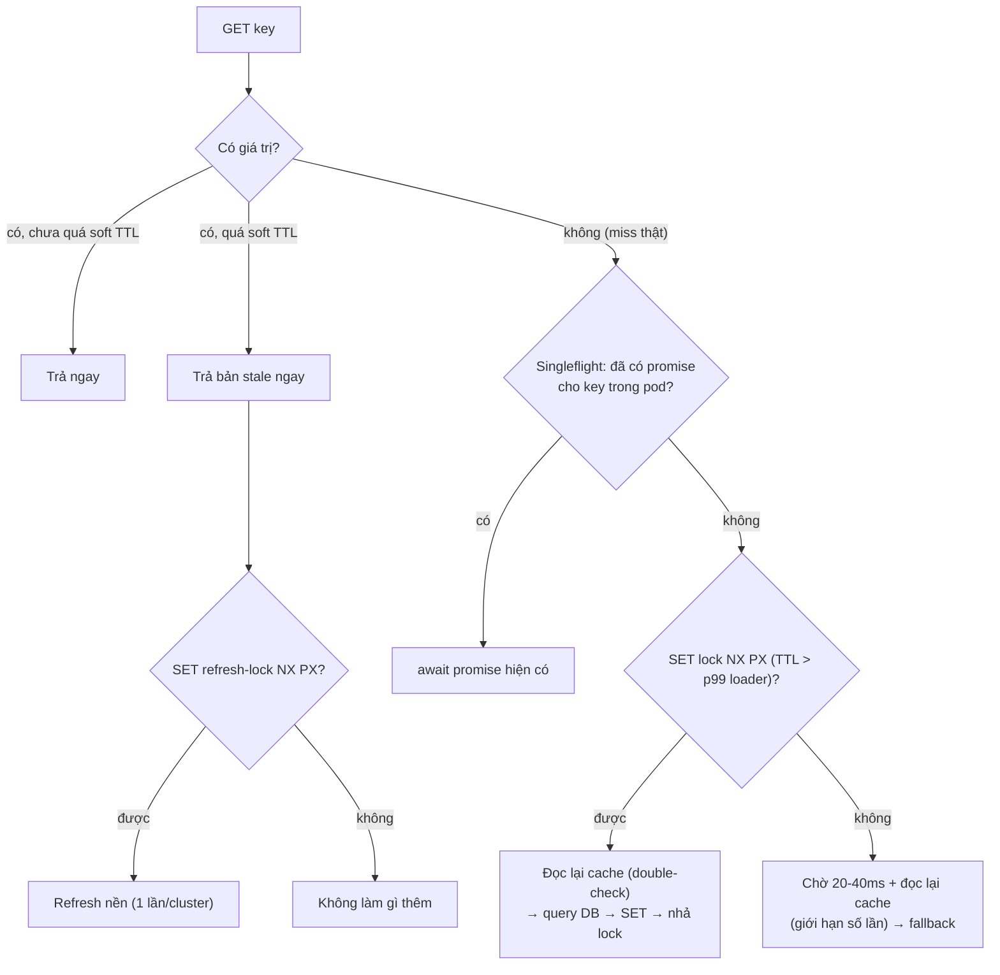

## Bối cảnh & vấn đề

12:00:00, payload trang chủ (banner, sản phẩm nổi bật, khuyến mãi theo tenant) hết TTL. Query dựng nó join sáu bảng và mất 800 ms khi DB rảnh. Trong giây đó có 3.000 request trang chủ từ 20 pod. Mỗi request thấy miss, mỗi request tự chạy query. DB nhận 3.000 query nặng cùng lúc; mỗi query giờ mất 8 giây thay vì 800 ms vì tranh CPU và I/O; connection pool cạn; các endpoint khác bắt đầu timeout; client retry làm tải tăng thêm. Hai phút sau DB CPU vẫn 100%, dù chỉ **một** key hết hạn.

Đây là **cache stampede** (còn gọi thundering herd, dog-piling, hay "cache breakdown" trong một số tài liệu). Điều đáng sợ là nó tự khuếch đại: query càng chậm thì cửa sổ "đang miss" càng dài, càng nhiều request rơi vào cửa sổ đó, query càng chậm hơn. Tăng TTL chỉ dời thời điểm; thêm replica chỉ tăng ngưỡng.

Bài này phân biệt stampede với hai failure mode hay bị nhầm (penetration, avalanche), rồi đi qua các kỹ thuật chống stampede theo thứ tự chi phí: singleflight trong process, distributed lock, stale-while-revalidate, refresh sớm theo xác suất (XFetch). Mỗi kỹ thuật có số đo thật.

## Khái niệm

### Stampede, penetration, avalanche

Ba thuật ngữ này thường bị dùng lẫn lộn, nhưng nguyên nhân và cách chữa khác nhau:

- **Stampede (thundering herd)**: **một** key hot hết hạn (hoặc bị DEL) và nhiều request cùng miss, cùng chạy loader. Chữa bằng coalescing, lock, SWR, refresh sớm.
- **Penetration**: request cho key **không tồn tại** cả trong cache lẫn DB (thường do bot, ID rác). Vì không có gì để cache, mọi request đều đánh DB. Chữa bằng validate input, null caching, Bloom filter ([bài 6](/tracks/caching/learn/penetration-avalanche-warmup)).
- **Avalanche**: **nhiều** key hết hạn cùng lúc (cùng TTL khi warm cache lúc deploy) hoặc cả cache cluster chết. Chữa bằng TTL jitter, HA, multi-level cache, bảo vệ DB ([bài 6](/tracks/caching/learn/penetration-avalanche-warmup), [bài 7](/tracks/caching/learn/multi-level-resilience)).

Khi Redis chết hoàn toàn, avalanche là thứ khó chống nhất: mọi kỹ thuật chống stampede dựa trên Redis (lock, SWR lưu trong Redis) cũng mất theo.

**Interview angle:** trả lời bằng "số lượng key" (một key hot / key không tồn tại / nhiều key) giúp phân biệt rõ ràng trong 20 giây.

### Singleflight (request coalescing) trong process

**Singleflight** đảm bảo trong một process, với mỗi key, chỉ có **một** loader chạy tại một thời điểm; các caller khác cùng key `await` chung promise đó. Trong Node.js, cài bằng `Map<key, Promise>`. Điểm quan trọng nhất là xoá entry trong `finally`, để khi loader lỗi thì lỗi không bị "cache" vĩnh viễn.

```ts
const inflight = new Map<string, Promise<unknown>>();

export function singleflight<T>(key: string, fn: () => Promise<T>): Promise<T> {
  const existing = inflight.get(key);
  if (existing) return existing as Promise<T>;
  const p = fn().finally(() => inflight.delete(key));  // delete on success AND failure
  inflight.set(key, p);
  return p;
}
```

Gotcha: (1) chỉ dedupe **trong một process**: 20 pod thì vẫn tối đa 20 loader; (2) nếu loader treo, mọi caller treo theo, nên loader cần timeout; (3) lỗi lan tới mọi caller cùng lúc (một lỗi thành 3.000 lỗi); (4) key của singleflight phải chứa đủ dimension như key cache (tenant, locale), nếu không caller của tenant B nhận dữ liệu của tenant A; (5) caller không được mutate kết quả dùng chung.

**Interview angle:** interviewer hay hỏi "50 pod chỉ có singleflight thì hot key hết hạn gây bao nhiêu query?" — tối đa 50 (một mỗi pod), không phải 1.

### Distributed lock để rebuild

Để chỉ **một** pod trong cả cluster rebuild, dùng một lock trên Redis: `SET lock:<key> <token> NX PX <ttl>`. Pod lấy được lock thì kiểm tra lại cache (double-check, vì có thể pod khác vừa rebuild xong), chạy loader, set cache, rồi nhả lock bằng Lua compare-and-delete. Pod không lấy được lock thì **chờ ngắn và đọc lại cache**, hoặc trả bản stale / fallback.

TTL của lock phải lớn hơn thời gian loader tối đa (loader 8 giây mà lock 5 giây thì lock hết hạn giữa chừng, pod khác cũng rebuild); pod chờ phải có giới hạn số lần thử và tổng thời gian, nếu không 3.000 request chờ cũng giữ 3.000 connection HTTP. Lock ở đây chỉ vì **efficiency** (tránh làm trùng), nên không cần Redlock hay fencing; hai pod lỡ cùng rebuild chỉ tốn gấp đôi, không sai dữ liệu. Chi tiết lock ở [bài 11](/tracks/caching/learn/distributed-locks).

**Interview angle:** "loader mất 8 giây thì TTL lock và chiến lược chờ thay đổi thế nào?" — TTL lock > p99 loader, và pod chờ nên trả stale thay vì chờ 8 giây.

### Stale-while-revalidate ở tầng app

**Stale-while-revalidate (SWR)** tách hai mốc thời gian: **soft TTL** (sau mốc này dữ liệu "cũ" nhưng vẫn dùng được) và **hard TTL** (TTL thật của key trong Redis, dài hơn). Khi đọc: chưa quá soft thì trả; quá soft nhưng còn hard thì **trả bản cũ ngay** và kích hoạt refresh nền **một lần** (lock `SET NX` hoặc singleflight); hết hard thì là miss thật.

Ưu điểm lớn: user không bao giờ phải chờ loader cho key hot (latency ổn định), và key hot không bao giờ "trống", nên không có stampede. Nhược điểm: user thấy dữ liệu cũ tối đa soft TTL + thời gian refresh, nên không dùng cho giá/tồn kho lúc checkout. Giá trị lưu trong Redis là `{ v, softExp }`, với hard TTL là `EX` của key.

Khác với directive HTTP `stale-while-revalidate` (RFC 5861): directive HTTP do **cache HTTP** (browser, CDN) thực thi dựa trên header response; SWR ở app do **code của bạn** thực thi trên Redis. Ý tưởng giống nhau, nơi thực thi khác nhau ([bài 12](/tracks/caching/learn/http-cdn-caching)).

**Interview angle:** câu trả lời mạnh chỉ ra SWR là cách duy nhất trong nhóm vừa chống stampede vừa giữ latency p99 phẳng.

### Probabilistic early expiration (XFetch)

**XFetch** (Vattani và cộng sự, VLDB 2015) để mỗi request **tự quyết định** refresh sớm với xác suất tăng dần khi gần hết hạn. Điều kiện refresh:

```text
now − delta × beta × ln(rand()) ≥ expiry
```

Trong đó `delta` là thời gian tính lại lần trước (loader mất bao lâu), `beta ≥ 1` điều chỉnh độ "hăng" (mặc định 1), `rand()` ngẫu nhiên trong (0, 1] nên `ln(rand())` âm và `−delta × beta × ln(rand())` là một khoảng thời gian dương ngẫu nhiên. Càng gần `expiry`, càng dễ có một request "trúng". Loader đắt (delta lớn) thì refresh sớm hơn.

Kết quả: không có một thời điểm cả đàn cùng miss; thường chỉ một vài request refresh, không cần lock nên không có điểm lỗi chung. Đổi lại, có thể có vài refresh trùng khi traffic rất lớn, và phải lưu **delta** và **expiry** cạnh giá trị (Redis TTL không cho biết delta).

```ts
function shouldRefresh(expiresAtMs: number, deltaMs: number, beta = 1): boolean {
  return Date.now() - deltaMs * beta * Math.log(Math.random()) >= expiresAtMs;
}
```

**Interview angle:** so với ngưỡng cố định 80% TTL, XFetch không có "vách đá": ở ngưỡng cố định, mọi request sau mốc 80% đều muốn refresh cùng lúc (cần thêm lock).

### TTL jitter

**Jitter** là cộng một lượng ngẫu nhiên vào TTL (`base + random(0..20% base)`). Nó chống việc nhiều key được set cùng lúc cùng hết hạn (avalanche), và gián tiếp giảm stampede cho các key được warm cùng lúc. Nó không giúp gì cho **một** key hot: key đó vẫn hết hạn vào một thời điểm.

**Interview angle:** nhắc jitter như một lớp, không phải giải pháp cho hot key.

## Cơ chế hoạt động

Khi một request gặp miss (hoặc key gần hết hạn), quyết định nên đi theo cây sau. Các lớp chồng lên nhau: singleflight luôn có (rẻ), SWR cho key hot, lock khi loader rất đắt, fallback khi mọi thứ thất bại.



Diễn giải: nhánh trên là SWR; user luôn nhận câu trả lời ngay, và chỉ một pod trong cluster được refresh nhờ lock. Nhánh dưới xử lý miss thật (lần đầu, hoặc sau hard TTL): singleflight gom các request trong cùng pod thành một; giữa các pod, lock bảo đảm chỉ một pod gọi DB, các pod khác poll cache. **Double-check** sau khi lấy lock là bắt buộc, vì pod trước có thể vừa set xong ngay trước khi ta lấy lock. Pod không lấy được lock phải có giới hạn chờ, rồi trả fallback (trang tĩnh, dữ liệu mặc định, 503 có `Retry-After`) thay vì treo.

Tổng số query DB cho một lần hot key hết hạn: không có gì = số request; chỉ singleflight = số pod; singleflight + lock = 1; SWR = 1 và không request nào phải chờ.

## Ví dụ thực tế

### Đo stampede: 5 pod × 200 request, loader 200 ms

Chạy trên Redis 8.10.2 / ioredis 6.0.0 / Node 24. Mỗi "pod" là một client Redis riêng với `Map` singleflight riêng; DB giả lập đếm số query; key trống lúc bắt đầu:

```ts
function makePod(db: FakeDb, mode: "none" | "singleflight" | "singleflight+lock") {
  const redis = new Redis({ port: 6379 });
  const inflight = new Map<string, Promise<unknown>>();
  const sf = (k: string, fn: () => Promise<unknown>) => {
    const ex = inflight.get(k); if (ex) return ex;
    const p = fn().finally(() => inflight.delete(k)); inflight.set(k, p); return p;
  };
  const load = async () => { const v = await db.find("home"); await redis.set(K, JSON.stringify(v), "EX", 60); return v; };
  const loadWithLock = async () => {
    const token = randomUUID();
    for (let i = 0; i < 50; i++) {
      if (await redis.set(`lock:${K}`, token, "PX", 5000, "NX")) {
        try { const again = await redis.get(K); if (again) return JSON.parse(again); return await load(); }
        finally { await redis.eval(RELEASE_LUA, 1, `lock:${K}`, token); }
      }
      await sleep(20 + Math.random() * 20);                  // back off, then re-read
      const v = await redis.get(K); if (v) return JSON.parse(v);
    }
    throw new Error("gave up waiting for lock");
  };
  return async () => {
    const v = await redis.get(K); if (v) return JSON.parse(v);
    if (mode === "none") return load();
    return sf(K, mode === "singleflight" ? load : loadWithLock);
  };
}
```

```text
none               requests=1000 db_queries=1000 wall=268ms
singleflight       requests=1000 db_queries=   5 wall=244ms
singleflight+lock  requests=1000 db_queries=   1 wall=262ms
```

Không bảo vệ: 1.000 request thành 1.000 query. Singleflight: 5 query, đúng bằng số pod. Singleflight + lock: 1 query cho cả cluster. Wall time gần như nhau ở đây vì DB giả lập không bị chậm đi khi tải tăng; với DB thật, dòng đầu tiên là dòng làm DB sập.

### Singleflight và lỗi: vì sao phải xoá trong `finally`

```ts
// flaky loader: first call fails with "DB timeout", later calls succeed
const wave1 = await Promise.allSettled(Array.from({ length: 5 }, () => singleflight("home", flaky)));
const wave2 = await Promise.allSettled(Array.from({ length: 5 }, () => singleflight("home", flaky)));
// buggy variant: delete only on success (.then instead of .finally)
```

```text
wave 1: DB timeout, DB timeout, DB timeout, DB timeout, DB timeout | loader calls = 1
wave 2: ok, ok, ok, ok, ok | loader calls = 2
no-finally call 1 -> DB timeout | loader calls = 1
no-finally call 2 -> DB timeout | loader calls = 1
no-finally call 3 -> DB timeout | loader calls = 1
```

Với `finally`, lỗi lan tới cả 5 caller của đợt đầu (đó là bản chất coalescing), nhưng đợt sau thử lại và thành công. Bản chỉ xoá khi thành công giữ **promise bị reject** trong map mãi mãi: loader không bao giờ được gọi lại, mọi request trả "DB timeout" cho tới khi restart pod.

### Stale-while-revalidate trên Redis

Soft TTL 1 giây, hard TTL 5 giây, loader 300 ms. DB đổi từ v1 sang v2 sau khi soft TTL qua:

```ts
async function swr<T>(key: string, load: () => Promise<T>, softSec = 60, hardSec = 600) {
  const raw = await redis.get(key);
  if (raw) {
    const e = JSON.parse(raw) as { v: T; softExp: number };
    if (Date.now() > e.softExp && (await redis.set(`${key}:lock`, "1", "PX", 10_000, "NX"))) {
      void refresh(key, load, softSec, hardSec)
        .catch((err) => log.warn({ err, key }, "swr refresh failed"))
        .finally(() => redis.del(`${key}:lock`));
    }
    return e.v;                                              // stale or fresh, never waits
  }
  return refresh(key, load, softSec, hardSec);               // true miss: blocking
}
async function refresh<T>(key: string, load: () => Promise<T>, softSec: number, hardSec: number) {
  const v = await load();
  await redis.set(key, JSON.stringify({ v, softExp: Date.now() + softSec * 1000 }), "EX", hardSec);
  return v;
}
```

```text
t=0.3s req1     -> v=1 miss(blocking)  303.3ms db=1
t=0.3s req2     -> v=1 fresh           0.6ms db=1
t=1.4s req3     -> v=1 stale+refresh   2.9ms db=2
t=1.4s req4     -> v=1 stale           2.5ms db=2
t=1.4s req5     -> v=1 stale           2.4ms db=2
t=1.8s req6     -> v=2 fresh           0.8ms db=2
t=8.1s req7     -> v=2 miss(blocking)  303.4ms db=3
```

Chỉ request đầu tiên và request sau hard TTL phải chờ 300 ms. Ba request đồng thời sau soft TTL đều nhận v1 trong khoảng 2–3 ms; chỉ một request kích hoạt refresh (db tăng từ 1 lên 2, không lên 4). 400 ms sau, dữ liệu mới v2 đã có. Trong production nhớ: lock refresh cần token nếu refresh có thể lâu hơn TTL lock, và refresh nền phải có timeout.

### XFetch: refresh xảy ra sớm bao nhiêu

Mô phỏng 10.000 lần một key TTL 60 giây nhận 200 request/giây, mỗi request áp dụng điều kiện XFetch; đo thời điểm refresh sớm đầu tiên:

```text
beta=1 delta=2000ms -> refresh happens this many seconds before expiry: p10=10.35s p50=12.76s p90=16.48s  (never-early=0)
beta=1 delta=200ms -> refresh happens this many seconds before expiry: p10=0.57s p50=0.82s p90=1.19s  (never-early=0)
beta=2 delta=2000ms -> refresh happens this many seconds before expiry: p10=23.36s p50=28.24s p90=35.84s  (never-early=0)
```

Với loader 2 giây, refresh đầu tiên thường xảy ra khoảng 10–16 giây trước khi hết hạn (trung vị 12,8 giây); với loader 200 ms thì chỉ khoảng 0,8 giây trước. Tức XFetch tự thích nghi: loader càng đắt càng refresh sớm. `beta = 2` làm refresh sớm gấp đôi. Trong 10.000 lần chạy không lần nào key hết hạn mà chưa được refresh. Vì traffic càng lớn thì càng sớm có request "trúng", nên với key traffic thấp XFetch có thể không kịp refresh; nhưng key traffic thấp cũng không gây stampede.

### Sự cố đang cháy: hot key hết hạn, DB CPU 100%

Làm theo thứ tự, ưu tiên cầm máu:

1. **Cầm máu**: set lại key thủ công (chạy loader một lần từ một nơi, hoặc set bản mới nhất có được) với TTL dài tạm thời; bật rate limit hoặc load shedding cho endpoint đó; nếu có feature flag, trả phiên bản tĩnh của trang chủ.
2. **Giảm tải DB**: kill các query trùng đang chạy (`pg_stat_activity` + `pg_cancel_backend` cho query cùng fingerprint), giới hạn concurrency ở pool.
3. **Sửa lâu dài**: singleflight + SWR cho key hot (không bao giờ để trống), lock với TTL > p99 loader khi loader đắt, XFetch hoặc refresh-ahead, L1 in-process vài giây ([bài 7](/tracks/caching/learn/multi-level-resilience)), bulkhead cho query nặng.
4. **Phát hiện sớm**: alert theo miss rate của nhóm key hot, và theo số query cùng fingerprint trên DB.

Red flag trong phỏng vấn: chỉ "tăng TTL" (dời sự cố sang lần hết hạn sau) hoặc chỉ "thêm replica" (tăng ngưỡng, không sửa khuếch đại).

## Trade-offs & lựa chọn thay thế

| Kỹ thuật | Query DB / lần hết hạn | User phải chờ? | Phụ thuộc Redis | Độ phức tạp | Hợp khi |
| --- | --- | --- | --- | --- | --- |
| Không gì cả | = số request | Có | Không | 0 | Không bao giờ cho key hot |
| Singleflight (process) | = số pod | Có (1 loader) | Không | Rất thấp | Luôn nên có |
| + Distributed lock | 1 | Có, poll cache | Có | Trung bình | Loader rất đắt, nhiều pod |
| Stale-while-revalidate | 1 (nền) | Không (trừ miss thật) | Có (lock refresh) | Trung bình | Key hot chịu được stale vài giây-phút |
| XFetch | ~1 (vài khi traffic rất lớn) | Không | Không cần lock | Thấp | Key hot, loader đắt, không muốn lock |
| Refresh-ahead theo lịch | Theo lịch | Không | Không | Thấp | Ít key hot biết trước |
| TTL jitter | (chống nhiều key cùng hết) | - | - | Rất thấp | Luôn nên có |

Chọn thế nào: **singleflight + jitter** là mặc định cho mọi cache (rẻ, không phụ thuộc gì). Với key hot chịu được stale (trang chủ, danh mục, cấu hình), thêm **SWR**; đó là thay đổi có tác động lớn nhất vì loại bỏ cả stampede lẫn latency spike. Nếu dữ liệu không được phép stale mà loader đắt, dùng **lock + double-check** và cho request chờ có giới hạn. XFetch là lựa chọn gọn khi không muốn thêm lock và có đo được delta. Tất cả đều nên kết hợp với bảo vệ DB (concurrency limit), vì kỹ thuật chống stampede có thể thất bại (Redis chết, bug).

## Edge cases & failure modes

- **Lock TTL < thời gian loader**: lock hết hạn giữa chừng, pod khác lấy lock và cũng rebuild; loader càng chậm (DB đang quá tải) càng nhiều pod rebuild. TTL lock theo p99.9 loader, hoặc gia hạn (watchdog).
- **Pod giữ lock chết**: không ai rebuild tới khi lock hết TTL; trong lúc đó pod khác poll rồi fallback. TTL lock ngắn vừa đủ, và SWR giảm thiệt hại.
- **Loader treo**: singleflight làm mọi caller treo cùng; luôn có timeout cho loader và cho thời gian chờ.
- **Lỗi bị cache**: singleflight không xoá entry khi lỗi; SWR refresh lỗi rồi ghi đè bằng `null`. Chỉ ghi cache khi loader thành công.
- **DEL key hot khi ghi**: invalidation cũng là một "hết hạn"; key hot bị DEL mỗi lần admin sửa có thể stampede. Với key hot, writer nên ghi giá trị mới (có version) hoặc để SWR xử lý.
- **Redis chết**: lock và SWR lưu trong Redis đều mất; chỉ còn singleflight và L1. Đây là lý do cần bảo vệ DB độc lập với cache ([bài 7](/tracks/caching/learn/multi-level-resilience)).
- **XFetch với đồng hồ lệch**: `expiry` tính bằng đồng hồ server ghi, `now` là đồng hồ server đọc; lệch vài trăm ms thường không sao, lệch nhiều thì refresh quá sớm/muộn.

## Pitfalls

- ❌ "Tăng TTL" là cách chữa stampede → ✅ SWR/lock/XFetch; tăng TTL chỉ dời sự cố.
- ❌ Chỉ singleflight và nghĩ đã hết stampede → ✅ singleflight giới hạn theo pod; nhiều pod cần lock hoặc SWR.
- ❌ Singleflight xoá entry chỉ khi thành công → ✅ xoá trong `finally`; nếu không, lỗi đầu tiên bị giữ vĩnh viễn.
- ❌ Lock không double-check cache sau khi lấy được → ✅ đọc lại cache trước khi query.
- ❌ Pod chờ lock vô hạn → ✅ giới hạn số lần thử, trả stale hoặc fallback.
- ❌ Dùng SWR cho giá lúc checkout → ✅ SWR cho hiển thị; quyết định đọc source of truth.
- ❌ Refresh nền không có timeout và không bắt lỗi → ✅ timeout, log, và không ghi đè cache bằng kết quả lỗi.

## Tóm tắt

- Stampede = một key hot hết hạn, nhiều request cùng chạy loader; khác penetration (key không tồn tại) và avalanche (nhiều key/cả cluster).
- Singleflight trong process: `Map<key, Promise>`, xoá trong `finally`; giảm query xuống bằng số pod.
- Distributed lock `SET NX PX` + double-check: xuống 1 query cho cả cluster; TTL lock > p99 loader; pod chờ có giới hạn.
- SWR: soft TTL + hard TTL, trả stale ngay và refresh nền một lần; latency phẳng, không stampede.
- XFetch: refresh sớm theo xác suất, loader càng đắt càng sớm, không cần lock.
- Jitter chống nhiều key cùng hết hạn, không cứu một key hot.
- Lúc sự cố: cầm máu (set lại key, shed load) trước, sửa lâu dài (SWR, lock, L1, bulkhead) sau, và alert theo miss rate của key hot.
