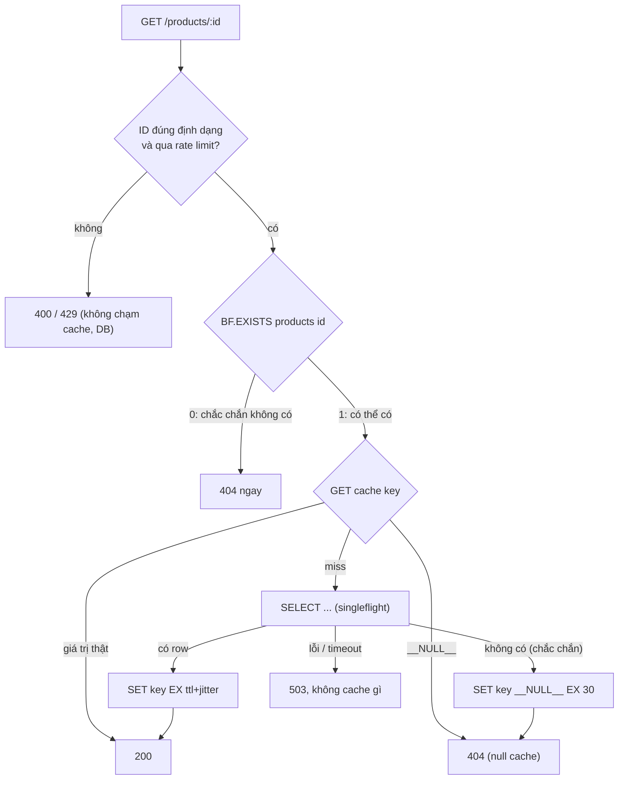

## Bối cảnh & vấn đề

Ba sự cố, ba nguyên nhân khác nhau, cùng một triệu chứng "DB CPU tăng vọt":

1. Một bot cào dữ liệu gọi `GET /products/{id}` với ID tăng dần từ 1 tới 10 triệu, trong khi catalog chỉ có 200.000 sản phẩm. 98% request là ID không tồn tại; cache-aside không cache được "không có gì", nên mọi request đều chạm DB. Đây là **cache penetration**.
2. Team viết một job warm cache lúc deploy: nạp 50.000 sản phẩm phổ biến, tất cả với TTL 1 giờ. Đúng 1 giờ sau mỗi deploy, DB CPU nhảy lên 100% trong vài phút. Đây là **cache avalanche** do TTL đồng loạt.
3. Sau mỗi lần deploy, response time tệ trong 10 phút rồi tự hết. Lý do: pod mới có L1 cache trống, và deploy lần này đổi schema key từ `:v3` sang `:v4`, nên toàn bộ Redis cũng coi như trống. Đây là **cold cache**.

[Bài 5](/tracks/caching/learn/stampede-protection) xử lý một key hot; bài này xử lý ba trường hợp còn lại: key không tồn tại, nhiều key cùng hết hạn, và cache trống hàng loạt.

## Khái niệm

### Cache penetration

**Penetration** xảy ra khi request hỏi một key **không tồn tại trong cả cache lẫn DB**. Cache-aside thông thường chỉ set khi DB trả dữ liệu, nên lần sau vẫn miss, vẫn chạm DB. Nguồn thường gặp: bot/scanner thử ID, link hỏng, client bug gửi ID rỗng hay `-1`, và tấn công có chủ đích (ID ngẫu nhiên để vượt mọi cache).

Ba lớp phòng thủ, từ rẻ tới đắt: **validate input** (ID phải đúng định dạng: UUID, số dương, trong khoảng hợp lệ) chặn phần lớn rác trước khi chạm cache; **null caching**; và **Bloom filter**. Luôn kèm **rate limit** theo IP/tenant/API key, vì attacker có thể tạo ID hợp lệ về định dạng nhưng không tồn tại.

**Interview angle:** nhắc validate input và rate limit trước khi nói Bloom filter cho thấy bạn nghĩ theo lớp, không nhảy vào kỹ thuật "hay".

### Null caching (negative caching)

**Null caching** là khi DB trả "không có", cache một **sentinel** (ví dụ chuỗi `"__NULL__"`) với **TTL ngắn** (30–60 giây). Lần sau, đọc thấy sentinel thì trả 404 mà không chạm DB. Sentinel phải phân biệt được với "miss" (`null` của Redis) và với giá trị thật.

Hai nhược điểm. Thứ nhất, attacker dùng ID **ngẫu nhiên** thì mỗi ID là một sentinel mới: memory tăng theo số ID rác, và hit ratio của sentinel gần 0. Thứ hai, **entity được tạo ngay sau khi bị null-cache**: user vừa tạo sản phẩm, trang chi tiết đã bị ai đó (hoặc chính frontend prefetch) hỏi trước đó, nên 404 kéo dài tới hết TTL sentinel. Cách chữa: đường **create** cũng DEL key (như đường update), và TTL sentinel ngắn.

Null caching khác với **cache kết quả lỗi**: chỉ cache sentinel khi DB trả lời **chắc chắn** là không có; timeout hay lỗi DB thì **không cache gì** ([bài 13](/tracks/caching/learn/keys-multi-tenant) có ví dụ debug trang rỗng 5 phút).

**Interview angle:** follow-up kinh điển là "sản phẩm được tạo ngay sau khi ID bị null-cache, user thấy gì?"

### Bloom filter

**Bloom filter** là một cấu trúc xác suất biểu diễn một tập hợp bằng một mảng m bit và k hàm hash. Thêm phần tử: bật k bit. Kiểm tra: nếu có bit nào tắt thì phần tử **chắc chắn không có** (không bao giờ false negative); nếu mọi bit đều bật thì **có thể có** (false positive với xác suất p). Kích thước tối ưu: `m = −n·ln(p) / (ln 2)²` bit, tức khoảng **9,6 bit mỗi phần tử cho p = 1%**, bất kể phần tử dài bao nhiêu. Nền tảng lý thuyết và cài đặt chi tiết ở [track DSA](/tracks/dsa/learn/probabilistic-sharding).

Dùng cho penetration: nạp mọi ID tồn tại vào filter; request tới thì hỏi filter trước. "Không có" → trả 404 ngay, không chạm cache hay DB. "Có thể có" → đi đường bình thường (1% trong số ID rác lọt qua, xử lý bằng null caching). Nhược điểm: filter chuẩn **không xoá được** phần tử (sản phẩm bị xoá vẫn "có thể có", vô hại vì chỉ tốn một lần DB), filter phải được **nạp đầy đủ** trước khi dùng (thiếu phần tử = false negative = trả 404 cho sản phẩm thật, đây là bug nghiêm trọng), và phải thêm phần tử **khi tạo entity** trước khi entity được đọc. Muốn xoá được: counting Bloom filter hoặc **cuckoo filter**.

Redis 8 có sẵn Bloom filter (trước đây là module RedisBloom): `BF.RESERVE`, `BF.ADD`, `BF.MADD`, `BF.EXISTS`, và cuckoo filter `CF.*` (verify theo bản Redis/managed service bạn dùng; một số dịch vụ managed không bật).

**Interview angle:** câu hỏi xoáy là "Bloom filter có thể trả 404 cho sản phẩm có thật không?" — không, nếu filter được nạp đủ; có, nếu filter bị nạp thiếu hoặc lệch với DB.

### Cache avalanche

**Avalanche** là khi **rất nhiều** key hết hạn trong cùng một khoảng ngắn, hoặc cả tầng cache biến mất (Redis restart không persistence, failover lỗi, flush nhầm). DB nhận gần như toàn bộ traffic đọc cùng lúc. Nguyên nhân phổ biến nhất là do chính ta: warm cache hàng loạt với **cùng TTL**, sync hàng loạt rồi invalidate cùng lúc ([bài 4](/tracks/caching/learn/invalidation-at-scale)), hoặc bump version key khi deploy.

Phòng thủ: **TTL jitter** (`base + random(0..20%·base)`) để trải đều thời điểm hết hạn; **warm có nhịp** (rate limit warmer, không nạp 50.000 key trong 10 giây); **SWR** cho key quan trọng; **multi-level cache** để L1 đỡ một phần khi L2 mất; **HA** cho Redis; và quan trọng nhất là **bảo vệ DB** (concurrency limit, load shedding) để avalanche không thành cascading failure ([bài 7](/tracks/caching/learn/multi-level-resilience)).

Một số tài liệu liệt kê "consistent hashing" như cách chống avalanche. Consistent hashing chỉ giảm số key phải **di chuyển** khi thêm/bớt node cache (khoảng 1/N thay vì gần hết); nó không ngăn key hết hạn cùng lúc và không giúp khi cả cluster chết. Redis Cluster cũng không dùng consistent hashing mà dùng 16.384 hash slot ([bài 10](/tracks/caching/learn/cluster-hot-big-keys)).

**Interview angle:** follow-up "jitter trải đều hạn, nhưng nếu Redis restart mất hết thì sao?" — lúc đó chỉ còn L1, SWR không giúp được, và DB phải được bảo vệ bằng limiter/shedding.

### Cold cache sau deploy

**Cold cache** là cache trống hoặc gần trống khi hệ thống đang nhận traffic. Nguồn: pod mới (L1 in-process trống), Redis restart không có persistence, **đổi version trong key** (`:v3` → `:v4` làm mọi key cũ vô dụng), scale-out đột ngột, hoặc failover sang replica chưa đồng bộ.

Xác nhận bằng số liệu: miss rate theo prefix tăng vọt đúng lúc deploy, DB QPS tăng tương ứng, latency tự hồi phục sau khoảng thời gian bằng thời gian để key hot được nạp lại. Nếu miss rate tăng ở **mọi** prefix cùng lúc sau deploy, nghi ngờ version key đầu tiên.

**Interview angle:** câu "chọn key nào để warm?" nên được trả lời bằng dữ liệu: top-N key theo lượt đọc gần đây (từ metrics/log), không phải "tất cả".

## Cơ chế hoạt động

Luồng đọc có đủ ba lớp chống penetration: validate, Bloom filter, null caching.



Thứ tự này có lý do. Validate và rate limit rẻ nhất và chặn phần lớn rác. Bloom filter chặn các ID hợp lệ về định dạng nhưng không tồn tại, chỉ tốn một lệnh Redis (hoặc 0 nếu filter nằm trong process). Null cache xử lý 1% false positive của filter và các trường hợp filter chưa có. Nhánh lỗi không cache gì, để một sự cố DB 2 giây không thành "sản phẩm không tồn tại" 30 giây. Đường ghi phải đồng bộ với các lớp này: **create** thì `BF.ADD` trước khi trả response và `DEL` key sentinel; **delete** thì DEL key (Bloom filter chuẩn không xoá được, chấp nhận).

Với cold cache khi deploy, luồng nên là: pod mới khởi động → warm top-N key hot vào L1 (đọc từ Redis, không phải DB) trong giới hạn thời gian → mới báo **readiness** → rolling update thay pod từng phần (`maxSurge`/`maxUnavailable` nhỏ) để Redis và DB không nhận toàn bộ traffic lạnh cùng lúc.

## Ví dụ thực tế

### Null caching chống ID rác

Chạy trên Redis 8.10.2 / ioredis 6.0.0; DB giả lập đếm query:

```ts
const NULL = "__NULL__";
async function getProduct(id: string) {
  const k = `t:acme:product:${id}:v1`;
  const raw = await redis.get(k);
  if (raw === NULL) return { value: null, from: "null-cache" };
  if (raw) return { value: JSON.parse(raw), from: "cache" };
  const row = await db.find(id);                     // throws on timeout -> nothing cached
  if (row) await redis.set(k, JSON.stringify(row), "EX", 300);
  else await redis.set(k, NULL, "EX", 30);           // short TTL for "does not exist"
  return { value: row, from: "db" };
}
```

```text
GET /products/-1 -> {"value":null,"from":"db"} db= 1
GET /products/-1 -> {"value":null,"from":"null-cache"} db= 1
GET /products/-1 -> {"value":null,"from":"null-cache"} db= 1
```

Lần đầu chạm DB, hai lần sau trả từ sentinel. Với cùng một ID bị spam, đây là đủ. Với ID ngẫu nhiên, mỗi ID vẫn chạm DB một lần và để lại một sentinel, nên cần lớp tiếp theo.

### Bloom filter: kích thước và false positive đo thật

Cài một Bloom filter nhỏ bằng double hashing trên SHA-256, nạp 1 triệu ID, thử 200.000 ID không tồn tại (Node 24):

```ts
class Bloom {
  m: number; k: number; bits: Uint8Array;
  constructor(n: number, p: number) {
    this.m = Math.ceil(-(n * Math.log(p)) / Math.LN2 ** 2);   // bits
    this.k = Math.round((this.m / n) * Math.LN2);              // hash functions
    this.bits = new Uint8Array(Math.ceil(this.m / 8));
  }
  *idx(s: string) {                                            // h1 + i*h2
    const h = createHash("sha256").update(s).digest();
    const h1 = h.readUInt32BE(0), h2 = (h.readUInt32BE(4) | 1) >>> 0;
    for (let i = 0; i < this.k; i++) yield (h1 + i * h2) % this.m;
  }
  add(s: string) { for (const i of this.idx(s)) this.bits[i >> 3] |= 1 << (i & 7); }
  has(s: string) { for (const i of this.idx(s)) if (!(this.bits[i >> 3] & (1 << (i & 7)))) return false; return true; }
}
```

```text
n=1000000 target p=1% -> m=9585059 bits (1.14 MiB), k=7, bits/key=9.59
false positives: 1939/200000 = 0.97%   false negatives: 0/1000
```

1 triệu ID trong 1,14 MiB, false positive đo được 0,97% (mục tiêu 1%), không có false negative. Một chi tiết đáng kể: phiên bản đầu của đoạn code này có bug `h.readUInt32BE(4) | 1` (phép `|` trong JS trả số **có dấu** 32-bit, nên index có thể âm) và cho **427/1000 false negative**, tức trả 404 cho gần nửa sản phẩm thật. Bloom filter tự cài là chỗ rất dễ sai; hãy dùng thư viện hoặc Redis và luôn có test "mọi phần tử đã thêm đều `has() === true`".

Với Redis 8 (có sẵn Bloom filter):

```text
127.0.0.1:6379> BF.RESERVE bf:products 0.01 1000000
OK
127.0.0.1:6379> BF.MADD bf:products product:1 product:2
1) (integer) 1
2) (integer) 1
127.0.0.1:6379> BF.EXISTS bf:products product:1
(integer) 1
127.0.0.1:6379> BF.EXISTS bf:products product:999999999
(integer) 0
127.0.0.1:6379> MEMORY USAGE bf:products
(integer) 1378600
```

Filter cho 1 triệu phần tử ở 1% chiếm khoảng 1,38 MB (lớn hơn lý thuyết một chút vì metadata và cách làm tròn), cấp phát ngay khi `BF.RESERVE`. So với cache sentinel cho mỗi ID rác (mỗi key vài chục tới hơn trăm byte, không giới hạn số lượng), filter có kích thước cố định. Nếu nạp vượt capacity, Redis tạo thêm sub-filter (expansion) và false positive tổng tăng dần.

### Avalanche: phân bố hạn với và không có jitter

10.000 key được warm trong cùng một giây, TTL gốc 3.600 giây; đếm số key hết hạn theo từng khoảng 60 giây:

```ts
const ttl = (base: number) => base + Math.floor(Math.random() * base * 0.2);
await redis.set(key, value, "EX", ttl(3600));
```

```text
no jitter      : 3600s:10000
jitter 0..+20% : 3600s:853 3660s:829 3720s:846 3780s:812 3840s:860 3900s:810 3960s:858 4020s:843 4080s:847 4140s:819 4200s:802 4260s:821
```

Không jitter: cả 10.000 key hết hạn trong cùng một phút. Có jitter 20%: trải đều thành khoảng 830 key mỗi phút trong 12 phút. Tải DB khi hết hạn giảm khoảng 12 lần ở đỉnh. Jitter chỉ giúp khi key được **tạo** cùng lúc; nó không giúp khi Redis mất toàn bộ dữ liệu.

### Warm có kiểm soát sau deploy

Pod mới chỉ báo ready sau khi nạp top-N key hot vào L1 **từ Redis** (không từ DB), trong ngân sách thời gian:

```ts
let ready = false;
app.get("/readyz", (_req, res) => res.status(ready ? 200 : 503).end());

async function warmL1(topKeys: string[], budgetMs = 5_000) {
  const deadline = Date.now() + budgetMs;
  for (let i = 0; i < topKeys.length && Date.now() < deadline; i += 200) {
    const batch = topKeys.slice(i, i + 200);
    const values = await redis.mget(...batch);           // same slot needed in Cluster: group by slot
    batch.forEach((k, j) => values[j] && l1.set(k, JSON.parse(values[j]!)));
  }
  ready = true;                                          // ready even if budget ran out
}
await warmL1(await loadTopKeysFromMetrics(500));
```

Top-N lấy từ metrics hit theo key/prefix của 24 giờ trước (hoặc một Sorted Set đếm lượt đọc key hot được cập nhật dạng sampling). Không warm từ DB lúc khởi động vì 20 pod cùng khởi động là 20 lần cùng một đợt query.

Với việc đổi version key khi deploy, có hai lựa chọn: chỉ bump version khi **shape thật sự đổi**, và khi bump thì đọc **fallback key cũ** rồi chuyển đổi sang shape mới (lazy migration) trong thời gian chuyển tiếp:

```ts
async function getProductV4(t: string, id: string) {
  const v4 = await redis.get(`shop:${t}:product:${id}:v4`);
  if (v4) return JSON.parse(v4);
  const v3 = await redis.get(`shop:${t}:product:${id}:v3`);           // transition period only
  if (v3) {
    const migrated = migrateV3toV4(JSON.parse(v3));
    await redis.set(`shop:${t}:product:${id}:v4`, JSON.stringify(migrated), "EX", ttl(300));
    return migrated;
  }
  return loadFromDbAndSet(t, id);
}
```

## Trade-offs & lựa chọn thay thế

| Kỹ thuật | Chống | Chi phí | Nhược điểm | Khi nào |
| --- | --- | --- | --- | --- |
| Validate input + rate limit | Penetration (rác, bot) | Rất thấp | Không chặn ID hợp lệ nhưng không tồn tại | Luôn luôn |
| Null caching (TTL ngắn) | Penetration lặp lại cùng ID | Thấp | Memory theo số ID rác, 404 trễ khi entity vừa tạo | ID rác lặp lại |
| Bloom filter | Penetration ID ngẫu nhiên | ~9,6 bit/ID (1%) | Không xoá được, phải nạp đủ và đồng bộ khi tạo | Tập ID lớn, bị quét ngẫu nhiên |
| Cuckoo filter | Như Bloom, xoá được | Tương đương | Có thể đầy, insert fail | Entity bị xoá thường xuyên |
| TTL jitter | Avalanche do cùng TTL | Gần 0 | Không giúp khi cả cache mất | Luôn luôn |
| Warm có nhịp + readiness | Cold cache khi deploy | Thời gian khởi động | Chọn sai key thì vô ích | Có key hot rõ ràng |
| SWR + L1 + bảo vệ DB | Avalanche và cold cache | Trung bình | Stale có kiểm soát | Hệ thống traffic cao |

Chọn thế nào: validate + rate limit + jitter là "vệ sinh" bắt buộc. Null caching đủ cho phần lớn hệ thống bị gọi ID sai lặp lại. Bloom filter chỉ đáng khi bạn **đo** thấy tỉ lệ đáng kể request cho ID không tồn tại **và ngẫu nhiên** (bị quét), và bạn kiểm soát được mọi đường tạo entity để nạp filter. Với avalanche và cold cache, jitter giải quyết nguyên nhân tự gây; phần còn lại (Redis mất dữ liệu) cần bảo vệ DB và L1, không phải thêm kỹ thuật cache.

## Edge cases & failure modes

- **Bloom filter nạp thiếu**: rebuild filter từ DB mất 2 phút; nếu bắt đầu dùng filter trước khi nạp xong thì sản phẩm thật bị 404. Dùng filter mới chỉ sau khi nạp đủ (build vào key tạm rồi `RENAME`).
- **Đường tạo entity không cập nhật filter**: service khác tạo sản phẩm mà không `BF.ADD`; sản phẩm mới 404 cho tới lần rebuild. CDC ([bài 4](/tracks/caching/learn/invalidation-at-scale)) có thể là nơi cập nhật filter.
- **Filter vượt capacity**: false positive tăng dần, lợi ích giảm; theo dõi số phần tử so với capacity.
- **Null cache bị tấn công bằng ID ngẫu nhiên**: memory tăng, eviction đẩy key có ích ra; giới hạn TTL sentinel và dùng Bloom filter hoặc rate limit.
- **Sentinel lẫn với dữ liệu**: dùng chuỗi rỗng làm sentinel, rồi một sản phẩm có mô tả rỗng bị hiểu là "không tồn tại". Dùng sentinel không thể xuất hiện trong JSON hợp lệ.
- **Warm từ DB khi 20 pod cùng khởi động**: bản thân warm-up thành avalanche. Warm từ Redis, hoặc một job warm duy nhất có rate limit.
- **Readiness chờ warm vô hạn**: Redis chậm làm pod không bao giờ ready, deploy kẹt. Warm có budget, hết budget vẫn ready.

## Pitfalls

- ❌ Dựa hoàn toàn vào Bloom filter → ✅ validate + rate limit trước, null cache cho phần lọt qua.
- ❌ Cache sentinel khi DB timeout → ✅ chỉ null-cache khi DB trả lời chắc chắn "không có".
- ❌ Quên DEL sentinel khi tạo entity → ✅ create cũng invalidate như update.
- ❌ Tự cài Bloom filter không test → ✅ dùng thư viện/Redis, test "mọi phần tử đã thêm đều có".
- ❌ Warm 50.000 key với cùng TTL → ✅ jitter + warm có nhịp.
- ❌ Bump version key mỗi deploy → ✅ chỉ khi shape đổi, có fallback đọc key cũ trong giai đoạn chuyển tiếp.
- ❌ Nghĩ consistent hashing chống avalanche → ✅ nó chỉ giảm remap khi đổi số node; chống avalanche là jitter, HA, L1, bảo vệ DB.

## Tóm tắt

- Penetration = key không tồn tại luôn miss; phòng thủ theo lớp: validate + rate limit, Bloom filter, null caching TTL ngắn.
- Null caching chỉ khi DB trả lời chắc chắn; create phải xoá sentinel.
- Bloom filter: không false negative (nếu nạp đủ), ~9,6 bit/phần tử cho 1%; đo thật 0,97% FP với 1,14 MiB cho 1 triệu ID; Redis 8 có `BF.*`.
- Avalanche = nhiều key hết hạn cùng lúc hoặc cache mất hết; jitter trải đều hạn (đo: từ 10.000 key/phút xuống ~830 key/phút).
- Cold cache khi deploy: L1 trống, version key đổi, Redis restart; warm top-N từ Redis trước readiness, rolling update chậm, chỉ bump version khi cần.
- Bảo vệ DB bằng limiter/shedding là lớp cuối cho mọi trường hợp cache không đỡ được.
