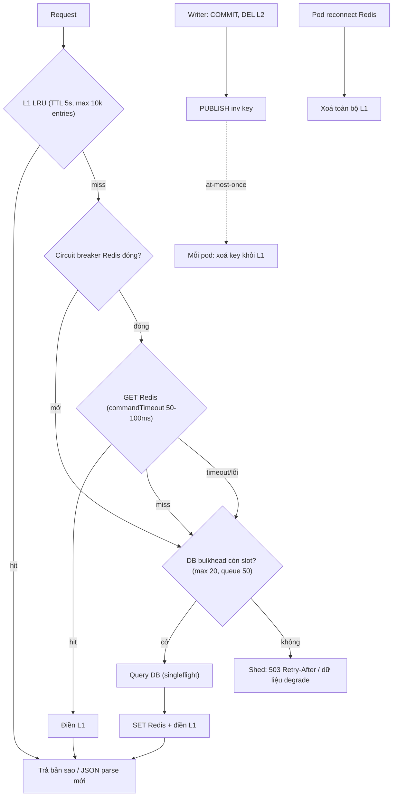

## Bối cảnh & vấn đề

Thứ sáu, 20:00, giờ cao điểm khuyến mãi. Redis primary bị OOM-kill, failover sang replica mất 40 giây. Trong 40 giây đó xảy ra hai điều. Ở service A, mọi request **treo**: client Redis để mặc định, lệnh `GET` nằm trong offline queue chờ reconnect; event loop vẫn sống nhưng mọi request đều chờ, upstream timeout sau 30 giây, client retry, số request đang chờ tăng gấp ba. Ở service B, code có timeout 100 ms và "fail-open": lỗi cache thì đọc DB. Nghe đúng, nhưng 100% traffic đọc chuyển sang DB; DB được thiết kế cho 10% traffic (vì 90% hit cache), nên nó sập sau 15 giây. Khi Redis quay lại, nó trống, và làn sóng miss thứ hai đánh vào DB vừa hồi phục.

Bài học: cache không chỉ là tối ưu hiệu năng; một khi hệ thống đã quen với hit ratio 90%, cache trở thành **thành phần chịu tải** (load-bearing). Thiết kế phải trả lời "khi cache chậm, khi cache chết, khi cache quay lại trống thì sao?".

Bài này đi qua hai chủ đề nối với nhau: (1) cache nhiều tầng, L1 in-process + L2 Redis, và cách giữ L1 không stale quá lâu; (2) hành vi khi Redis chậm/chết: timeout, offline queue, circuit breaker, fail-open/fail-closed, bảo vệ DB.

## Khái niệm

### In-process cache và distributed cache

**In-process cache** (L1) là cache nằm trong heap của chính process Node: một `Map`, hoặc LRU như `lru-cache`. Nhanh nhất có thể (không network, không serialize, đọc trong micro giây), không có dependency ngoài. Nhược điểm: **mỗi replica một bản** nên 20 pod có thể thấy 20 phiên bản khác nhau; mất khi restart/deploy; chiếm heap (tăng GC pressure, nguy cơ OOM nếu không giới hạn); invalidate khó vì phải báo cho từng pod.

**Distributed cache** (L2) là Redis/Memcached dùng chung. Một bản cho mọi pod, sống qua deploy, invalidate một chỗ. Chi phí: một network hop (thường dưới 1 ms trong cùng AZ, hàng chục ms nếu khác region), serialize/deserialize JSON, và là một dependency có thể chậm hoặc chết.

Không có đáp án chung; thực tế thường kết hợp: L1 với **TTL rất ngắn** (vài giây) cho vài key cực hot (config tenant, feature flag, trang chủ), L2 cho phần còn lại. L1 cũng là "phao cứu sinh" khi L2 chết.

**Interview angle:** interviewer thường hỏi "Redis bắt buộc phải có khi nhiều instance?"; câu trả lời cân bằng là không bắt buộc, nhưng in-process thuần thì consistency giữa pod và cold start là vấn đề phải chấp nhận.

### Cache hai tầng L1 + L2

Đọc: L1 → L2 → DB, và khi lấy được ở tầng dưới thì điền ngược lên tầng trên. Ghi: DB commit → DEL L2 → **báo mọi pod** xoá L1. L1 cần: giới hạn **số entry** hoặc **bytes** (không giới hạn là memory leak), TTL ngắn hơn L2 nhiều, và trả **bản sao** hoặc object bất biến cho caller.

Vấn đề mutation: L1 trả về chính object nằm trong cache. Nếu caller sửa object đó (ví dụ "áp giảm giá cho user này" bằng `product.price *= 0.9`), mọi caller sau trên pod đó thấy giá đã bị sửa. Redis không có vấn đề này vì mỗi lần `GET` là một lần parse JSON mới. Cách chữa: `Object.freeze` đệ quy (dev mode), `structuredClone` khi trả ra (tốn CPU), hoặc lưu chuỗi JSON trong L1 và parse mỗi lần đọc.

**Interview angle:** "caller mutate object trả về từ L1 thì bug gì?" là câu gotcha phổ biến; nêu được cả "leak giữa user/tenant" là điểm cộng.

### Giữ L1 không stale: TTL, Pub/Sub, client-side caching

Ba cách, thường kết hợp:

1. **TTL rất ngắn** (1–10 giây): đơn giản nhất, chấp nhận stale tối đa bằng TTL. Với phần lớn dữ liệu hiển thị, đây là đủ.
2. **Broadcast invalidation qua Redis Pub/Sub**: writer `PUBLISH inv <key>`; mỗi pod subscribe và xoá L1. Pub/Sub là **at-most-once**: pod đang mất kết nối lúc publish sẽ không nhận được message và không bao giờ nhận lại. Vì thế vẫn cần TTL L1, và khi pod reconnect nên **xoá toàn bộ L1** (vì không biết đã lỡ gì). Nếu cần không mất message thì dùng Redis Streams hoặc Kafka ([bài 8](/tracks/caching/learn/redis-core)).
3. **Client-side caching của Redis** (từ Redis 6): client bật `CLIENT TRACKING`; server ghi nhớ key mà client đã đọc và **tự đẩy** thông báo invalidation khi key đó bị sửa. Hai chế độ: mặc định (server nhớ từng key từng client đọc, tốn memory phía server) và **broadcasting** (`BCAST` theo prefix, server không nhớ gì nhưng gửi mọi thay đổi trong prefix). Với RESP2, thông báo được **redirect** sang một connection khác đang subscribe kênh `__redis__:invalidate`; với RESP3 thì nhận trên cùng connection. Mỗi key chỉ nhận **một** thông báo cho tới khi client đọc lại nó.

**Interview angle:** câu "invalidate L1 trên 20 pod khi sản phẩm đổi?" nên có ba ý: TTL ngắn làm trần, Pub/Sub để nhanh, và xử lý mất message khi reconnect.

### Timeout, offline queue và retry trong ioredis

Client Redis phổ biến nhất cho Node là **ioredis**. Ba tuỳ chọn quyết định hành vi khi Redis có vấn đề (giá trị mặc định kiểm tra trên ioredis 6.0.0, verify với bản bạn dùng):

- `commandTimeout` (mặc định không có): thời gian tối đa chờ reply của một lệnh. Không đặt thì một Redis **treo** (process bị pause, swap, Lua chạy dài, network black hole) làm lệnh chờ vô hạn.
- `enableOfflineQueue` (mặc định `true`): khi chưa kết nối, lệnh được **xếp hàng** chờ reconnect. Với cache, thường nên tắt để lỗi nhanh; nhưng khi tắt thì lệnh gửi trước khi kết nối xong cũng lỗi ngay (`Stream isn't writeable and enableOfflineQueue options is false`), nên phải chờ sự kiện `ready` lúc khởi động.
- `maxRetriesPerRequest` (mặc định 20): số lần thử lại một lệnh qua các lần reconnect trước khi reject. Với cache nên thấp (0–1). (BullMQ thì ngược lại, yêu cầu `null` cho connection của worker; dùng connection riêng cho cache và cho queue.)

**Interview angle:** nói được "mặc định của client làm request treo khi Redis treo" là dấu hiệu đã gặp sự cố thật.

### Fail-open, fail-closed và circuit breaker

**Fail-open** nghĩa là khi dependency lỗi, bỏ qua nó và tiếp tục (cache lỗi → đọc DB). **Fail-closed** nghĩa là từ chối request (rate limiter lỗi → trả 503). Với **cache thuần**, fail-open là đúng vì DB vẫn là source of truth, nhưng **chỉ khi DB được bảo vệ**. Với dữ liệu mà Redis là **source** (session, lock, rate limit, idempotency key), quyết định theo rủi ro business: rate limiter của API public có thể fail-open (thà cho qua còn hơn chặn toàn bộ khách) nhưng rate limiter chống brute-force login nên fail-closed hoặc chuyển sang limiter in-process dự phòng.

**Circuit breaker** theo dõi tỉ lệ lỗi/timeout khi gọi Redis; vượt ngưỡng thì **mở** (không gọi Redis nữa trong một khoảng, trả lỗi ngay), sau đó **half-open** thử một vài request để xem Redis đã ổn chưa. Lợi ích: không lãng phí 100 ms timeout cho mỗi request khi biết chắc Redis đang chết.

**Bulkhead** (concurrency limit) trước DB giới hạn số query đồng thời; request vượt quá thì xếp hàng có giới hạn rồi bị **shed** (503 nhanh, hoặc trả dữ liệu degrade). Đây là lớp ngăn "cache chết" biến thành "DB chết".

**Interview angle:** câu follow-up quen thuộc là "rate limiter dựa trên Redis, Redis chết, fail open hay closed?" — không có đáp án chung; nêu tiêu chí rủi ro và phương án dự phòng.

## Cơ chế hoạt động

Luồng đọc hai tầng, với invalidation broadcast và các điểm bảo vệ:



Diễn giải: L1 đỡ phần lớn đọc cho key cực hot và vẫn phục vụ được khi Redis chết (trong giới hạn TTL). Circuit breaker cắt các lần chờ timeout vô ích khi Redis đã chết. **Mọi** đường tới DB (miss thật, lỗi Redis, breaker mở) đều đi qua bulkhead, nên DB không bao giờ nhận quá số query nó chịu được; phần vượt bị shed nhanh thay vì làm mọi thứ chậm. Phía ghi: DEL L2 và publish; mỗi pod xoá L1. Vì Pub/Sub có thể mất message, pod xoá toàn bộ L1 khi reconnect, và TTL L1 là trần cho mọi trường hợp còn lại.

Khi Redis quay lại sau sự cố, nó có thể trống (không persistence) hoặc thiếu dữ liệu: đó là một đợt cold cache ([bài 6](/tracks/caching/learn/penetration-avalanche-warmup)). Bulkhead tiếp tục bảo vệ DB trong lúc cache được nạp lại; breaker half-open giúp tăng dần traffic tới Redis thay vì dồn toàn bộ ngay.

## Ví dụ thực tế

### ioredis khi Redis treo và khi Redis chết (đo thật)

Chạy trên Redis 8.10.2 trong Docker, ioredis 6.0.0, Node 24. `docker pause` mô phỏng Redis treo (TCP vẫn mở nhưng không có reply); `docker stop` mô phỏng Redis chết (connection refused). Ba cấu hình client:

```ts
const clients = {
  "default options": new Redis({ port }),
  "commandTimeout 100ms": new Redis({ port, commandTimeout: 100, maxRetriesPerRequest: 1 }),
  "timeout + no offline queue": new Redis({ port, commandTimeout: 100, maxRetriesPerRequest: 1, enableOfflineQueue: false }),
};
// probe: GET k, capped at 5s by Promise.race
```

```text
Redis healthy:
  default options                  1ms  value=v
  commandTimeout 100ms             1ms  value=v
  timeout + no offline queue       1ms  value=v
Redis paused (hung, e.g. long Lua / swap / network black hole):
  default options               5001ms  still pending after 5000ms
  commandTimeout 100ms           101ms  error: Command timed out
  timeout + no offline queue     102ms  error: Command timed out
Redis stopped (connection refused):
  default options               5001ms  still pending after 5000ms
  commandTimeout 100ms           101ms  error: Command timed out
  timeout + no offline queue       0ms  error: Stream isn't writeable and enableOfflineQueue options is false
```

Với cấu hình mặc định, cả khi Redis treo lẫn khi chết, lệnh `GET` vẫn **chưa trả lời sau 5 giây**: request của bạn treo theo. `commandTimeout` biến cả hai trường hợp thành lỗi sau 100 ms. Tắt offline queue làm trường hợp Redis chết lỗi **ngay lập tức** (0 ms), nhưng nhớ chờ `ready` lúc khởi động (lần chạy đầu của script này crash chính vì gửi lệnh trước khi kết nối xong).

### L1 + L2 với invalidation qua Pub/Sub, và bug mutation

Ba "pod", mỗi pod có L1 (LRU trên `Map`, TTL 5 giây) và một subscriber kênh `inv`:

```ts
async function get(key: string) {
  const a = l1.get(key); if (a) return { v: a, from: "L1" };
  const b = await redis.get(key); if (b) { const v = JSON.parse(b); l1.set(key, v); return { v, from: "L2" }; }
  const v = await loadFromDb(); await redis.set(key, JSON.stringify(v), "EX", 300); l1.set(key, v);
  return { v, from: "DB" };
}
sub.on("message", (_ch, key) => l1.del(key));
// writer: UPDATE price=45 -> DEL key -> PUBLISH inv key
```

```text
pod-a price=49 from=DB
pod-b price=49 from=L2
pod-c price=49 from=L2
pod-a price=49 from=L1
pod-b price=49 from=L1
pod-c price=49 from=L1
writer: UPDATE price=45, DEL L2, PUBLISH inv
  pod-b: L1 invalidated t:acme:product:42:v1
  pod-a: L1 invalidated t:acme:product:42:v1
  pod-c: L1 invalidated t:acme:product:42:v1
pod-a price=45 from=DB
pod-b price=45 from=L2
pod-c price=45 from=L2
db reads total = 2
next caller on pod-a sees price=40.5 from=L1  <- leaked mutation
```

Sáu lần đọc đầu chỉ tốn 1 lần DB; sau khi publish, cả ba pod xoá L1 và đọc giá mới, tổng cộng chỉ 2 lần DB. Dòng cuối là bug mutation: một caller "áp giảm giá 10%" bằng cách sửa trực tiếp object trả về (`r.v.price *= 0.9`), và caller tiếp theo trên cùng pod thấy giá 40,5. Nếu phần giảm giá đó là riêng cho một user hay một tenant, đây là rò dữ liệu. Sửa bằng cách lưu chuỗi JSON trong L1 (parse mỗi lần), hoặc `structuredClone` khi trả ra, hoặc freeze object.

Hành vi mất message của Pub/Sub được đo ở [bài 8](/tracks/caching/learn/redis-core): pod mất kết nối lúc publish nhận 0 message và không bao giờ nhận lại.

### Client-side caching: server tự đẩy invalidation

Redis 8.10.2, chế độ RESP2 redirect: một connection subscribe `__redis__:invalidate`, connection đọc dữ liệu bật tracking và redirect thông báo sang connection đó:

```ts
// raw socket: CLIENT ID, SUBSCRIBE __redis__:invalidate  -> id 1086
await data.call("CLIENT", "TRACKING", "ON", "REDIRECT", invId);
await writer.set("config:global", "v1");
await data.get("config:global");            // now tracked: safe to keep in L1
await writer.set("config:global", "v2");    // server pushes invalidation
await writer.set("config:global", "v3");    // no push: key not re-read since last push
```

```text
CLIENT TRACKING ON REDIRECT 1086 -> OK
pod GET config:global = v1
push after SET v2: "*3 $7 message $20 __redis__:invalidate *1 $13 config:global"
push after SET v3 (key not re-read): ""
```

Sau khi pod đọc `config:global`, lần `SET v2` từ client khác làm server đẩy một message chứa tên key. Lần `SET v3` không có message, vì server chỉ báo **một lần** cho tới khi client đọc lại key (lúc đó L1 đã xoá key nên việc đọc lại là tự nhiên). Chúng tôi dùng raw socket cho connection nhận vì trong lần chạy này, subscriber của ioredis không phát sự kiện `message` cho payload dạng mảng của kênh invalidate (verify với client bạn dùng; node-redis v4+ có hỗ trợ client-side caching với RESP3).

### Redis sập giờ cao điểm: timeout, breaker và bulkhead

Mô phỏng Redis đã chết (mỗi lệnh timeout sau 100 ms), 500 request trong 1 giây, DB query 50 ms. So sánh ba mức bảo vệ:

```text
timeout only (fail-open)         ok=500 shed=0 peak_concurrent_db=27 p50=150ms p99=152ms
timeout + breaker                ok=500 shed=0 peak_concurrent_db=53 p50=50ms p99=151ms
timeout + breaker + DB bulkhead  ok=410 shed=90 peak_concurrent_db=20 p50=159ms p99=270ms
```

Chỉ timeout: mỗi request tốn 100 ms chờ Redis rồi mới đọc DB. Thêm breaker: sau 5 lỗi, breaker mở và request đi thẳng DB, p50 giảm từ 150 ms xuống 50 ms, nhưng **số query DB đồng thời tăng gấp đôi** (53 so với 27), vì request tới DB nhanh hơn. Đây là điểm nhiều người bỏ qua: breaker làm cache "biến mất" nhanh hơn, và DB nhận toàn bộ lực. Thêm bulkhead (tối đa 20 query đồng thời, hàng đợi 50): DB không bao giờ quá 20, 90 request bị shed nhanh. Trong mô phỏng, DB giả không chậm đi khi tải tăng nên shed trông như thiệt hại; với DB thật có capacity giới hạn, không có bulkhead nghĩa là DB quá tải và **mọi** request (kể cả của endpoint không liên quan tới cache) đều chậm hoặc lỗi.

Checklist cho kịch bản Redis sập giờ cao điểm:

- Trước sự cố: HA (replica + Sentinel/Cluster/managed Multi-AZ), timeout + breaker quanh Redis, bulkhead + load shedding trước DB, L1 cho key cực hot, degrade tính năng (ẩn recommendation, trang chủ tĩnh), và **capacity plan**: DB chịu được bao nhiêu phần trăm traffic "cache lạnh" trong bao lâu.
- Trong sự cố: bật degrade mode, tăng shed, không để client retry vô hạn (retry budget, backoff có jitter).
- Sau sự cố: nạp lại cache có kiểm soát (warm top-N, SWR), breaker half-open tăng dần; review vì sao Redis chết (OOM? big key? `KEYS`?).
- Kiểm thử trước: load test với Redis bị tắt (chaos), đo DB chịu được tới đâu và shed có hoạt động không.

## Trade-offs & lựa chọn thay thế

| Tiêu chí | In-process L1 | Redis L2 | L1 + L2 |
| --- | --- | --- | --- |
| Latency đọc | Micro giây | ~0,3–1 ms (cùng AZ) | Micro giây với key hot |
| Nhất quán giữa pod | Kém (mỗi pod một bản) | Tốt (một bản) | Stale L1 ≤ TTL L1 |
| Sống qua deploy/restart | Không | Có | L2 có |
| Invalidate | Khó (phải báo từng pod) | Một chỗ | DEL L2 + broadcast |
| Memory | Heap Node, GC pressure | Instance riêng | Cả hai, L1 phải giới hạn |
| Khi Redis chết | Không ảnh hưởng | Mất cache | L1 đỡ key hot trong TTL |

| Hành vi khi dependency lỗi | Hợp với | Rủi ro |
| --- | --- | --- |
| Fail-open (bỏ qua, đọc DB) | Cache thuần | DB nhận 100% traffic, cần bulkhead |
| Fail-closed (503) | Rate limit chống abuse, lock cho correctness | Mất availability |
| Fallback dự phòng (limiter in-process, dữ liệu mặc định) | Session không quan trọng, feature flag | Hành vi khác nhau giữa pod |

Chọn thế nào: bắt đầu với **Redis L2** cho dữ liệu dùng chung; thêm **L1** chỉ cho một số key được đo là cực hot hoặc cực quan trọng khi Redis chết (config tenant, feature flag), với TTL vài giây và giới hạn size. Luôn có timeout + breaker quanh Redis; fail-open cho cache thuần **kèm** bulkhead trước DB; với Redis làm source (rate limit, session, lock), quyết định fail-open/closed theo rủi ro và ghi thành tài liệu.

## Edge cases & failure modes

- **L1 không giới hạn**: mỗi tenant, mỗi locale một key; heap tăng tới OOM, hoặc GC pause dài làm latency spike. Giới hạn theo số entry và bytes.
- **Pub/Sub mất message khi reconnect**: pod giữ L1 cũ tới hết TTL L1; xoá toàn bộ L1 khi reconnect.
- **Invalidation storm**: sync hàng loạt publish 100.000 message; mọi pod xử lý 100.000 lần xoá, event loop bận. Gom theo batch hoặc publish theo namespace.
- **Client tracking tốn memory server**: chế độ mặc định, Redis nhớ key cho mỗi client; nhiều client đọc nhiều key làm bảng tracking lớn (có giới hạn `tracking-table-max-keys`). Cân nhắc chế độ `BCAST` theo prefix.
- **Breaker mở vì lỗi của chính app**: serialize lỗi đếm như lỗi Redis, breaker mở vô cớ. Chỉ đếm lỗi network/timeout.
- **Retry storm**: client retry + ioredis retry + HTTP client retry nhân lên; đặt retry ở một tầng, có budget.
- **Redis quay lại trống**: đợt miss thứ hai; bulkhead và SWR vẫn phải hoạt động.
- **Hai loại connection chung một client**: cache (cần fail nhanh) và BullMQ worker (cần retry vô hạn) dùng chung cấu hình, một trong hai sai.

## Pitfalls

- ❌ Dùng client Redis với cấu hình mặc định cho cache → ✅ `commandTimeout` ngắn, `maxRetriesPerRequest` thấp, cân nhắc tắt offline queue.
- ❌ Fail-open mà không bảo vệ DB → ✅ bulkhead + load shedding, capacity plan cho traffic cache lạnh.
- ❌ L1 trả object dùng chung cho caller → ✅ trả bản sao hoặc lưu JSON string, freeze trong dev.
- ❌ Chỉ dựa vào Pub/Sub để invalidate L1 → ✅ TTL L1 ngắn làm trần, xoá toàn bộ L1 khi reconnect.
- ❌ L1 không giới hạn size → ✅ LRU có max entries/bytes, đo heap.
- ❌ Một quyết định fail-open/closed cho mọi thứ → ✅ theo từng loại dữ liệu và rủi ro business.
- ❌ Chưa từng test "Redis chết" → ✅ chaos/load test với Redis tắt trước khi production làm hộ.

## Tóm tắt

- L1 in-process nhanh nhất nhưng mỗi pod một bản, mất khi restart, tốn heap; L2 Redis dùng chung, tốn một hop, là dependency có thể chết.
- L1 + L2: L1 TTL vài giây, giới hạn size, trả bản sao; invalidate bằng TTL + Pub/Sub (at-most-once) hoặc client-side caching (`CLIENT TRACKING`).
- ioredis mặc định (không `commandTimeout`, offline queue bật, 20 retry) làm request treo khi Redis treo/chết; đo thật: >5 giây so với 100 ms.
- Circuit breaker cắt thời gian chờ vô ích nhưng đẩy tải sang DB nhanh hơn; bulkhead trước DB là lớp bắt buộc.
- Fail-open cho cache thuần; với Redis làm source (rate limit, session, lock) quyết định theo rủi ro.
- Redis sập giờ cao điểm: HA, timeout, breaker, bulkhead, L1, degrade, và nạp lại có kiểm soát khi Redis quay lại.
