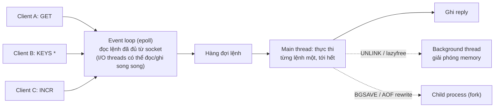
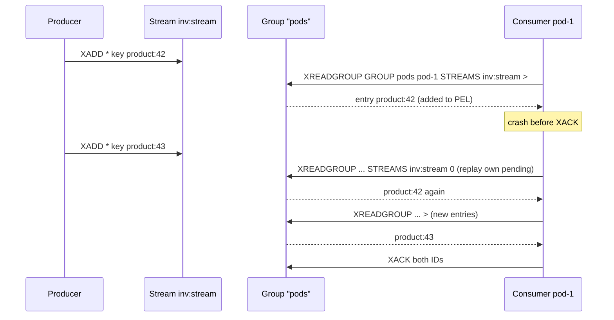

## Bối cảnh & vấn đề

Một endpoint admin "xoá cache của tenant" chạy `KEYS shop:acme:*` trên Redis production có 1 triệu key. Lệnh mất 170 ms. Trong 170 ms đó, **mọi** client khác của Redis, gồm cả API đọc cache, rate limiter, session, đều đứng chờ. Một tuần sau, ai đó viết Lua script dọn dữ liệu chạy 5 giây và Redis trả `BUSY` cho toàn bộ hệ thống. Cả hai sự cố đến từ một thuộc tính mà ai dùng Redis cũng từng nghe nhưng ít người rút ra hệ quả: **Redis thực thi lệnh trên một luồng**.

Cùng thuộc tính đó lại là lý do Redis mạnh: vì lệnh chạy tuần tự, một Lua script là **atomic** tự nhiên, `INCR` không cần lock, rate limiter hay reservation tồn kho viết được trong vài dòng. Hiểu single-thread vừa giúp tránh sự cố vừa giúp thiết kế đúng.

Bài này đi qua: mô hình thực thi của Redis, các cấu trúc dữ liệu và việc chúng làm tốt, atomicity (Lua, MULTI/EXEC), hai cơ chế messaging (Pub/Sub, Streams), và câu hỏi "Redis hay Memcached (hay Valkey)?". Memory/eviction/persistence ở [bài 9](/tracks/caching/learn/memory-eviction-persistence), Cluster ở [bài 10](/tracks/caching/learn/cluster-hot-big-keys).

## Khái niệm

### Vì sao Redis nhanh dù single-threaded

Redis nhanh vì bốn lý do. Dữ liệu nằm trong **RAM**. Cấu trúc dữ liệu được tối ưu cho từng kích thước (hash nhỏ lưu dạng `listpack` liền mạch, lớn thì chuyển sang hash table). Nó dùng **I/O multiplexing** (epoll/kqueue): một event loop phục vụ hàng nghìn socket mà không cần một thread cho mỗi connection. Và vì **không có lock**, không tốn chi phí đồng bộ hoá giữa các thread. Phần lớn lệnh là O(1) hoặc O(log N) và mất vài micro giây; giới hạn thực tế thường là network, không phải CPU.

Từ Redis 6.0 có **I/O threads** để đọc socket và ghi reply song song (tắt mặc định, `io-threads 1`), nhưng **việc thực thi lệnh vẫn tuần tự** trên main thread. Một số việc nặng được đẩy ra background thread: giải phóng memory của key lớn (`UNLINK`, lazyfree), fsync AOF, và fork cho RDB là process riêng.

**Interview angle:** câu trả lời mạnh không dừng ở "vì dùng RAM" mà nêu hệ quả: một lệnh chậm block mọi client.

### Hệ quả của single thread: lệnh O(N) block mọi client

Vì lệnh chạy lần lượt, một lệnh mất 200 ms nghĩa là **mọi** lệnh khác xếp hàng sau nó 200 ms. Các thủ phạm quen thuộc: `KEYS pattern` (quét toàn keyspace), `HGETALL`/`SMEMBERS`/`LRANGE 0 -1` trên collection lớn, `DEL` một big key (giải phóng hàng triệu phần tử đồng bộ), `FLUSHALL` đồng bộ, `SORT`, và **Lua script chạy lâu**. Script vượt `busy-reply-threshold` (mặc định 5 giây) làm Redis trả `BUSY` cho các client khác; chỉ còn `SCRIPT KILL` (nếu script chưa ghi gì) hoặc `SHUTDOWN NOSAVE`.

Cách dùng đúng: `SCAN`/`HSCAN`/`SSCAN`/`ZSCAN` thay cho lệnh lấy toàn bộ; `UNLINK` thay `DEL` cho key lớn; giới hạn kích thước value và collection; **pipeline** để gộp nhiều lệnh nhỏ vào một round-trip. Muốn scale CPU thì thêm shard (Cluster), không phải thêm core cho một instance. Công cụ tìm thủ phạm: `SLOWLOG GET` (lệnh chậm hơn `slowlog-log-slower-than`, mặc định 10 ms), `LATENCY DOCTOR`, `redis-cli --latency`, `INFO commandstats`.

**Interview angle:** follow-up "tìm lệnh gây latency spike thế nào?" — SLOWLOG, LATENCY DOCTOR, commandstats; và nhớ SLOWLOG chỉ đo thời gian thực thi, không đo thời gian chờ trong hàng.

### Cấu trúc dữ liệu và use case

- **String**: giá trị nhị phân tới 512 MB (nhưng nên nhỏ). Cache JSON, counter (`INCR`, `INCRBY`), lock (`SET k v NX PX`), idempotency key.
- **Hash**: object nhiều field (`HSET user:1 name ... plan ...`), đọc/sửa từng field. Từ Redis 7.4 có TTL theo **field** (`HEXPIRE`, `HTTL`), hữu ích cho giỏ hàng có item hết hạn.
- **List**: queue đơn giản (`LPUSH` + `BRPOP`), danh sách gần đây có giới hạn (`LPUSH` + `LTRIM`).
- **Set**: tag, membership, tập user đã thực hiện hành động (nhỏ); phép giao/hợp.
- **Sorted Set (ZSet)**: phần tử có score, sắp xếp sẵn: leaderboard, sliding-window rate limiter (score = timestamp), delay queue (score = thời điểm chạy), top-N.
- **Stream**: log append-only có ID tăng dần, consumer group, ack: event nhẹ, job queue có at-least-once.
- **HyperLogLog**: đếm phần tử phân biệt xấp xỉ với tối đa ~12 KB mỗi key (sai số chuẩn 0,81%): unique visitor.
- **Bitmap**: một bit mỗi user id: feature flag theo user, điểm danh hàng ngày.
- **Geo**: toạ độ, tìm trong bán kính.
- **Bloom/Cuckoo filter, JSON, time series**: có sẵn trong Redis 8 (trước đây là module) (verify với bản/managed service bạn dùng).

**Interview angle:** câu hỏi thực tế thường là "cài sliding-window rate limiter bằng sorted set, lệnh nào và vì sao phải atomic?" (xem Ví dụ).

### Atomicity: Lua, Functions, MULTI/EXEC/WATCH

Vì thực thi đơn luồng, **mọi lệnh đơn lẻ đều atomic**. Khi cần nhiều bước:

- **MULTI/EXEC**: queue các lệnh rồi chạy liền một khối, không lệnh client khác chen vào. Nhưng lệnh trong khối không thấy kết quả của nhau lúc queue, nên **không rẽ nhánh được** theo giá trị đọc. Muốn điều kiện thì `WATCH key` trước `MULTI`: nếu key bị đổi trước `EXEC`, transaction bị huỷ (trả `nil`) và app phải **retry** (optimistic). Cũng lưu ý: Redis **không rollback**; lệnh lỗi runtime trong khối vẫn để các lệnh khác chạy.
- **Lua script (`EVAL`/`EVALSHA`)** và **Functions** (từ Redis 7, lưu script như thư viện có tên trên server): chạy logic có điều kiện, đọc-rồi-ghi trong một bước, một round-trip. Dùng cho: compare-and-delete lock, rate limiter, set-if-newer-version, reserve tồn kho. Mọi key phải truyền qua `KEYS[]` (Cluster cần để route, và mọi key phải cùng slot).

Giá của Lua: script dài block instance; lỗi logic trong script khó debug; và script phải deterministic với replication (từ Redis 5 replication theo **effects** nên ràng buộc lỏng hơn).

**Interview angle:** "khi nào Lua thay vì MULTI/EXEC?" — khi bước sau phụ thuộc giá trị bước trước; và nêu cái giá "script dài block tất cả".

### Pub/Sub: fire-and-forget

**Pub/Sub**: `PUBLISH channel msg` gửi tới mọi connection đang `SUBSCRIBE` kênh đó **ngay lúc đó**. Không lưu trữ, không ack, không replay: **at-most-once**. Subscriber offline hoặc đứt kết nối thì mất message. Lệnh `PUBLISH` trả về số subscriber đã nhận. Trong Cluster, Pub/Sub thường **broadcast qua mọi node** (tốn bandwidth cluster bus); Redis 7.0 thêm **sharded Pub/Sub** (`SPUBLISH`/`SSUBSCRIBE`) gắn kênh vào slot.

Hợp với: broadcast invalidation L1 (mất một message thì TTL L1 cứu, [bài 7](/tracks/caching/learn/multi-level-resilience)), thông báo realtime không quan trọng.

### Streams: log bền với consumer group

**Stream** là một log append-only: `XADD` thêm entry với ID tăng dần (`<ms>-<seq>`). **Consumer group** chia entry cho các consumer; mỗi entry giao cho một consumer vào **Pending Entries List (PEL)** tới khi consumer gọi `XACK`. Consumer chết thì entry nằm trong PEL; khi quay lại nó đọc lại pending của mình (`XREADGROUP ... 0`), hoặc consumer khác lấy qua `XAUTOCLAIM`/`XCLAIM` sau một thời gian idle. Đây là **at-least-once**: có thể xử lý trùng, nên consumer phải idempotent. Stream cần được **trim** (`XADD ... MAXLEN ~ N` hoặc `XTRIM`) nếu không sẽ tăng mãi.

Cả Pub/Sub lẫn Streams đều không thay được Kafka khi cần retention dài (ngày/tuần), throughput rất cao, partition có ordering theo key, nhiều team/consumer độc lập, và replay lịch sử ([track Messaging](/tracks/messaging-kafka)).

**Interview angle:** "pod reconnect sau network blip, nó lỡ những invalidation nào?" — với Pub/Sub là mọi message trong lúc mất kết nối, và không cách nào biết; với Streams thì đọc lại từ ID cuối cùng đã xử lý.

### Redis, Memcached, Valkey

**Memcached** chỉ có key → blob, lệnh get/set/add/replace/incr/delete/cas, **đa luồng** (scale theo core trên một máy), bộ nhớ quản lý bằng **slab allocator** với LRU theo slab class, không persistence, không replication tích hợp (client tự shard bằng consistent hashing), item tối đa 1 MB mặc định. Vận hành rất đơn giản, hiệu quả memory tốt cho blob.

**Redis** có cấu trúc dữ liệu, lệnh atomic phong phú, Lua/Functions, TTL theo key (và theo field từ 7.4), replication + Sentinel + Cluster, persistence, Pub/Sub, Streams. Đổi lại cần tuning eviction/persistence và hiểu single-thread.

**License**: Redis đổi license nhiều lần. Từ 7.4 (2024) chuyển sang dual RSALv2/SSPLv1 (source-available); từ **8.0** (2025) thêm **AGPLv3** làm một lựa chọn. Phản ứng lại thay đổi 2024, **Valkey** ra đời: fork BSD từ Redis 7.2.4, do Linux Foundation quản lý, được các cloud lớn dùng cho dịch vụ managed (ElastiCache, MemoryDB có Valkey) (verify theo thời điểm). Với phần lớn app, API tương thích; khác biệt nằm ở tính năng mới và license.

**Interview angle:** câu hay gặp "team đang dùng Memcached, tính năng nào buộc bạn thêm Redis?" — atomic op có điều kiện (lock, rate limit, reservation), cấu trúc dữ liệu (sorted set leaderboard), persistence/replication, streams.

## Cơ chế hoạt động

Mô hình thực thi của Redis có thể hình dung như một vòng lặp duy nhất nhận lệnh từ mọi socket và chạy chúng lần lượt:



Vì bước "thực thi" là một luồng duy nhất, lệnh `KEYS *` của client B chạy tới hết rồi mới tới `INCR` của client C, dù `INCR` chỉ mất 1 micro giây. Đó cũng là lý do Lua atomic: script là một "lệnh" duy nhất trong hàng đợi. Các thao tác nặng được đẩy ra ngoài main thread (giải phóng memory của key lớn, tạo snapshot) chính là cách Redis tránh block; muốn tận dụng thì phải gọi đúng lệnh (`UNLINK`, `FLUSHALL ASYNC`) hoặc bật cấu hình lazyfree.

Luồng của một Stream với consumer group, và điều gì xảy ra khi consumer chết trước khi ack:



## Ví dụ thực tế

### KEYS so với SCAN trên 1 triệu key, và Lua chạy dài

Redis 8.10.2 (Docker), 1 triệu key `shop:acme:product:<i>`:

```bash
redis-cli KEYS "shop:acme:product:99999*" | wc -l      # 11 keys found
# KEYS took 175 ms  (SLOWLOG: 169889 microseconds)
# SCAN 0 MATCH "shop:acme:product:99999*" COUNT 1000, looped until cursor 0:
# SCAN loop: 1000 calls, 2445 ms total (each call short)
```

```text
127.0.0.1:6379> SLOWLOG GET 1
1) 1) (integer) 2
   2) (integer) 1790736974
   3) (integer) 169889
   4) 1) "KEYS"
      2) "shop:acme:product:99999*"
```

`KEYS` block Redis 170 ms trong **một** lệnh. `SCAN` tốn tổng thời gian dài hơn (2,4 giây, phần lớn là round-trip của 1.000 lệnh từ shell) nhưng mỗi lệnh chỉ quét khoảng 1.000 slot rồi nhả, nên client khác xen vào được. Script Lua chạy dài còn tệ hơn:

```ts
const slow = a.eval("local x=0 for i=1,3000000000 do x=x+1 end return x", 0);
await b.ping();                     // another client
await admin.call("SCRIPT", "KILL"); // script has not written anything, so it can be killed
```

```text
t=5.03s PING -> BUSY Redis is busy running a script. You can only call SCRIPT KILL or SHUTDOWN NOSAVE.
t=10.24s PING -> BUSY Redis is busy running a script. You can only call SCRIPT KILL or SHUTDOWN NOSAVE.
t=10.24s SCRIPT KILL -> OK
t=10.24s slow script -> ERR Script killed by user with SCRIPT KILL... script: c4fdc015..., on @user_script:1.
```

Client khác chờ 5 giây rồi nhận `BUSY`. Nếu script đã ghi dữ liệu thì `SCRIPT KILL` bị từ chối (để không để lại trạng thái nửa vời), và chỉ còn `SHUTDOWN NOSAVE`.

### Atomic: GET+SET từ app so với Lua, và MULTI không rẽ nhánh được

50 người mua đồng thời một SKU còn 10 cái:

```ts
// naive read-modify-write from the app
const naive = async () => { const s = Number(await r.get("stock:sku1")); if (s > 0) { await r.set("stock:sku1", s - 1); return true; } return false; };

// atomic in Lua
r.defineCommand("reserve", { numberOfKeys: 1, lua: `
  local s = tonumber(redis.call('GET', KEYS[1]) or '0')
  if s >= tonumber(ARGV[1]) then return redis.call('DECRBY', KEYS[1], ARGV[1]) end
  return -1` });
```

```text
naive GET+SET : 50 buyers, stock 10 -> sold=50, stock left=9
Lua reserve   : 50 buyers, stock 10 -> sold=10, stock left=0
MULTI GET+DECR results: [[null,"0"],[null,-1]] (DECR ran regardless of the GET value)
```

Bản naive "bán" 50 cái từ kho 10 cái: cả 50 request đều đọc thấy 10 trước khi ai kịp ghi. Bản Lua bán đúng 10. Dòng cuối: `MULTI` với `GET` rồi `DECR` vẫn chạy `DECR` dù `GET` trả 0, kho thành −1, vì MULTI không rẽ nhánh được.

### Sliding-window rate limiter bằng sorted set

```ts
r.defineCommand("slidingLimit", { numberOfKeys: 1, lua: `
  local now = tonumber(ARGV[1]); local win = tonumber(ARGV[2]); local limit = tonumber(ARGV[3])
  redis.call('ZREMRANGEBYSCORE', KEYS[1], 0, now - win)       -- drop events outside the window
  if redis.call('ZCARD', KEYS[1]) < limit then
    redis.call('ZADD', KEYS[1], now, ARGV[4])                  -- member must be unique
    redis.call('PEXPIRE', KEYS[1], win)
    return 1
  end
  return 0` });
// 5 requests / 1000 ms: 8 quick calls, then one call after 1.05 s
```

```text
rate limiter (5/s), 8 quick calls then 1 after 1.05s: 1 1 1 1 1 0 0 0 1
```

Ba lệnh (xoá cũ, đếm, thêm) phải atomic: nếu tách ra, hai request đồng thời cùng đếm thấy 4 và cùng được thêm, vượt limit. Member phải unique (timestamp + request id), vì `ZADD` cùng member chỉ cập nhật score. Chi phí memory tỉ lệ với số request trong cửa sổ, nên với limit lớn (10.000/phút) thì fixed-window counter hoặc token bucket rẻ hơn.

### Pub/Sub mất message, Streams thì không

```ts
await sub.subscribe("cache:invalidate");
await pub.publish("cache:invalidate", "product:42");  // pod connected
sub.disconnect();                                     // network blip
await pub.publish("cache:invalidate", "product:43");  // pod offline
// pod reconnects and subscribes again
await pub.publish("cache:invalidate", "product:44");
```

```text
PUBLISH #1 receivers = 1
PUBLISH #2 receivers = 0
PUBLISH #3 receivers = 1
pod received: [ 'product:42', 'product:44' ]
pod-1 read: [ '1790737086612-0 key=product:42' ]
XPENDING count = 1
after restart: pending replay = [ 'product:42' ]  new = [ 'product:43' ]
XPENDING after XACK = 0
```

Với Pub/Sub, `product:43` biến mất (`receivers = 0`), và pod không có cách nào biết mình đã lỡ nó. Với Stream + consumer group, entry chưa ack vẫn nằm trong pending, được đọc lại sau khi "restart", và entry mới tới trong lúc pod offline cũng không mất.

### HyperLogLog và Memcached

```text
127.0.0.1:6379> (PFADD 1,000,000 distinct user ids)
127.0.0.1:6379> PFCOUNT hll
(integer) 999674
127.0.0.1:6379> MEMORY USAGE hll
(integer) 14358
```

1 triệu phần tử phân biệt, đếm được 999.674 (sai 0,03% lần này; sai số chuẩn thiết kế 0,81%) với khoảng 14 KB. Một Set chứa cùng dữ liệu tốn hàng chục MB.

Memcached 1.6.45 cho so sánh: `STAT threads 4`, `item_size_max 1048576`, value 1 MiB + 10 byte bị từ chối với `SERVER_ERROR object too large for cache`, và `add` trả `NOT_STORED` khi key đã tồn tại (dùng làm lock đơn giản) ([bài 2](/tracks/caching/learn/caching-patterns#sec-memcached-voi-ttl-refresh)).

## Trade-offs & lựa chọn thay thế

| | Redis (và Valkey) | Memcached |
| --- | --- | --- |
| Data model | String, Hash, List, Set, ZSet, Stream, Bitmap, HLL, Geo, Bloom/JSON (8.x) | Chỉ key → blob |
| Thực thi | Lệnh tuần tự trên một luồng (I/O threads tuỳ chọn) | Đa luồng |
| Atomic có điều kiện | Lua, Functions, WATCH | `cas`, `add`, `incr` |
| TTL | Theo key; theo field của Hash từ 7.4 | Theo item |
| HA / scale | Replication, Sentinel, Cluster (16.384 slot) | Client-side sharding |
| Persistence | RDB, AOF | Không |
| Messaging | Pub/Sub, sharded Pub/Sub, Streams | Không |
| Item size | Tới 512 MB (nên nhỏ) | 1 MB mặc định |
| Vận hành | Cần tuning eviction, persistence, big key | Rất đơn giản |

| Messaging | Pub/Sub | Streams | Kafka |
| --- | --- | --- | --- |
| Giao nhận | At-most-once | At-least-once (PEL, XACK) | At-least-once, exactly-once có điều kiện |
| Lưu trữ/replay | Không | Có tới khi trim | Retention theo thời gian/size |
| Ordering | Theo kênh | Theo stream | Theo partition |
| Hợp với | Invalidation L1, realtime không quan trọng | Queue nhẹ, event nội bộ | Event bus giữa team, CDC, lưu lâu |

Chọn thế nào: Memcached hợp khi chỉ cần cache blob, đã có sẵn trong hạ tầng, và muốn vận hành tối thiểu. Redis (hoặc Valkey) khi cần bất cứ thứ gì hơn get/set: counter atomic, lock, rate limit, leaderboard, stream, persistence. Giữa Redis và Valkey, với app thông thường khác biệt chủ yếu là license và tính năng mới; quyết định thường theo dịch vụ managed mà cloud của bạn cung cấp. Với messaging: Pub/Sub cho thông báo mất được, Streams cho queue nhẹ trong một hệ thống, Kafka khi dữ liệu là tài sản cần lưu và nhiều bên đọc.

## Edge cases & failure modes

- **Lệnh O(N) trong code path nóng**: `HGETALL` trên hash lớn dần theo thời gian; ban đầu nhanh, sáu tháng sau thành latency spike. Theo dõi kích thước collection.
- **Lua script đụng key không khai báo**: chạy trên single instance, vỡ khi lên Cluster.
- **WATCH retry vô hạn** dưới contention cao: livelock; giới hạn số lần thử hoặc chuyển sang Lua.
- **Pub/Sub output buffer**: subscriber chậm làm buffer phía server phình; vượt `client-output-buffer-limit pubsub` thì Redis ngắt kết nối subscriber (và message mất).
- **Stream không trim**: memory tăng mãi; PEL phình khi consumer chết mà không ai claim.
- **Tưởng MULTI rollback**: lệnh lỗi giữa khối không huỷ các lệnh đã chạy.
- **Memcached item quá 1 MB**: set thất bại; code bỏ qua lỗi thì mọi request đều miss.

## Pitfalls

- ❌ `KEYS` trên production → ✅ `SCAN` theo batch, hoặc thiết kế để không cần tìm key (namespace version).
- ❌ `DEL` key lớn → ✅ `UNLINK` hoặc xoá dần bằng `HSCAN` + `HDEL`.
- ❌ Read-modify-write bằng GET rồi SET từ app → ✅ lệnh atomic sẵn có (`INCR`, `SET NX`) hoặc Lua.
- ❌ MULTI để làm logic có điều kiện → ✅ Lua, hoặc WATCH + retry có giới hạn.
- ❌ Pub/Sub cho dữ liệu không được mất → ✅ Streams với ack, hoặc Kafka.
- ❌ Lua dọn dữ liệu lớn trong một lần → ✅ chia batch nhỏ, chạy nhiều lần.
- ❌ Chọn Redis/Memcached theo "cái nào nhanh hơn" → ✅ theo tính năng cần, mô hình vận hành, license, managed service.

## Tóm tắt

- Redis nhanh nhờ RAM, cấu trúc dữ liệu tối ưu, I/O multiplexing, không lock; lệnh thực thi tuần tự trên một luồng (I/O threads chỉ đọc/ghi socket).
- Hệ quả: một lệnh O(N) hay Lua dài block mọi client (đo: `KEYS` 1 triệu key 170 ms; Lua dài làm client khác nhận `BUSY` sau 5 giây).
- Dùng `SCAN`, `UNLINK`, pipeline, giới hạn kích thước; tìm thủ phạm bằng SLOWLOG, LATENCY DOCTOR.
- Cấu trúc dữ liệu: String (cache, counter, lock), Hash, List, Set, ZSet (leaderboard, rate limiter), Stream, HLL, Bitmap, Geo, Bloom.
- Lua/Functions cho read-modify-write có điều kiện; MULTI/EXEC không rẽ nhánh và không rollback.
- Pub/Sub at-most-once (mất khi offline); Streams at-least-once với consumer group, PEL, XACK.
- Memcached: blob, đa luồng, 1 MB, vận hành đơn giản; Redis/Valkey khi cần hơn get/set; lưu ý license Redis 7.4/8.0 và Valkey.
