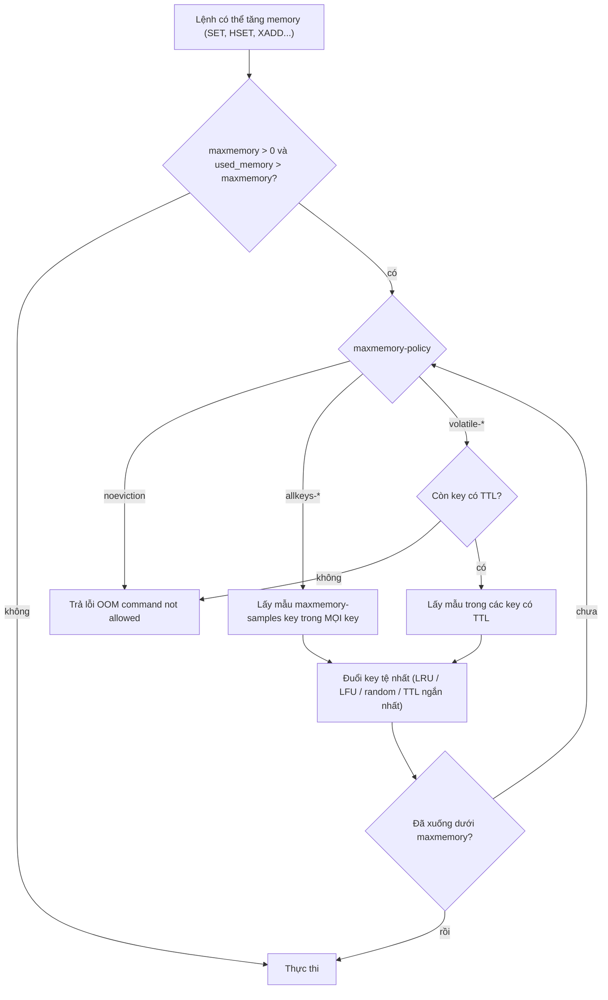
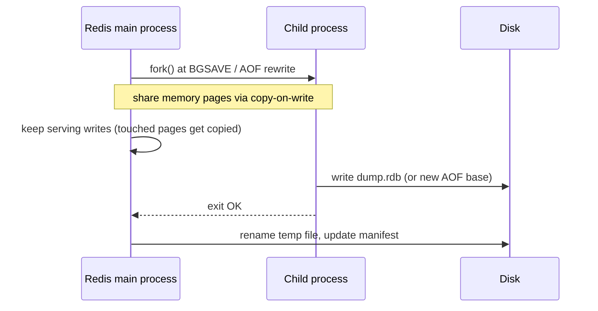

## Bối cảnh & vấn đề

Service Node bắt đầu trả 500 hàng loạt với log:

```text
ReplyError: OOM command not allowed when used memory > 'maxmemory'.
```

Đọc vẫn chạy, nhưng mọi lệnh ghi (`SET` cache, `INCR` rate limit, `XADD` queue) đều bị từ chối. Redis này dùng chung cho cache, session và BullMQ; nó để `maxmemory-policy` mặc định là `noeviction`. Một dev vội đổi sang `allkeys-lru` để "hết lỗi"; lỗi hết thật, nhưng hai giờ sau user bị đăng xuất ngẫu nhiên và vài job BullMQ biến mất, vì Redis bắt đầu đuổi **cả session lẫn job** để lấy chỗ cho cache.

Sự cố này gói gọn ba chủ đề của bài: **expiration** và **eviction** là hai cơ chế khác nhau; **policy** eviction quyết định dữ liệu nào hy sinh, và nó phải khớp với **loại dữ liệu** trong instance; **persistence** (RDB/AOF) quyết định dữ liệu còn gì sau restart. Cuối bài là bộ câu hỏi phải hỏi khi ai đó đề xuất dùng Redis làm primary store.

## Khái niệm

### Expiration: key hết TTL bị xoá ra sao

**Expiration** là khi key có TTL và TTL hết. Redis xoá key hết hạn bằng hai cơ chế. **Lazy (passive)**: khi một lệnh truy cập key, Redis kiểm tra hạn và xoá nếu đã hết, nên client không bao giờ đọc được key hết hạn. **Active**: một chu kỳ nền (chạy `hz` lần mỗi giây, mặc định 10) lấy mẫu một số key có TTL và xoá những key đã hết hạn, lặp lại nếu tỉ lệ hết hạn trong mẫu còn cao. Hệ quả: key đã hết hạn nhưng không ai truy cập có thể **vẫn chiếm memory một lúc**; `expired_keys` trong `INFO stats` đếm số key đã bị xoá do hết hạn.

Xoá một key lớn khi hết hạn cũng là một thao tác O(N) trên main thread, trừ khi bật `lazyfree-lazy-expire yes` để giải phóng ở background thread ([bài 10](/tracks/caching/learn/cluster-hot-big-keys)).

**Interview angle:** nói được "lazy + active sampling" và "key hết hạn có thể chưa rời memory ngay" là đủ sâu.

### Eviction và `maxmemory`

**Eviction** xảy ra khi memory dùng chạm `maxmemory`: trước khi thực thi một lệnh có thể tăng memory, Redis đuổi key theo **`maxmemory-policy`** cho tới khi xuống dưới giới hạn. Eviction có thể đuổi cả key **chưa hết hạn**, kể cả key không có TTL (tuỳ policy). `evicted_keys` đếm số key bị đuổi.

`maxmemory` mặc định là 0 (không giới hạn trên 64-bit), nghĩa là Redis dùng tới khi OS hết RAM và OOM killer ra tay. Luôn đặt `maxmemory` thấp hơn RAM máy một khoảng (cho fork khi persistence, output buffer, fragmentation). Policy mặc định là **`noeviction`**: đầy thì từ chối lệnh ghi với lỗi OOM ở trên, lệnh đọc vẫn chạy.

Phân biệt để debug: `expired_keys` tăng là bình thường (TTL hoạt động); `evicted_keys` tăng nghĩa là cache **thiếu memory** hoặc có key tăng không kiểm soát.

**Interview angle:** câu "eviction khác expiration thế nào?" cần hai ý: nguyên nhân (hết TTL vs hết memory) và phạm vi (chỉ key hết hạn vs có thể key còn hạn).

### Các eviction policy

- `noeviction` (mặc định): không đuổi; ghi bị lỗi khi đầy.
- `allkeys-lru`: đuổi key ít được dùng gần đây nhất trong **mọi** key.
- `allkeys-lfu` (từ Redis 4.0): đuổi key ít được dùng **thường xuyên** nhất trong mọi key.
- `allkeys-random`: đuổi ngẫu nhiên.
- `volatile-lru`, `volatile-lfu`, `volatile-random`: như trên nhưng **chỉ trong các key có TTL**.
- `volatile-ttl`: đuổi key có TTL **còn lại ngắn nhất** trước.
- `allkeys-lrm`, `volatile-lrm`: "least recently **modified**", có trong Redis 8.x (Redis 8.10.2 chấp nhận cấu hình này trong lần chạy thử) (verify theo version và managed service).

Hai chi tiết quan trọng. Thứ nhất, LRU/LFU của Redis là **xấp xỉ**: nó không giữ một linked list toàn cục (tốn memory), mà mỗi lần cần đuổi thì lấy mẫu `maxmemory-samples` key (mặc định 5) và đuổi key "tệ nhất" trong mẫu, cộng một pool ứng viên. Tăng samples thì gần LRU thật hơn nhưng tốn CPU. Thứ hai, `volatile-*` khi **không còn key nào có TTL** thì không có gì để đuổi và hành xử như `noeviction` (lỗi OOM). LFU dùng counter logarithmic có **decay** theo thời gian (`lfu-decay-time`, `lfu-log-factor`), nên key từng hot nhưng nay không ai đọc sẽ dần mất ưu tiên. Cài đặt LRU/LFU thuần và vì sao LFU chống scan pollution ở [track DSA](/tracks/dsa/learn/lru-lfu-caching).

Chọn: **cache thuần** → `allkeys-lru` (hoặc `allkeys-lfu` nếu có các đợt scan một lần làm "bẩn" LRU và muốn giữ key phổ biến lâu dài). Instance chứa **dữ liệu không được mất** (session, lock, queue, rate limit) → `noeviction` và instance **riêng**. Nếu buộc phải dùng chung, `volatile-lru` với quy ước: key cache luôn có TTL, dữ liệu cần giữ không có TTL; nhưng quy ước này dễ vỡ (session thường có TTL!).

**Interview angle:** follow-up "Redis giữ cả cache lẫn job BullMQ, `allkeys-lru` thì sao?" — Redis có thể đuổi key của queue, job mất hoặc queue hỏng trạng thái; BullMQ khuyến nghị `noeviction`.

### Memory: used_memory, RSS và fragmentation

`INFO memory` có vài số cần đọc đúng. `used_memory` là memory Redis cấp phát qua allocator (jemalloc) cho dữ liệu và cấu trúc; `used_memory_rss` là memory OS thấy process đang giữ. `mem_fragmentation_ratio` ≈ RSS / used_memory. Tỉ lệ cao (ví dụ 1,5–3) nghĩa là có nhiều vùng đã giải phóng nhưng allocator chưa trả lại OS, thường sau khi xoá/đuổi nhiều key; tỉ lệ < 1 nghĩa là OS đang **swap** Redis ra đĩa (rất tệ cho latency). Redis có **active defragmentation** (`activedefrag yes`) để dồn lại memory khi chạy với jemalloc.

`maxmemory` so sánh với `used_memory`, không phải RSS; vì vậy RSS thật có thể cao hơn `maxmemory` đáng kể. Khi đặt `maxmemory`, chừa dư cho fragmentation, output buffer của client (subscriber chậm, replica), và copy-on-write khi fork.

**Interview angle:** câu hỏi "vì sao `used_memory_rss` lớn hơn nhiều `used_memory`?" — fragmentation sau khi xoá nhiều; xử lý bằng active defrag hoặc restart có kiểm soát (replica trước).

### RDB: snapshot bằng fork và copy-on-write

**RDB** là snapshot nhị phân của toàn bộ dataset tại một thời điểm. `BGSAVE` gọi `fork()`: process con có cùng "ảnh" memory với process cha nhờ **copy-on-write** (trang memory chỉ bị copy khi process cha sửa nó sau fork), rồi ghi ra file. Cấu hình `save 3600 1 300 100 60 10000` (mặc định của image redis:8) nghĩa là snapshot nếu có ít nhất 1 thay đổi trong 3.600 giây, 100 thay đổi trong 300 giây, hoặc 10.000 thay đổi trong 60 giây.

Ưu: file gọn, restart nạp nhanh, hợp cho backup. Nhược: mất mọi thay đổi sau snapshot cuối; `fork()` trên dataset lớn tốn thời gian (copy page table) và gây latency spike trên main thread; copy-on-write có thể cần **thêm memory tới gấp đôi** nếu workload ghi nặng trong lúc snapshot (`rdb_last_cow_size` cho biết lần cuối tốn bao nhiêu).

### AOF: log mọi lệnh ghi

**AOF (append-only file)** ghi lại mọi lệnh ghi. `appendfsync` quyết định độ bền: `always` (fsync mỗi lệnh, chậm), **`everysec`** (mặc định, fsync mỗi giây, mất tối đa khoảng 1 giây khi crash), `no` (để OS quyết định). AOF lớn dần nên cần **rewrite** (tạo lại log ngắn gọn từ trạng thái hiện tại, cũng bằng fork). Từ Redis 7.0 AOF là **multi-part**: một file base (thường ở dạng RDB nhờ `aof-use-rdb-preamble yes`), các file incremental, và một manifest.

Kết hợp thường gặp cho dữ liệu cần giữ: AOF `everysec` + RDB định kỳ để backup. Nhưng dù persistence tốt tới đâu, **replication là async**: primary ack lệnh cho client trước khi replica nhận. Primary chết, replica được promote, và những write đã ack nhưng chưa tới replica **mất**. `WAIT numreplicas timeout` chỉ tăng xác suất (chờ replica ack), không biến Redis thành hệ thống consensus.

Cho **cache thuần**: có thể tắt cả hai (restart = cache lạnh, hệ thống phải chịu được), hoặc chỉ RDB để restart nhanh ấm lại. Dữ liệu cache không phải lý do để bật `appendfsync always`.

**Interview angle:** "vì sao failover có thể mất write đã ack dù bật AOF?" — AOF là độ bền của **một** node; failover chuyển sang node khác, mà replication async.

## Cơ chế hoạt động

Mỗi lệnh ghi đi qua bước kiểm tra memory. Sơ đồ dưới cho thấy chỗ policy quyết định:



Điểm cần nhớ từ sơ đồ: `noeviction` không bao giờ đuổi; `volatile-*` có thể rơi về hành vi của `noeviction` khi không còn ứng viên; việc chọn "key tệ nhất" dựa trên **mẫu**, không phải toàn bộ keyspace. Eviction chạy trong main thread (trừ khi `lazyfree-lazy-eviction yes` đẩy phần giải phóng memory ra background), nên đuổi một big key cũng gây spike.

Persistence chạy song song với phục vụ request nhờ fork:



## Ví dụ thực tế

### Bốn policy dưới cùng một đợt ghi (đo thật)

Redis 8.10.2, `maxmemory 30mb`, ghi tối đa 60.000 key mỗi key 1 KB, dừng ở lỗi đầu tiên:

```ts
for (const [policy, withTtl, label] of scenarios) {
  await r.flushall(); await r.config("RESETSTAT");
  await r.config("SET", "maxmemory", "30mb"); await r.config("SET", "maxmemory-policy", policy);
  // SET c:<i> <1000 bytes> [EX 3600 if withTtl(i)] ... until error
}
```

```text
noeviction                               written=27335 dbsize=27335 evicted_keys:0
   ERR: OOM command not allowed when used memory > 'maxmemory'.
allkeys-lru (keys without TTL)           written=60000 dbsize=27793 evicted_keys:32184
volatile-lru, NO key has TTL             written=27920 dbsize=27920 evicted_keys:0
   ERR: OOM command not allowed when used memory > 'maxmemory'.
volatile-lru, half the keys have TTL     written=50801 dbsize=27695 evicted_keys:23083
   ERR: OOM command not allowed when used memory > 'maxmemory'.
```

`noeviction` dừng ở khoảng 27.000 key với đúng lỗi OOM của bối cảnh. `allkeys-lru` ghi đủ 60.000 bằng cách đuổi 32.184 key, số key giữ quanh 27.800. `volatile-lru` khi **không key nào có TTL** hành xử y như `noeviction`: 0 key bị đuổi, lỗi OOM. Khi một nửa key có TTL, nó đuổi được 23.083 key có TTL rồi vẫn OOM khi chỉ còn key không TTL: đúng kịch bản "cache có TTL bị đuổi hết, session/lock không TTL chiếm đầy".

Kiểm tra độ "xấp xỉ" của LRU (lần chạy với `maxmemory 10mb`): 5.000 key, đọc 1.000 key đầu ba lần, rồi ghi thêm 7.000 key:

```text
allkeys-lru after overflow: hot keys alive 826/1000, cold early keys alive 854/4000
```

Key được đọc gần đây sống sót 83%, key cũ không ai đọc chỉ 21%. LRU thật sẽ giữ gần 100% key hot; với 5 mẫu mỗi lần đuổi, Redis đôi khi đuổi nhầm key hot. Đủ tốt cho cache, và là lý do không nên dựa vào eviction để "giữ" dữ liệu quan trọng.

### Chẩn đoán `OOM command not allowed`

Trình tự khi gặp lỗi ở bối cảnh:

```bash
redis-cli INFO memory | grep -E '^(used_memory|used_memory_rss|maxmemory|maxmemory_policy|mem_fragmentation_ratio):'
redis-cli INFO keyspace            # db0:keys=...,expires=...  -> ratio of keys without TTL
redis-cli --bigkeys                # biggest key per type (uses SCAN)
redis-cli --memkeys                # biggest keys by MEMORY USAGE
redis-cli INFO stats | grep -E 'evicted_keys|expired_keys'
```

```text
used_memory:10485600
used_memory_rss:39342080
maxmemory:10485760
maxmemory_policy:allkeys-lru
mem_fragmentation_ratio:3.75
```

(Output ở trên lấy ngay sau thí nghiệm eviction ở 10 MB.) `used_memory` sát `maxmemory`: đầy. `used_memory_rss` gấp 3,75 lần: sau khi hàng chục nghìn key bị đuổi và ghi lại, jemalloc giữ memory chưa trả OS. Trong production, các câu cần trả lời: tỉ lệ key không có TTL trong `INFO keyspace` (`keys` so với `expires`), prefix nào đang tăng (đếm theo prefix bằng `SCAN` ở replica), có big key không, có stream/queue chưa trim không. Nguyên nhân thường gặp: key cache không TTL, key cardinality bùng nổ (cache theo query tự do), stream không `MAXLEN`, hoặc tag set phình ([bài 4](/tracks/caching/learn/invalidation-at-scale)).

Sửa ngắn hạn: tăng memory, hoặc xoá prefix rác bằng `SCAN` + `UNLINK` theo batch. Sửa dài hạn: TTL bắt buộc cho key cache (lint/helper), policy phù hợp (`allkeys-lru` cho cache), **tách instance** cho dữ liệu không được đuổi, alert ở 75–80% `maxmemory`.

### Persistence trên Redis 8

Container redis:8 mặc định, 1 triệu key:

```text
save                  -> 3600 1 300 100 60 10000
appendonly            -> no
appendfsync           -> everysec
aof-use-rdb-preamble  -> yes
BGSAVE -> Background saving started
rdb_last_bgsave_status:ok
rdb_last_bgsave_time_sec:1
rdb_last_cow_size:757760
CONFIG SET appendonly yes -> OK
aof_enabled:1  aof_last_bgrewrite_status:ok
/data/dump.rdb                                   22777890 bytes
/data/appendonlydir/appendonly.aof.1.base.rdb    22777890 bytes
/data/appendonlydir/appendonly.aof.1.incr.aof    0 bytes
/data/appendonlydir/appendonly.aof.manifest      102 bytes
```

Mặc định: RDB bật với ba điều kiện, AOF tắt. Snapshot 1 triệu key mất khoảng 1 giây, copy-on-write chỉ 740 KB vì không có ghi trong lúc snapshot. Bật AOF lúc chạy làm Redis tạo một **base ở dạng RDB** rồi ghi thêm file `incr`: đó là cấu trúc multi-part của Redis 7+.

### Redis làm primary store cho giỏ hàng và session

Khi ai đó đề xuất "bỏ bảng carts, lưu giỏ hàng và session thẳng trong Redis", các câu cần hỏi:

- **Chấp nhận mất bao nhiêu?** AOF `everysec` mất tối đa khoảng 1 giây khi crash; failover (replication async) mất các write chưa sang replica. Mất vài giây giỏ hàng có thể chấp nhận; mất đơn hàng thì không.
- **Dữ liệu có vừa RAM, với giá RAM?** Tăng trưởng theo user, giỏ bỏ quên có TTL (ví dụ 30 ngày) không.
- **Truy vấn cần gì?** Chỉ theo key (cart của user X) thì hợp; cần report "giỏ bỏ quên theo sản phẩm", secondary index, join thì không.
- **Eviction**: bắt buộc `noeviction` và instance riêng, nếu không thì cache có thể đẩy giỏ hàng ra ngoài.
- **Backup/restore**, HA (Sentinel/Cluster/managed Multi-AZ), và đường chuyển giỏ thành đơn hàng ghi vào DB quan hệ.

Kết luận thường gặp: session và giỏ hàng là use case hợp lý cho Redis (hoặc Redis với TTL field-level từ 7.4 cho item) nếu chấp nhận mất vài giây; đơn hàng và thanh toán thì luôn ở DB có transaction.

## Trade-offs & lựa chọn thay thế

| Policy | Đuổi gì | Hợp với | Rủi ro |
| --- | --- | --- | --- |
| `noeviction` | Không | Session, queue, lock, primary store | Ghi lỗi OOM khi đầy |
| `allkeys-lru` | Key ít dùng gần đây | Cache thuần | Scan một lần làm bẩn LRU |
| `allkeys-lfu` | Key ít dùng thường xuyên | Cache có tập hot ổn định | Key mới hot cần thời gian tích counter |
| `volatile-lru/lfu` | Chỉ key có TTL | Instance dùng chung có quy ước TTL | OOM khi hết key có TTL; session có TTL bị đuổi |
| `volatile-ttl` | Key sắp hết hạn nhất | Khi TTL phản ánh độ quan trọng | Ít khi đúng giả định đó |
| `*-random` | Ngẫu nhiên | Truy cập đều | Đuổi nhầm key hot |

| Persistence | Mất tối đa khi crash | Chi phí | Hợp với |
| --- | --- | --- | --- |
| Không | Toàn bộ | 0 | Cache thuần chịu được cold start |
| RDB | Từ snapshot cuối (phút) | Fork định kỳ, COW memory | Cache muốn restart ấm, backup |
| AOF `everysec` | ~1 giây (trên một node) | Ghi đĩa liên tục, rewrite | Session, cart, dữ liệu cần giữ |
| AOF `always` | ~0 trên một node | Chậm nhiều | Hiếm khi đáng; failover vẫn mất |
| AOF + RDB | ~1 giây + backup | Cả hai | Primary store nhỏ |

Chọn thế nào: tách **instance theo loại dữ liệu** là quyết định quan trọng nhất; khi đã tách, policy và persistence gần như tự rõ: cache thì `allkeys-lru`/`lfu` và persistence tuỳ chọn; dữ liệu cần giữ thì `noeviction` + AOF `everysec` + backup RDB + HA, và chấp nhận rằng failover vẫn có thể mất vài giây.

## Edge cases & failure modes

- **Không đặt `maxmemory`**: Redis dùng tới khi OS OOM-kill process; mất toàn bộ dữ liệu trong memory.
- **Fork thất bại** vì thiếu memory (không đủ cho COW, hoặc `vm.overcommit_memory` chưa đặt 1): `BGSAVE` lỗi, và nếu `stop-writes-on-bgsave-error yes` (mặc định) thì Redis **từ chối ghi**.
- **Fork latency** trên dataset hàng chục GB: main thread đứng hàng chục tới hàng trăm ms mỗi lần snapshot; kiểm tra `latest_fork_usec`.
- **Transparent Huge Pages bật**: COW copy trang 2 MB thay vì 4 KB, memory và latency tăng; Redis log cảnh báo và khuyến nghị tắt THP.
- **Swap**: `mem_fragmentation_ratio < 1`, latency tăng hàng trăm lần.
- **Eviction đuổi big key**: spike khi giải phóng; bật `lazyfree-lazy-eviction`.
- **Replica chưa bắt kịp khi failover**: write đã ack biến mất; với counter/write-behind, số liệu hụt ([bài 2](/tracks/caching/learn/caching-patterns)).
- **Output buffer** của replica/subscriber vượt giới hạn làm Redis ngắt kết nối, replica phải full sync lại (thêm một lần fork).

## Pitfalls

- ❌ Đổi sang `allkeys-lru` để "hết lỗi OOM" trên instance chứa session/queue → ✅ tách instance; cache `allkeys-lru`, dữ liệu cần giữ `noeviction`.
- ❌ Dựa vào `volatile-lru` với quy ước "dữ liệu quan trọng không có TTL" → ✅ quy ước dễ vỡ; tách instance.
- ❌ Không đặt `maxmemory` → ✅ đặt thấp hơn RAM, chừa COW, buffer, fragmentation; alert ở 75–80%.
- ❌ Key cache không TTL → ✅ helper bắt buộc TTL, đo tỉ lệ `expires/keys`.
- ❌ Nghĩ AOF `always` làm Redis durable như DB → ✅ failover async vẫn mất; dữ liệu quan trọng ở DB có transaction.
- ❌ Dùng `KEYS` để tìm prefix đang phình → ✅ `SCAN` trên replica, `--bigkeys`, `--memkeys`.
- ❌ Bật persistence nặng cho cache thuần → ✅ tắt hoặc chỉ RDB; cache phải chịu được cold start.

## Tóm tắt

- Expiration = hết TTL (lazy khi truy cập + active sampling); eviction = hết `maxmemory`, có thể đuổi key còn hạn.
- Mặc định `noeviction`: đầy thì lỗi `OOM command not allowed` cho lệnh ghi, đọc vẫn chạy.
- `allkeys-*` cho cache thuần; `volatile-*` chỉ đuổi key có TTL và rơi về OOM khi hết ứng viên (đo thật); LRU/LFU là xấp xỉ bằng sampling; Redis 8.x thêm LRM (verify).
- `used_memory` vs RSS: fragmentation cao sau xoá nhiều; tỉ lệ < 1 là swap.
- RDB = snapshot bằng fork + COW; AOF = log lệnh ghi, `everysec` mất ~1 giây, multi-part từ 7.0.
- Replication async: failover mất write đã ack dù có AOF; `WAIT` không đảm bảo.
- Tách instance theo loại dữ liệu; Redis làm primary store chỉ khi chấp nhận mất vài giây và truy vấn theo key.
