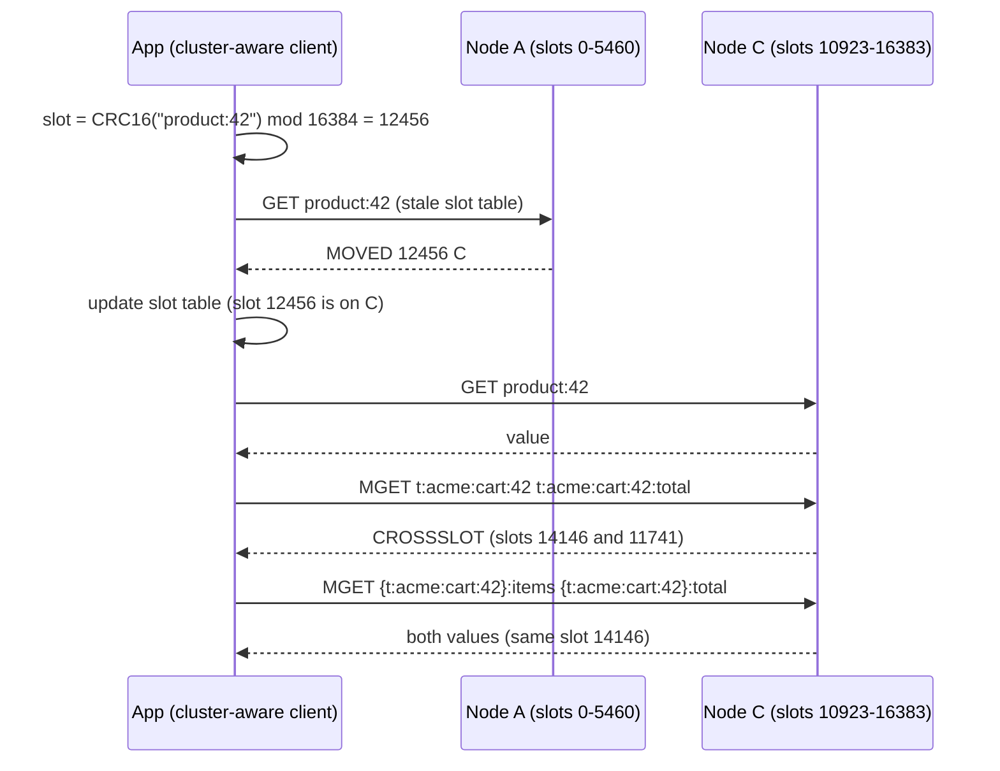

## Bối cảnh & vấn đề

Ba sự cố trên cùng một Redis Cluster 6 shard của một sàn thương mại điện tử:

1. Flash sale bắt đầu, key `config:flash-sale` nhận khoảng 150.000 lần đọc mỗi giây. Shard chứa nó chạy 100% CPU và bão hoà network, trong khi 5 shard còn lại gần như rảnh. Thêm shard không giúp gì vì **một key chỉ nằm trên một shard**.
2. Latency của mọi client tăng vọt vài phút một lần. Nguyên nhân là một hash `cart-snapshots` 1,5 GB: có job gọi `HGETALL` trên nó, và mỗi lần key đó hết hạn thì việc giải phóng nó cũng làm đứng instance.
3. Endpoint admin `POST /admin/cache/flush-tenant/:t` chạy `KEYS shop:acme:*` rồi `DEL ...keys`. Trên single instance nó từng làm Redis đơ vài giây; sau khi lên Cluster thì nó... "không xoá được gì" và thỉnh thoảng lỗi `CROSSSLOT`.

Cả ba đều xuất phát từ việc hiểu sai cách Redis phân phối và xử lý dữ liệu. Bài này giải thích Cluster (slot, redirect, hash tag), so sánh các mô hình triển khai HA, rồi đi vào hot key và big key: cách phát hiện và cách sửa an toàn.

## Khái niệm

### Hash slot và CRC16

**Redis Cluster** chia keyspace thành **16.384 hash slot**. Slot của một key là `CRC16(key) mod 16384` (CRC16 biến thể XMODEM). Mỗi master giữ một tập slot; ví dụ cluster 3 master: 0–5460, 5461–10922, 10923–16383. Mỗi master có thể có replica, và khi master chết thì replica của nó được bầu lên (failover tự động trong cluster, không cần Sentinel).

Vì sao slot mà không phải consistent hashing trực tiếp? Slot là một lớp trung gian cố định: thêm node nghĩa là **di chuyển một số slot** (cùng toàn bộ key trong slot đó) sang node mới, bảng ánh xạ nhỏ (16.384 phần tử) mà mọi client cache được. Consistent hashing ([track DSA](/tracks/dsa/learn/probabilistic-sharding)) được client Memcached dùng; Redis Cluster thì không.

Giới hạn: Cluster chỉ có **database 0** (`SELECT 1` lỗi), và lệnh multi-key chỉ chạy khi mọi key **cùng slot**.

**Interview angle:** nói được "16.384 slot, CRC16 mod 16384, client cache bảng slot" là đủ nền; điểm cộng là nêu vì sao slot giúp resharding.

### MOVED và ASK

Client "cluster-aware" (ioredis `Redis.Cluster`, node-redis `createCluster`) giữ bảng slot → node. Nếu client gửi lệnh tới node sai: node trả **`MOVED <slot> <ip:port>`** khi slot đã thuộc hẳn về node khác; client cập nhật bảng và gửi lại. Trong lúc **đang migrate** một slot, key có thể đã sang node mới hoặc chưa; node cũ trả **`ASK <slot> <ip:port>`** cho key đã chuyển, client gửi `ASKING` rồi lệnh tới node mới **chỉ cho lần này**, không cập nhật bảng.

**Interview angle:** phân biệt MOVED (vĩnh viễn, cập nhật bảng) và ASK (tạm thời khi migrate) là câu kiểm tra kiến thức Cluster thật.

### CROSSSLOT và hash tag

Lệnh đụng nhiều key (`MGET`, `MSET`, `DEL k1 k2`, `SUNION`, Lua với nhiều key, `MULTI` với nhiều key) yêu cầu mọi key cùng slot; nếu không, lỗi **`CROSSSLOT Keys in request don't hash to the same slot`**. Giải pháp là **hash tag**: nếu key chứa `{...}` với nội dung không rỗng, chỉ phần trong ngoặc nhọn đầu tiên được hash. `{cart:42}:items` và `{cart:42}:total` luôn cùng slot.

Cẩn thận: hash tag gom key về **một slot, tức một node**. Hash tag theo tenant (`{tenant:acme}:*`) làm mọi key của tenant lớn nhất dồn vào một shard: **hot shard**. Hash tag nên ở mức thực thể nhỏ (một giỏ hàng, một user), không phải cả tenant. Lua rate limiter đụng hai key (ví dụ counter phút và counter giờ) cần hash tag chung cho hai key đó.

**Interview angle:** follow-up "Lua rate limiter đụng hai key vỡ khi lên Cluster, sửa sao?" — hash tag chung, và truyền cả hai qua `KEYS[]`.

### Sentinel, Cluster, managed

- **Sentinel**: một master + các replica + một nhóm process Sentinel theo dõi và tự **failover** (bầu replica lên master, báo client địa chỉ mới). Dữ liệu **không shard**: bị giới hạn bởi RAM và CPU của một máy; replica chỉ giúp đọc (chấp nhận lag). Client phải hỗ trợ Sentinel (hỏi Sentinel địa chỉ master).
- **Cluster**: shard theo slot, mỗi shard có failover riêng; scale ngang memory và throughput ghi. Đổi lại: giới hạn multi-key (CROSSSLOT), chỉ DB 0, Pub/Sub thường broadcast toàn cluster, client phức tạp hơn, và resharding cần vận hành.
- **Managed** (ElastiCache, MemoryDB, Azure Cache, Memorystore, Redis Cloud): nhà cung cấp lo patch, failover, backup, Multi-AZ, metrics. Cân nhắc giá, một số lệnh/config bị khoá (`CONFIG`, `KEYS` có thể bị rename), và lock-in. Sau khi Redis đổi license năm 2024, **Valkey** (fork BSD của Redis 7.2.4 do Linux Foundation quản lý) trở thành engine phổ biến trên managed cloud, như ElastiCache for Valkey (verify giá và tính năng theo thời điểm).

Với team nhỏ-vừa: managed service, bắt đầu ở chế độ non-cluster với replica Multi-AZ, chuyển sang cluster mode khi dữ liệu hoặc throughput vượt một node. Khi chuyển, client cần: dùng client cluster-aware, xử lý MOVED/ASK, bỏ `SELECT`, thêm hash tag cho mọi thao tác multi-key, và thay `KEYS`/`SCAN` bằng quét **từng master**.

**Interview angle:** câu trả lời tốt không chọn "Cluster vì scale" mà chọn theo kích thước dữ liệu, năng lực vận hành của team, và chi phí.

### Hot key

**Hot key** là một key nhận lượng truy cập vượt khả năng của shard chứa nó (CPU của một luồng thực thi, hoặc network của một máy). Vì một key luôn nằm ở một slot, thêm shard không giúp. Ví dụ: config flash sale, trang chủ, sản phẩm đang viral, counter toàn cục.

Phát hiện: metrics theo prefix/key ở client (cách tốt nhất); `redis-cli --hotkeys` (chỉ chạy khi policy là **LFU**, vì nó đọc counter LFU); **`HOTKEYS START/GET`** từ Redis 8.6 (theo dõi top-K key theo CPU và network, có sampling); `CLUSTER SLOT-STATS` từ 8.2 cho thống kê theo slot; `MONITOR` chỉ trong vài giây vì nó rất tốn (verify phiên bản).

Xử lý, từ rẻ tới đắt:

- **L1 in-process cache** với TTL 1–5 giây: phần lớn lượt đọc không tới Redis nữa ([bài 7](/tracks/caching/learn/multi-level-resilience)). Thường là đủ.
- **Nhân bản key**: ghi cùng giá trị vào `k#0 … k#N-1` (các suffix rơi vào slot khác nhau), đọc ngẫu nhiên một bản. Ghi/invalidate phải cập nhật **tất cả** bản, và giữa các lần cập nhật các bản có thể lệch nhau một chút.
- **Đọc từ replica** (`READONLY` trong Cluster, `replicaof` với Sentinel): nhân khả năng đọc, chấp nhận replication lag.
- **Client-side caching** (RESP3 tracking) cho key ít đổi.
- **Giảm payload** (chỉ field cần, nén) hoặc đẩy lên **CDN** nếu là nội dung public.

**Interview angle:** "invalidate N bản sao thế nào cho nhất quán?" — ghi tất cả bản trong pipeline (hoặc từng bản, chấp nhận lệch ngắn), kèm version và TTL; hoặc tránh nhân bản bằng L1.

### Big key

**Big key** là key có value rất lớn (string vài MB) hoặc collection rất nhiều phần tử (hash/set/zset/list hàng triệu phần tử). Tác hại: lệnh O(N) (`HGETALL`, `SMEMBERS`, `LRANGE 0 -1`) block main thread; truyền qua network lâu, chiếm output buffer; `DEL` đồng bộ phải giải phóng từng phần tử; **hết hạn hoặc bị evict** cũng là một lần xoá đồng bộ (nên spike xảy ra kể cả khi không ai chạm key, trừ khi bật `lazyfree-lazy-expire`/`lazyfree-lazy-eviction`); migrate slot chứa big key trong Cluster chậm hoặc timeout; memory lệch giữa các shard.

Phát hiện: `redis-cli --bigkeys` (theo số phần tử, dùng SCAN), `--memkeys` (theo `MEMORY USAGE`), `MEMORY USAGE <key>`, SLOWLOG. Chạy trên **replica** nếu được.

Sửa an toàn: xoá bằng **`UNLINK`** (tách key khỏi keyspace ngay, giải phóng memory ở background thread) hoặc xoá dần (`HSCAN` + `HDEL` theo batch); đọc bằng `HSCAN` thay `HGETALL`; chia key thành bucket (`cart-snapshots:{0..255}` theo hash của id); giới hạn kích thước ở tầng ghi; bật `lazyfree-lazy-expire`, `lazyfree-lazy-eviction`, `lazyfree-lazy-server-del` (mặc định `no` trên Redis 8.10.2 trong lần kiểm tra này).

**Interview angle:** follow-up "vì sao hết hạn big key gây spike dù không ai chạm nó?" là câu phân biệt người đã debug thật.

## Cơ chế hoạt động

Đường đi của một lệnh trong Cluster, từ client tới đúng node:



Client tính slot cục bộ và gửi thẳng tới node nó tin là chủ slot. Nếu bảng cũ (vừa resharding, failover), node trả MOVED và client sửa bảng: chi phí là một round-trip thừa, sau đó mọi lệnh cùng slot đi đúng. Lệnh multi-key kiểm tra slot của mọi key; khác slot thì lỗi ngay, không có chuyện "Redis tự gom". Hash tag là cách duy nhất để hai key khác tên chắc chắn cùng slot.

Hot key và big key đều là vấn đề "một điểm": một slot (hot key) hoặc một lệnh (big key) chiếm luồng thực thi duy nhất của một node. Thêm node không giúp; phải chia nhỏ chính key đó (nhân bản, bucket) hoặc chặn traffic trước khi tới Redis (L1, CDN).

## Ví dụ thực tế

### Cluster 3 master: slot, MOVED, CROSSSLOT, hash tag

Ba container Redis 8.10.2 với `--cluster-enabled yes`, tạo bằng `redis-cli --cluster create` (không replica):

```text
172.24.0.4:6379@16379 master 10923-16383
172.24.0.3:6379@16379 master 5461-10922
172.24.0.2:6379@16379 myself,master 0-5460

KEYSLOT t:acme:cart:42 = 14146
KEYSLOT t:acme:cart:42:total = 11741
KEYSLOT {t:acme:cart:42}:items = 14146
KEYSLOT {t:acme:cart:42}:total = 14146
KEYSLOT product:42 = 12456
KEYSLOT product:42#0 = 5265
KEYSLOT product:42#1 = 1200
KEYSLOT product:42#2 = 13523
```

```text
$ redis-cli (connected to node A, no -c) SET product:42 x
MOVED 12456 172.24.0.4:6379
$ redis-cli -c MGET t:acme:cart:42 t:acme:cart:42:total
CROSSSLOT Keys in request don't hash to the same slot
$ redis-cli -c MSET {t:acme:cart:42}:items 3 {t:acme:cart:42}:total 99
OK
$ redis-cli -c MGET {t:acme:cart:42}:items {t:acme:cart:42}:total
3
99
$ redis-cli SELECT 1
ERR SELECT is not allowed in cluster mode
```

Để ý ba bản nhân của hot key `product:42#0..2` rơi vào slot 5265, 1200, 13523, tức cả ba node: đó là cơ sở của kỹ thuật nhân bản key. Tính slot ở client để kiểm chứng (khớp với `CLUSTER KEYSLOT`):

```ts
function crc16(buf: Buffer): number {                    // CRC16-CCITT (XMODEM)
  let crc = 0;
  for (const b of buf) {
    crc ^= b << 8;
    for (let i = 0; i < 8; i++) crc = crc & 0x8000 ? ((crc << 1) ^ 0x1021) & 0xffff : (crc << 1) & 0xffff;
  }
  return crc;
}
function keySlot(key: string): number {
  const s = key.indexOf("{");
  if (s !== -1) { const e = key.indexOf("}", s + 1); if (e > s + 1) key = key.slice(s + 1, e); } // non-empty tag only
  return crc16(Buffer.from(key)) % 16384;
}
```

```text
product:42               12456
t:acme:cart:42           14146
t:acme:cart:42:total     11741
{t:acme:cart:42}:total   14146
{}:x                     5106
product:42#1             1200
```

`{}:x` có tag rỗng nên cả key được hash. Cùng script cũng đo lý do Redis dùng slot/consistent hashing thay vì `hash % N`: khi đi từ 3 lên 4 node, `hash % N` di chuyển **75,2%** key, còn consistent hashing (100 virtual node) chỉ **22,1%** (lý thuyết khoảng 1/4).

### Phát hiện hot key

`redis-cli --hotkeys` đọc counter LFU, nên cần policy LFU:

```text
$ redis-cli --hotkeys            # maxmemory-policy noeviction
Error: ERR An LFU maxmemory policy is not selected, access frequency not tracked. ...
$ redis-cli CONFIG SET maxmemory-policy allkeys-lfu ; (300 x GET config:global) ; redis-cli --hotkeys
hot key found with counter: 12	keyname: "config:global"
hot key found with counter: 5	keyname: "cold"
```

Counter LFU là logarithmic (300 lần đọc ra 12; key mới bắt đầu ở 5), nên chỉ dùng để xếp hạng. Redis 8.6 có `HOTKEYS` đo theo CPU và bytes thật:

```text
127.0.0.1:6379> HOTKEYS START METRICS 2 CPU NET COUNT 3
OK
(500 x GET config:global, 50 x GET product:1)
127.0.0.1:6379> HOTKEYS STOP
127.0.0.1:6379> HOTKEYS GET
...
by-cpu-time-us
config:global  460
product:1      45
by-net-bytes
config:global  20000
product:1      1750
```

Trong production, nguồn tốt nhất vẫn là metrics ở client theo prefix (không tốn gì ở Redis), dùng các lệnh server để xác nhận.

### Big key: HGETALL, DEL và UNLINK

Hash 1 triệu field trên Redis 8.10.2; một client khác liên tục `PING` để đo thời gian bị chặn:

```ts
await measure("HGETALL (1M fields)", () => a.hgetallBuffer("big:hash"));
await measure("DEL big key", () => a.del("big:hash"));
await measure("UNLINK big key", () => a.unlink("big2"));
```

```text
MEMORY USAGE big:hash = 54166483 bytes, HLEN = 1000000
HGETALL (1M fields)        command=1823ms  worst PING from another client=974ms
DEL big key                command=75ms  worst PING from another client=74ms
UNLINK big key             command=0ms  worst PING from another client=2ms
```

Hash 54 MB: `HGETALL` làm client khác chờ gần **1 giây** (thời gian thực thi cộng ghi 54 MB reply). `DEL` block 74 ms để giải phóng 1 triệu phần tử. `UNLINK` trả về ngay và client khác gần như không bị ảnh hưởng: việc giải phóng chạy ở background thread. Với hash 1,5 GB ở bối cảnh, các con số này nhân khoảng 30 lần. Kế hoạch sửa: (1) ngừng `HGETALL`, dùng `HSCAN` hoặc `HMGET` field cần; (2) bật `lazyfree-lazy-expire yes` và `lazyfree-lazy-eviction yes`; (3) chia thành 256 bucket `cart-snapshots:{n}` với `n = hash(cartId) % 256`; (4) migrate dữ liệu cũ sang bucket rồi `UNLINK` key cũ.

### Sửa endpoint flush-tenant

Code gốc:

```ts
app.post("/admin/cache/flush-tenant/:t", async (req, res) => {
  const keys = await redis.keys(`shop:${req.params.t}:*`);   // O(N) over the whole keyspace, blocks
  if (keys.length) await redis.del(...keys);                 // huge DEL, CROSSSLOT in Cluster, arg spread limit
  res.sendStatus(204);
});
```

Bốn lỗi: `KEYS` block (đo ở [bài 8](/tracks/caching/learn/redis-core): 170 ms cho 1 triệu key); `DEL` với hàng trăm nghìn key trong một lệnh cũng block, và spread hàng trăm nghìn argument có thể vượt giới hạn call stack của V8; trong Cluster, `KEYS` chỉ chạy trên node đang kết nối (tìm thiếu key); `DEL` multi-key khác slot lỗi `CROSSSLOT`. Bản sửa quét từng master bằng `SCAN` và xoá theo batch nhỏ bằng `UNLINK` từng key (pipeline):

```ts
async function flushTenant(cluster: Cluster, tenant: string) {
  for (const node of cluster.nodes("master")) {
    let cursor = "0";
    do {
      const [next, keys] = await node.scan(cursor, "MATCH", `shop:${tenant}:*`, "COUNT", 1000);
      cursor = next;
      if (keys.length) {
        const p = node.pipeline();
        for (const k of keys) p.unlink(k);                  // single-key commands: no CROSSSLOT
        await p.exec();
      }
    } while (cursor !== "0");
  }
}
```

Tốt hơn nữa là không cần tìm key: **namespace version theo tenant** (`shop:acme:v17:*`); "xoá" tenant là `INCR ns:acme`, key cũ tự hết TTL ([bài 4](/tracks/caching/learn/invalidation-at-scale)). Cái giá là memory của key mồ côi tới khi hết TTL.

## Trade-offs & lựa chọn thay thế

| | Single + replica | Sentinel | Cluster | Managed |
| --- | --- | --- | --- | --- |
| Failover tự động | Không | Có | Có (theo shard) | Có |
| Scale memory/ghi | Không | Không | Có | Có (cluster mode) |
| Multi-key tự do | Có | Có | Chỉ cùng slot | Tuỳ mode |
| Độ phức tạp client | Thấp | Trung bình | Cao hơn | Tuỳ mode |
| Vận hành | Bạn lo | Bạn lo Sentinel | Bạn lo resharding | Nhà cung cấp lo |

| Hot key fix | Hiệu quả | Nhất quán | Chi phí |
| --- | --- | --- | --- |
| L1 in-process 1–5s | Rất cao | Stale ≤ TTL L1 | Heap mỗi pod |
| Nhân bản `k#0..N` | Cao, chia đều shard | Các bản lệch ngắn khi ghi | Ghi N lần, memory N lần |
| Đọc replica | Trung bình | Replication lag | Thêm replica |
| CDN | Rất cao (public) | Theo `max-age` | Chỉ nội dung public |

Chọn thế nào: dùng **managed + replica Multi-AZ** cho tới khi dữ liệu hoặc throughput vượt một node, rồi mới cluster mode; khi thiết kế key từ đầu, dùng hash tag cho các nhóm key cần thao tác cùng nhau để chuyển sang Cluster không đau. Với hot key, **L1** gần như luôn là bước đầu đúng; nhân bản key khi L1 không đủ (quá nhiều pod, hoặc cần cập nhật nhanh). Với big key, phòng ngừa ở tầng thiết kế (giới hạn kích thước, bucket) rẻ hơn nhiều so với chữa cháy.

## Edge cases & failure modes

- **Hash tag theo tenant lớn**: một shard giữ 40% dữ liệu và traffic; thêm shard không giúp. Đổi tag xuống mức thực thể.
- **Resharding trong giờ cao điểm**: nhiều ASK/MOVED, latency tăng; big key trong slot đang migrate có thể timeout migrate.
- **Client không cluster-aware**: dùng single-node client trỏ vào một node, mọi lệnh sai slot trả MOVED mà client không xử lý.
- **Pub/Sub trong Cluster**: `PUBLISH` thường broadcast qua cluster bus tới mọi node; kênh bận làm tốn bandwidth mọi node. Cân nhắc sharded Pub/Sub (7.0+).
- **Replica đọc stale**: đọc hot key từ replica trong lúc failover hoặc lag cao.
- **Big key hết hạn**: spike định kỳ không có lệnh nào trong SLOWLOG của client (việc xoá do server làm); nhìn `LATENCY LATEST` và bật lazyfree.
- **`--bigkeys` trên primary**: vẫn dùng SCAN nên không block lâu, nhưng thêm tải; chạy trên replica.
- **`MONITOR` trên production**: có thể giảm throughput một nửa; chỉ bật vài giây.

## Pitfalls

- ❌ Thêm shard để chữa hot key → ✅ một key chỉ ở một shard; L1, nhân bản key, replica, CDN.
- ❌ Hash tag theo cả tenant → ✅ hash tag ở mức thực thể nhỏ (cart, user).
- ❌ Lua/MULTI nhiều key không cùng slot → ✅ hash tag chung, mọi key qua `KEYS[]`.
- ❌ `KEYS` + `DEL ...keys` để dọn cache → ✅ `SCAN` từng master + `UNLINK` theo batch, hoặc namespace version.
- ❌ `DEL`/`HGETALL` big key → ✅ `UNLINK`, `HSCAN`, chia bucket, lazyfree.
- ❌ Chạy `--hotkeys` với policy LRU → ✅ cần LFU; hoặc `HOTKEYS` (8.6+), hoặc metrics ở client.
- ❌ Chuyển sang Cluster mà không đổi client → ✅ client cluster-aware, bỏ `SELECT`, quét từng master.

## Tóm tắt

- Redis Cluster: 16.384 slot, `CRC16(key) mod 16384`, mỗi master giữ một dải slot; chỉ DB 0.
- MOVED = slot đã chuyển hẳn (cập nhật bảng); ASK = đang migrate (chỉ lần này).
- Multi-key/Lua cần cùng slot, nếu không `CROSSSLOT`; hash tag `{...}` gom key, nhưng tag quá rộng tạo hot shard.
- Sentinel = failover không shard; Cluster = shard + failover, hạn chế multi-key; managed giảm vận hành; Valkey là fork BSD phổ biến.
- Hot key: phát hiện bằng metrics client, `--hotkeys` (cần LFU), `HOTKEYS` (8.6); xử lý bằng L1, nhân bản key, replica, CDN.
- Big key: `HGETALL` 1 triệu field chặn client khác ~1 giây, `DEL` 74 ms, `UNLINK` ~0 (đo thật); chia bucket, HSCAN, lazyfree.
- Dọn cache theo prefix: SCAN từng master + UNLINK batch, hoặc tốt hơn là namespace version.
