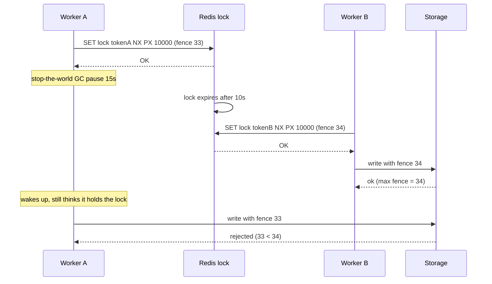
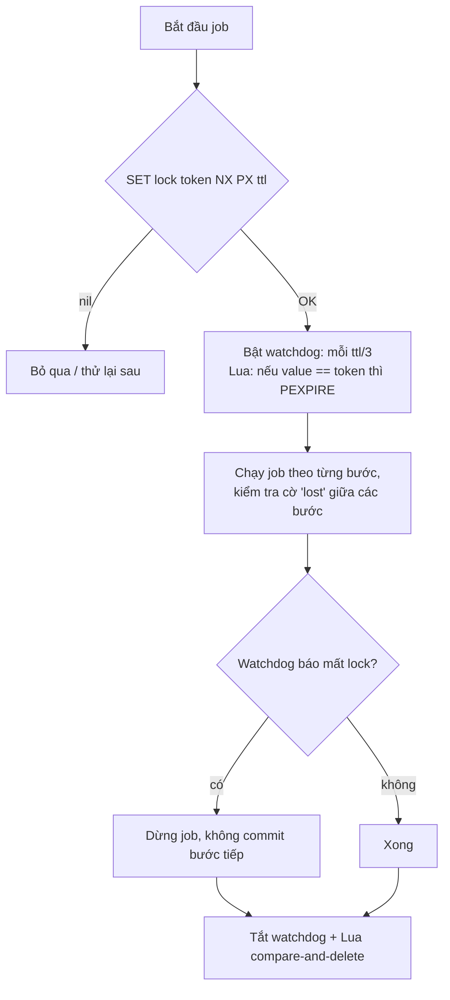

## Bối cảnh & vấn đề

Job đối soát hằng đêm chạy trên 3 replica của một service. Để chỉ một replica chạy, team viết "lock" bằng Redis: `SETNX lock:nightly 1`, rồi `EXPIRE lock:nightly 60`, chạy job, cuối cùng `DEL lock:nightly`. Thỉnh thoảng báo cáo đối soát có dòng trùng: hai worker đã chạy **cùng lúc**. Log cho thấy job mất 3 phút vào những đêm dữ liệu nhiều, lâu hơn TTL 60 giây.

Lock trong hệ phân tán khác hẳn mutex trong một process. Không có bộ nhớ chung, không có "chủ sở hữu" mà OS theo dõi; chỉ có một key với TTL trên một server ở xa, và các process có thể bị pause (GC, swap), mất mạng, hoặc chết bất cứ lúc nào. Một lock như vậy là một **lease** (hợp đồng thuê có hạn), không phải một đảm bảo tuyệt đối.

Bài này làm ba việc: viết lock Redis đơn instance **đúng** và hiểu nó bảo vệ được gì; phân tích Redlock và cuộc tranh luận quanh nó để biết khi nào **không** dùng Redis lock; và áp dụng vào bài toán thực tế hay gặp nhất: bảo vệ tồn kho trong flash sale, nơi lock thường là **sai công cụ**. Phần lý thuyết chung về lease, GC pause và fencing có ở [track OS & Concurrency](/tracks/os-concurrency/learn/distributed-locks-idempotency); bài này tập trung vào Redis.

## Khái niệm

### Lock vì efficiency và lock vì correctness

Kleppmann phân biệt hai mục đích. **Efficiency lock**: tránh làm trùng một việc tốn kém (rebuild cache, gửi báo cáo, chạy cron). Nếu lock hỏng và hai process cùng chạy, hậu quả là tốn gấp đôi tài nguyên hoặc gửi email trùng: khó chịu nhưng chấp nhận được. **Correctness lock**: nếu hai process cùng chạy thì dữ liệu **sai** (trừ tiền hai lần, bán quá tồn kho, ghi đè lẫn nhau).

Phân loại này quyết định mọi thứ phía sau. Redis lock đơn instance là lựa chọn tốt cho efficiency. Cho correctness, bạn cần thêm một cơ chế ở **chính tài nguyên được bảo vệ** (fencing token, unique constraint, optimistic version), vì không lock dựa trên TTL nào an toàn tuyệt đối khi process có thể bị pause.

**Interview angle:** câu hỏi "lock này có an toàn để chống trừ tiền hai lần không?" gần như luôn có đáp án "không, cần idempotency/fencing ở DB".

### Lock đơn instance đúng cách

Acquire bằng **một lệnh atomic**: `SET lock:<resource> <token> NX PX <ttl>`. `NX` chỉ ghi khi key chưa tồn tại; `PX` đặt TTL mili giây **cùng lúc**, nên không có khoảnh khắc key tồn tại mà không có TTL. `<token>` là một giá trị ngẫu nhiên duy nhất cho lần acquire này (UUID).

Release bằng **compare-and-delete** trong Lua: chỉ `DEL` nếu value vẫn là token của mình. Lý do: nếu lock của mình đã hết hạn và process khác đã lấy lock, một `DEL` trơn sẽ xoá lock **của người khác**.

```lua
if redis.call('get', KEYS[1]) == ARGV[1] then
  return redis.call('del', KEYS[1])
else
  return 0
end
```

TTL phải lớn hơn thời gian xử lý tối đa. Việc dài và khó đoán thì dùng **watchdog**: một timer gia hạn TTL định kỳ (ví dụ mỗi TTL/3) bằng Lua compare-and-`PEXPIRE`; nếu gia hạn thất bại (lock đã mất), job phải **dừng** càng sớm càng tốt.

**Interview angle:** interviewer hay yêu cầu viết code acquire/release; ba điểm cần có là một lệnh `SET NX PX`, token ngẫu nhiên, release bằng Lua.

### Ba lỗi của lock SETNX + EXPIRE + DEL

Đoạn code ở bối cảnh có ba lỗi độc lập:

1. **`SETNX` rồi `EXPIRE` là hai lệnh**: process crash (hoặc mất kết nối) giữa hai lệnh để lại lock **không có TTL**, và không ai lấy được lock nữa (deadlock vĩnh viễn cho tới khi có người xoá tay).
2. **TTL 60 giây < job 3 phút**: lock hết hạn giữa chừng, worker B lấy lock và chạy song song.
3. **`DEL` không kiểm tra owner**: khi A xong, nó xoá lock mà lúc này thuộc về B; worker C lấy được lock trong khi B vẫn đang chạy.

Sửa (1) và (3) bằng `SET NX PX` + token + Lua release; sửa (2) bằng TTL đủ dài hoặc watchdog. Nhưng ngay cả khi sửa cả ba, một GC pause dài hơn TTL vẫn có thể làm hai worker cùng tin mình giữ lock, nên nếu trùng lặp là nguy hiểm thì job phải **idempotent** hoặc dùng fencing token.

**Interview angle:** tìm đủ cả ba lỗi, và nói thêm "sửa xong vẫn chưa an toàn cho correctness", là câu trả lời mức senior.

### Redlock và tranh luận xung quanh

**Redlock** là thuật toán do tác giả Redis đề xuất để lock chịu được việc một Redis chết: client lấy lock trên N (ví dụ 5) Redis master **độc lập**, lần lượt với timeout ngắn; thành công nếu lấy được trên **đa số** (≥ 3) và tổng thời gian lấy nhỏ hơn TTL; thời gian lock còn hiệu lực = TTL − thời gian đã tốn − drift đồng hồ.

Martin Kleppmann (2016) phản biện rằng Redlock không an toàn cho correctness: (1) process có thể bị **pause** (GC stop-the-world, swap, CPU bị throttle) sau khi lấy lock; khi tỉnh lại nó tưởng còn giữ lock trong khi lock đã hết hạn và người khác đã lấy; (2) Redlock dựa vào **giả định thời gian**: network delay có giới hạn, đồng hồ các node chạy gần đúng tốc độ; clock jump (NTP chỉnh giờ) làm key hết hạn sớm trên một node; (3) Redlock không sinh **fencing token** tăng đơn điệu, nên tài nguyên không có cách phân biệt request cũ. Antirez phản hồi rằng các giả định timing là chấp nhận được trong thực tế và vấn đề pause tồn tại với mọi lock có TTL. Kết luận thực dụng được đa số chấp nhận: Redis lock (đơn hay Redlock) ổn cho efficiency; cho correctness dùng hệ có **consensus** (etcd, ZooKeeper, Consul) để lấy lease **kèm fencing token**, hoặc tốt hơn, đặt ràng buộc ở chính DB.

**Interview angle:** không cần thắng cuộc tranh luận; cần nêu được pause + clock + thiếu fencing token, và kết luận efficiency vs correctness.

### Fencing token

**Fencing token** là một số tăng đơn điệu được cấp cùng mỗi lần lấy lock (lần sau luôn lớn hơn lần trước). Client gửi token kèm mọi lệnh ghi tới tài nguyên; **tài nguyên** (DB, storage) ghi nhớ token lớn nhất đã thấy và từ chối mọi lệnh có token nhỏ hơn. Khi worker A (token 33) tỉnh lại sau GC pause và cố ghi, trong khi worker B (token 34) đã ghi, lệnh của A bị từ chối.

Điểm then chốt: việc kiểm tra xảy ra ở **tài nguyên**, không ở lock. Với SQL, fencing đơn giản là một điều kiện `WHERE fence < $token` trong câu `UPDATE`. Redis có thể cấp token bằng `INCR` khi acquire, nhưng bản thân lock Redis vẫn có thể bị hai client cùng giữ; token chỉ giúp nếu tài nguyên kiểm tra nó.

**Interview angle:** "fencing token được storage kiểm tra thế nào?" — lưu token cao nhất cùng dữ liệu, update có điều kiện, từ chối token cũ.

### Tồn kho trong flash sale: không cần lock

Bài toán "không bán quá số lượng" là **correctness**, nhưng lời giải tốt thường **không phải lock**, mà là một thao tác atomic duy nhất ở một nơi:

- **DB**: `UPDATE inventory SET stock = stock - 1 WHERE sku = $1 AND stock >= 1` (kiểm tra `rowCount`), cộng `CHECK (stock >= 0)`. Đúng tuyệt đối, nhưng mọi đơn cùng tranh row lock của một dòng: với hàng nghìn đơn mỗi giây cho một SKU, dòng đó thành điểm nghẽn.
- **Redis làm cổng reservation**: Lua script "nếu còn ≥ n thì `DECRBY` và trả số còn lại, ngược lại trả −1". Chịu được hàng chục nghìn lệnh mỗi giây trên một key. Nhưng Redis có thể **mất write khi failover** (replication async), nên cần **đối soát** với DB và coi Redis là cổng đặt chỗ, không phải sổ cái. Đơn hàng thật vẫn ghi DB (qua queue), với idempotency key.

Phần còn lại của thiết kế flash sale: trang sản phẩm qua CDN + SWR, pre-warm trước giờ G và không để key hết hạn trong sự kiện; tồn kho **hiển thị** là số xấp xỉ cache vài giây ("còn ít hàng"); waiting room/queue và rate limit theo user trước cổng đặt chỗ; reservation có hạn (giữ hàng 10 phút, hết hạn thì trả lại).

**Interview angle:** follow-up "Redis báo hết hàng nhưng DB sau đối soát còn 3 cái" — Redis đã giảm cho các reservation không thành đơn (thanh toán fail, timeout) hoặc DB/Redis lệch do failover; cần job trả lại reservation hết hạn và đối soát định kỳ.

## Cơ chế hoạt động

Kịch bản GC pause làm hai worker cùng tin mình giữ lock, và fencing token cứu tài nguyên:



Không lock nào ngăn được bước "A tỉnh lại và ghi": A không có cách biết mình đã bị pause bao lâu, và kiểm tra lock ngay trước khi ghi cũng không đủ (pause có thể xảy ra giữa kiểm tra và ghi). Chỉ tài nguyên, nơi nhận lệnh ghi, mới có thể từ chối một cách chắc chắn. Đó là lý do mọi thiết kế correctness đẩy phần kiểm tra xuống storage.

Luồng lock đơn instance với watchdog, dùng cho efficiency:



## Ví dụ thực tế

### Tái hiện ba lỗi của SETNX + EXPIRE + DEL

Redis 8.10.2 / ioredis 6.0.0; thu nhỏ thời gian: TTL 1 giây, job 1,5 giây:

```ts
async function buggyRunExclusive(name: string, jobMs: number) {
  const acquired = await redis.setnx("lock:nightly", "1");
  if (!acquired) return log(`${name}: lock busy, skip`);
  await redis.expire("lock:nightly", 1);
  log(`${name}: acquired (SETNX + EXPIRE 1s), job starts`);
  try { await sleep(jobMs); } finally { await redis.del("lock:nightly"); log(`${name}: finished, DEL lock (whoever owns it)`); }
}
const a = buggyRunExclusive("worker-A", 1500);
await sleep(1100); const b = buggyRunExclusive("worker-B", 1500);   // A's lock expired at 1s
await sleep(600);  const c = buggyRunExclusive("worker-C", 500);    // A deleted B's lock at ~1.5s
```

```text
t=  16ms worker-A: acquired (SETNX + EXPIRE 1s), job starts
t=1120ms worker-B: acquired (SETNX + EXPIRE 1s), job starts
t=1519ms worker-A: finished, DEL lock (whoever owns it)
t=1722ms worker-C: acquired (SETNX + EXPIRE 1s), job starts
t=2224ms worker-C: finished, DEL lock (whoever owns it)
t=2623ms worker-B: finished, DEL lock (whoever owns it)
```

Từ 1.120 ms tới 1.519 ms, A và B cùng chạy (TTL ngắn hơn job). Ở 1.519 ms, A xoá lock **của B** (B chỉ hết hạn ở 2.120 ms), nên C lấy được lock ở 1.722 ms trong khi B vẫn chạy: lại hai worker song song. Lỗi thứ ba (crash giữa SETNX và EXPIRE) không hiện trong run này nhưng hiển nhiên từ code.

Sửa bằng token + compare-and-delete nhưng **giữ TTL ngắn** để thấy token không cứu được TTL sai:

```text
== token lock, TTL still too short (1s) for a 3s job
t=4227ms worker-A: acquired token=226bf831
t=5429ms worker-B: acquired token=86e33af8
t=7234ms worker-A: release -> NOT owner anymore, nothing deleted
t=8434ms worker-B: release -> NOT owner anymore, nothing deleted
```

A không còn xoá nhầm lock của B nữa, nhưng A và B vẫn chạy song song từ 5.429 ms tới 7.234 ms vì TTL hết trước khi job xong. Thêm watchdog:

```ts
const RENEW = "if redis.call('get',KEYS[1])==ARGV[1] then return redis.call('pexpire',KEYS[1],ARGV[2]) else return 0 end";
const timer = setInterval(async () => {
  if ((await redis.eval(RENEW, 1, key, token, ttlMs)) !== 1) lost = true;   // stop work ASAP
}, ttlMs / 3);
```

```text
t=   1ms worker-A: acquired
t=1204ms worker-B: busy, skip
t=3005ms worker-A: release -> 1
```

Job 3 giây với TTL 1 giây, được gia hạn mỗi 333 ms; B không lấy được lock. Watchdog không cứu được GC pause dài hơn TTL (timer cũng bị pause), nên với việc cần correctness vẫn cần fencing.

### Fencing token và tồn kho bằng UPDATE có điều kiện (PostgreSQL 16)

```ts
// 50 concurrent buyers, stock 10, pg.Pool max 20
const buy = () => pool.query(
  "UPDATE inventory SET stock = stock - 1 WHERE sku = 'sku1' AND stock >= 1 RETURNING stock")
  .then((r) => r.rowCount === 1);

// fencing: storage keeps the highest token and rejects older ones
const write = (token: number, note: string) => pool.query(
  "UPDATE inventory SET fence = $1, note = $2 WHERE sku = 'sku1' AND fence < $1", [token, note])
  .then((r) => r.rowCount);
```

```text
conditional UPDATE: 50 buyers, stock 10 -> sold=10, stock left=0
worker B (token 34) write -> 1 row(s)
worker A (token 33, woke up after GC pause) write -> 0 row(s)
final: { fence: '34', note: 'written by B' } PostgreSQL 16.14
```

Không có lock nào, UPDATE có điều kiện bán đúng 10 cái cho 50 người: row lock của Postgres serialize các UPDATE trên cùng dòng, và điều kiện được đánh giá lại trên phiên bản mới nhất của row. Fencing: lệnh của A mang token 33 cập nhật **0 dòng** vì `fence` đã là 34.

### Cổng reservation bằng Redis cho flash sale

Khi một SKU nhận hàng nghìn đơn mỗi giây, đặt Redis Lua làm cổng trước DB (so sánh GET+SET naive và Lua đã đo ở [bài 8](/tracks/caching/learn/redis-core): naive bán 50 từ kho 10, Lua bán đúng 10):

```ts
const RESERVE = `
  local s = tonumber(redis.call('GET', KEYS[1]) or '0')
  if s < tonumber(ARGV[1]) then return -1 end
  redis.call('DECRBY', KEYS[1], ARGV[1])
  redis.call('SET', KEYS[2], ARGV[1], 'EX', ARGV[2])      -- reservation expires if not paid
  return s - tonumber(ARGV[1])`;

async function reserve(sku: string, userId: string, qty: number) {
  // same hash tag: both keys in one slot for Cluster
  const left = await redis.eval(RESERVE, 2, `{sku:${sku}}:stock`, `{sku:${sku}}:resv:${userId}`, qty, 600);
  if (left < 0) return { ok: false, reason: "sold out" };
  await queue.add("create-order", { sku, userId, qty }, { jobId: `order:${sku}:${userId}` }); // idempotent
  return { ok: true, left };
}
```

Order worker ghi đơn vào DB bằng UPDATE có điều kiện như trên (DB vẫn là sổ cái). Một job định kỳ trả lại các reservation hết hạn mà chưa thành đơn (`INCRBY stock`) và **đối soát** tồn kho Redis với DB, vì failover có thể làm Redis mất vài `DECRBY` gần nhất (bán vượt trên cổng, DB từ chối) hoặc reservation không thành đơn làm Redis báo hết hàng sớm.

## Trade-offs & lựa chọn thay thế

| Cơ chế | An toàn cho correctness? | Hiệu năng | Phụ thuộc | Hợp khi |
| --- | --- | --- | --- | --- |
| Redis `SET NX PX` đơn instance | Không (failover, pause) | Rất cao | Redis | Efficiency: cron, rebuild cache |
| Redlock (5 master) | Tranh cãi; không có fencing | Cao | 5 Redis độc lập | Efficiency khi cần chịu lỗi 1 node |
| etcd/ZooKeeper lease + fencing | Có (kèm kiểm tra ở storage) | Trung bình | Cụm consensus | Leader election, correctness |
| Postgres advisory lock | Có trong phạm vi DB đó | Cao | DB đã có | Cron chỉ chạy một nơi, việc trong cùng DB |
| UPDATE có điều kiện / unique constraint | Có | Tốt tới khi một dòng quá nóng | DB | Tồn kho, idempotency, chống trùng |
| Redis Lua reservation + đối soát | Gần đúng, cần đối soát | Rất cao | Redis + DB | Flash sale một SKU rất nóng |

Chọn thế nào: nếu việc cần bảo vệ nằm trong một DB quan hệ, ưu tiên **ràng buộc ở DB** (UPDATE có điều kiện, unique constraint, `pg_advisory_xact_lock`): đúng tuyệt đối, không thêm hệ thống. Dùng Redis lock cho **efficiency** (tránh làm trùng việc tốn kém), viết đúng ba điểm (atomic acquire, token, Lua release) và chọn TTL/watchdog cẩn thận. Chỉ khi cần leader election hoặc lock cho correctness trải trên nhiều hệ thống mới dùng etcd/ZooKeeper, và vẫn kèm fencing. Flash sale: cổng Redis Lua cho throughput, DB là sổ cái, và đối soát.

## Edge cases & failure modes

- **Redis failover**: A lấy lock trên primary, primary chết trước khi replicate, replica được promote không có lock, B lấy được lock. Hai client cùng giữ.
- **Clock jump** trên server Redis làm key hết hạn sớm (Redis dùng đồng hồ hệ thống cho TTL).
- **GC pause dài hơn TTL**: watchdog cũng bị pause; process tỉnh lại sau khi lock đã sang người khác.
- **Watchdog vẫn chạy khi job treo**: lock được gia hạn mãi cho một job không tiến triển; cần timeout tổng cho job.
- **Retry acquire không có backoff**: 100 worker spin `SET NX` liên tục tạo tải vô ích; dùng backoff có jitter hoặc chỉ chạy theo lịch.
- **Lock key trong Redis có eviction `allkeys-*`**: lock bị đuổi như key cache. Lock phải nằm trong instance `noeviction` ([bài 9](/tracks/caching/learn/memory-eviction-persistence)).
- **Flash sale**: reservation không bao giờ hết hạn làm kho "kẹt"; đối soát lệch khi đơn đang trên đường ghi DB.

## Pitfalls

- ❌ `SETNX` rồi `EXPIRE` → ✅ `SET key token NX PX ttl` một lệnh.
- ❌ `DEL` lock không kiểm tra owner → ✅ Lua compare-and-delete theo token.
- ❌ TTL đoán mò ngắn hơn job → ✅ TTL > p99.9 thời gian job, hoặc watchdog gia hạn và dừng khi mất lock.
- ❌ Dùng Redis lock để chống trừ tiền hai lần → ✅ idempotency key + unique constraint/UPDATE có điều kiện ở DB.
- ❌ Nghĩ Redlock giải quyết pause và clock → ✅ không có fencing token; correctness cần kiểm tra ở storage.
- ❌ Lock tồn kho cho mỗi đơn → ✅ thao tác atomic duy nhất (UPDATE có điều kiện hoặc Lua reservation).
- ❌ Coi Redis reservation là sổ cái → ✅ DB là nguồn đúng; đối soát định kỳ và trả reservation hết hạn.

## Tóm tắt

- Lock phân tán là lease có hạn, không phải đảm bảo tuyệt đối; phân biệt lock vì efficiency và vì correctness.
- Lock Redis đúng: `SET lock token NX PX ttl`, release bằng Lua compare-and-delete, TTL đủ dài hoặc watchdog.
- `SETNX` + `EXPIRE` + `DEL` có ba lỗi: không atomic, TTL ngắn hơn job, xoá lock người khác (tái hiện: tới ba worker chồng lấn).
- Redlock bị phê bình vì process pause, giả định timing/clock, không có fencing token; hợp cho efficiency.
- Fencing token tăng đơn điệu, được **storage** kiểm tra (`WHERE fence < $token`), là thứ làm lock an toàn cho correctness.
- Tồn kho: UPDATE có điều kiện ở DB (đo: 50 người, kho 10, bán đúng 10), hoặc Redis Lua reservation + đối soát cho SKU cực nóng.
