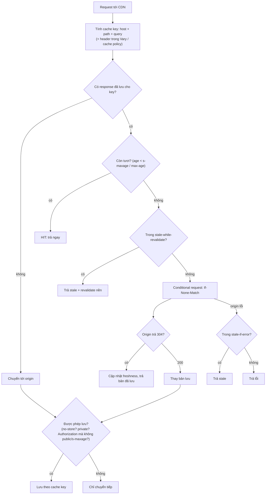

## Bối cảnh & vấn đề

Để giảm tải cho API catalog, team đặt CloudFront trước `GET /api/products/:id` và thêm một dòng vào handler: `res.set("Cache-Control", "public, max-age=300")`. Latency giảm mạnh, origin nhẹ hẳn. Hai giờ sau, một khách hàng doanh nghiệp (tenant "globex") gọi hỗ trợ: giá hiển thị là giá hợp đồng của **một công ty khác**. Tenant được xác định từ header `Authorization`, nhưng cache key của CDN mặc định chỉ gồm host + path (+ query tuỳ cấu hình). Response đầu tiên (của tenant "acme") được lưu và trả cho mọi tenant trong 5 phút.

Cùng tuần đó, sau một lần deploy frontend, một phần user thấy trang trắng: HTML mới đã được CDN phục vụ nhưng nó trỏ tới `main.js` cũ đang nằm trong cache browser, hoặc ngược lại HTML cũ trỏ tới một bundle đã bị xoá khỏi server.

Cả hai sự cố đều đến từ việc coi `Cache-Control` là "tối ưu hiệu năng" trong khi thực chất nó là **hợp đồng** giữa origin và mọi cache trên đường đi. Bài này nhìn HTTP caching từ phía backend: các directive, validation, cache key, và hai chiến lược cần thuộc lòng (API theo tenant, asset + HTML khi deploy). Góc nhìn mạng (edge, TLS, custom domain) có ở [track Networking](/tracks/networking/learn/cdn-caching); caching của Next.js ở [track Next.js](/tracks/nextjs/learn/caching-models).

## Khái niệm

### Private cache và shared cache

RFC 9111 chia cache HTTP thành hai loại. **Private cache** phục vụ **một** user: cache của browser. **Shared cache** phục vụ **nhiều** user: CDN (CloudFront, Cloudflare, Fastly), reverse proxy (Nginx, Varnish), proxy doanh nghiệp. Mọi rủi ro rò dữ liệu nằm ở shared cache: một response được lưu ở đó có thể được trả cho người khác.

Quy tắc mặc định quan trọng: shared cache **không được lưu** response của request có header `Authorization`, **trừ khi** response có `public`, `s-maxage` hoặc `must-revalidate`. Tức là `public` chính là câu "tôi cho phép CDN lưu response này dù request có xác thực". Đó là dòng code gây ra sự cố ở bối cảnh.

**Interview angle:** nêu được "`public` ghi đè quy tắc bảo vệ Authorization" cho thấy bạn hiểu vì sao bug xảy ra, không chỉ cách sửa.

### Các directive thường bị nhầm

- **`no-store`**: không cache nào được lưu response. Dùng cho dữ liệu nhạy cảm (token, trang tài khoản, thông tin thanh toán).
- **`no-cache`**: **được lưu**, nhưng trước mỗi lần dùng phải **revalidate** với origin (gửi `If-None-Match`/`If-Modified-Since`, nhận 304 hoặc 200). Tên gây hiểu lầm: nó không có nghĩa "đừng cache".
- **`private`**: chỉ private cache (browser) được lưu; shared cache không được.
- **`public`**: mọi cache được lưu, kể cả khi request có `Authorization`.
- **`max-age=N`**: response "tươi" trong N giây (tính từ lúc origin tạo ra, trừ đi `Age`). `max-age=0` nghĩa là stale ngay, thường dẫn tới revalidate, gần giống `no-cache`; nhưng cache được phép (trong vài điều kiện, như mất kết nối origin) phục vụ stale nếu không có `must-revalidate`, nên `no-cache` là cách nói rõ ràng hơn.
- **`s-maxage=N`**: như `max-age` nhưng **chỉ** áp dụng cho shared cache và được ưu tiên hơn `max-age` ở đó. Cho phép "browser giữ 60 giây, CDN giữ 10 phút".
- **`must-revalidate`**: khi đã stale thì bắt buộc revalidate, không được phục vụ stale.
- **`immutable`**: response sẽ không bao giờ đổi trong thời gian còn tươi; browser không cần revalidate kể cả khi user bấm reload.

**Interview angle:** red flag kinh điển là "no-cache nghĩa là không cache".

### Validation: ETag, Last-Modified, 304

Khi response đã stale (hoặc `no-cache`), cache gửi **conditional request**: `If-None-Match: "<etag>"` (hoặc `If-Modified-Since: <date>`). Nếu tài nguyên không đổi, origin trả **`304 Not Modified`** không có body; cache dùng lại bản đang có. Tiết kiệm **bandwidth và công serialize**, nhưng **vẫn tốn một round-trip** tới origin. Muốn tiết kiệm round-trip thì cần freshness (`max-age`), không phải validation.

**ETag** là định danh phiên bản do origin chọn: hash nội dung (strong), hoặc version/`updated_at` của row (rẻ hơn vì không cần dựng body). ETag dạng `W/"..."` là weak (tương đương về ngữ nghĩa, không từng byte). Nếu origin phải dựng toàn bộ response rồi hash mới biết 304, thì origin vẫn tốn CPU và DB; ETag từ version cho phép trả 304 chỉ với một query nhẹ.

**Interview angle:** follow-up "ETag tiết kiệm gì và không tiết kiệm gì?" — tiết kiệm body, không tiết kiệm round-trip.

### Vary và cache key

**Cache key** là thứ cache dùng để tìm response đã lưu: mặc định là method + URL (host + path + query). Header **`Vary`** trên response liệt kê các header của **request** phải được đưa vào cache key: `Vary: Accept-Encoding` để bản gzip và brotli không lẫn nhau, `Vary: Accept-Language` cho nội dung theo ngôn ngữ.

`Vary: Cookie` hoặc `Vary: Authorization` về lý thuyết tách cache theo user, nhưng thực tế mỗi user một cookie khác nhau nên **hit ratio gần 0** và cache chỉ tốn memory; nhiều CDN còn bỏ qua hoặc xử lý `Vary` hạn chế. CDN hiện đại cấu hình cache key bằng **cache policy** riêng (chọn header/cookie/query nào vào key), tách khỏi `Vary` (verify theo provider). Với dữ liệu theo tenant, cách ổn định nhất là đưa tenant vào **URL hoặc host** (`acme.shop.com/api/...`), để cache key tự nhiên chứa tenant.

**Interview angle:** câu "cache ở CDN một API trả giá khác nhau theo tenant" có ba lời giải: không cache ở CDN (`private`), tenant vào URL/host, hoặc tách phần công khai khỏi phần theo tenant.

### stale-while-revalidate và stale-if-error

RFC 5861 thêm hai directive. **`stale-while-revalidate=N`**: sau khi hết `max-age`, cache được trả bản stale trong tối đa N giây **trong khi** revalidate nền; user không phải chờ origin. **`stale-if-error=N`**: nếu origin lỗi (5xx, không kết nối được), cache được trả bản stale trong tối đa N giây. Đây là phiên bản HTTP của SWR ở tầng app ([bài 5](/tracks/caching/learn/stampede-protection)), do cache HTTP thực thi thay vì code của bạn. Hỗ trợ tuỳ CDN và browser (verify).

**Interview angle:** `stale-if-error` là một cách rẻ để origin sập vài phút mà trang public vẫn sống.

### Asset có hash và HTML

Chiến lược chuẩn cho frontend: **asset tĩnh** (JS, CSS, ảnh do build sinh ra) có **content hash** trong tên file (`main.7723a394.js`) và `Cache-Control: public, max-age=31536000, immutable`: nội dung đổi thì tên đổi, nên cache "vĩnh viễn" là an toàn. **HTML** (điểm vào, chứa tên các asset) thì `no-cache` (luôn revalidate, 304 khi không đổi) hoặc `max-age` rất ngắn, để deploy mới được thấy ngay.

Hai chi tiết hay bị quên: giữ **asset của vài bản cũ** trên storage/CDN sau deploy, vì user đang mở trang (HTML cũ) sẽ lazy-load chunk cũ và nhận 404 nếu bạn xoá chúng; và purge/invalidate HTML trên CDN khi deploy nếu HTML có `s-maxage`.

**Interview angle:** câu follow-up "vì sao giữ asset cũ sau deploy?" kiểm tra bạn có nghĩ tới tab đang mở và code splitting.

## Cơ chế hoạt động

Một shared cache quyết định với mỗi request như sau (đơn giản hoá RFC 9111):



Hai điểm quyết định an toàn nằm ở đây: **cache key** (nếu thiếu một dimension làm output khác nhau, như tenant, response của người này sẽ được trả cho người kia) và **được phép lưu hay không** (`private`/`no-store`/quy tắc Authorization). Origin kiểm soát điểm thứ hai hoàn toàn qua header; điểm thứ nhất phụ thuộc cả header (`Vary`) lẫn cấu hình CDN. Vì thế lỗi rò giữa tenant thường là lỗi **kết hợp**: origin nói `public` và CDN dùng key mặc định.

## Ví dụ thực tế

### Tái hiện bug giá của tenant khác

Origin (Node 24) xác định tenant từ `Authorization` và trả giá theo tenant; một "CDN" tối giản đứng trước: cache key = method + URL, lưu response khi có `public` và `max-age`:

```ts
// ORIGIN
const origin = http.createServer((req, res) => {
  const tenant = (req.headers.authorization ?? "").replace("Bearer ", "");
  const body = JSON.stringify({ id: 42, tenant, price: prices[tenant] });
  res.setHeader("Cache-Control", mode === "public" ? "public, max-age=300" : "private, no-cache");
  res.setHeader("ETag", `"${sha1(body).slice(0, 12)}"`);
  if (req.headers["if-none-match"] === res.getHeader("ETag")) { res.statusCode = 304; return res.end(); }
  res.end(body);
});
// TOY SHARED CACHE: key = `${method} ${url}`, stores when Cache-Control has public + max-age
```

```text
== Cache-Control: public, max-age=300 behind the shared cache
acme   -> 200 x-cache=MISS etag=- body={"id":42,"tenant":"acme","price":49}
globex -> 200 x-cache=HIT etag=- body={"id":42,"tenant":"acme","price":49}
== Cache-Control: private, no-cache (+ ETag revalidation straight to origin)
globex -> 200 x-cache=MISS etag=- body={"id":42,"tenant":"globex","price":39}
acme   -> 200 x-cache=MISS etag=- body={"id":42,"tenant":"acme","price":49}
acme revalidate If-None-Match "20371e62733d" -> 304 x-cache=- etag="20371e62733d" body=(empty)
```

Với `public`, request của globex **HIT** response của acme: đúng sự cố. Đổi sang `private, no-cache`: shared cache không lưu nữa, mỗi tenant nhận giá của mình, và browser vẫn tiết kiệm bandwidth nhờ ETag (304 không body).

Các cách sửa, theo mức "vẫn muốn cache ở edge":

1. `Cache-Control: private, no-cache` (hoặc `no-store` nếu nhạy cảm) cho mọi response phụ thuộc danh tính; cache ở Redis phía server với key có tenant ([bài 13](/tracks/caching/learn/keys-multi-tenant)).
2. Đưa tenant vào **host/URL** (`acme.shop.com/api/products/42`) và chỉ khi đó mới `public, s-maxage=...`; kiểm tra cấu hình CDN không bỏ host khỏi key.
3. **Tách response**: phần catalog công khai (tên, ảnh, mô tả) `public, s-maxage=600` ở CDN; phần giá theo tenant là một endpoint `private` nhỏ, ghép ở client hoặc BFF.

Và một test chống tái phát: gọi cùng URL với hai tenant liên tiếp qua môi trường có CDN (hoặc proxy giống CDN) và assert `tenant` trong body khớp token.

### HTML `no-cache` + ETag, asset `immutable`

Server nhỏ phục vụ HTML trỏ tới bundle có hash, và bundle đó:

```bash
curl -si http://127.0.0.1:58090/ | head -4
curl -si -H 'If-None-Match: "9e5aaad8413d"' http://127.0.0.1:58090/ | head -3
curl -sI http://127.0.0.1:58090/assets/main.7723a394.js | head -3
```

```text
HTTP/1.1 200 OK
Content-Type: text/html
Cache-Control: no-cache
ETag: "9e5aaad8413d"

HTTP/1.1 304 Not Modified
ETag: "9e5aaad8413d"
Cache-Control: no-cache

HTTP/1.1 200 OK
Content-Type: text/javascript
Cache-Control: public, max-age=31536000, immutable
```

HTML luôn được revalidate (304 rẻ khi không đổi, 200 với HTML mới ngay khi deploy); bundle được cache một năm vì tên của nó là phiên bản. Sự cố "trang trắng sau deploy" ở bối cảnh xảy ra khi làm ngược lại: HTML có `max-age` dài (user giữ HTML cũ trỏ tới bundle đã xoá) hoặc bundle tên cố định `main.js` có `max-age` dài (HTML mới + JS cũ). Quy trình deploy đúng: upload asset mới trước, giữ asset cũ vài bản, rồi mới đổi HTML, và purge HTML trên CDN nếu có `s-maxage`.

### Header cho các loại endpoint thường gặp

```text
GET /api/public/config            Cache-Control: public, max-age=60, s-maxage=300, stale-while-revalidate=60, stale-if-error=600
GET /api/products/42 (catalog)    Cache-Control: public, max-age=60, s-maxage=600      (không phụ thuộc user/tenant)
GET /api/products/42/price        Cache-Control: private, no-cache + ETag              (theo tenant)
GET /api/me                       Cache-Control: private, no-store
POST /api/orders                  (không cache; POST mặc định không được dùng lại)
GET /assets/main.<hash>.js        Cache-Control: public, max-age=31536000, immutable
GET / (HTML)                      Cache-Control: no-cache + ETag
```

## Trade-offs & lựa chọn thay thế

| Directive | Browser lưu? | CDN lưu? | Revalidate? | Hợp cho |
| --- | --- | --- | --- | --- |
| `no-store` | Không | Không | - | Token, tài khoản, thanh toán |
| `no-cache` | Có | Có | Mỗi lần dùng | HTML, dữ liệu cần mới nhưng muốn 304 |
| `private, max-age=60` | Có | Không | Sau 60s | Dữ liệu theo user, chấp nhận stale ngắn |
| `public, max-age=60, s-maxage=600` | Có (60s) | Có (600s) | Sau hạn | API công khai, catalog |
| `public, max-age=31536000, immutable` | Có | Có | Không | Asset có content hash |
| `max-age=0, must-revalidate` | Có | Có | Mỗi lần, không phục vụ stale | Tương tự `no-cache`, chặt hơn khi origin lỗi |

| Cache dữ liệu theo tenant ở đâu | Ưu | Nhược |
| --- | --- | --- |
| Không ở CDN, Redis phía server | Kiểm soát key hoàn toàn, không rủi ro edge | Không giảm latency mạng |
| CDN với tenant trong host/URL | Hit ở edge, key tự nhiên | Cấu hình domain, purge theo tenant |
| CDN với cache policy theo header | Không đổi URL | Phụ thuộc provider, dễ cấu hình sai |
| Tách public/private | Phần lớn payload được cache ở edge | Hai request, ghép dữ liệu |

Chọn thế nào: dữ liệu phụ thuộc danh tính mặc định `private` (hoặc `no-store`), cache phía server bằng Redis. Chỉ đưa lên CDN phần **không phụ thuộc** user/tenant, hoặc khi tenant đã nằm trong host/URL. Asset build dùng hash + `immutable`, HTML dùng `no-cache`. `stale-if-error` là bảo hiểm rẻ cho endpoint công khai.

## Edge cases & failure modes

- **`Set-Cookie` trong response được cache**: CDN lưu và phát cookie phiên của user A cho mọi người. Response có `Set-Cookie` không bao giờ nên `public`; nhiều CDN mặc định không cache chúng (verify cấu hình).
- **Query string lộn xộn**: `?utm_source=...` tạo hàng nghìn key cho cùng nội dung, hit ratio thấp; normalize hoặc loại query không liên quan khỏi cache key.
- **Vary quá rộng**: `Vary: User-Agent` tạo một bản cho mỗi trình duyệt; hit ratio sụp.
- **Heuristic freshness**: response không có `Cache-Control` nhưng có `Last-Modified` có thể bị cache "đoán" thời gian tươi (thường 10% tuổi của tài nguyên). Luôn đặt `Cache-Control` rõ ràng.
- **Purge không tức thì**: invalidation CDN mất vài giây tới vài phút để lan hết edge; đừng dựa vào purge cho dữ liệu cần đúng ngay.
- **304 vẫn tốn origin**: ETag tính bằng hash của body buộc origin dựng body; tính ETag từ version.
- **Proxy doanh nghiệp** giữa user và bạn cũng là shared cache và có thể không tôn trọng mọi directive; dữ liệu nhạy cảm dùng `no-store` + HTTPS.

## Pitfalls

- ❌ `public, max-age` cho response phụ thuộc `Authorization`/cookie → ✅ `private`/`no-store`, hoặc tenant vào host/URL, hoặc tách phần public.
- ❌ Hiểu `no-cache` là "không cache" → ✅ `no-cache` = lưu nhưng revalidate; không lưu là `no-store`.
- ❌ Dùng `Vary: Cookie` để "cache theo user" ở CDN → ✅ không cache ở CDN, cache ở server với key có user/tenant.
- ❌ Bundle tên cố định với `max-age` dài → ✅ content hash trong tên + `immutable`.
- ❌ HTML có `max-age` dài → ✅ `no-cache` + ETag, purge khi deploy.
- ❌ Xoá asset cũ ngay khi deploy → ✅ giữ vài bản để tab đang mở không 404.
- ❌ Tin rằng ETag tiết kiệm round-trip → ✅ chỉ tiết kiệm body; muốn bỏ round-trip thì cần freshness.

## Tóm tắt

- Private cache (browser) vs shared cache (CDN, proxy); rò dữ liệu xảy ra ở shared cache.
- `no-store` = không lưu; `no-cache` = lưu nhưng revalidate; `private` = chỉ browser; `public` = cả shared cache, kể cả request có `Authorization`.
- `s-maxage` chỉ cho shared cache; ETag/`If-None-Match` → 304 tiết kiệm body, không tiết kiệm round-trip.
- `Vary` đưa header request vào cache key; `Vary: Cookie/Authorization` làm hit ratio ~0; CDN hiện đại dùng cache policy.
- `stale-while-revalidate`/`stale-if-error` (RFC 5861) cho phép trả stale khi revalidate hoặc khi origin lỗi.
- Asset có hash + `immutable` một năm, HTML `no-cache`, giữ asset cũ sau deploy.
- API theo tenant sau CDN: `private`, hoặc tenant trong host/URL, hoặc tách phần công khai (tái hiện: tenant thứ hai HIT response của tenant đầu).
