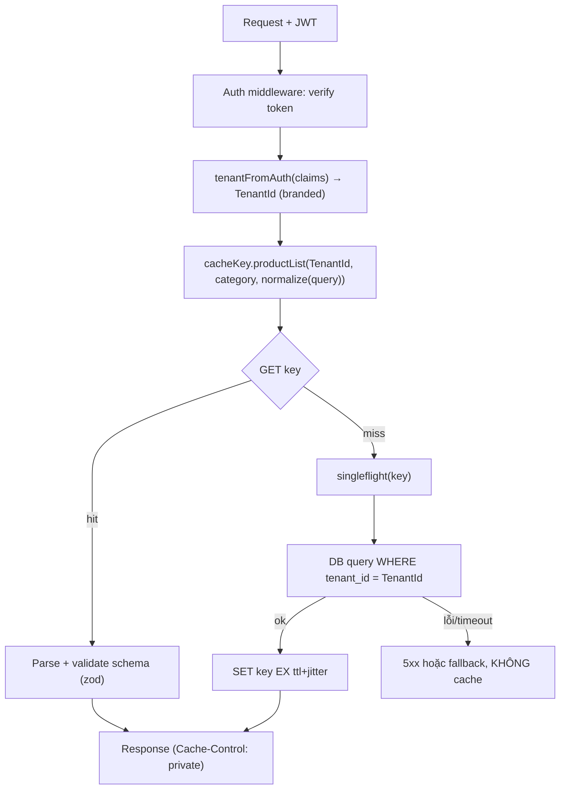
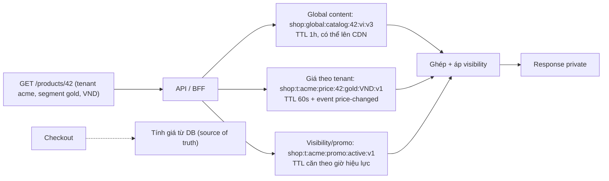

## Bối cảnh & vấn đề

Một helper cache-aside được copy qua nhiều service của nền tảng e-commerce multi-tenant:

```ts
async function getProducts(tenantId: string, category: string) {
  const key = `products:${category}`;
  const hit = await redis.get(key);
  if (hit !== null) return JSON.parse(hit);
  let rows: Product[] = [];
  try {
    rows = await withTimeout(db.products.find({ tenantId, category }), 500);
  } catch (e) {
    log.warn("db slow", e);
  }
  await redis.set(key, JSON.stringify(rows), "EX", 300);
  return rows;
}
```

Nó sinh ra hai loại ticket rất khác nhau. Loại thứ nhất: "trang danh mục trống trơn, 5 phút sau tự có lại" — mỗi lần DB chậm quá 500 ms, mảng rỗng được cache 5 phút. Loại thứ hai nghiêm trọng hơn nhiều: "khách hàng thấy sản phẩm của công ty khác" — key không có `tenantId`, nên tenant đầu tiên đọc category `keyboards` quyết định nội dung cho mọi tenant. Loại lỗi thứ hai không phải bug hiệu năng mà là **sự cố bảo mật** (data leak giữa khách hàng), có thể phải báo cáo theo hợp đồng.

Bài này tập trung vào thứ quyết định cache đúng hay sai trước cả pattern hay TTL: **cache key**. Sau đó áp dụng vào multi-tenant: helper tập trung, test, thiết kế catalog có giá theo tenant, noisy neighbor, và cách trình bày kinh nghiệm thật trong phỏng vấn.

## Khái niệm

### Key phải chứa mọi dimension của output

Quy tắc duy nhất cần nhớ: **nếu hai request có thể nhận output khác nhau, key của chúng phải khác nhau**. Các dimension thường bị quên: tenant, user hoặc role/segment (giá B2B, quyền xem), locale/ngôn ngữ, currency, region/kho, feature flag hay A/B variant ảnh hưởng nội dung, device (nếu server trả khác), và mọi tham số query (filter, sort, page, page size).

Ngược lại, đưa dimension **không** ảnh hưởng output vào key (request id, `utm_*`, timestamp) làm hit ratio sụp vì mỗi request một key. Thiết kế key là cân bằng giữa đúng (đủ dimension) và hiệu quả (không thừa).

**Interview angle:** "sản phẩm chung chỉ hiển thị cho một số tenant, phần nào vào key?" — visibility phụ thuộc tenant, nên hoặc key có tenant, hoặc cache phần chung theo product id và áp visibility theo tenant sau khi đọc cache.

### Đặt tên key

Quy ước phổ biến: các phần cách nhau bằng `:`, đi từ rộng tới hẹp: `<app>:<tenant>:<entity>:<id>:<dimension...>:v<schemaVer>`, ví dụ `shop:t:acme:product:42:vi-VN:v3`. Lợi ích: đọc được khi debug, đo và quét theo prefix (`SCAN MATCH shop:t:acme:*` trên replica), ACL Redis có thể giới hạn user theo pattern key (`~shop:*`), và `--bigkeys`/metrics nhóm theo prefix có nghĩa.

Key nên ngắn vừa phải (mỗi byte của key nằm trong RAM cho mỗi key); với phần phức tạp như bộ filter, **normalize rồi hash**: sắp xếp tham số, lowercase, bỏ tham số mặc định/không liên quan, rồi `sha1` lấy 12–16 ký tự. Không normalize thì `?sort=price&page=1` và `?page=1&sort=price` là hai key.

**Interview angle:** nhắc normalize trước khi hash cho thấy bạn đã gặp vấn đề hit ratio thật.

### Schema version trong key

Giá trị cache là JSON có **shape**. Khi deploy đổi shape (đổi tên field, đổi kiểu), pod mới đọc JSON cũ và có thể crash hoặc hiển thị sai, còn pod cũ (đang rolling) đọc JSON mới. **Schema version** trong key (`:v3` → `:v4`) tách hai thế giới: pod mới đọc/ghi key `v4`, key `v3` tự hết TTL. Cái giá là cold cache khi deploy (mọi key `v4` đều miss), nên chỉ bump khi shape thật sự đổi và cân nhắc đọc fallback key cũ để migrate ([bài 6](/tracks/caching/learn/penetration-avalanche-warmup)). Version schema khác với **namespace version** dùng để invalidate nhóm ([bài 4](/tracks/caching/learn/invalidation-at-scale)); key có thể chứa cả hai.

Một gotcha liên quan: JSON không có kiểu `Date`, nên `createdAt` đi vào cache là `Date` và đi ra là **string**; code so sánh ngày trên dữ liệu từ cache sai âm thầm. Dùng schema validation (zod) khi parse từ cache, hoặc chỉ cache dạng đã serialize rõ ràng.

**Interview angle:** câu "deploy đổi shape object thì cache cũ sao?" có đáp án là version trong key.

### Helper tạo key tập trung và tenant từ context đã xác thực

Nguồn của mọi bug leak kiểu bối cảnh là **nối chuỗi key bằng tay** rải khắp code. Cách phòng: một module duy nhất sinh key, nhận tenant ở dạng **kiểu riêng** chỉ tạo được từ context đã xác thực, và bắt buộc có tenant cho mọi loại key theo tenant.

```ts
type TenantId = string & { readonly __brand: "TenantId" };
// only the auth middleware can mint a TenantId (from the verified token, never from query params)
export function tenantFromAuth(claims: { tid: string }): TenantId { return claims.tid as TenantId; }

const V = { product: 3, plp: 2 } as const;
export const cacheKey = {
  product: (t: TenantId, id: string, locale: string) => `shop:t:${t}:product:${id}:${locale}:v${V.product}`,
  productList: (t: TenantId, category: string, q: Record<string, string>) =>
    `shop:t:${t}:plp:${category}:${hashQuery(q)}:v${V.plp}`,
  globalCatalog: (id: string) => `shop:global:catalog:${id}:v${V.product}`,   // explicitly shared
};
```

Tenant phải đến từ **token đã verify** (claim trong JWT, session) chứ không từ query param hay header tự khai; nếu không, attacker chỉ cần đổi `?tenant=` để đọc cache của người khác. Dữ liệu dùng chung giữa tenant được đặt tên **rõ ràng** là global, để reviewer thấy ngay đây là quyết định có chủ ý. Thêm lint rule cấm `redis.get(\`...\`)` với template string ngoài module này.

**Interview angle:** câu hỏi CV "làm sao đảm bảo tenant không đọc được cache của tenant khác?" nên trả lời bằng ba lớp: helper tập trung với kiểu, tenant từ context đã xác thực, và test tự động.

### Cache lỗi như dữ liệu

Lỗi thứ hai của helper ở bối cảnh: `catch` nuốt lỗi, `rows = []`, và `[]` được cache 5 phút. Nguyên tắc: **chỉ cache kết quả thành công**. Timeout, lỗi DB, response rỗng do upstream lỗi phải được ném ra (để trả 5xx hoặc fallback) và **không** đi vào cache. Nếu muốn negative caching cho "thật sự không có", phải phân biệt được "DB trả rỗng" với "DB lỗi", và dùng TTL rất ngắn ([bài 6](/tracks/caching/learn/penetration-avalanche-warmup)).

**Interview angle:** debug câu này, interviewer chờ đủ bốn lỗi: cache lỗi, thiếu tenant, không jitter/singleflight, không version.

### Noisy neighbor trong cache dùng chung

Trong một Redis dùng chung, một tenant lớn (hoặc một tenant bị crawl) có thể chiếm phần lớn memory, và eviction LRU/LFU đẩy key của tenant nhỏ ra ngoài: hit ratio của tenant nhỏ giảm vì tenant khác. Redis không có quota memory theo prefix. Các cách: đo **hit ratio và số key theo tenant** (metric có label tenant, cẩn thận cardinality); giới hạn số key/TTL theo tier của tenant ở tầng app; tách **instance hoặc cluster riêng** cho tenant lớn (pool/silo); rate limit request theo tenant để crawl không làm phình cache. "Xoá toàn bộ cache một tenant" dùng namespace version theo tenant thay vì quét key.

**Interview angle:** follow-up "một tenant lớn gây phần lớn eviction, cô lập thế nào?" — đo trước, rồi quota ở app, rồi tách instance.

## Cơ chế hoạt động

Luồng tạo key và đọc cache an toàn trong một request multi-tenant:



Hai lớp bảo vệ chạy song song: **key** chứa tenant (cache không thể trả dữ liệu tenant khác), và **query** DB lọc theo tenant (dữ liệu nạp vào cache đúng tenant). Chỉ một lớp là không đủ: key có tenant nhưng query quên `WHERE tenant_id` thì cache chứa dữ liệu sai; query đúng nhưng key thiếu tenant thì cache trộn tenant. Response theo tenant cũng phải `private` để CDN không thêm một tầng rò ([bài 12](/tracks/caching/learn/http-cdn-caching)). Nhánh lỗi không ghi cache, nên sự cố DB chỉ kéo dài bằng chính sự cố.

Với catalog có nhiều mức chia sẻ, dữ liệu được tách theo **mức chia sẻ** và ghép ở BFF/API:



## Ví dụ thực tế

### Test bắt lỗi leak và lỗi cache mảng rỗng

Viết test cho cả helper gốc và bản sửa bằng `node:test`, chạy trên Redis 8.10.2 / Node 24:

```ts
const cacheKey = { productList: (t: string, category: string) => `shop:t:${t}:plp:${category}:v2` };

async function getProductsFixed(tenantId: string, category: string) {
  const key = cacheKey.productList(tenantId, category);
  const hit = await redis.get(key);
  if (hit !== null) return JSON.parse(hit);
  const rows = await withTimeout(db.products.find({ tenantId, category }), 500); // errors propagate, nothing cached
  await redis.set(key, JSON.stringify(rows), "EX", 300 + Math.floor(Math.random() * 60));
  return rows;
}

for (const [name, fn] of [["buggy", getProductsBuggy], ["fixed", getProductsFixed]] as const) {
  test(`${name}: two tenants never see each other's products`, async () => {
    await redis.flushall();
    assert.deepEqual(await fn("acme", "keyboards"), rows.acme);
    assert.deepEqual(await fn("globex", "keyboards"), rows.globex);
  });
  test(`${name}: a DB timeout is not cached as an empty page`, async () => {
    await redis.flushall(); dbDelay = 800;
    await fn("acme", "keyboards").catch(() => {});
    dbDelay = 10;
    assert.deepEqual(await fn("acme", "keyboards"), rows.acme);
  });
}
```

```text
✖ buggy: two tenants never see each other's products (32.699792ms)
✖ buggy: a DB timeout is not cached as an empty page (506.424375ms)
✔ fixed: two tenants never see each other's products (32.486542ms)
✔ fixed: a DB timeout is not cached as an empty page (522.896417ms)
ℹ tests 4
ℹ pass 2
ℹ fail 2
  AssertionError [ERR_ASSERTION]: Expected values to be strictly deep-equal:
    actual: [ { id: 1, name: 'Acme Keyboard' } ],
    expected: [ { id: 2, name: 'Globex Mouse' } ],
  ...
    actual: [],
    expected: [ { id: 1, name: 'Acme Keyboard' } ],
```

Test thứ nhất là mẫu "hai tenant liên tiếp cùng tham số": globex nhận sản phẩm của acme. Test thứ hai: sau một lần DB timeout, bản gốc tiếp tục trả `[]` dù DB đã khoẻ. Bản sửa qua cả hai. Hai lỗi còn lại của helper (không jitter/singleflight → stampede, không version → đọc JSON shape cũ sau deploy) không hiện trong test này nhưng nên sửa cùng lúc: dùng read-through chung ([bài 2](/tracks/caching/learn/caching-patterns)).

Mẫu test "hai tenant liên tiếp" nên chạy cho **mọi** endpoint có cache (và qua proxy giống CDN cho endpoint public), như một bài test hợp đồng tự động sinh từ danh sách route.

### Key cho listing có filter

```ts
function hashQuery(q: Record<string, string | undefined>): string {
  const DEFAULTS: Record<string, string> = { sort: "relevance", page: "1", size: "24" };
  const IGNORE = new Set(["utm_source", "utm_medium", "utm_campaign", "ref"]);
  const norm = Object.entries(q)
    .filter(([k, v]) => v !== undefined && !IGNORE.has(k) && DEFAULTS[k] !== v)
    .map(([k, v]) => [k.toLowerCase(), String(v).trim().toLowerCase()])
    .sort(([a], [b]) => a.localeCompare(b));
  return createHash("sha1").update(JSON.stringify(norm)).digest("hex").slice(0, 16);
}
// ?page=1&sort=price&utm_source=fb  and  ?sort=PRICE  -> same hash
```

Kết hợp với namespace version theo tenant/category (`shop:t:acme:plp:cat12:n7:<hash>:v2`) để invalidate cả nhóm khi một sản phẩm trong category đổi ([bài 4](/tracks/caching/learn/invalidation-at-scale)).

### Thiết kế cache cho catalog multi-tenant

Yêu cầu: mỗi tenant có giá riêng (theo segment khách hàng và currency), khuyến mãi có giờ bắt đầu/kết thúc, và quy tắc visibility (tenant chỉ thấy một số dòng sản phẩm). Thiết kế theo mức chia sẻ:

- **Nội dung chung** (tên, mô tả, ảnh, thuộc tính) cache theo product id + locale, TTL dài (1 giờ) + DEL khi sửa; có thể đẩy lên CDN vì không phụ thuộc tenant.
- **Giá** cache theo `tenant + product + segment + currency`, TTL ngắn (30–60 giây, theo staleness budget) + invalidate qua event `price-changed`.
- **Khuyến mãi**: pre-compute trước giờ bắt đầu; TTL của key khuyến mãi **căn theo thời điểm hiệu lực** (`EXAT` tới đúng giờ kết thúc) thay vì TTL cố định, để không có "khuyến mãi đã hết vẫn hiện".
- **Visibility** áp **sau** khi đọc cache (lọc danh sách id theo rule của tenant), hoặc cache danh sách id được phép theo tenant.
- **Checkout** luôn tính giá từ source of truth; cache chỉ để hiển thị.
- Vận hành: hit ratio theo tenant, test chống leak tự động, giới hạn memory/số key theo tenant hoặc tách instance cho tenant lớn.

### Kể câu chuyện CV: tenant-aware cache và một bug do cache

Với câu "bạn làm cache tenant-aware thế nào?", cấu trúc trả lời: tenant lấy từ context đã xác thực (không từ input) → helper tạo key tập trung, prefix `t:{tenantId}` → review phân loại dữ liệu chung và theo tenant → test tự động hai tenant → vận hành (metric theo tenant, xoá cache một tenant bằng namespace version, noisy neighbor). Điền cách làm **thật** của bạn; nếu hồi đó chưa có test tự động, nói thẳng và nói bạn sẽ thêm gì.

Với câu "kể một bug production do cache", dùng STAR: **Situation** (triệu chứng user thấy: giá cũ, trang trống, dữ liệu tenant khác), **Task**, **Action** (khoanh vùng: so sánh giá trị trong cache với DB, `TTL key` để biết key được set lúc nào, log key và nguồn ghi, tái hiện race), **Result** (fix + test + metric/alert mới), và **Reflection** (thay đổi quy trình: helper key chung, checklist invalidation cho mọi đường ghi). Các loại bug để gợi nhớ: cache lỗi/rỗng, key thiếu dimension, stale sau write từ đường khác, stampede khi deploy, `Date` thành string sau JSON. Red flag: bịa số liệu chính xác mà không giải thích được cách đo.

## Trade-offs & lựa chọn thay thế

| Cách cô lập tenant trong cache | Mức cô lập | Chi phí | Nhược điểm |
| --- | --- | --- | --- |
| Prefix tenant trong key (shared instance) | Logic | Thấp nhất | Phụ thuộc code đúng; noisy neighbor |
| Prefix + Redis ACL theo pattern key | Logic + quyền | Thấp | Nhiều user ACL, client theo tenant |
| Logical DB số (`SELECT n`) | Yếu | Thấp | Không có trong Cluster, tối đa 16 mặc định |
| Instance/cluster riêng cho tenant lớn (hybrid) | Vật lý cho tenant lớn | Trung bình | Routing theo tenant, vận hành nhiều instance |
| Instance riêng mỗi tenant (silo) | Vật lý | Cao | Chỉ hợp khi ít tenant, yêu cầu hợp đồng |

| Dimension | Cho vào key? | Ghi chú |
| --- | --- | --- |
| Tenant | Luôn (nếu output theo tenant) | Từ context đã xác thực |
| Locale, currency | Có nếu output khác | Normalize (`vi-VN`) |
| User id | Chỉ khi thật sự per-user | Hit ratio thấp, cân nhắc không cache |
| Role/segment | Có nếu giá/quyền khác | Dùng segment thay vì user id |
| Query params | Có, sau normalize + hash | Bỏ tracking params |
| Schema version | Có | Bump khi shape đổi |

Chọn thế nào: mặc định **prefix tenant + helper tập trung + test**; đó là đủ cho phần lớn SaaS. Thêm ACL nếu có yêu cầu bảo mật chặt. Tách instance khi đo được noisy neighbor hoặc hợp đồng yêu cầu cô lập vật lý. Về dimension: thêm đủ để đúng, bỏ những gì không đổi output để giữ hit ratio.

## Edge cases & failure modes

- **Tenant từ input**: `?tenant=globex` hay header `X-Tenant` do client tự gửi được dùng làm key; attacker đọc cache tenant khác. Chỉ lấy từ token đã verify.
- **Dữ liệu global vô tình theo tenant**: key global chứa dữ liệu đã áp giá/visibility của tenant đầu tiên nạp nó; chỉ cache phần thật sự chung vào key global.
- **Singleflight key thiếu tenant**: cache key đúng nhưng key của `Map` singleflight thiếu tenant, nên hai tenant đồng thời chia nhau một promise.
- **L1 in-process thiếu tenant** hoặc object dùng chung bị mutate theo tenant ([bài 7](/tracks/caching/learn/multi-level-resilience)).
- **Log key chứa dữ liệu nhạy cảm**: email hay số điện thoại trong key xuất hiện ở slowlog, metrics, log; hash các định danh nhạy cảm.
- **Metric theo tenant bùng cardinality**: 50.000 tenant × nhiều label làm hệ thống metrics quá tải; chỉ label top-N tenant hoặc theo tier.
- **Khuyến mãi hết giờ vẫn hiện**: TTL cố định vượt quá giờ kết thúc; dùng `EXAT`.

## Pitfalls

- ❌ Nối chuỗi key bằng tay ở mỗi service → ✅ một module `cacheKey` với tenant kiểu riêng, lint cấm key tự do.
- ❌ Key thiếu tenant/locale/segment → ✅ liệt kê mọi dimension làm output khác; test hai tenant liên tiếp.
- ❌ `catch` rồi cache `[]` → ✅ chỉ cache thành công; lỗi đi ra ngoài hoặc fallback không ghi cache.
- ❌ Không có version trong key → ✅ `:vN` và bump khi shape đổi.
- ❌ Tin `Date` còn là `Date` sau khi qua cache → ✅ validate/convert khi parse.
- ❌ Dùng query không normalize làm key → ✅ sort, lowercase, bỏ mặc định và tracking params, rồi hash.
- ❌ Kể câu chuyện CV với số liệu bịa → ✅ số thật và cách đo, hoặc thẳng thắn nói cách lẽ ra nên đo.

## Tóm tắt

- Key phải chứa mọi dimension làm output khác nhau, và không chứa gì thừa.
- Quy ước `<app>:<tenant>:<entity>:<id>:<dims>:v<ver>`; normalize + hash query phức tạp.
- Schema version trong key để đổi shape an toàn; khác với namespace version dùng để invalidate.
- Helper key tập trung, tenant là kiểu riêng chỉ tạo từ token đã verify, dữ liệu global được đặt tên rõ.
- Chỉ cache kết quả thành công; test "hai tenant liên tiếp" và "DB timeout không bị cache" bắt đúng hai lỗi của helper gốc (chạy thật).
- Catalog multi-tenant: tách theo mức chia sẻ (nội dung chung, giá theo tenant/segment, khuyến mãi TTL theo giờ hiệu lực), checkout đọc source of truth.
- Noisy neighbor: đo theo tenant, quota ở app, tách instance cho tenant lớn; kể CV bằng STAR và số liệu thật.
