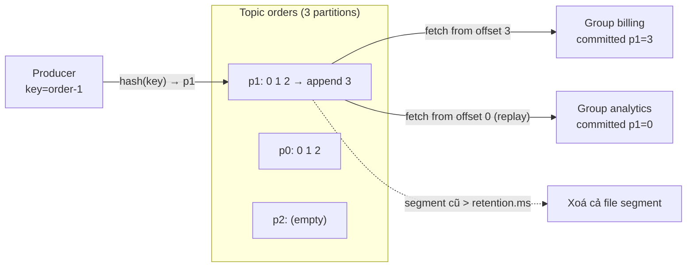
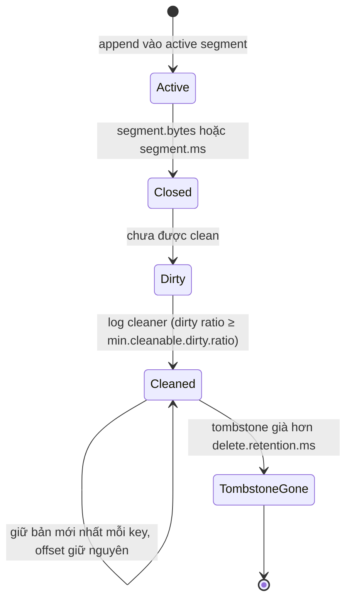

## Bối cảnh & vấn đề

Một shop online có service `orders`. Khi khách đặt hàng, ba service khác cần biết: billing tạo hoá đơn, email gửi xác nhận, analytics đếm doanh thu. Cách đầu tiên ai cũng nghĩ tới là `orders` gọi HTTP lần lượt tới ba service. Ngày email service chậm 5 giây, API đặt hàng chậm theo. Ngày analytics deploy lỗi, đặt hàng trả 500 dù tiền đã trừ. Mỗi lần thêm một service mới quan tâm tới đơn hàng, team `orders` phải sửa code và deploy.

Bước tiếp theo là một **message queue**: `orders` đẩy message "đơn mới" vào hàng đợi, các service tự lấy. Nhưng queue truyền thống (RabbitMQ classic queue, SQS) xoá message ngay khi một consumer ack. Muốn ba service cùng nhận thì phải có ba queue và broker copy message ba lần. Service thứ tư ra đời sau ba tháng muốn "đọc lại lịch sử đơn hàng từ đầu" để dựng báo cáo: không còn gì để đọc. Một bug trong billing làm sai hoá đơn 3 ngày qua: muốn xử lý lại thì dữ liệu cũng đã biến mất.

Kafka chọn một mô hình khác: **dữ liệu là một log bền, đọc không xoá**. Producer append vào cuối log; mỗi nhóm consumer tự nhớ mình đã đọc tới đâu. Thêm consumer mới không làm phiền ai; replay chỉ là "đọc lại từ vị trí cũ". Bài này giải thích mô hình đó: topic, partition, offset, segment trên đĩa, khi nào dữ liệu thực sự bị xoá (retention và compaction), và vì sao nó khác queue.

## Khái niệm

### Event, record và broker

Một **record** (hay message, event) trong Kafka gồm **key** (tuỳ chọn, bytes), **value** (bytes), **headers** (cặp key-value metadata), **timestamp**, và sau khi ghi thì có **offset**. Kafka không hiểu nội dung value: JSON, Avro, Protobuf hay bytes thô đều như nhau. Việc định nghĩa schema là của bạn ([bài 10](/tracks/messaging-kafka/learn/schema-event-design)).

**Broker** là một server Kafka: nhận record từ producer, ghi xuống đĩa, phục vụ consumer đọc. Một **cluster** thường có từ 3 broker trở lên để chịu được một broker chết. Từ Kafka 4.0, metadata của cluster (có những topic nào, partition nào nằm ở broker nào) do một nhóm **controller** chạy Raft quản lý (KRaft), không còn ZooKeeper ([bài 3](/tracks/messaging-kafka/learn/replication-durability)).

**Interview angle:** câu "Kafka là gì" tốt nhất trả lời bằng một câu: "distributed, partitioned, replicated commit log", rồi giải thích từng chữ.

### Topic và partition

**Topic** là một luồng record có tên, ví dụ `orders`, `payments`. Nhưng đơn vị lưu trữ thật không phải topic mà là **partition**: topic được chia thành N partition, mỗi partition là **một log append-only có thứ tự**, nằm trên một broker leader (và được copy sang broker khác). Topic `orders` với 3 partition thực chất là ba file log độc lập `orders-0`, `orders-1`, `orders-2`.

Vì sao phải chia? Một log duy nhất chỉ ghi được nhanh bằng một đĩa của một máy và chỉ đọc song song được bởi một consumer trong group. Chia thành partition cho ba thứ cùng lúc:

- **Scale ghi và lưu trữ**: các partition nằm rải trên nhiều broker, nên throughput và dung lượng cộng dồn.
- **Song song khi đọc**: trong một consumer group, mỗi partition được giao cho đúng một consumer, nên N partition cho phép tối đa N consumer làm việc song song ([bài 4](/tracks/messaging-kafka/learn/consumer-groups-offsets-lag)).
- **Đơn vị thứ tự**: Kafka chỉ đảm bảo thứ tự **trong một partition**. Record cùng key luôn vào cùng partition nên thứ tự theo key được giữ ([bài 2](/tracks/messaging-kafka/learn/keys-partitioning-ordering)).

Cái giá: thứ tự giữa các partition không tồn tại, và số partition khó thay đổi về sau.

**Interview angle:** follow-up kinh điển là "cái gì giới hạn số consumer song song trong một group?". Đáp: số partition; consumer thứ N+1 sẽ ngồi chơi.

### Offset

**Offset** là số thứ tự tăng dần (0, 1, 2…) của record **trong một partition**. Offset không duy nhất trong topic: `orders-0` và `orders-1` đều có offset 0. Địa chỉ đầy đủ của một record là `(topic, partition, offset)`.

Broker không theo dõi "consumer nào đã đọc record nào". Thay vào đó, mỗi **consumer group** tự lưu một con số cho mỗi partition: **committed offset**, tức offset của record **kế tiếp** cần đọc. Con số này được lưu trong topic nội bộ `__consumer_offsets`. Đây là lý do Kafka rẻ khi có nhiều consumer: trạng thái của một group trên một partition chỉ là một số nguyên, không phải một danh sách ack cho từng message.

**Interview angle:** "commit offset 1044 nghĩa là gì?" — group đã xử lý xong tới 1043 và lần sau đọc từ 1044.

### Segment, index và vì sao log nhanh

Trên đĩa, mỗi partition là một thư mục chứa các **segment**: file `.log` chứa record, kèm `.index` (offset → vị trí byte) và `.timeindex` (timestamp → offset). Chỉ segment cuối (**active segment**) được ghi; khi nó đạt `segment.bytes` (mặc định 1 GiB) hoặc `segment.ms` (mặc định 7 ngày) thì Kafka đóng nó lại và mở segment mới.

Kafka nhanh dù ghi đĩa vì: ghi **tuần tự** (append), đọc **tuần tự**, dựa nhiều vào **page cache** của OS thay vì cache riêng trong JVM, gom record thành **batch** (nén theo batch), và dùng zero-copy (`sendfile`) khi gửi dữ liệu từ page cache ra socket (không áp dụng khi bật TLS). Xoá dữ liệu cũ là xoá cả file segment, không phải xoá từng record.

**Interview angle:** "Kafka ghi đĩa mà sao nhanh?" là câu warm-up hay gặp; trả lời bằng sequential I/O + page cache + batching.

### Retention: `cleanup.policy=delete`

Đọc không xoá dữ liệu. Dữ liệu bị xoá theo **chính sách của topic**:

- `cleanup.policy=delete` (mặc định): segment đã đóng bị xoá khi record mới nhất trong nó cũ hơn `retention.ms` (mặc định 604.800.000 ms = 7 ngày), hoặc khi partition vượt `retention.bytes` (mặc định -1, không giới hạn).
- Retention tính **theo segment**, nên record có thể sống lâu hơn `retention.ms` một chút (tới khi cả segment đủ cũ).

Hệ quả thực tế: nhiều group đọc cùng dữ liệu, replay được trong cửa sổ retention, và **consumer offline lâu hơn retention sẽ mất dữ liệu**: offset đã commit trỏ vào vùng đã bị xoá, consumer rơi về `auto.offset.reset` (`latest` mặc định ở Java client, tức là bỏ qua mọi thứ ở giữa).

**Interview angle:** câu hỏi "khi nào message bị xoá" muốn nghe ba ý: không xoá khi đọc, xoá theo retention/compaction, và nguy cơ consumer chậm hơn retention.

### Log compaction và tombstone

`cleanup.policy=compact` giữ **ít nhất bản ghi mới nhất cho mỗi key** thay vì xoá theo thời gian. Một thread nền (**log cleaner**) đọc các segment đã đóng, và với mỗi key chỉ giữ record có offset lớn nhất. Topic compacted giống một bảng key-value được lưu dưới dạng log: đọc từ đầu tới cuối là dựng lại được trạng thái mới nhất của mọi key.

Muốn xoá một key, producer gửi **tombstone**: record có key K và value `null`. Compaction giữ tombstone thêm `delete.retention.ms` (mặc định 1 ngày) để consumer đang đọc chậm kịp thấy "K đã bị xoá", rồi xoá luôn cả tombstone.

Ba điều hay bị hiểu sai: compaction **không tức thì** (active segment không bao giờ bị compact, cleaner chỉ chạy khi tỷ lệ "dirty" vượt `min.cleanable.dirty.ratio`, mặc định 0.5); compaction **không đánh lại offset** (offset bị xoá để lại lỗ hổng); và có thể kết hợp `compact,delete` để vừa giữ bản mới nhất vừa giới hạn tuổi.

**Interview angle:** "dùng compacted topic khi nào thay vì bảng DB?" — khi nhiều service cần dựng lại state cục bộ (cache, KTable) từ cùng một nguồn và muốn nhận cả luồng thay đổi, không chỉ snapshot.

### Queue truyền thống vs log

Với queue (RabbitMQ classic, SQS), broker giữ **trạng thái từng message**: ready, đang giao (unacked), đã ack (xoá). Mỗi message thường tới một consumer; nhiều consumer cạnh tranh trên một queue và song song **theo message**. Không replay.

Với Kafka, broker không biết ai đã đọc gì; consumer giữ offset. Song song **theo partition**, nhiều group độc lập đọc cùng dữ liệu, replay được. Cái Kafka mất là **ack từng message**: không thể "bỏ qua message 5, retry riêng nó sau" mà không tự xây cơ chế (retry topic, [bài 8](/tracks/messaging-kafka/learn/errors-retries-dlq)). Từ Kafka 4.2, **share groups** (KIP-932) bổ sung ngữ nghĩa queue ngay trong Kafka ([bài 12](/tracks/messaging-kafka/learn/kafka-vs-queues)).

| Khái niệm | Một câu | Ví dụ |
| --- | --- | --- |
| Partition | Log append-only có thứ tự, đơn vị song song và ordering | `orders-1` |
| Offset | Vị trí record trong partition; group commit "offset kế tiếp" | group `billing` ở 1044 của p1 |
| Segment | File log trên đĩa; xoá theo segment | `00000000000000000000.log` |
| Retention | Xoá segment cũ theo thời gian/dung lượng | `retention.ms=604800000` |
| Compaction | Giữ bản mới nhất theo key | `customer-state` |
| Tombstone | Value `null` để xoá key | `c-3 → null` |

## Cơ chế hoạt động

Đường đi của một record, từ producer tới hai consumer group độc lập:



1. Producer chọn partition (theo key, [bài 2](/tracks/messaging-kafka/learn/keys-partitioning-ordering)) và gửi batch tới **leader** của partition đó.
2. Leader append batch vào active segment, gán offset liên tiếp, và (với `acks=all`) chờ follower trong ISR copy xong rồi mới ack ([bài 3](/tracks/messaging-kafka/learn/replication-durability)).
3. Mỗi group gửi `Fetch` từ offset của riêng nó. `billing` đang ở offset 3 nên nhận record mới; `analytics` vừa reset về 0 nên đọc lại cả lịch sử. Hai group không ảnh hưởng nhau.
4. Sau khi xử lý, group commit offset mới vào `__consumer_offsets`.
5. Độc lập với mọi consumer, broker định kỳ kiểm tra segment đã đóng: với `delete` thì xoá segment quá hạn; với `compact` thì log cleaner viết lại segment chỉ giữ bản mới nhất của mỗi key.

Vòng đời của dữ liệu trong một partition compacted:



Điểm quan trọng của sơ đồ thứ hai: record nằm trong active segment không bao giờ bị compact. Đó là lý do một consumer đọc từ đầu topic compacted vẫn có thể thấy nhiều giá trị cho cùng key: bản cũ đã được clean, bản mới vẫn ở segment đang mở.

## Ví dụ thực tế

Các output dưới đây chạy thật trên cụm 3 broker `apache/kafka:4.2.0` (KRaft, Docker), client `kafkajs@2.2.4` trên Node 24.

### Tạo topic và xem partition nằm ở đâu

```bash
kafka-topics.sh --bootstrap-server k1:9092 --create --topic orders --partitions 3 --replication-factor 3
kafka-topics.sh --bootstrap-server k1:9092 --describe --topic orders
```

```text
Created topic orders.
Topic: orders   TopicId: Lthb3MExRTy46Iw9ZHINNg PartitionCount: 3   ReplicationFactor: 3    Configs: min.insync.replicas=1
    Topic: orders   Partition: 0    Leader: 3   Replicas: 3,1,2 Isr: 3,1,2  Elr:    LastKnownElr: 
    Topic: orders   Partition: 1    Leader: 1   Replicas: 1,2,3 Isr: 1,2,3  Elr:    LastKnownElr: 
    Topic: orders   Partition: 2    Leader: 2   Replicas: 2,3,1 Isr: 2,3,1  Elr:    LastKnownElr: 
```

Ba partition có leader ở ba broker khác nhau, nên tải ghi chia đều. Cột `Elr` (eligible leader replicas, KIP-966) mới xuất hiện ở Kafka 4.x (verify theo version của bạn).

### Produce theo key: offset là theo partition

```ts
const events = [
  ["order-1", "created"], ["order-2", "created"], ["order-1", "paid"],
  ["order-3", "created"], ["order-1", "shipped"], ["order-2", "paid"],
];
for (const [key, type] of events) {
  const [r] = await producer.send({ topic: "orders", messages: [{ key, value: JSON.stringify({ orderId: key, type }) }] });
  console.log(`${key.padEnd(8)} ${type.padEnd(8)} -> partition ${r.partition} offset ${r.baseOffset}`);
}
```

```text
order-1  created  -> partition 1 offset 0
order-2  created  -> partition 0 offset 0
order-1  paid     -> partition 1 offset 1
order-3  created  -> partition 0 offset 1
order-1  shipped  -> partition 1 offset 2
order-2  paid     -> partition 0 offset 2
```

Ba event của `order-1` cùng vào partition 1 với offset 0, 1, 2 theo đúng thứ tự gửi. Partition 0 cũng có offset 0, 1, 2 của riêng nó. Partition 2 trống: chỉ có ba key, và hash của chúng không rơi vào p2. Với key cardinality thấp, phân bố lệch là bình thường.

### Hai group đọc cùng dữ liệu, đọc lại không xoá

```bash
for g in billing email; do
  kafka-console-consumer.sh --bootstrap-server k1:9092 --topic orders --group $g --from-beginning \
    --property print.partition=true --property print.offset=true --property print.key=true --timeout-ms 5000
done
```

```text
== group billing
Partition:0 Offset:0    order-2 {"orderId":"order-2","type":"created"}
Partition:0 Offset:1    order-3 {"orderId":"order-3","type":"created"}
Partition:0 Offset:2    order-2 {"orderId":"order-2","type":"paid"}
Partition:1 Offset:0    order-1 {"orderId":"order-1","type":"created"}
Partition:1 Offset:1    order-1 {"orderId":"order-1","type":"paid"}
Partition:1 Offset:2    order-1 {"orderId":"order-1","type":"shipped"}
== group email
(cùng 6 record như trên)
== again billing
Processed a total of 0 messages
```

Group `email` nhận đủ 6 record dù `billing` đã đọc trước. Chạy lại `billing` thì không nhận gì, vì group đã commit offset 3 cho mỗi partition có dữ liệu:

```text
GROUP    TOPIC   PARTITION  CURRENT-OFFSET  LOG-END-OFFSET  LAG
billing  orders  0          3               3               0
billing  orders  1          3               3               0
billing  orders  2          0               0               0
```

Trên đĩa của broker 1 (leader của p1), partition là một thư mục với segment đầu tiên tên theo base offset:

```text
$ ls -l /tmp/kafka-logs/orders-1/
-rw-r--r-- 1 appuser appuser 10485760 00000000000000000000.index
-rw-r--r-- 1 appuser appuser      336 00000000000000000000.log
-rw-r--r-- 1 appuser appuser 10485756 00000000000000000000.timeindex
-rw-r--r-- 1 appuser appuser        8 leader-epoch-checkpoint
-rw-r--r-- 1 appuser appuser       43 partition.metadata
```

File `.log` chỉ 336 byte cho 3 record; file index được cấp phát trước 10 MB (`segment.index.bytes`) và được cắt gọn khi segment đóng.

### Compaction và tombstone, quan sát thật

Topic compacted với segment ngắn để cleaner chạy nhanh trong demo (giá trị production để mặc định):

```bash
kafka-topics.sh --create --topic customer-state --partitions 1 --replication-factor 3 \
  --config cleanup.policy=compact --config segment.ms=1000 \
  --config min.cleanable.dirty.ratio=0.01 --config delete.retention.ms=1000
```

```ts
await send("c-1", '{"tier":"silver"}');
await send("c-2", '{"tier":"gold"}');
await send("c-1", '{"tier":"gold"}');
await send("c-3", '{"tier":"silver"}');
await send("c-1", '{"tier":"platinum"}');
await send("c-3", null); // tombstone: delete c-3
```

Đọc ngay sau khi gửi (mọi thứ còn ở active segment):

```text
Offset:0    c-1 {"tier":"silver"}
Offset:1    c-2 {"tier":"gold"}
Offset:2    c-1 {"tier":"gold"}
Offset:3    c-3 {"tier":"silver"}
Offset:4    c-1 {"tier":"platinum"}
Offset:5    c-3 null
```

Gửi thêm một record để segment cũ được đóng, chờ ~40 giây cho cleaner:

```text
Offset:1    c-2 {"tier":"gold"}
Offset:4    c-1 {"tier":"platinum"}
Offset:5    c-3 null
Offset:6    c-4 {"tier":"silver"}
```

`c-1` chỉ còn bản mới nhất ở offset 4; offset 0, 2, 3 biến mất nhưng **offset không bị đánh lại**. Tombstone của `c-3` vẫn còn (được giữ thêm `delete.retention.ms`). Sau thêm hai record `c-4` và một lượt clean nữa:

```text
Offset:1    c-2 {"tier":"gold"}
Offset:4    c-1 {"tier":"platinum"}
Offset:7    c-4 {"tier":"gold1"}
Offset:8    c-4 {"tier":"gold2"}
```

Tombstone đã bị xoá hẳn: `c-3` không còn dấu vết. Và `c-4` xuất hiện **hai lần** (`gold1` ở segment đã đóng, `gold2` ở active segment). Đây đúng là tình huống của follow-up "consumer đọc từ offset 0 của topic compacted thấy hai giá trị cho cùng key": consumer phải coi topic compacted như luồng upsert (bản sau ghi đè bản trước), không phải tập key duy nhất.

## Trade-offs & lựa chọn thay thế

| Tiêu chí | `cleanup.policy=delete` | `cleanup.policy=compact` | `compact,delete` | Queue truyền thống |
| --- | --- | --- | --- | --- |
| Dữ liệu giữ lại | Mọi record trong cửa sổ thời gian/dung lượng | Bản mới nhất mỗi key (vô hạn) | Bản mới nhất mỗi key, tối đa N ngày | Tới khi ack |
| Replay | Trong retention | Dựng lại state đầy đủ | Dựng lại state gần đây | Không |
| Dung lượng | Tỷ lệ với throughput × retention | Tỷ lệ với số key | Cả hai giới hạn | Tỷ lệ với backlog |
| Dùng cho | Event stream (orders, clicks) | State/changelog (profile, config, KTable) | Cache có hạn sử dụng | Task phân phối, ack từng việc |
| Rủi ro | Consumer chậm hơn retention mất dữ liệu | Key không bao giờ xoá nếu quên tombstone | Mất key cũ không cập nhật | Không có lịch sử |

Chọn thế nào: event mô tả **việc đã xảy ra** (OrderPlaced, PaymentFailed) dùng `delete` với retention đủ dài để replay khi có bug (3–14 ngày là phổ biến; dài hơn thì cân nhắc tiered storage hoặc archive ra S3). Topic mô tả **trạng thái hiện tại theo key** (customer profile, product catalog, feature flag) dùng `compact` để service mới bootstrap được state mà không cần gọi API của owner. Khi state chỉ có giá trị trong một khoảng thời gian (session, giá khuyến mãi), `compact,delete` giới hạn cả hai chiều.

So với bảng DB: compacted topic không thay được DB cho truy vấn (không có index, không query theo field). Nó thắng ở chỗ phân phối **luồng thay đổi** tới nhiều consumer, mỗi consumer giữ bản sao riêng theo dạng nó cần.

## Edge cases & failure modes

- **Consumer offline lâu hơn retention**: offset commit trỏ vào vùng đã xoá; consumer nhảy theo `auto.offset.reset` (`latest` = bỏ qua dữ liệu, `earliest` = đọc lại từ record cũ nhất còn lại). Cả hai đều âm thầm; cần alert khi lag tiến gần retention ([bài 4](/tracks/messaging-kafka/learn/consumer-groups-offsets-lag)).
- **Committed offset của group cũng hết hạn**: offset của group không hoạt động bị xoá sau `offsets.retention.minutes` (mặc định 7 ngày). Group quay lại sau 2 tuần cũng rơi vào `auto.offset.reset`.
- **Retention theo segment**: topic ít traffic có segment không bao giờ đầy; nếu `segment.ms` lớn, dữ liệu sống lâu hơn `retention.ms` nhiều. Ngược lại, với yêu cầu xoá dữ liệu (GDPR), "xoá trong 7 ngày" phải tính cả `segment.ms`.
- **Compaction chậm hoặc không chạy**: cleaner thread chết (log báo lỗi), dirty ratio chưa đạt, hoặc active segment quá to. Topic compacted phình như topic thường.
- **Quên tombstone**: key đã xoá ở nguồn vẫn sống mãi trong topic compacted; consumer dựng lại state sẽ hồi sinh dữ liệu đã xoá.
- **Record lớn**: mặc định broker nhận batch tối đa ~1 MB (`message.max.bytes`). Payload lớn (file, ảnh) nên để ở S3 và gửi tham chiếu.
- **Quá nhiều partition**: mỗi partition là thư mục + file handle + replica fetch; hàng trăm nghìn partition làm failover và metadata nặng hơn, kể cả với KRaft.

## Pitfalls

- ❌ "Consumer đọc xong thì Kafka xoá message" → ✅ đọc không xoá; xoá theo `cleanup.policy`. Nhiều group đọc độc lập, replay được.
- ❌ "Offset là ID duy nhất của message trong topic" → ✅ offset chỉ duy nhất trong một partition; dùng `(topic, partition, offset)` hoặc `event_id` riêng để định danh.
- ❌ Dùng compacted topic như tập key không trùng → ✅ consumer xử lý như upsert; có thể thấy nhiều bản của một key.
- ❌ Xoá key bằng cách "không gửi nữa" → ✅ gửi tombstone (value `null`), và nhớ tombstone cũng bị xoá sau `delete.retention.ms`.
- ❌ Retention 1 giờ "cho nhẹ đĩa" → ✅ retention phải dài hơn thời gian tối đa bạn cần để phát hiện bug và replay (thường vài ngày); đĩa rẻ hơn mất dữ liệu.
- ❌ Bật `auto.create.topics.enable` trong production → ✅ tạo topic có chủ đích (số partition, RF, retention); topic tự tạo dùng default (RF có thể là 1).
- ❌ Coi Kafka như queue giao việc với ack từng message → ✅ Kafka ack theo offset liên tục; việc cần ack/retry riêng lẻ cần retry topic, share group hoặc queue thật.

## Tóm tắt

- Kafka là distributed, partitioned, replicated commit log: producer append, consumer đọc theo offset, đọc không xoá.
- Topic chia thành partition; partition là đơn vị lưu trữ, song song và thứ tự. Thứ tự chỉ có trong partition.
- Offset là vị trí trong partition; consumer group commit "offset kế tiếp cần đọc" vào `__consumer_offsets`.
- Partition là các segment trên đĩa; ghi/đọc tuần tự + page cache + batching làm Kafka nhanh; xoá theo segment.
- `delete`: xoá theo `retention.ms`/`retention.bytes`; consumer chậm hơn retention mất dữ liệu.
- `compact`: giữ bản mới nhất mỗi key, không tức thì, không đánh lại offset; tombstone (`null`) để xoá key.
- So với queue: Kafka mất ack từng message nhưng được replay, nhiều group độc lập và throughput cao.
