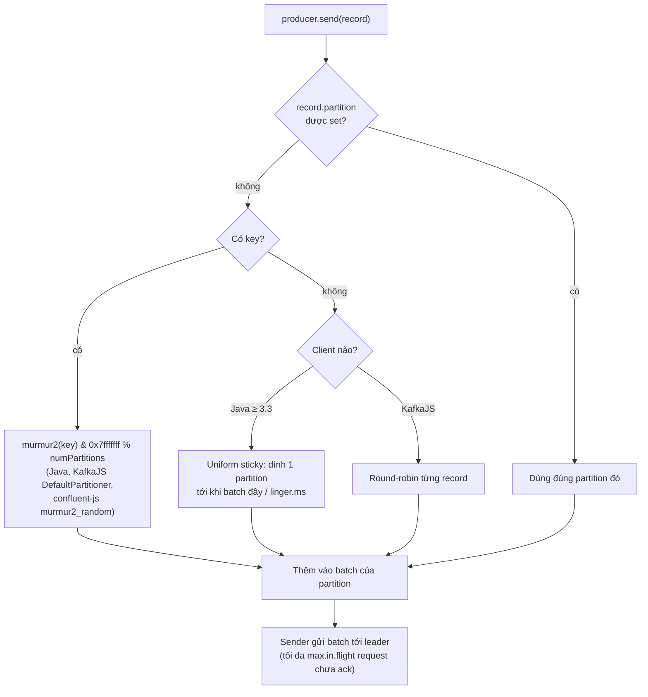
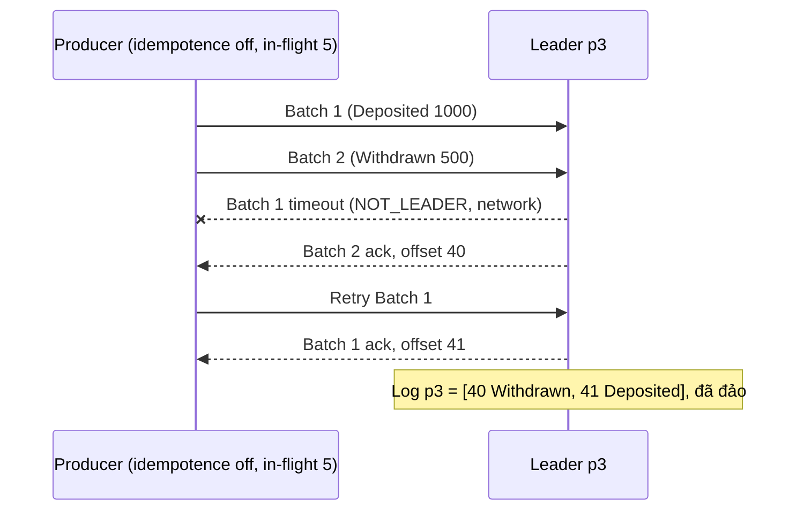

## Bối cảnh & vấn đề

Service ví điện tử publish event `Deposited`, `Withdrawn` cho mỗi tài khoản vào topic `account-events` (12 partition). Consumer tính số dư theo thứ tự event. Một ngày support báo: tài khoản A có số dư âm trong vài giây rồi tự đúng lại. Log consumer cho thấy `Withdrawn 500` được xử lý **trước** `Deposited 1000` dù producer gửi deposit trước.

Điều tra ra hai lỗi chồng lên nhau. Thứ nhất, producer gửi với **key null** (account id chỉ nằm trong payload), nên hai event rơi vào hai partition khác nhau và được hai consumer xử lý song song. Thứ hai, producer cấu hình `enable.idempotence=false` với `max.in.flight.requests.per.connection=5`, nên ngay cả khi cùng partition, một batch retry có thể ghi sau batch gửi sau nó.

Thứ tự trong Kafka không phải "có sẵn". Nó là hệ quả của ba quyết định: **key** của record, **partitioner** biến key thành partition, và cấu hình **producer** khi retry. Bài này đi qua cả ba, cộng thêm hai câu hỏi thiết kế luôn đi kèm: chọn bao nhiêu partition, và làm gì khi một key quá nóng.

## Khái niệm

### Ordering guarantee của Kafka

Kafka đảm bảo: trong **một partition**, record được append theo thứ tự broker nhận được, và consumer đọc đúng thứ tự offset. Giữa các partition thì **không có thứ tự nào**: p0 có thể được đọc nhanh hơn p1, và hai consumer khác nhau xử lý chúng song song.

Vì vậy câu hỏi "Kafka có giữ thứ tự không" phải trả lời bằng "giữ thứ tự **theo cái gì**". Muốn mọi event của một tài khoản đúng thứ tự, mọi event đó phải vào cùng partition. Cách chuẩn để đạt được điều đó là dùng account id làm **key**.

**Interview angle:** câu trả lời mạnh nói rõ phạm vi (per partition), cơ chế (key → partition), và điều kiện (số partition không đổi, producer không reorder khi retry).

### Key và default partitioner

Khi record có key, partitioner mặc định của Java client tính `toPositive(murmur2(keyBytes)) % numPartitions`. Hàm hash là deterministic, nên cùng key luôn ra cùng partition **chừng nào số partition không đổi**. KafkaJS có `DefaultPartitioner` tương thích Java (murmur2), và `@confluentinc/kafka-javascript` ở chế độ KafkaJS-compatible đặt `partitioner=murmur2_random`. Riêng librdkafka "thuần" (dùng trực tiếp, hoặc client Go/Python/.NET dựa trên nó) mặc định là `consistent_random` (CRC32), tức **cùng key có thể ra partition khác** so với Java (verify với client và version của bạn).

Hệ quả: nếu hai service khác ngôn ngữ cùng produce vào một topic với cùng key mà dùng partitioner khác nhau, thứ tự theo key bị phá mà không ai thấy lỗi. Khi topic có nhiều producer, hãy thống nhất partitioner.

**Interview angle:** "hai producer Node và Go cùng ghi một topic, event một order bị đảo thứ tự" là gotcha thật; đáp án là partitioner khác nhau.

### Key null: round-robin và sticky

Không có key thì không có thứ tự theo entity; partitioner chỉ cần chia tải. Java client từ 2.4 dùng **sticky partitioner** (KIP-480): gom các record key null vào **một** partition cho tới khi batch đầy hoặc `linger.ms` hết, rồi chuyển partition khác. Lý do: batch to hơn, ít request hơn, latency thấp hơn so với rải từng record ra mọi partition. Từ 3.3 nó được thay bằng bản "uniform sticky" (KIP-794) để chia đều hơn giữa broker nhanh và chậm.

KafkaJS thì khác: key null được chia **round-robin** từng record. Kết quả đều nhau, nhưng batch nhỏ hơn. Dù thuật toán nào, nguyên tắc vẫn là: cần thứ tự thì đừng để key null.

**Interview angle:** "sticky partitioner để làm gì?" — tăng kích thước batch cho record không key, không phải để giữ thứ tự.

### Chọn key

Key là **đơn vị cần giữ thứ tự**, đồng thời là đơn vị phân tải. Ba câu hỏi để chọn:

1. **Logic nào phụ thuộc thứ tự?** Nếu consumer là state machine của một đơn hàng (created → paid → shipped), key = `orderId`. Nếu logic phụ thuộc mọi đơn của một khách (hạn mức tín dụng), key = `customerId`.
2. **Phân bố có đều không?** Key cardinality thấp (5 region) hoặc lệch (một tenant chiếm 60%) sinh **hot partition**.
3. **Key còn dùng cho gì?** Với topic compacted, key là đơn vị giữ bản mới nhất ([bài 1](/tracks/messaging-kafka/learn/log-topics-partitions)); consumer cũng thường dùng key để partition cache nội bộ hoặc dedupe.

Quy tắc nhanh: key càng **hẹp** (order thay vì tenant) thì phân bố càng đều và song song càng cao, đổi lại phạm vi thứ tự hẹp hơn. Chọn phạm vi hẹp nhất mà business vẫn đúng.

**Interview angle:** follow-up "một tenant tạo 60% event, dùng tenantId làm key thì sao?" — một partition gánh 60% tải, một consumer làm 60% việc, lag dồn vào đó.

### Hot partition

**Hot partition** là partition nhận tải lớn hơn hẳn phần còn lại. Nó giới hạn cả hệ thống ở tốc độ của **một** consumer và **một** leader broker: thêm consumer không giúp gì, vì partition đó vẫn chỉ có một consumer trong group. Triệu chứng điển hình: lag chỉ tăng ở một partition, CPU của một pod consumer 100% trong khi các pod khác rảnh.

Nguyên nhân thường gặp: key cardinality thấp, một key "siêu lớn" (tenant lớn, sản phẩm flash sale, user bot), hoặc key null với partitioner lỗi. Cách chữa phụ thuộc vào ràng buộc thứ tự, xem mục Trade-offs.

**Interview angle:** interviewer muốn nghe bạn hỏi lại "cần thứ tự theo tenant hay theo entity?" trước khi đề xuất giải pháp.

### Số partition

Số partition là **trần song song** của một consumer group. Ước lượng thô: `partitions ≥ max(throughput mục tiêu / throughput một consumer xử lý được, throughput mục tiêu / throughput một partition ghi được)`, cộng headroom cho tăng trưởng 1–2 năm. Thường consumer là nút thắt: nếu một consumer xử lý 500 msg/s (gọi DB, API) và mục tiêu là 5.000 msg/s lúc cao điểm, cần ít nhất 10 partition; chọn 12 hoặc 24 để còn chỗ.

Quá nhiều partition cũng có giá: mỗi partition tốn file handle, bộ nhớ đệm phía producer (một batch mỗi partition), replica fetch giữa broker, thời gian leader election và rebalance. Hàng chục tới vài trăm partition mỗi topic là bình thường; hàng nghìn cho một topic cần lý do.

**Interview angle:** câu hỏi "tăng partition sau này có sao không?" là cái bẫy: được, nhưng không giảm được và phá mapping key.

### Tăng partition phá mapping key

Kafka cho tăng số partition của topic đang chạy (`kafka-topics --alter --partitions`), **không cho giảm**. Vì partition = `hash % N`, đổi N làm phần lớn key đổi partition. Record cũ của key K nằm ở p9, record mới vào p5. Hai consumer khác nhau có thể xử lý chúng cùng lúc, và consumer của p5 có thể xử lý record mới trước khi consumer của p9 xử lý xong record cũ (nếu p9 đang lag). Thứ tự theo key bị phá trong giai đoạn chuyển tiếp.

Consumer có **state theo partition** (cache cục bộ, Kafka Streams state store) còn bị ảnh hưởng nặng hơn: state của K nằm ở instance đang giữ p9.

**Interview angle:** cách migrate an toàn được hỏi ở follow-up; xem Trade-offs.

### Producer reorder khi retry

Ngay cả khi key đúng, producer vẫn có thể đảo thứ tự **trong một partition**. Producer gửi nhiều request tới broker mà không chờ ack (`max.in.flight.requests.per.connection`, mặc định 5). Nếu batch 1 lỗi tạm thời (leader đổi, timeout) còn batch 2 thành công, batch 1 được retry và ghi **sau** batch 2.

**Idempotent producer** (`enable.idempotence=true`) chữa điều này: broker kiểm tra sequence number theo partition và từ chối batch nhảy cóc, nên thứ tự được giữ với tối đa 5 request in-flight ([bài 7](/tracks/messaging-kafka/learn/idempotent-producer-transactions)). Java client bật idempotence mặc định từ 3.0, **nhưng chỉ khi bạn không tự đặt config xung đột**: ghi tường minh `enable.idempotence=false` là tắt nó. KafkaJS và `@confluentinc/kafka-javascript` thì **không** bật idempotence mặc định (đo thật ở bài 7).

**Interview angle:** debug question về config producer luôn có ba lớp: key, idempotence + in-flight, và `acks`.

## Cơ chế hoạt động

Quyết định partition cho một record:



Batch được gom theo partition. Sender thread gửi batch khi đầy (`batch.size`, 16 KB mặc định) hoặc khi `linger.ms` hết. Sơ đồ dưới cho thấy vì sao in-flight > 1 mà không có idempotence thì đảo thứ tự:



Với idempotence bật, broker thấy batch 2 có sequence lớn hơn sequence kỳ vọng (batch 1 chưa tới) và trả `OUT_OF_ORDER_SEQUENCE_NUMBER`; producer gửi lại theo đúng thứ tự, nên log giữ `Deposited` trước `Withdrawn`.

## Ví dụ thực tế

Chạy thật trên Kafka 4.2.0 (3 broker), `kafkajs@2.2.4`, `@confluentinc/kafka-javascript@1.10.1` (librdkafka 2.15.1), Node 24.

### Cùng key, ba client, cùng partition

```ts
const keys = ["acc-1", "acc-2", "acc-3", "acc-42"];
// kafkajs with DefaultPartitioner (murmur2)
for (const key of keys) {
  const [r] = await kafkajsProducer.send({ topic: "accounts", messages: [{ key, value: "x" }] });
  console.log(`kafkajs          key=${key.padEnd(6)} -> p${r.partition}`);
}
// @confluentinc/kafka-javascript, KafkaJS-compatible API, defaults
for (const key of keys) {
  const [r] = await confluentProducer.send({ topic: "accounts", messages: [{ key, value: "x" }] });
  console.log(`confluent-js     key=${key.padEnd(6)} -> p${r.partition}`);
}
```

```text
kafkajs          key=acc-1  -> p9
kafkajs          key=acc-2  -> p8
kafkajs          key=acc-3  -> p11
kafkajs          key=acc-42 -> p1
confluent-js     key=acc-1  -> p9
confluent-js     key=acc-2  -> p8
confluent-js     key=acc-3  -> p11
confluent-js     key=acc-42 -> p1
```

Và Java `kafka-console-producer` vào một topic 12 partition khác:

```text
Partition:9 acc-1   x
Partition:8 acc-2   x
Partition:11    acc-3   x
Partition:1 acc-42  x
```

Ba client cho cùng mapping vì cùng murmur2. Nếu một producer Go dùng librdkafka mặc định (`consistent_random`), mapping sẽ khác (không chạy ở đây, verify).

### Tăng partition: bao nhiêu key đổi chỗ

Gọi thẳng `DefaultPartitioner` của KafkaJS cho 100.000 key:

```ts
const partitioner = Partitioners.DefaultPartitioner();
const partitionFor = (key: string, n: number) =>
  partitioner({ topic: "t", message: { key, value: null },
    partitionMetadata: Array.from({ length: n }, (_, i) => ({ partitionId: i, leader: 0 })) as any });

for (const [from, to] of [[12, 16], [12, 24], [12, 13]]) {
  let moved = 0;
  for (let i = 0; i < N; i++) if (partitionFor(`acc-${i}`, from) !== partitionFor(`acc-${i}`, to)) moved++;
  console.log(`${from} -> ${to} partitions: ${((moved / N) * 100).toFixed(1)}% of keys change partition`);
}
```

```text
12 -> 16 partitions: 75.2% of keys change partition
12 -> 24 partitions: 50.3% of keys change partition
12 -> 13 partitions: 92.5% of keys change partition
```

Gấp đôi (12 → 24) là trường hợp "nhẹ" nhất: một nửa key ở lại, nửa kia chuyển sang partition mới tương ứng. Thêm một partition (12 → 13) làm 92,5% key đổi chỗ. Trên topic thật:

```bash
kafka-topics.sh --alter --topic accounts --partitions 16
kafka-topics.sh --alter --topic accounts --partitions 8
```

```text
Error while executing topic command : The topic accounts currently has 16 partition(s); 8 would not be an increase.
```

Gửi lại cùng bốn key sau khi lên 16 partition:

```text
kafkajs          key=acc-1  -> p5
kafkajs          key=acc-2  -> p4
kafkajs          key=acc-3  -> p15
kafkajs          key=acc-42 -> p13
```

`acc-1` trước ở p9, giờ ở p5. Lịch sử cũ của `acc-1` vẫn nằm ở p9.

### Hot tenant: đo độ lệch

100.000 event, 60% từ tenant `big`, phần còn lại rải trên 200 tenant nhỏ, topic 12 partition:

```ts
const tenantOf = (i: number) => (i % 10 < 6 ? "big" : `t-${i % 200}`);
console.log("key = tenantId          ", counts(tenantOf));
console.log("key = tenantId:orderId  ", counts((i) => `${tenantOf(i)}:order-${i}`));
```

```text
key = tenantId           max partition share = 62.0% (ideal 8.3%)
key = tenantId:orderId   max partition share = 8.5% (ideal 8.3%)
```

Với key = tenant, một partition gánh 62% tải: consumer của partition đó làm việc gấp 7,5 lần phần trung bình. Đổi key sang `tenantId:orderId` (thứ tự theo đơn, không theo tenant) đưa partition nặng nhất về 8,5%, gần lý tưởng.

Độ lệch xuất hiện cả khi key không có tenant lớn mà chỉ có **ít key**: topic `clicks` 3 partition nhận 900 event từ 30 user cho kết quả `p0=510, p1=240, p2=150` (đo thật ở [bài 4](/tracks/messaging-kafka/learn/consumer-groups-offsets-lag)).

### Sửa config producer gây đảo thứ tự

Config lỗi (từ câu debug của track):

```properties
acks=1
enable.idempotence=false
retries=2147483647
max.in.flight.requests.per.connection=5
# key = null, account id is only in the payload
```

Config đã sửa (Java client; với KafkaJS là `idempotent: true` và key trong `messages`):

```properties
acks=all
enable.idempotence=true
max.in.flight.requests.per.connection=5   # ≤ 5 is required for idempotence
retries=2147483647
delivery.timeout.ms=120000
# producer.send(new ProducerRecord<>("account-events", accountId, payload))
```

Phía consumer cũng cần giữ thứ tự: xử lý tuần tự trong một partition (hoặc song song nhưng tuần tự theo key), và không đẩy một event của key sang retry topic trong khi tiếp tục xử lý event sau của cùng key ([bài 8](/tracks/messaging-kafka/learn/errors-retries-dlq)).

## Trade-offs & lựa chọn thay thế

Chữa hot partition, theo ràng buộc thứ tự:

| Cách | Giữ thứ tự theo | Phân bố | Chi phí | Khi nào |
| --- | --- | --- | --- | --- |
| Đổi key sang entity (`orderId`, `tenantId:orderId`) | Entity | Đều | Thấp, nhưng phải migrate key | Business chỉ cần thứ tự theo entity |
| Key salting (`tenant#0..N-1`) | Từng salt (mất thứ tự theo tenant) | Đều hơn N lần | Consumer phải gộp lại nếu cần | Event độc lập, chỉ cần chia tải |
| Topic riêng cho tenant lớn | Tenant (trong topic riêng) | Tenant lớn có partition/consumer riêng | Thêm topic, routing ở producer | Tenant lớn có SLA riêng, compliance |
| Custom partitioner (gán dải partition cho tenant lớn) | Phụ thuộc thiết kế | Tuỳ chỉnh | Mọi producer phải dùng chung code | Ít khi đáng: dễ lệch giữa các producer |
| Tối ưu consumer của partition nóng | Tenant | Vẫn lệch | Thấp | Khi chưa đổi được key |

Chọn số partition:

| | Ít partition (3–6) | Vừa (12–48) | Rất nhiều (hàng trăm+) |
| --- | --- | --- | --- |
| Song song consumer | Thấp | Đủ cho đa số service | Rất cao |
| Rebalance, failover | Nhanh | Ổn | Chậm hơn, metadata nặng |
| Batch producer | Batch to | Ổn | Batch nhỏ, nhiều request |
| Rủi ro | Phải tăng sau (phá key) | Cân bằng | Lãng phí tài nguyên |

Chọn thế nào: bắt đầu từ ràng buộc business về thứ tự, chọn key hẹp nhất có thể, rồi over-provision partition vừa phải ngay từ đầu (thường 12–48, chọn số có nhiều ước như 12, 24, 48 để chia đều cho số consumer). Khi buộc phải tăng partition trên topic có key và thứ tự quan trọng, hai cách an toàn:

1. **Topic mới + chuyển đổi có kiểm soát**: tạo `account-events.v2` với số partition mới; producer chuyển sang ghi v2; consumer đọc hết v1 (lag = 0) rồi mới bắt đầu v2. Thứ tự theo key giữ được vì không có giai đoạn hai partition cùng chứa event mới của một key.
2. **Tạm dừng producer** cho tới khi consumer đọc hết partition cũ, tăng partition, rồi mở lại. Đơn giản nhưng có downtime ghi.

Nếu consumer idempotent và có version check theo entity ([bài 6](/tracks/messaging-kafka/learn/delivery-semantics-idempotency)), event đến lệch thứ tự trong giai đoạn chuyển tiếp sẽ bị bỏ qua đúng cách, nên tăng partition trực tiếp có thể chấp nhận được.

## Edge cases & failure modes

- **Partition không có leader**: với key, partitioner Java vẫn chọn partition theo hash (không né), nên record chờ tới khi có leader hoặc hết `delivery.timeout.ms`. Với key null, KafkaJS chỉ round-robin trên partition còn leader.
- **Custom partition id cố định** (`message.partition`): bỏ qua mọi partitioner. Hữu ích cho test, nguy hiểm khi số partition thay đổi.
- **Metadata cũ**: producer cache metadata (`metadata.max.age.ms`, 5 phút); ngay sau khi tăng partition, producer cũ có thể vẫn hash theo N cũ một lúc, rồi đổi. Giai đoạn chuyển tiếp không phải một thời điểm.
- **Key là object JSON**: `JSON.stringify` không ổn định thứ tự field giữa các service; `{"a":1,"b":2}` và `{"b":2,"a":1}` là hai key khác nhau. Dùng string id.
- **Key encoding khác nhau**: `"123"` (string) và số 123 được serialize thành bytes khác nhau, hash khác nhau.
- **Retry ở tầng app**: app tự `send()` lại sau lỗi (không phải retry của producer) vẫn có thể đảo thứ tự và tạo trùng, idempotence không giúp vì đó là record mới.
- **Một key quá lớn** (bot gửi 10.000 event/s cho một user): không có key design nào chia nhỏ được mà giữ thứ tự cho user đó; cần rate limit ở nguồn hoặc lọc trước.

## Pitfalls

- ❌ Để key null rồi mong thứ tự theo entity → ✅ key = entity id cần giữ thứ tự.
- ❌ Chọn key rộng nhất "cho chắc" (`tenantId`) → ✅ chọn key hẹp nhất mà business vẫn đúng (`orderId` hoặc `tenantId:orderId`), để tránh hot partition.
- ❌ Tăng partition trên topic có key như một thao tác vận hành bình thường → ✅ coi đó là migration: topic mới hoặc dừng producer, hoặc consumer có version check.
- ❌ `enable.idempotence=false` + `max.in.flight > 1` + retry → ✅ bật idempotence (in-flight ≤ 5), hoặc in-flight = 1 nếu client không hỗ trợ.
- ❌ Hai producer khác ngôn ngữ cùng topic, partitioner khác nhau → ✅ thống nhất murmur2 (librdkafka: `partitioner=murmur2_random`).
- ❌ Thêm consumer để chữa lag ở một partition nóng → ✅ một partition chỉ có một consumer; phải chữa key hoặc tốc độ xử lý.
- ❌ Số partition = số consumer hiện tại → ✅ over-provision cho tăng trưởng, chọn số nhiều ước (12, 24, 48).

## Tóm tắt

- Kafka chỉ giữ thứ tự trong một partition; key quyết định partition, nên chọn key là chọn đơn vị thứ tự và đơn vị song song.
- Default partitioner: `murmur2(key) % N` (Java, KafkaJS, confluent-js compat); librdkafka thuần mặc định CRC32, mapping khác.
- Key null: Java dùng sticky (batch to), KafkaJS round-robin; không có thứ tự theo entity.
- Hot partition giới hạn hệ thống ở tốc độ một consumer; chữa bằng key hẹp hơn, salting (mất thứ tự), hoặc topic riêng.
- Tăng partition không giảm được và đổi mapping của phần lớn key (12 → 16: 75%); migrate bằng topic mới hoặc dừng producer.
- Producer có thể đảo thứ tự khi retry nếu tắt idempotence với in-flight > 1; idempotent producer giữ thứ tự với in-flight ≤ 5.
- Số partition = trần song song của group; ước lượng từ throughput của consumer, cộng headroom.
