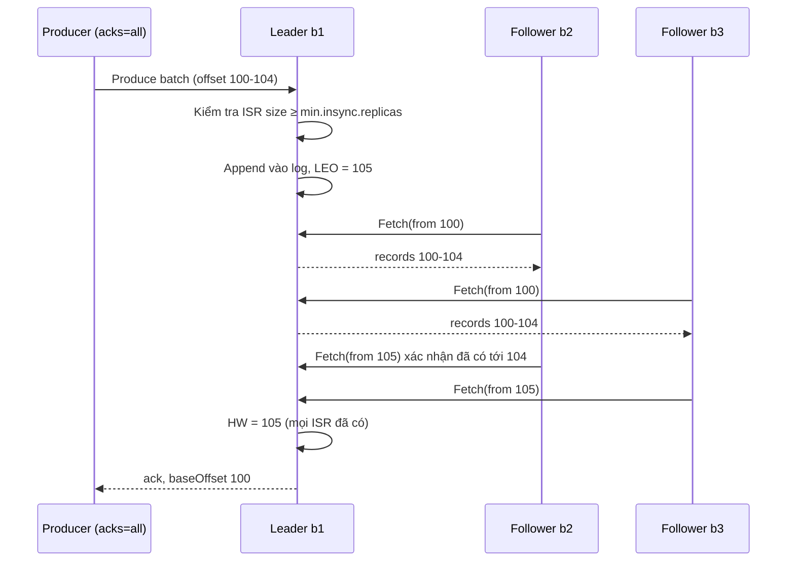
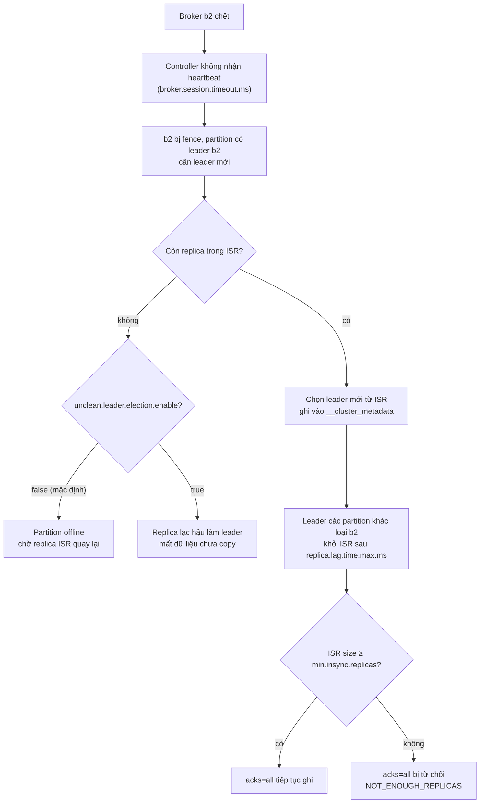

## Bối cảnh & vấn đề

Đêm thứ sáu, broker 2 của cụm Kafka thanh toán chết do hỏng ổ đĩa. Sáng hôm sau, đối soát thấy thiếu 214 giao dịch: service payment đã nhận ack từ Kafka cho cả 214 record, log producer ghi "sent OK", nhưng topic không có chúng. Không ai xoá gì cả.

Điều tra ra: topic được tạo với `replication.factor=3` nhưng producer dùng `acks=1` "cho nhanh". Với `acks=1`, leader ack ngay khi ghi xong vào log của chính nó, chưa chờ follower. Broker 2 là leader của vài partition; nó ack, rồi chết trước khi follower kịp copy. Controller chọn follower lạc hậu làm leader mới, và 214 record chỉ từng tồn tại trên ổ đĩa đã hỏng.

"Kafka bền" không phải mặc định tự nhiên, mà là kết quả của bốn thứ phối hợp: số bản sao (`replication.factor`), tập replica đang bắt kịp (ISR), producer chờ bao nhiêu xác nhận (`acks`), và số bản sao tối thiểu được phép ghi (`min.insync.replicas`). Bài này giải thích từng thứ, kèm số đo thật khi tắt broker, và cách chọn cấu hình chịu được một broker chết mà không mất dữ liệu cũng không ngừng ghi.

## Khái niệm

### Replication factor, leader và follower

Mỗi partition có `replication.factor` bản sao (**replica**) nằm trên các broker khác nhau. Một replica là **leader**: nhận mọi request ghi và (mặc định) mọi request đọc. Các replica còn lại là **follower**: liên tục gửi `Fetch` tới leader để copy dữ liệu, giống như consumer.

RF=3 là chuẩn production: chịu được một broker chết mà vẫn còn hai bản. Từ Kafka 2.4, consumer có thể đọc từ follower gần nhất cùng rack/AZ (`replica.selector.class` + `client.rack`) để giảm chi phí traffic liên AZ; ghi thì vẫn luôn qua leader.

**Interview angle:** "leader nhận read/write" đúng cho mặc định; nhắc follower fetching (KIP-392) cho thấy bạn biết bối cảnh cloud cost.

### ISR (in-sync replicas)

**ISR** là tập replica (kể cả leader) đang **bắt kịp** leader. Một follower bị loại khỏi ISR nếu không fetch tới log-end của leader trong `replica.lag.time.max.ms` (mặc định 30 giây). Khi bắt kịp lại, nó được đưa trở lại ISR.

ISR tồn tại vì không thể chờ mọi replica mãi: nếu một follower chết hoặc chậm, leader chỉ cần chờ những replica còn trong ISR. Khi leader chết, controller chọn leader mới **từ ISR**, nên leader mới chắc chắn có mọi record đã được commit.

**Interview angle:** câu hỏi "ISR co lại thì sao?" là cửa vào phần `acks=all` + `min.insync.replicas`.

### High watermark và log-end offset

**Log-end offset (LEO)** là offset kế tiếp sẽ được ghi trên một replica. **High watermark (HW)** là offset mà **mọi replica trong ISR** đã có. Record dưới HW được coi là **committed**; consumer chỉ đọc được tới HW.

Lý do consumer không đọc tới LEO của leader: record trên HW chưa chắc có trên follower; nếu leader chết, leader mới (từ ISR) có thể không có record đó và log sẽ bị cắt về HW. Nếu consumer đã đọc và hành động dựa trên record bị cắt, hệ thống thấy một "record ma".

**Interview angle:** HW là lý do `acks=all` có ý nghĩa: ack chỉ được gửi khi record đã dưới HW.

### `acks`

Producer quyết định chờ bao nhiêu xác nhận trước khi coi một request là thành công:

- `acks=0`: không chờ gì. Nhanh nhất, có thể mất mà không biết (kể cả lỗi broker cũng không báo về).
- `acks=1`: chờ **leader** ghi xong vào log của nó. Mất nếu leader chết trước khi follower copy (câu chuyện đầu bài).
- `acks=all` (hay `-1`): chờ **mọi replica trong ISR hiện tại**. Từ Kafka 3.0, đây là mặc định của Java producer. KafkaJS cũng mặc định `acks: -1`.

Latency tăng dần theo mức: `acks=all` cộng thêm thời gian follower fetch (thường vài ms trong cùng region). Throughput bù lại bằng batching (`linger.ms`, `batch.size`) và nhiều request in-flight.

**Interview angle:** "acks=all là đủ bền?" — chưa, nếu ISR chỉ còn mình leader. Đó là lý do có `min.insync.replicas`.

### `min.insync.replicas`

`acks=all` chờ "mọi replica trong ISR", nhưng ISR có thể co lại chỉ còn leader. Khi đó `acks=all` thực chất bằng `acks=1`. `min.insync.replicas` (mặc định 1, đặt ở broker hoặc từng topic) đặt **số replica tối thiểu trong ISR** để chấp nhận một write `acks=all`. Ít hơn thì broker từ chối với `NOT_ENOUGH_REPLICAS`: thà không ghi còn hơn ghi mà không bền.

Cấu hình chuẩn **RF=3, `min.insync.replicas=2`, `acks=all`**: mất một broker vẫn ghi được và mỗi write có ít nhất hai bản; mất hai broker thì ngừng ghi (chọn consistency thay vì availability). Đây là trade-off có chủ đích: mất hai broker cùng lúc hiếm, và khi xảy ra thì dừng ghi tốt hơn ghi một bản duy nhất.

`min.insync.replicas` chỉ ảnh hưởng producer `acks=all`; producer `acks=1` vẫn ghi được bình thường dù ISR chỉ còn 1.

**Interview angle:** follow-up "RF=2 với min ISR=2 có sao?" — mất một broker là ngừng ghi; RF=2 không có chỗ cho cả bền lẫn sẵn sàng.

### Unclean leader election

Khi **mọi** replica trong ISR đều chết, chỉ còn replica ngoài ISR (lạc hậu). `unclean.leader.election.enable` quyết định: `false` (mặc định) thì partition **offline** cho tới khi một replica trong ISR quay lại; `true` thì cho replica lạc hậu làm leader, partition sống lại ngay nhưng **mất** mọi record nó chưa copy, và các replica khác bị **truncate** để khớp với nó.

Kafka 4.x có thêm **Eligible Leader Replicas** (ELR, KIP-966): broker theo dõi những replica bị loại khỏi ISR nhưng vẫn chắc chắn có dữ liệu tới HW, để có thêm ứng viên leader an toàn khi ISR co dưới `min.insync.replicas` (verify mức độ GA theo version; cụm 4.2 trong ví dụ có `eligible.leader.replicas.version=1`).

**Interview angle:** unclean election là trade-off availability vs durability rõ ràng nhất của Kafka; nói được khi nào bật (topic log/metrics chấp nhận mất) là điểm cộng.

### KRaft và controller quorum

**KRaft** (Kafka Raft) thay ZooKeeper bằng một nhóm **controller** chạy giao thức Raft. Metadata của cluster (topic, partition, leader, ISR, config, ACL) được ghi vào một log nội bộ `__cluster_metadata`; broker đọc log này để biết trạng thái mới nhất. Controller leader ghi metadata khi có thay đổi (broker chết, ISR co, topic mới).

Kafka **4.0** (tháng 3/2025) bỏ hẳn ZooKeeper mode. Cụm ZooKeeper cũ phải migrate sang KRaft ở một bản 3.x hỗ trợ migration (bridge release, ví dụ 3.9) trước khi lên 4.x (verify lộ trình theo docs upgrade). Lợi ích: một hệ thống thay vì hai để vận hành, controller failover nhanh hơn (metadata đã có sẵn trong log, không phải load lại từ ZooKeeper), và hỗ trợ số partition lớn hơn.

Controller quorum dùng số node **lẻ** (3 hoặc 5) vì Raft cần **đa số** để commit: 3 node chịu được 1 node chết, 4 node cũng chỉ chịu được 1 (đa số của 4 là 3), nên node thứ tư không thêm khả năng chịu lỗi mà còn thêm một node phải chờ.

**Interview angle:** KRaft hay được hỏi dạng "điều gì thay đổi ở Kafka 4.0"; trả lời kèm lý do số node lẻ cho thấy bạn hiểu Raft, không chỉ thuộc tên.

### Vì sao không fsync mỗi message

Mặc định Kafka **không** gọi `fsync` sau mỗi write: `log.flush.interval.messages` mặc định là `Long.MAX_VALUE`, tức để OS tự flush page cache. Độ bền đến từ **replication**: một record đã nằm trong page cache của 2–3 máy khác nhau thì xác suất mất cả 2–3 cùng lúc thấp hơn nhiều so với một ổ đĩa hỏng.

Rủi ro còn lại là **mất điện đồng thời** nhiều broker (cùng rack, cùng AZ): record trong page cache chưa flush trên mọi replica sẽ mất. Cách chống là **rack awareness** (`broker.rack`), để replica của một partition nằm trên các AZ khác nhau, chứ không phải bật fsync mỗi message (làm throughput giảm rất mạnh).

**Interview angle:** "Kafka không fsync thì sao gọi là bền?" — bền nhờ replication qua failure domain độc lập; fsync mỗi message là đánh đổi throughput lấy một rủi ro mà rack awareness xử lý rẻ hơn.

## Cơ chế hoạt động

Một write `acks=all` với RF=3, `min.insync.replicas=2`:



Follower không gửi "ack" riêng: offset trong request `Fetch` kế tiếp chính là xác nhận "tôi đã có tới đây". Leader đẩy HW lên khi mọi replica trong ISR đã fetch qua offset đó, rồi mới trả ack cho producer (nếu `acks=all`). Kiểm tra ISR size được làm **trước** khi append; nếu ISR nhỏ hơn `min.insync.replicas`, write bị từ chối ngay với `NOT_ENOUGH_REPLICAS`.

Khi một broker chết:



Hai việc xảy ra song song: partition mà b2 làm leader cần leader mới (do controller quyết định), còn partition mà b2 là follower thì leader của chúng sẽ loại b2 khỏi ISR khi b2 không fetch nữa. Sau đó mỗi partition tự kiểm tra ISR so với `min.insync.replicas`.

## Ví dụ thực tế

Cụm 3 broker `apache/kafka:4.2.0` chạy KRaft combined mode (mỗi node vừa broker vừa controller), Docker, `kafkajs@2.2.4`.

### Controller quorum và các default liên quan

```bash
kafka-metadata-quorum.sh --bootstrap-server k1:9092 describe --status
```

```text
ClusterId:              4L6g3nShT-eMCtK--X86sw
LeaderId:               1
LeaderEpoch:            1
HighWatermark:          52
MaxFollowerLag:         0
MaxFollowerLagTimeMs:   0
CurrentVoters:          [{"id": 1, "endpoints": ["CONTROLLER://k1:9093"]}, {"id": 2, "endpoints": ["CONTROLLER://k2:9093"]}, {"id": 3, "endpoints": ["CONTROLLER://k3:9093"]}]
CurrentObservers:       []
```

Ba voter, leader là node 1. Metadata log cũng có high watermark riêng, như một partition bình thường.

```bash
kafka-configs.sh --bootstrap-server k1:9092 --describe --entity-type brokers --entity-name 1 --all \
  | grep -E "unclean.leader|min.insync|replica.lag.time|default.replication|log.flush.interval.messages="
```

```text
default.replication.factor=1
log.flush.interval.messages=9223372036854775807
min.insync.replicas=1
replica.lag.time.max.ms=30000
unclean.leader.election.enable=false
```

Hai default đáng chú ý: `default.replication.factor=1` (topic tự tạo chỉ có một bản) và `min.insync.replicas=1`. Cả hai cần đổi cho production.

### Hai topic, một broker chết

```bash
kafka-topics.sh --create --topic payments     --replica-assignment 1:2:3 --config min.insync.replicas=2
kafka-topics.sh --create --topic payments-rf2 --replica-assignment 1:2   --config min.insync.replicas=2
```

Producer thử ba trường hợp:

```ts
for (const [topic, acks] of [["payments", -1], ["payments-rf2", -1], ["payments-rf2", 1]] as const) {
  try {
    const [r] = await producer.send({ topic, acks, timeout: 5000, messages: [{ key: "pay-1", value: "100" }] });
    console.log(`${topic.padEnd(13)} acks=${acks === -1 ? "all" : acks} -> ok offset ${r.baseOffset}`);
  } catch (e: any) {
    console.log(`${topic.padEnd(13)} acks=${acks === -1 ? "all" : acks} -> ${e.name}: ${e.cause?.type ?? ""} ${e.cause?.message ?? e.message}`);
  }
}
```

Mọi broker đang chạy:

```text
payments      acks=all -> ok offset 0
payments-rf2  acks=all -> ok offset 0
payments-rf2  acks=1 -> ok offset 1
```

`docker stop` broker 2, chờ 12 giây:

```text
Topic: payments-rf2 Partition: 0    Leader: 1   Replicas: 1,2   Isr: 1  Elr: 2  LastKnownElr: 
Topic: payments Partition: 0    Leader: 1   Replicas: 1,2,3 Isr: 1,3    Elr:    LastKnownElr: 
```

```text
payments      acks=all -> ok offset 1
payments-rf2  acks=all -> KafkaJSNumberOfRetriesExceeded: NOT_ENOUGH_REPLICAS Messages are rejected since there are fewer in-sync replicas than required
payments-rf2  acks=1 -> ok offset 2
```

Đọc kết quả:

- `payments` (RF=3, min ISR=2): ISR co còn {1, 3}, vẫn ≥ 2, nên `acks=all` vẫn ghi. Mỗi write có hai bản. Đây là cấu hình "mất một broker không mất dữ liệu, không ngừng ghi".
- `payments-rf2` (RF=2, min ISR=2): ISR còn {1}, nhỏ hơn 2, nên `acks=all` bị từ chối. Mất một broker là ngừng ghi. Broker 2 được đánh dấu ELR: nó rời ISR nhưng vẫn là ứng viên leader an toàn.
- `payments-rf2` với `acks=1`: vẫn ghi được, chỉ trên một bản duy nhất. Nếu broker 1 chết ngay lúc này, offset 2 mất. `min.insync.replicas` không bảo vệ producer `acks=1`.

Bật lại broker 2, sau ~20 giây ISR đầy đủ trở lại:

```text
Topic: payments-rf2 Partition: 0    Leader: 1   Replicas: 1,2   Isr: 1,2    Elr:    LastKnownElr: 
Topic: payments Partition: 0    Leader: 1   Replicas: 1,2,3 Isr: 1,2,3  Elr:    LastKnownElr: 
```

### Cấu hình production cho một topic quan trọng

```bash
kafka-topics.sh --create --topic payments \
  --partitions 12 --replication-factor 3 \
  --config min.insync.replicas=2 \
  --config unclean.leader.election.enable=false
# broker: broker.rack=<az> trên mỗi broker để replica trải qua 3 AZ
```

```ts
const producer = kafka.producer({ idempotent: true, maxInFlightRequests: 5 }); // KafkaJS: acks mặc định -1
await producer.send({ topic: "payments", acks: -1, messages: [{ key: paymentId, value }] });
```

## Trade-offs & lựa chọn thay thế

| Cấu hình | Mất 1 broker | Mất 2 broker | Rủi ro mất dữ liệu | Dùng cho |
| --- | --- | --- | --- | --- |
| RF=1 | Partition offline, có thể mất | Offline | Cao | Dev, dữ liệu tái tạo được |
| RF=3, `acks=1` | Vẫn ghi | Vẫn ghi (nếu leader sống) | Mất record leader chưa copy | Log, metrics |
| RF=3, `acks=all`, min ISR=1 | Vẫn ghi | Vẫn ghi với 1 bản | Mất khi bản duy nhất chết | Không nên |
| RF=3, `acks=all`, min ISR=2 | Vẫn ghi, ≥2 bản | Ngừng ghi `acks=all` | Rất thấp | Mặc định cho dữ liệu business |
| RF=2, `acks=all`, min ISR=2 | Ngừng ghi | Ngừng ghi | Thấp | Không nên (không có headroom) |
| RF=2, `acks=all`, min ISR=1 | Vẫn ghi với 1 bản | Offline | Trung bình | Chi phí thấp, chấp nhận rủi ro |
| RF=5, min ISR=3 | Vẫn ghi | Vẫn ghi | Rất thấp | Dữ liệu cực quan trọng, multi-AZ lớn |

| `acks` | Latency | Throughput | Độ bền |
| --- | --- | --- | --- |
| `0` | Thấp nhất | Cao nhất | Không có |
| `1` | Thấp | Cao | Leader |
| `all` | + thời gian follower fetch | Cao nếu batching tốt | ISR, kèm min ISR |

Chọn thế nào: dữ liệu business (orders, payments, events có giá trị) dùng RF=3, min ISR=2, `acks=all`, idempotent producer, unclean election tắt, replica trải qua 3 AZ. Dữ liệu tái tạo được (log ứng dụng, metrics, clickstream có thể mất ít) có thể dùng `acks=1` để giảm latency. RF=2 hiếm khi là lựa chọn đúng: nó buộc bạn chọn giữa "ngừng ghi khi mất một broker" và "ghi một bản". Managed service (MSK, Confluent Cloud) thường mặc định RF=3, nhưng vẫn kiểm tra `min.insync.replicas` của từng topic.

## Edge cases & failure modes

- **ISR co âm thầm**: follower chậm (disk chậm, GC) bị loại khỏi ISR; với min ISR=1 mọi thứ vẫn "bình thường" cho tới khi leader chết. Alert theo `UnderReplicatedPartitions` và `IsrShrinksPerSec`.
- **Ghi bị từ chối dây chuyền**: hai broker bảo trì cùng lúc làm mọi partition có hai replica trên hai broker đó ngừng ghi `acks=all`. Rolling restart phải từng broker một, chờ ISR đầy đủ (`UnderReplicatedPartitions = 0`) mới restart broker tiếp theo.
- **Producer timeout không có nghĩa là thất bại**: `acks=all` timeout (`delivery.timeout.ms`) có thể xảy ra sau khi record đã được ghi; retry ở tầng app sinh trùng. Idempotent producer chỉ chống trùng do retry nội bộ của producer.
- **Unclean election bật nhầm**: replica lạc hậu lên leader, các replica khác truncate về log của nó; consumer đã đọc record bị truncate thấy dữ liệu "biến mất", offset bị tái sử dụng cho record khác.
- **Mất điện cả AZ**: nếu ba replica nằm cùng AZ (quên `broker.rack`), record trong page cache chưa flush có thể mất trên cả ba.
- **Controller quorum mất đa số**: với 3 controller, mất 2 thì không còn thay đổi metadata được (không bầu leader mới, không co ISR); broker còn sống có thể tiếp tục phục vụ partition hiện có nhưng không xử lý được failover.
- **`acks=0` che lỗi**: producer không nhận lỗi nào, kể cả topic không tồn tại hay message quá lớn.

## Pitfalls

- ❌ `acks=all` là đủ bền → ✅ `acks=all` + `min.insync.replicas=2` + RF=3; nếu không, ISR co còn leader là `acks=1`.
- ❌ Để `min.insync.replicas` mặc định 1 → ✅ đặt 2 cho topic quan trọng (topic-level hoặc broker default).
- ❌ RF=2 với min ISR=2 "cho bền" → ✅ mất một broker là ngừng ghi; dùng RF=3.
- ❌ `acks=1` cho payment "vì nhanh hơn vài ms" → ✅ `acks=all`; dùng batching (`linger.ms`) để giữ throughput.
- ❌ Bật `unclean.leader.election.enable=true` để partition "không bao giờ offline" → ✅ chỉ cho topic chấp nhận mất dữ liệu; partition offline là tín hiệu cần phục hồi, không phải lỗi cần che.
- ❌ Bật flush mỗi message để "chắc ăn" → ✅ bền nhờ replication qua AZ; flush mỗi message giết throughput.
- ❌ Controller quorum 4 node "cho dư" → ✅ 3 hoặc 5; số chẵn không tăng khả năng chịu lỗi.
- ❌ Rolling restart nhiều broker song song → ✅ một broker một lần, chờ ISR đầy đủ.

## Tóm tắt

- Partition có RF replica; leader nhận ghi, follower fetch như consumer.
- ISR = replica bắt kịp trong `replica.lag.time.max.ms`; leader mới được chọn từ ISR.
- High watermark = offset mọi ISR đã có; consumer chỉ đọc tới HW, `acks=all` ack khi record dưới HW.
- `acks=all` chỉ bền khi đi cùng `min.insync.replicas`; RF=3 + min ISR=2 chịu được mất một broker mà không mất dữ liệu, không ngừng ghi.
- Unclean leader election (mặc định tắt) đổi durability lấy availability; ELR (Kafka 4.x) thêm ứng viên leader an toàn.
- KRaft (bắt buộc từ Kafka 4.0) lưu metadata trong `__cluster_metadata` qua Raft; quorum 3 hoặc 5 node.
- Kafka không fsync mỗi message; bền nhờ replication, và rack awareness chống mất cả AZ.
