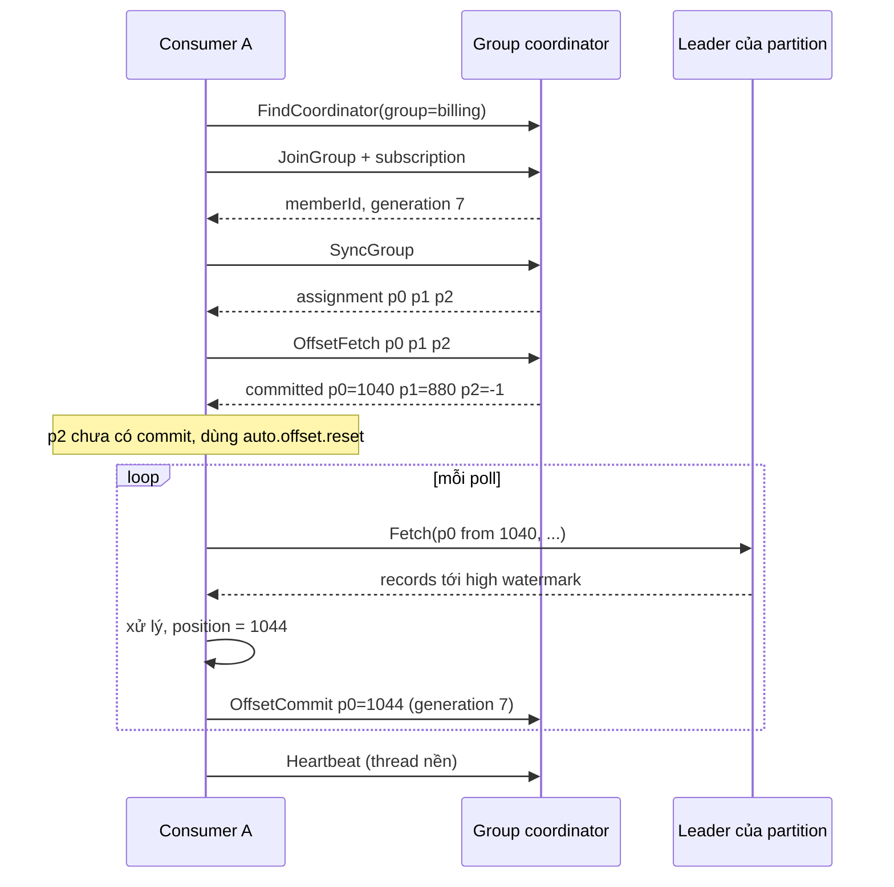
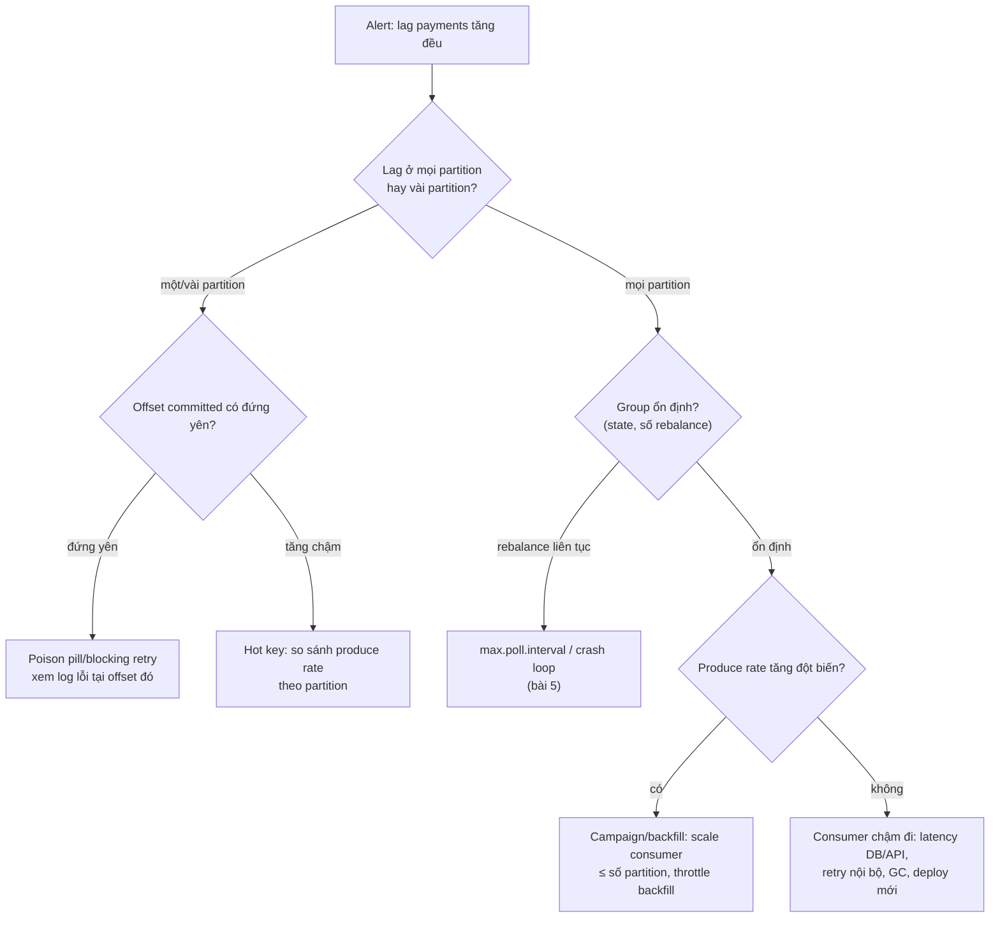

## Bối cảnh & vấn đề

Thứ hai đầu tháng, alert "payments consumer lag > 100k" bắn lúc 9:05. On-call mở dashboard: lag tăng đều từ 8:30, không có lỗi trong log consumer, CPU các pod bình thường. Người đầu tiên đề xuất "scale lên 20 pod". Topic có 12 partition; 8 pod mới chỉ ngồi chơi. Người thứ hai đề xuất "reset offset về latest để hết lag": lag về 0, và 100.000 giao dịch không bao giờ được ghi sổ.

Cả hai phản xạ đều sai vì thiếu mô hình trong đầu về **consumer group**: partition được chia cho consumer thế nào, "offset đã commit" nghĩa là gì, lag được tính ra sao và nói lên điều gì. Bài này xây mô hình đó, rồi dùng nó để điều tra lag, replay dữ liệu an toàn sau bug, và định nghĩa SLO cho một pipeline streaming.

## Khái niệm

### Consumer group và phân chia partition

Một **consumer group** là tập consumer cùng `group.id` cùng làm một việc. Kafka chia partition của các topic mà group subscribe cho các thành viên với một quy tắc: **mỗi partition được giao cho đúng một consumer trong group** tại một thời điểm. Một consumer có thể giữ nhiều partition.

Hệ quả trực tiếp:

- 12 partition, 4 consumer: mỗi consumer 3 partition.
- 12 partition, 12 consumer: mỗi consumer 1 partition, song song tối đa.
- 12 partition, 20 consumer: 8 consumer **idle** (dự phòng, nhận partition khi consumer khác chết).

Các group khác nhau đọc **độc lập**, mỗi group có offset riêng. Group `billing` và group `email` cùng subscribe `orders` thì mỗi group nhận đủ mọi record: đó là fan-out tự nhiên của Kafka, không cần copy message như queue.

Người quyết định ai giữ partition nào là **group coordinator** (một broker) cùng một **assignor**: `range`, `roundrobin`, `sticky`, `cooperative-sticky` với giao thức classic, hoặc `uniform`/`range` tính ở broker với giao thức mới KIP-848 ([bài 5](/tracks/messaging-kafka/learn/rebalance-liveness)). Ngoại lệ duy nhất cho quy tắc "một partition một consumer" là **share groups** (KIP-932, Kafka 4.x), nơi nhiều consumer cùng đọc một partition với ack từng record ([bài 12](/tracks/messaging-kafka/learn/kafka-vs-queues)).

**Interview angle:** follow-up "muốn song song hơn số partition mà không thêm partition?" — xử lý song song **bên trong** consumer theo key (worker pool, mỗi key một hàng đợi), hoặc share group nếu không cần thứ tự.

### Position và committed offset

Consumer có hai con số cho mỗi partition, rất hay bị nhầm:

- **Position**: offset của record kế tiếp mà consumer sẽ fetch. Nằm trong bộ nhớ của consumer, tăng mỗi lần `poll()` trả record về. Broker không quan tâm.
- **Committed offset**: con số group đã lưu vào `__consumer_offsets`. Chỉ dùng khi consumer **khởi động** hoặc khi partition được giao cho consumer khác sau rebalance: consumer mới bắt đầu đọc từ committed offset.

Vì vậy "không commit thì Kafka không gửi message tiếp theo" là **sai**: consumer vẫn đọc tiếp theo position trong bộ nhớ. Commit chỉ quyết định **sau khi crash/rebalance** thì đọc lại từ đâu. Nếu chưa từng commit, consumer dùng `auto.offset.reset`: `latest` (mặc định Java) bỏ qua dữ liệu cũ, `earliest` đọc từ đầu.

Committed offset theo quy ước là **offset của record kế tiếp cần đọc**, tức `last processed + 1`. Commit 1043 sau khi xử lý xong 1043 nghĩa là lần sau đọc lại 1043: một bản trùng.

**Interview angle:** phân biệt được position và committed offset là dấu hiệu rõ nhất bạn từng debug consumer thật.

### Auto-commit

Java consumer mặc định `enable.auto.commit=true` với `auto.commit.interval.ms=5000`. Cơ chế cụ thể: trong mỗi lần `poll()` (và khi `close()`), nếu đã quá 5 giây kể từ lần commit trước, consumer commit **position hiện tại**, tức offset sau các record mà lần `poll()` **trước** đã trả về.

Với vòng lặp đồng bộ chuẩn (`poll` → xử lý hết → `poll`), record được commit chỉ khi bạn đã quay lại `poll()`, nghĩa là đã xử lý xong. Auto-commit khi đó cho **at-least-once**: crash giữa hai lần commit thì tối đa ~5 giây record bị xử lý lại. Auto-commit trở thành **at-most-once** (mất dữ liệu) khi xử lý **bất đồng bộ ra ngoài vòng poll**: handler đẩy việc sang thread/promise khác rồi poll tiếp, consumer commit position trong khi việc chưa xong; crash là mất ([bài 11](/tracks/messaging-kafka/learn/nodejs-clients-socketio) có ví dụ thật với KafkaJS).

**Interview angle:** câu trả lời mạnh không nói "auto-commit luôn mất dữ liệu"; nó nói auto-commit an toàn với vòng poll đồng bộ, nguy hiểm với xử lý async.

### Manual commit: sync, async, batch

Tắt auto-commit (`enable.auto.commit=false`) và tự commit sau khi xử lý cho bạn quyền kiểm soát rõ ràng:

- **`commitSync`**: chặn tới khi broker xác nhận, có retry. Chậm nếu commit từng record.
- **`commitAsync`**: không chặn, không retry (vì retry có thể ghi đè offset mới hơn bằng offset cũ). Lỗi chỉ báo qua callback.
- Mẫu phổ biến: `commitAsync` trong vòng lặp, `commitSync` khi shutdown và trong callback revoke của rebalance.

Commit từng record tốn một round-trip mỗi record; production thường commit **theo batch** (sau mỗi lần poll) hoặc theo **interval**. Cái giá: crash thì xử lý lại tối đa một batch, nên consumer vẫn phải idempotent ([bài 6](/tracks/messaging-kafka/learn/delivery-semantics-idempotency)).

Khi xử lý **song song trong một partition** (worker pool), không được commit offset của record vừa xong nếu record nhỏ hơn còn đang chạy. Phải theo dõi offset nào đã xong và chỉ commit tới **điểm liên tục cao nhất** (low watermark của các offset đang xử lý). Ví dụ đã xong {100, 101, 103}, đang chạy 102: chỉ được commit 102 (nghĩa là "đã xong tới 101").

**Interview angle:** follow-up "xử lý song song trong partition thì commit thế nào?" — commit contiguous offset, chấp nhận xử lý lại phần đã xong ở trên lỗ hổng.

### Consumer lag

**Consumer lag** của một partition = **log-end offset** (hoặc high watermark) − **committed offset** của group. Lag tính **theo partition**; con số tổng của topic che mất thông tin quan trọng nhất là lag nằm ở đâu.

Hình dạng lag nói lên nhiều điều:

- **Răng cưa** (lên xuống theo batch): bình thường.
- **Tăng đều ở mọi partition**: consumer không theo kịp producer (xử lý chậm, downstream chậm, thiếu consumer, hoặc producer đột biến).
- **Tăng ở một partition**: hot key hoặc một **poison pill** chặn partition đó ([bài 8](/tracks/messaging-kafka/learn/errors-retries-dlq)).
- **Phẳng ở mức cao, không giảm**: consumer chết hoặc group đang rebalance liên tục.

Số message không nói lên tác động: lag 100.000 record log trong topic 50.000 msg/s là 2 giây; lag 100 record payment có thể là 30 phút. Vì thế nên alert theo **thời gian trễ** (record cũ nhất chưa xử lý đã bao nhiêu giây, hay `now − timestamp` của record ở committed offset), không chỉ số message.

**Interview angle:** "metric quan trọng nhất của consumer là gì?" — lag theo partition, đo bằng thời gian; kèm cách phân biệt hot partition và consumer chậm.

### Replay và reset offsets

Vì Kafka giữ dữ liệu theo retention, sửa một read model bị hỏng là **đọc lại** event. Hai cách:

- **Group mới** (`read-model-v2`) với `auto.offset.reset=earliest` hoặc seek tới timestamp: dựng read model mới song song (blue/green), kiểm tra, rồi chuyển traffic đọc sang. Group cũ không bị đụng tới.
- **Reset offset của group hiện tại**: `kafka-consumer-groups --reset-offsets --to-datetime/--to-earliest/--shift-by/--to-offset`. Chỉ làm được khi group **không có member active**.

Điều kiện an toàn: dữ liệu còn trong retention; consumer idempotent (upsert theo version) nếu replay vào chỗ cũ; **tắt side effect** (email, payment, webhook) trong chế độ replay; throttle để không đè DB đang phục vụ user. Thứ tự theo partition vẫn được giữ khi replay.

**Interview angle:** câu "vì sao replay vào read model mới an toàn hơn?" — không có giai đoạn dữ liệu lẫn cũ/mới, rollback chỉ là không chuyển traffic, và read model cũ vẫn phục vụ trong lúc rebuild.

## Cơ chế hoạt động

Vòng đời một consumer trong group, giao thức classic:



Commit mang theo **generation**: nếu group đã rebalance sang generation 8 mà consumer A vẫn commit với generation 7, coordinator từ chối (`CommitFailedException` / `ILLEGAL_GENERATION`). Đó là cơ chế ngăn consumer "zombie" ghi đè offset của consumer mới đang giữ partition.

Điều tra lag tăng trong production, theo thứ tự rẻ tới đắt:



Một partition hay mọi partition là câu hỏi đầu tiên vì nó chia đôi không gian giả thuyết. Với "chỉ partition 7": nếu committed offset đứng yên, consumer đang kẹt ở một record (poison pill, blocking retry vô hạn); nếu committed offset vẫn tăng nhưng chậm hơn produce, partition 7 nhận nhiều traffic hơn (hot key). Phân biệt bằng hai metric: committed offset theo thời gian, và produce rate theo partition.

## Ví dụ thực tế

Kafka 4.2.0 (3 broker), `kafkajs@2.2.4`, công cụ CLI chạy trong container broker.

### Lag theo partition, và partition "biến mất"

Produce 900 click từ 30 user (key `u-0` … `u-29`) vào topic `clicks` 3 partition, rồi một consumer xử lý khoảng 300 record và dừng:

```ts
await producer.send({ topic: "clicks", messages: Array.from({ length: 900 }, (_, i) => ({ key: `u-${i % 30}`, value: String(i) })) });

const c = kafka.consumer({ groupId: "analytics" });
await c.connect();
await c.subscribe({ topic: "clicks", fromBeginning: true });
let n = 0;
await new Promise<void>((resolve) => c.run({ eachMessage: async () => { if (++n === 300) resolve(); } }));
await c.disconnect(); // commits resolved offsets on the way out
```

```text
$ kafka-consumer-groups.sh --bootstrap-server k1:9092 --describe --group analytics
Consumer group 'analytics' has no active members.

GROUP           TOPIC           PARTITION  CURRENT-OFFSET  LOG-END-OFFSET  LAG
analytics       clicks          1          150             240             90
analytics       clicks          2          150             150             0

$ kafka-get-offsets.sh --bootstrap-server k1:9092 --topic clicks
clicks:0:510
clicks:1:240
clicks:2:150
```

Hai điều đáng học. Một: 30 key chia không đều (510 / 240 / 150), đúng như bài 2 dự đoán với key cardinality thấp. Hai: **partition 0 không xuất hiện** trong `describe` vì group chưa từng commit offset cho nó, dù p0 có 510 record chưa đọc. Dashboard lag dựa trên committed offset sẽ báo "lag 90" trong khi thực tế là 600. Exporter lag tốt phải tính cả partition chưa có commit (so với offset đầu theo `auto.offset.reset`).

### Reset offset: chỉ khi group không active

```text
$ kafka-consumer-groups.sh --group analytics --topic clicks --reset-offsets --to-earliest --dry-run
GROUP           TOPIC           PARTITION  NEW-OFFSET
analytics       clicks          2          0
analytics       clicks          1          0
analytics       clicks          0          0

$ kafka-consumer-groups.sh --group analytics --topic clicks --reset-offsets --to-datetime 2026-10-01T00:00:00.000 --execute
$ kafka-consumer-groups.sh --describe --group analytics
GROUP           TOPIC           PARTITION  CURRENT-OFFSET  LOG-END-OFFSET  LAG
analytics       clicks          0          0               510             510
analytics       clicks          1          0               240             240
analytics       clicks          2          0               150             150
```

Luôn chạy `--dry-run` trước. Thử reset khi có một consumer đang chạy trong group:

```text
Error: Assignments can only be reset if the group 'analytics' is inactive, but the current state is Stable.

GROUP           COORDINATOR (ID)          ASSIGNMENT-STRATEGY  STATE                #MEMBERS
analytics       k1:9092  (1)              range                Stable               1
```

Kafka chặn đúng: reset offset trong khi consumer đang chạy sẽ bị chính consumer đó ghi đè ở lần commit tiếp theo. Quy trình replay vào group hiện tại: scale consumer về 0, reset, rồi scale lên.

### Commit an toàn khi xử lý song song trong partition (minh hoạ)

Đoạn dưới chỉ minh hoạ thuật toán "commit offset liên tục", không phải code production:

```ts
class OffsetTracker {
  private done = new Set<bigint>();
  constructor(private next: bigint) {}           // committed offset hiện tại = record kế tiếp
  complete(offset: bigint) {
    this.done.add(offset);
    while (this.done.has(this.next)) { this.done.delete(this.next); this.next++; }
    return this.next;                             // offset an toàn để commit
  }
}
const t = new OffsetTracker(100n);
console.log(t.complete(101n), t.complete(103n), t.complete(100n), t.complete(102n));
// 100n 100n 102n 104n
```

Xong 101 và 103 trước: chưa commit được gì (100 chưa xong). Xong 100: commit 102 (101 cũng đã xong). Xong 102: nhảy lên 104. Crash ở bước hai thì 101 và 103 bị xử lý lại, nên handler vẫn phải idempotent.

### Replay read model sau bug ba ngày

Read model `order_summary` bị sai do bug từ ngày 2026-09-28. Retention của topic là 7 ngày.

```bash
# 1. deploy consumer mới với group riêng, ghi vào bảng mới, tắt side effect
REPLAY_MODE=true GROUP_ID=order-summary-v2 TARGET_TABLE=order_summary_v2 node dist/consumer.js
# 2. hoặc: bắt đầu từ một thời điểm thay vì từ đầu
kafka-consumer-groups.sh --group order-summary-v2 --topic orders --reset-offsets \
  --to-datetime 2026-09-27T00:00:00.000 --execute
# 3. theo dõi lag của order-summary-v2 về 0, so sánh số liệu v1/v2, chuyển API đọc sang v2
```

Chọn thời điểm bắt đầu sớm hơn bug một chút, và chỉ hợp lệ nếu read model có thể dựng lại từ event trong khoảng đó (hoặc có snapshot ở thời điểm bắt đầu). Nếu không, replay từ `--to-earliest`.

### SLO và alert cho pipeline payments

| SLI | Đo thế nào | SLO ví dụ | Alert |
| --- | --- | --- | --- |
| End-to-end latency | `processed_at − event_time` (header/payload), p99 | 99% event xử lý trong < 30 s | Burn rate 2%/giờ |
| Lag theo thời gian | Tuổi của record ở committed offset, max theo partition | < 60 s | > 5 phút trong 10 phút |
| Error / DLQ rate | Số record vào DLQ / tổng | DLQ = 0 cho payments | DLQ > 0 (page) |
| Throughput | Consumed rate / produced rate | ≈ 1 khi ổn định | < 0,8 trong 15 phút |
| Group health | Số rebalance / giờ, state | < 2/giờ ngoài deploy | Rebalance liên tục |
| Broker health | UnderReplicatedPartitions, ISR shrink, disk | 0 | > 0 trong 5 phút |

End-to-end latency phụ thuộc đồng hồ của producer và consumer. Hai máy lệch nhau vài trăm ms là bình thường (NTP); lệch giây thì latency âm hoặc phình. Cách giảm: dùng timestamp do broker gán (`message.timestamp.type=LogAppendTime`) làm mốc bắt đầu, hoặc đo hai đoạn riêng (producer → broker, broker → xử lý xong) bằng đồng hồ của cùng một bên.

## Trade-offs & lựa chọn thay thế

| Cách commit | Ngữ nghĩa | Ưu | Nhược | Khi nào |
| --- | --- | --- | --- | --- |
| Auto-commit, vòng poll đồng bộ | At-least-once (≤ 5 s trùng) | Đơn giản | Mất dữ liệu nếu xử lý async | Consumer đơn giản, handler `await` hết |
| Commit trước khi xử lý | At-most-once | Không trùng | Mất khi crash | Metrics/log có thể mất |
| Manual commit sau xử lý, theo batch | At-least-once | Kiểm soát rõ | Trùng tối đa một batch | Mặc định cho business |
| Manual commit từng record (sync) | At-least-once, trùng tối thiểu | Ít trùng | Chậm (1 round-trip/record) | Throughput thấp, việc đắt |
| Lưu offset trong DB cùng transaction | Effectively-once với DB | Xử lý + offset atomic | Tự quản seek khi start/rebalance | Sink là một DB, cần chính xác ([bài 7](/tracks/messaging-kafka/learn/idempotent-producer-transactions)) |

| Replay | Ưu | Nhược |
| --- | --- | --- |
| Group mới + read model mới | An toàn, rollback dễ, không ảnh hưởng read model đang chạy | Cần gấp đôi chỗ, logic chuyển traffic |
| Reset offset group hiện tại | Đơn giản | Phải dừng consumer, read model lẫn dữ liệu trong lúc replay |
| Replay vào chỗ cũ với upsert theo version | Không cần bảng mới | Chỉ đúng nếu handler idempotent hoàn toàn |

Chọn thế nào: manual commit sau xử lý theo batch, cộng consumer idempotent, là mặc định đúng cho hầu hết service business. Khi sink là một DB duy nhất và trùng là không chấp nhận được, lưu offset trong DB. Khi sửa read model, ưu tiên group mới và bảng mới.

## Edge cases & failure modes

- **Partition chưa từng commit** không hiện trong `describe` và trong nhiều dashboard lag: lag thật lớn hơn số hiển thị.
- **Offset của group hết hạn**: group không hoạt động quá `offsets.retention.minutes` (7 ngày) mất committed offset; khi quay lại rơi vào `auto.offset.reset`.
- **Lag vượt retention**: record bị xoá trước khi được đọc; consumer nhảy về `earliest` còn lại hoặc `latest`, mất dữ liệu âm thầm. Alert khi tuổi record ở committed offset > 50% retention.
- **Commit sau rebalance**: consumer xử lý xong batch nhưng partition đã bị giao cho consumer khác; commit bị từ chối (`CommitFailedException`), consumer mới xử lý lại batch đó.
- **`commitAsync` thất bại im lặng**: không retry; nếu không có commit sau đó (hoặc `commitSync` khi shutdown), crash làm xử lý lại nhiều hơn dự kiến.
- **Reset offset khi consumer chạy**: bị chặn bởi CLI, nhưng code tự gọi Admin API `alterConsumerGroupOffsets` có thể không chặn tương tự với mọi client; consumer active sẽ ghi đè.
- **Replay kích hoạt side effect**: replay 3 ngày event `OrderPlaced` vào consumer gửi email = gửi lại 3 ngày email. Luôn có cờ replay mode.
- **Scale consumer quá số partition**: không tăng throughput, chỉ thêm rebalance mỗi lần scale.

## Pitfalls

- ❌ "Không commit thì Kafka không gửi tiếp" → ✅ consumer đọc theo position trong bộ nhớ; commit chỉ quyết định điểm bắt đầu sau crash/rebalance.
- ❌ Commit offset của record vừa xử lý (`offset`) → ✅ commit `offset + 1` (KafkaJS `resolveOffset` và Java `commitSync()` không tham số tự làm đúng).
- ❌ Scale consumer lên quá số partition để chữa lag → ✅ kiểm tra lag theo partition; tăng partition hoặc tăng tốc xử lý.
- ❌ Reset offset về `latest` để "xoá lag" → ✅ đó là xoá dữ liệu; tìm nguyên nhân, nếu buộc phải skip thì ghi lại khoảng offset để xử lý bù.
- ❌ Alert theo tổng lag của topic → ✅ alert theo lag thời gian, theo partition, và theo DLQ.
- ❌ Xử lý song song trong partition rồi commit offset mới nhất → ✅ commit contiguous offset.
- ❌ Replay vào read model đang phục vụ user mà không tắt side effect → ✅ group mới, bảng mới, replay mode.

## Tóm tắt

- Mỗi partition thuộc đúng một consumer trong group; consumer thừa idle; mỗi group có offset riêng nên fan-out tự nhiên.
- Position (trong bộ nhớ) khác committed offset (trong `__consumer_offsets`); commit = offset kế tiếp cần đọc.
- Auto-commit an toàn với vòng poll đồng bộ, mất dữ liệu khi xử lý async; manual commit sau xử lý theo batch là mặc định cho business.
- Lag = log-end − committed, theo partition; alert theo thời gian trễ; partition chưa từng commit có thể không hiện.
- Lag một partition: poison pill (offset đứng yên) hoặc hot key (tăng chậm); lag mọi partition: consumer chậm, rebalance, hoặc producer đột biến.
- Replay: group mới + read model mới là an toàn nhất; reset offset chỉ khi group không active; tắt side effect.
- SLO cho streaming: end-to-end latency, lag theo thời gian, DLQ rate, throughput ratio, rebalance rate.
