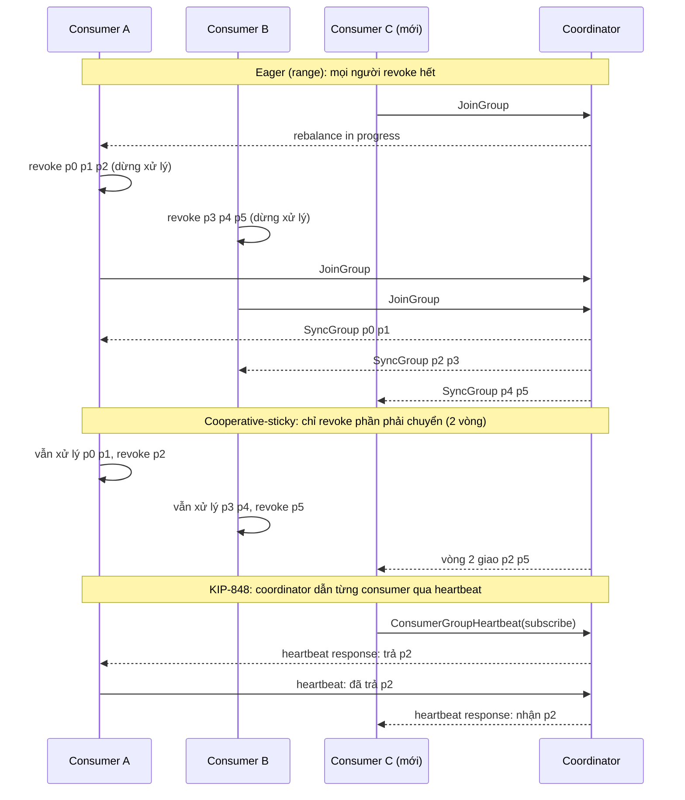
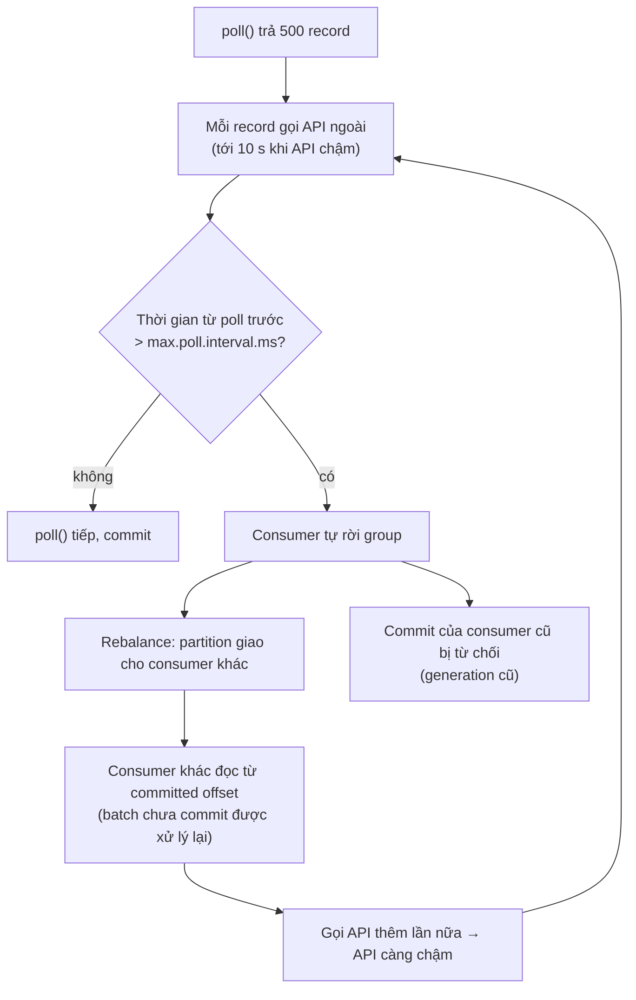

## Bối cảnh & vấn đề

Consumer `enrichment` gọi một API bên ngoài cho mỗi record. Bình thường API trả lời trong 200 ms; hôm nay nó chậm, có lúc 10 giây. Từ 10:00, dashboard thấy group rebalance mỗi vài phút, lag tăng không ngừng, và CPU của API bên ngoài tăng gấp đôi dù traffic vào không đổi. Log consumer lặp lại cùng một dòng: "Application maximum poll interval exceeded… leaving group".

Đây là một vòng lặp tự khuếch đại: xử lý chậm làm consumer bị coi là chết, group rebalance, batch chưa commit được giao cho consumer khác, consumer đó xử lý lại từ đầu (gọi API lần nữa), API càng chậm, consumer khác cũng bị đá ra. Không có dòng code nào sai; chỉ có hiểu sai về **liveness** của consumer group.

Bài này giải thích khi nào rebalance xảy ra, ba timeout canh gác consumer, ba thế hệ giao thức rebalance (eager, cooperative, KIP-848), và static membership để rolling deploy không gây bão rebalance.

## Khái niệm

### Rebalance là gì và khi nào xảy ra

**Rebalance** là quá trình group coordinator chia lại partition cho các thành viên. Nó xảy ra khi:

- Một consumer **join** (pod mới, scale up).
- Một consumer **leave** (shutdown sạch, gửi LeaveGroup).
- Một consumer bị coi là **chết**: hết `session.timeout.ms` không có heartbeat, hoặc vượt `max.poll.interval.ms` giữa hai lần poll.
- Subscription thay đổi: topic mới khớp regex, số partition của topic tăng.

Trong lúc rebalance, partition đang chuyển chủ không được xử lý. Với giao thức cũ, **cả group** dừng. Mỗi rebalance còn kèm rủi ro xử lý trùng: record đã xử lý nhưng chưa commit sẽ được consumer mới xử lý lại.

**Interview angle:** liệt kê đủ bốn nguyên nhân, đặc biệt là "consumer sống nhưng xử lý chậm" (max.poll.interval), cho thấy bạn từng gặp rebalance storm thật.

### Ba timeout: session, heartbeat, max.poll.interval

Java consumer có hai cơ chế phát hiện sự cố, tách nhau từ KIP-62 (Kafka 0.10.1):

- **Heartbeat** chạy ở **thread nền**, mỗi `heartbeat.interval.ms` (mặc định 3 s). Nếu coordinator không nhận heartbeat trong `session.timeout.ms` (mặc định 45 s từ Kafka 3.0, trước đó 10 s), consumer bị coi là chết. Cơ chế này bắt **process crash, mất mạng, GC pause dài**. Quy tắc: heartbeat ≤ 1/3 session timeout.
- **`max.poll.interval.ms`** (mặc định 300 s): khoảng tối đa giữa hai lần gọi `poll()`. Vượt quá thì consumer **tự rời group** dù heartbeat vẫn chạy. Cơ chế này bắt **thread xử lý bị treo hoặc quá chậm**: process còn sống nhưng không làm được việc.

Vì sao tách hai cơ chế? Nếu heartbeat gắn với `poll()` (như trước 0.10.1), xử lý một batch lâu sẽ làm consumer bị coi là chết dù chỉ đang bận; nếu chỉ có heartbeat nền, một consumer bị deadlock vẫn giữ partition mãi. Tách ra cho phép phát hiện crash nhanh (45 s) mà vẫn cho batch xử lý lâu (5 phút).

Liên quan: `max.poll.records` (mặc định 500) giới hạn số record một lần `poll()` trả về. Thời gian xử lý một batch ≈ `max.poll.records × thời gian/record` phải nhỏ hơn `max.poll.interval.ms`.

**Interview angle:** "xử lý chậm thì timeout nào kích hoạt?" — `max.poll.interval.ms`, không phải session timeout (ở Java client). Ở KafkaJS thì khác, xem dưới.

### KafkaJS: heartbeat cùng event loop

KafkaJS không có thread nền. Nó gửi heartbeat **giữa các message** (sau mỗi `eachMessage` nếu đã quá `heartbeatInterval`) hoặc khi bạn gọi `heartbeat()` trong `eachBatch`. Nếu một handler chạy lâu hơn `sessionTimeout` (mặc định 30 s ở KafkaJS), không có heartbeat nào được gửi và consumer bị đá ra. KafkaJS cũng không có khái niệm `max.poll.interval.ms`; `sessionTimeout` và `rebalanceTimeout` đóng vai trò đó.

Thư viện `@confluentinc/kafka-javascript` (dựa trên librdkafka) có heartbeat ở thread nền như Java và có `max.poll.interval.ms`. Một chi tiết đo được: lớp tương thích KafkaJS của nó đặt `max.poll.interval.ms` thực tế gấp đôi giá trị cấu hình (để còn thời gian xử lý message cuối khi dừng), nên cấu hình 6 s thì consumer bị đá sau 12 s (đọc từ source 1.10.1 và quan sát thật, verify với version của bạn).

**Interview angle:** follow-up "map sang KafkaJS thế nào?" — handler dài phải gọi `heartbeat()` (eachBatch) hoặc tăng `sessionTimeout`; consumer sống mà handler treo thì KafkaJS không tự phát hiện được.

### Eager rebalance

Giao thức classic ban đầu là **eager**: khi rebalance bắt đầu, **mọi** consumer revoke **toàn bộ** partition của mình, gửi JoinGroup, chờ leader của group tính assignment mới, nhận partition qua SyncGroup, rồi mới chạy tiếp. Toàn group dừng ("stop-the-world") cho tới khi thành viên chậm nhất join xong (giới hạn bởi rebalance timeout).

Assignor `range` và `roundrobin` dùng eager. KafkaJS chỉ hỗ trợ eager (verify: không có cooperative assignor chính thức).

### Cooperative (incremental) rebalance

**Cooperative rebalance** (KIP-429, Kafka 2.4) với `CooperativeStickyAssignor`: consumer **giữ** partition trong lúc join. Assignment mới được tính sao cho ít di chuyển nhất (sticky); chỉ những partition phải chuyển chủ mới bị revoke, qua **hai vòng** rebalance: vòng một revoke phần cần chuyển, vòng hai giao chúng cho chủ mới. Các partition không đổi chủ được xử lý liên tục.

Java client 3.x/4.x mặc định `partition.assignment.strategy=[RangeAssignor, CooperativeStickyAssignor]`: dùng range, nhưng cho phép nâng cấp sang cooperative bằng rolling restart hai bước.

### KIP-848: giao thức consumer thế hệ mới

**KIP-848** (`group.protocol=consumer`, GA ở Kafka 4.0) chuyển việc tính assignment từ client lên **broker** (group coordinator). Consumer không còn JoinGroup/SyncGroup; nó gửi `ConsumerGroupHeartbeat` định kỳ, kèm subscription và các partition nó đang giữ. Coordinator tính assignment đích (assignor `uniform` hoặc `range` phía server) và dẫn từng consumer tới đó **dần dần**: bảo consumer A trả partition 3, khi A xác nhận đã trả thì giao 3 cho B.

Khác biệt lớn nhất: **không còn barrier đồng bộ toàn group**. Một consumer chậm không chặn những consumer khác; mỗi consumer hội tụ độc lập. Một số config chuyển sang broker: `group.consumer.session.timeout.ms` (mặc định 45 s) và `group.consumer.heartbeat.interval.ms` (mặc định 5 s); client không còn tự đặt `session.timeout.ms`, `heartbeat.interval.ms`, `partition.assignment.strategy`.

Hỗ trợ phía client khác nhau: Java ≥ 3.7 (preview) và 4.0 (GA) với `group.protocol=consumer` (mặc định vẫn `classic` ở Java 4.2, đã kiểm tra), librdkafka ≥ 2.x hỗ trợ (đã chạy thật với 2.15.1), KafkaJS không hỗ trợ (verify).

**Interview angle:** nói được "KIP-848 bỏ barrier đồng bộ và chuyển assignment lên broker" là đủ ý; thêm "cần client hỗ trợ, Node thì phải dùng client librdkafka" là điểm senior.

### Static membership

Mặc định mỗi lần consumer khởi động nó là một **member mới** (memberId mới). Rolling deploy 10 pod = 10 lần leave + 10 lần join = tới 20 rebalance. **Static membership** (KIP-345): đặt `group.instance.id` ổn định cho mỗi instance (ví dụ tên pod trong StatefulSet `consumer-0`, `consumer-1`). Khi instance tắt, nó **không** gửi LeaveGroup; coordinator giữ chỗ cho nó tới hết `session.timeout.ms`. Instance quay lại với cùng `group.instance.id` trước khi hết hạn thì nhận lại đúng partition cũ, **không có rebalance**.

Cái giá: nếu instance chết thật, partition của nó **không ai xử lý** cho tới khi hết session timeout. Session timeout càng dài (để chịu được restart chậm) thì thời gian "mù" khi chết thật càng dài.

**Interview angle:** follow-up "nhược điểm của session timeout dài với static membership?" — lag tăng trên partition của pod chết thật cho tới khi hết timeout.

## Cơ chế hoạt động

So sánh ba giao thức khi consumer C join group đang có A, B với 6 partition:



Với eager, khoảng từ "revoke" tới "SyncGroup" là thời gian cả group không xử lý gì, dài bằng thời gian thành viên chậm nhất join lại. Với cooperative, A và B chỉ mất p2 và p5. Với KIP-848, không có bước JoinGroup chung; mỗi thay đổi đi qua heartbeat của từng consumer.

Vòng lặp rebalance do xử lý chậm:



Mũi tên từ H quay về B là phần nguy hiểm: mỗi vòng làm downstream chậm hơn, nên các consumer còn lại cũng lần lượt vượt timeout. Tăng `max.poll.interval.ms` chỉ dời ngưỡng; sửa thật là làm cho một batch luôn xong trong thời gian có giới hạn.

## Ví dụ thực tế

Kafka 4.2.0 (3 broker), `kafkajs@2.2.4`, `@confluentinc/kafka-javascript@1.10.1` (librdkafka 2.15.1), Node 24.

### KafkaJS: một handler 10 s làm group xử lý trùng

Topic `slow-jobs` 2 partition, 2 record mỗi partition. Consumer A xử lý mỗi record 10 s, `sessionTimeout` 6 s; consumer B nhanh, join sau A:

```ts
const c = kafka.consumer({ groupId: "slow-group", sessionTimeout: 6000, heartbeatInterval: 1000, rebalanceTimeout: 8000 });
c.on(c.events.GROUP_JOIN, (e) => log(`${name} joined partitions=${JSON.stringify(e.payload.memberAssignment["slow-jobs"] ?? [])}`));
await c.run({
  eachMessage: async ({ partition, message }) => {
    log(`${name} start p${partition}@${message.offset}`);
    await sleep(slowMs);
    log(`${name} done  p${partition}@${message.offset}`);
  },
});
```

```text
t=0.2s A joined partitions=[0,1]
t=0.3s A start p0@0
t=8.3s B joined partitions=[0,1]
t=8.3s B start p1@0
t=8.4s B done  p1@0
t=8.4s B start p1@1
t=8.5s B done  p1@1
t=8.5s B start p0@0
t=8.6s B done  p0@0
t=8.6s B start p0@1
t=8.7s B done  p0@1
t=10.3s A done  p0@0
t=10.3s A start p1@0
t=18.8s B joined partitions=[0,1]
t=20.3s A done  p1@0
t=23.8s A joined partitions=[1]
t=23.8s B joined partitions=[0]
```

A bị đá khỏi group trong lúc đang xử lý `p0@0` (không có heartbeat suốt 10 s). B nhận cả hai partition và xử lý lại `p0@0`. Tệ hơn, khi A xử lý xong `p0@0` nó **tiếp tục** xử lý `p1@0` từ batch đã fetch, dù đã mất partition: `p1@0` cũng chạy hai lần. Chỉ khi A quay lại vòng join (23,8 s) group mới ổn định. Hai record, bốn lần xử lý: idempotency là bắt buộc.

### librdkafka: max.poll.interval vượt, vòng lặp không tiến

Cùng ý tưởng với client confluent, `max.poll.interval.ms: 6000`, handler 15 s:

```ts
const c = kafka.consumer({
  kafkaJS: { groupId: "poll-group", fromBeginning: true },
  "max.poll.interval.ms": 6000,   // librdkafka property, passed through
  "session.timeout.ms": 6000,
});
```

```text
t=0.3s start p0@0
{ message: '[thrd:main]: Application maximum poll interval (12000ms) exceeded by 431ms (adjust max.poll.interval.ms for long-running message processing): leaving group', fac: 'MAXPOLL' }
t=15.3s done  p0@0
{ message: 'Consumer encountered error while consuming. Retrying. Error details: KafkaJSError: Local: Maximum application poll interval (max.poll.interval.ms) exceeded ...' }
t=15.3s start p0@0
{ message: '[thrd:main]: Application maximum poll interval (12000ms) exceeded by 74ms ... leaving group', fac: 'MAXPOLL' }
t=30.3s done  p0@0
```

Ba điều thấy được: giới hạn thực tế là 12.000 ms (gấp đôi 6.000, đúng như source của lớp compat); consumer rời group sau 12 s; và **cùng `p0@0` được xử lý đi xử lý lại** vì offset không bao giờ được commit. Đây chính là vòng lặp ở sơ đồ trên, với một consumer. Thử đầu tiên với `session.timeout.ms` mặc định còn trả lỗi cấu hình `max.poll.interval.ms must be >= session.timeout.ms`, một ràng buộc của librdkafka.

### Eager vs cooperative vs KIP-848, quan sát assignment

Topic `events6` 6 partition; A, B, C lần lượt join cách nhau 8 s; in assignment mỗi khi đổi. Với librdkafka `group.protocol=consumer` (KIP-848):

```text
t=0.4s A=[0,1,2,3,4,5]
t=8.6s A=[0,1,2,3,4,5] B=[]
t=10.5s A=[0,1,2] B=[]
t=13.7s A=[0,1,2] B=[3,4,5]
t=16.7s A=[0,1,2] B=[3,4,5] C=[]
t=18.7s A=[0,1,2] B=[3,4] C=[]
t=20.5s A=[0,1] B=[3,4] C=[]
t=21.7s A=[0,1] B=[3,4] C=[2,5]
```

Classic với `cooperative-sticky`:

```text
t=0.2s A=[0,1,2,3,4,5]
t=8.2s A=[0,1,2,3,4,5] B=[]
t=9.2s A=[3,4,5] B=[]
t=12.3s A=[3,4,5] B=[0,1,2]
t=16.3s A=[3,4,5] B=[0,1,2] C=[]
t=18.3s A=[4,5] B=[1,2] C=[]
t=21.3s A=[4,5] B=[1,2] C=[0,3]
```

Cả hai đều **incremental**: A không bao giờ về 0 partition; khi C join, A và B mỗi người chỉ nhả một partition. KIP-848 làm từng consumer một (B nhả 5 lúc 18,7 s, A nhả 2 lúc 20,5 s) qua heartbeat, không chờ nhau. Còn eager (range) thì mọi người về 0 trước khi nhận lại, như ví dụ tiếp theo.

### Rolling restart: dynamic vs static membership

Hai consumer A, B (classic, `range`, `session.timeout.ms=20000`); A disconnect rồi khởi động lại sau 3 s, như một pod được deploy lại:

```ts
const c = kafka.consumer({
  kafkaJS: { groupId: group, fromBeginning: true },
  "session.timeout.ms": 20000,
  "partition.assignment.strategy": "range",            // eager, to make movement visible
  ...(staticIds ? { "group.instance.id": `pod-${name}` } : {}),
});
```

Không có `group.instance.id`:

```text
t=0.2s A=[0,1,2] B=[3,4,5]
t=10.1s --- rolling restart of A (disconnect, new process-like instance 3s later)
t=10.2s B=[3,4,5]
t=12.3s B=[0,1,2,3,4,5]
t=13.3s B=[0,1,2,3,4,5] A=[]
t=15.3s B=[] A=[]
t=15.4s B=[0,1,2] A=[3,4,5]
```

Có `group.instance.id`:

```text
t=3.2s A=[0,1,2] B=[3,4,5]
t=10.1s --- rolling restart of A (disconnect, new process-like instance 3s later)
t=10.2s B=[3,4,5]
t=13.2s B=[3,4,5] A=[]
t=13.3s B=[3,4,5] A=[0,1,2]
```

Dynamic: hai rebalance (A rời, A vào); ở 15,3 s **cả hai** về 0 partition (eager), và A còn nhận partition khác lúc trước (3,4,5 thay vì 0,1,2), làm mất cache cục bộ theo partition. Static: B không bị đụng tới, A lấy lại đúng p0–p2 trong 3 s, không có rebalance nào. Trong 3 s đó p0–p2 không được xử lý; đó là cái giá đã nói ở trên.

### Sửa consumer bị rebalance liên tục

Config gốc (từ câu debug của track):

```properties
max.poll.records=500
max.poll.interval.ms=300000
session.timeout.ms=45000
enable.auto.commit=true
```

500 record × tới 10 s ≈ 83 phút giữa hai lần poll, gấp 16 lần giới hạn 5 phút. Sửa theo thứ tự ưu tiên:

```properties
max.poll.records=20                 # 20 × 10 s = 200 s < 300 s, vẫn còn headroom
max.poll.interval.ms=300000         # giữ nguyên; tăng chỉ là biện pháp phụ
group.instance.id=${POD_NAME}       # static membership cho rolling deploy
partition.assignment.strategy=org.apache.kafka.clients.consumer.CooperativeStickyAssignor
# hoặc group.protocol=consumer trên Kafka 4.x + client hỗ trợ
```

Cộng với thay đổi ở code: timeout 3 s cho API ngoài (thay vì chờ 10 s), song song có giới hạn trong batch, circuit breaker khi API lỗi hàng loạt, và chuyển việc rất chậm sang một topic/queue riêng hoặc dùng `pause()` partition rồi xử lý nền ([bài 11](/tracks/messaging-kafka/learn/nodejs-clients-socketio)).

## Trade-offs & lựa chọn thay thế

| Giao thức | Ai tính assignment | Downtime khi rebalance | Barrier toàn group | Client Node |
| --- | --- | --- | --- | --- |
| Eager (range, roundrobin) | Leader của group (client) | Cả group dừng | Có | KafkaJS, confluent-js |
| Cooperative-sticky | Leader của group (client) | Chỉ partition chuyển chủ, 2 vòng | Có (nhưng ngắn) | confluent-js (librdkafka) |
| KIP-848 `consumer` | Broker | Chỉ partition chuyển chủ | Không | confluent-js (librdkafka mới) |

| Giảm rebalance khi deploy | Ưu | Nhược |
| --- | --- | --- |
| Static membership | Restart nhanh không rebalance, giữ partition và cache | Pod chết thật thì partition mù tới hết session timeout |
| Cooperative / KIP-848 | Rebalance không dừng cả group | Vẫn có rebalance, vẫn xử lý lại batch chưa commit |
| Graceful shutdown (commit trước khi rời) | Giảm xử lý trùng | Không giảm số rebalance |
| `maxUnavailable: 1`, `maxSurge: 0` | Ít thay đổi đồng thời | Deploy chậm hơn |

Chọn thế nào: trên Kafka 4.x với client hỗ trợ, `group.protocol=consumer` là mặc định nên chọn cho service mới. Với cluster/client cũ, `CooperativeStickyAssignor`. Thêm static membership cho consumer chạy trên StatefulSet (tên pod ổn định) và restart nhanh hơn session timeout. Kết hợp với graceful shutdown. Không cái nào thay thế được consumer idempotent: chúng giảm **số lần** xử lý trùng, không loại bỏ nó.

## Edge cases & failure modes

- **GC pause dài** (JVM) hoặc **event loop bị chặn** (Node, một vòng `for` CPU nặng): heartbeat không gửi được (KafkaJS) hoặc poll trễ; consumer bị đá dù logic đúng.
- **Rebalance timeout**: với eager, nếu một thành viên không join lại trong rebalance timeout (bằng `max.poll.interval.ms` ở Java), nó bị loại; consumer đang xử lý batch dài làm cả group chờ tới giới hạn đó.
- **Consumer tiếp tục xử lý partition đã mất**: như ví dụ KafkaJS, batch đã fetch vẫn được xử lý sau khi bị đá. Commit của nó bị từ chối, nhưng side effect đã xảy ra.
- **Thêm partition gây rebalance**: consumer subscribe theo regex hoặc topic tăng partition làm group rebalance; với topic có key, kèm vấn đề thứ tự ([bài 2](/tracks/messaging-kafka/learn/keys-partitioning-ordering)).
- **Static membership với `group.instance.id` trùng**: hai pod cùng id (copy-paste config, Deployment thay vì StatefulSet) làm pod cũ bị fence (`FENCED_INSTANCE_ID`) liên tục.
- **Session timeout quá ngắn** (ví dụ 10 s như một số hướng dẫn cũ): mạng chập chờn hoặc GC 10 s là đủ gây rebalance; mặc định 45 s có lý do.
- **Nâng cấp eager → cooperative sai cách**: hai assignor không tương thích trong cùng group; phải rolling restart hai lần (thêm cooperative vào danh sách, rồi bỏ eager).

## Pitfalls

- ❌ Tăng `max.poll.interval.ms` lên 1 giờ để hết rebalance → ✅ giảm `max.poll.records`, timeout downstream, song song có giới hạn; tăng interval chỉ là biện pháp phụ.
- ❌ "Consumer bị đá vì session timeout" khi xử lý chậm (Java) → ✅ đó là `max.poll.interval.ms`; heartbeat ở thread nền vẫn chạy.
- ❌ Handler KafkaJS chạy 60 s không heartbeat → ✅ dùng `eachBatch` + `heartbeat()`, hoặc tách việc dài ra khỏi vòng consumer.
- ❌ Giảm `session.timeout.ms` xuống 6–10 s "để phát hiện nhanh" → ✅ giữ ~45 s; phát hiện nhanh đổi lấy rebalance giả do GC/mạng.
- ❌ Deployment với `group.instance.id` cố định trong env → ✅ id theo tên pod (StatefulSet) hoặc không dùng static membership.
- ❌ Tin rằng cooperative rebalance chữa được xử lý chậm → ✅ nó giảm thiệt hại mỗi lần rebalance, không loại bỏ nguyên nhân.
- ❌ Bỏ idempotency vì "đã có static membership" → ✅ crash, timeout, rebalance vẫn gây xử lý lại.

## Tóm tắt

- Rebalance xảy ra khi consumer join/leave, chết (session timeout), xử lý quá chậm (`max.poll.interval.ms`), hoặc subscription đổi.
- Java: heartbeat ở thread nền bắt crash (`session.timeout.ms` 45 s); `max.poll.interval.ms` (5 phút) bắt xử lý treo/chậm; batch phải xong trong `max.poll.records × thời gian/record`.
- KafkaJS: heartbeat chạy cùng event loop; handler dài hơn `sessionTimeout` là bị đá; batch đã fetch vẫn có thể chạy sau khi mất partition.
- Eager dừng cả group; cooperative-sticky chỉ chuyển partition cần chuyển; KIP-848 tính assignment ở broker, không có barrier toàn group.
- Static membership (`group.instance.id`) cho restart nhanh không rebalance, đổi lại partition mù khi pod chết thật.
- Vòng lặp rebalance do xử lý chậm tự khuếch đại; sửa bằng batch nhỏ, timeout downstream, tách việc chậm, không chỉ tăng timeout.
- Không giao thức nào thay được consumer idempotent.
