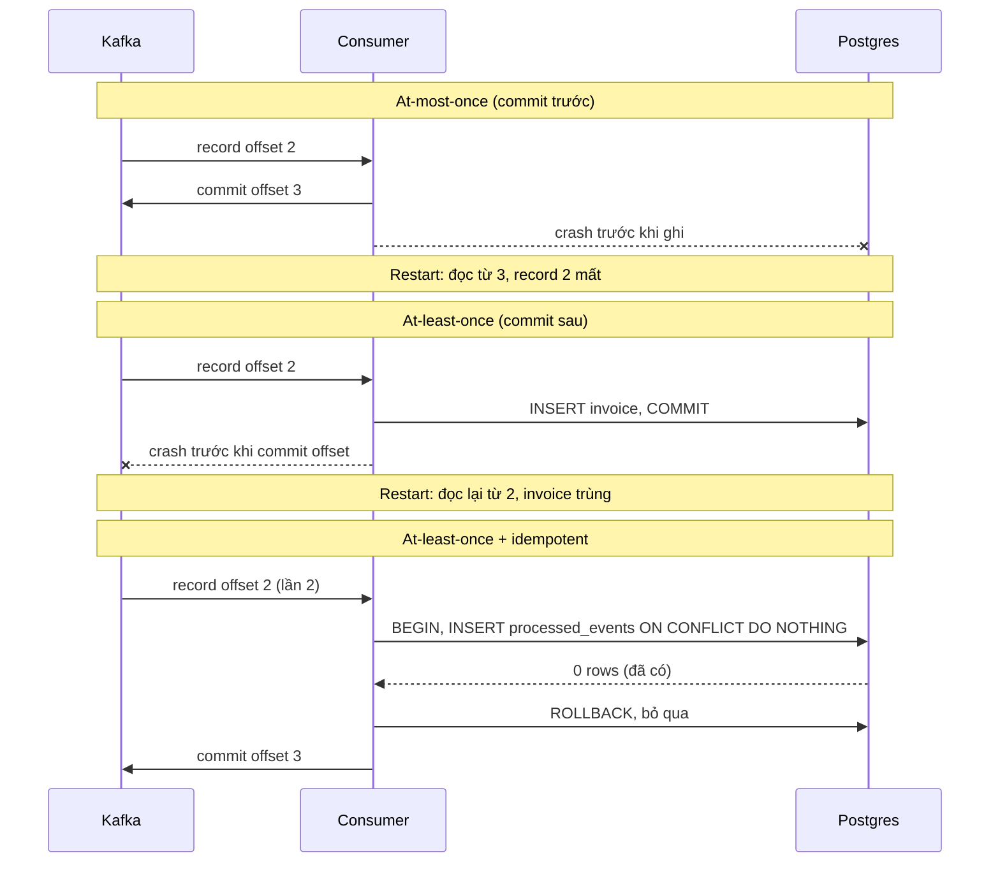
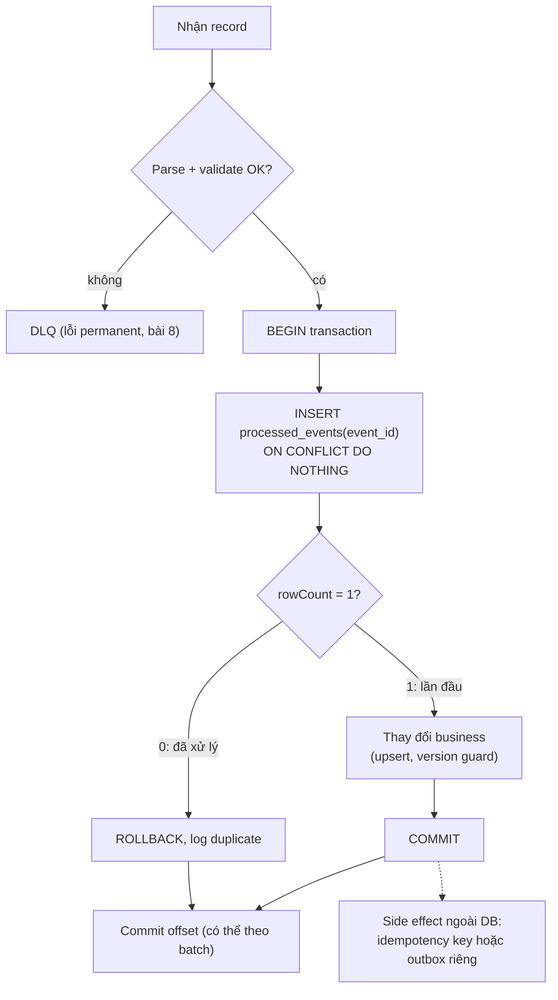

## Bối cảnh & vấn đề

Sau một lần deploy chiều thứ sáu, 37 khách nhận hai email "Đơn hàng của bạn đã được xác nhận". Một tuần sau, kế toán phát hiện ba đơn có hai hoá đơn. Không có ai gửi event hai lần: producer gửi đúng một record cho mỗi đơn. Consumer cũng "đúng": nó commit offset **sau** khi xử lý, như mọi hướng dẫn khuyên.

Chính việc commit sau xử lý gây ra trùng. Pod bị dừng trong lúc deploy sau khi đã gửi email (hoặc ghi hoá đơn) nhưng trước khi kịp commit offset; consumer mới nhận partition và xử lý lại từ offset đã commit cuối. Đây là **at-least-once**, đúng như thiết kế. Thứ còn thiếu là consumer **idempotent**: xử lý một record hai lần cho kết quả như một lần.

Bài này định nghĩa ba delivery semantics bằng một câu hỏi duy nhất (commit trước hay sau side effect), tái hiện thật cả hai cách hỏng, rồi đi qua các kỹ thuật làm consumer idempotent: bảng dedupe trong cùng transaction, thao tác idempotent tự nhiên (upsert, version guard), và idempotency key ở downstream.

## Khái niệm

### Ba delivery semantics

Với một consumer, mọi semantics quy về **thứ tự giữa side effect và commit offset**, cùng với điều gì xảy ra khi crash nằm giữa hai bước:

- **At-most-once**: commit offset **trước**, rồi xử lý. Crash sau commit, trước xử lý → record **mất** (không ai xử lý lại vì offset đã qua nó).
- **At-least-once**: xử lý **trước**, rồi commit. Crash sau xử lý, trước commit → record **xử lý lại** (trùng).
- **Exactly-once**: mỗi record có hiệu ứng **đúng một lần**. Muốn vậy thì side effect và commit offset phải **atomic**: cùng thành công hoặc cùng thất bại.

Không có cách nào khác: hai thao tác ghi vào hai hệ thống (offset vào Kafka, side effect vào DB/email/API) không thể atomic nếu không có transaction chung. Kafka transactions làm được điều đó chỉ khi side effect **cũng là ghi vào Kafka** ([bài 7](/tracks/messaging-kafka/learn/idempotent-producer-transactions)).

**Interview angle:** câu trả lời tốt nhất cho "Kafka có exactly-once không?" là: "Có, trong phạm vi Kafka → Kafka. Với side effect ra ngoài, thực tế là at-least-once + idempotent consumer, hay effectively-once."

### Trùng đến từ đâu

Biết nguồn trùng giúp biết phải chống ở đâu:

- **Consumer**: crash/rebalance/deploy sau khi xử lý, trước khi commit; commit theo batch nên trùng cả batch; handler bị retry sau timeout mà lần đầu thực ra đã thành công.
- **Producer**: retry ở tầng app (gọi `send()` lần hai sau timeout), restart process; idempotent producer chỉ chống trùng do retry nội bộ của một producer session ([bài 7](/tracks/messaging-kafka/learn/idempotent-producer-transactions)).
- **Relay outbox**: publish xong, crash trước khi đánh dấu đã gửi ([bài 9](/tracks/messaging-kafka/learn/outbox-cdc-sagas)).
- **Replay có chủ đích**: reset offset, DLQ replay.

Vì có quá nhiều nguồn, chiến lược đúng là **chống trùng ở consumer** (điểm cuối), không cố loại trùng ở từng bước.

**Interview angle:** câu CV "consumer của bạn xử lý trùng thế nào?" cần nêu được nguồn trùng cụ thể trong hệ thống của bạn, không chỉ "dùng event id".

### Event id

Mọi kỹ thuật dedupe đều cần một **định danh ổn định** cho mỗi sự kiện: `event_id` (UUID) do producer/outbox sinh **một lần** khi sự kiện xảy ra và giữ nguyên qua mọi lần gửi lại, retry topic, DLQ replay. Không dùng offset làm id: cùng sự kiện được publish hai lần (relay crash) sẽ có hai offset khác nhau. Không dùng `hash(payload)`: hai sự kiện thật giống hệt nhau (khách nạp 100k hai lần) sẽ bị gộp sai.

Với event mang trạng thái (state transfer), thường có thêm **version** hoặc `updated_at` của aggregate, dùng để từ chối bản cũ (xem version guard).

### Bảng processed_events trong cùng transaction

Cách tổng quát nhất: bảng `processed_events(event_id PRIMARY KEY)`. Trong **cùng một transaction DB** với thay đổi business: insert `event_id` với `ON CONFLICT DO NOTHING`; nếu không insert được dòng nào (đã có) → bản trùng, rollback và bỏ qua; nếu insert được → làm thay đổi business, commit.

Chìa khoá là **cùng transaction**. Nếu insert `processed_events` ở một transaction và thay đổi business ở transaction khác (hoặc ở Redis), crash giữa hai bước để lại trạng thái "đã đánh dấu nhưng chưa làm" (mất) hoặc "đã làm nhưng chưa đánh dấu" (trùng). Unique constraint trên primary key cũng xử lý được hai consumer xử lý cùng event **song song** (rebalance chồng lấn như ví dụ KafkaJS ở [bài 5](/tracks/messaging-kafka/learn/rebalance-liveness)): transaction thứ hai chờ lock rồi gặp conflict.

Giữ dòng trong `processed_events` bao lâu? Ít nhất bằng **cửa sổ có thể nhận trùng**: retention của topic cộng thời gian tối đa có thể replay (DLQ, reset offset). Xoá sớm hơn thì một lần replay sau đó tạo trùng thật. Thường giữ 7–30 ngày và xoá theo partition thời gian (`processed_at`).

**Interview angle:** follow-up "giữ processed_events bao lâu?" muốn nghe bạn gắn con số với retention và quy trình replay.

### Thao tác idempotent tự nhiên

Nhiều thao tác vốn idempotent, không cần bảng dedupe:

- **Upsert theo business key**: `INSERT … ON CONFLICT (order_id) DO UPDATE`. Chạy hai lần ra cùng kết quả.
- **Set trạng thái thay vì cộng dồn**: `UPDATE orders SET status = 'PAID' WHERE id = $1 AND status <> 'PAID'` idempotent; `UPDATE balance SET amount = amount + 100` thì không.
- **Version guard**: chỉ ghi nếu version mới lớn hơn version đang có: `… DO UPDATE SET … WHERE target.version < excluded.version`. Vừa chống trùng vừa chống **bản cũ đến muộn** (out-of-order, replay).

Thao tác cộng dồn (số dư, tồn kho, counter) không bao giờ idempotent tự nhiên; chúng cần bảng dedupe hoặc lưu "event đã áp dụng" cạnh dữ liệu.

### Side effect ra ngoài DB

Email, SMS, push, gọi payment gateway không nằm trong transaction DB của bạn. Có ba mức:

1. **Downstream hỗ trợ idempotency key**: gửi `Idempotency-Key: <event_id>` (Stripe, nhiều payment API, một số email provider). Downstream tự dedupe. Tốt nhất.
2. **Ghi nhận trước rồi gửi**: insert `sent_notifications(event_id)` (unique) rồi mới gửi. Crash sau insert, trước gửi → **không gửi** (at-most-once cho email). Crash sau gửi, trước commit offset → lần sau thấy đã có dòng, bỏ qua. Chọn mức này khi "thiếu một email" tốt hơn "thừa một email".
3. **Gửi rồi ghi nhận**: crash giữa hai bước → trùng. Chọn khi "thiếu" tệ hơn "thừa" (OTP, cảnh báo bảo mật).

Không có cách nào đạt exactly-once với một downstream không có idempotency key. Có thể thu nhỏ cửa sổ (ghi trạng thái `sending` → gửi → `sent`, và một job đối soát xử lý các dòng kẹt ở `sending`), nhưng không đóng nó hoàn toàn.

**Interview angle:** follow-up "provider email không có idempotency key?" — nói rõ bạn chọn thiếu hay thừa, và vì sao, kèm job đối soát.

### Elasticsearch external versioning

Indexer đồng bộ DB sang Elasticsearch gặp cả trùng lẫn đảo thứ tự (replay, retry bulk, hai partition). ES có sẵn version guard: index với `version_type=external&version=<v>`, ES chỉ chấp nhận nếu `v` **lớn hơn** version đang lưu; ngược lại trả `409 version_conflict_engine_exception`. Dùng `version` là sequence của aggregate hoặc `updated_at` dạng epoch millis. Consumer coi 409 là "đã có bản mới hơn", bỏ qua, không retry.

**Interview angle:** câu CV về Indexer Service muốn nghe external versioning + key theo productId + coi 409 là thành công.

## Cơ chế hoạt động

Hai thứ tự commit và điểm crash:



Luồng xử lý của một idempotent consumer:



Hai điểm trong sơ đồ: bản trùng **vẫn commit offset** (nếu không, consumer kẹt ở record trùng); và side effect ngoài DB được tách khỏi transaction, tốt nhất bằng cách ghi một "lệnh gửi email" vào outbox trong cùng transaction rồi để một worker khác gửi với idempotency key ([bài 9](/tracks/messaging-kafka/learn/outbox-cdc-sagas)).

## Ví dụ thực tế

Chạy thật: Kafka 4.2.0, Postgres 18.6, `kafkajs@2.2.4`, `pg@8.23.1`, Node 24. Topic `order-paid` 1 partition với 5 event (`order-1` … `order-5`), mỗi event có `eventId` UUID.

### At-most-once: commit trước, crash, mất order-3

```ts
await c.run({ autoCommit: false, eachMessage: async ({ topic, partition, message }) => {
  const evt = JSON.parse(message.value!.toString());
  await c.commitOffsets([{ topic, partition, offset: String(Number(message.offset) + 1) }]); // commit FIRST
  if (++n === crashAt) { console.log(`offset ${message.offset} ${evt.orderId}: committed, 💥 crash before DB write`); process.exit(1); }
  await db.query("INSERT INTO invoices(order_id, amount) VALUES ($1,$2)", [evt.orderId, evt.amount]);
  console.log(`offset ${message.offset} ${evt.orderId}: invoice created`);
}});
```

```text
offset 0 order-1: invoice created
offset 1 order-2: invoice created
offset 2 order-3: committed, 💥 crash before DB write
--- restart
offset 3 order-4: invoice created
offset 4 order-5: invoice created

 order_id | count
----------+-------
 order-1  |     1
 order-2  |     1
 order-4  |     1
 order-5  |     1
(4 rows)
```

`order-3` không bao giờ có hoá đơn, và không có log lỗi nào sau restart.

### At-least-once không dedupe: crash sau DB commit, order-3 hai hoá đơn

```ts
await client.query("BEGIN");
await client.query("INSERT INTO invoices(order_id, amount) VALUES ($1,$2)", [evt.orderId, evt.amount]);
await client.query("COMMIT");
console.log(`offset ${message.offset} ${evt.orderId}: invoice created`);
if (++handled === crashAfter) { console.log("💥 crash after DB commit, before offset commit"); process.exit(1); }
await c.commitOffsets([{ topic, partition, offset: String(Number(message.offset) + 1) }]);
```

```text
=== mode=naive run 1 (crash on 3rd)
offset 0 order-1: invoice created
offset 1 order-2: invoice created
offset 2 order-3: invoice created
💥 crash after DB commit, before offset commit
=== mode=naive run 2 (restart)
offset 2 order-3: invoice created
offset 3 order-4: invoice created
offset 4 order-5: invoice created

 order_id | count
----------+-------
 order-1  |     1
 order-2  |     1
 order-3  |     2
 order-4  |     1
 order-5  |     1
```

### At-least-once + processed_events: trùng bị chặn

```ts
await client.query("BEGIN");
const r = await client.query(
  "INSERT INTO processed_events(event_id) VALUES ($1) ON CONFLICT DO NOTHING", [evt.eventId]);
if (r.rowCount === 0) {
  await client.query("ROLLBACK");
  console.log(`offset ${message.offset} ${evt.orderId}: duplicate, skipped`);
} else {
  await client.query("INSERT INTO invoices(order_id, amount) VALUES ($1,$2)", [evt.orderId, evt.amount]);
  await client.query("COMMIT");
  console.log(`offset ${message.offset} ${evt.orderId}: invoice created`);
}
```

```text
=== mode=dedupe run 1 (crash on 3rd)
offset 0 order-1: invoice created
offset 1 order-2: invoice created
offset 2 order-3: invoice created
💥 crash after DB commit, before offset commit
=== mode=dedupe run 2 (restart)
offset 2 order-3: duplicate, skipped
offset 3 order-4: invoice created
offset 4 order-5: invoice created

 order_id | count
----------+-------
 order-1  |     1
 order-2  |     1
 order-3  |     1
 order-4  |     1
 order-5  |     1
```

Cùng điểm crash, cùng việc xử lý lại offset 2, nhưng lần hai bị nhận ra là trùng. Trong Prisma, cùng ý tưởng là `$transaction` với `$executeRaw ... ON CONFLICT DO NOTHING` và kiểm tra số dòng trả về bằng 0.

### Version guard trong Postgres

```sql
CREATE TABLE product_view(id text PRIMARY KEY, price int, version bigint NOT NULL);

-- v5 arrives first
INSERT INTO product_view VALUES ('p-1', 1500, 5)
ON CONFLICT (id) DO UPDATE SET price = excluded.price, version = excluded.version
WHERE product_view.version < excluded.version;
-- late v3 (out of order / replay)
INSERT INTO product_view VALUES ('p-1', 1400, 3) ON CONFLICT (id) DO UPDATE
SET price = excluded.price, version = excluded.version WHERE product_view.version < excluded.version;
-- duplicate v5
INSERT INTO product_view VALUES ('p-1', 1500, 5) ON CONFLICT (id) DO UPDATE
SET price = excluded.price, version = excluded.version WHERE product_view.version < excluded.version;
SELECT * FROM product_view;
```

```text
INSERT 0 1
INSERT 0 0
INSERT 0 0
 id  | price | version
-----+-------+---------
 p-1 |  1500 |       5
```

Bản cũ (v3) và bản trùng (v5) đều cho `INSERT 0 0`: không ghi gì, không lỗi. Một câu lệnh xử lý cả trùng lẫn đảo thứ tự, không cần bảng dedupe.

### Indexer: chặn bản cũ bằng external version

Elasticsearch 9.5.3, version = `updated_at` dạng epoch millis:

```bash
curl -XPUT 'localhost:59200/products/_doc/p-1?version=1790822000005&version_type=external' \
  -H 'content-type: application/json' -d '{"name":"Laptop","price":1500}'
curl -XPUT 'localhost:59200/products/_doc/p-1?version=1790822000003&version_type=external' \
  -H 'content-type: application/json' -d '{"name":"Laptop","price":1400}'
```

```text
{"_index":"products","_id":"p-1","_version":1790822000005,"result":"created",...}
{"error":{"root_cause":[{"type":"version_conflict_engine_exception","reason":"[p-1]: version conflict, current version [1790822000005] is higher or equal to the one provided [1790822000003]",...}],...},"status":409}
```

Document vẫn giữ `price: 1500`. Indexer trong bulk request coi item 409 là "đã có bản mới hơn" và không đưa vào retry. Khi đổi mapping, reindex sang index mới rồi đổi alias; external version đi theo document nếu reindex giữ version (verify tham số `version_type` khi dùng `_reindex`).

### Email trùng sau deploy: sửa thế nào

Thứ tự ưu tiên khi sửa sự cố ở đầu bài:

1. **Idempotency ở side effect**: provider có `Idempotency-Key` thì dùng `event_id`; nếu không, bảng `sent_notifications(event_id unique, status)` với trạng thái `sending/sent`, insert trước khi gửi, và một job đối soát xử lý các dòng kẹt ở `sending` quá 10 phút (kiểm tra log provider rồi quyết định gửi lại hay không).
2. **Graceful shutdown**: dừng nhận, xử lý nốt, commit, rồi mới thoát ([bài 11](/tracks/messaging-kafka/learn/nodejs-clients-socketio)); `terminationGracePeriodSeconds` > thời gian xử lý tối đa một batch.
3. **Giảm rebalance**: static membership, cooperative/KIP-848 ([bài 5](/tracks/messaging-kafka/learn/rebalance-liveness)).

Bước 2 và 3 giảm số lần trùng; chỉ bước 1 làm cho trùng vô hại.

### Kiểm tra một consumer thật sự idempotent (minh hoạ)

Test đáng tin nhất là tái hiện điều production làm: chạy consumer với dữ liệu thật, giết process ở các điểm khác nhau (trước DB commit, sau DB commit, sau side effect), restart, rồi so trạng thái cuối với một lần chạy không crash. Thêm một test replay: reset offset về đầu và chạy lại cả topic, trạng thái cuối phải không đổi. Ví dụ ở trên chính là dạng test đó, với một tham số `crashAfter`.

## Trade-offs & lựa chọn thay thế

| Kỹ thuật | Chống trùng | Chống đảo thứ tự | Chi phí | Khi nào |
| --- | --- | --- | --- | --- |
| `processed_events` cùng transaction | Có | Không | Một insert + index mỗi event, cần dọn bảng | Thao tác cộng dồn, tạo bản ghi mới |
| Upsert theo business key | Có | Không (bản cũ ghi đè bản mới) | Thấp | Sync dữ liệu, read model đơn giản |
| Upsert + version guard | Có | Có | Thấp, cần version trong event | Read model, state transfer |
| Lưu offset trong DB cùng transaction | Có | Theo partition | Tự quản seek | Sink là một DB, throughput cao ([bài 7](/tracks/messaging-kafka/learn/idempotent-producer-transactions)) |
| Dedupe bằng Redis `SET NX EX` | Có, trong TTL | Không | Thấp, nhanh | Việc không quan trọng; không cho tiền |
| Idempotency key ở downstream | Có (ở downstream) | Không | Phụ thuộc provider | Payment, email, API ngoài |

Chọn thế nào: read model và sync dữ liệu dùng upsert + version guard (một câu lệnh, xử lý cả trùng lẫn thứ tự). Thao tác tạo bản ghi hoặc cộng dồn (hoá đơn, ledger, tồn kho) dùng `processed_events` trong cùng transaction. Gọi ra ngoài thì dùng idempotency key của downstream, hoặc bảng ghi nhận với lựa chọn thiếu/thừa có chủ đích. Redis dedupe chỉ là tối ưu (lọc trùng nhanh trước khi chạm DB), không phải lớp bảo vệ cuối cho nghiệp vụ tiền: TTL hết hoặc Redis mất dữ liệu là trùng thật. Và nếu dùng Redis `SET NX` **trước** khi xử lý, xử lý lỗi sau đó làm event bị coi là "đã xử lý" (mất).

## Edge cases & failure modes

- **Dọn `processed_events` quá sớm**: xoá dòng 3 ngày tuổi trong khi retention là 7 ngày; một lần reset offset về 5 ngày trước tạo trùng hàng loạt.
- **event_id sinh lại khi retry**: producer sinh UUID mới mỗi lần `send()` (kể cả retry ở tầng app) làm dedupe vô dụng. Id phải sinh một lần khi sự kiện xảy ra (trong outbox row).
- **Transaction quá dài**: dedupe + business + gọi API ngoài trong cùng transaction DB giữ lock lâu, làm nghẽn. Gọi ra ngoài phải nằm ngoài transaction.
- **Version bằng `updated_at`**: hai cập nhật trong cùng millisecond có cùng version; bản thứ hai bị bỏ qua. Dùng sequence tăng đơn điệu của aggregate nếu có.
- **Hai consumer cùng xử lý một event song song** (rebalance chồng lấn): unique constraint làm transaction thứ hai chờ lock rồi conflict; không có constraint thì cả hai đều ghi.
- **Bản trùng không commit offset**: consumer gặp trùng rồi `return` sớm mà quên đánh dấu offset (với code tự quản offset) → kẹt hoặc xử lý lại mãi.
- **409 từ ES bị đưa vào retry**: retry mãi một lỗi không bao giờ hết; DLQ đầy rác. 409 với external version là thành công.

## Pitfalls

- ❌ "Kafka có exactly-once nên consumer không cần idempotent" → ✅ EOS chỉ trong Kafka → Kafka; ghi DB/email cần idempotency riêng.
- ❌ Dedupe bằng offset → ✅ dùng `event_id` sinh một lần ở nguồn; cùng event có thể có nhiều offset.
- ❌ Insert `processed_events` và thay đổi business ở hai transaction → ✅ cùng một transaction.
- ❌ Dedupe bằng Redis TTL cho nghiệp vụ tiền → ✅ DB unique constraint; Redis chỉ là bộ lọc nhanh phía trước.
- ❌ `amount = amount + x` không có dedupe → ✅ bảng dedupe, hoặc ledger insert-only với unique `event_id`.
- ❌ Coi graceful shutdown là giải pháp cho email trùng → ✅ nó giảm số lần; idempotency mới làm trùng vô hại.
- ❌ Retry lỗi version conflict → ✅ conflict = đã có bản mới hơn, bỏ qua.

## Tóm tắt

- Semantics = thứ tự giữa side effect và commit offset: commit trước → at-most-once (mất), commit sau → at-least-once (trùng).
- Exactly-once cần side effect và offset atomic; với sink ngoài Kafka, thực tế là at-least-once + idempotent consumer.
- Trùng đến từ consumer (crash, rebalance, deploy), producer (retry tầng app), relay, và replay; chống ở consumer.
- `event_id` sinh một lần ở nguồn; `processed_events` insert `ON CONFLICT DO NOTHING` trong cùng transaction với business.
- Upsert + version guard xử lý cả trùng và bản cũ đến muộn; ES có `version_type=external`, coi 409 là thành công.
- Side effect ra ngoài: idempotency key của downstream; nếu không có, chọn thiếu hay thừa có chủ đích và có job đối soát.
- Giữ dòng dedupe ít nhất bằng retention + cửa sổ replay.
