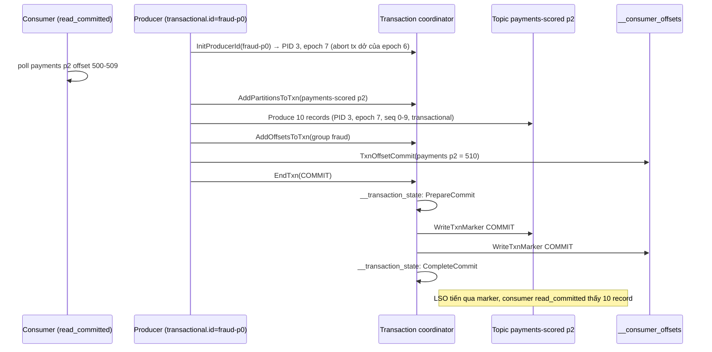
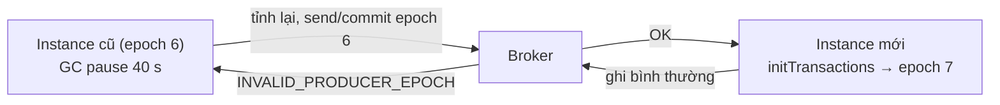

## Bối cảnh & vấn đề

Pipeline `payments → fraud-score → payments-scored` đọc mỗi payment, tính điểm rủi ro, rồi ghi kết quả sang topic khác. Đội thấy hai hiện tượng. Một: thỉnh thoảng `payments-scored` có hai bản giống hệt nhau cho một payment, dù consumer chỉ xử lý một lần; log producer có `NETWORK_EXCEPTION` rồi "retrying". Hai: sau mỗi lần pod bị OOM-kill rồi khởi động lại, một số payment được score hai lần với hai kết quả khác nhau (model được cập nhật giữa chừng).

Hiện tượng một là **trùng do producer retry**: request đầu thực ra đã ghi thành công, chỉ ack bị mất trên đường về. Hiện tượng hai là **trùng do consumer xử lý lại** sau khi output đã được ghi nhưng offset input chưa commit. Kafka có hai cơ chế cho đúng hai vấn đề này: **idempotent producer** và **transactions**. Bài này giải thích chúng chạy thế nào ở mức broker, đo xem client Node nào thực sự bật chúng, và vạch rõ ranh giới mà nhiều người hiểu nhầm: transactions của Kafka không phủ được một lệnh ghi Postgres.

## Khái niệm

### Idempotent producer: PID và sequence number

Khi bật `enable.idempotence=true`, producer xin broker một **producer id (PID)** và một **epoch**. Mỗi batch gửi tới một partition mang **sequence number** tăng dần theo `(PID, partition)`. Broker nhớ sequence cuối cùng đã ghi của mỗi PID trên mỗi partition (5 batch gần nhất):

- Batch có sequence **đã thấy** → bản retry trùng; broker trả ack thành công nhưng **không ghi lại**.
- Batch có sequence **nhảy cóc** (lớn hơn kỳ vọng) → batch trước nó chưa tới; broker từ chối `OUT_OF_ORDER_SEQUENCE_NUMBER`, producer gửi lại theo thứ tự.

Nhờ vậy retry không tạo trùng và không đảo thứ tự, kể cả với tối đa 5 request in-flight (`max.in.flight.requests.per.connection ≤ 5`). Idempotence yêu cầu `acks=all` và `retries > 0`. Java client bật mặc định từ Kafka 3.0 (KIP-679), trừ khi config tường minh xung đột.

**Interview angle:** "idempotent producer chạy thế nào?" — PID + sequence theo partition, broker dedupe; nêu thêm điều kiện in-flight ≤ 5 và `acks=all`.

### Idempotent producer không chống được gì

Phạm vi của idempotence là **một producer session trên từng partition**:

- App gọi `send()` **hai lần** cho cùng dữ liệu (retry ở tầng app sau timeout, hoặc user bấm hai lần): hai record khác nhau với hai sequence khác nhau. Broker không biết chúng "giống nhau".
- Process **restart**: producer mới nhận PID mới, sequence bắt đầu lại; bản gửi lại sau restart không được dedupe.
- Trùng ở **consumer** (xử lý lại sau crash) và trùng do **dual write** (DB + Kafka): hoàn toàn ngoài phạm vi.

Muốn dedupe xuyên restart cần `transactional.id` (dưới đây) hoặc `event_id` + consumer idempotent ([bài 6](/tracks/messaging-kafka/learn/delivery-semantics-idempotency)).

**Interview angle:** câu hỏi "nó không bảo vệ khỏi cái gì?" là nơi phân loại mid và senior: liệt kê được ba trường hợp trên.

### Transactional producer và fencing

Producer có `transactional.id` (chuỗi **ổn định** qua restart, ví dụ `fraud-score-p0`) đăng ký với **transaction coordinator** (một broker). Mỗi lần khởi tạo (`initTransactions`), coordinator **tăng epoch** của transactional.id đó và hoàn tất (abort) mọi transaction dang dở của epoch cũ.

Đây là cơ chế **fencing**: nếu instance cũ (zombie, ví dụ bị GC pause hoặc network partition rồi tỉnh lại) cố ghi hoặc commit với epoch cũ, broker từ chối với `INVALID_PRODUCER_EPOCH` / `ProducerFenced`. Chỉ một instance cho mỗi transactional.id có thể ghi tại một thời điểm.

Trong một transaction, producer có thể:

1. `beginTransaction()`.
2. Gửi record tới **nhiều partition, nhiều topic**.
3. `sendOffsetsToTransaction(offsets, consumerGroupMetadata)`: ghi offset của input vào `__consumer_offsets` **như một phần của transaction**.
4. `commitTransaction()` hoặc `abortTransaction()`: tất cả hoặc không gì cả.

Coordinator ghi trạng thái transaction vào topic nội bộ `__transaction_state`, rồi ghi **control record** (marker COMMIT hoặc ABORT) vào mọi partition tham gia.

**Interview angle:** follow-up "zombie producer là gì, epoch fence nó thế nào?" — instance cũ còn sống sau khi instance mới thay thế; epoch tăng ở `initTransactions` nên epoch cũ bị từ chối.

### `isolation.level`, LSO và control record

Record của transaction được ghi vào log **ngay** khi gửi, trước khi commit. Consumer quyết định có thấy chúng hay không bằng `isolation.level`:

- `read_uncommitted`: đọc tới high watermark, thấy cả record của transaction đang mở hoặc đã abort. **Mặc định của Java consumer.**
- `read_committed`: chỉ đọc tới **LSO (last stable offset)**, tức offset nhỏ nhất của transaction còn đang mở; record của transaction đã abort bị lọc ra (consumer nhận danh sách aborted transaction từ broker).

Lưu ý mặc định khác nhau giữa client: Java mặc định `read_uncommitted`; **KafkaJS** mặc định `readUncommitted: false` (tức read_committed) và **librdkafka** mặc định `isolation.level=read_committed` (đã kiểm tra source KafkaJS 2.2.4; librdkafka verify theo version).

Hệ quả quan trọng của LSO: một transaction mở lâu **chặn mọi record phía sau nó** trên partition đó, kể cả record **không thuộc transaction nào**. Consumer read_committed đứng yên dù có dữ liệu mới; lag tăng. Giới hạn là `transaction.timeout.ms` (mặc định 60 s ở producer, tối đa `transaction.max.timeout.ms` 15 phút ở broker): quá hạn thì coordinator tự abort.

**Interview angle:** "vì sao transaction dài làm tăng lag của consumer read_committed?" — LSO bị giữ lại ở đầu transaction đang mở.

### Exactly-once read-process-write

Ghép ba mảnh: consumer đọc input với `read_committed`, xử lý, producer transactional ghi output **và** offset input trong cùng transaction, commit. Nếu crash trước commit: transaction bị abort (khi instance mới `initTransactions` hoặc khi timeout), output bị lọc với consumer downstream, offset input không tiến, và instance mới xử lý lại. Kết quả quan sát được từ downstream: mỗi input có đúng một output.

Kafka Streams đóng gói toàn bộ điều này bằng `processing.guarantee=exactly_once_v2` (KIP-447, dùng một producer mỗi thread thay vì mỗi partition). Kafka 4.x thêm phòng thủ phía server cho transaction (KIP-890, `transaction.version=2` trên cụm ví dụ) để chặn một số tình huống "transaction treo" (verify chi tiết theo version).

### Ranh giới: EOS không phủ sink ngoài Kafka

Transaction Kafka gom **ghi Kafka + commit offset**. Ghi Postgres, gọi HTTP, gửi email nằm **ngoài**:

1. Consumer ghi Postgres, Postgres commit.
2. Crash trước khi commit transaction Kafka (offset chưa tiến).
3. Instance mới đọc lại record, ghi Postgres **lần hai**.

Không có giao thức two-phase commit giữa Kafka và Postgres. Cách đạt effectively-once với một DB sink:

- **Lưu offset trong DB** cùng transaction với dữ liệu business; khi khởi động hoặc khi được giao partition, đọc offset từ DB và `seek()` tới đó (bỏ qua committed offset của Kafka).
- Hoặc dedupe table / upsert idempotent như [bài 6](/tracks/messaging-kafka/learn/delivery-semantics-idempotency).

**Interview angle:** câu gotcha "teammate nói bật transactions thì consumer ghi Postgres là exactly-once" chỉ có một đáp án đúng: không, và giải thích bằng ba bước trên.

## Cơ chế hoạt động

Một transaction read-process-write:



Thứ tự chú ý: record output được ghi **trước** commit; chúng chỉ "hiện ra" với consumer read_committed khi marker COMMIT được ghi. Offset input cũng chỉ có hiệu lực khi marker được ghi vào `__consumer_offsets`. Vì cả hai marker do coordinator ghi sau khi đã chuyển trạng thái `PrepareCommit` (bền trong `__transaction_state`), một crash ở bất kỳ đâu sau `PrepareCommit` vẫn kết thúc bằng commit; trước đó thì kết thúc bằng abort.

Fencing zombie:



## Ví dụ thực tế

Kafka 4.2.0 (3 broker, `transaction.version=2`), `kafkajs@2.2.4`, `@confluentinc/kafka-javascript@1.10.1`, Node 24.

### Client nào bật idempotence mặc định?

Gửi một record vào topic `idem-check` từ bốn producer, rồi đọc log segment bằng `kafka-dump-log.sh`:

```ts
const p1 = kafka.producer();                                            // kafkajs default
const p2 = kafka.producer({ idempotent: true, maxInFlightRequests: 1 }); // kafkajs explicit
const p3 = confluentKafka.producer();                                   // confluent-js default
// + `echo java-console | kafka-console-producer.sh --topic idem-check`
```

```text
baseOffset: 0 producerId: 4 producerEpoch: 0
   sequence: 0 payload: java-console
baseOffset: 1 producerId: -1 producerEpoch: 0
   sequence: 0 payload: kafkajs-default
baseOffset: 2 producerId: 5 producerEpoch: 0
   sequence: 0 payload: kafkajs-idempotent
baseOffset: 3 producerId: -1 producerEpoch: -1
   sequence: -1 payload: confluent-js-default
```

`producerId: -1` nghĩa là **không idempotent**. Java console producer có PID (idempotent mặc định từ 3.0). KafkaJS mặc định không, và confluent-js (librdkafka, `enable.idempotence` mặc định `false`) cũng không. Câu "idempotence mặc định bật từ Kafka 3.0" chỉ đúng với **Java client**; với Node phải bật tường minh.

### Commit và abort, nhìn từ hai isolation level

```ts
const producer = kafka.producer({ transactionalId: "billing-tx-1", idempotent: true, maxInFlightRequests: 1 });
await producer.connect();
let tx = await producer.transaction();
await tx.send({ topic: "tx-out", messages: [{ key: "o-1", value: "committed-1" }, { key: "o-2", value: "committed-2" }] });
await tx.commit();
tx = await producer.transaction();
await tx.send({ topic: "tx-out", messages: [{ key: "o-3", value: "aborted-1" }, { key: "o-4", value: "aborted-2" }] });
await tx.abort();
```

```text
isolation read_uncommitted -> 0:committed-1 1:committed-2 3:aborted-1 4:aborted-2
isolation read_committed   -> 0:committed-1 1:committed-2
```

Offset 2 và 5 không xuất hiện ở cả hai: đó là **control record**, client lọc chúng đi. Dump log thấy rõ:

```text
| offset: 0 ... sequence: 0 headerKeys: [] key: o-1 payload: committed-1
| offset: 1 ... sequence: 1 headerKeys: [] key: o-2 payload: committed-2
| offset: 2 ... sequence: -1 headerKeys: [] endTxnMarker: COMMIT coordinatorEpoch: 0
| offset: 3 ... sequence: 2 headerKeys: [] key: o-3 payload: aborted-1
| offset: 4 ... sequence: 3 headerKeys: [] key: o-4 payload: aborted-2
| offset: 5 ... sequence: -1 headerKeys: [] endTxnMarker: ABORT coordinatorEpoch: 0
```

Record bị abort **vẫn nằm trong log**, chiếm offset và dung lượng; chỉ bị lọc khi đọc. Hệ quả: offset của topic transactional không liên tục với consumer (lỗ hổng ở marker), và lag tính theo offset bao gồm cả marker.

### Zombie bị fence

```ts
const mk = () => kafka.producer({ transactionalId: "invoice-writer-p0", idempotent: true, maxInFlightRequests: 1, retry: { retries: 1 } });
const zombie = mk(); await zombie.connect();
const ztx = await zombie.transaction();
await ztx.send({ topic: "tx-out", messages: [{ value: "from-zombie" }] });
console.log("zombie: tx open, then GC pause / network partition...");
const fresh = mk(); await fresh.connect();
const ftx = await fresh.transaction();                  // same transactional.id -> InitProducerId bumps the epoch
console.log("fresh instance began a transaction with the same transactional.id");
try { await ztx.send({ topic: "tx-out", messages: [{ value: "zombie-2" }] }); await ztx.commit(); console.log("zombie commit OK (bad!)"); }
catch (e: any) { console.log(`zombie commit -> ${e.type ?? e.name}: ${e.message}`); }
```

```text
zombie: tx open, then GC pause / network partition...
fresh instance began a transaction with the same transactional.id
zombie commit -> INVALID_PRODUCER_EPOCH: Producer attempted an operation with an old epoch. Either there is a newer producer with the same transactionalId, or the producer's transaction has been expired by the broker
```

Một chi tiết của KafkaJS: `connect()` chưa gọi `InitProducerId`; lần thử đầu (fence ngay sau `connect()`) cho kết quả "zombie commit OK". Fencing chỉ có hiệu lực khi instance mới thực sự khởi tạo transaction (`transaction()`). Với Java, `initTransactions()` là bước tường minh.

### Transaction mở chặn read_committed

```ts
await plain.send({ topic: "lso-demo", messages: [{ value: "before" }] });
const tx = await txp.transaction();
await tx.send({ topic: "lso-demo", messages: [{ value: "in-open-tx" }] });
await plain.send({ topic: "lso-demo", messages: [{ value: "plain-1" }, { value: "plain-2" }] }); // NOT transactional
// two consumers from the beginning: read_committed (kafkajs default) and read_uncommitted
await sleep(4000);
await tx.commit();
```

```text
tx open   | read_committed  : before
tx open   | read_uncommitted: before, in-open-tx, plain-1, plain-2
committed | read_committed  : before, in-open-tx, plain-1, plain-2
```

`plain-1` và `plain-2` không thuộc transaction nào, nhưng consumer read_committed không thấy chúng cho tới khi transaction phía trước commit: LSO dừng ở `in-open-tx`. Một batch job mở transaction 10 phút trên topic dùng chung sẽ làm mọi consumer read_committed của partition đó trễ 10 phút.

### Lưu offset trong Postgres (minh hoạ)

Effectively-once với Postgres sink, không dùng committed offset của Kafka. Đoạn dưới là sketch, chưa xử lý mọi trường hợp lỗi:

```ts
// table: consumer_offsets(group_id text, topic text, partition int, next_offset bigint, primary key (group_id, topic, partition))
const c = kafka.consumer({ groupId: "ledger" });
c.on(c.events.GROUP_JOIN, async ({ payload }) => {
  for (const partition of payload.memberAssignment["payments"] ?? []) {
    const { rows } = await db.query(
      "SELECT next_offset FROM consumer_offsets WHERE group_id = 'ledger' AND topic = 'payments' AND partition = $1", [partition]);
    if (rows[0]) c.seek({ topic: "payments", partition, offset: String(rows[0].next_offset) });
  }
});
await c.run({
  autoCommit: false,
  eachMessage: async ({ topic, partition, message }) => {
    await db.tx(async (tx) => {
      await applyLedgerEntry(tx, JSON.parse(message.value!.toString()));
      await tx.query(
        `INSERT INTO consumer_offsets VALUES ('ledger', $1, $2, $3)
         ON CONFLICT (group_id, topic, partition) DO UPDATE SET next_offset = excluded.next_offset`,
        [topic, partition, BigInt(message.offset) + 1n]);
    }); // business row and offset commit or roll back together
  },
});
```

Khi được giao partition, consumer seek tới offset trong DB; xử lý và offset nằm trong cùng transaction Postgres nên không có cửa sổ trùng. Có thể vẫn commit offset vào Kafka (async) chỉ để công cụ đo lag thấy, nhưng nguồn sự thật là DB.

## Trade-offs & lựa chọn thay thế

| Cơ chế | Chống | Phạm vi | Chi phí | Khi nào |
| --- | --- | --- | --- | --- |
| Idempotent producer | Trùng/đảo thứ tự do retry nội bộ | Một session, từng partition | Gần như không | Luôn bật |
| Transactions (Kafka → Kafka) | Trùng output khi consumer xử lý lại, zombie | Ghi Kafka + offset | Thêm round-trip, marker, LSO | Stream processing đọc-ghi Kafka |
| Kafka Streams `exactly_once_v2` | Như trên, đóng gói sẵn | Topology Kafka Streams | Như trên | Ứng dụng Java/Kotlin dùng Streams |
| Offset trong DB sink | Trùng ghi DB | Một DB | Tự quản seek | Consumer ghi một DB, cần chính xác |
| At-least-once + idempotent consumer | Mọi nguồn trùng (nếu thiết kế đúng) | Mọi sink | Bảng dedupe/version | Mặc định cho microservice |

Chọn thế nào: idempotent producer là "bật và quên" (với Node, nhớ bật tường minh). Transactions đáng giá khi pipeline là **Kafka vào, Kafka ra** và trùng ở downstream gây sai (tính tổng, đếm, enrichment chuỗi nhiều bước). Với microservice đọc Kafka rồi ghi DB, transactions không giúp; dùng consumer idempotent hoặc offset trong DB. Kafka transactions trong Node: KafkaJS có hỗ trợ cơ bản nhưng không hỗ trợ `sendOffsets` với KIP-447 đầy đủ như Java (verify); nhiều team chọn idempotent consumer thay vì EOS khi dùng Node.

## Edge cases & failure modes

- **Transaction treo**: producer chết giữa transaction và không ai khởi tạo lại transactional.id đó; LSO đứng yên tới `transaction.timeout.ms`. Với timeout lớn (ví dụ 15 phút) là 15 phút consumer read_committed đứng.
- **transactional.id không ổn định**: sinh ngẫu nhiên mỗi lần start → không bao giờ fence được zombie, transaction dở của instance cũ chỉ được dọn khi timeout.
- **Nhiều instance cùng transactional.id** (cấu hình sai): chúng fence lẫn nhau liên tục, `ProducerFenced` dồn dập.
- **Consumer read_uncommitted với producer transactional**: downstream thấy cả output bị abort; EOS vô nghĩa. Kiểm tra mặc định của từng client.
- **Idempotent producer với `max.in.flight > 5`**: Java từ chối cấu hình; client khác có thể âm thầm mất bảo đảm thứ tự.
- **`UNKNOWN_PRODUCER_ID`**: broker quên PID (producer idle lâu hơn `transactional.id.expiration.ms`/`producer.id.expiration.ms`, hoặc log bị xoá); producer phải reset sequence, có thể kèm cảnh báo về trùng/mất.
- **Side effect bên trong transaction**: gọi HTTP giữa `beginTransaction` và `commit` rồi abort: HTTP đã gửi, không rollback được.

## Pitfalls

- ❌ "Idempotence mặc định bật từ 3.0" cho mọi client → ✅ chỉ Java; KafkaJS và librdkafka phải bật (`idempotent: true` / `enable.idempotence=true`).
- ❌ Idempotent producer chống được retry ở tầng app → ✅ app gọi `send()` hai lần là hai record; cần `event_id` + consumer idempotent.
- ❌ "Bật transactions là exactly-once cho mọi sink" → ✅ chỉ Kafka → Kafka; DB/email/HTTP cần idempotency hoặc offset trong DB.
- ❌ Producer transactional nhưng consumer Java để `isolation.level` mặc định → ✅ đặt `read_committed`.
- ❌ Transaction dài cho batch job trên topic dùng chung → ✅ transaction ngắn; batch lớn tách nhiều transaction, hoặc topic riêng.
- ❌ `transactional.id` ngẫu nhiên → ✅ ổn định theo vai trò/partition (ví dụ theo pod ordinal), để fencing hoạt động.
- ❌ Đếm lag bằng offset trên topic transactional rồi hoảng vì "lag 1 không bao giờ về 0" → ✅ control marker chiếm offset; nhìn lag theo thời gian.

## Tóm tắt

- Idempotent producer: PID + sequence theo partition, broker bỏ bản retry trùng và từ chối batch nhảy cóc; giữ thứ tự với in-flight ≤ 5.
- Nó không chống trùng do app gửi lại, do restart (PID mới), hay ở consumer; Java bật mặc định, KafkaJS/confluent-js thì không.
- Transactional producer: `transactional.id` ổn định + epoch để fence zombie; ghi nhiều partition và offset input atomic.
- Record của transaction nằm trong log ngay; marker COMMIT/ABORT quyết định; `read_committed` đọc tới LSO và lọc record bị abort.
- Transaction mở chặn mọi record phía sau trên partition (kể cả không transactional) với consumer read_committed.
- Mặc định isolation khác nhau: Java read_uncommitted, KafkaJS/librdkafka read_committed.
- EOS chỉ Kafka → Kafka; ghi DB cần offset trong DB cùng transaction hoặc consumer idempotent.
