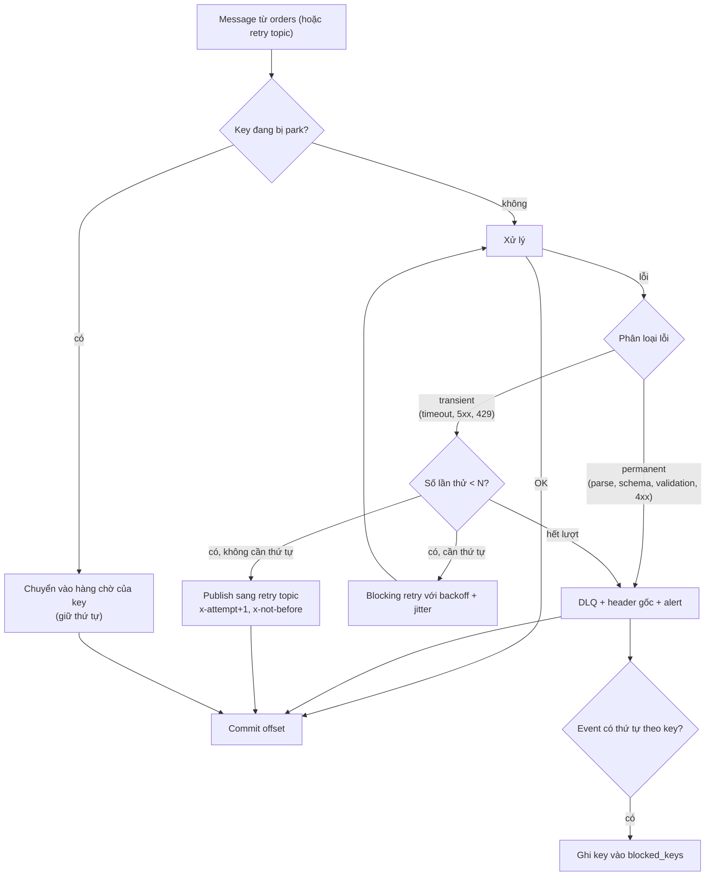
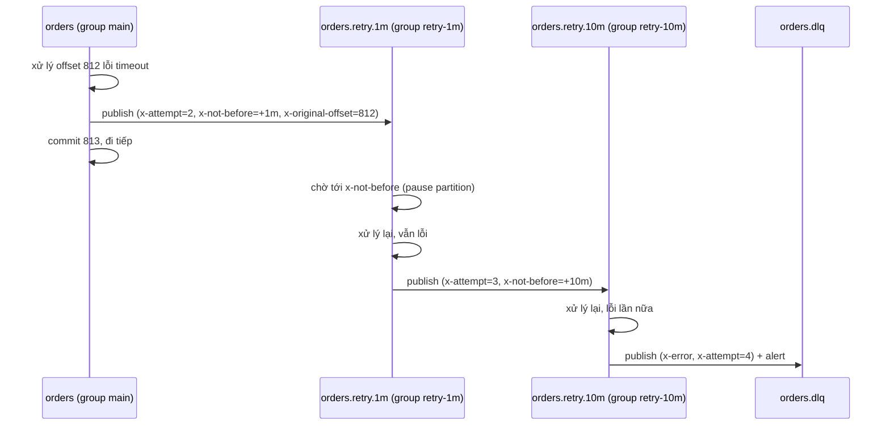

## Bối cảnh & vấn đề

3 giờ sáng, một producer mới deploy gửi event `OrderPaid` với `amount: "1,500.00"` (string có dấu phẩy) thay vì số. Consumer billing parse lỗi, throw. KafkaJS retry message đó, lại lỗi, lại retry. Mỗi lần thất bại, consumer khởi động lại và đọc lại **đúng offset đó**. Partition 4 đứng yên. Mọi đơn hàng hash vào partition 4 (khoảng 1/12 khách hàng) không được xuất hoá đơn cho tới 8 giờ sáng khi có người nhìn thấy lag.

Đây là **poison pill**: một message không bao giờ xử lý được. Kafka xử lý theo offset liên tục, không có "bỏ qua message này, xử lý cái sau, quay lại sau" như queue có ack từng message. Nếu consumer không tự có chiến lược, một message xấu chặn mọi thứ phía sau nó trên partition.

Nhưng "cứ lỗi là đẩy sang DLQ" cũng sai: một timeout DB 2 giây là lỗi tạm thời, đẩy sang DLQ là biến một trục trặc nhỏ thành một việc thủ công. Và đẩy `OrderPaid` sang DLQ rồi xử lý `OrderShipped` của cùng đơn tạo ra trạng thái sai. Bài này đi qua phân loại lỗi, hai kiểu retry, thiết kế DLQ, và cách giữ thứ tự khi có lỗi.

## Khái niệm

### Poison pill

**Poison pill** là message **luôn** làm consumer lỗi, dù thử bao nhiêu lần: không deserialize được (JSON hỏng, Avro sai schema), vi phạm invariant (số tiền âm, thiếu field bắt buộc), hoặc kích hoạt một bug của consumer. Nó khác lỗi tạm thời ở chỗ **thời gian không chữa được nó**.

Hậu quả nếu không xử lý: partition kẹt, lag tăng tuyến tính, có thể **crash-loop** (process chết, restart, đọc lại cùng offset, chết). Trong Kubernetes, crash-loop còn kéo theo rebalance mỗi lần pod restart, làm các partition khác cũng bị gián đoạn.

**Interview angle:** câu trả lời tốt nói "phân loại lỗi trước": deserialization/validation là permanent, đi thẳng DLQ; không retry nó.

### Lỗi transient vs permanent

Phân loại quyết định mọi thứ phía sau:

- **Transient** (tạm thời): timeout DB, connection reset, 503/429 từ API, lock timeout, leader election. Thử lại sau một lúc có khả năng thành công. Xử lý: retry có giới hạn, backoff tăng dần + jitter.
- **Permanent** (vĩnh viễn): JSON/schema sai, validation fail, 400/404/422 từ API, bug logic. Thử lại vô ích. Xử lý: DLQ **ngay**, kèm metadata, alert.
- **Không rõ**: lỗi chưa phân loại. An toàn nhất là coi như transient với số lần thử nhỏ, rồi DLQ.

Phân loại nên dựa vào **loại lỗi**, không phải message lỗi: `instanceof ValidationError`, HTTP status code, mã lỗi của driver DB (`40001` serialization failure là transient, `23505` unique violation thường là permanent hoặc là trùng).

**Interview angle:** interviewer thích hỏi "429 thì sao?" — transient, back-pressure, **không** đưa vào DLQ ([bài 11](/tracks/messaging-kafka/learn/nodejs-clients-socketio)).

### Blocking retry

**Blocking retry**: thử lại **tại chỗ**, trong handler, với backoff (100 ms, 400 ms, 1,6 s…), trước khi chuyển sang message tiếp theo. Ưu điểm lớn nhất: **thứ tự tuyệt đối** trên partition được giữ, vì không message nào vượt qua message đang lỗi. Nhược điểm: trong lúc retry, **cả partition chờ**. Retry 30 giây là 30 giây không có gì khác trên partition đó được xử lý, và với Java client còn phải nằm trong `max.poll.interval.ms` ([bài 5](/tracks/messaging-kafka/learn/rebalance-liveness)).

Blocking retry hợp với lỗi transient ngắn (vài giây) và với event có thứ tự theo key.

### Non-blocking retry: retry topic

**Retry topic**: khi lỗi, publish message sang `orders.retry.1m` (kèm header số lần thử, thời điểm được phép xử lý lại) rồi **commit** offset ở topic chính và đi tiếp. Một consumer riêng đọc retry topic, chờ tới hạn, xử lý lại; lỗi tiếp thì sang `orders.retry.10m`, rồi `orders.dlq`.

Ưu: partition chính không bao giờ kẹt; mỗi tầng có delay riêng. Nhược: **mất thứ tự cho key đó**: trong lúc `OrderPaid` nằm ở retry topic, `OrderShipped` của cùng đơn trên topic chính được xử lý trước. Thêm vào đó là nhiều topic, nhiều consumer group, và retry consumer phải chờ đúng thời điểm mà không giữ partition quá `max.poll.interval.ms` (dùng `pause()`/`resume()` thay vì `sleep` dài).

Kafka không có delay theo message sẵn có như RabbitMQ (TTL + DLX, delayed message plugin) hay SQS (`DelaySeconds`, visibility timeout); retry topic theo tầng là cách mô phỏng.

**Interview angle:** câu "blocking vs non-blocking retry" muốn nghe đúng một trade-off: thứ tự vs throughput của partition.

### Dead-letter queue (DLQ)

**DLQ** (dead-letter topic) là nơi đậu message không xử lý được, để partition chính đi tiếp mà **không mất** message. Kafka không có DLQ sẵn cho consumer (Kafka Connect thì có `errors.deadletterqueue.topic.name`); bạn tự publish sang topic DLQ.

Một message DLQ hữu ích phải có:

- **Payload gốc nguyên vẹn** (bytes, không parse lại, không "sửa"): để replay đúng cái đã nhận.
- **Key gốc**: để replay giữ partition và thứ tự.
- Header: topic, partition, offset gốc; lý do lỗi + loại lỗi + stack (rút gọn); số lần thử; thời điểm; consumer group và version của service.

Quan trọng hơn cả nội dung là **quy trình**: alert khi DLQ có message (với topic quan trọng: DLQ > 0 là page), có **owner**, có dashboard xem nội dung, và có **công cụ replay** sau khi fix. DLQ không ai xem là một thùng rác làm mất dữ liệu chậm hơn.

**Interview angle:** follow-up "replay DLQ an toàn thế nào?" — consumer idempotent, replay theo thứ tự offset gốc, sau khi deploy bản fix, có giới hạn tốc độ, và kiểm tra key đó có event mới hơn chưa.

### Park cả key

Với event có thứ tự theo key (state machine của đơn hàng, ledger theo tài khoản), đẩy **một** event của key K sang DLQ rồi tiếp tục xử lý event sau của K là sai: `OrderShipped` được áp dụng khi chưa có `OrderPaid`. Khi replay `OrderPaid` sau đó, thứ tự đã đảo.

Giải pháp **park key**: khi một event của K vào DLQ, ghi K vào bảng `blocked_keys`. Mọi event sau của K (ở topic chính) cũng được chuyển thẳng vào hàng chờ của K (DLQ hoặc bảng `parked_events` theo thứ tự offset), không xử lý. Khi event lỗi được fix và replay thành công, replay tiếp các event đã park **theo thứ tự**, rồi xoá K khỏi `blocked_keys`.

Cách thay thế nhẹ hơn: consumer kiểm tra **version/sequence** của aggregate và từ chối event nhảy cóc (nhận `Shipped` version 3 khi đang ở version 1 → park). Hoặc dùng blocking retry ngắn cho lỗi transient và chỉ park khi permanent.

Bảng `blocked_keys` cần TTL/quy trình dọn: key bị chặn mà không ai xử lý DLQ sẽ chặn mãi; alert theo tuổi của key bị chặn cũ nhất.

**Interview angle:** câu hỏi kịch bản OrderPaid/OrderShipped là câu senior kinh điển; từ khoá cần nói: park key, replay theo thứ tự offset gốc, version check.

## Cơ chế hoạt động

Luồng xử lý lỗi đầy đủ cho một consumer:



Mọi nhánh đều kết thúc ở "commit offset": đó là điều làm partition chính không bao giờ kẹt. Thứ tự các bước kiểm tra: key bị park được kiểm tra **trước** khi xử lý, nếu không event sau của key lỗi sẽ chen vào.

Tầng retry theo thời gian:



## Ví dụ thực tế

Chạy thật: Kafka 4.2.0, `kafkajs@2.2.4`, Node 24. Ba topic `pay`, `pay.retry`, `pay.dlq`; một payment gateway giả timeout hai lần cho `pay-2`; một message JSON hỏng; một message số tiền âm.

### Retry topic + DLQ với header gốc

```ts
class PermanentError extends Error {}
let gatewayFailuresLeft = 2;                         // payment gateway times out twice for pay-2
async function charge(evt: { id: string; amount: number }) {
  if (!Number.isFinite(evt.amount) || evt.amount <= 0) throw new PermanentError(`invalid amount ${evt.amount}`);
  if (evt.id === "pay-2" && gatewayFailuresLeft-- > 0) throw new Error("gateway timeout");
}
const MAX_ATTEMPTS = 3, RETRY_DELAY_MS = 2000;

async function handle(topic: string, partition: number, m: KafkaMessage) {
  const attempt = Number(h(m.headers, "x-attempt") ?? "1");
  let evt: any;
  try {
    evt = JSON.parse(m.value!.toString());
    await charge(evt);
    log(`${topic}@${m.offset} ${evt.id} ✅ charged (attempt ${attempt})`);
  } catch (err: any) {
    const permanent = err instanceof SyntaxError || err instanceof PermanentError;
    const headers = {
      ...m.headers,
      "x-attempt": String(attempt + 1),
      "x-original-topic": h(m.headers, "x-original-topic") ?? topic,
      "x-original-partition": h(m.headers, "x-original-partition") ?? String(partition),
      "x-original-offset": h(m.headers, "x-original-offset") ?? m.offset,
      "x-error": `${err.name}: ${err.message}`,
      "x-not-before": String(Date.now() + RETRY_DELAY_MS),
    };
    const target = permanent || attempt >= MAX_ATTEMPTS ? "pay.dlq" : "pay.retry";
    await producer.send({ topic: target, messages: [{ key: m.key, value: m.value, headers }] }); // raw bytes, original key
    log(`${topic}@${m.offset} ${evt?.id ?? "?"} ❌ ${err.message} -> ${target}`);
  }
}
// main consumer on "pay", retry consumer on "pay.retry" waits until x-not-before, both call handle()
```

```text
t=0.2s pay@0 pay-1 ✅ charged (attempt 1)
t=0.2s pay@1 pay-2 ❌ gateway timeout -> pay.retry
t=0.2s pay@2 ? ❌ Expected property name or '}' in JSON at position 1 (line 1 column 2) -> pay.dlq
t=0.2s pay@3 pay-4 ❌ invalid amount -5 -> pay.dlq
t=0.2s pay@4 pay-5 ✅ charged (attempt 1)
t=2.2s pay.retry@0 pay-2 ❌ gateway timeout -> pay.retry
t=4.2s pay.retry@1 pay-2 ✅ charged (attempt 3)
```

Topic chính xử lý cả 5 message trong 0,2 s, không kẹt. `pay-2` (transient) thành công ở lần thử thứ 3 qua retry topic. JSON hỏng và số tiền âm (permanent) vào DLQ **ngay**, không tốn lượt retry. Nội dung DLQ:

```text
x-attempt:2,x-original-topic:pay,x-original-partition:0,x-original-offset:2,x-error:SyntaxError: Expected property name or '}' in JSON at position 1 (line 1 column 2),x-not-before:1790823367873   acc-3   {not json
x-attempt:2,x-original-topic:pay,x-original-partition:0,x-original-offset:3,x-error:Error: invalid amount -5,x-not-before:1790823367887 acc-4   {"id":"pay-4","amount":-5}
```

Payload gốc (kể cả `{not json`) và key gốc được giữ nguyên, kèm vị trí gốc. Một chi tiết: `x-error` ghi `Error: invalid amount` chứ không phải `PermanentError`, vì class con không đặt `name`; trong code thật nên đặt `this.name = "PermanentError"` để dashboard nhóm lỗi đúng. Lưu ý thêm: retry consumer ở đây `sleep` tới hạn, chỉ ổn với delay vài giây; delay phút/giờ phải dùng `pause()` + `resume()` để không vượt timeout của group.

### Park key cho state machine đơn hàng (minh hoạ)

Đoạn dưới minh hoạ logic, không chạy trong demo trên:

```ts
async function handleOrderEvent(evt: OrderEvent, raw: KafkaMessage) {
  const blocked = await db.query("SELECT 1 FROM blocked_keys WHERE key = $1", [evt.orderId]);
  if (blocked.rowCount) {
    await db.query("INSERT INTO parked_events(key, original_offset, payload) VALUES ($1, $2, $3)",
      [evt.orderId, raw.offset, raw.value]);          // keep order by original_offset
    return;                                            // offset can be committed: event is safely parked
  }
  try {
    await applyTransition(evt);                        // throws on invalid transition / bug
  } catch (err) {
    if (!isPermanent(err)) throw err;                  // transient: blocking retry upstream
    await sendToDlq(raw, err);
    await db.query("INSERT INTO blocked_keys(key, blocked_at, reason) VALUES ($1, now(), $2) ON CONFLICT DO NOTHING",
      [evt.orderId, String(err)]);
  }
}
// After the fix: replay the DLQ event, then parked_events ORDER BY original_offset, then DELETE FROM blocked_keys.
```

Với `OrderPaid` lỗi, `OrderShipped` của cùng đơn đến sau sẽ được park thay vì áp dụng. Các đơn khác không bị ảnh hưởng.

### Pipeline đồng bộ dữ liệu từ provider ngoài

Một service enrichment kéo dữ liệu sản phẩm từ nhiều provider (poll API theo lịch hoặc nhận webhook), chuẩn hoá, upsert vào catalog, rồi phát event `ProductUpdated` cho indexer và cache. Áp dụng các khái niệm trên:

| Tình huống | Phân loại | Xử lý |
| --- | --- | --- |
| Provider timeout, 5xx | Transient | Retry với exponential backoff + **jitter** (tránh mọi worker retry cùng lúc), giới hạn số lần |
| Provider lỗi hàng loạt | Transient kéo dài | **Circuit breaker** theo provider: mở mạch, ngừng gọi, thử lại sau; không đẩy hàng nghìn job vào DLQ |
| 429 | Back-pressure | Rate limit theo provider (token bucket), tôn trọng `Retry-After` |
| Payload thiếu field, sai kiểu | Permanent | **Quarantine**: lưu bản ghi thô vào bảng/topic cách ly, không ghi vào catalog, alert owner provider |
| Payload một phần (partial) | Dữ liệu nguy hiểm | Merge theo field (chỉ ghi field có mặt), không ghi đè field quan trọng bằng null; từ chối nếu xoá quá X% field |
| Backfill toàn bộ catalog | Tải lớn | Topic/consumer group riêng với throttle, để không chiếm chỗ của cập nhật realtime |

Upsert vào catalog idempotent theo `(provider, provider_product_id)` + version/`updated_at` của provider ([bài 6](/tracks/messaging-kafka/learn/delivery-semantics-idempotency)), nên retry và replay an toàn.

## Trade-offs & lựa chọn thay thế

| Chiến lược | Thứ tự theo key | Partition kẹt? | Độ phức tạp | Hợp khi |
| --- | --- | --- | --- | --- |
| Không xử lý (throw, retry mãi) | Giữ | Có, vô hạn | 0 | Không bao giờ |
| Blocking retry có giới hạn → DLQ | Giữ tới khi vào DLQ | Có, ngắn | Thấp | Lỗi transient ngắn, event có thứ tự |
| Retry topic theo tầng → DLQ | Mất | Không | Trung bình (nhiều topic/group) | Event độc lập, lỗi transient dài |
| DLQ ngay cho permanent | Mất cho key đó | Không | Thấp | Luôn áp dụng cho lỗi permanent |
| DLQ + park key | Giữ | Không (chỉ key đó dừng) | Cao | State machine, ledger theo key |
| Skip + log | Mất message | Không | Thấp | Metrics/log không quan trọng |
| Share group (Kafka 4.2) | Không có | Không | Thấp (nếu client hỗ trợ) | Task độc lập, cần ack/retry từng record ([bài 12](/tracks/messaging-kafka/learn/kafka-vs-queues)) |

Chọn thế nào: luôn phân loại lỗi và đưa permanent vào DLQ ngay. Với lỗi transient: event độc lập (gửi email, resize ảnh, sync sang hệ thống ngoài) dùng retry topic; event có thứ tự theo key dùng blocking retry ngắn (vài giây), rồi DLQ + park key nếu vẫn lỗi. Khi downstream chết hoàn toàn, đừng đẩy mọi thứ sang retry/DLQ: `pause()` consumer (hoặc circuit breaker) và để lag tăng; Kafka giữ dữ liệu, đó chính là thế mạnh của nó.

## Edge cases & failure modes

- **Downstream chết hoàn toàn**: retry topic nhận mọi message, rồi DLQ nhận mọi message; sau khi downstream sống lại, phải replay cả topic DLQ. Circuit breaker + pause tốt hơn.
- **Publish sang DLQ thất bại** (Kafka lỗi, message quá lớn): nếu vẫn commit offset ở topic chính, message mất. Chỉ commit sau khi publish DLQ thành công (`acks=all`).
- **Mất header khi chuyển tiếp**: retry consumer tạo message mới mà quên copy header (traceparent, event-id), trace đứt và dedupe không nhận ra bản trùng.
- **Retry consumer `sleep` quá lâu**: chờ 10 phút trong handler vượt session/poll timeout, rebalance liên tục. Dùng pause/resume theo thời điểm tới hạn.
- **Retry topic có ít partition hơn topic chính**: một partition retry gom message từ nhiều partition chính; thứ tự vốn đã mất, nhưng nóng cục bộ thì có thể.
- **Replay DLQ khi chưa fix**: message quay lại DLQ, có khi với `x-attempt` reset; vòng lặp vô tận. Replay tool nên giữ đếm số lần replay.
- **DLQ chứa dữ liệu nhạy cảm**: payload gốc có PII; DLQ cần ACL, retention và masking giống topic chính.
- **Blocked key không bao giờ được gỡ**: mọi event sau của đơn đó âm thầm bị park. Alert theo tuổi key bị chặn.

## Pitfalls

- ❌ Retry vô hạn mọi lỗi → ✅ phân loại; permanent vào DLQ ngay, transient có giới hạn + backoff + jitter.
- ❌ Đưa 429/timeout vào DLQ → ✅ đó là transient/back-pressure; retry hoặc pause.
- ❌ DLQ chỉ lưu message lỗi đã "parse lại" → ✅ lưu bytes gốc, key gốc, header topic/partition/offset, lý do, số lần thử.
- ❌ DLQ không alert, không owner → ✅ DLQ > 0 là alert cho topic quan trọng; có runbook replay.
- ❌ Đẩy event của key K vào DLQ rồi xử lý event sau của K → ✅ park key, hoặc version check từ chối event nhảy cóc.
- ❌ Bắt mọi exception rồi log và commit ("try/catch là xong") → ✅ đó là mất dữ liệu có log; phải có nơi đậu và quy trình xử lý lại.
- ❌ Retry topic `sleep` tới hạn → ✅ pause partition, resume khi tới hạn.

## Tóm tắt

- Poison pill = message luôn lỗi; nếu không có chiến lược, nó chặn cả partition và có thể gây crash-loop.
- Phân loại lỗi: permanent (parse, schema, validation, 4xx) → DLQ ngay; transient (timeout, 5xx, 429) → retry có giới hạn + backoff + jitter.
- Blocking retry giữ thứ tự nhưng chặn partition; retry topic không chặn nhưng mất thứ tự cho key.
- DLQ cần payload gốc, key gốc, header vị trí gốc + lý do + số lần thử; cộng alert, owner và công cụ replay.
- Event có thứ tự theo key: park cả key khi một event vào DLQ, replay theo thứ tự offset gốc, hoặc version check.
- Downstream chết hoàn toàn: pause/circuit breaker, để lag tăng, không đổ mọi thứ vào DLQ.
- Pipeline từ provider ngoài: circuit breaker theo provider, quarantine dữ liệu xấu, merge an toàn cho payload một phần, backfill tách riêng.
