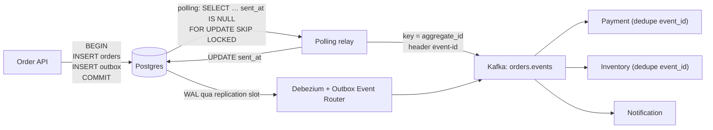
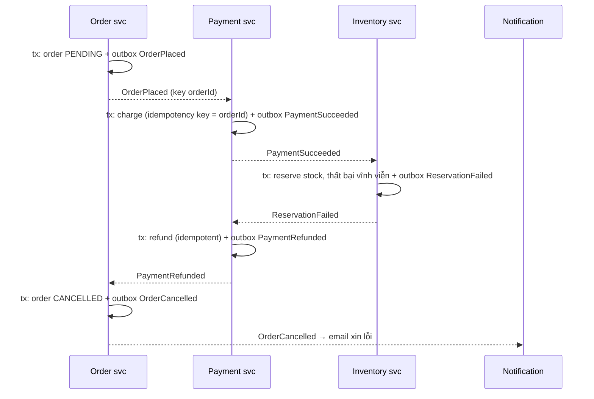

## Bối cảnh & vấn đề

Service `orders` sau khi tách khỏi monolith làm việc này khi khách đặt hàng:

```ts
await db.order.create({ data: order });                       // 1. commit DB
await producer.send({ topic: "orders", messages: [toEvent(order)] }); // 2. publish
```

Trong ba tháng chạy, có 41 đơn tồn tại trong DB nhưng payment service không bao giờ biết tới: lần nào cũng là pod bị kill (deploy, OOM) hoặc Kafka trả timeout đúng giữa bước 1 và 2. Ai đó đổi thứ tự (publish trước, commit sau): giờ có event `OrderPlaced` cho đơn không tồn tại khi insert DB thất bại do vi phạm constraint. Bọc cả hai trong `try/catch` rồi "rollback" cũng không được: không thể rollback một message đã gửi, và không thể chắc DB commit có thành công hay không khi gặp timeout.

Đây là **dual write problem**: ghi vào hai hệ thống (DB và Kafka) không có transaction chung, nên luôn có cửa sổ mà một bên thành công còn bên kia thì không. Bài này đi qua giải pháp chuẩn (transactional outbox), hai cách đọc outbox (polling vs CDC), những lỗi thật của relay, và ghép tất cả thành một pipeline nhiều service bằng saga.

## Khái niệm

### Dual write

**Dual write** là khi một thao tác business phải ghi vào hai nơi độc lập, ở đây là DB của service và Kafka. Có bốn kết cục: cả hai thành công (tốt), cả hai thất bại (tốt, client retry), DB thành công mà Kafka không (mất event: downstream không bao giờ biết), Kafka thành công mà DB không (event "ma": downstream xử lý một thứ không tồn tại).

Không có thứ tự ghi nào an toàn, vì crash có thể xảy ra giữa hai bước, và timeout không cho biết bước đó thành công hay không. Two-phase commit (XA) giữa DB và Kafka không được Kafka hỗ trợ. Cần một cách để **chỉ ghi vào một chỗ** trong transaction.

**Interview angle:** câu CV "bạn giữ DB và event nhất quán thế nào?" mở bằng đúng bài toán này; câu trả lời yếu là "publish sau khi save, nó không bao giờ fail".

### Transactional outbox

**Outbox**: trong **cùng transaction DB** với thay đổi business, insert thêm một row vào bảng `outbox(id, event_id, aggregate_id, type, payload, created_at, sent_at)`. Vì cùng transaction, row business và row outbox cùng commit hoặc cùng rollback: không còn dual write ở phía service.

Một tiến trình riêng, **relay** (message relay), đọc các row outbox chưa gửi, publish lên Kafka, rồi đánh dấu đã gửi (hoặc xoá). Relay có thể crash sau khi publish nhưng trước khi đánh dấu, nên nó publish lại: **at-least-once publish**. Consumer phải dedupe theo `event_id` ([bài 6](/tracks/messaging-kafka/learn/delivery-semantics-idempotency)).

Thứ tự theo aggregate: relay publish với **key = aggregate_id** và giữ thứ tự row của cùng aggregate. Khi Kafka không sẵn sàng 15 phút, outbox tích lại (service vẫn nhận đơn bình thường), relay đẩy hết khi Kafka trở lại; metric cần theo dõi là **outbox backlog** (số row chưa gửi, tuổi row cũ nhất).

**Interview angle:** follow-up "Kafka down 15 phút thì sao?" là chỗ outbox thắng rõ: service không down theo, event không mất, chỉ trễ.

### Polling relay

**Polling publisher**: relay định kỳ query:

```sql
SELECT id, event_id, aggregate_id, type, payload FROM outbox
WHERE sent_at IS NULL ORDER BY id LIMIT 100 FOR UPDATE SKIP LOCKED;
```

publish batch, rồi `UPDATE outbox SET sent_at = now() WHERE id = ANY(...)` trong cùng transaction với lệnh SELECT. `FOR UPDATE SKIP LOCKED` cho phép nhiều relay chạy song song mà không lấy cùng row. Ưu: đơn giản, không cần hạ tầng mới. Nhược: query liên tục tốn tải DB; độ trễ bằng chu kỳ poll; bảng outbox phải được dọn (xoá row đã gửi theo lịch, hoặc partition theo ngày); và **thứ tự** khó giữ khi có nhiều relay hoặc khi dùng cursor.

Cái bẫy kinh điển: relay nhớ "id lớn nhất đã gửi" và query `WHERE id > :cursor`. Sequence được cấp **lúc insert**, không phải lúc commit. Transaction A lấy id 1, transaction B lấy id 2 và commit trước; relay thấy 2, đặt cursor = 2; A commit sau đó, row 1 **không bao giờ được thấy**. `created_at` có cùng vấn đề. Dùng `sent_at IS NULL` thay vì cursor tránh được việc bỏ sót, nhưng vẫn có thể publish row 2 trước row 1 (thứ tự commit khác thứ tự id); với key = aggregate_id, chỉ cần thứ tự **trong một aggregate**, và các row của cùng aggregate thường không commit chồng lấn nếu business lock aggregate.

### Log-based CDC (Debezium)

**Change Data Capture** đọc **log giao dịch** của DB (WAL của Postgres qua logical replication, binlog của MySQL) thay vì query bảng. Debezium chạy trên Kafka Connect, đọc mọi insert vào bảng outbox theo **đúng thứ tự commit**, và Outbox Event Router SMT biến mỗi row thành một event với topic theo `aggregate_type`, key theo `aggregate_id`, header `id` từ `event_id`.

Ưu: độ trễ thấp (milliseconds), không query bảng, thứ tự commit chính xác, không bỏ sót row commit muộn. Nhược: thêm Kafka Connect + Debezium để vận hành, cần quyền replication và `wal_level=logical`, và phải quản lý **replication slot**. Slot giữ WAL từ vị trí connector đã đọc; connector dừng một ngày thì Postgres giữ toàn bộ WAL của ngày đó, đĩa có thể đầy và DB dừng ghi. `max_slot_wal_keep_size` (Postgres 13+) giới hạn lượng WAL slot được giữ, đổi lại slot bị **invalidated** khi vượt (connector phải snapshot lại).

Với CDC, bảng outbox có thể xoá row ngay sau khi insert (trong cùng transaction hoặc ngay sau), vì Debezium đọc từ WAL chứ không từ bảng.

**Interview angle:** follow-up "Debezium connector down một ngày thì Postgres sao?" — WAL phình theo replication slot, alert theo retained WAL, đặt `max_slot_wal_keep_size`.

### Saga

Một đơn hàng chạm tới nhiều service (order, payment, inventory, notification), mỗi service có DB riêng. Không có transaction phân tán; thay vào đó là **saga**: chuỗi transaction cục bộ, mỗi bước phát event (qua outbox của service đó) kích hoạt bước tiếp theo, và mỗi bước có **compensating action** để hoàn tác khi bước sau thất bại (hoàn tiền, nhả hàng tồn).

- **Choreography**: mỗi service nghe event của service khác và tự quyết định. Đơn giản khi ít bước; khó nhìn toàn cảnh khi nhiều bước.
- **Orchestration**: một orchestrator (service riêng hoặc engine như Temporal) gửi command và theo dõi trạng thái saga. Dễ theo dõi, dễ thêm bước, nhưng thêm một thành phần.

Saga là **eventual consistency**: có những khoảng thời gian đơn đã thanh toán nhưng chưa giữ hàng. UI phải hiển thị trạng thái trung gian ("đang xử lý") và đọc từ read model, không giả vờ là đồng bộ.

**Interview angle:** follow-up "payment thành công nhưng giữ hàng thất bại vĩnh viễn" muốn nghe compensation cụ thể: `InventoryReservationFailed` → payment refund (idempotent theo order id) → order chuyển `CANCELLED` → thông báo khách.

### Sync hay async

Không phải mọi tương tác nên thành event. Tiêu chí:

- **Sync** (REST/gRPC) khi caller **cần kết quả ngay** để trả lời user (kiểm tra tồn kho trước khi cho đặt, validate mã giảm giá, tra cứu), hoặc khi cần lỗi trả về trực tiếp.
- **Async** (event) khi chấp nhận eventual consistency, có **nhiều** consumer (fan-out), muốn tách availability (notification chết không làm đặt hàng chết), luồng dài/batch, hoặc đồng bộ dữ liệu sang read model/search.

Sai lầm hay gặp khi tách monolith: biến mọi lời gọi hàm thành event, rồi phải dựng lại request/response trên Kafka (correlation id, reply topic, timeout) cho những chỗ vốn cần câu trả lời ngay.

## Cơ chế hoạt động

Outbox với hai kiểu relay:



Chỉ có một trong hai relay trong một hệ thống. Điểm chung: chúng là at-least-once, nên consumer dedupe. Điểm khác: polling đọc **bảng** (thấy row theo thứ tự query), CDC đọc **log** (thấy row theo thứ tự commit).

Saga choreography cho đơn hàng, kể cả nhánh bù trừ:



Mỗi mũi tên đứt là một event đi qua outbox của service phát và Kafka; mỗi service xử lý idempotent theo `event_id` (hoặc theo `orderId` + bước). Nếu `PaymentSucceeded` bị gửi hai lần (relay retry), inventory dedupe; nếu refund bị gọi hai lần, payment gateway dedupe bằng idempotency key.

## Ví dụ thực tế

Chạy thật: Postgres 18.6, Kafka 4.2.0, `pg@8.23.1`, `kafkajs@2.2.4`, Node 24.

### Outbox + polling relay, relay crash sau khi publish

```ts
async function placeOrder(id: string, total: number) {
  const c = await db.connect();
  try {
    await c.query("BEGIN");
    await c.query("INSERT INTO orders(id, total) VALUES ($1, $2)", [id, total]);
    await c.query("INSERT INTO outbox(aggregate_id, type, payload) VALUES ($1, 'OrderPlaced', $2)", [id, { id, total }]);
    await c.query("COMMIT");
  } catch (e) { await c.query("ROLLBACK"); throw e; } finally { c.release(); }
}

async function relayOnce(crashAfterPublish = false) {
  const c = await db.connect();
  try {
    await c.query("BEGIN");
    const { rows } = await c.query(
      `SELECT id, event_id, aggregate_id, type, payload FROM outbox
        WHERE sent_at IS NULL ORDER BY id LIMIT 100 FOR UPDATE SKIP LOCKED`);
    if (rows.length === 0) { await c.query("COMMIT"); return 0; }
    await producer.send({ topic: "orders.events", messages: rows.map((r) => ({
      key: r.aggregate_id, value: JSON.stringify(r.payload),
      headers: { "event-id": r.event_id, "event-type": r.type },
    })) });
    if (crashAfterPublish) throw new Error("💥 relay crashed after publish, before UPDATE sent_at");
    await c.query("UPDATE outbox SET sent_at = now() WHERE id = ANY($1)", [rows.map((r) => r.id)]);
    await c.query("COMMIT");
    return rows.length;
  } catch (e: any) { await c.query("ROLLBACK"); console.log(e.message); return -1; } finally { c.release(); }
}
await placeOrder("order-1", 100); await placeOrder("order-2", 250);
console.log("relay pass 1:", await relayOnce(true));
console.log("relay pass 2:", await relayOnce());
console.log("relay pass 3:", await relayOnce());
```

```text
💥 relay crashed after publish, before UPDATE sent_at
relay pass 1: -1
relay pass 2: 2
relay pass 3: 0
[
  { id: '3', aggregate_id: 'order-1', sent: true },
  { id: '4', aggregate_id: 'order-2', sent: true }
]
```

Topic sau ba lượt:

```text
event-id:47d16334…,event-type:OrderPlaced    order-1    {"id":"order-1","total":100}
event-id:47d16334…,event-type:OrderPlaced    order-1    {"id":"order-1","total":100}
event-id:12a92234…,event-type:OrderPlaced    order-2    {"id":"order-2","total":250}
event-id:12a92234…,event-type:OrderPlaced    order-2    {"id":"order-2","total":250}
```

Mỗi đơn có hai event với **cùng `event-id`**: không mất gì, và consumer có đủ thông tin để bỏ bản trùng. Đây là hành vi đúng của outbox; idempotent producer không chống được trùng này vì relay lần hai là một lần `send()` mới.

### Relay theo cursor id bỏ sót row

```ts
let cursor = 0; // relay remembers "last id published"
const poll = async (label: string) => {
  const { rows } = await relay.query("SELECT id, aggregate_id FROM outbox WHERE id > $1 ORDER BY id", [cursor]);
  for (const r of rows) cursor = Number(r.id);
  console.log(`${label.padEnd(34)} relay sees ${JSON.stringify(rows.map((r) => `${r.id}:${r.aggregate_id}`))}, cursor=${cursor}`);
};
await a.query("BEGIN");
const ia = await a.query("INSERT INTO outbox(aggregate_id,type,payload) VALUES ('order-A','OrderPlaced','{}') RETURNING id");
await b.query("BEGIN");
const ib = await b.query("INSERT INTO outbox(aggregate_id,type,payload) VALUES ('order-B','OrderPlaced','{}') RETURNING id");
await b.query("COMMIT");
await poll("after B commits:");
await a.query("COMMIT");
await poll("after A commits (id smaller):");
```

```text
tx A got id 1 (still open), tx B got id 2
after B commits:                   relay sees ["2:order-B"], cursor=2
after A commits (id smaller):      relay sees [], cursor=2
outbox rows: ["1:order-A","2:order-B"] -> order-A was never published
```

Đây là câu trả lời cho "vì sao sắp theo auto-increment id vẫn bỏ sót row": id được cấp khi insert, row hiện ra khi commit. Sửa: dùng `sent_at IS NULL` (không cursor), hoặc chỉ đọc row cũ hơn một khoảng an toàn, hoặc dùng CDC (đọc theo thứ tự commit).

### Replication slot giữ WAL khi connector dừng

Postgres 18.6 với `wal_level=logical`, tạo slot `pgoutput` như Debezium làm, rồi ghi 200.000 row mà không ai đọc slot:

```sql
SELECT pg_create_logical_replication_slot('debezium', 'pgoutput');
SELECT slot_name, active, pg_size_pretty(pg_wal_lsn_diff(pg_current_wal_lsn(), restart_lsn)) AS retained_wal FROM pg_replication_slots;
INSERT INTO outbox(payload) SELECT repeat('x', 500) FROM generate_series(1, 200000); CHECKPOINT;
SELECT slot_name, active, pg_size_pretty(pg_wal_lsn_diff(pg_current_wal_lsn(), restart_lsn)) AS retained_wal, wal_status FROM pg_replication_slots;
SHOW max_slot_wal_keep_size;
```

```text
 slot_name | active | retained_wal
-----------+--------+--------------
 debezium  | f      | 56 bytes

 slot_name | active | retained_wal | wal_status
-----------+--------+--------------+------------
 debezium  | f      | 122 MB       | reserved

 max_slot_wal_keep_size
------------------------
 -1
```

Slot không active, và WAL bị giữ lại tăng từ 56 byte lên 122 MB sau một lần ghi; `CHECKPOINT` không giải phóng được vì slot chưa xác nhận đã đọc. `max_slot_wal_keep_size = -1` (mặc định) nghĩa là không giới hạn: connector dừng đủ lâu thì đĩa đầy. Alert theo `retained_wal` của từng slot, và đặt `max_slot_wal_keep_size` theo dung lượng đĩa bạn chấp nhận.

### Debezium Outbox Event Router (minh hoạ)

Cấu hình connector, chưa chạy trong lab này:

```json
{
  "name": "orders-outbox",
  "config": {
    "connector.class": "io.debezium.connector.postgresql.PostgresConnector",
    "plugin.name": "pgoutput",
    "database.hostname": "orders-db", "database.dbname": "orders",
    "table.include.list": "public.outbox",
    "slot.name": "orders_outbox",
    "transforms": "outbox",
    "transforms.outbox.type": "io.debezium.transforms.outbox.EventRouter",
    "transforms.outbox.table.field.event.id": "event_id",
    "transforms.outbox.table.field.event.key": "aggregate_id",
    "transforms.outbox.route.by.field": "aggregate_type",
    "transforms.outbox.route.topic.replacement": "${routedByValue}.events"
  }
}
```

Tên field và option có thể khác giữa các version Debezium (verify với docs version của bạn).

## Trade-offs & lựa chọn thay thế

| Cách | Mất event? | Trùng? | Thứ tự | Độ trễ | Vận hành |
| --- | --- | --- | --- | --- | --- |
| Publish sau commit (dual write) | Có (crash giữa hai bước) | Có (retry) | Theo thứ tự gửi | Thấp | Không thêm gì |
| Publish sau commit + job đối soát | Ít (job vá) | Có | Lộn xộn khi vá | Thấp, vá thì trễ | Job đối soát |
| Outbox + polling relay | Không (nếu không dùng cursor) | Có | Theo aggregate, cẩn thận khi song song | = chu kỳ poll | Dọn bảng, tải query |
| Outbox + CDC (Debezium) | Không | Có (khi connector restart) | Đúng thứ tự commit | ms | Kafka Connect, slot, quyền replication |
| CDC trên bảng business (không outbox) | Không | Có | Thứ tự commit | ms | Event = schema DB, coupling nội bộ ra ngoài |
| Listen to yourself (publish trước, consume lại để ghi DB) | Không | Có | Theo partition | Ghi DB trễ | Đọc-sau-ghi khó |

Polling vs CDC, chọn thế nào: polling relay là điểm bắt đầu tốt cho team chưa có Kafka Connect, throughput vừa phải (vài trăm event/s), chấp nhận độ trễ 100 ms–1 s. CDC khi throughput cao, cần độ trễ thấp, hoặc đã có hạ tầng Debezium. CDC trực tiếp trên bảng business (không qua outbox) nhanh để làm nhưng biến schema DB nội bộ thành hợp đồng công khai: đổi tên cột là breaking change cho mọi consumer. Outbox cho phép thiết kế payload event độc lập với schema bảng.

Về saga: choreography khi có 2–4 bước và ít nhánh; orchestration (hoặc workflow engine) khi nhiều bước, nhiều nhánh bù trừ, cần timeout và theo dõi trạng thái tập trung.

## Edge cases & failure modes

- **Relay publish trùng**: crash sau publish, trước đánh dấu; hoặc nhiều relay không khoá row. Consumer dedupe theo `event_id`.
- **Relay song song đảo thứ tự**: hai relay `SKIP LOCKED` lấy hai batch, batch sau publish trước. Với key = aggregate_id và một aggregate thường chỉ có một row trong cửa sổ đó thì ổn; nếu không, một relay mỗi shard (leader election, hoặc `hash(aggregate_id) % N`).
- **Retry một phần batch**: producer gửi batch 100 message, 60 thành công, lỗi; relay rollback và gửi lại cả 100. Trùng 60; với idempotent producer trong cùng session thì Kafka dedupe được phần retry nội bộ, nhưng không phải lần relay chạy lại.
- **Bảng outbox phình**: không dọn row đã gửi; query polling chậm dần. Xoá theo lịch hoặc partition theo ngày rồi drop partition.
- **Replication slot bị bỏ quên**: thử Debezium trên staging rồi xoá connector nhưng quên slot; WAL tích lại hàng tuần. Kiểm tra `pg_replication_slots` với `active = false`.
- **Failover Postgres**: logical replication slot không tự có trên replica được promote (Postgres 17+ có slot synchronization, verify), connector phải snapshot lại hoặc mất vị trí.
- **Kafka down lâu**: outbox tích lại hàng triệu row; khi Kafka lên, relay đẩy dồn dập làm consumer lag. Relay nên có rate limit.
- **Saga treo**: một bước không bao giờ phản hồi (event bị DLQ); cần timeout ở orchestrator hoặc job quét saga kẹt.

## Pitfalls

- ❌ "Publish sau khi save, Kafka không bao giờ fail" → ✅ outbox trong cùng transaction.
- ❌ Bọc DB + publish trong `try/catch` và gọi đó là atomic → ✅ không có rollback cho message đã gửi; timeout không cho biết kết quả.
- ❌ Relay theo cursor `id > last_id` hoặc `created_at > last_ts` → ✅ `sent_at IS NULL` hoặc CDC; id/timestamp không theo thứ tự commit.
- ❌ Consumer không dedupe vì "đã có outbox" → ✅ outbox là at-least-once; dedupe theo `event_id`.
- ❌ Bật Debezium mà không alert replication slot → ✅ alert retained WAL, đặt `max_slot_wal_keep_size`.
- ❌ CDC thẳng bảng business làm hợp đồng event → ✅ outbox với payload thiết kế riêng, có version.
- ❌ Biến mọi lời gọi sync thành event khi tách monolith → ✅ sync khi cần kết quả ngay; async khi chấp nhận eventual và có fan-out.
- ❌ Saga không có compensation idempotent → ✅ refund/release dùng idempotency key theo order id.

## Tóm tắt

- Dual write (DB rồi Kafka, hoặc ngược lại) không atomic: mất event hoặc event ma; timeout làm mọi thứ tự ghi đều không an toàn.
- Transactional outbox: business row + outbox row trong một transaction; relay publish at-least-once, key = aggregate_id, consumer dedupe theo `event_id`.
- Polling relay: `sent_at IS NULL … FOR UPDATE SKIP LOCKED`, đơn giản, trễ bằng chu kỳ poll; đừng dùng cursor id/timestamp (bỏ sót row commit muộn).
- CDC (Debezium) đọc WAL theo thứ tự commit, trễ thấp; phải quản lý replication slot (WAL phình khi connector dừng).
- Outbox giúp service sống sót khi Kafka down; metric quan trọng là outbox backlog.
- Saga: chuỗi transaction cục bộ + compensation; choreography khi ít bước, orchestration khi nhiều; UI phải chấp nhận trạng thái trung gian.
- Sync khi cần kết quả ngay; async khi fan-out, tách availability, luồng dài, đồng bộ read model.
