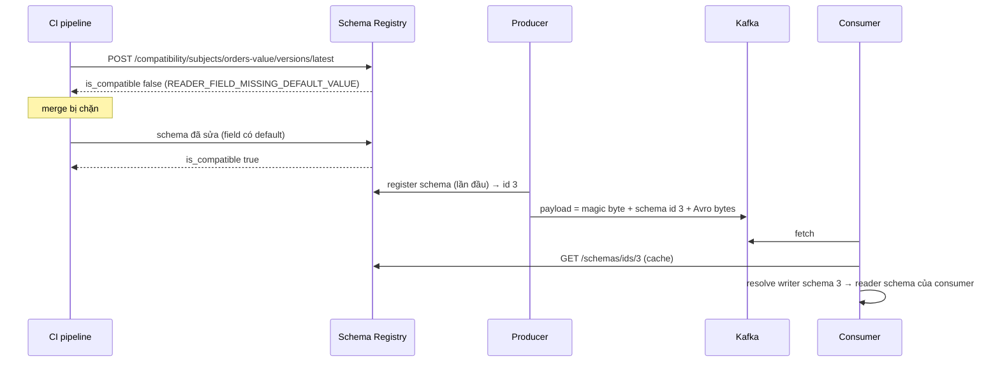
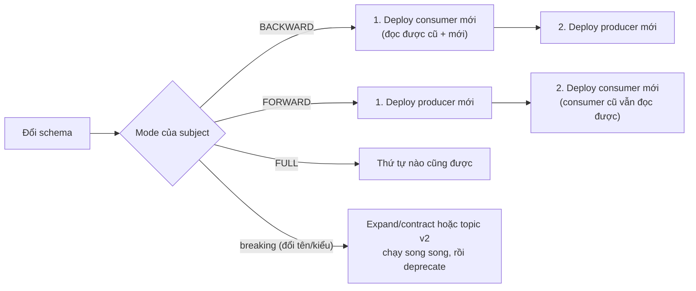

## Bối cảnh & vấn đề

Team catalog đổi tên field `total` thành `amount` trong event `OrderPlaced` vì "tên rõ hơn", review code, merge, deploy lúc 14:00. Từ 14:01, ba consumer của ba team khác crash-loop: `amount` không phải field họ biết, `total` thì `undefined`, phép cộng ra `NaN`, validation ném lỗi. Rollback producer lúc 14:20 không chữa được ngay: 20 phút event schema mới vẫn nằm trong topic, consumer vẫn phải đọc qua chúng.

Với HTTP API, đổi tên field như vậy sẽ bị chặn ở review vì ai cũng biết đó là breaking change. Với event, nhiều team quên rằng **event là API**: chỉ khác là consumer không gọi bạn mà đọc dữ liệu bạn ghi, có khi nhiều tháng sau (replay). Bài này đi qua cách quản lý thay đổi schema (Schema Registry và các mode compatibility), cách viết consumer chịu được thay đổi, cách thiết kế payload event, header cho tracing, chọn topic cho hệ thống multi-tenant, và quy tắc governance khi có nhiều team.

## Khái niệm

### Schema và Schema Registry

**Schema** mô tả cấu trúc payload: field nào, kiểu gì, bắt buộc hay có default. Ba định dạng phổ biến với Kafka: **Avro** (schema đi kèm reader/writer resolution, gọn), **Protobuf** (field number, tốt cho đa ngôn ngữ), **JSON Schema** (dễ đọc, payload lớn). JSON không schema là cách nhanh nhất để bắt đầu và cách nhanh nhất để gây sự cố như đầu bài.

**Schema Registry** (Confluent, Apicurio, AWS Glue) lưu các version schema theo **subject** (thường là `<topic>-value`). Producer serializer đăng ký schema (hoặc tra id), ghi **schema id** vào 5 byte đầu payload (magic byte + id); consumer đọc id, lấy schema từ registry để deserialize. Quan trọng hơn: registry **kiểm tra compatibility** khi đăng ký version mới và từ chối version vi phạm. Đó là chỗ chặn được lỗi đổi tên field **trước** khi nó tới production.

**Interview angle:** follow-up "schema registry giảm poison pill thế nào?" — producer không thể ghi payload với schema chưa đăng ký hoặc không tương thích, nên consumer không gặp dữ liệu mà nó không đọc được.

### Compatibility modes

Với `writer schema` (lúc ghi) và `reader schema` (lúc đọc):

- **BACKWARD** (mặc định của Confluent): schema **mới** đọc được dữ liệu ghi bằng schema **cũ**. Được: xoá field, thêm field **có default**. Hệ quả: nâng cấp **consumer trước** (consumer mới đọc được cả dữ liệu cũ), rồi producer.
- **FORWARD**: schema **cũ** đọc được dữ liệu ghi bằng schema **mới**. Được: thêm field, xoá field **có default**. Hệ quả: nâng cấp **producer trước** (consumer cũ vẫn đọc được dữ liệu mới).
- **FULL**: cả hai. Được: thêm/xoá field **có default**. Thứ tự nâng cấp nào cũng được.
- Biến thể **`_TRANSITIVE`**: kiểm tra với **mọi** version cũ, không chỉ version liền trước.
- **NONE**: không kiểm tra.

Đổi kiểu (int → string) và đổi tên field là **breaking** dưới mọi mode (đổi tên = xoá field cũ + thêm field mới không default). Cách làm: topic/subject version mới, hoặc expand/contract: thêm field mới (có default), producer ghi cả hai, consumer chuyển sang field mới, rồi mới bỏ field cũ.

Vì sao BACKWARD không transitive vẫn có thể làm consumer vỡ khi replay: nó chỉ đảm bảo v3 đọc được dữ liệu v2. Nếu topic còn dữ liệu v1 (retention dài, compacted), v3 có thể không đọc được v1. Ví dụ thật ở dưới.

**Interview angle:** "BACKWARD thì ai nâng cấp trước?" — consumer. Nhớ bằng câu: "backward = mới đọc cũ = người đọc phải mới trước".

### Tolerant reader

**Tolerant reader** là consumer chỉ đọc những gì nó cần và chấp nhận phần còn lại thay đổi: bỏ qua field lạ, có default cho field thiếu, chấp nhận cả tên cũ và tên mới trong giai đoạn chuyển tiếp. Nó là lớp phòng thủ thứ hai (sau registry) và là lớp duy nhất khi dùng JSON không schema.

Trong TypeScript, zod làm việc này gọn: `z.object()` mặc định bỏ field lạ (strip), `.default()` cho field thiếu, `.transform()` gộp tên cũ/mới thành một model nội bộ. Message không qua được validation là **permanent error**: đi DLQ, không crash consumer ([bài 8](/tracks/messaging-kafka/learn/errors-retries-dlq)).

### Event vs command

- **Command** (`ChargePayment`, `SendEmail`): yêu cầu **một** service cụ thể làm một việc; có thể bị từ chối; sender biết và phụ thuộc vào receiver. Tên ở thể mệnh lệnh.
- **Event** (`OrderPlaced`, `PaymentFailed`): một **sự thật đã xảy ra**; publisher không biết ai nghe, không chờ ai; không thể bị "từ chối". Tên ở thì quá khứ.

Trộn hai thứ là nguồn coupling ẩn: event `OrderPlacedPleaseChargeCard` thực chất là command, và team order sẽ phải biết payment xử lý nó thế nào. Kafka hợp nhất với event; command qua Kafka vẫn được (orchestrated saga) nhưng nên có topic riêng cho receiver và rõ ràng là command.

### Thin event vs event-carried state transfer

- **Thin event** (notification): `{ "type": "OrderPlaced", "orderId": "o-1" }`. Consumer cần chi tiết thì **gọi ngược** API của producer. Payload nhỏ, schema ổn định, không lộ dữ liệu. Đổi lại coupling **runtime** (producer API phải sống khi consumer xử lý), tải dồn về producer khi có nhiều consumer, và consumer đọc **trạng thái hiện tại** chứ không phải trạng thái lúc event xảy ra.
- **Event-carried state transfer (ECST)**: payload chứa đủ dữ liệu (đơn hàng, dòng hàng, giá). Consumer tự đủ, dựng read model riêng, không gọi ngược. Đổi lại payload lớn, schema phải quản lý cẩn thận (mọi field là hợp đồng), và mọi consumer thấy mọi field (PII, giá vốn).

Câu hỏi "consumer thin event gọi ngược và nhận trạng thái mới hơn event, có sao không?" tuỳ nghiệp vụ: với cập nhật read model, đọc trạng thái mới nhất thường **tốt hơn** (tự sửa được thứ tự sai); với audit/tính toán theo thời điểm (giá tại lúc đặt hàng), đó là bug. ECST mang đúng trạng thái tại thời điểm event.

**Interview angle:** câu trả lời senior chọn theo consumer: nhiều consumer cần dữ liệu để dựng view riêng → ECST; dữ liệu nhạy cảm hoặc lớn → thin event + API có kiểm soát quyền.

### Header: tracing, correlation, metadata

**Record header** là cặp key-value bytes đi kèm record, không thuộc payload, nên không ảnh hưởng schema. Header nên có:

- `traceparent` (W3C Trace Context: `00-<trace-id>-<span-id>-<flags>`): nối trace từ request HTTP qua producer, Kafka, consumer.
- `correlation-id` (id của request gốc), `causation-id` (id của event gây ra event này), `event-id`, `schema-version`, `tenant-id`, `content-type`.

Producer inject context hiện tại vào header; consumer extract và tạo span xử lý. OpenTelemetry có instrumentation cho kafkajs và nhiều client. Span consumer nên là **child** của span producer khi xử lý một record (một nguyên nhân, một hệ quả, dễ đọc trên trace), và dùng **span link** khi xử lý theo batch nhiều record từ nhiều trace (một span không thể có nhiều parent). Mọi bước chuyển tiếp (retry topic, DLQ, outbox relay, enrichment) phải **copy header**, nếu không trace đứt đúng ở chỗ khó debug nhất.

### Multi-tenant: topic per tenant hay shared topic

- **Topic per tenant** (`orders.tenant-42`): cô lập tốt (retention, ACL, quota riêng), xoá dữ liệu tenant bằng xoá topic. Nhưng số topic × partition bùng nổ với hàng nghìn tenant: metadata, file handle, replica fetch, consumer subscribe bằng regex và rebalance mỗi khi có tenant mới.
- **Shared topic** + `tenant-id` trong header/payload (key = entity id): đơn giản, scale tốt, số partition cố định. Cần: authorization ở consumer (không tin tenant-id mù quáng), xử lý noisy neighbor (quota theo `client.id`, tách tenant lớn), và xoá dữ liệu tenant khó hơn (retention tự hết hạn; topic compacted cần tombstone cho từng key).
- **Hybrid**: shared cho đa số, topic riêng cho tenant lớn hoặc có yêu cầu compliance (data residency, khoá mã hoá riêng).

Với GDPR "xoá mọi dữ liệu của tenant", shared topic dạng `delete` thường được trả lời bằng "dữ liệu tự hết hạn sau retention N ngày" (cần được pháp chế chấp nhận), topic compacted cần tombstone cho từng key, và với retention dài có thể dùng **crypto-shredding** (mã hoá payload bằng khoá theo tenant, xoá khoá là dữ liệu không đọc được).

### Governance: ownership, đặt tên, deprecate

Khi có nhiều team, topic cần được đối xử như API:

- Mỗi topic có **owner** (team producer), mô tả, SLA, retention, schema trong registry với compatibility bắt buộc; thay đổi schema được review như thay đổi API; CI chạy compatibility check trước khi merge.
- **Quy ước tên**: `<domain>.<entity>.<event>.v<N>` (ví dụ `sales.order.placed.v1`) hoặc `<domain>.<entity>.events`. Version trong tên chỉ tăng khi breaking.
- **ACL**: chỉ service của domain được ghi topic của domain; consumer chỉ đọc. Tránh "god topic" chứa mọi loại event của mọi domain.
- **Event catalog** (AsyncAPI, Backstage) để team khác tìm event có sẵn thay vì tạo trùng.
- **Deprecate**: topic v2 chạy song song, producer ghi cả hai (hoặc một bridge), thông báo hạn chót, theo dõi consumer group nào còn đọc v1 (`kafka-consumer-groups --describe` theo topic, metric fetch theo `client.id`), rồi xoá.

## Cơ chế hoạt động

Đăng ký và dùng schema:



Kiểm tra trong CI là chỗ rẻ nhất để bắt lỗi. Registry còn kiểm tra lần nữa lúc producer đăng ký (nếu `auto.register.schemas=true`); trong production nhiều team tắt auto-register và chỉ CI được đăng ký schema.

Thứ tự triển khai theo mode:



## Ví dụ thực tế

Chạy thật: Confluent Schema Registry 8.1.0 trên Kafka 4.2.0, gọi REST bằng curl. Subject `orders-value`, v1:

```json
{"type":"record","name":"OrderPlaced","fields":[{"name":"orderId","type":"string"},{"name":"total","type":"int"}]}
```

### BACKWARD (mặc định)

Ba ứng viên v2: `ADD_DEFAULT` thêm `currency` (string, default `"VND"`), `ADD_NODEFAULT` thêm `currency` không default, `RENAME` đổi `total` thành `amount`.

```bash
curl -s localhost:58181/config
curl -s -XPOST -H "$H" "$SR/compatibility/subjects/orders-value/versions/latest?verbose=true" -d '<schema>'
```

```text
{"compatibilityLevel":"BACKWARD"}

ADD_DEFAULT under BACKWARD:
{"is_compatible":true,"messages":[]}
ADD_NODEFAULT under BACKWARD:
{"is_compatible":false,"messages":["{errorType:'READER_FIELD_MISSING_DEFAULT_VALUE', description:'The field 'currency' at path '/fields/2' in the new schema has no default value and is missing in the old schema', additionalInfo:'currency'}", ...]}
RENAME under BACKWARD:
{"is_compatible":false,"messages":["{errorType:'READER_FIELD_MISSING_DEFAULT_VALUE', description:'The field 'amount' at path '/fields/1' in the new schema has no default value and is missing in the old schema', additionalInfo:'amount'}", ...]}
```

Thêm field có default được; thêm field không default bị chặn (reader mới không biết điền gì khi đọc dữ liệu cũ). Đổi tên bị chặn với đúng lý do đó: với registry, `amount` là field mới không default.

### FORWARD

```text
ADD_NODEFAULT under FORWARD:
{"is_compatible":true,"messages":[]}
RENAME under FORWARD:
{"is_compatible":false,"messages":["{errorType:'READER_FIELD_MISSING_DEFAULT_VALUE', description:'The field 'total' at path '/fields/1' in the old schema has no default value and is missing in the new schema', additionalInfo:'total'}", ...]}
try to register RENAME under FORWARD:
{"error_code":409,"message":"Schema being registered is incompatible with an earlier schema for subject \"orders-value\", details: [...]"}
```

Dưới FORWARD, thêm field không default lại **được** (consumer cũ chỉ bỏ qua field lạ), còn đổi tên vẫn bị chặn, lần này vì consumer **cũ** cần `total` mà dữ liệu mới không có. Đăng ký thật trả `409`: đây là lỗi producer sẽ gặp lúc khởi động, thay vì consumer gặp lúc 14:01.

### BACKWARD vs BACKWARD_TRANSITIVE

Subject `customers-value`: v1 `{id}`, v2 `{id, tier default "basic"}`, v3 `{id, tier}` (bỏ default):

```text
v3 (drop default) under BACKWARD:
{"is_compatible":true}
v3 under BACKWARD_TRANSITIVE:
{"is_compatible":false}
```

v3 đọc được dữ liệu v2 (v2 luôn có `tier`), nên BACKWARD cho qua. Nhưng v3 **không** đọc được dữ liệu v1 (không có `tier`, v3 không có default). Consumer v3 replay một topic compacted còn bản ghi v1 sẽ lỗi. BACKWARD_TRANSITIVE bắt được vì kiểm tra với mọi version.

### Tolerant reader bằng zod

```ts
import { z } from "zod";
const OrderPlaced = z
  .object({
    orderId: z.string(),
    total: z.number().int().optional(),
    amount: z.number().int().optional(),
    currency: z.string().default("VND"),
  })
  .refine((o) => o.total !== undefined || o.amount !== undefined, { message: "total or amount required" })
  .transform((o) => ({ orderId: o.orderId, amount: (o.amount ?? o.total)!, currency: o.currency }));

for (const raw of ['{"orderId":"o-1","total":100}', '{"orderId":"o-2","amount":250,"currency":"USD","couponCode":"X"}', '{"orderId":"o-3"}']) {
  const r = OrderPlaced.safeParse(JSON.parse(raw));
  console.log(raw.padEnd(66), "->", r.success ? JSON.stringify(r.data) : `DLQ: ${r.error.issues[0].message}`);
}
```

```text
{"orderId":"o-1","total":100}                                      -> {"orderId":"o-1","amount":100,"currency":"VND"}
{"orderId":"o-2","amount":250,"currency":"USD","couponCode":"X"}   -> {"orderId":"o-2","amount":250,"currency":"USD"}
{"orderId":"o-3"}                                                  -> DLQ: total or amount required
```

Dạng cũ (`total`), dạng mới (`amount` + field lạ `couponCode`) đều ra cùng model nội bộ; message không đủ dữ liệu đi DLQ thay vì crash. Đây là cách phục hồi sự cố đầu bài: deploy consumer tolerant đọc được cả hai dạng, rồi không cần làm gì với 20 phút dữ liệu "xấu".

### Header truyền trace qua Kafka

```ts
await p.send({ topic: "traced", messages: [{
  key: "order-9", value: JSON.stringify({ orderId: "order-9" }),
  headers: {
    traceparent: `00-${traceId}-${parentSpan}-01`,      // W3C Trace Context
    "correlation-id": "req-7f3a", "event-id": randomUUID(), "schema-version": "2", "tenant-id": "t-42",
  },
}] });
// consumer
const hdr = Object.fromEntries(Object.entries(message.headers ?? {}).map(([k, v]) => [k, v?.toString()]));
const [, tid, parent] = hdr.traceparent!.split("-");
```

```text
received headers: {
  traceparent: '00-f73b9fcf15dae81174d0c2174c66f958-d2330e712b0ba4cc-01',
  'correlation-id': 'req-7f3a',
  'event-id': 'b4d8ec63-124a-49e2-958d-c41836603e9b',
  'schema-version': '2',
  'tenant-id': 't-42'
}
consumer span: trace=f73b9fcf… parent=d2330e712b0ba4cc span=3115e8a7b5676df2 (same trace id as producer: true)
```

Header trong KafkaJS là `Buffer`, nên phải `toString()`. Trong code thật, dùng OpenTelemetry propagator (`propagation.inject/extract`) thay vì tự parse.

### Recovery khi producer đã deploy schema đổi tên (runbook)

1. **Ngay**: rollback producer (ngừng tạo thêm dữ liệu xấu). Không xoá topic, không reset offset về latest.
2. Consumer đang crash-loop: deploy bản tolerant reader (đọc cả `total` lẫn `amount`), hoặc tạm đưa message không parse được vào DLQ để partition đi tiếp, replay DLQ sau khi có bản vá.
3. **Phòng ngừa**: registry với BACKWARD/FULL (transitive nếu topic có retention dài/compacted), compatibility check trong CI, tắt auto-register ở production, quy trình expand/contract cho đổi tên.

## Trade-offs & lựa chọn thay thế

| Mode | Được phép | Nâng cấp trước | Hợp khi |
| --- | --- | --- | --- |
| BACKWARD | Xoá field, thêm field có default | Consumer | Mặc định; consumer do nhiều team, cần đọc dữ liệu cũ khi replay |
| FORWARD | Thêm field, xoá field có default | Producer | Producer thay đổi nhanh, consumer cập nhật chậm |
| FULL | Thêm/xoá field có default | Tuỳ | Nhiều producer và consumer độc lập |
| `*_TRANSITIVE` | Như trên, với mọi version | Như trên | Topic compacted, retention dài, replay từ đầu |
| NONE | Mọi thứ | — | Không nên cho topic dùng chung |

| Payload | Coupling | Kích thước | Lộ dữ liệu | Consumer cần gọi ngược |
| --- | --- | --- | --- | --- |
| Thin event | Runtime (API producer) | Nhỏ | Ít | Có |
| Event-carried state | Schema | Lớn | Nhiều | Không |
| Delta (chỉ field thay đổi) | Schema + thứ tự | Nhỏ | Vừa | Không, nhưng phải áp dụng đúng thứ tự |

| Multi-tenant | Cô lập | Scale số tenant | Xoá dữ liệu tenant | Vận hành |
| --- | --- | --- | --- | --- |
| Topic per tenant | Cao | Kém (hàng nghìn topic) | Dễ | Nặng |
| Shared + tenant-id | Thấp, cần enforce | Tốt | Khó (retention, tombstone, crypto-shredding) | Nhẹ |
| Hybrid | Cao cho tenant lớn | Tốt | Dễ cho tenant riêng | Vừa |

Chọn thế nào: dùng registry cho mọi topic dùng chung giữa team, mode BACKWARD (hoặc FULL) với transitive cho topic compacted. Payload: ECST cho event mà nhiều consumer cần để dựng read model, kèm schema chặt; thin event khi dữ liệu nhạy cảm hoặc consumer chỉ cần "có gì đó đổi". Multi-tenant: shared topic là mặc định, tách tenant lớn hoặc có compliance riêng.

## Edge cases & failure modes

- **Schema id không tồn tại** (registry khác môi trường, subject bị xoá): consumer không deserialize được; đó là poison pill toàn topic. Registry phải được backup như DB.
- **Producer auto-register trong production**: một bản build lỗi đăng ký schema "tương thích nhưng sai" (ví dụ field bị xoá nhầm, vẫn BACKWARD-compatible). Tắt auto-register, CI đăng ký.
- **Default không có nghĩa**: thêm `amount` default `0` để "qua" compatibility; consumer đọc dữ liệu cũ thấy đơn 0 đồng. Default phải có nghĩa business, hoặc dùng union với `null`.
- **Enum thêm giá trị**: consumer cũ gặp giá trị enum lạ; Avro reader không có default cho enum sẽ lỗi. Luôn có nhánh "unknown".
- **Header bị mất qua Kafka Connect/MirrorMaker** cấu hình sai, hoặc qua relay tự viết.
- **Topic per tenant + regex subscribe**: tenant mới tạo topic → mọi consumer rebalance (classic protocol).
- **Noisy neighbor trên shared topic**: một tenant backfill 50 triệu event làm mọi tenant trễ; cần quota (`producer_byte_rate` theo client) hoặc topic backfill riêng.

## Pitfalls

- ❌ Đổi tên field trực tiếp → ✅ expand/contract (thêm field mới, ghi cả hai, chuyển consumer, bỏ field cũ) hoặc topic v2.
- ❌ BACKWARD rồi deploy producer trước → ✅ BACKWARD: consumer trước; FORWARD: producer trước.
- ❌ JSON không schema giữa nhiều team → ✅ registry + compatibility check trong CI.
- ❌ Consumer `z.object().strict()` (từ chối field lạ) → ✅ strip field lạ; consumer không nên vỡ vì producer thêm field.
- ❌ Event tên mệnh lệnh (`SendInvoice`) trên topic dùng chung → ✅ event thì quá khứ (`OrderPlaced`); command tách topic, rõ receiver.
- ❌ Đưa PII/giá vốn vào ECST cho mọi consumer → ✅ chỉ dữ liệu mà consumer được phép thấy; còn lại qua API có kiểm soát.
- ❌ Retry topic/DLQ/relay không copy header → ✅ copy toàn bộ header, thêm header của bước đó.
- ❌ Topic per tenant cho hàng nghìn tenant → ✅ shared topic + tenant-id, tách tenant lớn.

## Tóm tắt

- Event là API công khai; Schema Registry lưu version và chặn thay đổi không tương thích trước khi tới production.
- BACKWARD (mặc định): thêm field có default/xoá field, consumer nâng cấp trước; FORWARD: producer trước; FULL: tuỳ; `_TRANSITIVE` kiểm tra mọi version.
- Đổi tên/đổi kiểu là breaking ở mọi mode; dùng expand/contract hoặc topic mới.
- Tolerant reader (zod strip + default + transform) là lớp phòng thủ thứ hai; message không hợp lệ đi DLQ.
- Event (sự thật, quá khứ) khác command (yêu cầu); thin event gây coupling runtime, ECST gây coupling schema và lộ dữ liệu.
- Header mang `traceparent`, correlation/causation id, event id, tenant id; mọi bước chuyển tiếp phải copy header.
- Multi-tenant: shared topic là mặc định, topic riêng cho tenant lớn/compliance; governance bằng owner, quy ước tên, ACL, catalog, deprecate có hạn.
