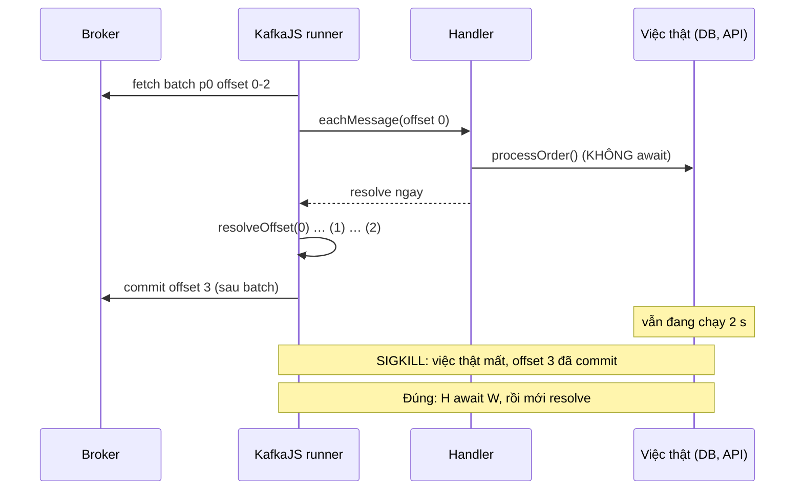
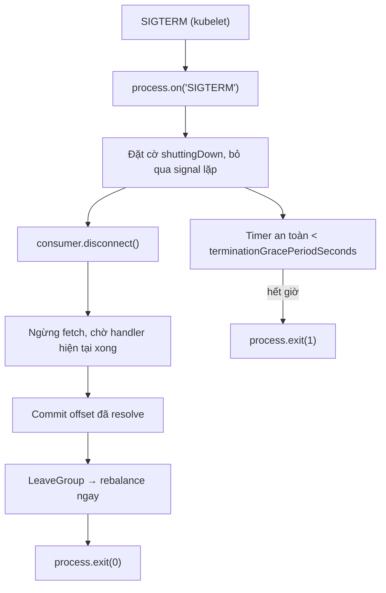
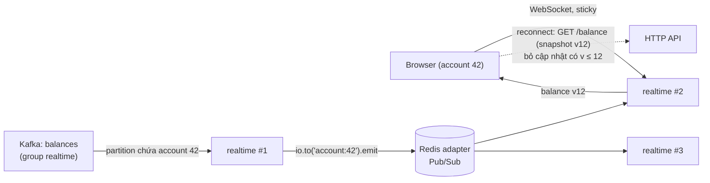

## Bối cảnh & vấn đề

Một nền tảng tài chính chạy Node.js: service `fulfilment` consume `orders.placed` bằng KafkaJS, service `realtime` consume `balances` và đẩy số dư mới tới trình duyệt qua Socket.IO. Trong một tuần có ba sự cố:

- Sau mỗi lần deploy, vài đơn hàng "biến mất": consumer group báo lag 0, nhưng đơn không được xử lý. Code có một dòng `processOrder(order).catch(log)` với comment "don't block the consumer".
- Deploy nào cũng làm một số đơn được xử lý hai lần, dù đã có "graceful shutdown" lấy từ một ghi chú nội bộ: `consumer.on('SIGTERM', ...)`.
- Sau khi scale `realtime` lên ba instance, một số người dùng gặp `400 Session ID unknown`, những người khác không nhận cập nhật số dư nữa.

Không cái nào là lỗi của Kafka hay Socket.IO. Chúng là lỗi khi đặt mô hình async của Node.js lên trên cơ chế offset và cơ chế kết nối của hai thư viện. Bài này đi qua cách viết consumer Node đúng (handler, heartbeat, commit, shutdown, back-pressure), lựa chọn client, rồi phần realtime: Socket.IO nhiều instance và độ tin cậy khi reconnect.

## Khái niệm

### KafkaJS và trạng thái của nó

**KafkaJS** là client Kafka viết bằng JavaScript thuần, API dễ dùng, phổ biến nhất trong hệ sinh thái Node nhiều năm. Release cuối là **2.2.4** (tháng 2/2023) và dự án không còn được maintain tích cực (verify trạng thái repo khi đọc bài này). Hệ quả: không có tính năng mới của Kafka (KIP-848, share groups, cooperative rebalance), không có idempotent producer mặc định, và rủi ro bảo mật/tương thích tăng dần.

**`@confluentinc/kafka-javascript`** là client do Confluent phát triển, dựa trên **librdkafka** (C), có hai API: một lớp **tương thích KafkaJS** (`KafkaJS.Kafka`, cho phép migrate dần) và API kiểu node-rdkafka. Nó hỗ trợ KIP-848, cooperative-sticky, static membership, transactions, và hiệu năng của librdkafka. Đổi lại: native addon (build image phải có binary đúng nền tảng, cẩn thận với Alpine/musl), một số option KafkaJS không hỗ trợ (`createPartitioner` bị từ chối), và semantics mặc định khác (đã thấy: isolation read_committed, idempotence tắt, `max.poll.interval.ms` thực tế gấp đôi).

### `eachMessage` vs `eachBatch`

- **`eachMessage`**: KafkaJS gọi handler cho từng message, **tuần tự trong một partition**; `partitionsConsumedConcurrently` (mặc định 1) cho phép xử lý song song **giữa** các partition. Khi handler resolve, KafkaJS đánh dấu offset (resolve) và auto-commit theo `autoCommitInterval`/`autoCommitThreshold`; nếu không đặt hai giá trị này, nó commit sau mỗi batch fetch. Heartbeat được gửi giữa các message.
- **`eachBatch`**: nhận cả batch của một partition; bạn tự `resolveOffset(offset)`, `commitOffsetsIfNecessary()`, và gọi **`heartbeat()`** trong vòng lặp dài. Dùng khi cần xử lý theo lô (bulk insert, bulk index) hoặc song song có kiểm soát trong batch.

Vì KafkaJS chạy heartbeat trên **cùng event loop** với handler, một batch xử lý lâu hơn `sessionTimeout` (mặc định 30 s) mà không gọi `heartbeat()` làm consumer bị đá khỏi group ([bài 5](/tracks/messaging-kafka/learn/rebalance-liveness)). Nếu `eachBatch` throw giữa chừng: các offset đã `resolveOffset` trước đó vẫn được commit (khi `eachBatchAutoResolve` hoặc khi bạn commit), phần còn lại sẽ được fetch và xử lý lại sau retry.

**Interview angle:** câu hỏi "khi nào phải tự gọi heartbeat()?" — trong `eachBatch` có vòng lặp lâu; với `eachMessage` thì một message không được lâu hơn session timeout.

### Handler fire-and-forget

Với mọi client, "message đã xử lý xong" được báo bằng việc **handler resolve**. Nếu handler khởi động việc async rồi trả về ngay (không `await`), client coi message xong và commit offset trong khi việc thật còn đang chạy. Pod bị kill (deploy, OOM, scale down) lúc đó → việc mất, offset đã qua, **không có lần thử lại**. Lỗi trong promise cũng bị `.catch(log)` nuốt mất.

Muốn song song mà không mất: `partitionsConsumedConcurrently` (song song giữa partition, giữ thứ tự trong partition), hoặc `eachBatch` với concurrency có giới hạn và chỉ resolve offset **liên tục** đã xong ([bài 4](/tracks/messaging-kafka/learn/consumer-groups-offsets-lag)), hoặc song song theo key bên trong partition (mỗi key một hàng đợi tuần tự).

**Interview angle:** red flag là "thêm try/catch là xong"; câu trả lời đúng bắt đầu bằng "handler phải await việc thật".

### Graceful shutdown

Kubernetes dừng pod bằng `SIGTERM`, chờ `terminationGracePeriodSeconds` (mặc định 30 s), rồi `SIGKILL`. Một consumer shutdown sạch phải: nhận signal **ở process** (`process.on("SIGTERM")`), ngừng fetch, chờ handler đang chạy xong, commit offset đã xử lý, rời group (LeaveGroup, để rebalance diễn ra ngay thay vì chờ session timeout), rồi thoát. Trong KafkaJS, `consumer.disconnect()` làm các bước này: nó chờ handler hiện tại, commit offset đã resolve, rồi rời group.

`terminationGracePeriodSeconds` phải lớn hơn thời gian xử lý tối đa của một message/batch cộng thời gian commit và disconnect; nếu không, `SIGKILL` đến trước và mọi thứ chưa commit được xử lý lại. Shutdown sạch **giảm** trùng; không loại bỏ nó (crash, OOM vẫn xảy ra), nên consumer vẫn phải idempotent.

**Interview angle:** follow-up "grace period bao lâu, cái gì giới hạn nó?" — ≥ p99 thời gian xử lý một batch + commit; bị giới hạn bởi tốc độ rollout chấp nhận được và preStop hook của LB.

### Back-pressure trong consumer

Kafka là **pull**: consumer chỉ nhận thêm khi nó đi lấy. Back-pressure vì vậy tự nhiên: **đừng lấy thêm** khi downstream không kịp. Công cụ: `consumer.pause([{ topic, partitions }])` và `resume()`, concurrency giới hạn, token bucket trước khi gọi API.

Khi downstream trả `429 Too Many Requests`: pause partition trong `Retry-After`, **không** commit message chưa gửi được, rồi resume và xử lý lại. Lag tăng trong lúc đó là **chấp nhận được**: Kafka giữ dữ liệu, miễn lag nằm trong retention và có alert. Hai lựa chọn sai: buffer vô hạn trong memory (OOM), và đẩy 429 sang DLQ (429 là transient).

Một chi tiết: partition bị pause vẫn được giữ trong group và heartbeat vẫn chạy, nên pause lâu không gây rebalance với KafkaJS; với Java/librdkafka, consumer vẫn phải gọi `poll()` đều (poll khi mọi partition bị pause trả về rỗng) để không vượt `max.poll.interval.ms`.

### Socket.IO nhiều instance

**Socket.IO** mặc định bắt đầu kết nối bằng **HTTP long-polling** rồi **upgrade** lên WebSocket. Mỗi session có `sid`; mọi request polling của session đó phải tới **cùng instance** đã tạo session, nếu không instance khác trả `400 Session ID unknown`. Vì vậy:

1. **Sticky session** ở load balancer (cookie hoặc IP hash) khi có polling. Nếu chỉ dùng `transports: ["websocket"]` thì không cần sticky (một kết nối TCP duy nhất), nhưng mất fallback cho mạng chặn WebSocket.
2. **Adapter** để broadcast giữa instance: `io.to("account:42").emit()` trên instance A chỉ tới client kết nối **A**. Client của account 42 đang ở B không nhận gì. `@socket.io/redis-adapter` (Redis Pub/Sub), Redis Streams adapter, hoặc cluster adapter chuyển broadcast sang mọi instance.

Với nguồn event là Kafka: nếu mọi instance `realtime` cùng một consumer group, mỗi event chỉ tới **một** instance (instance giữ partition đó), và adapter phát lại tới instance đang giữ socket của người dùng. Đó là thiết kế đúng. Cách khác: mỗi instance một group riêng (mọi instance nhận mọi event, emit cho socket cục bộ), không cần adapter cho luồng này nhưng mỗi instance đọc toàn bộ topic.

**Interview angle:** câu debug "400 Session ID unknown + broadcast chỉ tới một số user" có đúng hai đáp án: sticky session và adapter; điểm cộng là kiểm tra auth trước khi join room theo accountId.

### Độ tin cậy sau reconnect

Socket.IO và Redis Pub/Sub là **at-most-once**: event emit trong lúc client mất kết nối, hoặc lúc Redis adapter mất kết nối, là mất. Với dữ liệu tài chính (giá, số dư), "hiển thị sai sau reconnect" là bug nghiêm trọng. Các lớp bảo vệ:

- **Snapshot khi (re)connect**: client tải trạng thái hiện tại qua HTTP (hoặc server gửi snapshot ngay sau `connection`), rồi mới áp dụng cập nhật.
- **Sequence/version trên mỗi cập nhật**: client bỏ bản có version ≤ version đang có; phát hiện **lỗ hổng** (nhận v12 khi đang ở v10) và tự refetch.
- **Last-seen**: client gửi `lastSeq` khi reconnect, server gửi bù từ nguồn bền (Kafka offset, Redis Stream, DB).
- **Connection state recovery** của Socket.IO (v4.6+): server giữ packet của session bị ngắt trong `maxDisconnectionDuration` và phát lại; hữu ích cho mất kết nối ngắn, nhưng cần adapter hỗ trợ (Redis Streams adapter hỗ trợ, Redis Pub/Sub adapter thì không, verify) và không thay được snapshot.
- **Throttle/coalesce** giá cập nhật nhanh: gửi bản mới nhất mỗi 100–250 ms thay vì mọi tick.

## Cơ chế hoạt động

Vòng đời một consumer KafkaJS và các điểm mất/trùng:



Graceful shutdown đúng:



Socket.IO nhiều instance với Kafka làm nguồn:



## Ví dụ thực tế

Chạy thật: Kafka 4.2.0, Postgres 18.6, Redis 8.10.2, `kafkajs@2.2.4`, `socket.io@4.8.4`, `@socket.io/redis-adapter@8.3.0`, `redis@6.3.0`, Node 24.

### Fire-and-forget làm mất đơn

```ts
async function processOrder(order: { id: string }) {
  await sleep(2000);                                   // call payment API, write DB...
  await db.query("INSERT INTO processed_orders VALUES ($1)", [order.id]);
}
await c.run({
  eachMessage: async ({ message }) => {
    const order = JSON.parse(message.value!.toString());
    console.log(`received ${order.id} @${message.offset}`);
    processOrder(order).catch((err) => console.error(err)); // "don't block the consumer"
  },
});
await sleep(1000);
console.log("pod killed (rolling deploy) after 1s");
process.exit(137);
```

```text
received o-1 @0
received o-2 @1
received o-3 @2
pod killed (rolling deploy) after 1s

GROUP           TOPIC           PARTITION  CURRENT-OFFSET  LOG-END-OFFSET  LAG
fulfilment      orders.placed   0          3               3               0

 processed
-----------
         0

--- restart the pod
pod killed (rolling deploy) after 1s
```

Lag 0, mọi dashboard xanh, và không đơn nào được xử lý. Pod khởi động lại không nhận gì vì offset đã ở 3. Sửa: `await processOrder(order)`; parse lỗi thì gửi DLQ thay vì throw lặp lại; muốn song song thì `partitionsConsumedConcurrently` hoặc `eachBatch` + contiguous offset.

### `consumer.on("SIGTERM")` không phải signal handler

```ts
const c = kafka.consumer({ groupId: "sig-demo" });
c.on("SIGTERM" as any, async () => { await c.disconnect(); });
```

```text
consumer.on('SIGTERM') -> KafkaJSNonRetriableError: Event name should be one of consumer.events.HEARTBEAT, consumer.events.COMMIT_OFFSETS, consumer.events.GROUP_JOIN, consumer.events.FETCH, consumer.events.FETCH_START, consumer.events.START_BATCH_PROCESS, consumer.events.END_BATCH_PROCESS, consumer.events.CONNECT, consumer.events.DISCONNECT, consumer.events.STOP, consumer.events.CRASH, ...
```

`consumer.on` của KafkaJS chỉ nhận **instrumentation event** của chính consumer và ném lỗi ngay với tên lạ (TypeScript cũng báo lỗi kiểu nếu không ép `as any`). Signal của OS đến **process**: `process.on("SIGTERM")`. Nếu code gốc bắt và nuốt lỗi này (hoặc dùng client không kiểm tra tên event), handler không bao giờ chạy, pod bị `SIGKILL` sau grace period và offset chưa commit được xử lý lại ở mỗi lần deploy.

### Graceful shutdown đúng

```ts
let shuttingDown = false;
for (const sig of ["SIGTERM", "SIGINT"] as const) {
  process.on(sig, async () => {
    if (shuttingDown) return; shuttingDown = true;
    log(`${sig} received: stop fetching, wait for in-flight handler, commit, leave group`);
    const hardKill = setTimeout(() => { log("grace period exceeded, exiting"); process.exit(1); }, 25_000);
    try { await consumer.disconnect(); log("disconnected cleanly"); process.exit(0); }
    catch (e) { log("disconnect failed", e); process.exit(1); }
    finally { clearTimeout(hardKill); }
  });
}
consumer.on(consumer.events.COMMIT_OFFSETS, (e) => log("committed", JSON.stringify(e.payload.topics[0].partitions)));
await consumer.run({ eachMessage: async ({ message }) => {
  log(`start ${message.value} @${message.offset}`); await sleep(1500); log(`done  ${message.value} @${message.offset}`);
} });
```

Gửi `kill -TERM` sau 5 giây, khi `job-3` đang chạy:

```text
t=0.1s start job-0 @0
t=1.6s done  job-0 @0
t=1.6s start job-1 @1
t=3.1s done  job-1 @1
t=3.1s start job-2 @2
t=4.6s done  job-2 @2
t=4.6s start job-3 @3
t=4.9s SIGTERM received: stop fetching, wait for in-flight handler, commit, leave group
t=6.1s done  job-3 @3
t=6.1s committed [{"partition":"0","offset":"4"}]
t=6.1s disconnected cleanly
exit=0

GROUP           TOPIC           PARTITION  CURRENT-OFFSET  LOG-END-OFFSET  LAG
graceful-2      shutdown-demo   0          4               18              14
```

`disconnect()` chờ `job-3` xong, commit offset 4 (đúng: đã xong 0–3), rồi thoát với mã 0. Lần sau group bắt đầu từ `job-4`, không trùng. Cũng thấy được: trước SIGTERM không có commit nào dù đã xong 3 job, vì KafkaJS mặc định commit sau cả batch; một crash ở 4,5 s sẽ xử lý lại cả ba.

### Back-pressure với 429

API CRM giả cho 3 request mỗi cửa sổ 2 giây:

```ts
await c.run({ eachMessage: async ({ message, pause }) => {
  try { await crmUpsert(String(message.value)); log(`synced ${message.value} @${message.offset}`); }
  catch (e) {
    if (e instanceof TooManyRequests) {
      log(`429 on ${message.value}: pause partition ${e.retryAfterMs}ms (offset not committed)`);
      const resume = pause(); setTimeout(resume, e.retryAfterMs);
    }
    throw e;                                           // KafkaJS will re-deliver this offset after resume
  }
} });
```

```text
t=0.6s synced contact-0 @0
t=0.7s synced contact-1 @1
t=0.7s synced contact-2 @2
t=0.7s 429 on contact-3: pause partition 1270ms (offset not committed)
t=6.0s synced contact-3 @3
t=6.1s synced contact-4 @4
t=6.1s synced contact-5 @5
t=6.1s 429 on contact-6: pause partition 1849ms (offset not committed)
t=11.4s synced contact-6 @6
```

Message bị 429 không bị mất, không vào DLQ, và được xử lý lại sau khi resume. Khoảng nghỉ thực tế (~5 s) dài hơn `Retry-After` vì KafkaJS còn áp dụng backoff khi handler throw (retry/restart của runner, verify cấu hình `retry`); trong production, tự quản bằng pause/resume mà không throw (và không resolve offset) cho kết quả sát hơn.

### Socket.IO: không adapter, không sticky

Hai instance (3101, 3102). Client kết nối instance B bằng WebSocket và join room `account:1`; instance A (instance consume được event Kafka) emit tới room:

```ts
const client = connect("http://localhost:3102", { auth: { accountId: "1" }, transports: ["websocket"] });
client.on("balance", (v) => got.push(v));
a.to("account:1").emit("balance", 1200);           // node A received the Kafka event
```

Thêm một load balancer round-robin không sticky ở cổng 3100, client chỉ dùng polling:

```text
### no adapter
adapter=false: client on node B received []
node:3102 engine error -> 1 Session ID unknown
client connect_error: xhr post error
client disconnect: transport error
node:3102 engine error -> 1 Session ID unknown
### redis adapter
adapter=true: client on node B received [ 1200 ]
```

Không adapter: client ở B không nhận gì. Polling qua LB round-robin: request thứ hai của session tới instance khác, nhận `Session ID unknown` (engine error code 1), client mất kết nối. Thêm Redis adapter:

```ts
const pub = createClient({ url: "redis://localhost:56399" }); const sub = pub.duplicate();
await Promise.all([pub.connect(), sub.connect()]);
io.adapter(createAdapter(pub, sub));
```

thì emit từ A tới được client ở B. Auth nên làm ở `io.use()` (middleware handshake): xác thực token, lấy `accountId` từ token chứ không từ `handshake.auth` do client tự khai, rồi mới `join`.

### Migrate KafkaJS → confluent client (kế hoạch)

1. Bọc client sau một interface nội bộ (`publish(topic, key, value, headers)`, `subscribe(handler)`) nếu chưa có.
2. Đổi import sang `KafkaJS` của `@confluentinc/kafka-javascript`; sửa config: `kafkaJS: { ... }` block, bỏ `createPartitioner`, đặt rõ `idempotent`, `isolation`, `max.poll.interval.ms`.
3. Build image với binary librdkafka đúng nền tảng (glibc/musl, arm64/amd64); kiểm tra trên CI.
4. Bắt đầu từ consumer ít quan trọng; chạy song song (canary) và so sánh lag, throughput, error rate, rebalance, CPU/memory.
5. Test hành vi khác biệt trước khi chuyển consumer quan trọng: mapping key → partition (đã đo: giống KafkaJS khi dùng lớp compat), commit timing, xử lý lỗi trong handler, shutdown, rebalance (cooperative/KIP-848 bật thì callback khác), header encoding.

## Trade-offs & lựa chọn thay thế

| | KafkaJS 2.2.4 | `@confluentinc/kafka-javascript` | Java/Kotlin consumer |
| --- | --- | --- | --- |
| Implementation | JS thuần | librdkafka (native) | Client chính thức |
| Maintain | Không tích cực (release cuối 2023) | Confluent maintain | Apache Kafka |
| Heartbeat | Cùng event loop | Thread nền | Thread nền |
| Rebalance | Eager | Eager, cooperative-sticky, KIP-848 | Mọi loại |
| Idempotent producer mặc định | Không | Không | Có (từ 3.0) |
| Isolation mặc định | read_committed | read_committed | read_uncommitted |
| Build/deploy | Dễ | Native binary, Alpine cần chú ý | JVM |

| Socket.IO scale-out | Ưu | Nhược |
| --- | --- | --- |
| Sticky + polling fallback | Chạy được sau proxy chặn WebSocket | Cần LB hỗ trợ affinity; mất cân bằng khi scale |
| Chỉ WebSocket | Không cần sticky | Mất fallback |
| Redis Pub/Sub adapter | Đơn giản, phổ biến | At-most-once; không hỗ trợ connection state recovery |
| Redis Streams adapter | Chịu được Redis ngắt ngắn, hỗ trợ state recovery | Phức tạp hơn, tốn bộ nhớ Redis |
| Mỗi instance một Kafka group | Không cần adapter cho luồng Kafka | Mọi instance đọc toàn bộ topic |

Chọn thế nào: service Node mới nên dùng `@confluentinc/kafka-javascript` (hoặc client được maintain khác) thay vì KafkaJS; service cũ trên KafkaJS migrate theo kế hoạch trên, không cần vội nếu không cần tính năng mới, nhưng nên có lộ trình. Với Socket.IO: Redis adapter + sticky session là cấu hình chuẩn; dữ liệu quan trọng luôn có snapshot + sequence ở client, vì không adapter nào biến Socket.IO thành kênh bền.

## Edge cases & failure modes

- **Event loop bị chặn** (JSON lớn, crypto đồng bộ, vòng lặp nặng): KafkaJS không heartbeat được, consumer bị đá; Socket.IO ping timeout làm client reconnect hàng loạt. Đo event loop lag.
- **`partitionsConsumedConcurrently` > số partition được giao**: không có tác dụng; song song bị giới hạn bởi số partition.
- **Shutdown bị hai signal** (SIGTERM rồi SIGINT): không có cờ `shuttingDown` thì `disconnect()` chạy hai lần.
- **preStop và LB**: pod nhận SIGTERM trong khi LB vẫn gửi traffic HTTP/WebSocket mới vài giây; thêm `preStop: sleep 5` cho service có cả HTTP lẫn consumer.
- **Quên resume**: pause là trạng thái trong bộ nhớ của instance; nếu timer `resume` bị mất (bug, exception trước `setTimeout`), partition đứng mãi trong instance đó dù không có lỗi nào. Instance mới sau restart thì bắt đầu không pause. Alert theo lag theo partition bắt được trường hợp này.
- **Redis adapter mất kết nối**: emit trong lúc đó mất, không lỗi; client không biết. Snapshot khi reconnect và phát hiện lỗ hổng sequence là lớp bảo vệ.
- **Room theo dữ liệu client tự khai**: `` socket.join(`account:${socket.handshake.auth.accountId}`) `` cho phép ai cũng join room của người khác. Lấy id từ token đã xác thực.
- **Thundering reconnect**: deploy `realtime` làm 50.000 client reconnect và gọi snapshot API cùng lúc; cần jitter ở client và cache cho snapshot.

## Pitfalls

- ❌ `processOrder(order).catch(log)` trong handler → ✅ `await processOrder(order)`; song song bằng `partitionsConsumedConcurrently` hoặc `eachBatch` + contiguous offset.
- ❌ `consumer.on("SIGTERM", …)` → ✅ `process.on("SIGTERM", …)` gọi `consumer.disconnect()`, có timer an toàn.
- ❌ `terminationGracePeriodSeconds` mặc định 30 s với batch 60 s → ✅ grace period > thời gian batch tối đa + commit.
- ❌ Đẩy 429 vào DLQ hoặc buffer vô hạn → ✅ pause/resume theo `Retry-After`, để lag tăng có kiểm soát.
- ❌ `eachBatch` vòng lặp dài không `heartbeat()` → ✅ gọi `heartbeat()` định kỳ, `resolveOffset()` sau mỗi message xong.
- ❌ Giữ KafkaJS vô thời hạn cho service quan trọng → ✅ lộ trình migrate sang client được maintain, sau một interface nội bộ.
- ❌ Scale Socket.IO mà không adapter/sticky → ✅ Redis adapter + sticky session (hoặc chỉ WebSocket).
- ❌ Tin Socket.IO "không mất message" → ✅ snapshot khi reconnect + sequence ở client.

## Tóm tắt

- KafkaJS không còn được maintain tích cực; `@confluentinc/kafka-javascript` (librdkafka) có lớp API tương thích để migrate dần, nhưng khác default và là native addon.
- `eachMessage` tuần tự trong partition, tự resolve; `eachBatch` tự resolve/commit và phải gọi `heartbeat()` khi lâu, vì heartbeat của KafkaJS chạy cùng event loop.
- Handler phải await việc thật; fire-and-forget làm offset commit trước khi xong và mất dữ liệu khi pod bị kill (lag vẫn 0).
- Graceful shutdown: `process.on("SIGTERM")` → `disconnect()` (chờ handler, commit, leave group) → exit; grace period đủ dài; vẫn cần idempotency.
- Back-pressure: pause/resume partition, không commit việc chưa xong, lag tăng có alert; không DLQ cho 429.
- Socket.IO nhiều instance cần sticky session (khi có polling) và adapter (Redis) để broadcast giữa instance.
- Socket.IO/Redis Pub/Sub là at-most-once: snapshot khi reconnect, sequence/version ở client, coalesce cập nhật nhanh.
